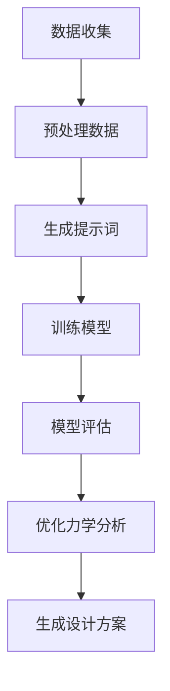

                 

# AI辅助建筑结构设计：提示词优化力学分析

> 关键词：AI、建筑结构设计、提示词优化、力学分析、深度学习

> 摘要：本文探讨了如何利用人工智能（AI）技术，特别是提示词优化方法，来辅助建筑结构设计中的力学分析。通过介绍AI在建筑领域中的应用背景，核心算法原理，数学模型与公式，以及实际项目案例，本文旨在为建筑设计师提供一种新的设计工具和方法。

---

## 第1章：引言与背景知识

### 1.1 AI辅助建筑结构设计的背景

建筑结构设计是建筑工程中的关键环节，涉及到力学、材料科学、数学等多个学科。传统的建筑结构设计主要依赖于设计师的经验和计算能力。然而，随着建筑物的复杂性和规模的增加，传统的设计方法已经难以满足现代建筑的需求。

近年来，人工智能（AI）技术在建筑领域的应用逐渐受到关注。AI可以通过学习和处理大量数据，提供更精确的设计方案，优化力学分析，提高建筑结构的可靠性和效率。AI在建筑结构设计中的应用主要包括以下几个方面：

1. **结构健康监测**：利用传感器和AI算法，实时监测建筑物的健康状况，预测潜在的问题。
2. **结构优化设计**：通过优化算法，自动调整建筑结构的尺寸和布局，以减少材料使用和提高结构性能。
3. **建筑材料识别**：使用图像识别技术，快速识别建筑材料，提高施工效率和质量。
4. **建筑仿真与分析**：利用仿真软件和AI算法，对建筑结构进行动态分析，评估其响应和性能。

### 1.2 AI技术在建筑领域的应用

AI技术在建筑领域中的应用日益广泛，其中最为重要的是机器学习和深度学习。这些技术通过学习大量的数据，能够自动识别模式和规律，从而提高设计效率和准确性。

1. **机器学习**：机器学习算法可以通过分析历史数据，预测建筑结构的设计需求。例如，线性回归和决策树算法可以用于预测建筑材料的消耗量。
2. **深度学习**：深度学习算法，如卷积神经网络（CNN）和循环神经网络（RNN），可以处理复杂的图像和序列数据。例如，CNN可以用于识别建筑物的结构缺陷，而RNN可以用于模拟建筑结构的动态响应。

### 1.3 提示词优化力学分析的重要性

在建筑结构设计中，力学分析是关键的一环。传统的力学分析方法通常需要大量的计算和人工干预。而提示词优化方法通过引入提示词，可以引导AI算法更快地找到最优的设计方案。

提示词优化力学分析的重要性体现在以下几个方面：

1. **提高设计效率**：提示词可以帮助AI算法快速聚焦于关键问题，减少不必要的计算。
2. **优化设计结果**：通过提示词的优化，可以进一步提高建筑结构的性能和可靠性。
3. **减少人工干预**：传统的力学分析往往需要大量的人工干预，而提示词优化可以降低这种干预，提高自动化程度。

## 第2章：提示词优化力学分析的核心概念与联系

### 2.1 提示词优化概述

提示词优化是一种基于机器学习和深度学习的优化方法，它通过引入提示词来引导算法的搜索过程，从而提高优化效率。在建筑结构设计中，提示词可以是材料的物理特性、结构的几何形状、设计约束等。

### 2.2 AI辅助力学分析模型

AI辅助力学分析模型的核心是机器学习和深度学习算法。这些算法通过分析大量的结构数据，学习到结构的力学特性，并能够预测新结构的性能。常见的机器学习算法包括线性回归、支持向量机（SVM）和随机森林等；而深度学习算法则包括卷积神经网络（CNN）、循环神经网络（RNN）和生成对抗网络（GAN）等。

### 2.3 神经网络与力学分析的连接

神经网络是深度学习的重要组成部分，它通过多层非线性变换来提取数据特征。在力学分析中，神经网络可以用来模拟结构的力学行为，例如，通过卷积神经网络（CNN）来识别结构的缺陷，通过循环神经网络（RNN）来模拟结构的动态响应。

### 2.4 提示词优化与力学分析的关系架构

提示词优化与力学分析的关系可以用一个Mermaid流程图来表示：

在上述流程中，数据收集和预处理是基础步骤，生成提示词是关键步骤，训练模型和模型评估是核心步骤，优化力学分析和生成设计方案是最终目标。

## 第3章：核心算法原理讲解

### 3.1 提示词生成算法

提示词生成算法是提示词优化的关键步骤。它通过分析大量数据，提取出与目标结构相关的关键特征，并将其转化为提示词。

#### 3.1.1 基于规则的方法

基于规则的方法是一种简单的提示词生成方法，它通过定义一系列规则来生成提示词。这种方法适用于规则明确且数据量较小的情况。

#### 3.1.2 基于机器学习的方法

基于机器学习的方法通过训练机器学习模型，从大量数据中自动提取特征，生成提示词。这种方法适用于数据量大且特征复杂的情况。

#### 3.1.3 基于深度学习的方法

基于深度学习的方法通过训练深度学习模型，从大量数据中自动提取高层次的抽象特征，生成提示词。这种方法适用于特征复杂且数据量大

