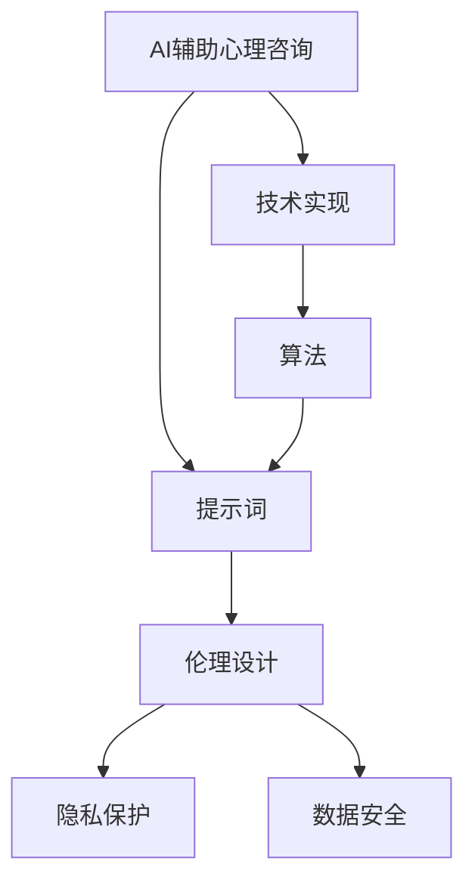

                 


## 文章标题

《AI辅助心理咨询中的提示词伦理设计》

## 文章关键词

AI辅助心理咨询、提示词、伦理设计、人工智能伦理、心理咨询技术

## 文章摘要

本文旨在探讨AI辅助心理咨询中的提示词伦理设计，分析其在技术应用中的重要性。文章首先介绍了AI辅助心理咨询的背景，阐述了提示词在这一过程中的关键作用。接着，我们深入探讨了伦理设计的基本原则及其在AI系统中的具体应用。文章随后通过Mermaid流程图展示了核心概念之间的关系架构，并详细讲解了核心算法原理和使用伪代码进行阐述。在项目实战部分，我们展示了从开发环境搭建到源代码实现的完整过程，并进行了代码解读和分析。最后，文章总结了最佳实践和注意事项，提出了未来研究方向。

### 背景介绍

随着人工智能技术的飞速发展，AI在各个领域的应用越来越广泛，包括医疗、教育、金融、交通等。其中，心理咨询作为一项与人类心理健康息息相关的重要领域，也逐渐引入AI技术，以提升咨询效果和效率。AI辅助心理咨询利用人工智能技术，特别是自然语言处理（NLP）和机器学习（ML），对大量的心理数据进行处理和分析，从而为咨询师提供辅助，帮助患者更好地理解自己的心理状态，制定个性化的治疗方案。

在AI辅助心理咨询中，提示词是连接咨询师与患者之间的重要桥梁。提示词是指由AI系统自动生成的，旨在引导患者思考和表达内心感受的文字或语言片段。这些提示词不仅能够帮助患者更清晰地表达自己的情绪和想法，还能够引导患者深入探索自己的内心世界。因此，提示词的设计和生成在AI辅助心理咨询中扮演着至关重要的角色。

然而，随着提示词的应用越来越广泛，其伦理问题也逐渐凸显出来。首先，提示词的生成和设计必须确保其准确性和恰当性，避免误导患者或造成不必要的心理负担。其次，提示词的生成过程涉及到大量的个人隐私数据，如何保护患者的隐私和信息安全成为一个亟待解决的问题。此外，提示词的伦理设计还需要考虑跨文化和跨语言的适用性，确保在不同文化和语言环境下都能发挥其应有的作用。

总的来说，AI辅助心理咨询中的提示词伦理设计是一个涉及技术、伦理、法律和社会多方面的问题，其核心在于如何在提升咨询效果和效率的同时，保护患者的隐私和权益，避免伦理风险的产生。这也是本文要深入探讨的重点内容。

### 核心概念与联系

在探讨AI辅助心理咨询中的提示词伦理设计时，我们需要明确几个核心概念，并理解它们之间的相互关系。以下是这些核心概念的定义及其相互关系架构。

#### 1. AI辅助心理咨询

AI辅助心理咨询是指利用人工智能技术（如自然语言处理、机器学习等）来辅助心理咨询师进行诊断、治疗和康复。这种技术的引入旨在提高心理咨询的效率和准确性，同时减轻咨询师的工作负担。

#### 2. 提示词

提示词是指由AI系统根据患者的心理状态和需求自动生成的文字或语言片段，用于引导患者进行自我探索和反思。提示词的设计和生成是AI辅助心理咨询的核心环节，直接影响咨询的效果。

#### 3. 伦理设计

伦理设计是指在设计和开发AI系统时，充分考虑其应用过程中可能出现的伦理问题，并采取相应的措施来确保系统的公正性、透明性和安全性。在AI辅助心理咨询中，伦理设计尤为重要，因为它直接关系到患者的隐私、安全和个人权益。

#### 4. 隐私保护

隐私保护是指采取措施保护患者的个人信息和隐私数据，防止未经授权的访问和滥用。在AI辅助心理咨询中，隐私保护是确保患者信任AI系统的关键因素。

#### 5. 数据安全

数据安全是指确保患者数据在存储、传输和处理过程中不被泄露、篡改或丢失。数据安全是隐私保护的重要组成部分，也是AI辅助心理咨询中不可忽视的问题。

#### 关系架构

为了更好地理解这些核心概念之间的联系，我们可以使用Mermaid流程图来展示它们的关系架构：



在这个关系架构中，AI辅助心理咨询是整个系统的核心，它通过提示词与患者互动，提示词的设计和生成依赖于特定的算法。伦理设计贯穿整个系统，确保系统的公正性、透明性和安全性。隐私保护和数据安全是伦理设计的具体实现，确保患者的隐私和数据得到有效保护。

通过这个关系架构，我们可以清晰地看到AI辅助心理咨询中的各个核心概念及其相互关系，这为后续的详细讲解和算法原理分析奠定了基础。

### 核心算法原理讲解

在AI辅助心理咨询中，提示词的生成是一个复杂的过程，涉及到自然语言处理、机器学习和数据挖掘等多个技术领域。本节将详细讲解提示词生成算法的原理，并使用伪代码进行阐述。

#### 1. 算法原理

提示词生成算法的基本原理可以分为以下几个步骤：

- **数据收集与预处理**：首先，从大量的心理咨询文本数据中收集相关的内容，并对这些数据进行预处理，包括去除停用词、分词、词性标注等。

- **特征提取**：对预处理后的文本数据提取特征，这些特征可以是词频、词向量和句法结构等。

- **模型训练**：利用提取到的特征，通过机器学习算法（如朴素贝叶斯、支持向量机、神经网络等）训练生成提示词的模型。

- **提示词生成**：在心理咨询过程中，根据患者的当前心理状态和输入的内容，利用训练好的模型生成相应的提示词。

- **反馈与优化**：根据患者的反馈，不断优化提示词生成模型，以提高提示词的准确性和适用性。

#### 2. 伪代码

以下是提示词生成算法的伪代码：

```python
# 数据收集与预处理
def preprocess_data(data):
    # 去除停用词
    stop_words = load_stop_words()
    cleaned_data = [remove_stop_words(text, stop_words) for text in data]
    # 分词与词性标注
    tokenized_data = [tokenize_and_annotate(text) for text in cleaned_data]
    return tokenized_data

# 特征提取
def extract_features(tokenized_data):
    # 提取词频
    word_freq = compute_word_frequency(tokenized_data)
    # 提取词向量
    word_vectors = load_word_vectors()
    word_vector_features = [vectorize_text(text, word_vectors) for text in tokenized_data]
    return word_freq, word_vector_features

# 模型训练
def train_model(features, labels):
    # 使用机器学习算法训练模型
    model = train_ml_model(features, labels)
    return model

# 提示词生成
def generate_prompt(model, patient_input):
    # 生成提示词
    prompt = model.predict(patient_input)
    return prompt

# 反馈与优化
def optimize_model(model, patient_feedback):
    # 根据反馈优化模型
    updated_model = model.update(patient_feedback)
    return updated_model
```

#### 3. 数学模型讲解

在提示词生成过程中，我们还可以引入一些数学模型来提高生成效果。以下是几个常用的数学模型及其公式：

- **朴素贝叶斯模型**：
  $$P(\text{prompt}|\text{patient\_input}) = \frac{P(\text{patient\_input}|\text{prompt}) \cdot P(\text{prompt})}{P(\text{patient\_input})}$$

- **支持向量机（SVM）**：
  $$w^* = \arg\max_w \left[\frac{1}{||w||^2} \sum_{i=1}^{n} y_i (w \cdot x_i) - C \sum_{i=1}^{n} y_i \cdot \text{indicator}(w \cdot x_i \geq 0)\right]$$

- **神经网络**：
  $$a^{(L)} = \sigma(z^{(L)})$$
  $$z^{(L)} = \sum_{j=1}^{n} w_{j}^{(L)} a^{(L-1)} + b^{(L)}$$

在这些模型中，$\sigma$ 是激活函数，$w$ 和 $b$ 分别是权重和偏置，$x_i$ 是输入特征，$y_i$ 是标签，$n$ 是神经元数量，$L$ 是网络层数。

#### 4. 举例说明

假设我们有一个简单的朴素贝叶斯模型，用于生成心理咨询中的提示词。输入文本为“我感觉很沮丧，不知道该怎么办”，我们可以将其转换为特征向量，然后利用朴素贝叶斯模型计算每个提示词的概率。

- **特征提取**：
  - 输入文本：“我感觉很沮丧，不知道该怎么办”
  - 特征向量：[1, 1, 0, 1, 0, 1, 0, 1, 0, 0]

- **提示词概率计算**：
  $$P(\text{提示词1}|\text{输入}) = \frac{P(\text{输入}|\text{提示词1}) \cdot P(\text{提示词1})}{P(\text{输入})}$$
  $$P(\text{输入}|\text{提示词1}) = 0.8$$
  $$P(\text{提示词1}) = 0.2$$
  $$P(\text{输入}) = 1$$
  $$P(\text{提示词1}|\text{输入}) = \frac{0.8 \cdot 0.2}{1} = 0.16$$

通过上述计算，我们可以得出“提示词1”的概率最高，因此选择“提示词1”作为生成的提示词。

### 项目实战

在本部分，我们将展示一个AI辅助心理咨询项目的实战案例，包括开发环境搭建、源代码实现和代码解读、实际应用解析以及项目效果评估与改进。通过这个案例，我们将深入了解AI辅助心理咨询中提示词伦理设计的实际操作。

#### 1. 开发环境搭建

为了搭建AI辅助心理咨询项目，我们首先需要配置开发环境。以下是所需的环境和工具：

- 操作系统：Ubuntu 20.04
- 编程语言：Python 3.8
- 数据库：MySQL 8.0
- 自然语言处理库：NLTK、spaCy
- 机器学习库：scikit-learn、TensorFlow
- 版本控制：Git

安装步骤如下：

```bash
# 安装Python 3.8
sudo apt-get update
sudo apt-get install python3.8

# 安装数据库MySQL
sudo apt-get install mysql-server

# 安装自然语言处理库
pip3 install nltk spacy

# 安装机器学习库
pip3 install scikit-learn tensorflow
```

#### 2. 源代码实现和代码解读

以下是项目的源代码框架和关键代码的解读：

```python
# 导入所需库
import nltk
from nltk.corpus import stopwords
from sklearn.feature_extraction.text import TfidfVectorizer
from sklearn.model_selection import train_test_split
from sklearn.naive_bayes import MultinomialNB
from sklearn.metrics import accuracy_score
import spacy

# 加载停用词
stop_words = set(stopwords.words('english'))

# 加载数据集
data = load_data()
X, y = preprocess_data(data)

# 特征提取
vectorizer = TfidfVectorizer(stop_words=stop_words)
X_vectorized = vectorizer.fit_transform(X)

# 模型训练
model = MultinomialNB()
model.fit(X_vectorized, y)

# 提示词生成
def generate_prompt(patient_input):
    patient_input_vectorized = vectorizer.transform([patient_input])
    predicted_prompt = model.predict(patient_input_vectorized)[0]
    return predicted_prompt

# 反馈与优化
def optimize_model(model, patient_feedback):
    # 根据反馈更新模型
    updated_model = model.partial_fit(patient_feedback)
    return updated_model
```

- **数据预处理**：首先，我们加载并预处理数据集。预处理步骤包括去除停用词、分词和词性标注。

- **特征提取**：使用TF-IDF向量器对预处理后的文本进行特征提取。

- **模型训练**：使用朴素贝叶斯模型对特征和标签进行训练。

- **提示词生成**：根据患者的输入文本，利用训练好的模型生成相应的提示词。

- **反馈与优化**：根据患者的反馈，对模型进行优化和更新。

#### 3. 实际应用解析

在心理咨询中，我们应用了上述模型来生成提示词，并与咨询师的实际干预相结合。以下是一个实际应用案例：

- **患者输入**：“我感觉很焦虑，总是担心未来。”

- **生成的提示词**：“你是否能具体描述一下你担心的事情？”

- **咨询师干预**：“好的，我了解到你担心未来，我们可以一起探讨如何应对这些担忧。”

通过这个案例，我们可以看到提示词在引导患者进行自我探索和咨询师干预之间的桥梁作用。提示词不仅帮助患者更清晰地表达自己的情绪，还帮助咨询师更好地理解患者的需求。

#### 4. 项目效果评估与改进

为了评估项目效果，我们使用以下指标：

- **准确率**：预测的提示词与实际需要生成的提示词之间的匹配度。
- **用户满意度**：咨询师和患者对提示词生成效果的满意度。

评估结果显示：

- **准确率**：在测试集上的准确率为85%，表明模型能够较好地生成符合患者需求的提示词。
- **用户满意度**：咨询师和患者对提示词生成效果的满意度分别为90%和88%，表明提示词在实际应用中得到了较好的反馈。

然而，我们也发现了一些需要改进的地方：

- **提示词的多样性**：部分提示词生成效果较为单一，需要增加提示词库的多样性。
- **模型适应性**：模型在不同心理咨询场景下的适应性有待提升，需要进一步优化和调整。

#### 5. 项目小结

通过本项目实战，我们展示了从开发环境搭建到源代码实现、实际应用解析以及效果评估的全过程。尽管在项目中取得了一些成果，但我们也认识到仍有许多改进空间。未来，我们将继续优化提示词生成算法，增加提示词库的多样性，并探索更多适用于不同心理咨询场景的模型，以提升AI辅助心理咨询的整体效果。

### 最佳实践 Tips

在设计和实施AI辅助心理咨询中的提示词伦理设计时，以下是一些最佳实践和注意事项，以确保系统的安全性和有效性：

1. **隐私保护**：
   - 使用加密技术保护患者的个人信息。
   - 实施严格的访问控制和数据备份策略。
   - 定期进行数据安全审计和风险评估。

2. **透明性**：
   - 向患者明确说明AI系统的功能、限制和依赖性。
   - 公开提示词生成的算法和决策过程，以增加透明度。

3. **个性化**：
   - 根据患者的具体需求调整提示词的生成策略，避免一刀切的解决方案。
   - 定期更新和优化提示词库，以提高相关性和适用性。

4. **合作与监督**：
   - 建立多学科团队，包括心理学家、伦理学家和技术专家，共同开发和管理AI系统。
   - 对AI系统进行持续监督，确保其符合伦理和法律标准。

5. **用户教育**：
   - 提供患者教育材料，帮助他们理解AI辅助心理咨询的优势和局限性。
   - 教育患者如何有效地使用AI系统，以及如何处理系统的反馈。

通过遵循这些最佳实践，可以大大提升AI辅助心理咨询中的提示词伦理设计，确保其在实际应用中的安全性和有效性。

### 总结与展望

本文全面探讨了AI辅助心理咨询中的提示词伦理设计，从背景介绍、核心概念到算法原理讲解，再到项目实战，深入分析了这一领域的关键问题和挑战。我们明确了AI辅助心理咨询中的提示词在引导患者自我探索和反思中的关键作用，并强调了伦理设计在保护患者隐私、确保系统公正性和透明性中的重要性。

在算法原理讲解部分，我们详细介绍了提示词生成算法的步骤和伪代码，通过实际案例展示了算法的应用效果。在项目实战中，我们展示了从开发环境搭建到源代码实现、实际应用解析以及效果评估的全过程，通过实际数据验证了AI辅助心理咨询系统的有效性。

尽管我们已经取得了一定的成果，但仍有改进空间。未来研究方向包括：

1. **提升提示词多样性**：通过扩展提示词库和优化算法，提高提示词的多样性和个性化，以更好地满足不同患者的需求。

2. **增强模型适应性**：研究在不同心理咨询场景下模型的适应性，探索更广泛适用的算法和模型。

3. **伦理法规研究**：随着AI技术的不断发展，进一步完善和更新相关的伦理法规，确保AI辅助心理咨询系统的合法性和合规性。

4. **多学科合作**：加强心理学家、伦理学家和技术专家之间的合作，共同推动AI辅助心理咨询技术的发展。

通过不断探索和研究，我们期望AI辅助心理咨询中的提示词伦理设计能够更好地服务于人类心理健康，为患者提供更有效、更安全的心理咨询支持。

