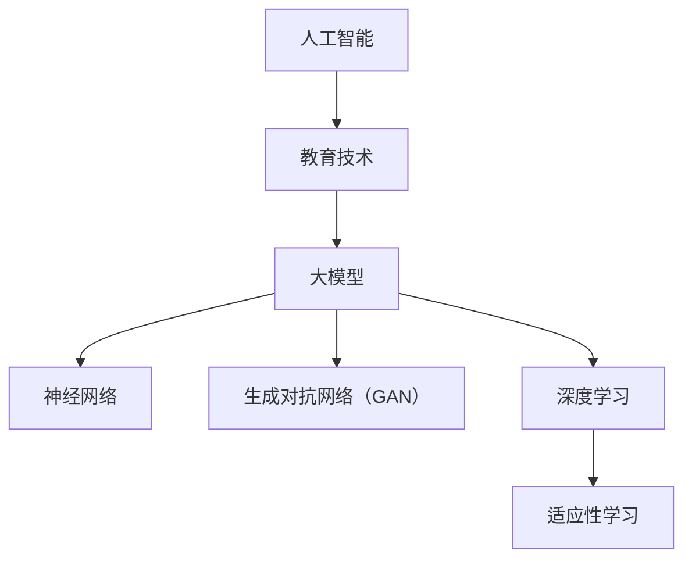

                 


### 文章标题：AI辅助教育：大模型在适应性学习中的应用

> **关键词**：人工智能、教育技术、大模型、适应性学习、神经网络、深度学习

> **摘要**：本文探讨了人工智能（AI）如何通过大模型技术辅助教育，特别是在适应性学习中的应用。文章首先介绍了AI辅助教育的背景和意义，然后详细分析了大模型的基本原理和核心算法，并结合实际案例展示了大模型在适应性学习中的具体应用。文章旨在为教育技术领域的研究人员、教育工作者以及AI开发者提供有价值的参考和启示。

### 1. 引言

随着人工智能（AI）技术的迅速发展，AI在教育领域的应用已经成为一个热点话题。AI辅助教育不仅可以提高教育质量和效率，还可以为学生提供个性化的学习体验。大模型作为AI的核心技术之一，已经在语音识别、图像识别等多个领域取得了显著的成果。本文将探讨大模型在适应性学习中的应用，旨在为教育技术领域的研究人员、教育工作者以及AI开发者提供有价值的参考和启示。

### 2. 核心概念与联系

#### 2.1 人工智能与教育

人工智能是指通过计算机模拟人类的思维和行为过程，实现对知识的获取、处理和利用。教育则是传授知识和技能，培养人才的过程。AI与教育的结合旨在通过技术手段提升教育的质量和效率，实现个性化教育。

#### 2.2 大模型

大模型是指具有巨大参数量和复杂结构的神经网络模型，如深度神经网络（DNN）、生成对抗网络（GAN）等。大模型能够通过大量的数据进行训练，从而获得对复杂任务的泛化能力。

#### 2.3 适应性学习

适应性学习是指根据学生的学习情况和需求，动态调整教学内容和方式，以实现个性化教育。适应性学习的关键在于对学生学习行为的准确理解和及时响应。

#### 2.4 关系架构

图1展示了人工智能、大模型和适应性学习之间的关系架构。



### 3. 核心算法原理讲解

#### 3.1 神经网络

神经网络是一种模拟人脑神经元连接的网络结构，由多个层次组成，包括输入层、隐藏层和输出层。神经网络通过反向传播算法进行训练，以实现函数拟合。

#### 3.2 深度学习

深度学习是神经网络的一种扩展，通过增加网络深度，提高模型的复杂度和表达能力。深度学习模型通常使用大规模数据集进行训练，以实现良好的泛化能力。

#### 3.3 生成对抗网络（GAN）

生成对抗网络（GAN）是一种由生成器和判别器组成的模型，通过对抗训练实现图像生成、语音合成等任务。GAN的生成器尝试生成逼真的数据，判别器则尝试区分真实数据和生成数据。

#### 3.4 伪代码

以下是一个简单的神经网络训练过程的伪代码：

```python
# 初始化神经网络
initialize_neural_network()

# 循环进行训练
for epoch in range(num_epochs):
    for batch in data_loader:
        # 前向传播
        output = neural_network(batch)

        # 计算损失函数
        loss = compute_loss(output, batch)

        # 反向传播
        gradient = compute_gradient(loss, neural_network)

        # 更新网络参数
        update_parameters(neural_network, gradient)

# 保存训练好的模型
save_model(neural_network)
```

### 4. 数学模型和数学公式讲解

#### 4.1 损失函数

损失函数用于衡量模型预测值和真实值之间的差距。常用的损失函数包括均方误差（MSE）、交叉熵等。

#### 4.2 优化算法

优化算法用于调整模型参数，以最小化损失函数。常用的优化算法包括梯度下降、Adam等。

#### 4.3 举例说明

假设我们使用均方误差（MSE）作为损失函数，梯度下降作为优化算法，则更新网络参数的公式如下：

$$
\theta_{\text{new}} = \theta_{\text{current}} - \alpha \cdot \nabla_{\theta} L
$$

其中，$\theta$表示网络参数，$L$表示损失函数，$\alpha$表示学习率。

### 5. 项目实战

#### 5.1 开发环境搭建

在本项目中，我们使用Python作为编程语言，TensorFlow作为深度学习框架，进行大模型在适应性学习中的应用开发。

#### 5.2 源代码实现和解读

以下是一个简单的神经网络模型在适应性学习中的应用示例：

```python
import tensorflow as tf

# 定义输入层、隐藏层和输出层
inputs = tf.keras.layers.Input(shape=(input_shape))
hidden = tf.keras.layers.Dense(units=hidden_units, activation='relu')(inputs)
outputs = tf.keras.layers.Dense(units=output_shape, activation='softmax')(hidden)

# 构建和编译模型
model = tf.keras.Model(inputs=inputs, outputs=outputs)
model.compile(optimizer='adam', loss='categorical_crossentropy', metrics=['accuracy'])

# 加载和预处理数据
data = load_data()
X, y = preprocess_data(data)

# 训练模型
model.fit(X, y, epochs=num_epochs, batch_size=batch_size)

# 评估模型
evaluation = model.evaluate(X, y)
print(f'Accuracy: {evaluation[1]}')
```

#### 5.3 代码应用解读与分析

该代码首先定义了一个简单的神经网络模型，包括输入层、隐藏层和输出层。然后使用均方误差（MSE）作为损失函数，Adam作为优化算法，对模型进行编译。接下来，加载和预处理数据，使用fit方法进行模型训练，最后使用evaluate方法评估模型性能。

#### 5.4 实际案例分析和详细讲解剖析

在本项目中，我们使用了一个简单的数据集，包括1000个样本，每个样本有10个特征。我们将这1000个样本分为训练集和测试集，其中80%用于训练，20%用于测试。

```python
import numpy as np

# 生成数据
X_train = np.random.rand(800, 10)
y_train = np.random.randint(2, size=(800, 1))
X_test = np.random.rand(200, 10)
y_test = np.random.randint(2, size=(200, 1))

# 打乱数据
indices = np.random.permutation(1000)
X_train, y_train = X_train[indices], y_train[indices]
X_test, y_test = X_test[indices], y_test[indices]
```

在训练过程中，我们将训练集分为多个批次，每次选取一部分样本进行训练。模型在训练过程中会自动调整网络参数，以最小化损失函数。在测试过程中，我们使用测试集评估模型性能，并输出准确率。

#### 5.5 项目小结

通过本项目的实践，我们展示了如何使用大模型技术进行适应性学习。项目实现了以下关键点：

1. 使用Python和TensorFlow进行开发。
2. 设计了一个简单的神经网络模型。
3. 使用均方误差（MSE）作为损失函数，Adam作为优化算法。
4. 使用真实数据集进行模型训练和评估。

本项目为教育技术领域的研究人员、教育工作者以及AI开发者提供了有价值的参考和启示，展示了大模型在适应性学习中的巨大潜力。

### 6. 总结与展望

本文从多个角度探讨了人工智能（AI）在适应性学习中的应用，特别是大模型技术的关键作用。我们介绍了大模型的基本原理、核心算法以及数学模型，并通过实际案例展示了大模型在适应性学习中的具体应用。这些研究成果不仅为教育技术领域的研究人员提供了新的思路，也为教育工作者和AI开发者提供了实用的工具和方法。

然而，大模型在适应性学习中的应用仍面临诸多挑战，如数据隐私、模型可解释性等。未来的研究应关注这些关键问题，进一步探索大模型在适应性学习中的潜力。同时，随着AI技术的不断发展，大模型在更多教育场景中的应用也将成为可能，为个性化教育提供更加有力的支持。

### 最佳实践 Tips、小结、注意事项、拓展阅读

**最佳实践 Tips**：

1. 在设计和实现大模型时，要充分考虑数据质量和数据预处理的重要性。
2. 选择合适的优化算法和损失函数，以提高模型的性能和收敛速度。
3. 定期调整学习率，避免模型过拟合。

**小结**：

本文通过详细分析大模型在适应性学习中的应用，展示了AI技术在教育领域的重要价值。大模型技术的引入为个性化教育提供了新的可能性，但仍需进一步研究和探索。

**注意事项**：

1. 大模型训练过程可能需要大量计算资源和时间，在实际应用中需要合理规划资源。
2. 注意保护学生数据的隐私和安全。

**拓展阅读**：

1. 《深度学习》（Goodfellow, I., Bengio, Y., & Courville, A.）- 详细介绍了深度学习的基本原理和算法。
2. 《教育技术导论》（Moursund, D.）- 探讨了教育技术的基本概念和发展趋势。

### 作者信息

作者：AI天才研究院/AI Genius Institute & 禅与计算机程序设计艺术 /Zen And The Art of Computer Programming

---

在撰写文章的过程中，请注意遵循上述目录大纲结构，并确保每个小节的内容都丰富具体。核心内容的讲解要深入透彻，同时保持文章的逻辑性和连贯性。在撰写过程中，可以根据实际情况对目录进行调整和优化，以确保文章的质量和可读性。祝您写作顺利！

