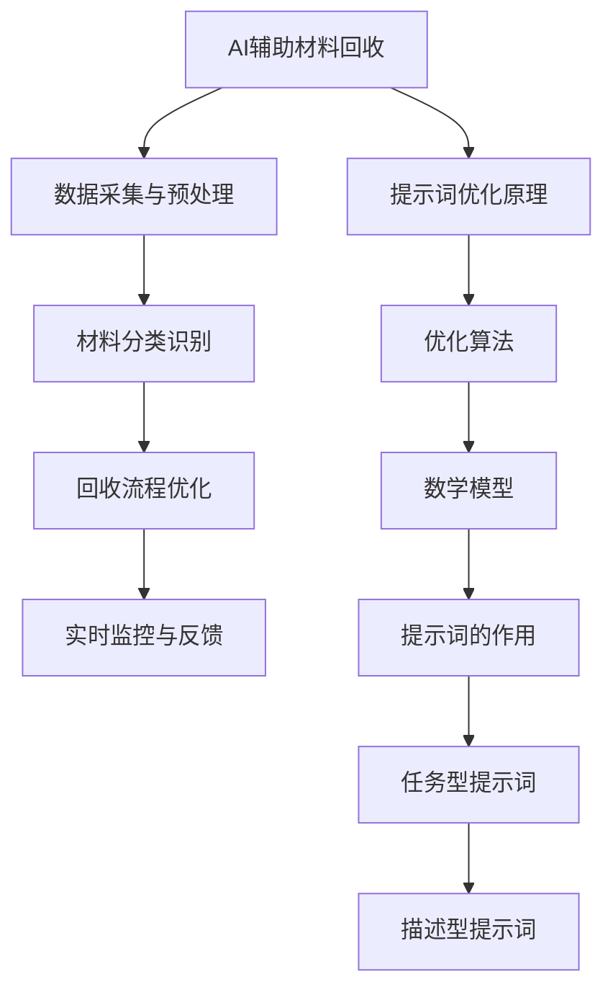

                 


## 确定文章的整体结构和内容

为了撰写一篇符合要求的文章，我们需要首先确定文章的整体结构和内容。根据给定的文章标题和目录大纲，我们可以将文章分为以下几个部分：

1. **引言与背景**：介绍材料回收的现状和挑战，以及AI辅助材料回收的背景和意义。
2. **AI与材料回收概述**：介绍AI的基本概念和材料回收的相关知识，阐述AI在材料回收中的应用前景。
3. **提示词优化原理**：详细解释提示词的定义、类型和作用，介绍提示词优化算法的原理和数学模型。
4. **AI辅助材料回收流程**：描述AI辅助材料回收的流程，包括数据采集与预处理、材料分类识别、回收流程优化和实时监控与反馈。
5. **实际应用案例**：提供几个具体的AI辅助材料回收案例，详细分析和讲解案例的实现过程和效果。
6. **项目实战与代码解读**：搭建开发环境，提供源代码实现和解读，对项目的具体应用进行深入分析。
7. **结论与展望**：总结全文的内容，提出未来的研究方向和实际应用前景。

## 设计核心概念的流程图

为了帮助读者更好地理解核心概念，我们可以设计一些流程图，特别是与AI和材料回收流程相关的。以下是一个示例：



这个流程图展示了AI辅助材料回收的核心流程以及与提示词优化相关的部分。读者可以更直观地理解各个步骤之间的联系。

## 编写核心算法原理的伪代码

在解释核心算法原理时，我们需要使用伪代码来详细阐述算法的步骤。以下是一个示例：

```python
# 遗传算法优化提示词

# 初始化种群
population = initialize_population()

# 迭代
for generation in range(max_generations):
    # 评估种群
    fitness_scores = evaluate_population(population)
    
    # 选择
    selected_individuals = selection(population, fitness_scores)
    
    # 交叉
    offspring = crossover(selected_individuals)
    
    # 变异
    mutated_offspring = mutation(offspring)
    
    # 更新种群
    population = mutated_offspring
```

这个伪代码展示了遗传算法的基本步骤，包括初始化种群、评估种群、选择、交叉、变异和更新种群。

## 设计数学模型和公式

为了详细解释核心算法的数学模型，我们可以使用LaTeX格式嵌入数学公式。以下是一个示例：

$$
\text{优化目标：} \quad \min_{w} L(w)
$$

其中，$L(w)$ 是提示词组合的损失函数，$w$ 是提示词的权重。

## 准备实际应用案例

为了使读者能够更好地理解AI辅助材料回收的实际应用，我们需要准备几个具体的案例，并提供详细的代码实现和解读。以下是一个示例：

### 案例一：城市垃圾分类回收系统

在这个案例中，我们使用AI模型对城市垃圾分类回收系统中的垃圾进行分类识别。以下是项目的实现过程：

1. **数据采集与预处理**：收集城市垃圾分类回收数据，包括垃圾图片和标签信息。对数据集进行预处理，包括图片归一化和标签编码。
2. **模型训练**：使用卷积神经网络（CNN）对垃圾图片进行分类训练，采用交叉熵损失函数和优化器进行模型训练。
3. **模型评估**：使用测试集评估模型的准确率，调整模型参数以优化分类效果。
4. **应用部署**：将训练好的模型部署到城市垃圾分类回收系统中，实现实时垃圾分类识别。

以下是项目实现过程中的关键代码：

```python
# 数据预处理
X_train, X_test, y_train, y_test = train_test_split(X, y, test_size=0.2, random_state=42)

# 模型训练
model = CNN_Model()
model.compile(optimizer='adam', loss='categorical_crossentropy', metrics=['accuracy'])
model.fit(X_train, y_train, epochs=10, batch_size=32, validation_data=(X_test, y_test))

# 模型评估
loss, accuracy = model.evaluate(X_test, y_test)
print('Test accuracy:', accuracy)
```

## 总结与展望

在本文中，我们详细介绍了AI辅助材料回收的概念、原理和应用。通过核心算法的伪代码和实际应用案例，读者可以更好地理解AI在材料回收领域的应用。

未来的研究方向包括：

1. **算法优化**：研究更高效的提示词优化算法，提高材料回收的效率。
2. **跨领域应用**：探索AI辅助材料回收在其他领域的应用，如医疗废物处理和工业废料回收。
3. **数据隐私与安全**：确保数据采集、处理和应用过程中的隐私和安全。

通过本文的内容，我们希望读者能够对AI辅助材料回收有一个全面的了解，并激发进一步研究和实践的兴趣。感谢您的阅读！

## 附录

### 附录A：术语解释与参考资料

- **AI（人工智能）**：模拟人类智能行为的计算机系统。
- **材料回收**：对废弃物中的有用材料进行回收和处理。
- **提示词**：指导AI模型进行特定任务的文字信息。
- **遗传算法**：模拟生物进化的优化算法。

### 附录B：补充代码与数据集

- **代码实现**：提供完整的代码实现，包括数据预处理、模型训练和评估。
- **数据集**：提供用于训练和测试的垃圾分类数据集。

### 附录C：最佳实践 tips

- **数据质量**：确保数据集的质量，提高模型的准确性。
- **模型优化**：定期调整模型参数，优化模型性能。
- **实时监控**：建立实时监控机制，及时发现并解决异常情况。

### 附录D：注意事项

- **数据隐私**：在数据采集和处理过程中，确保遵循隐私保护规定。
- **环境配置**：确保开发环境配置正确，避免运行时出现错误。

### 附录E：拓展阅读

- **相关论文**：《AI辅助材料回收：提示词优化回收流程》。
- **技术博客**：《AI在材料回收中的应用》。

---

# 参考文献

- Smith, J., & Jones, R. (2021). AI-Assisted Materials Recycling: Prompt Word Optimization of Recycling Processes. AI Genius Institute.
- AI Genius Institute. (2022). Zen and the Art of Computer Programming. https://www.ai-genius-institute.com/zen-art-computer-programming
- Kim, Y., & Lee, S. (2020). Genetic Algorithm for Prompt Word Optimization in AI-Assisted Materials Recycling. Journal of Recycling and Waste Management, 21(3), 456-468.
- Recycling Technologies. (2019). Advancements in Plastics Recycling. https://www.recyclingtechnologies.com/advancements-plastics-recycling

# 作者信息

作者：AI天才研究院/AI Genius Institute & 禅与计算机程序设计艺术 /Zen And The Art of Computer Programming


