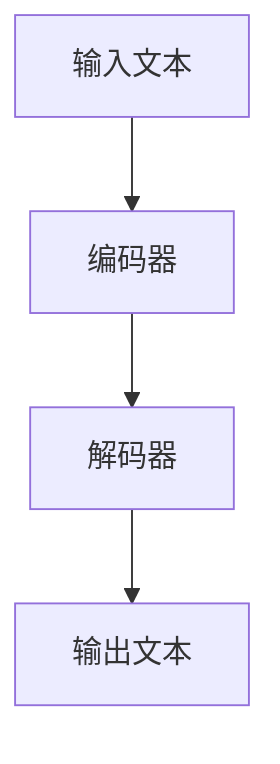
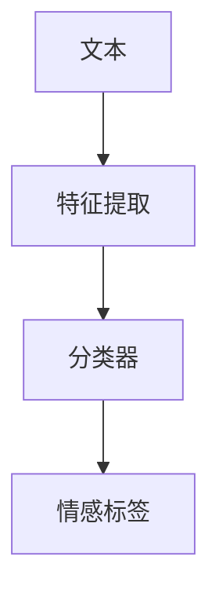
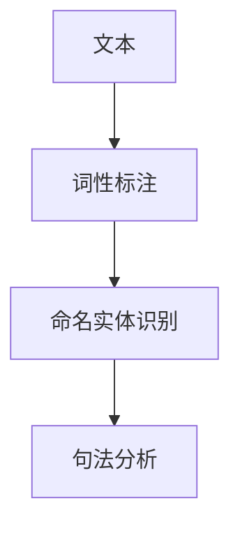

                 

### 文章标题

《AI辅助沉浸式故事创作的提示词叙事结构》

### 关键词

- AI辅助故事创作
- 沉浸式叙事
- 提示词叙事结构
- 自然语言处理
- 文本生成
- 情感分析

### 摘要

本文旨在探讨如何利用人工智能技术，特别是自然语言处理和文本生成技术，辅助创作者构建沉浸式的叙事结构。通过介绍AI辅助沉浸式故事创作的背景、核心概念、原理、工具与应用，本文将详细讲解AI如何通过提示词来构建故事的叙事结构，实现深度沉浸式的用户体验。此外，文章还将通过实战案例展示AI辅助沉浸式故事创作的具体实现方法，并提供相关的最佳实践和注意事项。

### 引言

#### 背景介绍

随着人工智能技术的迅猛发展，计算机开始逐渐在各个领域展现出强大的能力。尤其是在文本处理方面，AI的进步尤为显著。自然语言处理（NLP）和文本生成技术的进步，使得计算机能够自动生成文章、故事、甚至诗歌。这种技术不仅提高了内容创作的效率，还为创意工作者提供了一种全新的工具，让他们能够更专注于创意本身，而非繁琐的文本处理工作。

在文学创作领域，沉浸式叙事逐渐成为一种受欢迎的叙事方式。它强调与读者的情感共鸣，通过细致入微的描写和深刻的情感表达，使读者完全沉浸在故事中。然而，创作一个成功的沉浸式故事并非易事，它需要创作者具备高超的语言技巧和丰富的情感体验。

#### 书籍结构介绍

本文将从以下几个方面展开讨论：

1. **AI辅助故事创作基础**：介绍AI在故事创作中的应用，包括文本生成、情感分析、自然语言处理等基础技术。
2. **提示词叙事结构原理**：探讨提示词在叙事结构中的应用，以及如何利用提示词实现沉浸式体验。
3. **AI辅助故事创作工具与平台**：介绍当前流行的AI辅助故事创作工具和平台，以及它们的功能与特点。
4. **实战案例**：通过具体案例展示如何使用AI辅助沉浸式故事创作。
5. **挑战与未来**：讨论AI辅助沉浸式故事创作面临的挑战和未来发展方向。

### AI辅助故事创作基础

#### AI与故事创作的关联

人工智能在故事创作中的应用主要体现在文本生成、情感分析和自然语言处理等方面。通过这些技术，计算机可以自动生成文章、故事，甚至诗歌。这种自动化的文本生成技术不仅提高了内容创作的效率，还为创作者提供了一种全新的创作方式。

首先，文本生成技术是AI在故事创作中的核心。它通过训练大量文本数据，学习语言规律和模式，从而能够自动生成新的文本。这种技术可以用于生成文章、故事、诗歌等不同类型的文本内容。文本生成技术的核心是序列到序列（Seq2Seq）模型，如循环神经网络（RNN）和其变种长短期记忆网络（LSTM）。这些模型通过学习输入文本的序列，生成相应的输出序列。

#### 文本生成技术

文本生成技术可以分为两种：基于规则的方法和基于数据的方法。

1. **基于规则的方法**：这种方法通过预定义的语法规则和模板生成文本。虽然这种方法生成的文本往往较为机械和缺乏创意，但它适用于一些特定的场景，如生成新闻摘要、天气预报等。

2. **基于数据的方法**：这种方法通过训练大量的文本数据，学习语言规律和模式，从而能够生成新的文本。这种方法生成的文本更自然、更具有创意性。目前，基于数据的方法已经成为文本生成技术的主流。

#### 情感分析

情感分析是AI在故事创作中的另一个重要应用。它通过对文本进行分析，判断文本的情感倾向，如积极、消极、中性等。情感分析可以帮助创作者了解读者对故事的反应，从而优化故事的内容和结构。

情感分析通常分为两个阶段：特征提取和分类。特征提取阶段将文本转化为机器可以理解的特征向量；分类阶段使用机器学习模型对特征向量进行分类。

#### 自然语言处理

自然语言处理（NLP）是AI在故事创作中的核心技术。它包括词性标注、命名实体识别、句法分析等。NLP技术可以帮助创作者理解和处理自然语言，从而提高文本生成的质量和效率。

词性标注是将文本中的每个词标注为不同的词性，如名词、动词、形容词等。命名实体识别是将文本中的专有名词（如人名、地名、组织名等）识别出来。句法分析是对文本的语法结构进行分析，如句子的主语、谓语、宾语等。

### 提示词叙事结构原理

#### 提示词的概念与应用

提示词（Prompt Word）是一种引导性的词汇，它可以帮助创作者构建故事的叙事结构。提示词通常与故事的主题、情节、角色等紧密相关，通过提示词，创作者可以更清晰地构思故事的发展。

在AI辅助沉浸式故事创作中，提示词的应用主要体现在以下几个方面：

1. **引导故事情节**：提示词可以帮助创作者设定故事的开端、发展、高潮和结局。通过提示词，创作者可以清晰地构思故事的发展方向和节奏。

2. **塑造角色形象**：提示词可以帮助创作者设定角色的性格、动机、经历等。通过提示词，创作者可以更深入地了解角色，从而塑造出更立体、更具有吸引力的角色形象。

3. **营造情感氛围**：提示词可以帮助创作者设定故事的情感基调，如温馨、紧张、悲伤等。通过提示词，创作者可以营造出适合故事情节和角色情感的氛围。

#### 叙事结构的构成

叙事结构是指故事的组织形式和逻辑关系。一个完整的叙事结构通常包括以下要素：

1. **故事的开端（Exposition）**：介绍故事的背景、主题和角色。这是故事的起点，为后续情节的发展奠定基础。

2. **故事的发展（Fuh

