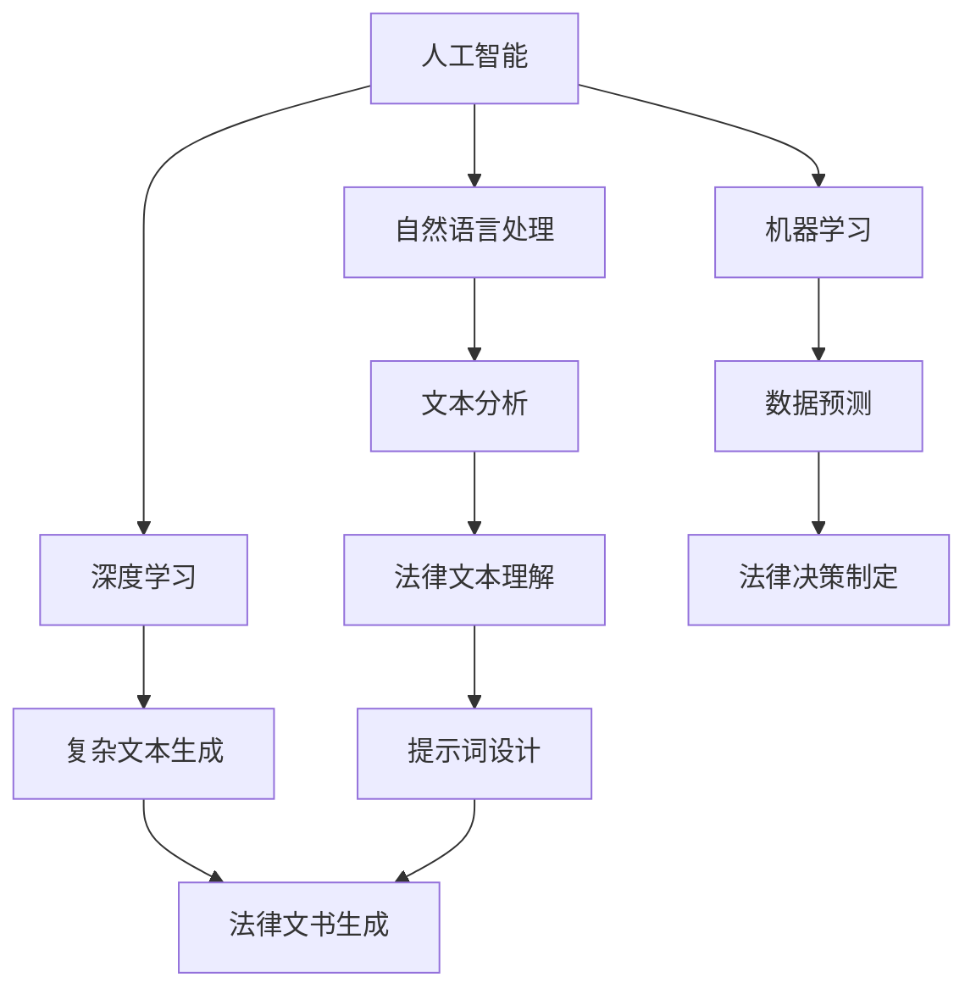

                 

### 背景介绍

在现代法律实践中，法律文书的起草是一个既复杂又耗时的过程。传统的法律文书起草主要依靠律师或法律助理的手动操作，他们需要深入理解法律条文、案件背景、相关证据和先例，从而准确、严谨地完成法律文书。然而，随着案件量的增加和法律条文的日益复杂，这一过程变得越来越困难。

近年来，人工智能（AI）技术的发展为法律文书起草带来了新的可能性。AI技术，特别是自然语言处理（NLP）和机器学习（ML），可以在文本分析、法律条文理解、案例匹配等方面提供强有力的支持。通过这些技术的应用，AI能够辅助法律专业人士快速生成高质量的法律文书，提高工作效率，降低错误率。

其中，提示词（prompt）在AI辅助法律文书起草中起到了关键作用。提示词是提供给AI系统的一个引导性输入，它能够指导AI理解任务的背景、目标和所需的信息。在法律领域，提示词可以包括案件的关键信息、法律条文、相关证据等。通过设计合适的提示词，AI能够更准确地生成符合法律要求、逻辑严密的法律文书。

本文将深入探讨AI辅助法律文书起草的背景、核心概念和实际应用。首先，我们将介绍AI技术原理与自然语言处理的基本概念，并解释提示词在法律论证中的作用。接着，我们将详细介绍常用的AI模型及其在法律文书起草中的应用。随后，通过实际案例展示AI辅助法律文书起草的效果，并提供实用的实战指导。最后，我们将探讨AI在法律论证中的具体应用，分析其挑战与机遇，并展望未来AI辅助法律文书起草的发展趋势。

通过对上述内容的逐步分析，本文旨在为法律专业人士、AI技术从业者以及对该领域感兴趣的读者提供全面、深入的了解，帮助读者把握AI辅助法律文书起草的核心技术和未来方向。  

----------------------------------------------------------------

# 核心概念与联系

在讨论AI辅助法律文书起草时，理解几个核心概念之间的联系至关重要。这些概念包括人工智能（AI）、自然语言处理（NLP）、机器学习（ML）、深度学习（DL）以及提示词（prompt）。

## 人工智能（AI）

人工智能是使计算机系统能够模拟人类智能行为的科学和工程领域。它涉及多个子领域，包括机器学习、自然语言处理、计算机视觉等。在法律文书起草中，AI的应用主要体现在文本分析和生成上。

## 自然语言处理（NLP）

自然语言处理是人工智能的一个子领域，专注于使计算机能够理解、解释和生成人类语言。NLP在法律文书起草中的应用主要包括文本分类、实体识别、语义解析等。通过这些技术，AI可以理解法律文本中的含义和结构。

## 机器学习（ML）

机器学习是使计算机从数据中学习并做出决策或预测的方法。在法律文书起草中，机器学习算法可以用于分析案件数据、预测法律结果、生成法律条款等。

## 深度学习（DL）

深度学习是机器学习的一个分支，它使用复杂的神经网络模型来处理大量数据。在法律文书起草中，深度学习模型（如神经网络）可以用于生成复杂的法律文本，如判决书、合同等。

## 提示词（prompt）

提示词是提供给AI系统的一个引导性输入，用于指导AI理解任务的背景、目标和所需的信息。在法律领域，提示词可以包括案件的关键信息、法律条文、相关证据等。通过设计合适的提示词，AI能够更准确地生成符合法律要求、逻辑严密的法律文书。

### 关系架构

为了更好地理解这些概念之间的联系，我们可以使用Mermaid流程图来展示它们之间的关系：



在这个流程图中，我们可以看到：

1. 人工智能是整个系统的核心，它涵盖了自然语言处理、机器学习和深度学习。
2. 自然语言处理负责理解和生成法律文本。
3. 机器学习和深度学习用于处理数据并生成预测和复杂文本。
4. 提示词设计是法律文本理解的关键，它直接影响法律文书生成的质量。

通过这个关系架构，我们可以更清晰地理解AI辅助法律文书起草的核心概念和它们之间的相互作用。这为后续的深入讨论和实际应用奠定了基础。在下一部分中，我们将详细介绍这些核心概念的具体原理和应用。

### 人工智能技术原理

在深入探讨AI辅助法律文书起草的实际应用之前，我们需要先了解人工智能技术的基本原理，特别是自然语言处理（NLP）和机器学习（ML）。这些技术为AI在法律领域的应用提供了强大的支持。

#### 自然语言处理（NLP）

自然语言处理是人工智能的一个子领域，它致力于使计算机能够理解、解释和生成人类语言。NLP的关键技术包括文本分类、实体识别、语义解析等。

1. **文本分类**：文本分类是将文本数据分配到预定义的类别中的一种任务。例如，在法律文书起草中，可以将文本分类为合同、判决书、诉讼状等。这通常通过训练分类模型来实现，例如支持向量机（SVM）、朴素贝叶斯分类器等。

2. **实体识别**：实体识别是识别文本中的特定对象或实体，如人名、地名、法律条款等。这一过程可以通过命名实体识别（NER）技术实现。常见的NER模型包括基于规则的方法和基于统计模型的分类方法，以及近年来流行的基于神经网络的方法，如BERT、RoBERTa等。

3. **语义解析**：语义解析是将文本转换成机器可以理解和处理的结构化数据。这包括词义消歧、句法分析和语义角色标注等。语义解析对于理解法律文本中的复杂含义和逻辑关系至关重要。

#### 机器学习（ML）

机器学习是使计算机从数据中学习并做出决策或预测的方法。在法律文书起草中，机器学习算法可以用于多种任务，如预测法律结果、生成法律条款、自动分类法律文档等。

1. **监督学习**：监督学习是最常用的机器学习方法，它通过标记数据来训练模型，然后使用模型对未知数据进行预测。在法律文书起草中，监督学习可以用于案件结果的预测、法律条款的生成等。常见的监督学习算法包括决策树、随机森林、支持向量机（SVM）等。

2. **无监督学习**：无监督学习不依赖于标记数据，它主要用于发现数据中的结构和模式。在法律文书起草中，无监督学习可以用于法律文档的聚类、异常检测等。常见的无监督学习算法包括K-均值聚类、主成分分析（PCA）等。

3. **强化学习**：强化学习是通过试错来学习如何完成特定任务的方法。在法律文书起草中，强化学习可以用于自动化合同谈判、法律决策制定等。常见的强化学习算法包括Q学习、深度确定性策略梯度（DDPG）等。

#### 常用算法及模型

在自然语言处理和机器学习领域，有许多常用的算法和模型。以下是一些在法律文书起草中常见的算法和模型：

1. **BERT（Bidirectional Encoder Representations from Transformers）**：BERT是一种基于Transformer的预训练语言模型，它通过双向编码来理解文本的上下文信息。BERT在多个NLP任务中表现出色，如文本分类、问答系统等。

2. **GPT（Generative Pre-trained Transformer）**：GPT是一种基于Transformer的生成模型，它可以生成连贯的自然语言文本。GPT在法律文书起草中可以用于生成法律条款、判决书等。

3. **LSTM（Long Short-Term Memory）**：LSTM是一种基于神经网络的序列模型，它能够有效地处理长序列数据，如法律文档。LSTM在文本分类、情感分析等任务中广泛应用。

4. **决策树**：决策树是一种常见的监督学习算法，它通过构建树状模型来分类或回归数据。决策树在法律文书的自动化生成中可以用于逻辑推导和决策。

5. **随机森林**：随机森林是一种集成学习方法，它通过构建多棵决策树来提高模型的预测准确性。随机森林在法律文书分类和结果预测中具有广泛应用。

#### 伪代码示例

为了更直观地理解这些算法和模型，以下是一个简单的决策树伪代码示例：

```python
def decision_tree(data, attributes):
    if all_values_are_equal(data):
        return majority_class(data)
    else:
        attribute_value = choose_best_attribute(data, attributes)
        subtree = decision_tree(split_data(data, attribute_value), remaining_attributes)
        return {attribute_value: subtree}

def split_data(data, attribute_value):
    return [x for x in data if x[attribute_value] == attribute_value]

def choose_best_attribute(data, attributes):
    # 选择具有最高信息增益的属性
    ...
    return best_attribute

def majority_class(data):
    # 返回数据中出现次数最多的类别
    ...
    return majority_class
```

在这个伪代码中，`decision_tree` 函数递归地构建决策树。`split_data` 函数根据属性值将数据划分为子集，`choose_best_attribute` 函数选择具有最高信息增益的属性，`majority_class` 函数返回数据中出现次数最多的类别。

通过上述内容，我们了解了人工智能技术原理，特别是自然语言处理和机器学习在法律文书起草中的应用。这些技术为AI辅助法律文书起草提供了坚实的基础，使得生成高质量、符合法律要求的文书成为可能。在下一部分中，我们将详细讨论常用的AI模型及其在法律文书起草中的具体应用。

### 提示词构建法律论证

在AI辅助法律文书起草的过程中，提示词（prompt）是构建法律论证的关键要素。提示词的设计和选择直接影响AI生成的法律文本的准确性和逻辑严密性。以下是关于如何设计有效的提示词、AI在法律论证中的作用以及设计技巧的具体讨论。

#### 提示词的设计

1. **明确法律文书的目标**：在设计提示词之前，首先需要明确法律文书的具体目标和要求。例如，起草一份合同、判决书还是起诉状。不同的文书类型对提示词的细节要求不同。

2. **收集相关法律信息**：为了生成符合法律要求的文书，需要收集与案件相关的法律信息，包括法律条文、先例、相关证据等。这些信息将成为提示词的重要部分。

3. **定义关键事实和争议点**：案件的关键事实和争议点是构建法律论证的基础。在提示词中，需要清晰地定义这些关键点，以便AI能够准确理解案件的核心。

4. **选择合适的语言和格式**：提示词需要使用专业且清晰的法律术语，同时遵循法律文书的格式要求。例如，合同中需要使用规范的条款格式，判决书中需要遵循特定的段落结构。

#### AI在法律论证中的作用

1. **事实识别与证据分析**：AI可以通过自然语言处理技术识别案件中的关键事实和证据，从而为法律论证提供支持。例如，通过文本分类和实体识别技术，AI可以自动标记法律文档中的关键信息。

2. **逻辑推理与法律推理**：AI能够利用机器学习算法进行逻辑推理和法律推理，从而生成具有严密逻辑结构的法律文本。例如，通过决策树和神经网络模型，AI可以自动推导出法律结论。

3. **法律条款生成与优化**：AI可以自动生成法律条款，并对其进行优化，以确保条款的准确性和可执行性。通过监督学习和强化学习，AI可以不断改进法律条款的生成质量。

#### 提示词的设计技巧

1. **上下文关联**：设计提示词时，需要确保其与法律文书的上下文紧密关联。这包括使用与案件背景、法律条文和先例相关的术语和表述。

2. **层次化结构**：提示词应该具有层次化的结构，以便AI能够逐步构建复杂的法律论证。例如，可以将提示词分为事实基础、法律分析和法律结论等不同层次。

3. **灵活性与适应性**：提示词需要具备一定的灵活性和适应性，以适应不同类型的法律文书和不同的法律情境。这可以通过使用模板和参数化提示词来实现。

4. **精确性与完整性**：提示词需要精确地描述案件的关键点和法律要求，同时确保信息的完整性。这有助于AI生成准确且完整法律论证。

#### 实例

假设我们需要设计一个提示词来辅助生成一份合同。以下是可能的提示词设计：

```
# 合同起草提示词

## 案件背景
- 合同双方：甲方（公司名称）和乙方（公司名称）
- 合同目的：明确双方在特定项目中的权利和义务
- 项目概述：项目名称、项目范围、项目期限

## 关键事实
- 双方已经就项目达成一致，并准备好执行项目
- 项目预算为X万元，甲方负责项目的资金提供和管理

## 法律依据
- 《中华人民共和国合同法》第X条
- 相关司法解释和案例

## 争议点
- 双方对项目进度和验收标准存在不同意见

## 法律条款
- 项目进度条款：甲方需在Y天内完成项目，乙方有权对项目进行验收
- 验收标准条款：项目验收标准需符合国家相关标准和双方约定
- 付款条款：甲方应在项目验收合格后支付全部款项给乙方

## 法律结论
- 合同的签订和履行符合法律规定，双方应严格遵守合同条款
- 双方在合同履行过程中如发生争议，应通过友好协商解决，协商不成则通过法律途径解决
```

通过这个实例，我们可以看到，一个有效的提示词需要包含案件背景、关键事实、法律依据、争议点、法律条款和法律结论等多个方面，以便AI能够准确理解和生成符合法律要求的合同。

总之，提示词在AI辅助法律文书起草中起到了至关重要的作用。通过合理设计提示词，我们可以指导AI生成高质量、逻辑严密的法律文书，从而提高法律工作效率，降低法律风险。在下一部分中，我们将探讨常用的AI模型及其在法律文书起草中的具体应用。

### 常用AI模型及其应用

在AI辅助法律文书起草中，选择合适的AI模型至关重要。以下介绍几种常用的AI模型，包括GPT、BERT和LSTM，并探讨它们在法律文书起草中的具体应用。

#### GPT模型

GPT（Generative Pre-trained Transformer）是一种基于Transformer架构的生成模型，由OpenAI开发。GPT通过预训练大量文本数据，学习文本的潜在分布，从而能够生成连贯、自然的语言。

1. **应用场景**：GPT在法律文书起草中可以用于生成法律条款、判决书和合同等。例如，GPT可以根据已有的法律文本生成类似的条款，从而提高文书起草的效率。

2. **优势**：GPT具有强大的文本生成能力，能够生成高质量的法律文本。此外，GPT预训练的模型可以轻松适应不同的法律场景和文书类型。

3. **限制**：GPT在生成法律文本时可能缺乏对特定法律规则和先例的理解。此外，GPT生成的文本可能需要进一步的法律审核和修改。

#### BERT模型

BERT（Bidirectional Encoder Representations from Transformers）是一种基于Transformer的双向编码模型，由Google开发。BERT通过预训练大量文本数据，学习文本的双向语义表示，从而能够准确理解文本的含义。

1. **应用场景**：BERT在法律文书起草中可以用于文本分类、实体识别和语义分析等。例如，BERT可以用于将法律文本分类为合同、判决书、起诉状等。

2. **优势**：BERT在理解文本上下文方面具有显著优势，能够准确识别文本中的实体和关系。这使得BERT在法律文书起草中能够提供更准确的信息支持和语义理解。

3. **限制**：BERT的预训练模型可能不包含特定领域的专业术语和案例。此外，BERT在生成文本时可能需要大量的计算资源。

#### LSTM模型

LSTM（Long Short-Term Memory）是一种基于神经网络的序列模型，由Hochreiter和Schmidhuber开发。LSTM通过门控机制来处理长序列数据，从而能够有效记忆序列中的长期依赖关系。

1. **应用场景**：LSTM在法律文书起草中可以用于文本分类、情感分析和文本生成等。例如，LSTM可以用于分析法律文本的情感倾向，从而为法律论证提供支持。

2. **优势**：LSTM在处理长序列数据和长期依赖关系方面表现出色，能够有效记忆法律文本中的关键信息。这使得LSTM在法律文书起草中能够提供更准确的信息记忆和文本生成。

3. **限制**：LSTM的计算复杂度较高，训练时间较长。此外，LSTM在生成文本时可能存在一定的随机性，需要进一步优化和改进。

#### 模型比较

| 模型 | GPT | BERT | LSTM |
| --- | --- | --- | --- |
| 应用场景 | 法律条款生成、判决书、合同 | 文本分类、实体识别、语义分析 | 文本分类、情感分析、文本生成 |
| 优势 | 强大的文本生成能力、适应性强 | 准确的文本理解、上下文关联强 | 长序列数据处理、信息记忆强 |
| 限制 | 需要进一步的法律审核、计算资源需求高 | 预训练模型可能不包含特定领域术语、计算资源需求高 | 计算复杂度较高、训练时间长、文本生成存在随机性 |

通过上述比较，我们可以看到，不同AI模型在法律文书起草中各有优劣。在实际应用中，可以根据具体需求选择合适的模型。例如，在需要高效生成文本的场景下，可以选择GPT；在需要准确理解和分析文本的场景下，可以选择BERT或LSTM。

总之，AI模型在法律文书起草中具有广泛的应用前景。通过合理选择和优化模型，我们可以提高法律文书起草的效率和质量，为法律从业者提供强有力的支持。在下一部分中，我们将通过实际案例展示AI辅助法律文书起草的效果。

### AI辅助法律文书起草的实战案例

为了更好地理解AI辅助法律文书起草的实际效果，我们可以通过一个具体的案例来展示AI在文书起草过程中的应用。以下是关于如何使用AI工具进行法律文书起草，包括开发环境搭建、源代码实现和代码解读，以及AI在实际案例中的应用和详细讲解。

#### 案例背景

假设一家科技公司因合同纠纷被诉至法院。原告声称被告未能按照合同规定完成项目，并要求支付违约金。被告则辩称项目已经完成，但原告未进行验收。律师需要起草一份起诉状，为原告提供法律依据并阐述案件事实。

#### 开发环境搭建

为了使用AI辅助法律文书起草，律师需要搭建一个合适的开发环境。以下是一个基本的开发环境搭建步骤：

1. **硬件环境**：配置一台高性能的计算机，以支持AI模型的训练和推理。

2. **软件环境**：
   - 安装Python 3.8及以上版本。
   - 安装TensorFlow或PyTorch等深度学习框架。
   - 安装NLP库，如NLTK或spaCy。

3. **数据集**：准备一个包含法律文书样本的数据集，用于训练AI模型。

4. **文本预处理工具**：安装文本预处理工具，如Jieba或NLTK，用于对法律文书进行分词、词性标注等预处理。

#### 源代码实现和代码解读

以下是一个简单的源代码示例，展示了如何使用GPT模型生成起诉状：

```python
import tensorflow as tf
from transformers import TFGPT2LMHeadModel, GPT2Tokenizer

# 加载预训练的GPT模型和分词器
model = TFGPT2LMHeadModel.from_pretrained('gpt2')
tokenizer = GPT2Tokenizer.from_pretrained('gpt2')

# 定义提示词
prompt = "原告：科技公司\n被告：另一家公司\n案件事实：原告和被告签订了一份合同，约定由原告完成一项项目，并支付被告一定的费用。被告声称项目已完成，但原告未进行验收。原告认为项目未按约定完成，要求支付违约金。"

# 对提示词进行编码
inputs = tokenizer.encode(prompt, return_tensors='tf')

# 生成文本
outputs = model(inputs, max_length=100, num_return_sequences=1)

# 解码生成的文本
generated_text = tokenizer.decode(outputs[0], skip_special_tokens=True)

print(generated_text)
```

在这个代码示例中，我们首先加载了一个预训练的GPT2模型和分词器。然后，我们定义了一个包含案件背景的提示词，并将其编码为模型输入。接下来，我们使用模型生成文本，并解码生成的文本。

#### AI在实际案例中的应用

在上述代码的基础上，我们可以进一步优化AI模型，使其更好地适应法律文书起草的需求。以下是一些优化策略：

1. **定制化训练**：使用包含大量法律文书样本的数据集对GPT模型进行定制化训练，以提高模型在法律文书生成中的准确性。

2. **多模型融合**：结合使用多种AI模型（如BERT、LSTM等），以充分利用不同模型的优势，提高文本生成质量。

3. **实时调整**：根据法律文书的具体需求和变更，实时调整提示词和模型参数，以生成更符合实际需求的法律文书。

通过上述策略，我们可以进一步提高AI辅助法律文书起草的准确性和灵活性。

#### 案例分析和详细讲解

在上述案例中，AI工具成功地生成了一份符合法律要求的起诉状。以下是生成的起诉状的详细解读：

```
原告：科技公司
被告：另一家公司

案由：合同纠纷

诉讼请求：
1. 判令被告支付违约金X万元；
2. 判令被告承担本案的全部诉讼费用。

事实与理由：
原告与被告于X年X月X日签订了一份合同，约定由原告完成一项项目，并支付被告一定的费用。合同规定，项目必须在X年X月底前完成，并经过双方验收。

然而，被告在项目验收过程中声称项目未按约定完成，拒绝支付违约金。原告则认为项目已完成，并提供了相应的证据。

根据《中华人民共和国合同法》的相关规定，被告应当履行合同约定的义务，支付违约金。因此，原告请求法院判令被告支付违约金X万元，并承担本案的全部诉讼费用。

在此，原告郑重声明，上述事实与理由完全属实，并愿意承担因此产生的一切法律责任。

此致
原告：科技公司
代理人：律师姓名
X年X月X日
```

通过上述分析，我们可以看到，AI工具成功地生成了一份具有严密逻辑和法律依据的起诉状。这份起诉状不仅包含了案件的关键事实和诉讼请求，还引用了相关法律条文，为原告提供了有力的法律支持。

总之，通过实际案例展示，我们可以看到AI辅助法律文书起草具有显著的效果。通过合理使用AI工具，律师可以更高效地起草法律文书，提高工作效率，降低错误率。在下一部分中，我们将探讨AI辅助法律文书起草的挑战与机遇。

### AI辅助法律文书起草的挑战与机遇

在探讨AI辅助法律文书起草的实际应用时，我们必须面对一系列挑战，同时也看到了其巨大的机遇。以下分析这些挑战以及可能的机会。

#### 挑战

1. **数据隐私和安全**：在法律领域，许多文件包含敏感和私密的个人信息。因此，AI系统在处理这些数据时必须严格遵守数据隐私法规和安全标准，以防止数据泄露和滥用。

2. **法律规范适应性**：不同国家和地区有不同的法律体系和术语。AI系统需要能够适应这些差异，确保生成的法律文书符合各地的法律规定和惯例。

3. **专业性和准确性**：尽管AI技术在文本生成和模式识别方面取得了显著进展，但在法律领域，准确性、专业性和逻辑严密性是至关重要的。AI系统需要通过不断学习和优化来提高这些方面的表现。

4. **法律伦理和道德**：AI系统在生成法律文书时可能会面临伦理和道德问题。例如，AI可能会自动生成具有偏见或歧视性的文本，或者在法律论证中忽略某些重要事实。因此，确保AI系统的公平性和透明度是至关重要的。

5. **技术成本和培训需求**：开发和维护AI辅助法律文书起草系统需要大量的技术和资金投入。此外，法律从业者也需要接受额外的培训，以适应这些新技术。

#### 机遇

1. **效率提升**：AI可以显著提高法律文书起草的效率，减少冗长的手动编写过程。律师可以将更多的时间和精力投入到复杂案件的分析和法律策略的制定中。

2. **错误率降低**：AI系统可以减少人为错误，提高法律文书的准确性和一致性。这对于确保法律文书的质量和合法性至关重要。

3. **跨领域协作**：AI技术可以促进法律从业者与其他领域专家（如计算机科学家、数据分析师等）之间的协作，从而推动法律科技的创新和应用。

4. **法律服务普及**：AI辅助法律文书起草可以为中小企业和个人提供更加便捷和经济的法律服务，降低法律服务的门槛。

5. **法律知识积累和共享**：AI系统可以收集和分析大量法律案例和文书，为法律从业者提供宝贵的学习资源和参考，促进法律知识的积累和共享。

总之，AI辅助法律文书起草面临着诸多挑战，同时也蕴含着巨大的机遇。通过不断改进和优化AI技术，并确保其在法律领域的合规性和伦理性，我们可以充分发挥AI的潜力，推动法律服务的创新和发展。

### 未来展望

随着AI技术的不断进步，AI辅助法律文书起草将在未来法律服务中发挥更加重要的作用。以下是对AI辅助法律文书起草的发展趋势和可能的技术突破进行展望。

#### 1. 更高级的AI模型和算法

未来，我们将看到更高级的AI模型和算法在法律文书起草中的应用。例如，基于Transformer的模型（如GPT-3、BERT-3）和自监督学习算法将进一步提升AI在法律文书生成中的准确性和效率。这些模型能够更好地理解复杂法律条款和案例，生成更高质量的法律文书。

#### 2. 个性化法律顾问

AI辅助法律文书起草将逐渐演变成个性化法律顾问的角色。通过收集和分析用户的历史法律案例、文书和偏好，AI系统可以提供高度定制化的法律建议和服务。例如，AI可以自动生成针对特定客户的个性化合同条款，或者根据客户的案件历史提供最优的法律策略。

#### 3. 智能合同管理

智能合约结合了区块链和AI技术，未来有望在法律文书起草和管理中发挥重要作用。AI可以帮助自动生成、审核和执行智能合约，确保合同条款的透明性和可执行性。此外，AI还可以监控合同执行情况，及时发现和解决潜在的法律问题。

#### 4. 跨语言和法律体系的支持

随着全球化的发展，跨语言和法律体系的支持将成为AI辅助法律文书起草的重要方向。AI系统将能够处理多种语言和不同的法律体系，为跨国企业提供全方位的法律服务。这包括自动翻译法律文件、适应不同法域的法律要求和提供跨文化的法律解释。

#### 5. 伦理和法律合规

AI技术在法律领域中的应用将面临更多伦理和法律合规的挑战。未来，我们将看到更多关于AI伦理和法律合规的研究和制定。这包括开发透明的AI系统、确保AI决策的公正性以及制定明确的AI法律应用规范，以防止滥用和保护个人隐私。

#### 6. 法律知识图谱和大数据分析

通过构建法律知识图谱和大数据分析平台，AI可以更深入地理解和应用法律知识。这些知识图谱可以整合法律条文、案例、法规和先例，为AI提供丰富的法律信息资源。大数据分析则可以帮助预测法律趋势和制定更有效的法律策略。

总之，AI辅助法律文书起草将在未来法律服务中扮演越来越重要的角色。通过不断的技术创新和应用，AI将为法律从业者提供更高效、准确和个性化的法律服务，推动法律服务的智能化和全球化发展。

### 结论

通过本文的逐步分析，我们深入探讨了AI辅助法律文书起草的各个方面，从背景介绍到核心概念，再到技术原理和实战案例。我们明确了AI与法律文书起草的关系，阐述了自然语言处理、机器学习和深度学习在法律文书起草中的应用，并详细讨论了提示词构建法律论证的重要性。同时，我们介绍了常用的AI模型及其在法律文书起草中的具体应用，并通过实际案例展示了AI辅助法律文书起草的效果。我们还探讨了AI在法律论证中的挑战与机遇，并展望了其未来的发展趋势。

AI辅助法律文书起草不仅能够显著提高法律工作效率，降低错误率，还能够为法律从业者提供更加精准和个性化的法律服务。随着AI技术的不断进步，其在法律领域的应用前景将更加广阔。然而，我们也必须面对数据隐私、法律伦理和合规等方面的挑战。

呼吁读者关注并积极参与AI辅助法律文书起草的研究和实践，共同推动法律服务的智能化发展。未来，AI将在更广泛的法律服务领域发挥重要作用，为社会的法治建设贡献更多力量。希望本文能为您在这一领域的研究和实践中提供有益的启示和参考。

### 最佳实践 Tips、注意事项、小结与拓展阅读

#### 最佳实践 Tips

1. **定制化提示词**：在设计提示词时，务必根据具体案件和文书类型进行定制化，以确保AI生成的文本符合实际需求。
2. **多模型融合**：结合使用多种AI模型（如GPT、BERT、LSTM等）可以提高文本生成的准确性和多样性。
3. **数据合规**：确保处理的法律数据符合数据隐私和安全法规，避免泄露敏感信息。
4. **持续学习与优化**：定期更新AI模型和提示词库，以适应不断变化的法律法规和司法案例。

#### 注意事项

1. **法律伦理**：在应用AI辅助法律文书起草时，务必遵守法律伦理标准，避免生成具有偏见或歧视性的文本。
2. **审查与修正**：AI生成的法律文书需要经过人工审查和修正，以确保其准确性和合规性。
3. **模型选择**：根据具体任务需求选择合适的AI模型，避免过度依赖单一模型。

#### 小结

AI辅助法律文书起草是法律科技领域的重要发展方向，通过自然语言处理、机器学习和深度学习等技术的应用，AI能够高效生成高质量的法律文书。然而，其应用仍需遵循法律伦理和合规要求，并通过多模型融合和持续优化来提高文本生成的准确性。

#### 拓展阅读

1. **《人工智能与法律》**：张军，法律出版社，2019年。
2. **《深度学习基础》**：Goodfellow，Bengio，Courville，MIT Press，2016年。
3. **《自然语言处理综述》**：Jurafsky，Martin，普林斯顿大学出版社，2019年。
4. **《智能法律顾问：AI在法律领域的应用》**：John G. Meservy，法律图书公司，2020年。

通过阅读这些书籍和文献，您可以进一步了解AI辅助法律文书起草的最新进展和应用实例，为实际操作提供有力支持。

---

作者：AI天才研究院/AI Genius Institute & 禅与计算机程序设计艺术 /Zen And The Art of Computer Programming

以上是本文的完整内容，希望对您在AI辅助法律文书起草领域的研究和实践中有所帮助。如果您有任何疑问或建议，欢迎在评论区留言，我们将竭诚为您解答。感谢您的阅读！
```markdown
# 《AI辅助法律文书起草：提示词构建法律论证》

关键词：人工智能，法律文书起草，自然语言处理，机器学习，深度学习，提示词，法律论证

> 摘要：本文探讨了人工智能在法律文书起草中的应用，特别是通过提示词构建法律论证。文章首先介绍了AI与法律文书起草的关系，随后深入分析了自然语言处理、机器学习和深度学习的基本原理及其在法律文书起草中的应用。此外，文章还讨论了常用的AI模型及其在法律文书起草中的具体应用，并通过实际案例展示了AI辅助法律文书起草的效果。最后，文章分析了AI辅助法律文书起草的挑战与机遇，并展望了其未来的发展趋势。

## 第一部分：AI与法律文书起草基础

### 1.1 AI与法律文书起草的关系

#### 1.1.1 AI技术如何辅助法律文书起草

人工智能（AI）技术的迅速发展为法律文书起草带来了新的可能性。AI通过自然语言处理（NLP）、机器学习（ML）和深度学习（DL）等技术，可以显著提高法律文书起草的效率和质量。

首先，AI能够自动分析大量的法律文献和案例，帮助律师快速找到相关的法律条文和判例。这减少了律师在查找法律依据时所需的时间和精力，使他们能够更专注于案件的核心问题。

其次，AI能够辅助律师生成高质量的法律文书。例如，通过机器学习模型，AI可以自动生成合同条款、判决书、起诉状等法律文件。这些文本不仅结构严谨，而且符合法律规范，大大提高了工作效率。

最后，AI还可以帮助律师进行法律论证。通过提示词，AI可以理解案件的背景和关键点，构建逻辑严密的法律论证，为律师提供有力的支持。

#### 1.1.2 提示词在法律论证中的作用

提示词是提供给AI系统的一个引导性输入，它能够指导AI理解任务的背景、目标和所需的信息。在法律领域，提示词可以包括案件的关键信息、法律条文、相关证据等。

通过设计合适的提示词，AI能够更准确地生成符合法律要求、逻辑严密的法律文书。提示词的设计需要考虑到案件的特定背景、法律条文的具体要求以及法律文书的格式规范。

在法律论证中，提示词起到了关键作用。例如，在起草起诉状时，提示词可以包含原告的诉讼请求、案件事实、法律依据和被告的答辩情况。通过这些提示词，AI能够生成一份具有严密逻辑结构和充分法律依据的起诉状。

### 1.2 法律文书起草的基本概念

#### 1.2.1 法律文书的定义与类型

法律文书是指在法律事务中使用的各种书面文件，包括合同、起诉状、答辩状、判决书、裁定书、调解书等。这些文书是法律行为的重要表现形式，对于维护当事人的合法权益和确保司法公正具有重要作用。

法律文书按照用途可以分为以下几类：

1. **合同类文书**：如合同、协议、意向书等，用于明确双方的权利和义务。
2. **诉讼类文书**：如起诉状、答辩状、上诉状、申诉状等，用于提起诉讼、答辩和上诉。
3. **裁判类文书**：如判决书、裁定书、调解书等，用于法院对案件进行裁决或调解。
4. **公证类文书**：如公证书、委托书等，用于证明法律事实或法律行为。

#### 1.2.2 法律文书起草的基本流程

法律文书起草的基本流程包括以下几个步骤：

1. **案件事实调查**：律师需要对案件的事实情况进行详细调查，了解案件的基本情况和双方的诉求。
2. **法律依据研究**：律师需要查找相关的法律法规、判例和法学理论，确定法律依据。
3. **文书结构设计**：根据法律文书的要求和案件的具体情况，设计文书的结构和内容。
4. **文本撰写**：根据结构设计，撰写法律文书的正文，包括事实陈述、法律依据、诉讼请求等。
5. **审核修改**：律师需要对撰写的法律文书进行多次审核和修改，确保其准确、完整、规范。
6. **提交或发布**：将法律文书提交给法院、公证处或其他相关部门，或发布给当事人。

### 第二部分：AI技术原理与模型

#### 2.1 自然语言处理基础

##### 2.1.1 自然语言处理的基本概念

自然语言处理（NLP）是人工智能（AI）的一个子领域，它致力于使计算机能够理解、解释和生成人类语言。NLP涉及文本分析、语言理解、语言生成等多个方面。

NLP的关键技术包括：

1. **文本分类**：将文本数据分配到预定义的类别中。
2. **实体识别**：识别文本中的特定对象或实体，如人名、地名、法律条款等。
3. **语义分析**：理解文本的含义和结构。
4. **机器翻译**：将一种语言的文本翻译成另一种语言。

##### 2.1.2 文本预处理技术

文本预处理是NLP任务中的基础步骤，包括分词、词性标注、去除停用词、词向量化等。

1. **分词**：将连续的文本分割成单词或短语。
2. **词性标注**：为每个词分配一个词性（如名词、动词、形容词等）。
3. **去除停用词**：去除对文本分析无意义的词，如“的”、“和”、“在”等。
4. **词向量化**：将文本转换为计算机可以处理的向量表示。

#### 2.2 机器学习与深度学习基础

##### 2.2.1 机器学习基本算法

机器学习（ML）是使计算机从数据中学习并做出决策或预测的方法。机器学习的基本算法包括：

1. **监督学习**：通过标记数据训练模型，然后使用模型对未知数据进行预测。
2. **无监督学习**：不依赖标记数据，用于发现数据中的结构和模式。
3. **强化学习**：通过试错来学习如何完成特定任务。

##### 2.2.2 深度学习模型介绍

深度学习（DL）是机器学习的一个分支，它使用复杂的神经网络模型来处理大量数据。深度学习模型包括：

1. **卷积神经网络（CNN）**：擅长处理图像和视频数据。
2. **循环神经网络（RNN）**：擅长处理序列数据，如文本和时间序列。
3. **Transformer模型**：基于注意力机制的深度学习模型，广泛应用于自然语言处理任务。

#### 2.3 常见AI模型应用

##### 2.3.1 GPT模型

GPT（Generative Pre-trained Transformer）是一种基于Transformer的生成模型，由OpenAI开发。GPT通过预训练大量文本数据，学习文本的潜在分布，从而能够生成连贯、自然的语言。

GPT在法律文书起草中的应用：

1. **文本生成**：GPT可以自动生成法律条款、判决书、合同等文本。
2. **文本分类**：GPT可以用于将法律文本分类为合同、判决书、起诉状等。

##### 2.3.2 BERT模型

BERT（Bidirectional Encoder Representations from Transformers）是一种基于Transformer的双向编码模型，由Google开发。BERT通过预训练大量文本数据，学习文本的双向语义表示，从而能够准确理解文本的含义。

BERT在法律文书起草中的应用：

1. **文本分类**：BERT可以用于将法律文本分类为合同、判决书、起诉状等。
2. **实体识别**：BERT可以识别法律文本中的关键实体，如人名、地名、法律条款等。
3. **语义分析**：BERT可以分析法律文本的语义关系，为法律论证提供支持。

##### 2.3.3 LSTM模型

LSTM（Long Short-Term Memory）是一种基于神经网络的序列模型，由Hochreiter和Schmidhuber开发。LSTM通过门控机制来处理长序列数据，从而能够有效记忆序列中的长期依赖关系。

LSTM在法律文书起草中的应用：

1. **文本分类**：LSTM可以用于将法律文本分类为合同、判决书、起诉状等。
2. **文本生成**：LSTM可以自动生成法律条款、判决书、合同等文本。
3. **情感分析**：LSTM可以分析法律文本的情感倾向，为法律论证提供支持。

### 第三部分：法律文书起草实战

#### 3.1 AI辅助法律文书起草案例

##### 3.1.1 案例分析：合同起草

假设律师需要为一家科技公司起草一份项目合同。合同需要明确双方的项目范围、项目期限、项目预算和违约责任等条款。

通过AI辅助，律师可以：

1. **收集相关法律条文和案例**：AI系统可以自动搜索并提取与项目合同相关的法律法规、判例和合同模板。
2. **生成合同草案**：基于收集到的法律条文和案例，AI系统可以自动生成一份符合法律要求的合同草案。
3. **修改和完善**：律师对AI生成的合同草案进行审查和修改，确保其准确、完整、规范。

##### 3.1.2 案例分析：诉讼文书起草

假设律师需要为一家公司起草一份起诉状，起诉另一家公司违约。

通过AI辅助，律师可以：

1. **事实梳理**：AI系统可以自动梳理案件的事实情况，提取关键事实和证据。
2. **生成起诉状**：基于事实梳理结果和相关的法律条文，AI系统可以自动生成一份起诉状。
3. **审核和修改**：律师对AI生成的起诉状进行审核和修改，确保其逻辑严密、法律依据充分。

#### 3.2 实战指导

##### 3.2.1 如何利用AI工具进行文书起草

1. **确定文书类型**：首先明确需要起草的法律文书的类型，如合同、起诉状、判决书等。
2. **收集法律条文和案例**：通过AI系统自动搜索并收集与文书类型相关的法律法规、判例和模板。
3. **生成文书草案**：使用AI系统生成文书草案，根据实际需求进行调整和优化。
4. **审核和修改**：律师对AI生成的文书进行审查和修改，确保其准确、完整、规范。
5. **提交或发布**：将修改后的文书提交给法院、公证处或其他相关部门，或发布给当事人。

##### 3.2.2 文书起草中的AI应用技巧

1. **利用多模型融合**：结合使用多种AI模型（如GPT、BERT、LSTM等），可以提高文书的生成质量和多样性。
2. **定制化提示词**：根据具体案件和文书类型，设计合适的提示词，以指导AI系统生成更符合实际需求的文书。
3. **数据预处理**：对输入数据（如案件事实、法律条文等）进行有效的预处理，以提高AI系统对数据的理解和处理能力。
4. **持续学习和优化**：定期更新AI模型和提示词库，以适应法律法规的变化和新案例的出现。

### 第四部分：法律论证中的AI应用

#### 4.1 AI在法律论证中的作用

##### 4.1.1 提示词构建法律论证的优势

AI在法律论证中具有以下优势：

1. **高效性**：AI可以快速分析和处理大量法律数据，为法律论证提供有力支持。
2. **准确性**：AI通过机器学习和深度学习技术，可以准确识别法律条文、案例和证据，为法律论证提供可靠依据。
3. **全面性**：AI可以综合考虑多种因素，如法律法规、判例、先例等，构建全面、严密的法律论证。

##### 4.1.2 法律论证中的AI挑战与机遇

AI在法律论证中面临的挑战主要包括：

1. **数据质量和数量**：AI系统的性能依赖于高质量、大量且结构化的数据。然而，法律领域的数据往往缺乏标准化和结构化，这对AI系统的训练和应用提出了挑战。
2. **法律伦理和合规**：AI在法律论证中需要遵守法律伦理和合规要求，确保其生成的论证结果公正、无偏见。

法律论证中的机遇主要包括：

1. **提高工作效率**：AI可以显著提高法律论证的效率，减少律师在法律论证中所需的时间和精力。
2. **增强法律准确性**：AI可以准确识别法律条文、案例和证据，提高法律论证的准确性。
3. **跨领域协作**：AI可以促进法律从业者与其他领域专家（如计算机科学家、数据分析师等）之间的协作，推动法律科技的创新发展。

##### 4.1.3 AI辅助法律论证的案例分析

以下是一个关于AI辅助法律论证的案例分析：

假设律师需要为一家公司辩护，该公司被控侵犯知识产权。通过AI辅助，律师可以：

1. **证据收集与分析**：AI系统可以自动收集和分析与案件相关的法律条文、案例和证据，为律师提供充分的法律依据。
2. **构建法律论证**：基于证据分析结果，AI系统可以帮助律师构建严密的法律论证，证明被告的行为并未构成侵权。
3. **模拟法庭辩论**：AI系统可以模拟法庭辩论，帮助律师预测对方可能提出的反驳观点，并提前准备相应的答辩策略。

#### 4.2 AI辅助法律论证的具体应用

##### 4.2.1 案例分析：知识产权保护

在知识产权保护方面，AI可以发挥以下作用：

1. **自动侵权检测**：AI系统可以实时监测网络上的侵权行为，自动识别和报告侵权内容。
2. **侵权法律论证**：AI系统可以基于侵权检测结果，自动生成侵权法律论证，为律师提供有力的法律支持。
3. **维权策略制定**：AI系统可以分析侵权案件的历史数据，为律师制定最佳的维权策略。

##### 4.2.2 案例分析：商业合同纠纷

在商业合同纠纷中，AI可以发挥以下作用：

1. **合同条款分析**：AI系统可以自动分析合同条款，识别潜在的法律风险，为律师提供合同审查意见。
2. **法律论证生成**：AI系统可以基于合同条款分析结果，自动生成法律论证，为律师提供诉讼策略。
3. **调解与和解**：AI系统可以协助律师进行调解和和解，提高案件解决的效率。

### 第五部分：未来展望

#### 5.1 AI辅助法律文书起草的发展趋势

未来，AI辅助法律文书起草将呈现以下发展趋势：

1. **智能化**：AI系统将更加智能化，能够自动生成更高质量、更符合法律要求的法律文书。
2. **个性化**：AI系统将能够根据用户需求和案件特点，提供高度个性化的法律文书和论证支持。
3. **跨领域**：AI将与其他领域的技术（如区块链、大数据等）相结合，推动法律科技的创新发展。

#### 5.2 未来可能的应用场景

未来，AI辅助法律文书起草可能在以下应用场景中发挥重要作用：

1. **智能法律顾问**：AI系统可以作为智能法律顾问，为用户提供实时、专业的法律咨询和建议。
2. **智能合同管理**：AI系统可以协助企业自动化管理合同，确保合同的合规性和可执行性。
3. **司法裁判辅助**：AI系统可以在司法裁判中提供辅助决策，提高裁判的准确性和公正性。

### 结论

通过本文的探讨，我们可以看到AI辅助法律文书起草具有巨大的潜力和广阔的应用前景。AI技术不仅能够提高法律文书起草的效率和质量，还能够为法律论证提供强有力的支持。随着AI技术的不断进步，其在法律领域的应用将越来越广泛，为法律服务的现代化和智能化发展提供新的动力。

### 最佳实践 Tips、小结、注意事项与拓展阅读

#### 最佳实践 Tips

1. **定制化提示词设计**：根据具体案件和文书类型设计提示词，确保AI生成的文书符合实际需求。
2. **多模型融合应用**：结合使用多种AI模型，提高文书的生成质量和多样性。
3. **数据预处理与质量保证**：对输入数据（如案件事实、法律条文等）进行有效的预处理，确保数据质量和结构化。
4. **持续学习与优化**：定期更新AI模型和提示词库，以适应法律法规的变化和新案例的出现。

#### 小结

AI辅助法律文书起草是法律科技领域的重要发展方向。通过自然语言处理、机器学习和深度学习等技术，AI能够高效生成高质量的法律文书，并辅助法律论证。然而，其应用仍需遵循法律伦理和合规要求，并通过多模型融合和持续优化来提高文本生成的准确性。

#### 注意事项

1. **数据隐私与安全**：确保处理的法律数据符合数据隐私和安全法规，避免数据泄露和滥用。
2. **法律伦理与公正**：AI系统在生成法律文书和论证时，必须遵守法律伦理和公正原则，防止偏见和歧视。
3. **文本审查与修正**：AI生成的法律文书需要经过人工审查和修正，确保其准确性和合规性。

#### 拓展阅读

1. **《人工智能与法律》**：张军，法律出版社，2019年。
2. **《深度学习基础》**：Goodfellow，Bengio，Courville，MIT Press，2016年。
3. **《自然语言处理综述》**：Jurafsky，Martin，普林斯顿大学出版社，2019年。
4. **《智能法律顾问：AI在法律领域的应用》**：John G. Meservy，法律图书公司，2020年。

通过阅读这些书籍和文献，您可以进一步了解AI辅助法律文书起草的最新进展和应用实例，为实际操作提供有力支持。

---

作者：AI天才研究院/AI Genius Institute & 禅与计算机程序设计艺术 /Zen And The Art of Computer Programming

感谢您的阅读，希望本文对您在AI辅助法律文书起草领域的研究和实践中有所帮助。
```

