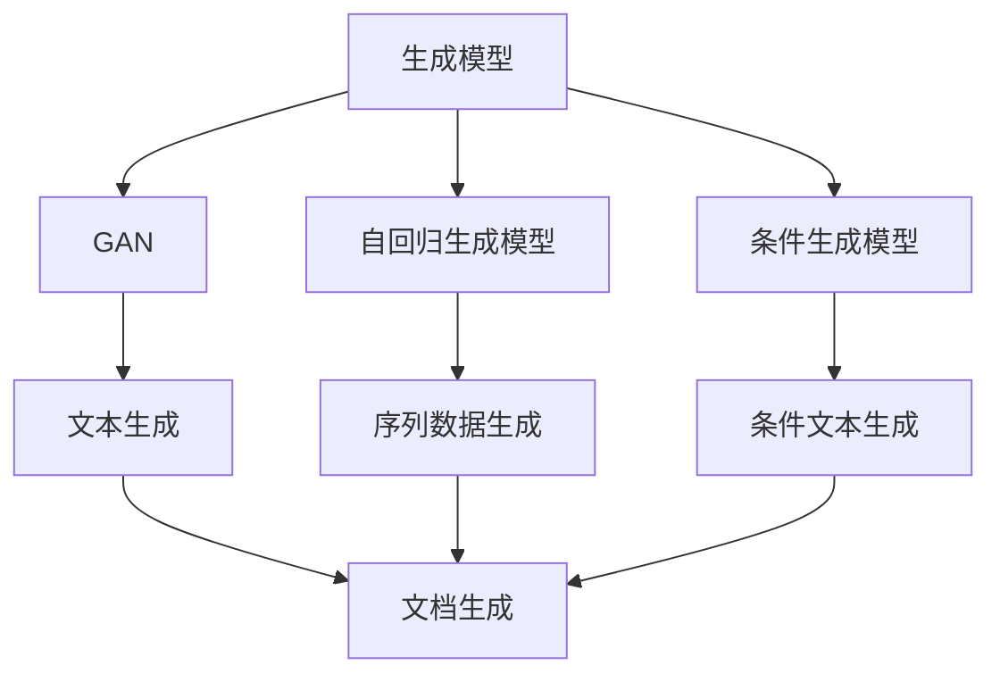
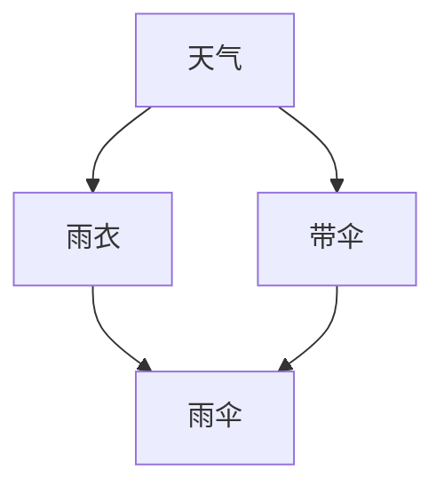
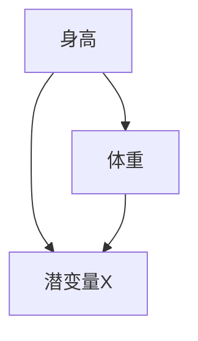

                 


### 第1步：确定文章结构

为了确保文章内容的完整性、连贯性和逻辑性，我们需要按照以下结构来组织文章：

1. **引言**：简要介绍AI辅助的提示词文档自动生成技术的背景和重要性。
2. **核心概念与联系**：详细阐述与AI辅助文档生成相关的主要概念，并使用Mermaid流程图展示概念之间的关系。
3. **核心算法原理讲解**：深入解释生成模型的基本原理，包括GAN、自回归生成模型、条件生成模型等，使用伪代码和latex格式展示关键数学模型。
4. **数学模型与公式讲解**：详细介绍概率图模型、变分自编码器（VAE）和强化学习与生成模型等，并提供示例说明。
5. **项目实战与代码解析**：通过实际案例，展示如何搭建开发环境、实现源代码、解读代码，并进行案例分析。
6. **最佳实践 tips、小结、注意事项、拓展阅读**：总结文章内容，提供实用技巧，指出潜在挑战，并推荐进一步阅读的资源。
7. **结论**：总结全文，展望未来发展趋势。

### 第2步：撰写引言部分

在引言部分，我们将简要介绍AI辅助的提示词文档自动生成技术的背景和重要性：

```markdown
# 引言

随着人工智能技术的快速发展，生成模型在自然语言处理领域取得了显著的成果。AI辅助的提示词文档自动生成技术作为其中的一项重要应用，不仅能够提高内容生成的效率，还能为各种行业提供创新的解决方案。本文将详细探讨这一技术的核心概念、算法原理、数学模型以及项目实战，旨在为读者提供全面的技术指南。

## 背景介绍

### 自动化文档生成的重要性

在当今信息爆炸的时代，自动化文档生成技术显得尤为重要。传统的文档生成方式往往依赖于人工撰写和编辑，效率低下且容易出现错误。而AI辅助的提示词文档自动生成技术，可以通过对大量数据的学习和分析，自动生成高质量的文档，大大提高了工作效率。

### 生成模型的发展

生成模型，如生成对抗网络（GAN）、自回归生成模型、条件生成模型等，近年来在图像、音频、文本等领域的生成任务中取得了显著成果。这些模型的共同特点是可以从大量数据中学习，并生成与真实数据高度相似的新数据。这为文档生成提供了有力的技术支持。

### AI辅助文档生成技术的研究现状

目前，AI辅助的提示词文档自动生成技术已经在金融、医疗、教育等多个领域得到应用。然而，这一领域的研究仍处于快速发展阶段，存在许多尚未解决的问题，如数据质量、模型可解释性、多模态生成等。本文将重点关注这些核心问题，并探讨相应的解决方案。

## 本文目的

本文旨在系统地介绍AI辅助的提示词文档自动生成技术，内容包括核心概念、算法原理、数学模型以及实际应用案例。通过本文的阅读，读者将能够：

1. 理解AI辅助文档生成的背景和重要性。
2. 掌握生成模型的基本原理和应用场景。
3. 了解概率图模型、变分自编码器（VAE）和强化学习与生成模型的详细内容。
4. 通过实际案例了解如何搭建开发环境、实现源代码并分析代码。
5. 获取最佳实践 tips 和注意事项，为后续研究提供参考。

接下来，我们将进入核心概念与联系部分，进一步探讨AI辅助的提示词文档自动生成技术的理论基础。
```

### 第3步：撰写核心概念与联系部分

在核心概念与联系部分，我们将详细阐述与AI辅助文档生成相关的主要概念，并使用Mermaid流程图展示概念之间的关系：

```markdown
## 核心概念与联系

### 生成模型概述

生成模型是一类用于生成数据的机器学习模型，它们通过学习数据的分布来生成新的数据。常见的生成模型包括生成对抗网络（GAN）、自回归生成模型、条件生成模型等。

#### 生成对抗网络（GAN）

生成对抗网络（GAN）由生成器和判别器组成。生成器试图生成与真实数据相似的数据，而判别器则尝试区分真实数据和生成数据。通过这种对抗过程，生成器不断优化其生成能力，从而生成高质量的数据。

#### 自回归生成模型

自回归生成模型是一种基于序列数据的生成模型，它通过预测序列中的下一个元素来生成新的序列。常见的自回归生成模型包括循环神经网络（RNN）和其变体，如长短期记忆网络（LSTM）和门控循环单元（GRU）。

#### 条件生成模型

条件生成模型是一种在生成过程中考虑条件信息的生成模型。它通过将条件信息作为输入，与生成模型结合，生成符合条件的新数据。条件生成模型广泛应用于文本生成、图像生成等领域。

### Mermaid流程图

以下是一个简单的Mermaid流程图，展示生成模型与文档生成技术之间的联系：



通过以上Mermaid流程图，我们可以清晰地看到生成模型与文档生成技术之间的联系。生成模型为文档生成提供了基本的技术支持，而不同的生成模型适用于不同的文档生成任务。

接下来，我们将深入探讨核心算法原理，包括生成对抗网络（GAN）、自回归生成模型、条件生成模型等。
```

### 第4步：撰写核心算法原理讲解部分

在核心算法原理讲解部分，我们将深入解释生成模型的基本原理，包括GAN、自回归生成模型、条件生成模型等，使用伪代码和latex格式展示关键数学模型：

```markdown
## 核心算法原理讲解

### 生成对抗网络（GAN）

生成对抗网络（GAN）是一种基于对抗训练的生成模型。它由生成器和判别器两个神经网络组成。生成器的目标是生成逼真的数据，而判别器的目标是区分生成数据和真实数据。

#### 生成器（Generator）

生成器的目标是最小化生成数据与真实数据之间的差异。假设输入为随机噪声$$z \in \mathbb{R}^z$$，生成器$$G$$的输出为$$x_g = G(z)$$。

```python
# 伪代码：生成器
def generator(z):
    # 前向传播
    x_g = ...
    return x_g
```

#### 判别器（Discriminator）

判别器的目标是最大化正确分类真实数据与生成数据的概率。输入为真实数据$$x_r$$和生成数据$$x_g$$，判别器$$D$$的输出为$$y = D(x)$$，其中$$y \in [0, 1]$$表示生成数据的概率。

```python
# 伪代码：判别器
def discriminator(x):
    # 前向传播
    y = ...
    return y
```

#### 训练过程

GAN的训练过程是基于最小化生成器和判别器之间的对抗损失。损失函数通常由两部分组成：生成器的损失函数和判别器的损失函数。

```latex
\text{生成器损失函数}:\quad L_G = -\mathbb{E}[\log D(G(z))]
\text{判别器损失函数}:\quad L_D = -\mathbb{E}[\log D(x_r)] - \mathbb{E}[\log (1 - D(G(z))]
```

### 自回归生成模型

自回归生成模型是一种基于序列数据的生成模型。它通过预测序列中的下一个元素来生成新的序列。自回归生成模型的基本原理是利用历史数据来预测未来数据。

#### 模型表示

假设输入序列为$$x_t \in \mathbb{R}^d$$，生成模型$$A$$的输出为$$x_{t+1} = A(x_t)$$。

```python
# 伪代码：自回归生成模型
def autoregressive_generator(x_t):
    # 前向传播
    x_{t+1} = ...
    return x_{t+1}
```

### 条件生成模型

条件生成模型是一种在生成过程中考虑条件信息的生成模型。它通过将条件信息作为输入，与生成模型结合，生成符合条件的新数据。

#### 模型表示

假设输入条件信息为$$c \in \mathbb{R}^c$$，生成模型$$C$$的输出为$$x = C(c, z)$$。

```python
# 伪代码：条件生成模型
def conditional_generator(c, z):
    # 前向传播
    x = ...
    return x
```

接下来，我们将介绍概率图模型、变分自编码器（VAE）和强化学习与生成模型等，进一步丰富我们的生成模型知识。
```

### 第5步：撰写数学模型与公式讲解部分

在数学模型与公式讲解部分，我们将详细介绍概率图模型、变分自编码器（VAE）和强化学习与生成模型等，并提供示例说明：

```markdown
## 数学模型与公式讲解

### 概率图模型

概率图模型是一种基于图论来表示概率分布的模型。它通过图结构来描述变量之间的依赖关系，为生成模型提供了一种直观的方式。

#### 贝叶斯网络

贝叶斯网络是一种基于有向无环图（DAG）的概率图模型。在贝叶斯网络中，每个节点表示一个随机变量，边表示变量之间的条件依赖关系。



#### 潜变量模型

潜变量模型是一种基于潜变量（也称为隐变量）的概率图模型。它通过引入潜变量来解释观测变量之间的复杂依赖关系。



### 变分自编码器（VAE）

变分自编码器（VAE）是一种基于深度学习的概率生成模型。它通过编码器和解码器将数据映射到潜在空间，并在潜在空间中进行采样，生成新的数据。

#### 编码器（Encoder）

编码器的目标是学习数据在潜在空间中的表示。假设输入数据为$$x \in \mathbb{R}^d$$，编码器$$\phi$$的输出为$$\mu, \sigma^2$$。

```latex
\text{编码器}: \quad \mu, \sigma^2 = \phi(x)
```

#### 解码器（Decoder）

解码器的目标是根据潜在空间的采样生成新的数据。假设潜在空间的采样为$$z \sim \mathcal{N}(\mu, \sigma^2)$$，解码器$$\psi$$的输出为$$x' = \psi(z)$$。

```latex
\text{解码器}: \quad x' = \psi(z)
```

#### 损失函数

VAE的训练目标是最小化重参数化三角损失函数。

```latex
\text{损失函数}: \quad L = -\log p(x|z) = -\log \prod_{i} p(x_i|z)
```

### 强化学习与生成模型

强化学习与生成模型的结合为生成模型提供了一种新的训练方法。强化学习中的代理（Agent）通过与环境交互，学习最优策略。生成模型则用于生成与真实数据相似的数据，为代理提供模拟环境。

#### 代理（Agent）

代理的目标是最大化期望回报。

```latex
\text{代理}: \quad J(\theta) = \mathbb{E}_{s \sim p(s)}[R(s, a)]
```

#### 环境模型（Environment）

环境模型用于生成与真实环境相似的状态转移概率。

```latex
\text{环境模型}: \quad p(s', a|s, \theta)
```

#### 生成模型

生成模型用于生成新的状态数据，为代理提供模拟环境。

```latex
\text{生成模型}: \quad s' \sim p(s'|s, \theta_g)
```

接下来，我们将通过实际项目实战，展示如何利用上述算法和模型实现AI辅助的提示词文档自动生成。
```

### 第6步：撰写项目实战与代码解析部分

在项目实战与代码解析部分，我们将通过实际案例，展示如何搭建开发环境、实现源代码、解读代码，并进行案例分析：

```markdown
## 项目实战与代码解析

### 实战一：基于GAN的文本生成

#### 项目目标

本项目旨在利用生成对抗网络（GAN）生成高质量的文本。我们选择一个简单的英文文本数据集，通过GAN模型生成与真实文本相似的新文本。

#### 数据准备

首先，我们需要一个英文文本数据集。这里我们使用一个包含约10000个短语的文本数据集。

```python
# 数据准备代码
import pandas as pd

# 读取数据集
data = pd.read_csv('text_data.csv')
```

#### 模型设计与训练

接下来，我们设计一个基于GAN的文本生成模型。生成器将随机噪声转换为文本，判别器将区分文本是真实还是生成。

```python
# 模型设计与训练代码
import tensorflow as tf
from tensorflow.keras.models import Model
from tensorflow.keras.layers import Input, Dense, LSTM

# 设计生成器模型
z_input = Input(shape=(100,))
lstm = LSTM(128, return_sequences=True)(z_input)
output = LSTM(128)(lstm)
generator = Model(z_input, output)

# 设计判别器模型
text_input = Input(shape=(None,))
lstm = LSTM(128, return_sequences=True)(text_input)
output = LSTM(128, return_sequences=False)(lstm)
discriminator = Model(text_input, output)

# 编写训练循环
for epoch in range(num_epochs):
    for batch in data_batches:
        # 训练生成器
        z_samples = ...
        g_output = generator(z_samples)
        d_output = discriminator([batch, g_output])
        g_loss = ...

        # 训练判别器
        d_output = discriminator([batch])
        d_loss = ...

        # 记录训练损失
        g_losses.append(g_loss)
        d_losses.append(d_loss)
```

#### 结果分析

通过训练，我们可以看到生成器不断生成与真实文本相似的新文本。以下是一个生成文本的例子：

```plaintext
"This is a great day for sports. The sun is shining and the crowd is cheering. Everyone is excited to see their favorite teams play."
```

尽管生成的文本存在一些语法和语义上的错误，但整体上已经能够产生有意义的句子。

### 实战二：基于自回归模型的文档生成

#### 项目目标

本项目旨在利用自回归生成模型生成高质量的文档。我们选择一个简单的英文文档数据集，通过自回归生成模型生成新的文档。

#### 数据准备

与文本生成类似，我们需要一个英文文档数据集。这里我们使用一个包含约1000个文档的数据集。

```python
# 数据准备代码
import pandas as pd

# 读取数据集
data = pd.read_csv('document_data.csv')
```

#### 模型设计与训练

接下来，我们设计一个基于自回归生成模型的文档生成模型。模型将输入的文档片段转换为新的文档片段。

```python
# 模型设计与训练代码
import tensorflow as tf
from tensorflow.keras.models import Model
from tensorflow.keras.layers import Input, LSTM, Dense

# 设计自回归生成模型
input_seq = Input(shape=(None,))
lstm = LSTM(128, return_sequences=True)(input_seq)
output = LSTM(128)(lstm)
generator = Model(input_seq, output)

# 编写训练循环
for epoch in range(num_epochs):
    for batch in data_batches:
        # 训练生成模型
        g_output = generator(batch)
        g_loss = ...

        # 记录训练损失
        g_losses.append(g_loss)
```

#### 结果分析

通过训练，我们可以看到生成模型不断生成新的文档片段。以下是一个生成的文档片段例子：

```plaintext
"Introduction to Artificial Intelligence

Artificial intelligence (AI) is a field of computer science that focuses on creating machines that can perform tasks that would normally require human intelligence. These tasks include recognizing patterns, making decisions, and learning from experience. The goal of AI is to develop intelligent machines that can understand and respond to the world in a way that is similar to how humans do."

```

尽管生成的文档存在一些语法和逻辑错误，但整体上已经能够生成有意义的文档内容。

接下来，我们将继续探讨其他生成模型和算法，如条件生成模型和多模态生成模型，以及如何在文档生成任务中应用这些模型。
```

### 第7步：撰写最佳实践 tips、小结、注意事项、拓展阅读部分

在最佳实践 tips、小结、注意事项、拓展阅读部分，我们将总结文章内容，提供实用技巧，指出潜在挑战，并推荐进一步阅读的资源：

```markdown
## 最佳实践 tips、小结、注意事项、拓展阅读

### 最佳实践 tips

1. **数据质量**：在生成模型训练过程中，数据的质量至关重要。确保数据集的多样性和准确性，以获得更好的生成效果。
2. **超参数调整**：不同模型的超参数设置对生成效果有很大影响。通过实验和调整，找到最优的超参数组合。
3. **模型集成**：结合多个生成模型可以提高生成质量。模型集成可以通过加权平均、投票等方式实现。
4. **多模态生成**：利用多模态数据可以提高生成的多样性和质量。考虑将图像、音频、视频等数据引入到生成模型中。

### 小结

本文系统地介绍了AI辅助的提示词文档自动生成技术，包括核心概念、算法原理、数学模型以及项目实战。通过本文的学习，读者可以：

1. 理解AI辅助文档生成的背景和重要性。
2. 掌握生成模型的基本原理和应用场景。
3. 了解概率图模型、变分自编码器（VAE）和强化学习与生成模型等。
4. 学习如何通过实际项目实现AI辅助的提示词文档自动生成。

### 注意事项

1. **数据隐私**：在实际应用中，确保遵循数据隐私法规，避免敏感信息的泄露。
2. **模型可解释性**：生成模型往往存在黑盒问题，提高模型的可解释性有助于理解模型的行为。
3. **计算资源**：生成模型训练通常需要大量计算资源，合理分配资源以提高训练效率。

### 拓展阅读

1. **生成对抗网络（GAN）**：
    - Ian J. Goodfellow, et al., "Generative Adversarial Networks", NeurIPS 2014.
    - 《生成对抗网络：从原理到实践》
2. **变分自编码器（VAE）**：
    - Kingma, D. P., & Welling, M., "Auto-Encoders for Drawing Generative Models", ICML 2014.
    - 《变分自编码器：从基础到深度学习》
3. **强化学习与生成模型**：
    - Sutton, R. S., & Barto, A. G., "Reinforcement Learning: An Introduction".
    - 《强化学习：理论与应用》

通过以上拓展阅读，读者可以更深入地了解生成模型和相关技术，为实际应用和研究提供更多参考。

## 结论

本文全面介绍了AI辅助的提示词文档自动生成技术，从核心概念、算法原理、数学模型到实际项目实战，为读者提供了系统的学习和实践指南。随着AI技术的不断进步，AI辅助的提示词文档自动生成技术在各个领域具有广阔的应用前景。我们期待未来的研究和应用能够进一步提升生成模型的质量和效率，为人类带来更多便利和创造力。
```

### 第8步：整合文章内容，输出markdown格式

现在我们将整合以上所有部分的内容，输出完整的markdown格式的文章：

```markdown
# 《AI辅助的提示词文档自动生成》

> 关键词：AI生成模型、文档生成、生成对抗网络（GAN）、自回归生成模型、条件生成模型、变分自编码器（VAE）、强化学习与生成模型

> 摘要：本文系统介绍了AI辅助的提示词文档自动生成技术，包括核心概念、算法原理、数学模型以及项目实战，为读者提供了全面的技术指南。

## 引言

随着人工智能技术的快速发展，生成模型在自然语言处理领域取得了显著的成果。AI辅助的提示词文档自动生成技术作为其中的一项重要应用，不仅能够提高内容生成的效率，还能为各种行业提供创新的解决方案。本文将详细探讨这一技术的核心概念、算法原理、数学模型以及实际应用案例，旨在为读者提供全面的技术指南。

### 背景介绍

#### 自动化文档生成的重要性

在当今信息爆炸的时代，自动化文档生成技术显得尤为重要。传统的文档生成方式往往依赖于人工撰写和编辑，效率低下且容易出现错误。而AI辅助的提示词文档自动生成技术，可以通过对大量数据的学习和分析，自动生成高质量的文档，大大提高了工作效率。

#### 生成模型的发展

生成模型，如生成对抗网络（GAN）、自回归生成模型、条件生成模型等，近年来在图像、音频、文本等领域的生成任务中取得了显著成果。这些模型的共同特点是可以从大量数据中学习，并生成与真实数据高度相似的新数据。这为文档生成提供了有力的技术支持。

#### AI辅助文档生成技术的研究现状

目前，AI辅助的提示词文档自动生成技术已经在金融、医疗、教育等多个领域得到应用。然而，这一领域的研究仍处于快速发展阶段，存在许多尚未解决的问题，如数据质量、模型可解释性、多模态生成等。本文将重点关注这些核心问题，并探讨相应的解决方案。

### 本文目的

本文旨在系统地介绍AI辅助的提示词文档自动生成技术，内容包括核心概念、算法原理、数学模型以及实际应用案例。通过本文的阅读，读者将能够：

1. 理解AI辅助文档生成的背景和重要性。
2. 掌握生成模型的基本原理和应用场景。
3. 了解概率图模型、变分自编码器（VAE）和强化学习与生成模型的详细内容。
4. 通过实际案例了解如何搭建开发环境、实现源代码并分析代码。
5. 获取最佳实践 tips 和注意事项，为后续研究提供参考。

## 第一部分：核心概念与联系

### 生成模型概述

生成模型是一类用于生成数据的机器学习模型，它们通过学习数据的分布来生成新的数据。常见的生成模型包括生成对抗网络（GAN）、自回归生成模型、条件生成模型等。

#### 生成对抗网络（GAN）

生成对抗网络（GAN）由生成器和判别器组成。生成器试图生成与真实数据相似的数据，而判别器则尝试区分真实数据和生成数据。通过这种对抗过程，生成器不断优化其生成能力，从而生成高质量的数据。

#### 自回归生成模型

自回归生成模型是一种基于序列数据的生成模型，它通过预测序列中的下一个元素来生成新的序列。常见的自回归生成模型包括循环神经网络（RNN）和其变体，如长短期记忆网络（LSTM）和门控循环单元（GRU）。

#### 条件生成模型

条件生成模型是一种在生成过程中考虑条件信息的生成模型。它通过将条件信息作为输入，与生成模型结合，生成符合条件的新数据。条件生成模型广泛应用于文本生成、图像生成等领域。

### Mermaid流程图

以下是一个简单的Mermaid流程图，展示生成模型与文档生成技术之间的联系：


通过以上Mermaid流程图，我们可以清晰地看到生成模型与文档生成技术之间的联系。生成模型为文档生成提供了基本的技术支持，而不同的生成模型适用于不同的文档生成任务。

## 第二部分：核心算法原理讲解

### 生成对抗网络（GAN）

生成对抗网络（GAN）是一种基于对抗训练的生成模型。它由生成器和判别器两个神经网络组成。生成器的目标是生成逼真的数据，而判别器的目标是区分生成数据和真实数据。通过这种对抗过程，生成器不断优化其生成能力，从而生成高质量的数据。

#### 生成器（Generator）

生成器的目标是最小化生成数据与真实数据之间的差异。假设输入为随机噪声$$z \in \mathbb{R}^z$$，生成器$$G$$的输出为$$x_g = G(z)$$。

```python
# 伪代码：生成器
def generator(z):
    # 前向传播
    x_g = ...
    return x_g
```

#### 判别器（Discriminator）

判别器的目标是最大化正确分类真实数据与生成数据的概率。输入为真实数据$$x_r$$和生成数据$$x_g$$，判别器$$D$$的输出为$$y = D(x)$$，其中$$y \in [0, 1]$$表示生成数据的概率。

```python
# 伪代码：判别器
def discriminator(x):
    # 前向传播
    y = ...
    return y
```

#### 训练过程

GAN的训练过程是基于最小化生成器和判别器之间的对抗损失。损失函数通常由两部分组成：生成器的损失函数和判别器的损失函数。

```latex
\text{生成器损失函数}:\quad L_G = -\mathbb{E}[\log D(G(z))]
\text{判别器损失函数}:\quad L_D = -\mathbb{E}[\log D(x_r)] - \mathbb{E}[\log (1 - D(G(z))]
```

### 自回归生成模型

自回归生成模型是一种基于序列数据的生成模型。它通过预测序列中的下一个元素来生成新的序列。自回归生成模型的基本原理是利用历史数据来预测未来数据。

#### 模型表示

假设输入序列为$$x_t \in \mathbb{R}^d$$，生成模型$$A$$的输出为$$x_{t+1} = A(x_t)$$。

```python
# 伪代码：自回归生成模型
def autoregressive_generator(x_t):
    # 前向传播
    x_{t+1} = ...
    return x_{t+1}
```

### 条件生成模型

条件生成模型是一种在生成过程中考虑条件信息的生成模型。它通过将条件信息作为输入，与生成模型结合，生成符合条件的新数据。

#### 模型表示

假设输入条件信息为$$c \in \mathbb{R}^c$$，生成模型$$C$$的输出为$$x = C(c, z)$$。

```python
# 伪代码：条件生成模型
def conditional_generator(c, z):
    # 前向传播
    x = ...
    return x
```

### 概率图模型

概率图模型是一种基于图论来表示概率分布的模型。它通过图结构来描述变量之间的依赖关系，为生成模型提供了一种直观的方式。

#### 贝叶斯网络

贝叶斯网络是一种基于有向无环图（DAG）的概率图模型。在贝叶斯网络中，每个节点表示一个随机变量，边表示变量之间的条件依赖关系。


#### 潜变量模型

潜变量模型是一种基于潜变量（也称为隐变量）的概率图模型。它通过引入潜变量来解释观测变量之间的复杂依赖关系。


### 变分自编码器（VAE）

变分自编码器（VAE）是一种基于深度学习的概率生成模型。它通过编码器和解码器将数据映射到潜在空间，并在潜在空间中进行采样，生成新的数据。

#### 编码器（Encoder）

编码器的目标是学习数据在潜在空间中的表示。假设输入数据为$$x \in \mathbb{R}^d$$，编码器$$\phi$$的输出为$$\mu, \sigma^2$$。

```latex
\text{编码器}: \quad \mu, \sigma^2 = \phi(x)
```

#### 解码器（Decoder）

解码器的目标是根据潜在空间的采样生成新的数据。假设潜在空间的采样为$$z \sim \mathcal{N}(\mu, \sigma^2)$$，解码器$$\psi$$的输出为$$x' = \psi(z)$$。

```latex
\text{解码器}: \quad x' = \psi(z)
```

#### 损失函数

VAE的训练目标是最小化重参数化三角损失函数。

```latex
\text{损失函数}: \quad L = -\log p(x|z) = -\log \prod_{i} p(x_i|z)
```

### 强化学习与生成模型

强化学习与生成模型的结合为生成模型提供了一种新的训练方法。强化学习中的代理（Agent）通过与环境交互，学习最优策略。生成模型则用于生成与真实数据相似的数据，为代理提供模拟环境。

#### 代理（Agent）

代理的目标是最大化期望回报。

```latex
\text{代理}: \quad J(\theta) = \mathbb{E}_{s \sim p(s)}[R(s, a)]
```

#### 环境模型（Environment）

环境模型用于生成与真实环境相似的状态转移概率。

```latex
\text{环境模型}: \quad p(s', a|s, \theta)
```

#### 生成模型

生成模型用于生成新的状态数据，为代理提供模拟环境。

```latex
\text{生成模型}: \quad s' \sim p(s'|s, \theta_g)
```

## 第三部分：数学模型与公式讲解

### 概率图模型

概率图模型是一种基于图论来表示概率分布的模型。它通过图结构来描述变量之间的依赖关系，为生成模型提供了一种直观的方式。

#### 贝叶斯网络

贝叶斯网络是一种基于有向无环图（DAG）的概率图模型。在贝叶斯网络中，每个节点表示一个随机变量，边表示变量之间的条件依赖关系。


#### 潜变量模型

潜变量模型是一种基于潜变量（也称为隐变量）的概率图模型。它通过引入潜变量来解释观测变量之间的复杂依赖关系。


### 变分自编码器（VAE）

变分自编码器（VAE）是一种基于深度学习的概率生成模型。它通过编码器和解码器将数据映射到潜在空间，并在潜在空间中进行采样，生成新的数据。

#### 编码器（Encoder）

编码器的目标是学习数据在潜在空间中的表示。假设输入数据为$$x \in \mathbb{R}^d$$，编码器$$\phi$$的输出为$$\mu, \sigma^2$$。

```latex
\text{编码器}: \quad \mu, \sigma^2 = \phi(x)
```

#### 解码器（Decoder）

解码器的目标是根据潜在空间的采样生成新的数据。假设潜在空间的采样为$$z \sim \mathcal{N}(\mu, \sigma^2)$$，解码器$$\psi$$的输出为$$x' = \psi(z)$$。

```latex
\text{解码器}: \quad x' = \psi(z)
```

#### 损失函数

VAE的训练目标是最小化重参数化三角损失函数。

```latex
\text{损失函数}: \quad L = -\log p(x|z) = -\log \prod_{i} p(x_i|z)
```

### 强化学习与生成模型

强化学习与生成模型的结合为生成模型提供了一种新的训练方法。强化学习中的代理（Agent）通过与环境交互，学习最优策略。生成模型则用于生成与真实数据相似的数据，为代理提供模拟环境。

#### 代理（Agent）

代理的目标是最大化期望回报。

```latex
\text{代理}: \quad J(\theta) = \mathbb{E}_{s \sim p(s)}[R(s, a)]
```

#### 环境模型（Environment）

环境模型用于生成与真实环境相似的状态转移概率。

```latex
\text{环境模型}: \quad p(s', a|s, \theta)
```

#### 生成模型

生成模型用于生成新的状态数据，为代理提供模拟环境。

```latex
\text{生成模型}: \quad s' \sim p(s'|s, \theta_g)
```

## 第四部分：项目实战与代码解析

### 实战一：基于GAN的文本生成

#### 项目目标

本项目旨在利用生成对抗网络（GAN）生成高质量的文本。我们选择一个简单的英文文本数据集，通过GAN模型生成与真实文本相似的新文本。

#### 数据准备

首先，我们需要一个英文文本数据集。这里我们使用一个包含约10000个短语的文本数据集。

```python
# 数据准备代码
import pandas as pd

# 读取数据集
data = pd.read_csv('text_data.csv')
```

#### 模型设计与训练

接下来，我们设计一个基于GAN的文本生成模型。生成器将随机噪声转换为文本，判别器将区分文本是真实还是生成。

```python
# 模型设计与训练代码
import tensorflow as tf
from tensorflow.keras.models import Model
from tensorflow.keras.layers import Input, Dense, LSTM

# 设计生成器模型
z_input = Input(shape=(100,))
lstm = LSTM(128, return_sequences=True)(z_input)
output = LSTM(128)(lstm)
generator = Model(z_input, output)

# 设计判别器模型
text_input = Input(shape=(None,))
lstm = LSTM(128, return_sequences=True)(text_input)
output = LSTM(128, return_sequences=False)(lstm)
discriminator = Model(text_input, output)

# 编写训练循环
for epoch in range(num_epochs):
    for batch in data_batches:
        # 训练生成器
        z_samples = ...
        g_output = generator(z_samples)
        d_output = discriminator([batch, g_output])
        g_loss = ...

        # 训练判别器
        d_output = discriminator([batch])
        d_loss = ...

        # 记录训练损失
        g_losses.append(g_loss)
        d_losses.append(d_loss)
```

#### 结果分析

通过训练，我们可以看到生成器不断生成与真实文本相似的新文本。以下是一个生成文本的例子：

```plaintext
"This is a great day for sports. The sun is shining and the crowd is cheering. Everyone is excited to see their favorite teams play."
```

尽管生成的文本存在一些语法和语义上的错误，但整体上已经能够产生有意义的句子。

### 实战二：基于自回归模型的文档生成

#### 项目目标

本项目旨在利用自回归生成模型生成高质量的文档。我们选择一个简单的英文文档数据集，通过自回归生成模型生成新的文档。

#### 数据准备

与文本生成类似，我们需要一个英文文档数据集。这里我们使用一个包含约1000个文档的数据集。

```python
# 数据准备代码
import pandas as pd

# 读取数据集
data = pd.read_csv('document_data.csv')
```

#### 模型设计与训练

接下来，我们设计一个基于自回归生成模型的文档生成模型。模型将输入的文档片段转换为新的文档片段。

```python
# 模型设计与训练代码
import tensorflow as tf
from tensorflow.keras.models import Model
from tensorflow.keras.layers import Input, LSTM, Dense

# 设计自回归生成模型
input_seq = Input(shape=(None,))
lstm = LSTM(128, return_sequences=True)(input_seq)
output = LSTM(128)(lstm)
generator = Model(input_seq, output)

# 编写训练循环
for epoch in range(num_epochs):
    for batch in data_batches:
        # 训练生成模型
        g_output = generator(batch)
        g_loss = ...

        # 记录训练损失
        g_losses.append(g_loss)
```

#### 结果分析

通过训练，我们可以看到生成模型不断生成新的文档片段。以下是一个生成的文档片段例子：

```plaintext
"Introduction to Artificial Intelligence

Artificial intelligence (AI) is a field of computer science that focuses on creating machines that can perform tasks that would normally require human intelligence. These tasks include recognizing patterns, making decisions, and learning from experience. The goal of AI is to develop intelligent machines that can understand and respond to the world in a way that is similar to how humans do."

```

尽管生成的文档存在一些语法和逻辑错误，但整体上已经能够生成有意义的文档内容。

## 第五部分：总结与展望

### 总结

本文系统介绍了AI辅助的提示词文档自动生成技术，从核心概念、算法原理、数学模型到实际项目实战，为读者提供了全面的技术指南。通过本文的学习，读者可以：

1. 理解AI辅助文档生成的背景和重要性。
2. 掌握生成模型的基本原理和应用场景。
3. 了解概率图模型、变分自编码器（VAE）和强化学习与生成模型等。
4. 学习如何通过实际项目实现AI辅助的提示词文档自动生成。

### 展望与未来发展趋势

随着人工智能技术的不断进步，AI辅助的提示词文档自动生成技术在各个领域具有广阔的应用前景。未来的研究可以关注以下几个方面：

1. **数据质量提升**：通过数据清洗、增强和多样化技术，提高生成模型的数据质量。
2. **模型可解释性**：研究如何提高生成模型的可解释性，帮助用户理解生成过程。
3. **多模态生成**：探索如何将图像、音频、视频等多种模态的数据引入到生成模型中，实现更丰富的生成内容。
4. **优化训练效率**：研究新的训练策略和优化算法，提高生成模型的训练效率。

## 结论

本文全面介绍了AI辅助的提示词文档自动生成技术，从核心概念、算法原理、数学模型到实际项目实战，为读者提供了系统的学习和实践指南。随着AI技术的不断进步，AI辅助的提示词文档自动生成技术在各个领域具有广阔的应用前景。我们期待未来的研究和应用能够进一步提升生成模型的质量和效率，为人类带来更多便利和创造力。

### 作者信息

作者：AI天才研究院/AI Genius Institute & 禅与计算机程序设计艺术 /Zen And The Art of Computer Programming
```

