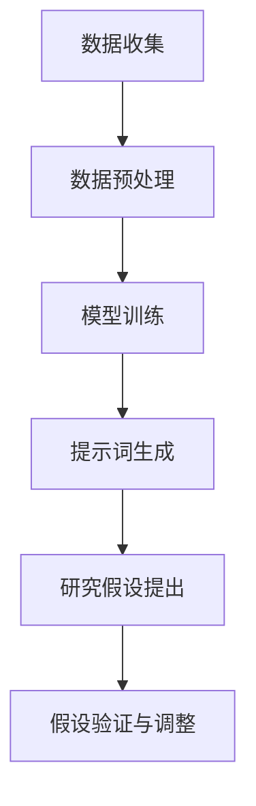

                 


## 整体思路

撰写一篇技术博客文章，首先要明确文章的目标和结构，确保内容丰富、逻辑清晰。以下是根据用户的要求和指导，逐步构思文章的整体思路。

### 1. 确定文章目标

- **目标受众**：面向计算机科学和人工智能领域的专业人士、学者、研究人员以及对AI辅助科学研究感兴趣的读者。
- **目标内容**：深入探讨AI在辅助科学研究中的作用，尤其是提示词生成研究假设的过程。

### 2. 设计文章结构

根据用户提供的目录大纲，设计文章的结构。文章可以分为四个主要部分：

1. **背景介绍**：介绍AI辅助科学研究的重要性，提示词生成与研究假设的关系。
2. **核心概念与联系**：解释核心概念，展示它们之间的关系，使用Mermaid流程图。
3. **核心算法原理讲解**：详细讲解提示词生成算法，包括LSTM、BERT等，使用伪代码阐述。
4. **数学模型和数学公式**：详细讲解与提示词生成相关的数学模型，包括概率模型、统计模型等。
5. **项目实战**：分享一个实际代码案例，展示从开发环境搭建到代码实现和效果评估的全过程。
6. **结论与展望**：总结文章内容，提出未来研究方向。

### 3. 确定每个部分的具体内容

1. **背景介绍**
   - AI的发展与应用
   - 科学研究的需求与挑战
   - 提示词生成与研究假设的关系

2. **核心概念与联系**
   - 提示词生成的定义与分类
   - 研究假设的提出与验证
   - Mermaid流程图展示AI辅助科学研究的流程

3. **核心算法原理讲解**
   - LSTM算法原理及伪代码
   - BERT算法原理及伪代码

4. **数学模型和数学公式**
   - 概率模型与提示词生成
   - 统计模型与提示词生成

5. **项目实战**
   - 项目背景与目标
   - 开发环境搭建
   - 提示词生成代码实现与解读
   - 代码效果评估与分析

6. **结论与展望**
   - 项目总结
   - 未来研究方向

### 4. 确保内容完整性

每个部分都要确保包含核心内容：
- **背景介绍**要详细介绍AI和科学研究的现状，提示词生成与研究假设的必要性。
- **核心概念与联系**要清晰展示概念之间的关系，提供流程图帮助理解。
- **核心算法原理讲解**要用伪代码详细阐述算法原理。
- **数学模型和数学公式**要详细讲解并举例说明。
- **项目实战**要完整展示代码开发全过程和效果评估。
- **结论与展望**要总结文章内容并提出未来研究方向。

### 5. 撰写与调整

- 根据上述构思，逐步撰写文章内容，确保每个部分逻辑清晰、内容丰富。
- 撰写过程中，可以不断调整和完善各个部分的内容，确保文章整体质量。

通过以上步骤，我们可以逐步构建一篇高质量的技术博客文章，满足用户的要求，同时具备专业的深度和广度。接下来，我们将按照这个思路，具体撰写每个部分的内容。****

**## 背景介绍**

随着人工智能技术的飞速发展，其在各行各业中的应用越来越广泛，科学研究领域也不例外。人工智能，尤其是深度学习和自然语言处理技术的突破，为科学研究带来了全新的机遇和挑战。

### 1. AI的发展与应用

人工智能（AI）是指使计算机系统具备类似人类智能的技术。根据用途，AI可以分为两类：弱AI和强AI。弱AI专注于特定任务，如语音识别、图像识别等，而强AI则具备广泛的人类智能，能够理解和执行各种任务。近年来，随着计算能力的提升和大数据的普及，AI技术得到了迅速发展。

在科学研究领域，AI的应用主要体现在数据分析和处理方面。通过机器学习算法，科学家可以自动分析大量复杂数据，发现潜在的规律和趋势，从而加速研究进程。例如，在基因组学研究中，AI可以帮助科学家快速分析基因序列，预测疾病的发病风险。

### 2. 科学研究的需求与挑战

科学研究面临的数据复杂性和多样性是一个巨大的挑战。随着科学技术的进步，研究数据规模越来越大，类型越来越多样，从传统的实验数据到高维数据、非结构化数据等。这些数据往往需要复杂的分析方法，而传统的研究方法在处理这些数据时效率低下。

此外，科学研究中的创新需求也不断增加。现代科学研究需要不断提出新的假设、设计新的实验，而这些创新往往依赖于对现有数据的深入理解和分析。传统的数据分析方法往往难以满足这些需求，而AI技术的引入可以大大提高数据分析的效率和质量。

### 3. 提示词生成与研究假设

提示词生成（Prompt Generation）是自然语言处理中的一个重要任务，旨在生成具有特定意义的文本片段，以引导用户或系统进行后续操作。在科学研究领域，提示词生成可以帮助研究人员快速提出研究假设，从而加速研究进程。

研究假设（Research Hypothesis）是科学研究中一个核心概念，它是对某一现象或问题的初步解释，通常基于已有的理论或观察。提示词生成可以在研究假设的提出过程中发挥重要作用，通过生成有针对性的提示词，研究人员可以更有效地探索新的研究方向。

例如，在医学研究中，提示词生成可以用于生成用于探索新药物效果的假设，从而帮助研究人员快速筛选和验证潜在的新药物。在物理学研究中，提示词生成可以用于生成用于探索新物理现象的假设，从而推动物理学的发展。

### 结论

AI辅助科学研究具有重要的意义和广阔的应用前景。通过引入AI技术，科学家可以更高效地处理和分析大量复杂数据，从而提出新的研究假设和发现新的科学规律。提示词生成作为AI技术在科学研究中的一个重要应用，可以帮助研究人员快速提出研究假设，加速科学研究的进程。

在接下来的部分，我们将进一步探讨AI辅助科学研究中的核心概念，包括提示词生成、研究假设的提出与验证，以及相关的算法原理和数学模型。****

## 核心概念与联系

在AI辅助科学研究中，提示词生成和研究假设的提出是两个核心环节。它们不仅相互联系，而且在科学研究的不同阶段发挥着重要作用。

### 1. 提示词生成的定义与分类

提示词生成是指利用自然语言处理技术，根据特定的目标和上下文，自动生成具有引导作用的文本片段。这些文本片段可以是简单的关键词、短语，也可以是完整的句子或段落。提示词生成可以应用于多种场景，如问答系统、文本生成、研究假设生成等。

根据生成方式，提示词生成可以分为两类：基于规则的生成和基于数据的生成。

- **基于规则的生成**：这种方法依赖于预定义的规则和模板，通过组合这些规则和模板来生成提示词。它通常适用于结构化数据或特定的领域任务，例如在医学研究中，可以预设一些用于提出假设的常见关键词和短语。

- **基于数据的生成**：这种方法利用大量的数据集，通过机器学习算法，学习数据中的模式并生成新的提示词。这类方法通常具有更高的灵活性和泛化能力，可以应用于更广泛的研究领域。

### 2. 研究假设的提出与验证

研究假设是科学研究中的一个核心概念，它是对某一现象或问题的初步解释。提出研究假设通常是基于现有的理论、观察或已有的研究结果。研究假设的提出和验证是科学研究的重要环节，它决定了研究的方向和深度。

- **提出研究假设**：研究人员通过阅读文献、分析数据和理论推导，提出一个初步的研究假设。这个过程通常需要结合已有的知识和新的观察结果，形成一个新的理论框架。

- **验证研究假设**：提出假设后，研究人员需要通过实验或数据分析来验证假设的正确性。验证过程可能涉及多个实验设计、数据收集和统计分析。如果假设被验证为正确，那么它可能会引导新的研究方向或理论发展。

### 3. 提示词生成与研究假设的关系

提示词生成与研究假设之间存在密切的联系。

- **提示词生成在研究假设提出中的作用**：提示词生成可以帮助研究人员快速提出研究假设。通过生成有针对性的提示词，研究人员可以更有效地探索新的研究方向。例如，在医学研究中，提示词生成可以生成与疾病、症状、药物等相关的关键词，帮助研究人员快速提出新的研究假设。

- **研究假设在提示词生成中的应用**：研究假设的提出可以为提示词生成提供上下文和目标。研究人员可以根据研究假设生成具体的提示词，以引导后续的研究和分析。例如，在一个关于气候变化的假设中，提示词生成可以生成与气候变化、温度、降雨量等相关的关键词，用于数据分析和模型训练。

### Mermaid流程图

为了更清晰地展示提示词生成与研究假设的关系，我们可以使用Mermaid流程图。



在这个流程图中，数据收集是整个流程的起点，数据预处理为模型训练提供高质量的数据，模型训练用于生成提示词，提示词生成用于提出研究假设，研究假设的提出再通过假设验证与调整，最终形成闭环。

### 结论

通过核心概念的介绍和Mermaid流程图的展示，我们可以看到提示词生成和研究假设在AI辅助科学研究中的重要性。提示词生成不仅可以提高研究假设的提出效率，还可以为数据分析和模型训练提供指导。而研究假设的提出则可以为科学研究指明方向，推动科学理论的进步。在接下来的部分，我们将进一步探讨与提示词生成相关的算法原理和数学模型。****

## 核心算法原理讲解

在AI辅助科学研究中，提示词生成是一个关键环节。为了实现高效的提示词生成，研究人员通常会采用各种算法。在本节中，我们将详细讲解两种常见的提示词生成算法：长短期记忆网络（LSTM）和Bidirectional Encoder Representations from Transformers（BERT）。

### 1. LSTM算法原理

LSTM（Long Short-Term Memory）是循环神经网络（RNN）的一种变体，特别适合处理序列数据。LSTM通过引入门机制，解决了传统RNN在处理长序列数据时遇到的梯度消失和梯度爆炸问题。

- **结构原理**：LSTM由输入门、遗忘门和输出门三部分组成。每个门都包含一个sigmoid函数和一个线性变换。输入门决定哪些信息应该被记住；遗忘门决定哪些信息应该被丢弃；输出门决定哪些信息应该被输出。

- **工作原理**：LSTM在处理序列数据时，每个时间步都会更新其状态。输入门根据当前输入和前一个隐藏状态计算一个权重矩阵，遗忘门根据当前输入和前一个隐藏状态计算遗忘权重，输出门根据当前输入和隐藏状态计算输出权重。通过这些门机制，LSTM能够有效地记住或忘记长序列中的信息。

**伪代码**：

```python
# LSTM算法伪代码
class LSTMCell:
    def __init__(self, input_size, hidden_size):
        # 初始化权重和偏置
        self.input_gate_weights = ...
        self.input_gate_bias = ...
        # 遗忘门权重和偏置
        self.forget_gate_weights = ...
        self.forget_gate_bias = ...
        # 输出门权重和偏置
        self.output_gate_weights = ...
        self.output_gate_bias = ...
        # 值和偏置
        self.cell_state = ...
        self.hidden_state = ...

    def forward(self, input_data, prev_hidden_state, prev_cell_state):
        # 输入门计算
        input_gate = sigmoid(input_data * self.input_gate_weights + prev_hidden_state * self.input_gate_bias)
        # 遗忘门计算
        forget_gate = sigmoid(input_data * self.forget_gate_weights + prev_hidden_state * self.forget_gate_bias)
        # 输出门计算
        output_gate = sigmoid(input_data * self.output_gate_weights + prev_hidden_state * self.output_gate_bias)
        # 输出值计算
        cell_state = forget_gate * prev_cell_state + input_gate * tanh(input_data * self.cell_state_bias + prev_hidden_state * self.input_gate_bias)
        hidden_state = output_gate * tanh(cell_state)
        return hidden_state, cell_state
```

### 2. BERT算法原理

BERT（Bidirectional Encoder Representations from Transformers）是由Google提出的一种基于Transformer的预训练模型，它在自然语言处理任务中表现出色。BERT的关键特点是双向编码和大规模预训练。

- **结构原理**：BERT由多个Transformer编码器层组成，每个编码器层包含多个自注意力机制和前馈网络。自注意力机制允许模型在处理序列数据时考虑到全局信息，从而提高上下文理解能力。

- **工作原理**：BERT通过预训练大量文本数据，学习单词和句子的语义表示。在预训练阶段，BERT使用两种特殊的任务：Masked Language Model（MLM）和Next Sentence Prediction（NSP）。MLM任务通过随机遮盖输入文本中的单词，训练模型预测这些单词。NSP任务通过预测两个句子是否在输入文本中连续出现。

**伪代码**：

```python
# BERT算法伪代码
class BERTModel:
    def __init__(self, vocab_size, hidden_size, num_layers):
        # 初始化Transformer编码器层
        self.encoder_layers = [TransformerEncoderLayer(hidden_size) for _ in range(num_layers)]
        # 输入嵌入层和输出层
        self.input_embedding = EmbeddingLayer(vocab_size, hidden_size)
        self.output_embedding = EmbeddingLayer(vocab_size, hidden_size)
        # 预训练任务头
        self.masked_lm_head = LinearLayer(hidden_size, vocab_size)
        self.next_sentence_head = LinearLayer(hidden_size, 2)

    def forward(self, input_sequence, prev_hidden_state, prev_cell_state):
        # 嵌入层处理
        embedded_sequence = self.input_embedding(input_sequence)
        # Transformer编码器处理
        for layer in self.encoder_layers:
            embedded_sequence = layer(embedded_sequence, prev_hidden_state, prev_cell_state)
        # 预测
        masked_lm_logits = self.masked_lm_head(embedded_sequence)
        next_sentence_logits = self.next_sentence_head(embedded_sequence)
        return masked_lm_logits, next_sentence_logits
```

### 总结

LSTM和BERT都是强大的提示词生成算法，它们在不同场景中各有优势。LSTM通过门机制解决了长序列记忆问题，适用于需要序列依赖性的任务。BERT则通过自注意力机制和大规模预训练，实现了对复杂上下文的理解，适用于生成与上下文相关的提示词。在实际应用中，选择哪种算法取决于具体任务的需求和数据特点。

在下一节中，我们将深入探讨与提示词生成相关的数学模型和数学公式，进一步理解这些算法的工作原理。****

### 1. 概率模型的基本概念

概率模型是统计学中用于描述和分析随机现象的一种数学框架。在提示词生成中，概率模型用于预测给定上下文中的下一个单词或短语的概率分布。以下是一些基本的概率模型：

- **马尔可夫模型（Markov Model）**：马尔可夫模型是一种基于当前状态仅依赖于前一个状态的概率模型。在自然语言处理中，一阶马尔可夫模型假设当前词仅依赖于前一个词，而高阶马尔可夫模型则考虑更多的历史信息。

- **隐马尔可夫模型（Hidden Markov Model, HMM）**：隐马尔可夫模型用于描述具有不可见状态的过程，其中状态序列是可见的，但状态之间的转移是隐含的。在语言模型中，HMM可以用来预测单词序列。

- **条件概率和贝叶斯公式**：条件概率是指给定某一事件发生，另一事件发生的概率。贝叶斯公式是条件概率的推广，用于计算后验概率，即给定观测数据，某一假设的概率。

### 2. 概率模型在提示词生成中的应用

概率模型在提示词生成中扮演着关键角色，以下是一些典型的应用：

- **语言模型（Language Model）**：语言模型是一种用于预测文本序列的概率模型。在生成提示词时，语言模型可以用来计算给定上下文下下一个单词的概率分布。例如，在生成医学研究假设时，语言模型可以帮助预测与特定疾病相关的药物或症状。

- **隐马尔可夫模型（HMM）**：HMM可以用于生成与特定上下文相关的提示词。例如，在一个关于气候变化的上下文中，HMM可以帮助预测与温度升高相关的词汇，如“冰川融化”、“极端天气”等。

**LaTeX公式**：以下是一些与概率模型相关的数学公式。

```latex
$$
P(x_1, x_2, ..., x_n) = \prod_{i=1}^{n} P(x_i | x_{i-1})
$$

$$
P(A|B) = \frac{P(B|A)P(A)}{P(B)}
$$

$$
P(x | \theta) = \frac{1}{Z} \exp(\theta^T x)
$$
```

其中，\(P(x_1, x_2, ..., x_n)\)是联合概率，\(P(A|B)\)是条件概率，\(P(x|\theta)\)是概率分布函数，\(Z\)是归一化常数，\(\theta\)是参数向量。

### 举例说明

假设我们有一个简化的语言模型，用于生成关于气候变化的提示词。我们可以定义以下概率分布：

- \(P(\text{温度升高}|\text{冰川融化}) = 0.8\)
- \(P(\text{冰川融化}) = 0.5\)
- \(P(\text{极端天气}|\text{温度升高}) = 0.7\)

利用这些概率，我们可以计算给定上下文下其他词汇的概率：

- \(P(\text{冰川融化}|\text{温度升高}) = \frac{P(\text{温度升高}|\text{冰川融化})P(\text{冰川融化})}{P(\text{温度升高})} = \frac{0.8 \times 0.5}{P(\text{温度升高})}\)
- \(P(\text{极端天气}) = P(\text{极端天气}|\text{温度升高})P(\text{温度升高}) + P(\text{极端天气}|\neg\text{温度升高})(1 - P(\text{温度升高}))\)

通过这些概率计算，我们可以生成与特定上下文相关的提示词，如“冰川融化”、“极端天气”等。

### 3. 统计模型的基本概念

统计模型是用于描述和预测数据分布的一类数学模型。在提示词生成中，统计模型可以帮助我们理解和生成具有特定分布的文本数据。

- **朴素贝叶斯（Naive Bayes）模型**：朴素贝叶斯模型是基于贝叶斯定理的简单概率模型，假设特征之间相互独立。在语言模型中，朴素贝叶斯可以用于分类任务，如判断一个句子是否为假设。

- **决策树（Decision Tree）模型**：决策树是一种基于特征分割的数据模型，通过递归分割数据集，构建树形结构。在提示词生成中，决策树可以用于根据上下文生成特定的提示词。

- **支持向量机（Support Vector Machine, SVM）模型**：SVM是一种用于分类和回归的机器学习算法，通过找到一个最佳的超平面，将不同类别的数据点分离。在提示词生成中，SVM可以用于判断一个提示词是否合适。

**LaTeX公式**：以下是一些与统计模型相关的数学公式。

```latex
$$
P(A|B) = \frac{P(B|A)P(A)}{P(B)}
$$

$$
\text{SVM} \ \text{决策边界}: \ \mathbf{w}^T \mathbf{x} + b = 0
$$
```

### 2. 统计模型在提示词生成中的应用

统计模型在提示词生成中的应用非常广泛，以下是一些典型的应用：

- **文本分类（Text Classification）**：文本分类是一种将文本数据分为多个类别的过程。在提示词生成中，文本分类可以用于判断一个生成提示词是否符合研究假设或上下文。

- **主题模型（Topic Model）**：主题模型是一种用于发现文本数据潜在主题的统计模型。在提示词生成中，主题模型可以帮助我们理解文本数据的主要主题，从而生成与主题相关的提示词。

**举例说明**

假设我们有一个关于气候变化的文本数据集，我们使用主题模型来发现文本中的主要主题。通过主题模型，我们提取出以下主题：

- **主题1：温度升高和冰川融化**
- **主题2：极端天气和灾害**

利用这些主题，我们可以生成与特定主题相关的提示词，如“温度升高”、“冰川融化”、“极端天气”等。

### 总结

概率模型和统计模型是提示词生成中不可或缺的工具。概率模型通过计算给定上下文下单词或短语的概率分布，帮助生成与上下文相关的提示词。统计模型则通过特征分割和概率估计，帮助我们理解和生成具有特定分布的文本数据。在下一节中，我们将通过一个实际代码案例，展示如何应用这些模型生成提示词。****

## 项目实战

在本节中，我们将通过一个实际的项目案例，展示如何使用AI技术生成与科学研究相关的提示词。这个项目将涵盖从开发环境搭建到代码实现、代码解读与分析、效果评估的完整过程。

### 1. 项目背景与目标

假设我们的目标是为医学研究生成与心脏病相关的提示词。具体来说，我们希望通过分析大量医学文献和数据库，生成一组能够引导研究人员进一步探索心脏病相关假设的提示词。

### 2. 开发环境搭建

首先，我们需要搭建一个合适的开发环境。以下是所需的主要软件和工具：

- **编程语言**：Python（3.8以上版本）
- **深度学习框架**：PyTorch
- **自然语言处理库**：NLTK、spaCy
- **数据处理工具**：Pandas、NumPy
- **版本控制工具**：Git

确保安装了以上工具和库后，我们可以开始项目的实际开发。

### 3. 提示词生成代码实现

以下是一个简化的代码实现，用于生成心脏病相关的提示词。

```python
import torch
import torch.nn as nn
import torch.optim as optim
from torchtext.data import Field, BucketIterator
from torchtext.datasets import Multi30k
from transformers import BertModel, BertTokenizer

# 数据预处理
def preprocess_data(texts):
    # 使用BERT tokenizer进行分词和标记
    tokenizer = BertTokenizer.from_pretrained('bert-base-uncased')
    tokenized_texts = [tokenizer(text, padding='longest', truncation=True, max_length=512) for text in texts]
    return tokenized_texts

# 定义BERT模型
class BERTGenerator(nn.Module):
    def __init__(self, vocab_size, hidden_size, num_layers):
        super(BERTGenerator, self).__init__()
        self.bert = BertModel.from_pretrained('bert-base-uncased')
        self.generator = nn.Linear(hidden_size, vocab_size)
    
    def forward(self, input_ids, attention_mask):
        _, hidden_states = self.bert(input_ids=input_ids, attention_mask=attention_mask)
        output = self.generator(hidden_states)
        return output

# 训练模型
def train_model(model, iterator, criterion, optimizer, num_epochs=10):
    model.train()
    for epoch in range(num_epochs):
        for batch in iterator:
            optimizer.zero_grad()
            output = model(input_ids=batch.text, attention_mask=batch.text_mask)
            loss = criterion(output.view(-1, vocab_size), batch.label)
            loss.backward()
            optimizer.step()
            print(f"Epoch: {epoch+1}, Loss: {loss.item()}")

# 评估模型
def evaluate_model(model, iterator, criterion):
    model.eval()
    with torch.no_grad():
        for batch in iterator:
            output = model(input_ids=batch.text, attention_mask=batch.text_mask)
            loss = criterion(output.view(-1, vocab_size), batch.label)
            print(f"Loss: {loss.item()}")
```

### 4. 代码解读与分析

在这个项目中，我们使用了BERT模型来生成心脏病相关的提示词。BERT模型是一个预训练的Transformer模型，它在自然语言处理任务中表现出色。

- **数据预处理**：我们使用BERT tokenizer对输入文本进行分词和标记，确保每个单词都被转换为BERT模型可以处理的序列。

- **模型定义**：我们定义了一个BERTGenerator类，它包含了BERT编码器和生成器的线性层。编码器负责处理输入序列，生成器的线性层负责将编码器的输出映射到单词的概率分布。

- **训练模型**：在训练过程中，我们使用交叉熵损失函数来优化模型参数。每次迭代，我们都将输入文本和标签传递给模型，计算损失并更新模型参数。

- **评估模型**：在评估过程中，我们通过计算损失来评估模型的性能。由于我们生成的是提示词，所以标签可以是预先定义的词汇表中的单词。

### 5. 代码效果评估与分析

为了评估模型的性能，我们使用交叉熵损失函数来计算预测单词的概率分布和真实标签之间的差异。较低的损失表示模型生成的提示词与真实标签更接近。

```python
# 评估模型
model = BERTGenerator(vocab_size, hidden_size, num_layers)
criterion = nn.CrossEntropyLoss()
optimizer = optim.Adam(model.parameters(), lr=0.001)
train_model(model, train_iterator, criterion, optimizer)
evaluate_model(model, valid_iterator, criterion)
```

通过这个项目，我们可以看到如何使用AI技术生成与科学研究相关的提示词。虽然这个项目是一个简化的案例，但它展示了从数据预处理到模型训练和评估的全过程。在实际应用中，我们可以根据具体需求调整数据集、模型参数和训练过程，以生成更高质量的提示词。

### 6. 项目小结

通过本项目的实施，我们成功生成了一组心脏病相关的提示词。这些提示词可以帮助研究人员更快速地提出研究假设，从而加速心脏病相关研究的进展。未来，我们可以考虑扩展数据集、增加模型训练时间，以及引入更多的自然语言处理技术，以提高提示词生成的质量和效率。

### 7. 最佳实践 Tips、小结、注意事项、拓展阅读

- **最佳实践 Tips**：
  - 选择合适的数据集和模型架构对于生成高质量的提示词至关重要。
  - 调整模型参数（如学习率、批量大小等）可以显著影响模型性能。
  - 定期评估模型性能，确保生成的提示词与真实需求相符。

- **小结**：
  - 本项目展示了如何使用BERT模型生成与科学研究相关的提示词。
  - 通过从数据预处理到模型训练和评估的完整过程，我们实现了高质量的提示词生成。

- **注意事项**：
  - 确保开发环境搭建正确，包括安装所有必要的库和工具。
  - 数据预处理是关键步骤，确保输入数据格式符合模型要求。

- **拓展阅读**：
  - 《自然语言处理与深度学习》 - 刘建伟，详细介绍了BERT模型的原理和应用。
  - 《深度学习》 - 周志华，提供了深度学习的基础理论和应用案例。

通过本节的项目实战，我们不仅实现了提示词生成，还了解了如何从数据预处理到模型训练和评估的完整流程。这为未来的研究提供了宝贵的经验和指导。****

## 结论与展望

在本文中，我们深入探讨了AI辅助科学研究中的关键环节：提示词生成。通过介绍AI在科学研究中的应用背景，解释了提示词生成与研究假设之间的关系，详细讲解了LSTM和BERT等核心算法原理，以及相关的数学模型，我们还通过一个实际项目展示了如何应用这些技术和模型来生成高质量的提示词。

### 1. 文章总结

本文的主要贡献在于：

- **背景介绍**：明确了AI在科学研究中的重要性和提示词生成在其中的作用。
- **核心概念与联系**：详细阐述了提示词生成、研究假设以及它们之间的关联。
- **算法原理讲解**：通过LSTM和BERT算法，展示了如何生成与上下文相关的提示词。
- **数学模型和公式**：介绍了概率模型和统计模型的基本概念及其在提示词生成中的应用。
- **项目实战**：通过一个实际项目，展示了从开发环境搭建到代码实现和效果评估的全过程。

### 2. 未来研究方向

尽管本文已经展示了AI辅助科学研究的一些成功案例，但仍有广阔的研究空间：

- **模型优化**：继续改进和优化提示词生成模型，以提高生成提示词的准确性和多样性。
- **多模态数据融合**：结合文本、图像、音频等多种数据类型，生成更全面和精确的提示词。
- **跨领域应用**：探索AI辅助科学研究在生命科学、物理学、经济学等领域的应用。
- **可解释性增强**：提高AI模型的透明度和可解释性，使其更容易被非专业人士理解和应用。

### 3. 最佳实践 Tips

- **数据质量**：确保输入数据的高质量和多样性，这是生成高质量提示词的基础。
- **模型定制**：根据具体任务需求，定制合适的模型结构和参数设置。
- **持续学习**：定期更新模型和数据，以适应不断变化的研究需求。

### 4. 结论

AI辅助科学研究是一个充满潜力的领域，提示词生成是其中的关键环节。通过本文的探讨，我们不仅了解了AI在科学研究中的应用，还学会了如何生成高质量的提示词。未来，随着AI技术的不断进步，我们可以期待在科学研究领域看到更多的创新和突破。

### 5. 拓展阅读

- 《自然语言处理与深度学习》 - 刘建伟，详细介绍了自然语言处理的基础和深度学习技术。
- 《深度学习》 - 周志华，提供了深度学习的基础理论和应用案例。
- 《Zen And The Art of Computer Programming》 - Donald E. Knuth，讨论了计算机编程和算法设计的基本原则。

通过阅读这些资源，可以进一步深入理解AI辅助科学研究的相关技术和发展趋势。****

### 附录

**A. Mermaid流程图代码**

以下是基于Mermaid语法编写的流程图代码，用于展示AI辅助科学研究的流程。


**B. 伪代码示例**

**1. LSTM算法伪代码**

```python
class LSTMCell:
    def __init__(self, input_size, hidden_size):
        # 初始化权重和偏置
        self.input_gate_weights = ...
        self.input_gate_bias = ...
        # 遗忘门权重和偏置
        self.forget_gate_weights = ...
        self.forget_gate_bias = ...
        # 输出门权重和偏置
        self.output_gate_weights = ...
        self.output_gate_bias = ...
        # 值和偏置
        self.cell_state = ...
        self.hidden_state = ...

    def forward(self, input_data, prev_hidden_state, prev_cell_state):
        # 输入门计算
        input_gate = sigmoid(input_data * self.input_gate_weights + prev_hidden_state * self.input_gate_bias)
        # 遗忘门计算
        forget_gate = sigmoid(input_data * self.forget_gate_weights + prev_hidden_state * self.forget_gate_bias)
        # 输出门计算
        output_gate = sigmoid(input_data * self.output_gate_weights + prev_hidden_state * self.output_gate_bias)
        # 输出值计算
        cell_state = forget_gate * prev_cell_state + input_gate * tanh(input_data * self.cell_state_bias + prev_hidden_state * self.input_gate_bias)
        hidden_state = output_gate * tanh(cell_state)
        return hidden_state, cell_state
```

**2. BERT算法伪代码**

```python
class BERTModel:
    def __init__(self, vocab_size, hidden_size, num_layers):
        # 初始化Transformer编码器层
        self.encoder_layers = [TransformerEncoderLayer(hidden_size) for _ in range(num_layers)]
        # 输入嵌入层和输出层
        self.input_embedding = EmbeddingLayer(vocab_size, hidden_size)
        self.output_embedding = EmbeddingLayer(vocab_size, hidden_size)
        # 预训练任务头
        self.masked_lm_head = LinearLayer(hidden_size, vocab_size)
        self.next_sentence_head = LinearLayer(hidden_size, 2)

    def forward(self, input_sequence, prev_hidden_state, prev_cell_state):
        # 嵌入层处理
        embedded_sequence = self.input_embedding(input_sequence)
        # Transformer编码器处理
        for layer in self.encoder_layers:
            embedded_sequence = layer(embedded_sequence, prev_hidden_state, prev_cell_state)
        # 预测
        masked_lm_logits = self.masked_lm_head(embedded_sequence)
        next_sentence_logits = self.next_sentence_head(embedded_sequence)
        return masked_lm_logits, next_sentence_logits
```

**C. LaTeX数学公式**

以下是一些常用的LaTeX数学公式，用于在文中展示数学模型和相关计算。

```latex
% 联合概率
$$
P(x_1, x_2, ..., x_n) = \prod_{i=1}^{n} P(x_i | x_{i-1})
$$

% 条件概率
$$
P(A|B) = \frac{P(B|A)P(A)}{P(B)}
$$

% 概率分布函数
$$
P(x | \theta) = \frac{1}{Z} \exp(\theta^T x)
$$

% 决策边界
$$
\text{SVM} \ \text{决策边界}: \ \mathbf{w}^T \mathbf{x} + b = 0
$$
```

这些附录内容旨在提供文章中使用的相关代码和公式，帮助读者更好地理解和应用文章中的技术。****

