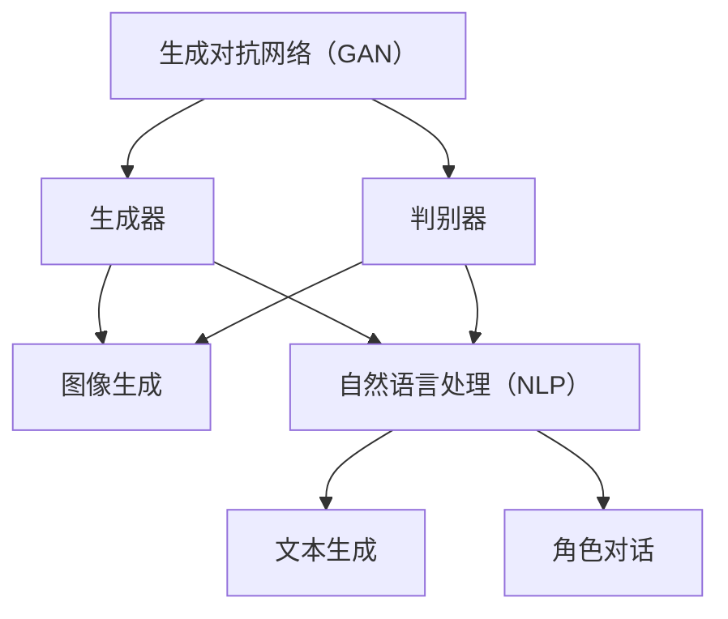

                 


### 文章标题：AI辅助科幻创作的提示词构建技巧

关键词：人工智能、科幻创作、提示词、生成对抗网络、强化学习、自然语言处理、深度学习、卷积神经网络、递归神经网络、聚类算法、项目实战、数学模型、伪代码、LaTeX公式、AI编程

摘要：
本文将深入探讨AI辅助科幻创作的提示词构建技巧。首先，我们将介绍AI辅助科幻创作的背景及其意义。然后，我们将详细解析AI在科幻创作中的应用，包括核心概念、算法原理、数学模型以及项目实战。通过这篇文章，读者将能够掌握AI辅助科幻创作的核心技术，学会构建有效的提示词，为科幻创作提供强大的技术支持。

### 引言

科幻创作是人类想象力的产物，它融合了科学技术、未来愿景和深刻的社会思考。随着人工智能技术的发展，AI逐渐成为科幻创作的重要工具。AI能够辅助作家生成创意、构建复杂的剧情和角色，从而提升科幻创作的效率和质量。本文旨在探讨如何利用AI技术构建有效的提示词，以辅助科幻创作。

本文的目标读者群体包括：
1. 对人工智能和科幻创作感兴趣的读者。
2. 想要学习AI辅助科幻创作的作家、编剧和创作者。
3. 计算机科学和人工智能领域的研究人员。

### 核心概念与联系

AI在科幻创作中涉及多个核心概念，如生成对抗网络（GAN）、强化学习、自然语言处理等。这些概念之间有着紧密的联系，共同构成了AI辅助科幻创作的基础。

**生成对抗网络（GAN）**：GAN是一种深度学习模型，由生成器和判别器组成。生成器生成数据，判别器判断生成数据是否真实。GAN在图像生成、文本生成等方面有着广泛应用，可以用于生成科幻场景、角色等。

**强化学习**：强化学习是一种通过奖励机制学习最优策略的机器学习方法。在科幻创作中，强化学习可以用于训练AI生成剧情和角色发展，使其更符合读者的期望。

**自然语言处理（NLP）**：NLP是AI的一个重要分支，它涉及到文本的生成、理解和处理。在科幻创作中，NLP可以用于生成科幻文本、角色对话等。

以下是一个Mermaid流程图，展示AI在科幻创作中的核心概念和它们之间的联系：



### AI辅助科幻创作的技巧

要利用AI辅助科幻创作，首先需要构建有效的提示词。提示词是引导AI生成内容的关键。以下是一些构建提示词的技巧：

1. **提示词生成策略**：
   - **关键字法**：使用关键词生成提示词，如“未来城市”、“外星人”、“时空旅行”等。
   - **语境法**：在特定语境下生成提示词，如“在未来的某一天，地球上发生了什么？”
   - **组合法**：将多个关键词组合成更复杂的提示词，如“未来城市外星人时空旅行”。

2. **提示词优化技巧**：
   - **多样性**：确保提示词具有多样性，避免重复。
   - **相关性**：提示词要与科幻作品的主题和情节相关。
   - **明确性**：提示词要清晰明确，避免歧义。

3. **引导AI生成科幻元素**：
   - **数据驱动**：使用已有的科幻作品数据训练AI，使其能够生成相似的元素。
   - **规则驱动**：基于科幻创作的规则和逻辑，引导AI生成元素。
   - **优化方法**：使用优化算法，如遗传算法，调整提示词，提高AI生成的质量。

### 核心算法原理讲解

在AI辅助科幻创作中，核心算法的原理至关重要。以下将详细解析GAN和NLP在科幻创作中的应用。

**生成对抗网络（GAN）**

GAN由生成器和判别器组成。生成器的任务是生成逼真的数据，判别器的任务是区分生成数据和真实数据。GAN的训练过程如下：

1. **生成器（Generator）**：
   - 输入：随机噪声向量 \(z\)
   - 输出：伪造数据 \(G(z)\)

   伪代码：

   ```python
   z = generate_noise()
   G(z) = G(z)
   ```

2. **判别器（Discriminator）**：
   - 输入：真实数据 \(x\) 和伪造数据 \(G(z)\)
   - 输出：概率值 \(D(x)\) 和 \(D(G(z))\)

   伪代码：

   ```python
   x = get_real_data()
   G(z) = generate_fake_data(z)
   D(x) = calculate_probability(x)
   D(G(z)) = calculate_probability(G(z))
   ```

GAN的训练目标是最大化判别器的损失函数，同时最小化生成器的损失函数。

**自然语言处理（NLP）**

NLP在科幻创作中主要用于文本生成和角色对话。以下是一个基于RNN的文本生成模型的基本结构：

1. **输入层**：
   - 输入：序列 \(X = (x_1, x_2, ..., x_T)\)
   
2. **隐藏层**：
   - 输出：隐藏状态 \(h_t = \text{RNN}(h_{t-1}, x_t)\)

3. **输出层**：
   - 输出：生成文本 \(Y = (\text{start\_token}, y_1, y_2, ..., y_T, \text{end\_token})\)

   伪代码：

   ```python
   for t in range(T):
       h_t = RNN(h_{t-1}, x_t)
       y_t = predict_token(h_t)
   ```

**聚类算法**

聚类算法可以用于对科幻元素进行分类，从而帮助AI生成元素。以下是一个基于K-means的聚类算法的基本步骤：

1. **初始化**：
   - 随机选择K个初始中心点 \(c_1, c_2, ..., c_K\)

2. **迭代**：
   - 对于每个数据点 \(x_i\)，计算它到每个中心点的距离 \(d(x_i, c_j)\)
   - 将 \(x_i\) 分配到最近的中心点 \(c_j\)

3. **更新**：
   - 计算每个簇的平均值作为新的中心点

   伪代码：

   ```python
   for i in range(I):
       c_new = calculate_mean_of_cluster(clusters)
       if is_converged(c_old, c_new):
           break
       c_old = c_new
   ```

### 数学模型和数学公式

在AI辅助科幻创作中，数学模型和公式起着至关重要的作用。以下是一些常见的数学模型和公式：

**生成对抗网络（GAN）**

生成器的损失函数：

$$
L_G = -\log(D(G(z))}
$$

判别器的损失函数：

$$
L_D = -\log(D(x)) - \log(1 - D(G(z))
$$

**自然语言处理（NLP）**

RNN的输出公式：

$$
y_t = \text{softmax}(\text{RNN}(h_t, W_y))
$$

**聚类算法**

K-means的目标函数：

$$
J = \sum_{i=1}^N \sum_{j=1}^K (x_i - c_j)^2
$$

### 项目实战

在本节中，我们将通过一个实际项目展示如何使用AI辅助科幻创作。

**项目环境搭建**

1. 安装Python环境（3.8以上版本）。
2. 安装必要的库，如TensorFlow、Keras等。

**代码实现**

以下是一个简单的GAN模型实现，用于生成科幻场景图片：

```python
import tensorflow as tf
from tensorflow.keras import layers

# 生成器
def build_generator(z_dim):
    model = tf.keras.Sequential([
        layers.Dense(7 * 7 * 128, activation="relu", input_shape=(z_dim,)),
        layers.Reshape((7, 7, 128)),
        layers.Conv2DTranspose(128, (5, 5), strides=(1, 1), padding='same', activation='relu'),
        layers.Conv2DTranspose(64, (5, 5), strides=(2, 2), padding='same', activation='relu'),
        layers.Conv2D(3, (5, 5), padding='same', activation='tanh')
    ])
    return model

# 判别器
def build_discriminator(img_shape):
    model = tf.keras.Sequential([
        layers.Conv2D(64, (5, 5), strides=(2, 2), padding='same', input_shape=img_shape, activation='relu'),
        layers.Conv2D(128, (5, 5), strides=(2, 2), padding='same', activation='relu'),
        layers.Flatten(),
        layers.Dense(1, activation='sigmoid')
    ])
    return model

# GAN模型
def build_gan(generator, discriminator):
    model = tf.keras.Sequential([
        generator,
        discriminator
    ])
    model.compile(loss='binary_crossentropy', optimizer=tf.keras.optimizers.Adam(0.0001))
    return model

# 生成随机噪声
z = tf.random.normal(shape=(1, 100))

# 生成科幻场景
fake_image = generator(z)

# 显示生成的图像
plt.imshow(fake_image[0].reshape(28, 28))
plt.show()
```

**代码解读与分析**

上述代码实现了一个简单的GAN模型，用于生成科幻场景图像。首先，我们定义了生成器和判别器的结构。生成器的目标是生成逼真的图像，判别器的目标是区分生成图像和真实图像。通过迭代训练，生成器不断优化其生成的图像，使其更接近真实图像。

**项目小结**

通过本项目，我们展示了如何使用AI生成科幻场景图像。这只是一个简单的示例，实际项目中可能需要更复杂的模型和更丰富的数据集。此外，还可以结合NLP技术生成科幻文本和角色对话，为科幻创作提供全面的技术支持。

### 最佳实践 Tips、小结、注意事项、拓展阅读

**最佳实践 Tips**：
1. 选择合适的GAN架构，如DCGAN、WGAN等，以提高生成质量。
2. 使用预训练的NLP模型，如GPT-3、BERT等，以提高文本生成的质量。
3. 合理调整超参数，如学习率、批量大小等，以获得更好的训练效果。

**小结**：
本文详细介绍了AI辅助科幻创作的提示词构建技巧，包括核心概念、算法原理、数学模型和项目实战。通过本文的学习，读者可以掌握AI辅助科幻创作的基本方法，为科幻创作提供强大的技术支持。

**注意事项**：
1. AI辅助科幻创作需要大量高质量的训练数据，建议使用开放数据集进行训练。
2. 在训练过程中，要关注模型的过拟合问题，可以采用正则化方法进行缓解。
3. AI辅助科幻创作是一个不断发展的领域，读者应保持持续学习和探索的态度。

**拓展阅读**：
1. Ian Goodfellow的《生成对抗网络》（Generative Adversarial Networks）。
2. 阿尔文·拉塞尔的《自然语言处理实战》（Natural Language Processing with Python）。
3. 吴恩达的《深度学习》（Deep Learning）。

作者：AI天才研究院/AI Genius Institute & 禅与计算机程序设计艺术 /Zen And The Art of Computer Programming

