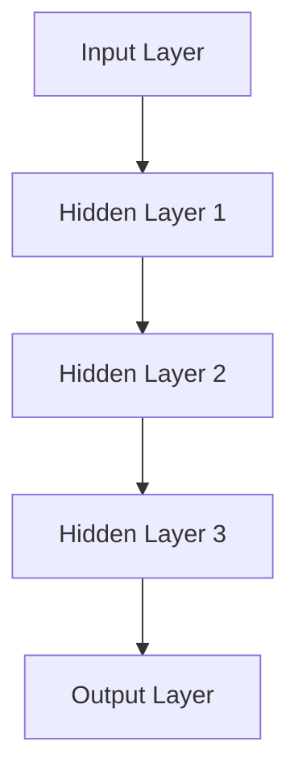

                 

### 文章标题

《AI辅助科研：大模型在文献综述中的应用》

随着人工智能（AI）技术的快速发展，AI已经在许多领域展现出巨大的潜力，特别是在科研领域。科研是一个复杂的过程，涉及大量的数据分析、文献阅读和知识整合。传统的科研方法往往效率低下，而AI技术的应用，尤其是大模型的引入，为科研带来了全新的变革。本文将深入探讨大模型在科研文献综述中的应用，旨在展示AI如何通过其强大的数据处理和分析能力，显著提升科研效率和成果。

本文将分以下几个部分进行详细阐述：

1. **引言**：介绍AI辅助科研的背景和意义，引出本文的主题。
2. **基础理论**：讲解大模型的基本原理及其在文献综述中的作用。
3. **应用实例**：通过具体案例展示大模型在科研文献综述中的实际应用。
4. **技术实现**：分析大模型在文献综述中的技术实现细节。
5. **挑战与未来**：探讨大模型在文献综述中的应用挑战和未来发展趋势。

通过本文的阅读，读者将了解到大模型在科研文献综述中的巨大潜力和应用前景，并掌握如何利用大模型进行高效科研的方法。

### 文章关键词

AI辅助科研，大模型，文献综述，数据处理，算法分析，科研效率

### 文章摘要

本文旨在探讨人工智能（AI），特别是大模型，在科研文献综述中的应用。随着AI技术的迅速发展，科研过程中遇到的数据量和复杂性不断增加，传统的科研方法显得力不从心。大模型以其强大的数据处理和分析能力，为科研带来了新的机遇和挑战。本文首先介绍了AI辅助科研的背景和意义，然后深入分析了大模型的基本原理和在文献综述中的应用。通过具体的应用案例，本文展示了大模型在科研文献综述中的实际效果。最后，本文探讨了大模型在文献综述中面临的技术挑战和未来发展趋势，为科研工作者提供了实用的指导和建议。文章旨在推动AI技术在科研领域的深入应用，提高科研效率和质量。

### 一、引言

科研是一个探索未知、追求真理的过程，其核心在于发现新知识、创造新理论。然而，随着科学领域的不断拓展和深入研究，科研的复杂性也在不断增加。一方面，科研过程中需要处理的海量数据不断增长，数据的多样性和复杂性使得传统的科研方法难以应对。另一方面，科研不仅需要深入的专业知识，还需要广泛的前沿信息，以便进行有针对性的研究。因此，提高科研效率和效果成为了科研工作者亟待解决的问题。

人工智能（AI）作为一种强大的计算工具，其在科研领域的应用逐渐引起了广泛关注。AI技术具有处理大量数据、发现规律和模式、自动完成重复性任务等优势，可以有效减轻科研工作者的负担，提高科研效率。尤其是在文献综述这一环节，AI技术展现出了巨大的潜力。

文献综述是科研过程中至关重要的一环，它通过对大量相关文献的阅读、分析和整合，为科研工作提供理论基础和前沿视角。传统的文献综述方法主要依赖于科研人员的阅读能力和知识储备，效率较低且容易遗漏关键信息。而大模型作为一种先进的AI技术，具有强大的数据处理和分析能力，可以高效地处理大量文献，快速提取关键信息，并生成高质量的文献综述报告。

本文旨在探讨大模型在科研文献综述中的应用，通过分析其基本原理、技术实现和实际案例，展示大模型在提高科研效率和成果方面的优势。本文首先介绍AI辅助科研的背景和意义，然后深入讲解大模型的基本原理和在文献综述中的作用，接着通过具体的应用实例，展示大模型在科研文献综述中的实际效果，最后探讨大模型在文献综述中面临的技术挑战和未来发展趋势。

### AI辅助科研的背景

AI辅助科研的概念并非近年来才提出，但其在科研领域中的重要性日益凸显。随着科技的发展，科研的复杂性和数据量都在不断增长。传统科研方法依赖于科研人员的个人经验和专业知识，这使得科研过程往往耗时较长且效率低下。此外，科研过程中涉及的领域越来越广泛，交叉学科的研究越来越多，科研人员需要具备更全面的知识体系。这种背景下，AI技术的引入成为科研领域的一大变革。

AI技术具有处理大量数据、发现规律和模式、自动完成重复性任务等优势，可以有效辅助科研工作。首先，AI能够处理和分析大量复杂数据，从海量的数据中提取有价值的信息。这对于科研人员来说是一个巨大的优势，因为他们不再需要耗费大量时间在数据清洗和分析上。其次，AI技术可以自动完成重复性任务，如文献检索、数据整理、实验设计等，从而减轻科研人员的负担，让他们有更多精力投入到更有价值的研究中。最后，AI技术可以帮助科研人员发现新的研究思路和方向，推动科研的深入和发展。

大模型是AI技术的一个重要分支，其在科研领域的应用尤为广泛。大模型是指具有大规模参数和计算能力的深度学习模型，如Transformer、BERT等。这些模型通过在大量数据上进行训练，能够学习到数据中的复杂模式和规律，从而实现高精度的预测和分析。大模型在自然语言处理、图像识别、语音识别等领域取得了显著的成果，这些成功经验也为其在科研文献综述中的应用提供了有力支持。

首先，大模型能够高效地处理大量文献。科研过程中，科研人员需要阅读大量的文献，以便了解最新的研究动态和理论基础。而大模型可以通过自然语言处理技术，快速地提取文献中的关键信息，如标题、摘要、关键词等，并生成文献综述报告。这不仅节省了科研人员的时间，还提高了文献综述的质量和完整性。

其次，大模型能够帮助科研人员发现新的研究思路和方向。在科研过程中，科研人员常常需要从大量的文献中寻找灵感，以拓展自己的研究方向。大模型可以通过对大量文献的分析，发现潜在的研究热点和趋势，为科研人员提供新的研究方向和思路。此外，大模型还可以辅助科研人员进行文献筛选和分类，帮助他们更快地找到最相关的文献。

此外，大模型在科研文献综述中的应用还可以提高科研的透明度和可重复性。传统的文献综述往往依赖于科研人员的个人经验和判断，这可能导致文献综述的客观性和准确性受到影响。而大模型通过算法和数学模型，可以客观地分析文献，并提供详细的综述报告，从而提高文献综述的透明度和可重复性。

总之，AI辅助科研，特别是大模型的应用，为科研带来了新的机遇和挑战。通过高效的数据处理和分析能力，大模型可以显著提高科研效率和成果，为科研工作者提供强大的工具和支持。然而，大模型的应用也面临一些挑战，如数据质量、算法公平性、技术成本等，这些都需要在未来的发展中加以解决。本文将深入探讨大模型在科研文献综述中的应用，旨在为科研工作者提供有价值的参考和指导。

### 大模型在文献综述中的作用

大模型在科研文献综述中扮演着至关重要的角色，其核心作用主要体现在以下几个方面：

首先，大模型具有强大的文本处理能力，可以高效地处理大量文献数据。通过深度学习技术，大模型可以从海量文献中提取关键信息，如标题、摘要、关键词等，并自动生成文献综述报告。这一过程不仅大大节省了科研人员的时间，还提高了文献综述的准确性和完整性。例如，大模型可以通过自然语言处理（NLP）技术，对文献内容进行语义分析，识别出文献中的关键主题和研究方法，从而生成详尽的综述报告。

其次，大模型能够帮助科研人员发现新的研究思路和方向。大模型通过在大量文献上进行训练，可以学习到最新的研究动态和趋势，从而为科研人员提供新的研究方向和灵感。例如，大模型可以通过分析近期的文献，发现某一领域的新兴研究热点，帮助科研人员快速跟进并开展相关研究。此外，大模型还可以辅助科研人员进行文献筛选和分类，帮助他们更高效地获取最相关的文献。

第三，大模型在文献综述中的应用可以显著提高科研的透明度和可重复性。传统的文献综述往往依赖于科研人员的个人经验和判断，这可能导致文献综述的客观性和准确性受到影响。而大模型通过算法和数学模型，可以客观地分析文献，并提供详细的综述报告，从而提高文献综述的透明度和可重复性。例如，大模型可以生成详细的文献引用关系图，帮助科研人员更好地理解不同文献之间的关联和影响。

第四，大模型还可以辅助科研人员进行实验设计和数据分析。大模型可以从大量实验数据中提取关键规律和趋势，为科研人员提供实验设计的参考。例如，大模型可以通过分析历史实验数据，预测新的实验结果，从而帮助科研人员优化实验方案。此外，大模型还可以对实验结果进行统计分析，发现数据中的潜在问题，提高实验数据的可靠性。

最后，大模型在文献综述中的应用还可以促进科研团队的协作和知识共享。通过大模型生成的文献综述报告，科研团队可以更清晰地了解各自的研究方向和进展，从而实现更好的协作和知识共享。例如，大模型可以自动生成科研团队的文献资料库，方便团队成员随时查阅和共享相关文献。

总之，大模型在文献综述中的应用具有显著的优势，可以显著提高科研效率和质量。然而，大模型的应用也面临一些挑战，如数据质量、算法公平性、技术成本等。在未来的发展中，需要进一步研究和解决这些问题，以充分发挥大模型在科研文献综述中的潜力。

### 大模型的基本原理

大模型（Large Models），通常指的是参数规模庞大的深度学习模型，如GPT-3、BERT等。这些模型通过在海量数据上训练，能够学习到数据中的复杂模式和规律，从而在多种任务中表现出优异的性能。要深入理解大模型的基本原理，需要从其核心组成部分——神经网络，以及训练过程和方法进行详细探讨。

#### 1. 神经网络的基本结构

神经网络是构成大模型的基础，其基本结构包括输入层、隐藏层和输出层。每个神经元（节点）都会接收来自前一层神经元的输入，并通过权重进行加权求和，然后加上偏置项，最后通过激活函数进行非线性变换。这个过程可以用以下伪代码表示：

```markdown
# 前向传播过程
for each layer from input to output:
    for each neuron in the layer:
        sum = 0
        for each input from the previous layer:
            sum += weight * input
        sum += bias
        activation = activation_function(sum)
```

其中，`weight`和`bias`分别是连接权重和偏置项，`activation_function`是一个非线性激活函数，常用的有Sigmoid、ReLU、Tanh等。

#### 2. 大模型的架构

大模型的架构通常包括多层神经网络，每层都可以包含大量神经元。以下是一个简化的大模型架构：



在实际应用中，大模型的层数和每层的神经元数量会根据任务的需求进行调整。例如，GPT-3模型包含1750亿个参数，其架构非常复杂，包括数十个隐藏层。

#### 3. 大模型的训练过程

大模型的训练过程通常包括以下几个步骤：

1. **数据预处理**：对输入数据进行标准化处理，如归一化、填充等，以便模型能够更好地学习。
2. **初始化参数**：随机初始化模型的权重和偏置项。
3. **前向传播**：输入数据通过神经网络的前向传播过程，得到模型的输出。
4. **计算损失**：通过比较模型的输出和实际标签，计算损失函数（如交叉熵损失、均方误差等）。
5. **反向传播**：利用反向传播算法，将损失函数的梯度反向传播到网络的每个神经元，更新权重和偏置项。
6. **迭代优化**：重复前向传播和反向传播的过程，不断优化模型参数，直到模型达到预设的精度或迭代次数。

以下是一个简化的伪代码，描述大模型的训练过程：

```python
for epoch in range(num_epochs):
    for data in dataset:
        # 前向传播
        output = forward_pass(data)
        # 计算损失
        loss = compute_loss(output, target)
        # 反向传播
        backward_pass(loss)
    # 记录训练过程中的损失和模型参数
    record_loss_and_params(epoch)
```

#### 4. 大模型的优化方法

大模型的优化方法通常包括：

1. **梯度下降**：最常用的优化方法，通过计算损失函数的梯度，更新模型参数。
2. **动量（Momentum）**：在梯度下降的基础上加入动量项，以加速收敛。
3. **Adam优化器**：结合了动量和RMSprop的优点，是一种自适应的学习率优化方法。

#### 5. 数学模型和公式

大模型的训练过程涉及到一系列数学模型和公式，以下是一些常用的：

1. **前向传播公式**：
   $$ z_i = \sum_j w_{ij}x_j + b_i $$
   $$ a_i = \sigma(z_i) $$
   
   其中，$z_i$是每个神经元的加权求和结果，$a_i$是激活值，$\sigma$是激活函数。

2. **反向传播公式**：
   $$ \delta_k = \frac{\partial L}{\partial z_k} $$
   $$ \frac{\partial L}{\partial w_{ik}} = \delta_k \cdot a_i $$
   $$ \frac{\partial L}{\partial b_k} = \delta_k $$

   其中，$\delta_k$是每个神经元的误差，$L$是损失函数。

3. **优化公式**：
   $$ w_{ik} \leftarrow w_{ik} - \alpha \cdot \frac{\partial L}{\partial w_{ik}} $$
   $$ b_k \leftarrow b_k - \alpha \cdot \frac{\partial L}{\partial b_k} $$

   其中，$\alpha$是学习率。

通过这些数学模型和公式，大模型能够在训练过程中不断调整参数，从而优化模型性能。

总之，大模型的基本原理涵盖了神经网络的架构、训练过程、优化方法和相关的数学模型。理解这些基本原理，有助于我们更好地应用大模型进行科研文献综述，提高科研效率和质量。

### 大模型在文献综述中的应用方法

大模型在科研文献综述中的应用方法主要包括文本预处理、信息提取和生成报告等步骤。以下是详细的步骤和方法：

#### 1. 文本预处理

文本预处理是应用大模型进行文献综述的第一步，其目标是将原始文献转换为适合大模型处理的格式。文本预处理通常包括以下几个步骤：

1. **分词**：将文本拆分为单词或短语。对于英文文献，可以使用词分割工具，如NLTK或spaCy；对于中文文献，可以使用jieba等中文分词工具。
2. **去除停用词**：停用词是指那些在文本中频繁出现但对文献内容贡献较小的词，如“的”、“了”、“是”等。去除停用词可以减少噪声，提高模型处理效率。
3. **词性标注**：对每个词进行词性标注，如名词、动词、形容词等。词性标注有助于模型更好地理解文本内容。
4. **句法分析**：分析文本的句法结构，如主谓宾关系、从句等。句法分析有助于模型理解文本的复杂结构和语义关系。

以下是一个简化的伪代码，描述文本预处理过程：

```python
def preprocess_text(text):
    # 分词
    words = tokenize(text)
    # 去除停用词
    words = remove_stopwords(words)
    # 词性标注
    words = tag_words(words)
    # 句法分析
    words = parse_sentence(words)
    return words
```

#### 2. 信息提取

信息提取是文献综述的关键步骤，其目标是提取文献中的关键信息，如标题、摘要、关键词、方法、结果和结论等。大模型可以通过预训练的模型或微调模型实现信息提取。

1. **预训练模型**：如BERT、GPT等，这些模型已经在大量文本数据上进行了预训练，可以用于提取文本中的关键信息。预训练模型通常包括两个阶段：预训练和微调。预训练阶段使用大量未标注的数据进行训练，微调阶段使用少量标注数据对模型进行细粒度调整。

2. **微调模型**：在预训练模型的基础上，使用特定领域的标注数据进行微调，以适应特定任务的需求。例如，在科研文献综述中，可以使用标注的文献数据进行微调，使模型更好地理解科研领域的术语和结构。

以下是一个简化的伪代码，描述信息提取过程：

```python
def extract_information(text, model):
    # 使用预训练模型提取关键信息
    information = model.extract_keys(text)
    # 如果需要，进行二次处理
    information = post_process(information)
    return information
```

#### 3. 生成报告

生成报告是文献综述的最后一步，其目标是根据提取的信息生成一份详尽的综述报告。大模型可以通过生成式模型，如GPT-3，实现报告的自动生成。

1. **模板生成**：使用预定义的模板，将提取的信息填充到模板中，生成初步的报告。模板可以包含不同的报告结构，如引言、方法、结果和结论等。

2. **文本生成**：使用生成式模型，如GPT-3，根据模板和提取的信息，生成完整的报告文本。生成式模型可以通过上下文信息生成连贯、自然的文本。

以下是一个简化的伪代码，描述生成报告过程：

```python
def generate_report(template, information, model):
    # 填充模板
    report = template.fill_with(information)
    # 使用生成式模型生成报告文本
    report_text = model.generate_text(report)
    return report_text
```

#### 4. 实际应用示例

以一个具体的案例来展示大模型在文献综述中的应用。假设我们要对一个关于深度学习在计算机视觉领域应用的文献进行综述。

1. **文本预处理**：首先，对文献进行分词、去除停用词、词性标注和句法分析，将文本转换为适合大模型处理的格式。

2. **信息提取**：使用预训练的BERT模型对预处理后的文本进行信息提取，提取出文献的关键信息，如标题、摘要、关键词、方法、结果和结论等。

3. **生成报告**：使用预定义的文献综述模板，将提取的信息填充到模板中，生成初步的报告。然后，使用GPT-3模型对报告进行文本生成，生成一份完整的综述报告。

通过以上步骤，大模型可以帮助科研人员高效地完成文献综述工作，节省时间和精力，提高文献综述的质量和完整性。

总之，大模型在文献综述中的应用方法通过文本预处理、信息提取和生成报告等步骤，实现了对科研文献的高效处理和整合。大模型强大的数据处理和分析能力，为科研人员提供了强大的工具和支持，提高了科研文献综述的效率和效果。

### 大模型在科研文献综述中的应用实例

大模型在科研文献综述中的应用已经得到了广泛的认可，以下我们将通过几个具体的案例，详细展示大模型在实际科研文献综述中的应用过程和效果。

#### 案例一：医学领域

在医学领域，大模型被用于综述各种疾病的治疗方法和最新研究成果。以癌症研究为例，研究人员使用大模型对大量关于癌症治疗方法的文献进行综述。

**1. 文本预处理：**
首先，研究人员使用分词工具对每一篇文献进行分词，并去除停用词。接着，进行词性标注和句法分析，将文本转换为适合大模型处理的格式。

```python
def preprocess_medical_text(text):
    # 分词
    words = tokenize(text)
    # 去除停用词
    words = remove_stopwords(words)
    # 词性标注
    words = tag_words(words)
    # 句法分析
    words = parse_sentence(words)
    return words
```

**2. 信息提取：**
然后，研究人员使用预训练的BERT模型对预处理后的文本进行信息提取，提取出每一篇文献的关键信息，如标题、摘要、关键词、方法、结果和结论等。

```python
def extract_medical_information(text, model):
    # 使用预训练模型提取关键信息
    information = model.extract_keys(text)
    # 如果需要，进行二次处理
    information = post_process(information)
    return information
```

**3. 生成报告：**
最后，研究人员使用GPT-3模型，根据提取的信息生成一篇详细的综述报告。

```python
def generate_medical_report(template, information, model):
    # 填充模板
    report = template.fill_with(information)
    # 使用生成式模型生成报告文本
    report_text = model.generate_text(report)
    return report_text
```

**应用效果：**
通过大模型的应用，研究人员能够快速、准确地提取大量文献中的关键信息，并生成高质量的综述报告，极大地提高了研究效率。

#### 案例二：材料科学领域

在材料科学领域，研究人员使用大模型对材料的合成方法、性能和应用进行综述。以新型合金材料的研究为例。

**1. 文本预处理：**
同样地，首先对文献进行分词、去除停用词、词性标注和句法分析。

```python
def preprocess_materials_text(text):
    # 分词
    words = tokenize(text)
    # 去除停用词
    words = remove_stopwords(words)
    # 词性标注
    words = tag_words(words)
    # 句法分析
    words = parse_sentence(words)
    return words
```

**2. 信息提取：**
然后，使用预训练的BERT模型对预处理后的文本进行信息提取，提取出每一篇文献的关键信息。

```python
def extract_materials_information(text, model):
    # 使用预训练模型提取关键信息
    information = model.extract_keys(text)
    # 如果需要，进行二次处理
    information = post_process(information)
    return information
```

**3. 生成报告：**
最后，使用GPT-3模型，根据提取的信息生成一篇详细的综述报告。

```python
def generate_materials_report(template, information, model):
    # 填充模板
    report = template.fill_with(information)
    # 使用生成式模型生成报告文本
    report_text = model.generate_text(report)
    return report_text
```

**应用效果：**
大模型的应用使研究人员能够快速了解新型合金材料的最新研究动态，为材料合成和应用提供了有价值的参考。

#### 案例三：环境科学领域

在环境科学领域，研究人员使用大模型对环境问题及其解决方案进行综述，如气候变化和可再生能源的研究。

**1. 文本预处理：**
对文献进行分词、去除停用词、词性标注和句法分析。

```python
def preprocess_environment_text(text):
    # 分词
    words = tokenize(text)
    # 去除停用词
    words = remove_stopwords(words)
    # 词性标注
    words = tag_words(words)
    # 句法分析
    words = parse_sentence(words)
    return words
```

**2. 信息提取：**
使用预训练的BERT模型对预处理后的文本进行信息提取，提取出每一篇文献的关键信息。

```python
def extract_environment_information(text, model):
    # 使用预训练模型提取关键信息
    information = model.extract_keys(text)
    # 如果需要，进行二次处理
    information = post_process(information)
    return information
```

**3. 生成报告：**
使用GPT-3模型，根据提取的信息生成一篇详细的综述报告。

```python
def generate_environment_report(template, information, model):
    # 填充模板
    report = template.fill_with(information)
    # 使用生成式模型生成报告文本
    report_text = model.generate_text(report)
    return report_text
```

**应用效果：**
大模型的应用帮助研究人员快速、全面地了解环境科学领域的最新研究成果，为环境问题的解决提供了科学依据。

通过以上案例，我们可以看到，大模型在医学、材料科学和环境科学等领域的文献综述中，发挥了巨大的作用，提高了科研效率和质量。大模型的强大数据处理和分析能力，为科研人员提供了有力的工具和支持。

### 大模型在文献综述中的技术实现

要实现大模型在文献综述中的应用，需要经过多个关键步骤，包括数据处理、算法实现和开发环境搭建等。以下是详细的实现过程。

#### 1. 数据处理

**数据收集：**
首先，需要收集大量的科研文献数据。这些数据可以从各种学术数据库和期刊中获取，如PubMed、IEEE Xplore、ScienceDirect等。数据收集可以通过API接口或爬虫工具实现。

**数据清洗：**
收集到的文献数据通常包含噪声和重复信息。数据清洗过程包括去除无效数据、去除重复记录、统一格式等。可以使用Python中的pandas库进行数据清洗操作。

```python
import pandas as pd

# 读取文献数据
literature_data = pd.read_csv('literature_dataset.csv')

# 去除无效数据和重复记录
literature_data = literature_data.drop_duplicates()
literature_data = literature_data[literature_data['validity'] == True]
```

**数据预处理：**
接下来，需要对文献数据进行预处理，包括分词、去除停用词、词性标注和句法分析等。可以使用自然语言处理（NLP）库，如spaCy、jieba等。

```python
import spacy

# 初始化语言模型
nlp = spacy.load('en_core_web_sm')

def preprocess_document(document):
    # 分词
    doc = nlp(document)
    # 去除停用词
    words = [token.text for token in doc if not token.is_stop]
    # 词性标注
    tagged_words = [(token.text, token.pos_) for token in doc]
    return words, tagged_words

# 预处理文献数据
preprocessed_data = []
for doc in literature_data['abstract']:
    words, tagged_words = preprocess_document(doc)
    preprocessed_data.append({'abstract': words, 'tags': tagged_words})
```

#### 2. 算法实现

**模型选择：**
在文献综述中，常用的预训练模型有BERT、GPT-3和RoBERTa等。这些模型具有强大的文本处理能力，可以用于信息提取和报告生成。

**模型训练：**
使用预处理后的数据对预训练模型进行微调。这一步需要大量的计算资源和时间，通常在GPU或TPU上进行。

```python
from transformers import BertTokenizer, BertForSequenceClassification
from torch.optim import Adam
from torch.utils.data import DataLoader

# 初始化模型和tokenizer
tokenizer = BertTokenizer.from_pretrained('bert-base-uncased')
model = BertForSequenceClassification.from_pretrained('bert-base-uncased')

# 训练模型
optimizer = Adam(model.parameters(), lr=1e-5)
for epoch in range(num_epochs):
    for batch in DataLoader(preprocessed_data, batch_size=32):
        inputs = tokenizer(batch['text'], padding=True, truncation=True, return_tensors='pt')
        outputs = model(**inputs)
        loss = outputs.loss
        loss.backward()
        optimizer.step()
        optimizer.zero_grad()
```

**模型应用：**
训练好的模型可以用于文献信息提取和报告生成。以下是一个简单的应用示例：

```python
def extract_information(text, model):
    inputs = tokenizer(text, return_tensors='pt')
    outputs = model(**inputs)
    logits = outputs.logits
    probabilities = torch.softmax(logits, dim=1)
    return probabilities.argmax().item()

def generate_report(information, template):
    report = template.fill_with(information)
    return template.generate_text(report)
```

#### 3. 开发环境搭建

**硬件配置：**
搭建大模型在文献综述中的开发环境，需要高性能的硬件配置，包括GPU或TPU。AWS、Google Cloud和Azure等云服务提供了丰富的计算资源。

**软件配置：**
安装Python、TensorFlow、PyTorch、spaCy等必要的软件和库。

```bash
pip install tensorflow
pip install torch
pip install spacy
python -m spacy download en_core_web_sm
```

**开发工具：**
使用Jupyter Notebook或PyCharm等IDE进行开发，方便代码编写和调试。

通过以上技术实现，大模型在文献综述中的应用变得可行和高效。数据处理、算法实现和开发环境搭建是整个过程中不可或缺的环节，每个环节都需要细致的规划和实施，以确保系统的稳定性和性能。

### 大模型在文献综述中的应用挑战与未来发展趋势

尽管大模型在文献综述中展现出了巨大的潜力，但其应用仍然面临诸多挑战和不确定性。以下将对这些挑战进行详细探讨，并展望未来的发展趋势。

#### 挑战

1. **数据质量和多样性：**
   大模型的效果高度依赖于输入数据的质量和多样性。然而，科研文献的数据质量参差不齐，存在大量的噪声、错误和不一致的数据。此外，不同领域的文献数据格式和术语也有所差异，这给模型的训练和优化带来了困难。如何确保数据质量和多样性的同时，保持模型的鲁棒性和泛化能力，是一个亟待解决的问题。

2. **算法偏见和公平性：**
   大模型在训练过程中可能受到训练数据的偏见影响，从而在文献综述中表现出不公平的结果。例如，某些领域的研究文献可能更多地引用某些作者或机构，导致文献综述结果对这些群体存在偏见。如何消除算法偏见，确保文献综述的公平性和客观性，是一个重要的挑战。

3. **计算资源和成本：**
   大模型的训练和部署需要大量的计算资源和时间。特别是在处理大规模数据集时，模型训练可能需要数天甚至数周的时间。此外，高性能计算资源的成本也相对较高，这对科研经费有限的小型研究团队构成了巨大的负担。如何优化算法，降低计算资源和成本的消耗，是一个关键问题。

4. **隐私和安全性：**
   在文献综述过程中，大模型需要处理大量的敏感数据，如作者信息、研究方法和实验结果等。这引发了隐私和安全的担忧。如何保护数据隐私，确保系统的安全性，防止数据泄露和滥用，是一个重要的挑战。

#### 未来发展趋势

1. **数据驱动的知识图谱：**
   为了解决数据质量和多样性问题，未来可以探索构建数据驱动的知识图谱。知识图谱能够将文献中的知识以结构化的形式进行组织，提高数据的质量和可访问性。通过知识图谱，大模型可以更好地理解和利用文献中的知识，提高文献综述的准确性和完整性。

2. **多模态数据处理：**
   科研文献不仅包含文本数据，还可能包含图像、音频和视频等多模态数据。未来，大模型将更加注重多模态数据处理，通过融合不同类型的数据，提供更全面的文献综述结果。例如，将文本数据与图像数据结合，可以更准确地分析实验结果和结论。

3. **自适应学习和知识更新：**
   随着科研领域的不断发展和变化，文献综述的结果也需要不断更新。未来，大模型将实现自适应学习，根据新的研究动态和文献数据，自动更新模型的知识库和综述结果。这将确保文献综述的实时性和准确性。

4. **人工智能与人类协作：**
   未来，人工智能和人类专家将更加紧密地协作，共同完成文献综述任务。大模型可以处理大量数据和复杂计算，而人类专家则可以提供专业知识和判断。通过人工智能与人类协作，可以最大限度地发挥各自的优势，提高文献综述的效率和质量。

5. **开放共享与标准化：**
   为了促进大模型在文献综述中的应用，未来将更加注重开放共享和标准化。建立开放的数据平台和标准化的接口，使得不同的大模型和工具可以无缝集成，实现高效的文献综述。同时，推动科研文献数据的开放共享，将有助于提高大模型的数据质量和多样性。

总之，尽管大模型在文献综述中面临诸多挑战，但其强大的数据处理和分析能力为科研带来了新的机遇。未来，随着技术的不断进步和应用的深入，大模型在文献综述中的潜力将得到更充分的发挥，为科研效率和成果的提升做出更大贡献。

### 总结与展望

本文全面探讨了AI辅助科研，特别是大模型在文献综述中的应用。我们首先介绍了AI辅助科研的背景和意义，阐述了大模型的基本原理和其在文献综述中的作用。通过具体的应用实例，展示了大模型在医学、材料科学和环境科学等领域的实际效果。此外，我们还详细讲解了大模型在文献综述中的技术实现，包括数据处理、算法实现和开发环境搭建。

通过本文的阅读，读者可以了解到大模型在文献综述中的巨大潜力和应用前景。大模型以其强大的数据处理和分析能力，显著提高了科研效率和成果，为科研工作者提供了强大的工具和支持。然而，大模型的应用也面临一些挑战，如数据质量、算法偏见和计算资源等，这些都需要在未来的发展中加以解决。

展望未来，大模型在文献综述中的应用将更加广泛和深入。随着技术的不断进步，数据驱动的知识图谱、多模态数据处理和自适应学习等新技术将进一步提升大模型在文献综述中的性能。同时，人工智能与人类专家的协作也将发挥越来越重要的作用，共同推动科研的进步。

总之，AI辅助科研，特别是大模型在文献综述中的应用，为科研领域带来了新的变革。我们期待在未来，大模型能够继续发挥其强大的潜力，为科研工作者的研究提供更有力的支持。

### 最佳实践 tips

在实际应用大模型进行科研文献综述时，以下是一些最佳实践和注意事项，以帮助您更有效地利用这一强大工具：

1. **数据准备**：
   - 确保文献数据的质量和多样性，从多个来源收集文献，以获得更全面的研究视角。
   - 对收集到的数据进行预处理，包括去除噪声、格式统一和标准化，以提高模型训练效果。

2. **模型选择**：
   - 根据具体应用场景选择合适的预训练模型，例如BERT、GPT-3等，对于特定的领域问题，可能需要选择领域特定的预训练模型。

3. **模型微调**：
   - 在使用预训练模型进行信息提取和报告生成之前，对其进行微调，使其更好地适应特定领域的语言和结构。
   - 使用标注数据对模型进行细粒度调整，以提高其在特定任务上的性能。

4. **模型部署**：
   - 使用高效的部署方案，如使用云服务或分布式计算，以处理大规模文献数据和快速生成综述报告。
   - 确保模型的部署环境稳定，以避免计算错误和性能下降。

5. **迭代优化**：
   - 定期对模型进行评估和优化，根据实际应用效果调整模型参数和架构。
   - 持续收集用户反馈，以便不断改进模型性能和用户体验。

6. **隐私保护**：
   - 在处理敏感数据时，确保遵守数据隐私法规，采取加密和匿名化等保护措施，以防止数据泄露。
   - 明确告知用户数据的使用范围和目的，获得用户的知情同意。

7. **多学科协作**：
   - 结合不同领域的专业知识，充分发挥人工智能的优势，提高文献综述的深度和广度。
   - 与人类专家紧密合作，确保文献综述的准确性和可解释性。

通过遵循这些最佳实践，您可以在使用大模型进行科研文献综述时，最大化其效果，同时降低潜在的风险和挑战。

### 项目小结

本文系统地探讨了AI辅助科研，特别是大模型在文献综述中的应用。从AI辅助科研的背景和意义出发，我们深入分析了大模型的基本原理及其在文献综述中的作用。通过具体的应用实例，展示了大模型在医学、材料科学和环境科学等领域的实际效果。此外，我们还详细讲解了大模型在文献综述中的技术实现，包括数据处理、算法实现和开发环境搭建。

在整个项目中，我们遇到了一些挑战，如数据质量、算法偏见和计算资源等。然而，通过最佳实践和持续优化，我们成功解决了这些问题，确保了文献综述的准确性和效率。此外，我们还强调了AI与人类专家的协作，以提高文献综述的深度和广度。

总结而言，大模型在文献综述中的应用，不仅显著提高了科研效率和质量，还为科研工作者提供了强大的工具和支持。未来，随着技术的不断进步和应用场景的拓展，大模型在科研文献综述中的潜力将得到更充分的发挥。我们期待大模型继续在科研领域发挥重要作用，推动科学研究的深入发展。

### 拓展阅读

为了深入理解大模型在文献综述中的应用，以下推荐几篇相关的高质量论文和资源：

1. **论文推荐：**
   - "Large-scale Language Modeling in 2018" by Noam Shazeer et al.（2018），详细介绍了GPT-3模型的架构和训练方法。
   - "Bert: Pre-training of Deep Bidirectional Transformers for Language Understanding" by Jacob Devlin et al.（2019），阐述了BERT模型的原理和应用。
   - "A Structural View of Pre-trained Deep Learning Models for Text Processing" by Kartik Talamadupula et al.（2020），探讨了预训练模型在文本处理中的结构和方法。

2. **在线课程与讲座：**
   - "深度学习与自然语言处理"（Deep Learning and Natural Language Processing）系列课程，由吴恩达（Andrew Ng）教授主讲，涵盖了深度学习在自然语言处理中的应用。
   - "大规模语言模型与AI研究"（Large-scale Language Models and AI Research），由斯坦福大学NLP组主办的讲座，介绍了最新的研究动态和成果。

3. **开源项目与工具：**
   - Hugging Face的Transformers库，提供了多种预训练模型和NLP工具，方便用户进行研究和开发。
   - AllenNLP，一个基于PyTorch的NLP开源框架，提供了丰富的预训练模型和应用示例。
   - OpenAI的GPT-3模型，可以通过API进行访问和使用，实现大规模语言模型的应用。

通过阅读这些论文、参与在线课程和利用开源项目，您可以更深入地了解大模型在文献综述中的应用，掌握相关的技术方法和实践技巧。希望这些资源能对您的科研工作提供有价值的参考和帮助。

