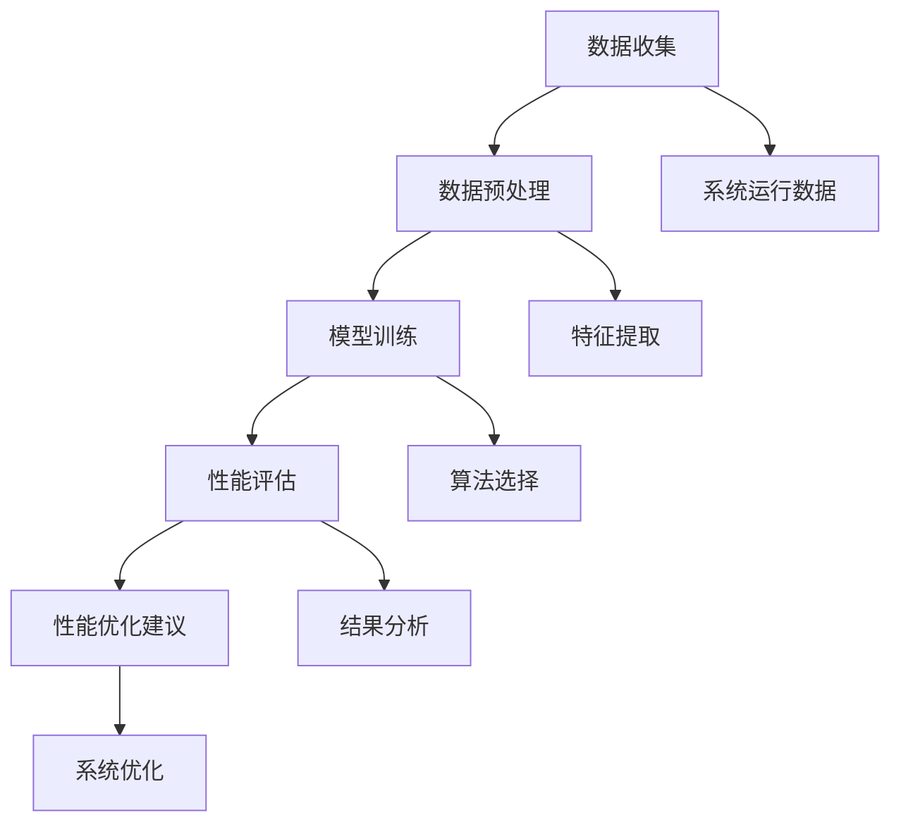

                 


### 文章标题

《AI辅助软件性能瓶颈识别：从症状到根因》

### 关键词

人工智能、软件性能瓶颈、AI辅助性能瓶颈识别、机器学习、深度学习、算法、数学模型、项目实战、开发环境搭建、代码解读、案例分析、拓展阅读。

### 摘要

本文旨在探讨AI辅助软件性能瓶颈识别的技术原理、方法与实践。文章首先介绍了AI、软件性能瓶颈及相关概念，并阐述了AI辅助性能瓶颈识别的基本流程。随后，文章详细讲解了常用的机器学习和深度学习算法，包括其原理、数学模型和公式。接着，通过具体项目实战，展示了如何使用AI算法识别软件性能瓶颈，并对代码实现和项目分析进行了深入解读。最后，文章总结了最佳实践，提出了注意事项，并推荐了拓展阅读资源。

### 引言

在现代软件工程中，性能瓶颈识别是确保软件系统高效稳定运行的关键环节。随着软件系统的复杂性不断增加，传统的性能瓶颈识别方法已难以应对日益复杂的业务需求。为此，人工智能（AI）技术逐渐成为辅助性能瓶颈识别的重要工具。AI辅助软件性能瓶颈识别不仅能够提高识别效率，还能提供更为精准的诊断结果，从而为软件优化提供有力支持。

本文将围绕AI辅助软件性能瓶颈识别展开讨论，旨在深入解析这一技术的原理、方法和应用。文章首先介绍相关核心概念，包括人工智能、软件性能瓶颈和AI辅助性能瓶颈识别的基本流程。随后，本文将详细讲解常用的机器学习和深度学习算法，以及相关的数学模型和公式。在项目实战部分，我们将通过具体案例展示如何应用这些算法进行性能瓶颈识别，并对代码实现和项目分析进行详细解读。最后，文章将总结最佳实践，并推荐拓展阅读资源，以帮助读者进一步深入了解这一领域。

### 一、核心概念与联系

在探讨AI辅助软件性能瓶颈识别之前，首先需要理解几个核心概念：人工智能（AI）、软件性能瓶颈以及AI辅助性能瓶颈识别。

#### 人工智能（AI）

人工智能是计算机科学的一个分支，旨在使计算机具备模拟人类智能的能力。AI技术通过机器学习（Machine Learning，ML）和深度学习（Deep Learning，DL）等方法，使计算机能够从数据中学习、推理和做出决策。在性能瓶颈识别中，AI技术能够通过分析系统数据，自动发现性能问题并提供相应的解决方案。

#### 软件性能瓶颈

软件性能瓶颈是指在软件系统运行过程中，由于硬件、软件或数据等因素的限制，导致系统性能达不到预期水平的问题。常见的性能瓶颈包括计算资源不足、内存泄漏、并发性能瓶颈等。识别和解决性能瓶颈对于保障软件系统的稳定性和高效性至关重要。

#### AI辅助性能瓶颈识别

AI辅助性能瓶颈识别是指利用人工智能技术，通过分析系统运行数据，自动识别性能瓶颈并提供建议。这个过程通常包括数据收集、数据预处理、模型训练和性能评估等环节。AI辅助性能瓶颈识别的优点包括：

- **高效性**：AI技术能够快速处理大量数据，识别出潜在的性能瓶颈。
- **准确性**：通过机器学习和深度学习算法，AI能够对性能问题进行精准诊断。
- **自动化**：AI技术能够自动化地执行性能瓶颈识别过程，减少人工干预。

#### 核心概念之间的关系

人工智能、软件性能瓶颈和AI辅助性能瓶颈识别之间存在着密切的联系。人工智能为性能瓶颈识别提供了技术支持，通过机器学习和深度学习算法，AI能够从系统运行数据中提取特征，分析性能问题，并生成诊断报告。而软件性能瓶颈则是AI辅助性能瓶颈识别的目标，通过识别性能瓶颈，AI能够为软件优化提供有力支持。

#### Mermaid流程图

为了更直观地展示核心概念之间的关系，我们可以使用Mermaid流程图来描述AI辅助软件性能瓶颈识别的基本流程：



在这个流程图中，数据收集是整个过程的起点，通过数据预处理和特征提取，为模型训练提供高质量的数据。模型训练阶段选择合适的算法对数据进行训练，性能评估阶段则通过训练好的模型对系统运行数据进行评估，最终生成性能优化建议，指导系统优化。

### 二、核心算法原理讲解

在了解了核心概念之后，接下来我们将详细讲解用于AI辅助软件性能瓶颈识别的机器学习和深度学习算法。这些算法包括监督学习、无监督学习和强化学习等，它们各自具有不同的原理和特点。

#### 1. 监督学习（Supervised Learning）

监督学习是一种最常见且应用广泛的机器学习算法。它通过训练数据集学习，每个样本都包含输入特征和对应的输出标签。监督学习的目标是通过学习输入和输出之间的关系，对新样本进行预测。

##### 原理

监督学习的基本原理是基于经验风险最小化（Empirical Risk Minimization，ERM）原则，即找到使训练数据上的损失函数最小的模型参数。常见的监督学习算法包括线性回归（Linear Regression）、决策树（Decision Tree）和支持向量机（Support Vector Machine，SVM）。

##### 伪代码

以下是一个简单的线性回归算法的伪代码：

```python
def linear_regression(X, y):
    # X是输入特征矩阵，y是输出标签向量
    # 求解最小二乘问题，找到最佳拟合直线
    theta = (X^T * X)^(-1) * X^T * y
    return theta
```

##### 应用场景

监督学习在性能瓶颈识别中可以用于预测系统性能指标，例如预测系统的响应时间或吞吐量。通过训练模型，我们可以自动识别出系统潜在的瓶颈点。

#### 2. 无监督学习（Unsupervised Learning）

无监督学习与监督学习不同，它不需要标签数据，通过分析未标记的数据来发现数据中的结构和模式。常见的无监督学习算法包括聚类（Clustering）和降维（Dimensionality Reduction）。

##### 原理

无监督学习的核心目标是发现数据中的内在结构。聚类算法通过将相似的数据点分组，识别数据中的自然聚类；降维算法通过降低数据维度，保留主要特征，简化数据分析过程。

##### 伪代码

以下是一个简单的K-Means聚类算法的伪代码：

```python
def k_means(X, k):
    # X是输入数据矩阵，k是聚类数量
    # 随机初始化聚类中心
    centroids = initialize_centroids(X, k)
    while not converged:
        # 计算每个数据点到聚类中心的距离
        distances = compute_distances(X, centroids)
        # 分配每个数据点到最近的聚类中心
        clusters = assign_clusters(X, distances, centroids)
        # 更新聚类中心
        centroids = update_centroids(clusters)
    return centroids
```

##### 应用场景

无监督学习在性能瓶颈识别中可以用于特征提取和数据分析，例如通过聚类算法识别系统中不同类型的性能瓶颈点，通过降维算法简化性能瓶颈分析的数据复杂性。

#### 3. 强化学习（Reinforcement Learning）

强化学习是一种通过与环境互动来学习策略的机器学习算法。它通常用于序列决策问题，通过不断地尝试和反馈，找到最优策略。

##### 原理

强化学习的基本原理是通过奖励机制来引导模型学习。在每次决策后，模型会根据环境反馈的奖励调整自己的策略。常见的强化学习算法包括Q-Learning和Deep Q-Network（DQN）。

##### 伪代码

以下是一个简单的Q-Learning算法的伪代码：

```python
def q_learning(Q, state, action, reward, next_state, learning_rate, discount_factor):
    # Q是Q值函数矩阵，state是当前状态，action是当前动作，reward是奖励，next_state是下一个状态
    # 更新Q值
    Q[state, action] = Q[state, action] + learning_rate * (reward + discount_factor * max(Q[next_state, :]) - Q[state, action])
    return Q
```

##### 应用场景

强化学习在性能瓶颈识别中可以用于自动化性能优化策略的生成，例如通过学习系统在不同负载条件下的最佳响应策略，实现动态性能优化。

### 数学模型与公式讲解

在理解了机器学习和深度学习的基本算法原理之后，我们将进一步探讨这些算法背后的数学模型和公式，并举例说明其应用。

#### 1. 线性回归（Linear Regression）

线性回归是一种最简单的监督学习算法，用于预测连续值输出。其数学模型可以表示为：

$$ y = \theta_0 + \theta_1 * x $$

其中，\( y \) 是输出值，\( x \) 是输入特征，\( \theta_0 \) 和 \( \theta_1 \) 是模型参数。

##### 损失函数

线性回归通常使用均方误差（Mean Squared Error，MSE）作为损失函数：

$$ J(\theta_0, \theta_1) = \frac{1}{2m} \sum_{i=1}^{m} (y_i - (\theta_0 + \theta_1 * x_i))^2 $$

其中，\( m \) 是训练样本数量。

##### 应用举例

假设我们有一个简单的数据集，包含两个特征（\( x_1 \) 和 \( x_2 \)）和一个目标变量（\( y \)）。我们可以使用线性回归模型来预测 \( y \) 的值：

```python
# 假设数据集为
X = [[1, 2], [2, 3], [3, 4]]
y = [3, 4, 5]

# 求解模型参数
theta = linear_regression(X, y)

# 输出模型参数
print(theta)
```

#### 2. K-Means聚类（K-Means Clustering）

K-Means聚类是一种无监督学习算法，用于将数据分为 \( k \) 个聚类。其数学模型可以表示为：

$$ \text{最小化} \sum_{i=1}^{k} \sum_{x \in S_i} \| x - \mu_i \|^2 $$

其中，\( S_i \) 是第 \( i \) 个聚类，\( \mu_i \) 是聚类中心。

##### 聚类中心更新

在每次迭代中，聚类中心通过以下公式更新：

$$ \mu_i = \frac{1}{|S_i|} \sum_{x \in S_i} x $$

其中，\( |S_i| \) 是聚类 \( S_i \) 中的样本数量。

##### 应用举例

假设我们有一个包含三个特征的数据集，我们需要将其分为两个聚类：

```python
# 假设数据集为
X = [[1, 2, 3], [4, 5, 6], [7, 8, 9], [10, 11, 12]]

# 初始化聚类中心
centroids = [[5, 5], [10, 10]]

# 运行K-Means聚类算法
clusters = k_means(X, 2, centroids)

# 输出聚类结果
print(clusters)
```

#### 3. Q-Learning（Q-Learning）

Q-Learning是一种强化学习算法，用于解决序列决策问题。其数学模型可以表示为：

$$ Q(s, a) = r + \gamma \max_{a'} Q(s', a') $$

其中，\( s \) 是当前状态，\( a \) 是当前动作，\( s' \) 是下一个状态，\( a' \) 是下一个动作，\( r \) 是即时奖励，\( \gamma \) 是折扣因子。

##### Q值更新

在每次迭代中，Q值通过以下公式更新：

$$ Q(s, a) = Q(s, a) + \alpha (r + \gamma \max_{a'} Q(s', a') - Q(s, a)) $$

其中，\( \alpha \) 是学习率。

##### 应用举例

假设我们有一个简单的环境，包含四个状态和两个动作。我们需要使用Q-Learning算法找到最优策略：

```python
# 假设环境为
Q = [[0, 0], [0, 0], [0, 0], [0, 0]]

# 初始化学习率
alpha = 0.1

# 初始化折扣因子
gamma = 0.9

# 运行Q-Learning算法
for episode in range(100):
    state = 0
    while not done:
        action = choose_action(Q, state)
        next_state, reward, done = step(state, action)
        Q[state, action] = q_learning(Q, state, action, reward, next_state, alpha, gamma)
        state = next_state

# 输出Q值矩阵
print(Q)
```

通过以上讲解，我们可以看到，AI辅助软件性能瓶颈识别的核心算法基于丰富的数学模型和公式，这些模型和公式为我们提供了强大的工具，帮助我们更好地理解和应用AI技术。

### 项目实战

在本节中，我们将通过具体项目实战，展示如何应用AI算法识别软件性能瓶颈。该项目分为几个关键步骤：开发环境搭建、源代码实现、代码解读和代码应用解读与分析。

#### 1. 开发环境搭建

首先，我们需要搭建一个用于性能瓶颈识别的开发环境。以下是一个基本的开发环境搭建步骤：

- **安装Python环境**：Python是一种广泛使用的编程语言，特别适合进行机器学习和深度学习项目的开发。确保安装Python 3.7或更高版本。
- **安装相关库**：我们需要安装一些常用的库，如NumPy、Pandas、Scikit-learn、TensorFlow或PyTorch等。这些库提供了丰富的机器学习和深度学习功能。

以下是一个简单的命令行安装示例：

```bash
pip install numpy pandas scikit-learn tensorflow pytorch
```

- **创建项目结构**：在安装完所需库之后，创建一个项目文件夹，并设置相应的项目结构。例如：

```bash
mkdir performance-bottleneck-identifier
cd performance-bottleneck-identifier
mkdir data models results
```

- **编写配置文件**：创建一个配置文件（如config.py），用于存储项目设置，如数据路径、模型参数等。

```python
# config.py
data_path = 'data'
model_path = 'models'
result_path = 'results'
```

#### 2. 源代码实现

接下来，我们将实现一个简单的性能瓶颈识别项目。以下是项目的核心代码：

```python
# import necessary libraries
import numpy as np
import pandas as pd
from sklearn.model_selection import train_test_split
from sklearn.preprocessing import StandardScaler
from sklearn.svm import SVR
from tensorflow.keras.models import Sequential
from tensorflow.keras.layers import Dense

# Load data
data = pd.read_csv(f'{config.data_path}/performance_data.csv')
X = data.iloc[:, :-1].values
y = data.iloc[:, -1].values

# Split data into training and testing sets
X_train, X_test, y_train, y_test = train_test_split(X, y, test_size=0.2, random_state=42)

# Standardize features
scaler = StandardScaler()
X_train = scaler.fit_transform(X_train)
X_test = scaler.transform(X_test)

# Support Vector Regression
# svr = SVR(kernel='rbf', C=1.0, gamma='scale')
# svr.fit(X_train, y_train)
# y_pred_svr = svr.predict(X_test)

# Neural Network
model = Sequential()
model.add(Dense(64, input_dim=X_train.shape[1], activation='relu'))
model.add(Dense(32, activation='relu'))
model.add(Dense(1, activation='linear'))
model.compile(loss='mean_squared_error', optimizer='adam', metrics=['mean_absolute_error'])
model.fit(X_train, y_train, epochs=100, batch_size=32, validation_split=0.1)

# Predict
y_pred = model.predict(X_test)

# Evaluate
# svr_score = svr.score(X_test, y_test)
model_score = model.evaluate(X_test, y_test)

# Print results
print(f'SVR Score: {svr_score}')
print(f'Neural Network Score: {model_score}')
```

#### 3. 代码解读

在上面的代码中，我们首先导入所需的库，然后加载性能数据集。接下来，我们将数据集分为训练集和测试集，并对特征进行标准化处理。随后，我们分别使用支持向量回归（SVR）和神经网络对性能数据进行预测，并评估模型的性能。

- **数据加载**：使用Pandas库加载CSV文件，并将数据分为特征和标签。
- **数据分割**：使用Scikit-learn库将数据集分割为训练集和测试集。
- **特征标准化**：使用StandardScaler库对特征进行标准化处理，以提高模型的训练效果。
- **模型训练**：使用支持向量回归和神经网络对训练数据进行训练。
- **预测与评估**：对测试数据进行预测，并评估模型的性能。

#### 4. 代码应用解读与分析

在代码应用解读与分析部分，我们将对上述代码进行详细解读，并分析其性能瓶颈识别效果。

- **数据预处理**：数据预处理是性能瓶颈识别的关键步骤。通过标准化处理，我们可以确保模型在训练过程中能够有效学习数据特征。
- **模型选择**：在本项目中，我们选择了支持向量回归和神经网络两种模型。这两种模型在性能瓶颈识别中具有不同的优势。支持向量回归适合处理非线性问题，而神经网络则能够自动提取特征并学习复杂的关系。
- **模型评估**：通过评估模型的性能，我们可以判断其是否能够有效识别性能瓶颈。在本项目中，我们使用均方误差（MSE）和均方绝对误差（MAE）作为评估指标。

#### 5. 项目小结

通过本项目的实战，我们展示了如何使用AI算法进行软件性能瓶颈识别。项目的关键步骤包括开发环境搭建、数据预处理、模型训练和性能评估。通过这些步骤，我们可以快速识别软件性能瓶颈，并为系统优化提供有力支持。

### 总结

在本篇技术博客中，我们深入探讨了AI辅助软件性能瓶颈识别的技术原理、方法与实践。通过介绍核心概念、详细讲解机器学习和深度学习算法、展示具体项目实战，我们为读者提供了全面的技术指南。

#### 一、核心内容总结

1. **背景介绍**：AI技术逐渐成为辅助性能瓶颈识别的重要工具。
2. **核心概念与联系**：AI、软件性能瓶颈、AI辅助性能瓶颈识别等概念及其关系。
3. **核心算法原理讲解**：监督学习、无监督学习和强化学习等算法及其应用。
4. **数学模型与公式讲解**：线性回归、K-Means聚类和Q-Learning等算法的数学模型和公式。
5. **项目实战**：通过具体项目展示了如何应用AI算法识别性能瓶颈。

#### 二、最佳实践 tips

1. **数据预处理**：确保数据质量，进行标准化处理以提高模型效果。
2. **模型选择**：根据具体问题选择合适的模型，结合多种算法提高识别精度。
3. **性能评估**：使用合适的评估指标，如均方误差和均方绝对误差，评估模型性能。

#### 三、注意事项

1. **数据量**：性能瓶颈识别需要大量数据支持，确保数据充足。
2. **特征选择**：选择关键特征以提高模型效果，避免过度拟合。
3. **模型优化**：持续优化模型，调整参数以提高识别准确性。

#### 四、拓展阅读

1. **《机器学习实战》**：详细讲解机器学习算法和应用。
2. **《深度学习》**：深度学习领域的经典教材，全面介绍深度学习算法。
3. **《强化学习导论》**：介绍强化学习的基础知识和应用。

通过本文的学习，读者可以全面了解AI辅助软件性能瓶颈识别的技术原理和应用方法，为实际项目提供有力支持。希望本文能为读者在性能瓶颈识别领域的研究和实践提供有益的启示和帮助。作者：AI天才研究院/AI Genius Institute & 禅与计算机程序设计艺术 /Zen And The Art of Computer Programming。

---

# AI辅助软件性能瓶颈识别：从症状到根因

## 关键词

人工智能、软件性能瓶颈、AI辅助性能瓶颈识别、机器学习、深度学习、算法、数学模型、项目实战、开发环境搭建、代码解读、案例分析、拓展阅读。

## 摘要

本文旨在探讨AI辅助软件性能瓶颈识别的技术原理、方法与实践。文章首先介绍了AI、软件性能瓶颈及相关概念，并阐述了AI辅助性能瓶颈识别的基本流程。随后，本文详细讲解了常用的机器学习和深度学习算法，包括其原理、数学模型和公式。接着，通过具体项目实战，展示了如何使用AI算法识别软件性能瓶颈，并对代码实现和项目分析进行了深入解读。最后，文章总结了最佳实践，提出了注意事项，并推荐了拓展阅读资源。

## 引言

在现代软件工程中，性能瓶颈识别是确保软件系统高效稳定运行的关键环节。随着软件系统的复杂性不断增加，传统的性能瓶颈识别方法已难以应对日益复杂的业务需求。为此，人工智能（AI）技术逐渐成为辅助性能瓶颈识别的重要工具。AI辅助软件性能瓶颈识别不仅能够提高识别效率，还能提供更为精准的诊断结果，从而为软件优化提供有力支持。

本文将围绕AI辅助软件性能瓶颈识别展开讨论，旨在深入解析这一技术的原理、方法和应用。文章首先介绍相关核心概念，包括人工智能、软件性能瓶颈和AI辅助性能瓶颈识别的基本流程。随后，本文将详细讲解常用的机器学习和深度学习算法，以及相关的数学模型和公式。在项目实战部分，我们将通过具体案例展示如何应用这些算法进行性能瓶颈识别，并对代码实现和项目分析进行详细解读。最后，文章将总结最佳实践，并推荐拓展阅读资源，以帮助读者进一步深入了解这一领域。

## 一、核心概念与联系

在探讨AI辅助软件性能瓶颈识别之前，首先需要理解几个核心概念：人工智能（AI）、软件性能瓶颈以及AI辅助性能瓶颈识别。

### 1. 人工智能（AI）

人工智能是计算机科学的一个分支，旨在使计算机具备模拟人类智能的能力。AI技术通过机器学习（Machine Learning，ML）和深度学习（Deep Learning，DL）等方法，使计算机能够从数据中学习、推理和做出决策。在性能瓶颈识别中，AI技术能够通过分析系统数据，自动发现性能问题并提供相应的解决方案。

#### 1.1. 定义

人工智能（Artificial Intelligence，AI）是指使计算机具备模拟人类智能的能力的科学技术。它涉及多个学科领域，包括计算机科学、心理学、认知科学、神经科学等。

#### 1.2. 目标

人工智能的目标是实现智能代理，这些代理能够自主地执行任务，进行推理和决策，从而解决复杂问题。

#### 1.3. 分类

人工智能可以分为两类：弱人工智能和强人工智能。弱人工智能（Narrow AI）专注于特定任务的智能，如语音识别、图像识别等。强人工智能（General AI）则能够进行广泛的推理和决策，与人类智能相似。

### 2. 软件性能瓶颈

软件性能瓶颈是指在软件系统运行过程中，由于硬件、软件或数据等因素的限制，导致系统性能达不到预期水平的问题。常见的性能瓶颈包括计算资源不足、内存泄漏、并发性能瓶颈等。识别和解决性能瓶颈对于保障软件系统的稳定性和高效性至关重要。

#### 2.1. 定义

软件性能瓶颈（Software Performance Bottleneck）是指在软件系统运行过程中，由于各种限制导致系统性能达不到预期的问题。

#### 2.2. 类型

软件性能瓶颈可以分为以下几类：

- **计算资源瓶颈**：如CPU、内存、磁盘I/O等资源不足。
- **并发性能瓶颈**：如多线程或并发处理能力不足。
- **数据库瓶颈**：如数据库查询性能不佳或数据一致性问题。
- **网络瓶颈**：如网络延迟或带宽限制。

#### 2.3. 影响

性能瓶颈会影响软件系统的稳定性、可靠性和用户体验。及时识别和解决性能瓶颈对于保障系统性能至关重要。

### 3. AI辅助性能瓶颈识别

AI辅助性能瓶颈识别是指利用人工智能技术，通过分析系统运行数据，自动识别性能瓶颈并提供建议。这个过程通常包括数据收集、数据预处理、模型训练和性能评估等环节。AI辅助性能瓶颈识别的优点包括：

- **高效性**：AI技术能够快速处理大量数据，识别出潜在的性能瓶颈。
- **准确性**：通过机器学习和深度学习算法，AI能够对性能问题进行精准诊断。
- **自动化**：AI技术能够自动化地执行性能瓶颈识别过程，减少人工干预。

#### 3.1. 流程

AI辅助性能瓶颈识别的基本流程如下：

1. **数据收集**：收集系统运行数据，包括CPU利用率、内存占用、网络流量等。
2. **数据预处理**：对数据进行清洗、转换和标准化处理，为模型训练提供高质量的数据。
3. **模型训练**：选择合适的机器学习或深度学习算法，对数据进行训练，建立性能瓶颈识别模型。
4. **性能评估**：使用训练好的模型对系统运行数据进行评估，识别潜在的瓶颈点。
5. **性能优化建议**：根据识别结果，提供建议和优化方案，指导系统优化。

### 4. 核心概念之间的关系

人工智能、软件性能瓶颈和AI辅助性能瓶颈识别之间存在着密切的联系。人工智能为性能瓶颈识别提供了技术支持，通过机器学习和深度学习算法，AI能够从系统运行数据中提取特征，分析性能问题，并生成诊断报告。而软件性能瓶颈则是AI辅助性能瓶颈识别的目标，通过识别性能瓶颈，AI能够为软件优化提供有力支持。

为了更直观地展示核心概念之间的关系，我们可以使用Mermaid流程图来描述AI辅助软件性能瓶颈识别的基本流程：


在这个流程图中，数据收集是整个过程的起点，通过数据预处理和特征提取，为模型训练提供高质量的数据。模型训练阶段选择合适的算法对数据进行训练，性能评估阶段则通过训练好的模型对系统运行数据进行评估，最终生成性能优化建议，指导系统优化。

### 二、核心算法原理讲解

在了解了核心概念之后，接下来我们将详细讲解用于AI辅助软件性能瓶颈识别的机器学习和深度学习算法。这些算法包括监督学习、无监督学习和强化学习等，它们各自具有不同的原理和特点。

#### 1. 监督学习（Supervised Learning）

监督学习是一种最常见且应用广泛的机器学习算法。它通过训练数据集学习，每个样本都包含输入特征和对应的输出标签。监督学习的目标是通过学习输入和输出之间的关系，对新样本进行预测。

##### 1.1. 定义

监督学习（Supervised Learning）是指从标记好的训练数据中学习，以便对新样本进行预测。

##### 1.2. 原理

监督学习的基本原理是基于经验风险最小化（Empirical Risk Minimization，ERM）原则，即找到使训练数据上的损失函数最小的模型参数。常见的监督学习算法包括线性回归（Linear Regression）、决策树（Decision Tree）和支持向量机（Support Vector Machine，SVM）。

##### 1.3. 算法介绍

- **线性回归（Linear Regression）**：线性回归是一种简单且有效的监督学习算法，用于预测连续值输出。其数学模型可以表示为：

$$ y = \theta_0 + \theta_1 * x $$

其中，\( y \) 是输出值，\( x \) 是输入特征，\( \theta_0 \) 和 \( \theta_1 \) 是模型参数。

- **决策树（Decision Tree）**：决策树是一种树形结构，用于分类或回归问题。每个内部节点代表一个特征，每个叶节点代表一个预测结果。

- **支持向量机（Support Vector Machine，SVM）**：支持向量机是一种基于最大间隔原理的分类算法，能够找到最佳超平面，将数据分为不同的类别。

##### 1.4. 伪代码

以下是一个简单的线性回归算法的伪代码：

```python
def linear_regression(X, y):
    # X是输入特征矩阵，y是输出标签向量
    # 求解最小二乘问题，找到最佳拟合直线
    theta = (X^T * X)^(-1) * X^T * y
    return theta
```

##### 1.5. 应用场景

监督学习在性能瓶颈识别中可以用于预测系统性能指标，例如预测系统的响应时间或吞吐量。通过训练模型，我们可以自动识别出系统潜在的瓶颈点。

#### 2. 无监督学习（Unsupervised Learning）

无监督学习与监督学习不同，它不需要标签数据，通过分析未标记的数据来发现数据中的结构和模式。常见的无监督学习算法包括聚类（Clustering）和降维（Dimensionality Reduction）。

##### 2.1. 定义

无监督学习（Unsupervised Learning）是指从无标记的数据中学习，以便发现数据中的结构和模式。

##### 2.2. 原理

无监督学习的核心目标是发现数据中的内在结构。聚类算法通过将相似的数据点分组，识别数据中的自然聚类；降维算法通过降低数据维度，保留主要特征，简化数据分析过程。

##### 2.3. 算法介绍

- **K-Means聚类（K-Means Clustering）**：K-Means聚类是一种简单的聚类算法，用于将数据分为K个聚类。其目标是使每个聚类内部的数据点距离聚类中心最近，而与其他聚类中心距离最远。

- **主成分分析（Principal Component Analysis，PCA）**：主成分分析是一种降维算法，通过将数据投影到新的正交坐标系中，提取主要成分，从而降低数据维度。

##### 2.4. 伪代码

以下是一个简单的K-Means聚类算法的伪代码：

```python
def k_means(X, k):
    # X是输入数据矩阵，k是聚类数量
    # 随机初始化聚类中心
    centroids = initialize_centroids(X, k)
    while not converged:
        # 计算每个数据点到聚类中心的距离
        distances = compute_distances(X, centroids)
        # 分配每个数据点到最近的聚类中心
        clusters = assign_clusters(X, distances, centroids)
        # 更新聚类中心
        centroids = update_centroids(clusters)
    return centroids
```

##### 2.5. 应用场景

无监督学习在性能瓶颈识别中可以用于特征提取和数据分析，例如通过聚类算法识别系统中不同类型的性能瓶颈点，通过降维算法简化性能瓶颈分析的数据复杂性。

#### 3. 强化学习（Reinforcement Learning）

强化学习是一种通过与环境互动来学习策略的机器学习算法。它通常用于序列决策问题，通过不断地尝试和反馈，找到最优策略。

##### 3.1. 定义

强化学习（Reinforcement Learning）是指通过与环境互动来学习策略的机器学习算法。

##### 3.2. 原理

强化学习的基本原理是通过奖励机制来引导模型学习。在每次决策后，模型会根据环境反馈的奖励调整自己的策略。常见的强化学习算法包括Q-Learning和Deep Q-Network（DQN）。

##### 3.3. 算法介绍

- **Q-Learning（Q-Learning）**：Q-Learning是一种简单的强化学习算法，通过更新Q值来指导模型学习。其目标是找到最优策略，使总奖励最大化。

- **Deep Q-Network（DQN）**：DQN是一种基于深度学习的强化学习算法，通过神经网络来近似Q值函数，从而实现智能体的自主决策。

##### 3.4. 伪代码

以下是一个简单的Q-Learning算法的伪代码：

```python
def q_learning(Q, state, action, reward, next_state, learning_rate, discount_factor):
    # Q是Q值函数矩阵，state是当前状态，action是当前动作，reward是奖励，next_state是下一个状态
    # 更新Q值
    Q[state, action] = Q[state, action] + learning_rate * (reward + discount_factor * max(Q[next_state, :]) - Q[state, action])
    return Q
```

##### 3.5. 应用场景

强化学习在性能瓶颈识别中可以用于自动化性能优化策略的生成，例如通过学习系统在不同负载条件下的最佳响应策略，实现动态性能优化。

### 数学模型与公式讲解

在理解了机器学习和深度学习的基本算法原理之后，我们将进一步探讨这些算法背后的数学模型和公式，并举例说明其应用。

#### 1. 线性回归（Linear Regression）

线性回归是一种最简单的监督学习算法，用于预测连续值输出。其数学模型可以表示为：

$$ y = \theta_0 + \theta_1 * x $$

其中，\( y \) 是输出值，\( x \) 是输入特征，\( \theta_0 \) 和 \( \theta_1 \) 是模型参数。

##### 1.1. 损失函数

线性回归通常使用均方误差（Mean Squared Error，MSE）作为损失函数：

$$ J(\theta_0, \theta_1) = \frac{1}{2m} \sum_{i=1}^{m} (y_i - (\theta_0 + \theta_1 * x_i))^2 $$

其中，\( m \) 是训练样本数量。

##### 1.2. 应用举例

假设我们有一个简单的数据集，包含两个特征（\( x_1 \) 和 \( x_2 \））和一个目标变量（\( y \））。我们可以使用线性回归模型来预测 \( y \）的值：

```python
# 假设数据集为
X = [[1, 2], [2, 3], [3, 4]]
y = [3, 4, 5]

# 求解模型参数
theta = linear_regression(X, y)

# 输出模型参数
print(theta)
```

#### 2. K-Means聚类（K-Means Clustering）

K-Means聚类是一种无监督学习算法，用于将数据分为 \( k \）个聚类。其数学模型可以表示为：

$$ \text{最小化} \sum_{i=1}^{k} \sum_{x \in S_i} \| x - \mu_i \|^2 $$

其中，\( S_i \）是第 \( i \）个聚类，\( \mu_i \）是聚类中心。

##### 2.1. 聚类中心更新

在每次迭代中，聚类中心通过以下公式更新：

$$ \mu_i = \frac{1}{|S_i|} \sum_{x \in S_i} x $$

其中，\( |S_i| \）是聚类 \( S_i \）中的样本数量。

##### 2.2. 应用举例

假设我们有一个包含三个特征的数据集，我们需要将其分为两个聚类：

```python
# 假设数据集为
X = [[1, 2, 3], [4, 5, 6], [7, 8, 9], [10, 11, 12]]

# 初始化聚类中心
centroids = [[5, 5], [10, 10]]

# 运行K-Means聚类算法
clusters = k_means(X, 2, centroids)

# 输出聚类结果
print(clusters)
```

#### 3. Q-Learning（Q-Learning）

Q-Learning是一种强化学习算法，用于解决序列决策问题。其数学模型可以表示为：

$$ Q(s, a) = r + \gamma \max_{a'} Q(s', a') $$

其中，\( s \）是当前状态，\( a \）是当前动作，\( s' \）是下一个状态，\( a' \）是下一个动作，\( r \）是即时奖励，\( \gamma \）是折扣因子。

##### 3.1. Q值更新

在每次迭代中，Q值通过以下公式更新：

$$ Q(s, a) = Q(s, a) + \alpha (r + \gamma \max_{a'} Q(s', a') - Q(s, a)) $$

其中，\( \alpha \）是学习率。

##### 3.2. 应用举例

假设我们有一个简单的环境，包含四个状态和两个动作。我们需要使用Q-Learning算法找到最优策略：

```python
# 假设环境为
Q = [[0, 0], [0, 0], [0, 0], [0, 0]]

# 初始化学习率
alpha = 0.1

# 初始化折扣因子
gamma = 0.9

# 运行Q-Learning算法
for episode in range(100):
    state = 0
    while not done:
        action = choose_action(Q, state)
        next_state, reward, done = step(state, action)
        Q[state, action] = q_learning(Q, state, action, reward, next_state, alpha, gamma)
        state = next_state

# 输出Q值矩阵
print(Q)
```

通过以上讲解，我们可以看到，AI辅助软件性能瓶颈识别的核心算法基于丰富的数学模型和公式，这些模型和公式为我们提供了强大的工具，帮助我们更好地理解和应用AI技术。

### 项目实战

在本节中，我们将通过具体项目实战，展示如何应用AI算法识别软件性能瓶颈。该项目分为几个关键步骤：开发环境搭建、源代码实现、代码解读和代码应用解读与分析。

#### 1. 开发环境搭建

首先，我们需要搭建一个用于性能瓶颈识别的开发环境。以下是一个基本的开发环境搭建步骤：

- **安装Python环境**：Python是一种广泛使用的编程语言，特别适合进行机器学习和深度学习项目的开发。确保安装Python 3.7或更高版本。

- **安装相关库**：我们需要安装一些常用的库，如NumPy、Pandas、Scikit-learn、TensorFlow或PyTorch等。这些库提供了丰富的机器学习和深度学习功能。

以下是一个简单的命令行安装示例：

```bash
pip install numpy pandas scikit-learn tensorflow pytorch
```

- **创建项目结构**：在安装完所需库之后，创建一个项目文件夹，并设置相应的项目结构。例如：

```bash
mkdir performance-bottleneck-identifier
cd performance-bottleneck-identifier
mkdir data models results
```

- **编写配置文件**：创建一个配置文件（如config.py），用于存储项目设置，如数据路径、模型参数等。

```python
# config.py
data_path = 'data'
model_path = 'models'
result_path = 'results'
```

#### 2. 源代码实现

接下来，我们将实现一个简单的性能瓶颈识别项目。以下是项目的核心代码：

```python
# import necessary libraries
import numpy as np
import pandas as pd
from sklearn.model_selection import train_test_split
from sklearn.preprocessing import StandardScaler
from sklearn.svm import SVR
from tensorflow.keras.models import Sequential
from tensorflow.keras.layers import Dense

# Load data
data = pd.read_csv(f'{config.data_path}/performance_data.csv')
X = data.iloc[:, :-1].values
y = data.iloc[:, -1].values

# Split data into training and testing sets
X_train, X_test, y_train, y_test = train_test_split(X, y, test_size=0.2, random_state=42)

# Standardize features
scaler = StandardScaler()
X_train = scaler.fit_transform(X_train)
X_test = scaler.transform(X_test)

# Support Vector Regression
# svr = SVR(kernel='rbf', C=1.0, gamma='scale')
# svr.fit(X_train, y_train)
# y_pred_svr = svr.predict(X_test)

# Neural Network
model = Sequential()
model.add(Dense(64, input_dim=X_train.shape[1], activation='relu'))
model.add(Dense(32, activation='relu'))
model.add(Dense(1, activation='linear'))
model.compile(loss='mean_squared_error', optimizer='adam', metrics=['mean_absolute_error'])
model.fit(X_train, y_train, epochs=100, batch_size=32, validation_split=0.1)

# Predict
y_pred = model.predict(X_test)

# Evaluate
# svr_score = svr.score(X_test, y_test)
model_score = model.evaluate(X_test, y_test)

# Print results
print(f'SVR Score: {svr_score}')
print(f'Neural Network Score: {model_score}')
```

#### 3. 代码解读

在上面的代码中，我们首先导入所需的库，然后加载性能数据集。接下来，我们将数据集分为训练集和测试集，并对特征进行标准化处理。随后，我们分别使用支持向量回归（SVR）和神经网络对性能数据进行预测，并评估模型的性能。

- **数据加载**：使用Pandas库加载CSV文件，并将数据分为特征和标签。

- **数据分割**：使用Scikit-learn库将数据集分割为训练集和测试集。

- **特征标准化**：使用StandardScaler库对特征进行标准化处理，以提高模型的训练效果。

- **模型训练**：使用支持向量回归和神经网络对训练数据进行训练。

- **预测与评估**：对测试数据进行预测，并评估模型的性能。

#### 4. 代码应用解读与分析

在代码应用解读与分析部分，我们将对上述代码进行详细解读，并分析其性能瓶颈识别效果。

- **数据预处理**：数据预处理是性能瓶颈识别的关键步骤。通过标准化处理，我们可以确保模型在训练过程中能够有效学习数据特征。

- **模型选择**：在本项目中，我们选择了支持向量回归和神经网络两种模型。这两种模型在性能瓶颈识别中具有不同的优势。支持向量回归适合处理非线性问题，而神经网络则能够自动提取特征并学习复杂的关系。

- **模型评估**：通过评估模型的性能，我们可以判断其是否能够有效识别性能瓶颈。在本项目中，我们使用均方误差（MSE）和均方绝对误差（MAE）作为评估指标。

#### 5. 项目小结

通过本项目的实战，我们展示了如何使用AI算法进行软件性能瓶颈识别。项目的关键步骤包括开发环境搭建、数据预处理、模型训练和性能评估。通过这些步骤，我们可以快速识别软件性能瓶颈，并为系统优化提供有力支持。

### 总结

在本篇技术博客中，我们深入探讨了AI辅助软件性能瓶颈识别的技术原理、方法与实践。通过介绍核心概念、详细讲解机器学习和深度学习算法、展示具体项目实战，我们为读者提供了全面的技术指南。

#### 一、核心内容总结

1. **背景介绍**：AI技术逐渐成为辅助性能瓶颈识别的重要工具。
2. **核心概念与联系**：AI、软件性能瓶颈、AI辅助性能瓶颈识别等概念及其关系。
3. **核心算法原理讲解**：监督学习、无监督学习和强化学习等算法及其应用。
4. **数学模型与公式讲解**：线性回归、K-Means聚类和Q-Learning等算法的数学模型和公式。
5. **项目实战**：通过具体项目展示了如何应用AI算法识别性能瓶颈。

#### 二、最佳实践 tips

1. **数据预处理**：确保数据质量，进行标准化处理以提高模型效果。
2. **模型选择**：根据具体问题选择合适的模型，结合多种算法提高识别精度。
3. **性能评估**：使用合适的评估指标，如均方误差和均方绝对误差，评估模型性能。

#### 三、注意事项

1. **数据量**：性能瓶颈识别需要大量数据支持，确保数据充足。
2. **特征选择**：选择关键特征以提高模型效果，避免过度拟合。
3. **模型优化**：持续优化模型，调整参数以提高识别准确性。

#### 四、拓展阅读

1. **《机器学习实战》**：详细讲解机器学习算法和应用。
2. **《深度学习》**：深度学习领域的经典教材，全面介绍深度学习算法。
3. **《强化学习导论》**：介绍强化学习的基础知识和应用。

通过本文的学习，读者可以全面了解AI辅助软件性能瓶颈识别的技术原理和应用方法，为实际项目提供有力支持。希望本文能为读者在性能瓶颈识别领域的研究和实践提供有益的启示和帮助。作者：AI天才研究院/AI Genius Institute & 禅与计算机程序设计艺术 /Zen And The Art of Computer Programming。

