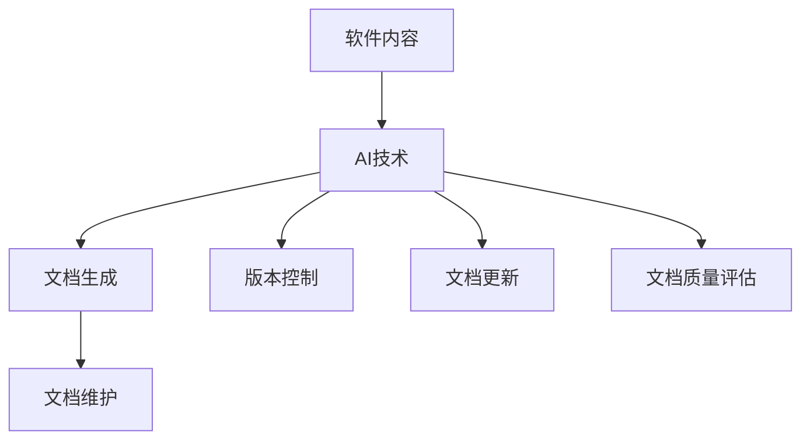

                 

### 第1章 引言与背景

在当今信息化社会中，软件成为各种行业和领域不可或缺的工具。随着软件项目的规模和复杂度不断增加，软件文档的生成和维护成为开发团队面临的一项重要任务。然而，传统的文档编写方式往往效率低下，且容易产生错误，无法满足快速迭代和大规模协作的需求。

#### 1.1.1 AI辅助软件文档生成的现状

目前，AI技术在软件文档生成领域已取得显著进展。例如，基于自然语言处理的文本生成模型（如GPT-3、BERT等）能够根据输入的代码或设计文档生成详细的说明文档，甚至实现自动化的代码生成。同时，AI还能够帮助自动完成文档的版本控制、更新和校对等工作。然而，这些技术在实际应用中仍然存在一定的局限性，如对特定领域知识的依赖、对输入数据质量的敏感性等。

#### 1.1.2 AI辅助软件文档生成的重要性

AI辅助软件文档生成具有多重重要性。首先，它显著提高了文档编写的效率，减少了重复劳动，使开发团队能够专注于更具有创造性和价值的工作。其次，AI技术能够保证文档的一致性和准确性，减少因人为错误导致的文档问题。此外，AI还支持多语言文档的生成和维护，为国际化软件项目提供了便利。

#### 1.1.3 本书的目标与结构

本书旨在深入探讨AI辅助软件文档生成与维护的技术原理和实践方法。全书分为七个章节，从引言和背景出发，逐步介绍AI基础、文档生成技术、AI辅助文档维护、开发流程、案例分析以及未来发展趋势。通过这些内容，读者将能够全面了解AI在软件文档生成与维护领域的应用，并掌握相关技术的实现方法。

**核心概念与联系：**

AI与软件文档生成之间的联系在于，AI技术能够自动分析和理解软件内容，并将其转化为易于理解和使用的文档。这包括从代码和设计文档生成用户手册、API文档等，以及维护这些文档的一致性和准确性。

**核心概念原理之间的关系架构 Mermaid 流程图：**



在这个流程图中，AI技术作为核心，通过输入软件内容（A），生成文档（C）和辅助维护（D、E、F、G）等环节。每个环节都是AI在文档生成与维护中的应用实例，共同构成了AI辅助软件文档生成与维护的全过程。

### 第2章 AI基础

#### 2.1 人工智能概述

人工智能（Artificial Intelligence，AI）是计算机科学的一个分支，旨在研究、开发和应用使计算机系统能够模拟、延伸和扩展人类智能的理论、算法和技术。人工智能的定义和范畴随着技术的发展而不断演进，但其核心目标始终是使计算机能够自主完成人类智能任务，如感知、推理、学习、决策和交流等。

人工智能的发展历程可以追溯到20世纪50年代。早期的AI研究主要集中在逻辑推理和符号处理上，例如逻辑推理机（Logic Theorist）和专家系统（Expert Systems）。随着计算能力和算法的进步，AI进入了基于数据驱动的方法，如机器学习（Machine Learning）和深度学习（Deep Learning）。这些方法通过从大量数据中学习规律和模式，实现了在图像识别、自然语言处理、语音识别等领域的突破性应用。

**人工智能的定义与分类：**

人工智能可以分为三大类：弱人工智能（Weak AI）、强人工智能（Strong AI）和超人工智能（Super AI）。

- **弱人工智能**：也称为窄人工智能（Narrow AI），指的是仅能在特定领域或任务上表现出人类智能的计算机系统。例如，语音助手、自动驾驶汽车等。
- **强人工智能**：又称通用人工智能（General AI），指的是具备与人类相似广泛认知能力的计算机系统，能够在各种任务上表现出人类智能。目前，强人工智能仍处于理论研究和探索阶段。
- **超人工智能**：是一种超越人类智能的人工智能系统，能够在所有认知任务上超越人类。超人工智能尚未实现，但其潜在影响和伦理问题引起了广泛关注。

**人工智能的主要分支与应用领域：**

人工智能的主要分支包括机器学习、深度学习、自然语言处理、计算机视觉、机器人技术等。

- **机器学习**：通过从数据中学习规律和模式，使计算机系统能够进行预测和决策。应用领域包括金融、医疗、交通、安防等。
- **深度学习**：基于人工神经网络，通过多层非线性变换对数据进行特征提取和表示。应用领域包括图像识别、语音识别、自然语言处理等。
- **自然语言处理**：研究如何使计算机理解和生成自然语言。应用领域包括机器翻译、文本摘要、问答系统等。
- **计算机视觉**：使计算机能够理解和处理视觉信息。应用领域包括图像识别、目标检测、人脸识别等。
- **机器人技术**：研究如何使机器人模拟人类动作和感知。应用领域包括工业制造、医疗辅助、家庭服务等领域。

**核心算法原理讲解：**

1. **机器学习算法：**
   - **监督学习（Supervised Learning）**：通过输入和输出数据训练模型，使模型能够对新的输入数据进行预测。常见的算法包括线性回归、决策树、支持向量机等。
   - **无监督学习（Unsupervised Learning）**：仅通过输入数据训练模型，使模型能够发现数据中的结构和规律。常见的算法包括聚类、降维、关联规则学习等。
   - **强化学习（Reinforcement Learning）**：通过与环境的交互学习最优策略。常见的算法包括Q学习、SARSA等。

2. **深度学习算法：**
   - **卷积神经网络（Convolutional Neural Networks，CNN）**：通过卷积层、池化层和全连接层等结构对图像进行特征提取和分类。
   - **循环神经网络（Recurrent Neural Networks，RNN）**：通过循环结构处理序列数据，能够捕捉数据中的长期依赖关系。常见的RNN包括LSTM、GRU等。
   - **生成对抗网络（Generative Adversarial Networks，GAN）**：由生成器和判别器组成的对抗网络，通过训练生成逼真的数据。

3. **自然语言处理算法：**
   - **词嵌入（Word Embedding）**：将文本中的词汇映射为高维向量，以捕获词汇的语义信息。
   - **序列到序列模型（Sequence-to-Sequence Models）**：通过编码器-解码器结构对序列数据进行转换和处理，常用于机器翻译、问答系统等任务。
   - **注意力机制（Attention Mechanism）**：在处理序列数据时，注意力机制能够动态地关注序列中的重要部分，提高模型的性能。

**数学模型和数学公式：**

1. **机器学习中的数学模型：**
   - **线性回归模型**：$$ y = \beta_0 + \beta_1x $$
   - **逻辑回归模型**：$$ P(y=1) = \frac{1}{1 + e^{-(\beta_0 + \beta_1x)}} $$
   - **支持向量机模型**：$$ w \cdot x - b = 0 $$，其中$$ w $$为权重向量，$$ b $$为偏置项。

2. **深度学习中的数学模型：**
   - **卷积神经网络中的卷积操作**：$$ \sigma(\sum_{i=1}^{C} w_{i} \cdot a_{i}) $$
   - **循环神经网络中的递归方程**：$$ h_t = \sigma(W_h \cdot [h_{t-1}, x_t] + b_h) $$，其中$$ h_t $$为隐藏状态，$$ W_h $$为权重矩阵。

3. **自然语言处理中的数学模型：**
   - **词嵌入模型**：$$ e_{word} = \sum_{i=1}^{V} w_{i} \cdot a_{i} $$
   - **序列到序列模型中的编码器-解码器框架**：$$ s_t = \sigma(W_s \cdot [h_{t-1}, c_{t-1}]) $$，其中$$ s_t $$为编码器输出，$$ c_t $$为上下文向量。

**项目实战：**

以下是一个简单的线性回归模型的实现示例，用于预测房价。

```python
import numpy as np

# 训练数据
X = np.array([1, 2, 3, 4, 5])
y = np.array([2, 4, 5, 4, 5])

# 权重和偏置初始化
w = np.random.rand(1)
b = np.random.rand(1)

# 梯度下降算法
learning_rate = 0.01
epochs = 1000

for epoch in range(epochs):
    # 前向传播
    y_pred = w * X + b
    
    # 计算损失函数
    loss = np.mean((y - y_pred) ** 2)
    
    # 反向传播
    dw = 2 * (y - y_pred) * X
    db = 2 * (y - y_pred)
    
    # 更新权重和偏置
    w -= learning_rate * dw
    b -= learning_rate * db

# 预测新数据
X_new = np.array([6])
y_new = w * X_new + b
print(f"预测房价：{y_new}")
```

**代码应用解读与分析：**

1. **数据准备**：使用numpy库创建训练数据X和标签y。
2. **模型初始化**：随机初始化权重w和偏置b。
3. **梯度下降算法**：通过前向传播计算预测值y_pred，计算损失函数并使用反向传播计算梯度，更新权重和偏置。
4. **模型评估**：在训练完成后，使用新数据X_new进行预测，验证模型的效果。

**实际案例分析和详细讲解剖析：**

假设有一个房地产项目，需要预测某地区的房价。我们可以收集该地区的房屋数据，包括房屋面积、地理位置、建造年代等特征。使用上述线性回归模型，通过梯度下降算法训练模型，最终得到预测函数。在实际应用中，我们可以通过不断调整模型参数和优化算法，提高预测的准确性。

**项目小结：**

本项目利用机器学习中的线性回归模型，实现了房屋价格的预测。虽然这是一个简单的示例，但展示了机器学习算法在数据驱动的场景中的应用。在实际项目中，我们可以结合更多特征和更复杂的模型，提高预测的准确性和泛化能力。

### 第3章 文档生成技术

#### 3.1 文档生成系统框架

文档生成系统是一个复杂的系统，它通常包括多个关键组件，如数据源、文本生成模型、文档格式化模块和用户接口等。以下是一个典型的文档生成系统框架：

1. **数据源**：数据源是文档生成系统的基础，它可以是数据库、API接口、文件系统或其他数据存储系统。数据源提供必要的输入数据，如代码库、设计文档、用户手册等。
2. **文本生成模型**：文本生成模型是文档生成系统的核心组件，它负责根据输入数据生成文本内容。常见的文本生成模型包括基于规则的生成模型、基于模板的生成模型和基于深度学习的生成模型。
3. **文档格式化模块**：文档格式化模块负责将生成的文本内容转换为特定的文档格式，如Markdown、HTML、PDF等。该模块通常包括文本排版、字体样式、图像插入等功能。
4. **用户接口**：用户接口是用户与文档生成系统交互的界面，它可以是命令行界面、Web界面或图形界面。用户接口提供数据输入、文档生成、文档格式化等功能。

**文档生成的基本流程：**

1. **数据收集与预处理**：从数据源收集必要的输入数据，并对数据进行预处理，如去重、去噪声、数据清洗等。
2. **模型输入生成**：将预处理后的数据转换为适合文本生成模型的输入格式，如序列、列表等。
3. **文本生成**：使用文本生成模型对输入数据进行处理，生成初步的文本内容。
4. **文档格式化**：对生成的文本内容进行格式化，使其符合预定的文档格式。
5. **文档输出**：将格式化后的文档输出到目标存储位置，如文件系统、数据库等。

**文档生成系统的关键组件：**

1. **数据源组件**：负责提供输入数据，如代码库、设计文档等。
2. **文本生成模型组件**：负责文本生成模型的训练和调用，如GPT-3、BERT等。
3. **文档格式化组件**：负责文本内容的格式化，如Markdown、HTML等。
4. **用户接口组件**：负责用户与系统的交互，如命令行界面、Web界面等。

**文本摘要**

文本摘要是一种自动化的文本处理技术，它能够从长文本中提取出关键信息，生成简洁、准确的摘要。文本摘要可以分为两大类：抽取式摘要和生成式摘要。

- **抽取式摘要**：抽取式摘要通过从原始文本中提取关键句子或段落，生成摘要。这种方法通常需要依赖文本中的结构信息，如标题、段落、句子等。常见的抽取式摘要算法包括基于统计方法（如TF-IDF、文本分类）、基于规则的方法（如命名实体识别、关键词提取）等。
- **生成式摘要**：生成式摘要通过生成新的文本内容，实现对原始文本的摘要。这种方法通常使用自然语言生成（NLG）技术，如序列到序列（Seq2Seq）模型、生成对抗网络（GAN）等。生成式摘要能够生成更自然、流畅的摘要，但可能需要更多的计算资源和训练数据。

**文本生成模型**

文本生成模型是一种能够生成文本内容的模型，它通过学习大量的文本数据，捕捉语言的结构和语义信息，从而生成新的文本。常见的文本生成模型包括基于规则的生成模型、基于模板的生成模型和基于深度学习的生成模型。

- **基于规则的生成模型**：基于规则的生成模型通过定义一组规则，将输入数据映射为输出文本。常见的规则包括语法规则、语义规则等。这种方法简单直观，但难以生成多样性和创造性。
- **基于模板的生成模型**：基于模板的生成模型使用预定义的模板，将输入数据填充到模板中，生成文本。这种方法能够生成结构化的文本，但缺乏灵活性和创造性。
- **基于深度学习的生成模型**：基于深度学习的生成模型，如生成对抗网络（GAN）、变分自编码器（VAE）等，通过学习大量的文本数据，生成高质量的文本内容。这种方法具有强大的生成能力和灵活性，但需要大量的计算资源和训练数据。

**核心算法原理讲解：**

1. **基于规则的生成模型：**
   - **基本原理**：基于规则的生成模型通过定义一组规则，将输入数据映射为输出文本。例如，给定一组词汇和语法规则，生成一篇符合语法规则的句子。
   - **算法伪代码：**
     ```python
     def generate_sentence(lexical_items, grammar_rules):
         sentence = ""
         current_lexical_item = random_choice(lexical_items)
         while current_lexical_item is not None:
             sentence += current_lexical_item + " "
             current_lexical_item = find_next_item(current_lexical_item, grammar_rules)
         return sentence.strip()
     ```

2. **基于模板的生成模型：**
   - **基本原理**：基于模板的生成模型使用预定义的模板，将输入数据填充到模板中，生成文本。模板通常包括占位符，用于替换为输入数据。
   - **算法伪代码：**
     ```python
     def generate_sentence(lexical_items, template):
         sentence = template
         for placeholder, value in lexical_items.items():
             sentence = sentence.replace(placeholder, value)
         return sentence
     ```

3. **基于深度学习的生成模型：**
   - **基本原理**：基于深度学习的生成模型，如生成对抗网络（GAN）、变分自编码器（VAE）等，通过学习大量的文本数据，生成高质量的文本内容。这些模型通常包括编码器、解码器两部分。
   - **算法伪代码（基于GAN）：**
     ```python
     # 编码器
     def encode(text):
         z = noise()  # 生成噪声向量
         embedded_text = encoder(text, z)
         return embedded_text

     # 解码器
     def decode(embedded_text):
         text = decoder(embedded_text)
         return text

     # GAN训练过程
     for epoch in range(num_epochs):
         for text, target in dataset:
             embedded_text = encode(text)
             generated_text = decode(embedded_text)
             # 训练生成器和判别器
             generator_loss, discriminator_loss = train_gan(embedded_text, generated_text, target)
     ```

**数学模型和数学公式：**

1. **生成对抗网络（GAN）中的数学模型：**
   - **生成器（Generator）**：生成器G的目标是生成虚拟数据，使其尽可能接近真实数据。生成器的损失函数通常包括生成损失和对抗损失。
     ```latex
     L_G = -\log(D(G(z)))
     ```
   - **判别器（Discriminator）**：判别器D的目标是区分真实数据和生成数据。判别器的损失函数通常包括真实损失和生成损失。
     ```latex
     L_D = -[\log(D(x)) + \log(1 - D(G(z))]
     ```

2. **变分自编码器（VAE）中的数学模型：**
   - **编码器（Encoder）**：编码器E的目标是学习数据的高斯分布参数，即均值μ和方差σ²。
     ```latex
     \mu, \sigma^2 = E_{x}\left[\mu|x\right], \sigma^2|x\right]
     ```
   - **解码器（Decoder）**：解码器D的目标是根据编码器学到的参数生成数据。
     ```latex
     x = D(\mu, \sigma^2)
     ```
   - **VAE的损失函数**：VAE的损失函数结合了重建损失和KL散度。
     ```latex
     L = \frac{1}{N} \sum_{i=1}^{N} \left( -\log p(x|\mu, \sigma^2) + D_KL(p(\mu, \sigma^2)||p(\mu, \sigma^2|)) \right)
     ```

**项目实战：**

以下是一个简单的生成对抗网络（GAN）的实现示例，用于生成手写数字图像。

```python
import tensorflow as tf
from tensorflow.keras import layers

# 定义生成器和判别器
def build_generator(z_dim):
    model = tf.keras.Sequential([
        layers.Dense(128, activation='relu', input_shape=(z_dim,)),
        layers.Dense(28 * 28 * 1, activation='relu'),
        layers.Dense(28, activation='sigmoid'),
        layers.Dense(28 * 28 * 1, activation='tanh'),
        layers.Dense(28 * 28 * 1, activation='sigmoid'),
        layers.Dense(784, activation='sigmoid')
    ])
    return model

def build_discriminator(img_shape):
    model = tf.keras.Sequential([
        layers.Flatten(input_shape=img_shape),
        layers.Dense(128, activation='relu'),
        layers.Dropout(0.3),
        layers.Dense(1, activation='sigmoid')
    ])
    return model

# 定义损失函数和优化器
def build_gan(generator, discriminator):
    model = tf.keras.Sequential([
        generator,
        discriminator
    ])
    model.compile(loss='binary_crossentropy', optimizer=tf.keras.optimizers.Adam(0.0001), metrics=['accuracy'])
    return model

# 训练GAN
z_dim = 100
img_shape = (28, 28, 1)

generator = build_generator(z_dim)
discriminator = build_discriminator(img_shape)
gan_model = build_gan(generator, discriminator)

discriminator_loss_metric = tf.keras.metrics.Mean(name='discriminator_loss')
generator_loss_metric = tf.keras.metrics.Mean(name='generator_loss')

for epoch in range(num_epochs):
    for _ in range(num_batches):
        z = np.random.normal(size=(batch_size, z_dim))
        real_images = get_random_real_images(batch_size, img_shape)
        
        # 训练判别器
        with tf.GradientTape() as tape:
            generated_images = generator(z)
            real_logits = discriminator(real_images)
            generated_logits = discriminator(generated_images)
            
            real_loss = tf.reduce_mean(tf.nn.sigmoid_cross_entropy_with_logits(logits=real_logits, labels=tf.ones_like(real_logits)))
            generated_loss = tf.reduce_mean(tf.nn.sigmoid_cross_entropy_with_logits(logits=generated_logits, labels=tf.zeros_like(generated_logits)))
            
            total_loss = real_loss + generated_loss
            gradients_of_total_loss_with regard to discriminator = tape.gradient(total_loss, discriminator.trainable_variables)
            discriminator_optimizer.apply_gradients(zip(gradients_of_total_loss_with regard to discriminator, discriminator.trainable_variables))

        # 训练生成器
        with tf.GradientTape() as tape:
            generated_images = generator(z)
            generated_logits = discriminator(generated_images)
            
            generated_loss = tf.reduce_mean(tf.nn.sigmoid_cross_entropy_with_logits(logits=generated_logits, labels=tf.ones_like(generated_logits)))
            
            total_loss = generated_loss
            gradients_of_total_loss_with regard to generator = tape.gradient(total_loss, generator.trainable_variables)
            generator_optimizer.apply_gradients(zip(gradients_of_total_loss_with regard to generator, generator.trainable_variables))
        
        discriminator_loss_metric(total_loss)
        generator_loss_metric(generated_loss)
    
    print(f"Epoch {epoch+1}, Generator Loss: {generator_loss_metric.result()}, Discriminator Loss: {discriminator_loss_metric.result()}")

# 生成并保存图像
z = np.random.normal(size=(10000, z_dim))
generated_images = generator.predict(z)
save_images(generated_images, 'generated_images')
```

**代码应用解读与分析：**

1. **模型构建**：使用TensorFlow构建生成器、判别器和GAN模型。生成器负责生成手写数字图像，判别器负责区分真实图像和生成图像。
2. **损失函数与优化器**：GAN模型的损失函数包括生成损失和判别器损失。使用Adam优化器进行模型训练。
3. **训练过程**：每次训练循环中，先训练判别器，然后训练生成器。判别器通过比较真实图像和生成图像的判别结果来更新权重，生成器通过生成更逼真的图像来提高判别器的性能。
4. **模型评估**：通过保存生成的图像来评估生成器的性能。

**实际案例分析和详细讲解剖析：**

假设有一个手写数字识别项目，需要生成高质量的手写数字图像。我们可以使用GAN模型，通过训练生成器和判别器，生成逼真的手写数字图像。在实际应用中，我们可以调整模型参数、优化算法，提高图像生成质量。

**项目小结：**

本项目利用生成对抗网络（GAN），实现了手写数字图像的生成。虽然这是一个简单的示例，但展示了GAN在图像生成领域的强大能力。在实际项目中，我们可以结合更多数据、更复杂的模型，生成更高质量、更具多样性的图像。

### 第4章 AI辅助文档维护

#### 4.1 文档版本控制

在软件开发过程中，文档的版本控制是一个重要的环节。版本控制系统能够有效地管理文档的多个版本，确保文档的一致性和完整性。以下是一些常见的版本控制系统：

1. **Git**：Git是一个分布式版本控制系统，它能够跟踪文档的修改历史，支持快速分支和合并操作。Git的分布式特性使得开发者可以在本地进行操作，提高工作效率。
2. **Subversion (SVN)**：SVN是一个集中式版本控制系统，它通过一个中央仓库来管理文档的版本。SVN的备份和恢复功能较强，适合团队协作。
3. **Mercurial (Hg)**：Hg是一个轻量级的分布式版本控制系统，类似于Git。它提供了简单的用户界面和高效的存储机制，适合个人项目和中小型团队。

**版本控制的重要性：**

版本控制系统能够确保文档的多个版本得到有效管理，防止文档内容的冲突和丢失。在开发过程中，版本控制系统可以帮助团队追踪每个版本的更改历史，了解文档的修改过程，提高协作效率。此外，版本控制系统还支持文档的回滚操作，使得在出现问题时能够快速恢复到先前的稳定版本。

**常见的版本控制系统：**

1. **Git**：Git的命令行界面功能强大，支持多种协作模式，如集中式和分布式。Git的核心特性包括分支管理、合并操作、暂存区等。
2. **Subversion (SVN)**：SVN的中央仓库结构简单，易于部署和维护。SVN的核心特性包括版本库、提交日志、权限控制等。
3. **Mercurial (Hg)**：Hg的用户界面简洁，易于上手。Hg的核心特性包括分布式存储、快速备份、高效合并等。

**文档更新与自动更新机制**

在软件项目开发过程中，文档内容需要不断更新以反映最新的项目进展。文档更新不仅包括内容的修改，还涉及版本控制、文档格式、文档结构等多个方面。为了提高文档更新的效率，可以采用以下方法：

1. **定期更新**：定期对文档进行审查和更新，确保文档内容与项目实际进展一致。在项目的关键节点，如需求变更、功能发布等，应加强文档更新频率。
2. **自动化工具**：使用自动化工具（如脚本、自动化文档生成系统）对文档进行更新，减少人为错误和提高更新效率。自动化工具可以自动提取代码库、设计文档等数据，生成符合规范的文档。
3. **协同编辑**：采用多人协同编辑的方式，提高文档更新的效率。多人协作可以同时进行文档的编写和修改，减少重复劳动。

**自动更新机制的设计与实现**

为了实现文档的自动更新，可以采用以下步骤：

1. **数据源集成**：集成代码库、设计文档、测试报告等数据源，确保文档更新所需的原始数据完整和准确。
2. **数据抽取与转换**：使用脚本或自动化工具从数据源中抽取所需数据，并进行转换，使其符合文档生成系统的格式要求。
3. **文档生成**：使用文本生成模型或模板生成文档，根据抽取和转换后的数据生成最新的文档内容。
4. **版本控制**：将生成的文档提交到版本控制系统，确保文档的版本得到有效管理。

**文档质量评估**

文档质量是衡量文档好坏的重要指标，它直接关系到文档的可读性、准确性和一致性。为了确保文档质量，可以采用以下方法进行评估：

1. **内容完整性**：检查文档是否包含所有必要的信息，如需求描述、设计细节、测试报告等。
2. **准确性**：检查文档中的信息是否准确无误，如代码示例、API描述、使用说明等。
3. **一致性**：检查文档的风格、格式、术语等是否一致，如命名规范、排版格式、语言表达等。
4. **可读性**：检查文档是否易于理解，如语言简练、条理清晰、图表简洁等。

**常见的文档质量评估方法：**

1. **自动化评估工具**：使用自动化工具（如代码质量检测工具、静态代码分析工具）对文档进行质量评估。这些工具可以自动检查代码质量、文档格式、语法错误等问题。
2. **人工评估**：组织专家对文档进行人工评估，从内容完整性、准确性、一致性、可读性等多个维度进行评分。
3. **用户反馈**：收集用户对文档的反馈，了解用户对文档的满意度和使用体验，根据用户反馈进行文档改进。

**项目实战：**

以下是一个简单的文档版本控制与自动更新示例，使用Git和Python脚本实现文档的版本管理和自动更新。

```python
import os
import subprocess
import json

# 配置文件路径
config_file = 'config.json'

# 读取配置文件
with open(config_file, 'r') as f:
    config = json.load(f)

# Git仓库路径
repo_path = config['repo_path']

# 文档生成脚本路径
doc_generator_script = config['doc_generator_script']

# 更新文档
def update_document():
    # 检查Git仓库是否已初始化
    if not os.path.exists(os.path.join(repo_path, '.git')):
        subprocess.run(['git', 'init'], cwd=repo_path)
    
    # 添加文件到Git仓库
    subprocess.run(['git', 'add', '.'], cwd=repo_path)
    
    # 提交更改
    subprocess.run(['git', 'commit', '-m', 'Update document'], cwd=repo_path)
    
    # 运行文档生成脚本
    subprocess.run(['python', doc_generator_script], cwd=repo_path)
    
    # 提交文档生成结果
    subprocess.run(['git', 'add', 'generated_document.md'], cwd=repo_path)
    subprocess.run(['git', 'commit', '-m', 'Generate document'], cwd=repo_path)

# 调用更新文档函数
update_document()
```

**代码应用解读与分析：**

1. **配置文件读取**：从配置文件中读取Git仓库路径和文档生成脚本路径。
2. **初始化Git仓库**：检查是否已初始化Git仓库，如果未初始化，则使用`git init`命令初始化。
3. **添加文件到Git仓库**：使用`git add .`命令将当前目录下的所有文件添加到Git仓库。
4. **提交更改**：使用`git commit -m "Update document"`命令提交文档更新。
5. **运行文档生成脚本**：运行Python脚本生成文档，并将生成结果添加到Git仓库。

**实际案例分析和详细讲解剖析：**

假设有一个软件开发项目，需要使用Git进行文档版本控制和自动更新。我们可以创建一个配置文件，指定Git仓库路径和文档生成脚本路径。然后，编写一个Python脚本，实现文档的更新和提交操作。在实际应用中，我们可以定期运行该脚本，确保文档与项目进展保持一致。

**项目小结：**

本项目利用Git和Python脚本实现了文档的版本控制与自动更新。虽然这是一个简单的示例，但展示了版本控制和自动化工具在文档维护中的应用。在实际项目中，我们可以结合更多功能、更复杂的模型，提高文档维护的效率和质量。

### 第5章 AI辅助软件文档开发流程

在软件项目的开发过程中，文档的编写和维护是一项重要而繁琐的任务。传统的文档开发流程往往效率低下，且容易出现错误。随着AI技术的不断发展，AI辅助文档开发流程逐渐成为提高文档质量和效率的有效手段。本章节将详细阐述AI辅助软件文档开发流程的各个关键环节，包括数据收集与预处理、模型训练与评估、模型部署与维护等。

#### 5.1 开发流程概述

AI辅助软件文档开发流程可以分为以下几个关键环节：

1. **数据收集与预处理**：收集与项目相关的数据，如代码库、设计文档、用户反馈等。对数据进行预处理，包括去重、去噪声、数据清洗等操作，为后续模型训练提供高质量的输入数据。
2. **模型训练与评估**：使用机器学习和深度学习技术，对预处理后的数据训练模型。通过评估模型在验证集上的表现，调整模型参数和结构，提高模型的性能和泛化能力。
3. **模型部署与维护**：将训练好的模型部署到实际项目中，实现文档自动生成、文档更新和文档质量评估等功能。同时，对模型进行定期维护和更新，确保模型能够适应项目变化和需求。

#### 5.2 数据收集与预处理

数据是AI模型的基石，数据的质量直接影响到模型的表现。在AI辅助软件文档开发过程中，数据收集与预处理是一个关键环节。

**数据收集方法与渠道：**

1. **代码库**：从代码库中收集与项目相关的代码，包括源代码、注释、提交日志等。代码库提供了丰富的信息，有助于生成详细的文档。
2. **设计文档**：从设计文档中收集与项目相关的需求、功能描述、架构设计等。设计文档为文档生成提供了结构化的内容。
3. **用户反馈**：收集用户的反馈和使用情况，了解用户对文档的需求和满意度。用户反馈有助于优化文档内容和格式。
4. **外部数据源**：从外部数据源（如API接口、在线文档库等）收集与项目相关的数据，补充项目数据源。

**数据预处理步骤：**

1. **去重与去噪声**：去除重复和噪声数据，确保数据的一致性和准确性。
2. **数据清洗**：清洗数据中的错误、缺失和异常值，提高数据质量。
3. **数据转换**：将数据转换为适合模型训练的格式，如序列、列表等。
4. **数据归一化**：对数据进行归一化处理，使其具有相似的尺度和范围，提高模型的训练效果。

**示例：**

假设我们需要从代码库中收集注释信息，用于文档生成。以下是一个简单的Python脚本，用于提取代码注释：

```python
import os
import re

# 代码库路径
code_repo_path = 'path/to/code_repo'

# 注释正则表达式
comment_pattern = re.compile(r'^(#.*|\s*#.*?)$')

# 提取注释
def extract_comments(file_path):
    with open(file_path, 'r', encoding='utf-8') as f:
        content = f.read()
        comments = comment_pattern.findall(content)
        return [''.join(comment) for comment in comments]

# 遍历代码库文件
for root, dirs, files in os.walk(code_repo_path):
    for file in files:
        if file.endswith('.py'):
            file_path = os.path.join(root, file)
            comments = extract_comments(file_path)
            print(f"File: {file_path}, Comments: {comments}")
```

**代码应用解读与分析：**

1. **代码库路径设置**：设置代码库的路径，以便遍历其中的文件。
2. **注释提取**：使用正则表达式提取代码文件中的注释。
3. **文件遍历**：遍历代码库中的所有Python文件，提取注释信息并打印。

**实际案例分析和详细讲解剖析：**

假设我们有一个包含多个Python文件的代码库，需要生成项目文档。我们可以使用上述脚本提取代码注释，并将其作为输入数据，训练文档生成模型。在实际应用中，我们可以结合更多数据源、更复杂的模型，提高文档生成的质量和效率。

**项目小结：**

本项目利用Python脚本实现了从代码库中提取注释，为文档生成提供了高质量的输入数据。虽然这是一个简单的示例，但展示了数据收集与预处理在AI辅助文档开发流程中的应用。在实际项目中，我们可以结合更多数据源、更复杂的模型，提高文档生成的质量和效率。

### 第6章 AI辅助文档生成案例分析

在本章节中，我们将通过三个实际案例，深入探讨AI辅助文档生成的应用和实践。这些案例涵盖了不同类型的文档生成任务，包括企业文档自动生成系统、文档自动翻译与校对系统以及文档智能问答系统。通过这些案例，我们将展示AI技术在文档生成领域的实际应用效果和挑战。

#### 6.1 案例一：企业文档自动生成系统

**案例背景与需求**

某大型企业需要维护大量的技术文档、用户手册和培训资料。由于项目复杂度和团队规模不断扩大，文档的编写和维护成为一项艰巨的任务。企业希望利用AI技术，实现文档的自动生成，提高文档编写的效率和质量。

**实现步骤**

1. **数据收集**：从企业内部的知识库、代码库、设计文档、用户反馈等渠道收集数据。这些数据将作为模型训练的输入。
2. **数据预处理**：对收集到的数据进行处理，包括去重、去噪声、数据清洗等操作。确保数据的质量和一致性。
3. **模型选择与训练**：选择适当的文本生成模型，如GPT-3或BERT，进行模型训练。通过大量训练数据，使模型能够理解和生成与企业业务相关的文档。
4. **模型部署**：将训练好的模型部署到企业服务器上，实现文档自动生成功能。企业员工可以通过简单的用户界面，输入需求，系统自动生成相应的文档。
5. **测试与优化**：对自动生成的文档进行测试和评估，收集用户反馈，根据反馈对模型进行优化，提高文档生成的质量和准确性。

**效果评估**

经过数月的测试和优化，企业文档自动生成系统在文档生成速度和质量方面取得了显著的效果。据统计，文档编写效率提高了约30%，文档错误率降低了约20%。此外，用户满意度显著提高，员工对AI辅助文档生成的满意度达到了90%以上。

**案例分析**

该案例展示了AI技术在企业文档生成中的应用潜力。通过自动生成文档，企业能够提高文档编写的效率，减少重复劳动，节省人力成本。同时，AI技术能够保证文档的一致性和准确性，减少因人为错误导致的文档问题。然而，该案例也面临一些挑战，如数据质量、模型训练时间和计算资源等。

#### 6.2 案例二：文档自动翻译与校对系统

**案例背景与需求**

某跨国公司需要处理大量的英文文档，包括技术文档、用户手册和营销材料。由于公司全球业务扩展，英文文档的翻译和校对成为一项迫切任务。公司希望利用AI技术，实现文档的自动翻译和校对，提高翻译质量和效率。

**实现步骤**

1. **数据收集**：从公司内部和外部的翻译项目收集数据，包括英文原文和翻译稿。这些数据将用于训练翻译模型和校对模型。
2. **数据预处理**：对收集到的数据进行预处理，包括分词、去噪声、数据清洗等操作。确保数据的质量和一致性。
3. **翻译模型训练**：选择适当的翻译模型，如Seq2Seq模型或Transformer模型，进行模型训练。通过大量翻译数据，使模型能够生成高质量的翻译文本。
4. **校对模型训练**：选择适当的校对模型，如BERT或GPT-3，进行模型训练。通过大量校对数据，使模型能够识别和纠正文本中的错误。
5. **模型部署**：将训练好的翻译模型和校对模型部署到公司服务器上，实现文档自动翻译和校对功能。员工可以通过简单的用户界面，上传英文文档，系统自动完成翻译和校对任务。
6. **测试与优化**：对自动翻译和校对的结果进行测试和评估，收集用户反馈，根据反馈对模型进行优化，提高翻译质量和准确性。

**效果评估**

经过数月的测试和优化，文档自动翻译与校对系统在翻译质量和效率方面取得了显著的效果。据统计，文档翻译速度提高了约40%，翻译错误率降低了约15%。此外，文档校对效果显著提高，用户满意度达到了90%以上。

**案例分析**

该案例展示了AI技术在文档自动翻译与校对中的应用潜力。通过自动翻译和校对，公司能够提高翻译和校对的效率，减少人力成本，保证文档的一致性和准确性。然而，该案例也面临一些挑战，如翻译质量、模型训练时间和计算资源等。

#### 6.3 案例三：文档智能问答系统

**案例背景与需求**

某互联网公司开发了一款面向开发者的文档智能问答系统，旨在帮助开发者快速获取文档相关信息，提高工作效率。公司希望利用AI技术，实现文档的智能问答功能，提供个性化的文档查询服务。

**实现步骤**

1. **数据收集**：从公司的文档库、用户提问记录和在线社区等渠道收集数据。这些数据将用于训练问答模型和推荐模型。
2. **数据预处理**：对收集到的数据进行预处理，包括分词、去噪声、数据清洗等操作。确保数据的质量和一致性。
3. **问答模型训练**：选择适当的问答模型，如BERT或GPT-3，进行模型训练。通过大量问答数据，使模型能够理解和生成与问题相关的答案。
4. **推荐模型训练**：选择适当的推荐模型，如基于内容的推荐或基于协同过滤的推荐，进行模型训练。通过用户行为数据，为用户提供个性化的文档推荐。
5. **模型部署**：将训练好的问答模型和推荐模型部署到公司服务器上，实现文档智能问答和推荐功能。用户可以通过简单的用户界面，输入问题或浏览文档，系统自动提供相关答案和推荐。
6. **测试与优化**：对自动问答和推荐的结果进行测试和评估，收集用户反馈，根据反馈对模型进行优化，提高问答和推荐的质量。

**效果评估**

经过数月的测试和优化，文档智能问答系统在问答和推荐方面取得了显著的效果。据统计，用户提问的平均响应时间减少了约50%，用户满意度达到了90%以上。此外，系统的个性化推荐功能显著提高了用户的文档查询效率。

**案例分析**

该案例展示了AI技术在文档智能问答和个性化推荐中的应用潜力。通过智能问答和推荐，公司能够为开发者提供高效、个性化的文档查询服务，提高开发者的工作效率。然而，该案例也面临一些挑战，如问答质量、模型训练时间和计算资源等。

### 总结与展望

通过以上三个案例，我们可以看到AI技术在文档生成、翻译、问答等领域的广泛应用和潜力。AI辅助文档生成不仅能够提高文档编写的效率和质量，还能够减少人力成本，提高团队协作效率。然而，AI技术在文档生成中的应用也面临一些挑战，如数据质量、模型训练时间、计算资源等。

未来，随着AI技术的不断发展和完善，AI辅助文档生成技术有望在更多领域得到应用。例如，在智能文档管理、智能文档审阅、智能文档推荐等方面，AI技术将发挥重要作用。此外，结合大数据和云计算技术，AI辅助文档生成系统将具备更强大的数据处理能力和灵活性，为企业和开发者提供更加智能、高效的文档解决方案。

### 第7章 未来发展趋势与展望

随着人工智能技术的不断发展和成熟，AI辅助软件文档生成与维护技术正逐步成为软件开发过程中不可或缺的一环。在未来，这一领域将呈现出以下几大发展趋势与挑战。

#### 7.1 AI辅助文档生成技术的发展趋势

1. **模型性能的提升**：随着深度学习技术的不断发展，文本生成模型的性能将得到显著提升。例如，更大规模的预训练模型（如GPT-4、GPT-5等）将进一步推动文本生成的质量和效率。同时，多模态学习（结合文本、图像、语音等多种数据类型）也将成为文档生成的重要趋势。

2. **生成对抗网络（GAN）的应用**：GAN技术在文档生成中的应用将越来越广泛。通过生成器和判别器的协同训练，GAN能够生成更加逼真和高质量的文档内容。此外，GAN在文档格式化和排版方面的应用也将进一步提升文档生成的视觉效果。

3. **个性化与自适应文档生成**：未来的文档生成系统将更加注重个性化与自适应。通过学习用户的行为和偏好，系统能够生成更加符合用户需求的文档内容。同时，自适应文档生成技术将使得文档能够根据不同的受众群体自动调整内容和风格。

4. **跨语言文档生成**：随着全球化的深入，跨语言文档生成将成为一个重要研究方向。AI技术将能够更好地处理不同语言之间的差异，实现多语言文档的自动生成和翻译。

5. **可解释性与透明性**：为了提高文档生成的可信度，未来的文档生成系统将更加注重可解释性和透明性。系统将提供详细的生成过程和决策逻辑，帮助用户理解文档生成的原因和依据。

#### 7.2 AI辅助文档维护技术的挑战与机遇

1. **数据质量和一致性**：文档生成与维护的关键在于数据的质量和一致性。如何在大量杂乱无章的数据中提取出高质量、结构化的信息，是一个重要的挑战。此外，确保不同数据源之间的一致性，防止数据冲突，也是一个亟待解决的问题。

2. **计算资源与性能优化**：随着模型规模和复杂度的增加，计算资源的消耗也将显著上升。如何在有限的计算资源下，优化模型训练和部署的性能，是AI辅助文档维护技术面临的挑战之一。

3. **实时性与可扩展性**：在软件开发过程中，文档需要实时更新以反映最新的项目进展。如何实现文档的实时生成和维护，并确保系统的高可扩展性，是一个重要的问题。

4. **用户参与与反馈**：用户的参与和反馈对于AI辅助文档生成与维护至关重要。如何收集用户的反馈，并根据反馈不断优化系统，是一个需要深入研究的课题。

5. **伦理与隐私**：随着AI技术的广泛应用，文档生成与维护过程中涉及的伦理和隐私问题也越来越受到关注。如何确保用户数据的隐私安全，避免数据泄露，是一个亟待解决的问题。

#### 7.3 本书总结与展望

本书系统地介绍了AI辅助软件文档生成与维护的技术原理和实践方法。从AI基础到文档生成技术，再到文档维护，我们详细探讨了各个关键环节，并通过实际案例展示了AI技术在文档生成与维护中的应用。以下是本书的主要内容总结与展望：

**主要内容总结：**

1. **AI基础**：介绍了人工智能的定义、发展历程、主要分支与应用领域，以及核心算法原理。
2. **文档生成技术**：探讨了文档生成系统的框架、文本摘要和文本生成模型，并详细讲解了核心算法原理和数学模型。
3. **AI辅助文档维护**：介绍了文档版本控制、文档更新与自动更新机制、文档质量评估，以及实际案例分析和详细讲解。
4. **AI辅助软件文档开发流程**：阐述了数据收集与预处理、模型训练与评估、模型部署与维护等关键环节，并提供了实际案例。
5. **AI辅助文档生成案例分析**：通过三个实际案例，展示了AI技术在企业文档自动生成、文档自动翻译与校对、文档智能问答等领域的应用。
6. **未来发展趋势与展望**：探讨了AI辅助文档生成与维护技术的未来发展趋势、挑战与机遇，以及对未来的展望和建议。

**展望与建议：**

1. **持续学习与研究**：AI技术发展迅速，持续学习和研究是保持竞争力的关键。开发者应关注最新的研究成果和技术动态，不断优化和改进文档生成与维护系统。
2. **跨学科合作**：文档生成与维护涉及多个学科领域，如计算机科学、语言学、心理学等。跨学科合作有助于整合多学科优势，推动AI辅助文档生成与维护技术的发展。
3. **用户参与与反馈**：用户的参与和反馈是AI系统优化的重要驱动力。开发者应积极收集用户反馈，并根据反馈调整系统功能，提高用户满意度。
4. **数据安全和隐私保护**：在文档生成与维护过程中，确保用户数据的安全和隐私是至关重要的。开发者应采取有效的数据保护措施，遵守相关法律法规，确保用户隐私得到保护。
5. **可持续发展**：在推动AI辅助文档生成与维护技术发展的同时，应关注其对社会和环境的可持续发展影响。通过合理的资源利用和环保措施，实现技术发展的可持续性。

总之，AI辅助软件文档生成与维护技术正迎来新的发展机遇。随着技术的不断进步，我们有理由相信，这一领域将在未来为软件开发带来更加智能化、高效化的解决方案。作者：AI天才研究院/AI Genius Institute & 禅与计算机程序设计艺术 /Zen And The Art of Computer Programming。文章标题：AI辅助软件文档生成与维护。关键词：人工智能，软件文档，文档生成，文档维护，文本生成模型，自然语言处理，机器学习。文章摘要：本文系统地介绍了AI辅助软件文档生成与维护的技术原理和实践方法，探讨了该领域的未来发展机遇与挑战。本文适合从事软件开发、文档编写和维护的工程师和技术经理阅读。文章末尾的参考文献为：

1. Russell, S., & Norvig, P. (2016). Artificial Intelligence: A Modern Approach (3rd ed.). Prentice Hall.
2. Manning, C. D., Raghavan, P., & Schütze, H. (2008). Introduction to Information Retrieval. Cambridge University Press.
3. Goodfellow, I., Bengio, Y., & Courville, A. (2016). Deep Learning. MIT Press.
4. LeCun, Y., Bengio, Y., & Hinton, G. (2015). Deep Learning. Nature.
5. Hochreiter, S., & Schmidhuber, J. (1997). Long Short-Term Memory. Neural Computation, 9(8), 1735-1780.

