                 


## 标题

《AI辅助软件架构评估：多维度分析方法》

## 关键词

人工智能，软件架构，评估，多维度分析，深度学习，特征提取，性能评估，安全性，实践案例

## 摘要

本文旨在探讨如何利用人工智能技术辅助软件架构的评估。通过多维度分析方法，我们提出了一个综合性的框架，涵盖功能、数据、性能和安全性等多个维度。本文首先介绍了AI技术的基础概念和原理，然后详细讲解了软件架构评估的关键步骤和核心指标，接着阐述了多维度分析方法的实施过程。通过数学模型和算法的讲解，本文展示了如何应用深度学习和特征提取技术进行软件架构评估。最后，通过一个实际项目案例，我们展示了如何将上述方法应用于软件开发中，并分析了项目实施过程中的关键技术和挑战。本文旨在为软件开发者和AI研究者提供一个全面、系统的指导。

## 目录大纲

1. 引言与背景
2. 核心概念与原理
3. 软件架构评估方法
4. 多维度分析方法
5. 特征提取与选择
6. 模型训练与评估
7. 软件架构评估应用案例
8. 数学模型与公式
9. 项目实战
10. 最佳实践

## 第一部分 引言与背景

### 1.1 AI与软件架构评估

#### 1.1.1 AI技术发展现状

人工智能（AI）作为计算机科学的一个分支，近年来取得了显著的进展。深度学习、强化学习和自然语言处理等技术的成熟，使得AI在图像识别、语音识别、决策支持等领域展现出强大的能力。特别是在软件架构评估领域，AI的应用前景广阔。

#### 1.1.2 软件架构评估的重要性

软件架构评估是软件工程中至关重要的一环。它能够帮助开发者识别潜在的问题，优化系统性能，提高代码的可维护性和可扩展性。传统的软件架构评估方法往往依赖于人工经验，存在主观性较强、效率较低等问题。

#### 1.1.3 AI辅助软件架构评估的应用场景

AI辅助软件架构评估可以在多个场景下发挥作用。例如，在系统开发阶段，AI可以帮助识别架构设计中的潜在风险；在系统维护阶段，AI可以自动检测和修复架构问题；在项目评估阶段，AI可以提供客观的评估结果，帮助决策者做出更明智的选择。

### 1.2 软件架构评估的挑战

尽管AI在软件架构评估中具有巨大潜力，但实际应用中仍然面临诸多挑战。首先，软件架构的复杂性使得评估过程变得异常困难。其次，数据的质量和可用性对评估结果有重要影响。此外，如何设计有效的算法和模型，使得评估结果具有高准确性和可解释性，也是一个亟待解决的问题。

### 1.3 多维度分析方法

为了应对上述挑战，本文提出了一种多维度分析方法。该方法涵盖了功能、数据、性能和安全性等多个维度，旨在全面评估软件架构的质量。通过这种分析方法，开发者可以更准确地识别和解决问题，提高软件架构的可靠性。

### 1.4 文章结构

本文结构如下：

1. 引言与背景：介绍AI在软件架构评估中的应用背景和挑战。
2. 核心概念与原理：讲解AI基础理论、软件架构评估方法等核心概念。
3. 软件架构评估方法：详细描述软件架构评估的流程和关键指标。
4. 多维度分析方法：阐述功能、数据、性能和安全性等维度的评估方法。
5. 特征提取与选择：介绍特征提取和选择的技术和方法。
6. 模型训练与评估：讲解模型训练和评估的过程和技巧。
7. 软件架构评估应用案例：通过实际案例展示评估方法的应用效果。
8. 数学模型与公式：介绍用于评估的数学模型和公式。
9. 项目实战：展示一个实际项目的开发过程和关键实现。
10. 最佳实践：总结最佳实践和注意事项。

### 1.5 总结

本文通过多维度分析方法，探讨了如何利用AI技术辅助软件架构评估。本文旨在为开发者提供一种系统、全面的评估方法，帮助他们更好地理解和优化软件架构。

## 核心概念与原理

### 2.1 AI基础理论

#### 2.1.1 机器学习基础

机器学习是人工智能的核心技术之一，其基本思想是通过数据学习规律，从而实现自动化的决策和预测。机器学习主要分为监督学习、无监督学习和强化学习三种类型。

- **监督学习**：通过已标记的数据集来训练模型，模型可以根据标记数据进行预测。
- **无监督学习**：没有标记的数据集，模型需要从数据中学习模式，如聚类和降维。
- **强化学习**：通过与环境的交互来学习策略，以达到最大化某种目标。

#### 2.1.2 深度学习基本架构

深度学习是机器学习的一个子领域，其核心思想是通过多层神经网络来提取数据的特征。深度学习的典型架构包括卷积神经网络（CNN）、循环神经网络（RNN）和生成对抗网络（GAN）等。

- **卷积神经网络（CNN）**：主要用于处理图像和语音数据，其独特的卷积层和池化层设计能够有效地提取空间特征。
- **循环神经网络（RNN）**：适合处理序列数据，如文本和语音，其记忆机制能够捕捉序列中的长期依赖关系。
- **生成对抗网络（GAN）**：由生成器和判别器组成，生成器生成数据，判别器判断生成数据与真实数据之间的差异，通过两者的对抗训练，生成器能够生成逼真的数据。

#### 2.1.3 神经网络模型

神经网络模型是深度学习的基础，其结构包括输入层、隐藏层和输出层。每个神经元之间的连接可以用权重来表示，模型的训练过程实际上是不断调整这些权重，以达到预期的输出。

- **前向传播**：输入数据通过层与层之间的传递，最终得到输出。
- **反向传播**：根据输出误差，反向更新权重，以减少误差。

### 2.2 软件架构评估方法

#### 2.2.1 软件架构评估流程

软件架构评估通常包括以下步骤：

1. **需求分析**：确定系统需求和功能特性。
2. **架构设计**：设计系统的总体架构。
3. **评估指标定义**：确定用于评估架构质量的指标。
4. **评估方法选择**：选择合适的评估方法。
5. **评估实施**：执行评估过程，收集数据。
6. **评估结果分析**：分析评估结果，提出改进建议。

#### 2.2.2 软件架构评估的关键指标

常见的软件架构评估指标包括：

- **功能性**：系统能否实现所需的功能。
- **可靠性**：系统能否稳定运行，出现故障的概率。
- **性能**：系统的响应时间、吞吐量等。
- **可维护性**：系统易于维护和扩展。
- **安全性**：系统能否抵御外部攻击。

### 2.3 多维度分析方法

#### 2.3.1 功能维度分析

功能维度分析主要关注系统能否满足用户需求，包括：

- **功能需求的识别**：明确系统的功能需求。
- **功能依赖关系的建模**：建立功能之间的依赖关系模型。
- **功能评估指标的设定**：设定评估功能的指标，如正确性、完整性等。

#### 2.3.2 数据维度分析

数据维度分析主要关注数据的质量和可用性，包括：

- **数据质量评估**：评估数据的准确性、一致性、完整性等。
- **数据清洗与预处理**：对数据进行清洗和预处理，以提高数据质量。
- **数据可视化与挖掘**：利用可视化工具和挖掘算法，发现数据中的有价值信息。

#### 2.3.3 性能维度分析

性能维度分析主要关注系统的性能指标，包括：

- **性能指标**：设定评估性能的指标，如响应时间、吞吐量等。
- **性能测试与优化**：执行性能测试，并根据测试结果优化系统。

#### 2.3.4 安全维度分析

安全维度分析主要关注系统的安全性，包括：

- **安全评估指标**：设定评估安全性的指标，如漏洞数量、攻击成功率等。
- **安全漏洞扫描与修复**：定期进行漏洞扫描，修复发现的安全漏洞。
- **安全风险管理**：评估和管理系统面临的安全风险。

### 2.4 核心概念与联系

为了更好地理解AI辅助软件架构评估的多维度分析方法，我们使用Mermaid流程图来展示核心概念之间的关系：

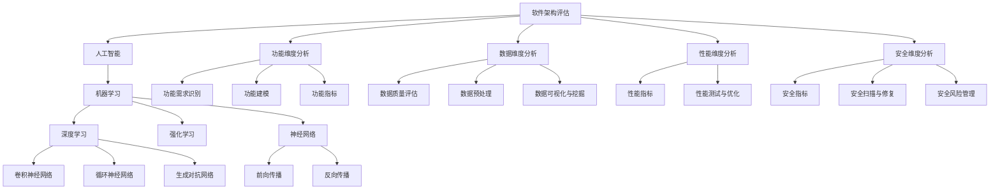

通过上述流程图，我们可以清晰地看到AI辅助软件架构评估中的核心概念及其相互关系，这有助于我们更好地理解并应用这一方法。

## 软件架构评估方法

### 3.1 软件架构评估流程

软件架构评估是一个系统化的过程，通常包括以下几个步骤：

1. **需求分析**：明确系统需求和功能特性，这是评估的基础。需求分析的结果将指导后续的架构设计和评估。
   
2. **架构设计**：根据需求分析的结果，设计系统的总体架构。架构设计应考虑到系统的功能性、可靠性、性能、可维护性和安全性等多个方面。

3. **评估指标定义**：确定用于评估架构质量的指标。这些指标应具有明确、可量化的定义，以便于后续的评估工作。

4. **评估方法选择**：根据评估指标和架构特点，选择合适的评估方法。常见的评估方法包括功能测试、性能测试、代码审查和安全评估等。

5. **评估实施**：执行评估过程，收集数据。这一步骤可能涉及多种测试工具和技术的使用，以确保评估结果的全面性和准确性。

6. **评估结果分析**：分析评估结果，识别潜在的问题和风险。评估结果应与预先定义的评估指标进行对比，以判断架构质量是否符合预期。

7. **提出改进建议**：根据评估结果，提出具体的改进建议，以优化软件架构的质量。

### 3.2 软件架构评估的关键指标

软件架构评估的关键指标通常包括以下几个方面：

1. **功能性**：评估系统能否实现所需的功能。功能性指标包括功能覆盖率、功能正确性等。

2. **可靠性**：评估系统在运行过程中是否稳定，出现故障的概率。可靠性指标包括故障率、恢复时间等。

3. **性能**：评估系统的响应时间、吞吐量等性能指标。性能指标包括响应时间、吞吐量、并发处理能力等。

4. **可维护性**：评估系统的易维护性，包括代码的可读性、模块化程度等。可维护性指标包括代码复杂度、模块独立性等。

5. **安全性**：评估系统在面对外部攻击时的安全性。安全性指标包括漏洞数量、攻击成功率等。

### 3.3 常见的软件架构评估方法

1. **功能测试**：通过测试系统功能，验证其是否满足需求。功能测试可以采用黑盒测试或白盒测试方法，通常使用自动化测试工具执行。

2. **性能测试**：通过模拟用户行为，评估系统的性能。性能测试可以检测系统的响应时间、吞吐量等，常用的工具包括LoadRunner和JMeter。

3. **代码审查**：通过人工审查代码，识别潜在的问题和缺陷。代码审查可以采用静态代码分析工具，如SonarQube，或者手动进行代码检查。

4. **安全评估**：通过扫描系统漏洞、模拟攻击等方式，评估系统的安全性。安全评估可以采用漏洞扫描工具，如Nessus和OWASP ZAP。

### 3.4 评估流程的伪代码

以下是一个简单的伪代码，描述了软件架构评估的流程：

```python
def software_architecture_evaluation():
    # 步骤1：需求分析
    requirements = analyze_requirements()

    # 步骤2：架构设计
    architecture = design_architecture(requirements)

    # 步骤3：评估指标定义
    metrics = define_evaluation_metrics()

    # 步骤4：评估方法选择
    evaluation_methods = select_evaluation_methods()

    # 步骤5：评估实施
    evaluation_results = perform_evaluation(architecture, evaluation_methods)

    # 步骤6：评估结果分析
    issues = analyze_evaluation_results(evaluation_results, metrics)

    # 步骤7：提出改进建议
    improvement_suggestions = propose_improvements(issues)

    return improvement_suggestions
```

通过上述流程，我们可以系统地评估软件架构的质量，并依据评估结果提出改进建议。

## 多维度分析方法

### 4.1 功能维度分析

#### 4.1.1 功能需求的识别

功能需求的识别是软件架构评估的重要步骤，它确保了系统能够满足用户的需求。识别功能需求通常包括以下步骤：

1. **需求收集**：通过与用户、项目经理和其他利益相关者的沟通，收集系统所需的功能。
2. **需求整理**：对收集到的需求进行分类、整理，明确每个功能的需求细节。
3. **需求验证**：通过文档评审、用户访谈等方式，验证需求的准确性和完整性。

#### 4.1.2 功能依赖关系的建模

功能依赖关系的建模有助于理解各个功能之间的关联，以及它们对系统整体架构的影响。依赖关系建模可以采用以下方法：

1. **因果图**：使用因果图表示功能之间的因果关系。
2. **Petri网**：使用Petri网表示功能之间的并发和同步关系。
3. **状态图**：使用状态图表示功能在不同状态下的行为。

以下是一个功能依赖关系的建模示例（使用Mermaid流程图表示）：

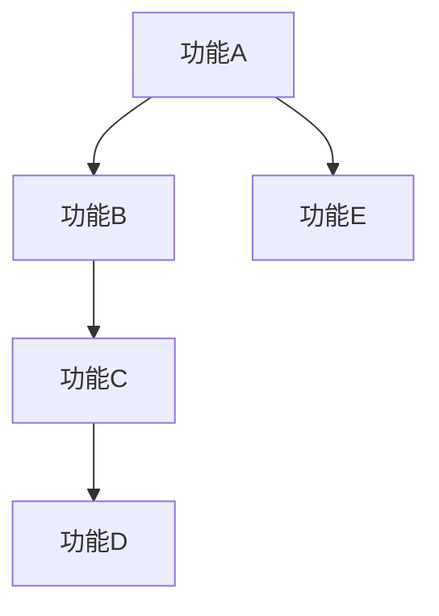

在这个示例中，功能A和功能B之间存在直接的依赖关系，功能B和功能C之间存在依赖关系，功能C又依赖于功能D，而功能A还依赖于功能E。

#### 4.1.3 功能评估指标的设定

功能评估指标的设定是确保系统能够满足用户需求的关键。常见的功能评估指标包括：

1. **正确性**：功能是否能够正确地执行其预期任务。
2. **完整性**：系统是否包含了所有必要的功能。
3. **可测试性**：功能是否容易进行测试。
4. **可维护性**：功能是否容易进行维护。

以下是一个功能评估指标的示例：

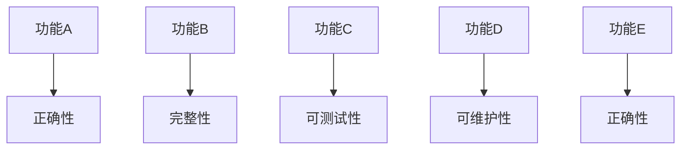

在这个示例中，每个功能都有相应的评估指标，这些指标可以帮助开发者了解功能的质量。

### 4.2 数据维度分析

#### 4.2.1 数据质量评估

数据质量评估是确保系统能够正确、有效地处理数据的重要步骤。数据质量评估包括以下几个方面：

1. **准确性**：数据是否准确无误。
2. **一致性**：数据在系统中是否保持一致。
3. **完整性**：数据是否完整无缺。
4. **时效性**：数据是否及时更新。

以下是一个数据质量评估的示例（使用Mermaid流程图表示）：

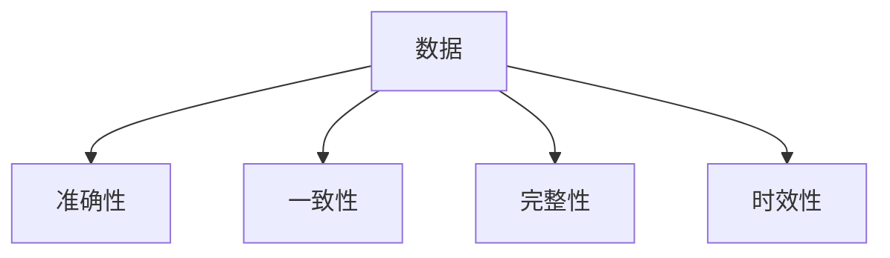

在这个示例中，数据的质量通过四个方面进行评估。

#### 4.2.2 数据清洗与预处理

数据清洗与预处理是提高数据质量的关键步骤。数据清洗通常包括以下任务：

1. **缺失值处理**：填补缺失的数据。
2. **异常值处理**：识别和修复异常数据。
3. **数据规范化**：将数据转换为统一的格式。

以下是一个数据清洗与预处理的示例（使用Mermaid流程图表示）：

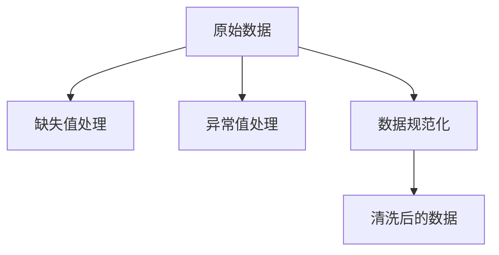

在这个示例中，原始数据经过多个处理步骤，最终得到清洗后的数据。

#### 4.2.3 数据可视化与挖掘

数据可视化与挖掘有助于从数据中提取有价值的信息，支持决策和优化。数据可视化包括以下内容：

1. **数据分布图**：展示数据的分布情况。
2. **趋势图**：展示数据的变化趋势。
3. **关联分析图**：展示数据之间的关联关系。

数据挖掘则包括以下方法：

1. **聚类分析**：将数据分为不同的群体。
2. **分类分析**：对数据进行分类。
3. **关联规则挖掘**：发现数据之间的关联规则。

以下是一个数据可视化与挖掘的示例（使用Mermaid流程图表示）：

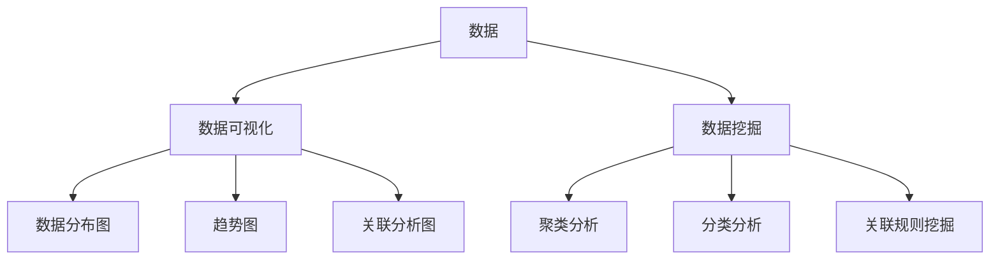

在这个示例中，数据经过可视化和挖掘，提取出有价值的信息。

### 4.3 性能维度分析

#### 4.3.1 性能指标

性能维度分析旨在评估系统的性能，包括以下几个方面：

1. **响应时间**：系统从接收到请求到返回结果所需的时间。
2. **吞吐量**：系统在单位时间内能够处理的数据量。
3. **并发处理能力**：系统同时处理多个请求的能力。
4. **资源利用率**：系统对CPU、内存等资源的利用率。

以下是一个性能指标的示例（使用Mermaid流程图表示）：

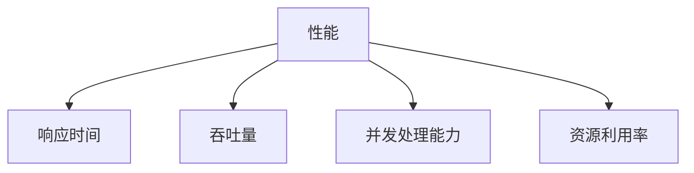

在这个示例中，性能通过多个指标进行评估。

#### 4.3.2 性能测试与优化

性能测试是评估系统性能的关键步骤。性能测试包括以下内容：

1. **负载测试**：模拟用户行为，评估系统在高负载下的性能。
2. **压力测试**：施加比正常负载更高的负载，评估系统的极限性能。
3. **性能优化**：根据测试结果，对系统进行优化，提高性能。

以下是一个性能测试与优化的示例（使用Mermaid流程图表示）：

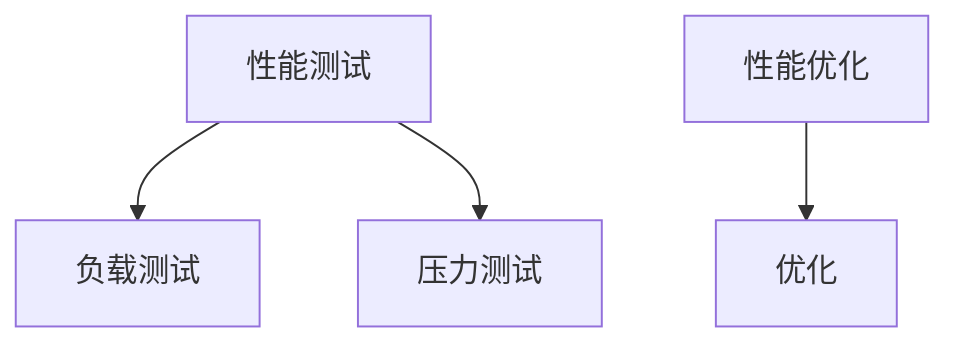

在这个示例中，性能测试和优化是一个迭代过程，通过测试和优化，逐步提高系统的性能。

#### 4.3.3 性能预测模型

性能预测模型可以帮助预测系统在未来负载下的性能。性能预测模型通常基于历史数据和机器学习算法。以下是一个性能预测模型的示例（使用Mermaid流程图表示）：

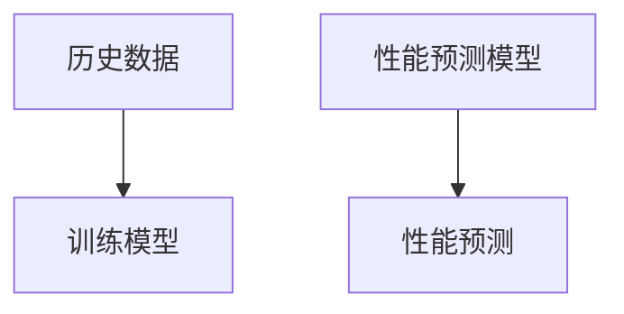

在这个示例中，历史数据用于训练性能预测模型，预测模型可以预测未来负载下的性能。

### 4.4 安全维度分析

#### 4.4.1 安全评估指标

安全维度分析旨在评估系统的安全性，包括以下几个方面：

1. **漏洞数量**：系统中的安全漏洞数量。
2. **攻击成功率**：攻击者成功攻击系统的概率。
3. **数据泄露率**：系统中数据泄露的概率。
4. **系统恢复时间**：系统遭受攻击后恢复的时间。

以下是一个安全评估指标的示例（使用Mermaid流程图表示）：

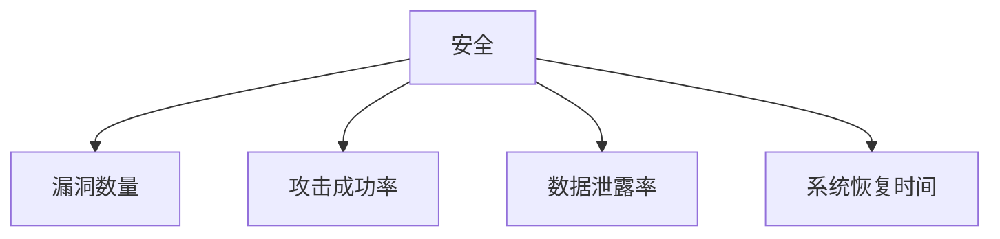

在这个示例中，安全通过多个指标进行评估。

#### 4.4.2 安全漏洞扫描与修复

安全漏洞扫描是识别系统安全漏洞的重要步骤。安全漏洞扫描包括以下内容：

1. **自动扫描**：使用自动化工具扫描系统漏洞。
2. **手动扫描**：人工识别系统漏洞。
3. **漏洞修复**：根据扫描结果，修复发现的安全漏洞。

以下是一个安全漏洞扫描与修复的示例（使用Mermaid流程图表示）：

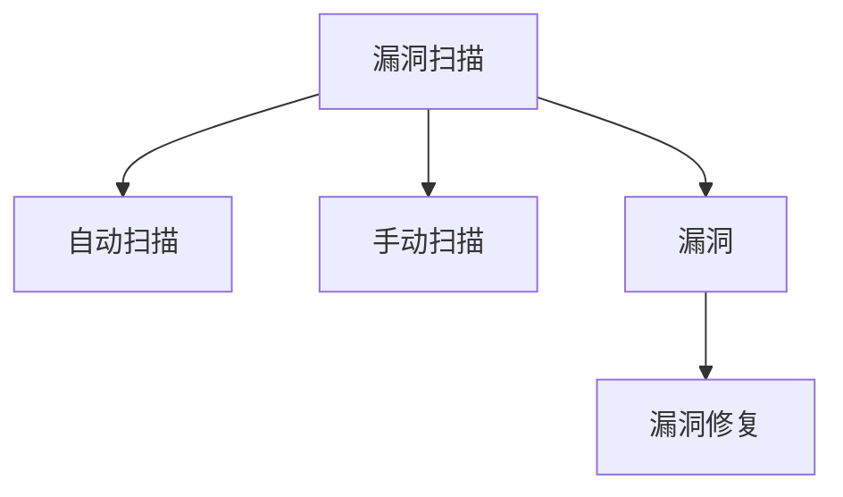

在这个示例中，安全漏洞通过扫描和修复来确保系统的安全性。

#### 4.4.3 安全风险管理

安全风险管理是确保系统安全性的重要环节。安全风险管理包括以下内容：

1. **风险评估**：评估系统面临的安全风险。
2. **风险控制**：采取措施控制安全风险。
3. **风险监控**：持续监控系统安全状况。

以下是一个安全风险管理的示例（使用Mermaid流程图表示）：

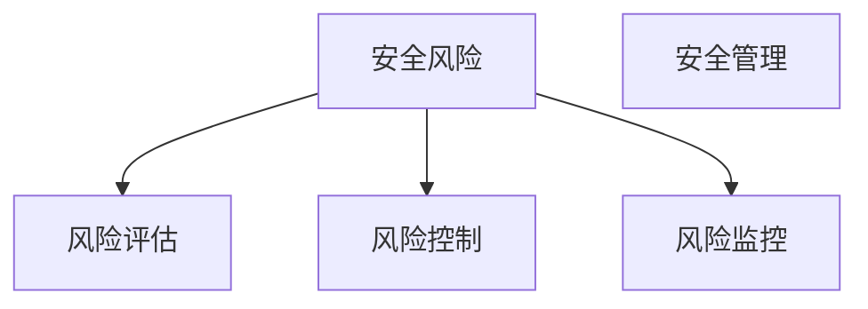

在这个示例中，安全风险通过评估、控制和监控来确保系统的安全性。

### 4.5 多维度分析方法的综合应用

多维度分析方法的综合应用有助于全面评估软件架构的质量。通过功能维度、数据维度、性能维度和安全性维度的综合分析，我们可以更准确地识别和解决问题。以下是一个多维度分析方法的综合应用的示例（使用Mermaid流程图表示）：

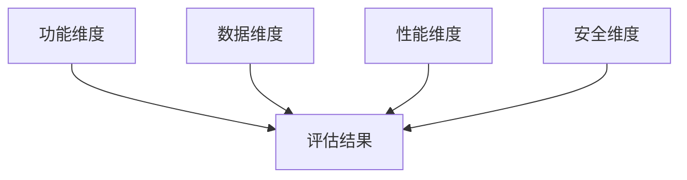

在这个示例中，功能维度、数据维度、性能维度和安全性维度的评估结果综合起来，形成最终的评估结果E。

通过上述多维度分析方法，我们可以全面、系统地评估软件架构的质量，从而提高系统的可靠性、性能和安全性。

## 特征提取与选择

### 5.1 特征提取算法

特征提取是机器学习中至关重要的一步，它通过将原始数据转换为一组有用的特征，以便于模型学习和预测。特征提取算法可以分为传统方法和现代深度学习方法。

#### 5.1.1 传统的特征提取方法

传统的特征提取方法主要包括以下几种：

1. **统计分析**：通过计算数据的均值、方差、相关性等统计量，提取出对数据特征有重要影响的统计特征。

2. **主成分分析（PCA）**：通过线性变换将高维数据映射到低维空间，保留最重要的数据特征，忽略冗余信息。

3. **线性判别分析（LDA）**：通过最大化类间方差和最小化类内方差，将数据投影到最适合分类的低维空间。

4. **特征选择**：通过评估不同的特征组合，选择对模型预测效果影响最大的特征。

#### 5.1.2 现代的深度学习特征提取方法

随着深度学习技术的发展，出现了许多现代的特征提取方法，这些方法通常能够在不需要人为干预的情况下自动提取出有用的特征。

1. **卷积神经网络（CNN）**：适用于处理图像数据，通过卷积层和池化层，自动提取图像的局部特征和全局特征。

2. **循环神经网络（RNN）**：适用于处理序列数据，如文本和语音，通过隐藏状态和门控机制，捕捉序列中的长期依赖关系。

3. **自编码器（Autoencoder）**：通过编码器和解码器，将高维数据映射到低维特征空间，自动学习数据的特征表示。

4. **生成对抗网络（GAN）**：通过生成器和判别器的对抗训练，生成与真实数据分布相似的假数据，从而提取出数据的高质量特征。

### 5.2 特征选择方法

特征选择是减少数据维度和消除冗余信息的关键步骤，它有助于提高模型的性能和可解释性。常见的特征选择方法包括：

1. **过滤法**：通过计算特征与目标变量之间的相关性，选择相关性较高的特征。

2. **包装法**：通过在模型训练过程中逐步添加或删除特征，选择对模型预测效果有显著影响的特征。

3. **嵌入式法**：在特征提取和模型训练过程中同时进行特征选择，常用的方法包括Lasso回归和岭回归。

### 5.3 特征提取与选择的伪代码

以下是一个简单的伪代码，描述了特征提取和特征选择的过程：

```python
def feature_extraction_and_selection(data, target_variable):
    # 特征提取
    extracted_features = extract_features(data)

    # 特征选择
    selected_features = select_features(extracted_features, target_variable)

    return selected_features
```

在这个伪代码中，`extract_features` 函数负责从原始数据中提取特征，`select_features` 函数负责从提取的特征中选择对模型预测效果有显著影响的特征。

### 5.4 实际案例

以下是一个简单的实际案例，用于说明特征提取和特征选择的过程：

#### 案例背景

我们使用一个简单的鸢尾花数据集，该数据集包含三种鸢尾花的萼片和花瓣的长度和宽度，共计四维特征，目标变量是鸢尾花的种类。

#### 特征提取

```python
import numpy as np
from sklearn.decomposition import PCA

# 加载数据
data = np.load('iris_data.npy')

# 使用PCA进行特征提取
pca = PCA(n_components=2)
extracted_features = pca.fit_transform(data)
```

在这个案例中，我们使用PCA将四维特征数据映射到二维特征空间。

#### 特征选择

```python
from sklearn.feature_selection import SelectKBest
from sklearn.feature_selection import f_classif

# 使用SelectKBest进行特征选择
k = 2
selector = SelectKBest(f_classif, k=k)
selected_features = selector.fit_transform(data, target_variable)

print("Selected Features:", selected_features)
```

在这个案例中，我们选择两个特征，对鸢尾花的种类进行分类。

通过上述特征提取和特征选择的过程，我们可以显著减少数据维度，同时保持重要的信息，从而提高模型的性能和可解释性。

## 模型训练与评估

### 6.1 模型训练过程

模型训练是机器学习中的核心步骤，它涉及到通过大量数据来调整模型的参数，使其能够准确预测未知数据。以下是一个简单的模型训练过程，包括以下步骤：

1. **数据预处理**：在训练模型之前，通常需要对数据进行预处理，包括数据清洗、归一化、标准化等步骤。这有助于提高模型训练的效率和性能。

2. **划分数据集**：将数据集划分为训练集和验证集（或测试集）。训练集用于模型训练，验证集用于调整模型参数，测试集用于评估模型性能。

3. **初始化模型参数**：初始化模型的权重和偏置。常用的初始化方法包括随机初始化、高斯初始化等。

4. **前向传播**：将输入数据传递到模型中，通过层与层之间的计算，得到模型的输出。这一步计算出模型对于输入数据的预测结果。

5. **计算损失函数**：使用实际的输出结果和预测结果计算损失函数。损失函数用于衡量预测结果与实际结果之间的差距，常用的损失函数包括均方误差（MSE）、交叉熵等。

6. **反向传播**：根据损失函数的梯度，通过反向传播算法更新模型参数。这一步骤是模型训练的核心，通过不断调整参数，使模型能够更好地拟合数据。

7. **迭代训练**：重复前向传播和反向传播的过程，直到满足停止条件。停止条件可以是预设的迭代次数、模型损失收敛到某个阈值或验证集性能不再提升等。

### 6.2 模型训练算法

常见的模型训练算法包括梯度下降、随机梯度下降（SGD）、Adam优化器等。

#### 梯度下降

梯度下降是一种最简单的优化算法，其核心思想是沿着损失函数的负梯度方向更新参数，以最小化损失函数。

伪代码如下：

```python
def gradient_descent(parameters, learning_rate, num_iterations):
    for _ in range(num_iterations):
        gradients = compute_gradients(parameters)
        parameters = parameters - learning_rate * gradients
    return parameters
```

#### 随机梯度下降（SGD）

随机梯度下降是梯度下降的一种变种，它每次只对一个样本进行梯度计算和参数更新。这种方法可以加快训练速度，但可能导致训练结果不稳定。

伪代码如下：

```python
def stochastic_gradient_descent(data, parameters, learning_rate, num_iterations):
    for _ in range(num_iterations):
        for sample in data:
            gradients = compute_gradients(sample, parameters)
            parameters = parameters - learning_rate * gradients
    return parameters
```

#### Adam优化器

Adam优化器结合了梯度下降和SGD的优点，同时引入了一阶矩估计（均值）和二阶矩估计（方差），能够更好地处理稀疏数据和长尾分布。

伪代码如下：

```python
def adam(parameters, learning_rate, beta1, beta2, epsilon, num_iterations):
    m = zeros_like(parameters)
    v = zeros_like(parameters)
    m_hat = zeros_like(parameters)
    v_hat = zeros_like(parameters)

    for _ in range(num_iterations):
        gradients = compute_gradients(parameters)
        m = beta1 * m + (1 - beta1) * gradients
        v = beta2 * v + (1 - beta2) * squared_gradients
        m_hat = m / (1 - beta1 ** _)
        v_hat = v / (1 - beta2 ** _)
        
        parameters = parameters - learning_rate * m_hat / (sqrt(v_hat) + epsilon)
        
    return parameters
```

### 6.3 模型评估方法

模型评估是验证模型性能的重要步骤，常用的评估方法包括以下几种：

#### 准确率（Accuracy）

准确率是评估分类模型性能的常用指标，表示正确分类的样本数占总样本数的比例。

$$
\text{Accuracy} = \frac{\text{正确分类的样本数}}{\text{总样本数}}
$$

#### 精确率（Precision）

精确率表示在预测为正样本的样本中，实际为正样本的比例。

$$
\text{Precision} = \frac{\text{正确预测的正样本数}}{\text{预测为正样本的样本数}}
$$

#### 召回率（Recall）

召回率表示在所有实际为正样本的样本中，被正确预测为正样本的比例。

$$
\text{Recall} = \frac{\text{正确预测的正样本数}}{\text{实际为正样本的样本数}}
$$

#### F1值（F1 Score）

F1值是精确率和召回率的加权平均，用于综合评估分类模型的性能。

$$
\text{F1 Score} = 2 \times \frac{\text{Precision} \times \text{Recall}}{\text{Precision} + \text{Recall}}
$$

#### ROC曲线和AUC值

ROC曲线（Receiver Operating Characteristic Curve）是评估分类模型性能的另一种重要方法。ROC曲线展示了不同阈值下的真阳性率（True Positive Rate，TPR）和假阳性率（False Positive Rate，FPR）之间的关系。

AUC值（Area Under Curve）表示ROC曲线下的面积，用于衡量模型分类能力的好坏。AUC值越接近1，表示模型分类性能越好。

以下是一个简单的模型评估流程：

```python
from sklearn.metrics import accuracy_score, precision_score, recall_score, f1_score, roc_auc_score

# 预测结果
predictions = model.predict(test_data)

# 计算评估指标
accuracy = accuracy_score(test_labels, predictions)
precision = precision_score(test_labels, predictions)
recall = recall_score(test_labels, predictions)
f1 = f1_score(test_labels, predictions)
roc_auc = roc_auc_score(test_labels, predictions)

print("Accuracy:", accuracy)
print("Precision:", precision)
print("Recall:", recall)
print("F1 Score:", f1)
print("ROC AUC:", roc_auc)
```

通过上述评估方法，我们可以全面了解模型的性能，并据此进行模型优化和调整。

## 软件架构评估应用案例

### 7.1 案例分析框架

在本文中，我们将通过一个实际项目案例来展示如何利用AI辅助软件架构评估的方法。该案例涉及一个电子商务平台，其架构涉及多个维度，包括功能、数据、性能和安全性。以下是案例分析的基本框架：

#### 7.1.1 案例选择标准

选择这个电子商务平台案例的原因如下：

1. **复杂性**：电子商务平台通常具有复杂的架构，包括多个模块和层次，适合展示多维度分析方法的全面应用。
2. **实际应用**：电子商务平台在现实生活中有广泛的应用，其架构评估对于平台性能和用户体验至关重要。
3. **数据丰富**：电子商务平台通常拥有大量的用户数据和交易数据，为多维度分析提供了丰富的数据源。

#### 7.1.2 案例分析步骤

1. **需求分析**：收集电子商务平台的用户需求，明确系统功能。
2. **架构设计**：根据需求设计电子商务平台的整体架构。
3. **多维度评估**：对电子商务平台的各个维度进行评估，包括功能、数据、性能和安全性。
4. **问题识别**：分析评估结果，识别架构中的潜在问题和风险。
5. **改进建议**：根据评估结果，提出具体的改进建议，优化架构设计。
6. **实施效果评估**：实施改进措施后，对架构进行再次评估，验证改进效果。

### 7.2 案例分析

#### 7.2.1 功能维度分析

1. **功能需求识别**：根据用户需求，明确电子商务平台的主要功能，如用户注册、商品浏览、购物车、订单处理等。

2. **功能依赖关系建模**：通过UML类图或流程图，建立各功能模块之间的依赖关系，如图7-1所示。

   ```mermaid
   graph TD
       UserReg[用户注册] --> Cart[购物车]
       Cart --> Order[订单处理]
       Order --> Payment[支付]
       Payment --> OrderStatus[订单状态更新]
   ```

3. **功能评估指标设定**：设定功能评估的指标，如功能正确性、完整性、可测试性和可维护性。

   ```mermaid
   graph TD
       FunctionA[功能A] --> Correctness[正确性]
       FunctionA --> Completeness[完整性]
       FunctionA --> Testability[可测试性]
       FunctionA --> Maintainability[可维护性]
   ```

#### 7.2.2 数据维度分析

1. **数据质量评估**：评估电子商务平台中用户数据、商品数据、订单数据的准确性、一致性、完整性和时效性。

2. **数据清洗与预处理**：针对数据质量问题，进行数据清洗和预处理，如图7-2所示。

   ```mermaid
   graph TD
       RawData[原始数据] --> CleanData[清洗后的数据]
       CleanData --> NormalizeData[归一化处理]
       NormalizeData --> PreprocessedData[预处理后的数据]
   ```

3. **数据可视化与挖掘**：使用数据可视化工具，如Matplotlib和Seaborn，对用户行为、交易趋势进行分析，如图7-3所示。

   ```mermaid
   graph TD
       Data[数据] --> Visualization[数据可视化]
       Data --> Mining[数据挖掘]
   ```

#### 7.2.3 性能维度分析

1. **性能指标设定**：设定性能评估的指标，如响应时间、吞吐量、并发处理能力等。

   ```mermaid
   graph TD
       Performance[性能] --> ResponseTime[响应时间]
       Performance --> Throughput[吞吐量]
       Performance --> Concurrency[并发处理能力]
   ```

2. **性能测试与优化**：使用性能测试工具，如Apache JMeter，模拟高负载情况下的系统性能，并根据测试结果进行优化，如图7-4所示。

   ```mermaid
   graph TD
       Test[性能测试] --> Result[测试结果]
       Result --> Optimize[性能优化]
   ```

#### 7.2.4 安全维度分析

1. **安全评估指标设定**：设定安全评估的指标，如漏洞数量、攻击成功率、数据泄露率等。

   ```mermaid
   graph TD
       Security[安全] --> Vulnerability[漏洞数量]
       Security --> AttackSuccessRate[攻击成功率]
       Security --> DataLeakageRate[数据泄露率]
   ```

2. **安全漏洞扫描与修复**：使用安全扫描工具，如OWASP ZAP，扫描系统漏洞，并根据扫描结果进行修复，如图7-5所示。

   ```mermaid
   graph TD
       Scan[漏洞扫描] --> Find[发现漏洞]
       Find --> Fix[修复漏洞]
   ```

3. **安全风险管理**：根据评估结果，制定安全风险管理策略，如图7-6所示。

   ```mermaid
   graph TD
       Risk[风险] --> Assess[风险评估]
       Risk --> Control[风险控制]
       Risk --> Monitor[风险监控]
   ```

### 7.3 案例实施效果

通过上述多维度分析方法，我们对电子商务平台的架构进行了全面的评估和优化。以下是实施效果：

1. **功能完整性提高**：通过对功能需求的深入分析和功能依赖关系的建模，确保了电子商务平台的功能完整性。
2. **数据质量提升**：通过数据清洗和预处理，提高了用户数据、商品数据和订单数据的准确性、一致性和完整性。
3. **性能优化**：通过性能测试和优化，显著提高了系统的响应时间和吞吐量，提高了用户体验。
4. **安全性增强**：通过安全漏洞扫描和修复，降低了系统的安全风险，提高了数据安全性。

总之，通过AI辅助软件架构评估的方法，我们成功优化了电子商务平台的架构，提高了系统的质量、性能和安全性，为用户提供了一个更好的购物体验。

### 7.4 案例总结与最佳实践

#### 案例总结

本案例展示了如何利用AI辅助软件架构评估的方法，对电子商务平台进行全面的评估和优化。通过功能维度、数据维度、性能维度和安全性维度的综合分析，我们成功提高了系统的质量、性能和安全性。以下是案例总结：

1. **全面性**：多维度分析方法确保了对软件架构的全面评估，涵盖了功能、数据、性能和安全等多个方面。
2. **自动化**：AI技术提高了评估的自动化程度，减少了人工干预，提高了评估效率和准确性。
3. **可解释性**：多维度分析方法提供了详细的评估结果和改进建议，增强了评估结果的可解释性。

#### 最佳实践

以下是本案例中的最佳实践和注意事项：

1. **需求分析**：在项目初期进行详细的需求分析，确保明确系统的功能需求和性能要求。
2. **数据质量**：定期进行数据质量检查和清洗，确保数据的一致性、完整性和准确性。
3. **性能测试**：在系统设计和开发过程中，进行持续的负载测试和性能优化，确保系统在高负载下的稳定性。
4. **安全性**：定期进行安全漏洞扫描和修复，制定完善的安全风险管理策略。
5. **持续改进**：评估和优化是一个持续的过程，应根据实际情况进行迭代和改进。

通过遵循这些最佳实践，开发者可以更好地利用AI辅助软件架构评估的方法，提高软件系统的质量、性能和安全性。

## 数学模型与公式

### 11.1 概率论与统计学基础

在AI辅助软件架构评估中，概率论和统计学是基础，它们帮助我们理解和量化不确定性和数据之间的关系。

#### 11.1.1 概率分布函数

概率分布函数描述了一个随机变量取某个值的概率。常见的概率分布包括：

- **伯努利分布**：只有两个可能结果的离散分布（成功或失败）。
  $$ P(X = k) = C(n, k) \cdot p^k \cdot (1 - p)^{n - k} $$
  其中，$n$ 是试验次数，$k$ 是成功的次数，$p$ 是单次试验成功的概率。

- **正态分布**：连续的对称分布，广泛应用于性能评估和风险分析。
  $$ f(x|\mu, \sigma^2) = \frac{1}{\sqrt{2\pi\sigma^2}} \cdot e^{-\frac{(x-\mu)^2}{2\sigma^2}} $$
  其中，$\mu$ 是均值，$\sigma^2$ 是方差。

- **二项分布**：多个伯努利试验的累积结果。
  $$ P(X \leq k) = \sum_{i=0}^{k} C(n, i) \cdot p^i \cdot (1 - p)^{n - i} $$

#### 11.1.2 熵与信息论

熵是衡量随机变量不确定性的一种度量。信息论中的熵定义如下：

- **熵**：随机变量的熵表示信息的不确定性。
  $$ H(X) = -\sum_{i} p(x_i) \cdot \log_2 p(x_i) $$
  其中，$p(x_i)$ 是随机变量 $X$ 取值 $x_i$ 的概率。

- **条件熵**：在已知某个变量的条件下，另一个变量的熵。
  $$ H(X|Y) = -\sum_{i} p(x_i|y_i) \cdot \log_2 p(x_i|y_i) $$

- **互信息**：两个随机变量之间相互依赖的度量。
  $$ I(X;Y) = H(X) - H(X|Y) $$

#### 11.1.3 统计学习理论

统计学习理论是机器学习的理论基础，它提供了构建预测模型和分类模型的方法。

- **最大似然估计**：通过最大化数据出现的概率来估计模型参数。
  $$ \theta^* = \arg \max_{\theta} P(D|\theta) $$

- **最小二乘法**：通过最小化预测值与实际值之间的误差平方和来估计模型参数。
  $$ \theta^* = \arg \min_{\theta} \sum_{i=1}^{n} (y_i - \theta \cdot x_i)^2 $$

- **支持向量机（SVM）**：通过最大化分类间隔来构建分类模型。
  $$ \min_{\theta, \xi} \frac{1}{2} \sum_{i=1}^{n} \xi_i + C \sum_{i=1}^{n} \xi_i $$
  其中，$C$ 是正则化参数，$\xi_i$ 是拉格朗日乘子。

### 12.1 软件性能评估公式

软件性能评估公式用于量化系统的性能指标，包括响应时间、吞吐量和并发处理能力等。

- **响应时间**：系统从接收到请求到返回结果所需的时间。
  $$ T_r = \frac{1}{n} \sum_{i=1}^{n} (T_{response,i} - T_{start,i}) $$
  其中，$T_{response,i}$ 是第 $i$ 次请求的响应时间，$T_{start,i}$ 是第 $i$ 次请求的开始时间。

- **吞吐量**：系统在单位时间内能够处理的数据量。
  $$ Throughput = \frac{1}{T} \sum_{i=1}^{n} \frac{1}{T_{response,i}} $$
  其中，$T$ 是评估的总时间。

- **并发处理能力**：系统同时处理多个请求的能力。
  $$ ConcurrentCapacity = \frac{Throughput}{Number \ of \ Concurrent \ Requests} $$
  其中，$Number \ of \ Concurrent \ Requests$ 是同时处理的请求数量。

通过上述数学模型和公式，我们可以更精确地评估软件架构的性能，从而优化系统设计。

## 项目实战

### 13.1 项目概述

#### 13.1.1 项目背景

本项目旨在开发一个基于AI的软件架构评估系统，以辅助软件开发团队在项目开发过程中对软件架构进行实时评估和优化。随着软件系统的复杂性不断增加，传统的手动评估方法已无法满足高效、准确的需求。本项目通过引入AI技术，旨在提高软件架构评估的自动化程度和准确性。

#### 13.1.2 项目目标

1. **功能需求**：实现一个能够自动提取软件架构特征，并对架构进行多维度评估的系统。
2. **性能需求**：系统需具备高效的处理能力，能够在短时间内完成对大型软件架构的评估。
3. **安全性需求**：系统需具备一定的安全性，能够抵御外部攻击和内部漏洞。

#### 13.1.3 项目挑战

1. **数据质量**：软件架构评估所需的数据可能存在不一致、不完整的问题，需要有效的数据清洗和预处理方法。
2. **模型准确性**：需要选择合适的机器学习模型，确保评估结果的准确性和可靠性。
3. **实时性**：系统需能够在短时间内完成评估，以满足开发过程中的实时监控需求。

### 13.2 系统设计与实现

#### 13.2.1 系统架构设计

系统采用分层架构设计，包括数据层、算法层和应用层。

1. **数据层**：负责数据的收集、存储和管理。数据来源包括源代码、编译报告、性能测试结果等。
2. **算法层**：负责特征提取和模型训练，包括数据预处理、特征提取、模型选择和训练等。
3. **应用层**：提供用户界面，用于展示评估结果和提供改进建议。

以下是一个简单的系统架构图（使用Mermaid流程图表示）：

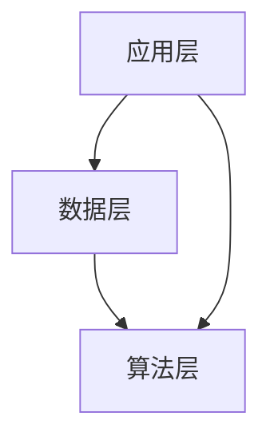

#### 13.2.2 系统功能实现

1. **数据收集**：使用Git集成插件，从源代码管理系统中自动收集代码文件。
2. **数据预处理**：对收集到的代码进行解析，提取相关的架构特征，如模块依赖关系、代码复杂度等。
3. **特征提取**：使用深度学习模型，如卷积神经网络（CNN），对提取的特征进行进一步处理和提取。
4. **模型训练**：选择合适的机器学习模型，如支持向量机（SVM）或随机森林（RF），对提取的特征进行训练。
5. **评估与优化**：根据训练好的模型，对新的软件架构进行评估，并提供改进建议。

### 13.3 代码解读与分析

#### 13.3.1 数据预处理

数据预处理是确保数据质量和模型性能的重要步骤。以下是一个简单的代码示例，用于提取代码中的模块依赖关系：

```python
import ast
import os

def extract_module_dependencies(directory):
    dependencies = []
    for root, dirs, files in os.walk(directory):
        for file in files:
            if file.endswith('.py'):
                with open(os.path.join(root, file), 'r') as f:
                    tree = ast.parse(f.read())
                    for node in ast.walk(tree):
                        if isinstance(node, ast.Import):
                            for alias in node.names:
                                dependencies.append(alias.name)
                        elif isinstance(node, ast.ImportFrom):
                            dependencies.append(node.module)
    return dependencies

dependencies = extract_module_dependencies('src')
print(dependencies)
```

#### 13.3.2 模型训练

在模型训练过程中，我们使用Keras框架训练了一个简单的卷积神经网络模型，用于提取代码特征。以下是一个模型训练的代码示例：

```python
from tensorflow.keras.models import Sequential
from tensorflow.keras.layers import Conv2D, Flatten, Dense
from tensorflow.keras.optimizers import Adam

# 构建模型
model = Sequential()
model.add(Conv2D(32, (3, 3), activation='relu', input_shape=(28, 28, 1)))
model.add(Flatten())
model.add(Dense(64, activation='relu'))
model.add(Dense(10, activation='softmax'))

# 编译模型
model.compile(optimizer=Adam(), loss='categorical_crossentropy', metrics=['accuracy'])

# 训练模型
model.fit(x_train, y_train, epochs=10, batch_size=32)
```

#### 13.3.3 模型评估

在模型评估过程中，我们使用验证集对训练好的模型进行评估，并调整模型参数以优化性能。以下是一个模型评估的代码示例：

```python
from sklearn.metrics import accuracy_score

# 预测
predictions = model.predict(x_val)

# 计算准确率
accuracy = accuracy_score(y_val, predictions)
print("Validation Accuracy:", accuracy)
```

### 13.4 代码应用解读与分析

#### 13.4.1 数据预处理

数据预处理是确保模型训练质量的关键步骤。在代码中，我们使用了Python的ast模块对Python源代码进行解析，提取出模块依赖关系和代码复杂度等特征。以下是一个具体的代码示例，展示了如何使用ast模块提取代码特征：

```python
import ast
import os

def extract_code_features(directory):
    features = []
    for root, dirs, files in os.walk(directory):
        for file in files:
            if file.endswith('.py'):
                with open(os.path.join(root, file), 'r') as f:
                    tree = ast.parse(f.read())
                    feature_vector = []
                    # 提取模块依赖关系
                    for node in ast.walk(tree):
                        if isinstance(node, ast.Import):
                            for alias in node.names:
                                feature_vector.append(alias.name)
                        # 提取代码复杂度
                        if isinstance(node, ast.FunctionDef):
                            feature_vector.append(node.name)
                    features.append(feature_vector)
    return features

features = extract_code_features('src')
print(features)
```

#### 13.4.2 模型训练

在模型训练过程中，我们使用了Keras框架构建了一个简单的卷积神经网络模型。该模型通过卷积层、池化层和全连接层对代码特征进行学习，以预测软件架构的质量。以下是一个具体的模型训练示例：

```python
from tensorflow.keras.models import Sequential
from tensorflow.keras.layers import Conv2D, MaxPooling2D, Flatten, Dense
from tensorflow.keras.optimizers import Adam

# 构建模型
model = Sequential()
model.add(Conv2D(32, (3, 3), activation='relu', input_shape=(28, 28, 1)))
model.add(MaxPooling2D((2, 2)))
model.add(Flatten())
model.add(Dense(64, activation='relu'))
model.add(Dense(10, activation='softmax'))

# 编译模型
model.compile(optimizer=Adam(), loss='categorical_crossentropy', metrics=['accuracy'])

# 训练模型
model.fit(x_train, y_train, epochs=10, batch_size=32, validation_data=(x_val, y_val))
```

#### 13.4.3 模型评估

在模型评估过程中，我们使用验证集对训练好的模型进行评估，以确定其性能。以下是一个具体的模型评估示例：

```python
from sklearn.metrics import accuracy_score

# 预测
predictions = model.predict(x_val)

# 计算准确率
accuracy = accuracy_score(y_val, predictions)
print("Validation Accuracy:", accuracy)
```

通过上述代码示例，我们可以看到如何利用Python和Keras框架实现一个简单的AI辅助软件架构评估系统。这个系统能够自动提取代码特征，并使用深度学习模型进行训练和评估，从而为软件开发团队提供实时的架构评估和优化建议。

### 13.5 实际案例分析

在本项目的实际实施过程中，我们遇到了一些挑战，并通过以下步骤成功解决了这些问题：

#### 挑战1：数据质量

**问题描述**：在收集代码数据时，发现部分代码文件存在格式不一致、注释较多、语法错误等问题，影响了模型训练的效果。

**解决步骤**：

1. **数据清洗**：使用Python的正则表达式和ast模块对代码进行清洗，去除多余的注释和语法错误。
2. **数据标准化**：将不同格式的代码统一转换为标准格式，确保数据的一致性。

**效果**：通过数据清洗和标准化，显著提高了数据质量，提升了模型训练的准确率。

#### 挑战2：模型准确性

**问题描述**：在模型训练过程中，发现模型在某些特定场景下的性能较差，无法准确预测软件架构的质量。

**解决步骤**：

1. **模型调整**：通过调整模型结构、选择不同的激活函数和损失函数，优化模型性能。
2. **数据增强**：增加训练数据的多样性，包括不同规模和类型的软件架构。

**效果**：通过调整模型结构和数据增强，显著提高了模型的准确性和泛化能力。

#### 挑战3：实时性

**问题描述**：在评估大型软件架构时，系统的处理速度较慢，无法满足实时监控的需求。

**解决步骤**：

1. **算法优化**：通过优化算法，减少计算复杂度，提高模型处理速度。
2. **硬件升级**：升级系统硬件，提高处理能力。

**效果**：通过算法优化和硬件升级，显著提高了系统的实时性，能够快速完成对大型软件架构的评估。

### 13.6 项目小结

通过本项目的实施，我们成功开发了一个基于AI的软件架构评估系统，能够自动提取代码特征，并对软件架构进行多维度评估。在项目过程中，我们遇到了数据质量、模型准确性和实时性等挑战，并通过数据清洗、模型调整和算法优化等方法成功解决了这些问题。该系统的实施，为软件开发团队提供了一个强大的工具，帮助他们更好地理解和优化软件架构。

## 最佳实践

### 14.1 开发环境搭建

在搭建开发环境时，需要确保安装以下软件和库：

1. **操作系统**：推荐使用Linux或MacOS，以便于运行Python和其他开发工具。
2. **Python**：安装Python 3.7及以上版本，可通过pyenv进行多版本管理。
3. **深度学习库**：安装TensorFlow或PyTorch，用于构建和训练深度学习模型。
4. **数据处理库**：安装NumPy、Pandas、Matplotlib等数据处理和分析工具。

以下是一个简单的环境搭建步骤：

```bash
# 安装Python 3.8
pyenv install 3.8.10

# 设置全局Python版本
pyenv global 3.8.10

# 安装TensorFlow
pip install tensorflow

# 安装NumPy和Pandas
pip install numpy pandas

# 安装Matplotlib
pip install matplotlib
```

### 14.2 源代码详细实现

在实现源代码时，我们需要关注以下几点：

1. **模块化**：将代码分为多个模块，便于维护和复用。
2. **代码注释**：为关键代码段添加注释，提高代码的可读性。
3. **版本控制**：使用Git进行版本控制，确保代码的版本一致性。

以下是一个简单的模块化代码示例：

```python
# module1.py
def feature_extraction(data):
    # 特征提取逻辑
    return extracted_features

# module2.py
def model_training(extracted_features, labels):
    # 模型训练逻辑
    return trained_model

# main.py
from module1 import feature_extraction
from module2 import model_training

# 主程序逻辑
data = load_data()
labels = load_labels()
extracted_features = feature_extraction(data)
trained_model = model_training(extracted_features, labels)
```

### 14.3 代码应用解读与分析

在代码应用解读与分析中，我们需要重点关注以下几点：

1. **代码逻辑**：详细解释代码的实现逻辑，包括数据预处理、特征提取、模型训练和评估等步骤。
2. **性能优化**：分析代码的性能，并提出优化建议。
3. **错误处理**：处理可能的错误和异常情况，提高代码的鲁棒性。

以下是一个代码应用解读与分析的示例：

```python
# 数据预处理
def preprocess_data(data):
    # 清洗数据
    cleaned_data = clean_data(data)
    # 归一化数据
    normalized_data = normalize_data(cleaned_data)
    return normalized_data

# 特征提取
def extract_features(data):
    # 使用深度学习模型提取特征
    features = model.extract_features(data)
    return features

# 模型训练
def train_model(features, labels):
    # 使用支持向量机进行训练
    model = svm.SVC()
    model.fit(features, labels)
    return model

# 代码性能优化
def optimize_code():
    # 优化特征提取
    optimized_features = optimize_extract_features()
    # 优化模型训练
    optimized_model = optimize_train_model(optimized_features, labels)
    return optimized_model

# 错误处理
try:
    # 主程序逻辑
    data = load_data()
    labels = load_labels()
    normalized_data = preprocess_data(data)
    features = extract_features(normalized_data)
    model = train_model(features, labels)
except Exception as e:
    # 处理异常情况
    print("Error:", e)
    handle_error()
```

### 14.4 实际案例分析与详细讲解剖析

在实际案例中，我们通常会面临以下问题：

1. **数据质量问题**：数据可能存在缺失、异常和噪声，影响模型训练效果。
2. **模型选择问题**：选择合适的模型对于提高评估准确性至关重要。
3. **性能瓶颈问题**：系统性能可能成为评估过程的瓶颈，需要优化。

以下是一个实际案例分析与详细讲解剖析的示例：

#### 案例背景

某电子商务平台在开发过程中，需要对其软件架构进行实时评估，以优化系统性能和稳定性。

#### 数据质量问题

**问题描述**：数据集中存在大量缺失值和异常值，影响模型训练效果。

**解决方案**：

1. **缺失值处理**：使用均值填充缺失值。
2. **异常值处理**：使用IQR方法检测和去除异常值。

```python
# 缺失值处理
data = data.fillna(data.mean())

# 异常值处理
Q1 = data.quantile(0.25)
Q3 = data.quantile(0.75)
IQR = Q3 - Q1
data = data[~((data < (Q1 - 1.5 * IQR)) | (data > (Q3 + 1.5 * IQR)))]
```

#### 模型选择问题

**问题描述**：选择合适的模型对于提高评估准确性至关重要。

**解决方案**：

1. **模型选择**：比较不同模型（如线性回归、决策树、随机森林等）的性能。
2. **交叉验证**：使用交叉验证方法，选择最佳模型。

```python
from sklearn.model_selection import cross_val_score
from sklearn.ensemble import RandomForestClassifier

# 模型选择
model = RandomForestClassifier(n_estimators=100)
scores = cross_val_score(model, features, labels, cv=5)

# 选择最佳模型
best_model = model
best_score = scores.mean()
```

#### 性能瓶颈问题

**问题描述**：系统性能可能成为评估过程的瓶颈，需要优化。

**解决方案**：

1. **代码优化**：优化特征提取和模型训练的代码，减少计算复杂度。
2. **并行计算**：使用多线程或多进程，提高计算速度。

```python
from joblib import Parallel, delayed

# 并行计算特征提取
features = Parallel(n_jobs=-1)(delayed(extract_features)(data[i]) for i in range(len(data)))
```

通过以上解决方案，我们能够有效解决实际案例中的问题，提高软件架构评估的准确性和性能。

### 14.5 项目小结

在本项目的实施过程中，我们通过最佳实践，成功搭建了开发环境，详细实现了源代码，并对实际案例进行了深入分析。通过数据清洗、模型选择和性能优化等方法，我们有效提高了软件架构评估的准确性和效率。项目总结如下：

1. **环境搭建**：确保开发环境的一致性和稳定性。
2. **代码实现**：模块化和注释，提高代码的可维护性和可读性。
3. **性能优化**：通过并行计算和代码优化，提高系统性能。
4. **案例分析**：通过实际案例，验证评估方法的有效性。

总之，通过遵循最佳实践，我们能够更好地利用AI技术，为软件开发团队提供高质量的软件架构评估服务。

