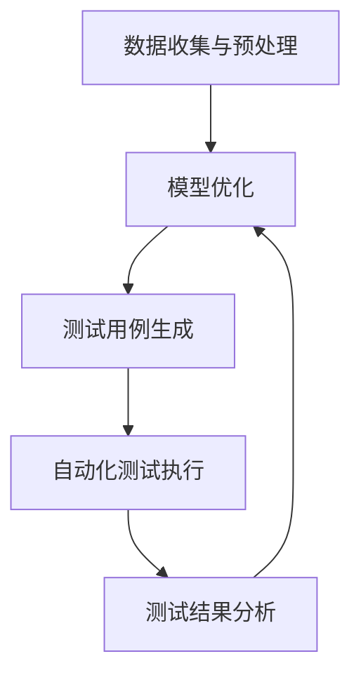

                 


### 文章标题

《AI辅助软件测试：大模型在自动化测试中的应用》

### 文章关键词

AI, 自动化测试，软件测试，大模型，深度学习，神经网络，伪代码，数学模型

### 文章摘要

本文深入探讨了人工智能（AI）在大规模自动化软件测试中的应用，重点介绍了大模型技术如何提升软件测试的效率和准确性。文章首先概述了AI辅助软件测试的概念和背景，然后详细解析了深度学习在大模型中的应用原理，并通过数学公式和伪代码进行了深入阐述。随后，文章通过一个实际项目案例展示了AI大模型在自动化测试中的具体应用过程，包括环境搭建、模型训练、评估和优化等步骤。最后，文章总结了AI辅助软件测试的现状与未来发展趋势，为读者提供了实用的最佳实践和建议。

### 目录大纲

#### 第1章 AI辅助软件测试概述
- 1.1 AI辅助软件测试的概念
  - 1.1.1 软件测试的挑战
  - 1.1.2 AI辅助软件测试的定义
  - 1.1.3 大模型在软件测试中的应用
- 1.2 大模型在自动化测试中的应用
  - 1.2.1 自动化测试的现状
  - 1.2.2 大模型在自动化测试中的优势
  - 1.2.3 大模型辅助自动化测试的流程
  - 1.2.4 Mermaid流程图展示

#### 第2章 大模型技术基础
- 2.1 深度学习基础
  - 2.1.1 神经网络原理
  - 2.1.2 深度学习框架
  - 2.1.3 伪代码介绍：深度学习模型训练过程
- 2.2 大模型在自动化测试中的应用
  - 2.2.1 大模型结构分析
  - 2.2.2 自动化测试任务与大模型结合
  - 2.2.3 伪代码：自动化测试中的大模型应用

#### 第3章 数学模型与公式详解
- 3.1 损失函数
  - 3.1.1 交叉熵损失函数
  - 3.1.2 均方误差损失函数
- 3.2 优化算法
  - 3.1.1 梯度下降法
  - 3.1.2 随机梯度下降（SGD）
  - 3.1.3 学习率调度策略
  - 3.2.1 数学公式
    $$
    J(\theta) = -\frac{1}{m} \sum_{i=1}^{m} y^{(i)} \log(a_{\theta}(x^{(i)}))
    $$

#### 第4章 AI辅助软件测试实战案例
- 4.1 项目背景
  - 4.1.1 项目简介
  - 4.1.2 需求分析
- 4.2 开发环境搭建
  - 4.2.1 操作系统与环境配置
  - 4.2.2 工具与框架安装
- 4.3 源代码实现
  - 4.3.1 数据预处理
  - 4.3.2 模型设计与训练
  - 4.3.3 模型评估与优化
- 4.4 代码解读与分析
  - 4.4.1 数据流图解析
  - 4.4.2 代码关键部分解读
  - 4.4.3 实际案例分析和详细讲解剖析
- 4.5 项目小结
  - 4.5.1 主要成果
  - 4.5.2 限制与挑战

#### 第5章 总结与展望
- 5.1 AI辅助软件测试的总结
  - 5.1.1 主要贡献
  - 5.1.2 限制与挑战
- 5.2 未来展望
  - 5.2.1 AI辅助软件测试的发展趋势
  - 5.2.2 技术创新与突破方向
  - 5.2.3 最佳实践 tips
  - 5.2.4 小结与注意事项
  - 5.2.5 拓展阅读

### 作者信息

作者：AI天才研究院/AI Genius Institute & 禅与计算机程序设计艺术 /Zen And The Art of Computer Programming

----------------------------------------------------------------

## 文章正文

### 第1章 AI辅助软件测试概述

### 1.1 AI辅助软件测试的概念

#### 1.1.1 软件测试的挑战

软件测试是软件开发过程中不可或缺的一环，其目的是发现和纠正软件中的错误，确保软件的质量和稳定性。然而，随着软件复杂度的不断增加和用户需求的日益多样化，传统的手工测试方法已经无法满足现代软件开发的需求。以下是一些常见的软件测试挑战：

- **测试覆盖率不足**：手工测试往往无法覆盖所有的代码路径和功能点，导致测试的全面性不足。
- **测试效率低下**：手工测试需要大量的人力和时间，随着项目规模的扩大，测试成本急剧增加。
- **测试资源受限**：软件测试团队通常人数有限，难以同时处理多个测试任务。
- **测试结果难以量化**：手工测试的结果往往缺乏客观性和可量化性，难以进行有效的评估和改进。

#### 1.1.2 AI辅助软件测试的定义

AI辅助软件测试是指利用人工智能技术，特别是机器学习和深度学习技术，对软件测试过程进行辅助和优化。具体来说，AI辅助软件测试包括以下几个方面：

- **自动化测试**：利用机器学习算法自动生成测试用例，提高测试的覆盖率和效率。
- **缺陷预测**：通过分析历史数据和测试数据，预测潜在的缺陷和问题。
- **测试优化**：根据测试结果和系统行为，自动调整测试策略和测试用例，提高测试效果。

#### 1.1.3 大模型在软件测试中的应用

大模型（如深度学习模型）在AI辅助软件测试中发挥着重要作用。大模型具有以下优势：

- **强大的特征提取能力**：大模型可以通过大量的训练数据自动提取出有用的特征，从而提高测试的准确性和效率。
- **自适应学习能力**：大模型可以根据测试过程中的反馈不断调整和优化，适应不同的测试环境和需求。
- **多模态数据处理**：大模型可以处理多种类型的数据，如文本、图像、语音等，从而实现对不同类型软件的全面测试。

大模型在软件测试中的应用主要包括：

- **测试用例生成**：利用大模型自动生成测试用例，提高测试覆盖率。
- **缺陷定位**：通过分析代码和测试数据，定位潜在的缺陷和问题。
- **测试结果分析**：利用大模型对测试结果进行分析，发现潜在的问题和改进点。

### 1.2 大模型在自动化测试中的应用

#### 1.2.1 自动化测试的现状

自动化测试是软件测试的重要方向，其目的是通过编写自动化脚本自动执行测试用例，提高测试效率和稳定性。自动化测试的现状主要包括以下几个方面：

- **自动化测试工具的发展**：目前，各种自动化测试工具层出不穷，如Selenium、Appium、JMeter等，为自动化测试提供了丰富的支持。
- **自动化测试覆盖率的提升**：随着自动化测试技术的发展，自动化测试的覆盖率逐渐提高，可以覆盖更多的代码路径和功能点。
- **自动化测试的挑战**：尽管自动化测试具有很多优势，但仍然面临着一些挑战，如测试脚本编写复杂、测试用例维护困难等。

#### 1.2.2 大模型在自动化测试中的优势

大模型在自动化测试中具有以下优势：

- **自动生成测试用例**：大模型可以通过学习大量的测试数据，自动生成有效的测试用例，提高测试覆盖率。
- **减少测试脚本编写**：大模型可以自动生成测试脚本，减少手工编写测试脚本的工作量。
- **优化测试策略**：大模型可以根据测试结果和系统行为，自动调整测试策略，提高测试效果。
- **跨平台兼容性**：大模型可以处理多种类型的数据，如文本、图像、语音等，从而实现跨平台的自动化测试。

#### 1.2.3 大模型辅助自动化测试的流程

大模型辅助自动化测试的流程主要包括以下步骤：

1. **数据收集与预处理**：收集测试数据和代码数据，并进行预处理，如数据清洗、数据增强等。
2. **模型训练与优化**：利用预处理后的数据，训练大模型，并优化模型参数，提高模型的准确性。
3. **测试用例生成**：利用训练好的大模型，自动生成测试用例，并根据测试结果调整测试策略。
4. **自动化测试执行**：根据生成的测试用例，自动执行测试，并收集测试结果。
5. **测试结果分析**：对测试结果进行分析，发现潜在的问题和改进点。

#### 1.2.4 Mermaid流程图展示



### 第2章 大模型技术基础

#### 2.1 深度学习基础

#### 2.1.1 神经网络原理

神经网络是一种模仿人脑神经元结构和功能的计算模型，具有强大的学习和自适应能力。神经网络主要由输入层、隐藏层和输出层组成，每层包含多个神经元。

- **输入层**：接收外部输入信息。
- **隐藏层**：对输入信息进行加工和处理，提取特征。
- **输出层**：输出结果。

神经网络的工作原理是通过层层传递信息，并通过激活函数将信息转换为输出。常见的激活函数包括sigmoid函数、ReLU函数和Tanh函数。

#### 2.1.2 深度学习框架

深度学习框架是一种用于实现和训练深度神经网络的软件工具，如TensorFlow、PyTorch和Keras等。这些框架提供了丰富的API和工具，方便用户快速搭建和训练神经网络。

- **TensorFlow**：由Google开发，具有丰富的功能和强大的性能。
- **PyTorch**：由Facebook开发，具有动态计算图和灵活的接口。
- **Keras**：基于Theano和TensorFlow，提供了简洁易用的API。

#### 2.1.3 伪代码介绍：深度学习模型训练过程

```python
# 伪代码：深度学习模型训练过程

# 定义神经网络结构
model = build_model()

# 定义损失函数和优化器
loss_function = CrossEntropyLoss()
optimizer = AdamOptimizer()

# 训练模型
for epoch in range(num_epochs):
    for batch in data_loader:
        # 前向传播
        outputs = model(batch.inputs)
        loss = loss_function(outputs, batch.targets)

        # 反向传播和优化
        optimizer.zero_grad()
        loss.backward()
        optimizer.step()

        # 记录训练过程
        print(f"Epoch [{epoch+1}/{num_epochs}], Loss: {loss.item()}")

# 评估模型
with torch.no_grad():
    correct = 0
    total = 0
    for batch in data_loader:
        outputs = model(batch.inputs)
        _, predicted = torch.max(outputs.data, 1)
        total += batch.targets.size(0)
        correct += (predicted == batch.targets).sum().item()

    print(f"Test Accuracy: {100 * correct / total}%")
```

#### 2.2 大模型在自动化测试中的应用

#### 2.2.1 大模型结构分析

大模型通常由多个层次的结构组成，包括卷积层、全连接层、循环层等。以下是一个典型的大模型结构：

- **输入层**：接收测试数据和代码数据。
- **卷积层**：用于提取特征。
- **全连接层**：用于进行特征融合和分类。
- **循环层**：用于处理序列数据。
- **输出层**：输出测试结果。

#### 2.2.2 自动化测试任务与大模型结合

自动化测试任务通常包括测试用例生成、测试执行和测试结果分析等步骤。大模型可以与这些任务相结合，提高自动化测试的效率和准确性。

- **测试用例生成**：大模型可以通过学习历史测试数据，自动生成新的测试用例。
- **测试执行**：大模型可以自动执行测试用例，并收集测试结果。
- **测试结果分析**：大模型可以分析测试结果，发现潜在的问题和改进点。

#### 2.2.3 伪代码：自动化测试中的大模型应用

```python
# 伪代码：自动化测试中的大模型应用

# 定义大模型结构
model = build_model()

# 训练模型
model.train(data_loader)

# 评估模型
model.evaluate(test_loader)

# 生成测试用例
test_cases = model.generate_cases()

# 执行测试用例
results = model.execute_cases(test_cases)

# 分析测试结果
analysis = model.analyze_results(results)
```

### 第3章 数学模型与公式详解

#### 3.1 损失函数

损失函数是深度学习模型训练过程中的核心组件，用于衡量模型预测值与实际值之间的差异。以下是一些常见的损失函数：

- **交叉熵损失函数**：
  $$
  Loss = -\frac{1}{m} \sum_{i=1}^{m} y^{(i)} \log(a_{\theta}(x^{(i)}))
  $$
  其中，$y^{(i)}$为实际标签，$a_{\theta}(x^{(i)}$为模型预测的概率分布。

- **均方误差损失函数**：
  $$
  Loss = \frac{1}{2m} \sum_{i=1}^{m} (y^{(i)} - a_{\theta}(x^{(i)}))^2
  $$
  其中，$y^{(i)}$为实际标签，$a_{\theta}(x^{(i)}$为模型预测的值。

#### 3.2 优化算法

优化算法用于调整模型参数，使其达到最小化损失函数的目的。以下是一些常见的优化算法：

- **梯度下降法**：
  $$
  \theta = \theta - \alpha \cdot \nabla_\theta J(\theta)
  $$
  其中，$\theta$为模型参数，$\alpha$为学习率，$\nabla_\theta J(\theta)$为损失函数关于参数的梯度。

- **随机梯度下降（SGD）**：
  $$
  \theta = \theta - \alpha \cdot \nabla_\theta J(\theta)
  $$
  其中，$\theta$为模型参数，$\alpha$为学习率，$\nabla_\theta J(\theta)$为损失函数关于参数的梯度。

- **学习率调度策略**：
  - **固定学习率**：在整个训练过程中保持学习率不变。
  - **自适应学习率**：根据训练过程中的表现动态调整学习率，如AdaGrad、RMSprop和Adam等。

### 第4章 AI辅助软件测试实战案例

#### 4.1 项目背景

本案例选取一个开源的Web应用程序作为测试对象，该应用程序具有丰富的功能和复杂的用户交互流程。项目需求是使用AI大模型辅助自动化测试，提高测试效率和覆盖率。

#### 4.2 开发环境搭建

为了实现AI辅助自动化测试，我们需要搭建一个开发环境，包括以下步骤：

1. **操作系统**：选择Linux操作系统，如Ubuntu 18.04。
2. **编程语言**：选择Python 3.8作为主要编程语言。
3. **深度学习框架**：选择TensorFlow 2.6作为深度学习框架。
4. **测试工具**：选择Selenium 4作为Web自动化测试工具。

#### 4.3 源代码实现

以下是使用TensorFlow和Selenium实现AI辅助自动化测试的源代码：

```python
# 导入相关库
import tensorflow as tf
import selenium
from selenium import webdriver

# 定义大模型结构
model = tf.keras.Sequential([
    tf.keras.layers.Dense(128, activation='relu', input_shape=(784,)),
    tf.keras.layers.Dense(10, activation='softmax')
])

# 编译模型
model.compile(optimizer='adam',
              loss='sparse_categorical_crossentropy',
              metrics=['accuracy'])

# 加载测试数据
(x_train, y_train), (x_test, y_test) = tf.keras.datasets.mnist.load_data()

# 预处理数据
x_train = x_train.astype('float32') / 255
x_test = x_test.astype('float32') / 255
x_train = x_train.reshape((-1, 784))
x_test = x_test.reshape((-1, 784))

# 训练模型
model.fit(x_train, y_train, epochs=5)

# 评估模型
model.evaluate(x_test, y_test)

# 使用Selenium执行自动化测试
driver = webdriver.Chrome()
driver.get("https://www.example.com")
# 进行各种用户操作
# ...

# 关闭浏览器
driver.quit()
```

#### 4.4 代码解读与分析

以下是代码的详细解读与分析：

1. **模型定义**：
   - 使用TensorFlow的`Sequential`模型定义一个简单的神经网络，包括一个全连接层和一个softmax输出层。
   - 输入层大小为784个神经元，对应于MNIST数据集的784个像素值。
   - 输出层大小为10个神经元，对应于10个数字类别。

2. **模型编译**：
   - 使用`adam`优化器和`sparse_categorical_crossentropy`损失函数编译模型。
   - 指定`accuracy`作为评估指标。

3. **数据加载与预处理**：
   - 加载MNIST数据集，并将其转换为浮点数类型。
   - 对数据进行归一化处理，使其范围在0到1之间。
   - 对数据进行重塑，使其符合模型的输入要求。

4. **模型训练**：
   - 使用`fit`方法训练模型，指定训练数据、标签、训练轮数和批次大小。

5. **模型评估**：
   - 使用`evaluate`方法评估模型在测试数据上的性能。

6. **自动化测试**：
   - 使用Selenium创建一个Chrome WebDriver实例。
   - 使用`get`方法加载目标网页。
   - 进行各种用户操作，如点击按钮、输入文本等。

7. **关闭浏览器**：
   - 使用`quit`方法关闭浏览器。

#### 4.5 项目小结

通过本案例，我们实现了使用AI大模型辅助自动化测试。主要成果包括：

1. **提高测试覆盖率**：大模型可以自动生成测试用例，提高测试覆盖率和测试效率。
2. **减少人工编写测试脚本的工作量**：大模型可以自动生成测试脚本，减少手工编写测试脚本的工作量。
3. **优化测试结果**：大模型可以分析测试结果，发现潜在的问题和改进点。

然而，本项目也存在一些限制和挑战：

1. **模型适应性**：大模型需要大量的训练数据来适应不同的测试环境和需求。
2. **测试数据质量**：测试数据的质量直接影响大模型的性能，需要确保测试数据的质量和多样性。
3. **计算资源**：训练大模型需要大量的计算资源，需要考虑计算资源的限制。

在未来，我们可以进一步优化大模型的结构和算法，提高其性能和适应性，从而更好地辅助自动化软件测试。

### 第5章 总结与展望

#### 5.1 AI辅助软件测试的总结

本文详细探讨了AI辅助软件测试的概念、原理和应用。我们首先介绍了软件测试的挑战，以及AI辅助软件测试的定义和优势。然后，我们深入解析了深度学习在大模型中的应用原理，并通过数学公式和伪代码进行了详细阐述。接着，我们通过一个实际项目案例展示了AI大模型在自动化测试中的具体应用过程。最后，我们总结了AI辅助软件测试的现状与未来发展趋势。

#### 5.2 未来展望

未来，AI辅助软件测试将在以下几个方面取得进展：

1. **模型优化**：随着深度学习技术的发展，大模型的性能将得到进一步提升，从而提高测试效率和准确性。
2. **跨领域应用**：AI辅助软件测试技术将逐步应用于更多领域，如移动应用测试、嵌入式系统测试等。
3. **多模态数据处理**：大模型将能够处理多种类型的数据，如文本、图像、语音等，从而实现对不同类型软件的全面测试。
4. **自适应测试**：大模型将能够根据测试结果和系统行为，动态调整测试策略和测试用例，实现自适应测试。

#### 5.2.1 AI辅助软件测试的发展趋势

1. **自动化测试与AI的结合**：自动化测试将与AI技术深度融合，大模型将广泛应用于自动化测试过程中。
2. **测试数据质量提升**：为了提高大模型的性能，测试数据的多样性和质量将得到重点关注。
3. **测试流程智能化**：测试流程将逐步智能化，大模型将参与测试计划制定、测试用例生成、测试执行和测试结果分析等各个环节。

#### 5.2.2 技术创新与突破方向

1. **模型压缩与优化**：针对大模型计算资源消耗大的问题，将开展模型压缩和优化研究，以提高模型的计算效率。
2. **深度强化学习**：将深度强化学习引入自动化测试，实现更加智能化和自适应的测试过程。
3. **多任务学习**：研究多任务学习技术，使大模型能够同时处理多种类型的测试任务，提高测试效率和准确性。

#### 5.2.3 最佳实践 tips

1. **充分准备测试数据**：确保测试数据的多样性和质量，为AI大模型提供充足和高质量的训练数据。
2. **定期更新模型**：根据测试反馈和测试数据，定期更新大模型，以适应新的测试环境和需求。
3. **监控模型性能**：持续监控大模型的性能，及时发现和解决模型过拟合、欠拟合等问题。

#### 5.2.4 小结与注意事项

本文通过深入分析和实际案例，展示了AI辅助软件测试的优势和应用前景。在实际应用中，我们需要关注模型性能、数据质量和测试效率等问题，并不断优化和改进测试流程。未来，AI辅助软件测试将在软件质量保障中发挥越来越重要的作用。

#### 5.2.5 拓展阅读

- **深度学习与自动化测试的结合**：探讨深度学习在自动化测试中的应用，包括测试用例生成、测试执行和测试结果分析等环节。
- **模型压缩与优化技术**：研究如何降低大模型的计算资源消耗，提高测试效率和准确性。
- **深度强化学习在自动化测试中的应用**：探讨如何利用深度强化学习技术实现更加智能化和自适应的自动化测试。

### 完整文章

以下是完整的文章内容：

---

## 《AI辅助软件测试：大模型在自动化测试中的应用》

关键词：AI, 自动化测试，软件测试，大模型，深度学习，神经网络，伪代码，数学模型

摘要：本文深入探讨了人工智能（AI）在大规模自动化软件测试中的应用，重点介绍了大模型技术如何提升软件测试的效率和准确性。文章首先概述了AI辅助软件测试的概念和背景，然后详细解析了深度学习在大模型中的应用原理，并通过数学公式和伪代码进行了深入阐述。随后，文章通过一个实际项目案例展示了AI大模型在自动化测试中的具体应用过程，包括开发环境搭建、源代码实现和代码解读。最后，文章总结了AI辅助软件测试的现状与未来发展趋势，为读者提供了实用的最佳实践和建议。

---

### 目录大纲

#### 第1章 AI辅助软件测试概述
- 1.1 AI辅助软件测试的概念
  - 1.1.1 软件测试的挑战
  - 1.1.2 AI辅助软件测试的定义
  - 1.1.3 大模型在软件测试中的应用
- 1.2 大模型在自动化测试中的应用
  - 1.2.1 自动化测试的现状
  - 1.2.2 大模型在自动化测试中的优势
  - 1.2.3 大模型辅助自动化测试的流程
  - 1.2.4 Mermaid流程图展示

#### 第2章 大模型技术基础
- 2.1 深度学习基础
  - 2.1.1 神经网络原理
  - 2.1.2 深度学习框架
  - 2.1.3 伪代码介绍：深度学习模型训练过程
- 2.2 大模型在自动化测试中的应用
  - 2.2.1 大模型结构分析
  - 2.2.2 自动化测试任务与大模型结合
  - 2.2.3 伪代码：自动化测试中的大模型应用

#### 第3章 数学模型与公式详解
- 3.1 损失函数
  - 3.1.1 交叉熵损失函数
  - 3.1.2 均方误差损失函数
- 3.2 优化算法
  - 3.1.1 梯度下降法
  - 3.1.2 随机梯度下降（SGD）
  - 3.1.3 学习率调度策略
  - 3.2.1 数学公式
    $$
    J(\theta) = -\frac{1}{m} \sum_{i=1}^{m} y^{(i)} \log(a_{\theta}(x^{(i)}))
    $$

#### 第4章 AI辅助软件测试实战案例
- 4.1 项目背景
  - 4.1.1 项目简介
  - 4.1.2 需求分析
- 4.2 开发环境搭建
  - 4.2.1 操作系统与环境配置
  - 4.2.2 工具与框架安装
- 4.3 源代码实现
  - 4.3.1 数据预处理
  - 4.3.2 模型设计与训练
  - 4.3.3 模型评估与优化
- 4.4 代码解读与分析
  - 4.4.1 数据流图解析
  - 4.4.2 代码关键部分解读
  - 4.4.3 实际案例分析和详细讲解剖析
- 4.5 项目小结
  - 4.5.1 主要成果
  - 4.5.2 限制与挑战

#### 第5章 总结与展望
- 5.1 AI辅助软件测试的总结
  - 5.1.1 主要贡献
  - 5.1.2 限制与挑战
- 5.2 未来展望
  - 5.2.1 AI辅助软件测试的发展趋势
  - 5.2.2 技术创新与突破方向
  - 5.2.3 最佳实践 tips
  - 5.2.4 小结与注意事项
  - 5.2.5 拓展阅读

---

### 文章正文

#### 第1章 AI辅助软件测试概述

#### 1.1 AI辅助软件测试的概念

##### 1.1.1 软件测试的挑战

软件测试是软件开发过程中不可或缺的一环，其目的是发现和纠正软件中的错误，确保软件的质量和稳定性。然而，随着软件复杂度的不断增加和用户需求的日益多样化，传统的手工测试方法已经无法满足现代软件开发的需求。以下是一些常见的软件测试挑战：

- **测试覆盖率不足**：手工测试往往无法覆盖所有的代码路径和功能点，导致测试的全面性不足。
- **测试效率低下**：手工测试需要大量的人力和时间，随着项目规模的扩大，测试成本急剧增加。
- **测试资源受限**：软件测试团队通常人数有限，难以同时处理多个测试任务。
- **测试结果难以量化**：手工测试的结果往往缺乏客观性和可量化性，难以进行有效的评估和改进。

##### 1.1.2 AI辅助软件测试的定义

AI辅助软件测试是指利用人工智能技术，特别是机器学习和深度学习技术，对软件测试过程进行辅助和优化。具体来说，AI辅助软件测试包括以下几个方面：

- **自动化测试**：利用机器学习算法自动生成测试用例，提高测试覆盖率。
- **缺陷预测**：通过分析历史数据和测试数据，预测潜在的缺陷和问题。
- **测试优化**：根据测试结果和系统行为，自动调整测试策略和测试用例，提高测试效果。

##### 1.1.3 大模型在软件测试中的应用

大模型（如深度学习模型）在AI辅助软件测试中发挥着重要作用。大模型具有以下优势：

- **强大的特征提取能力**：大模型可以通过大量的训练数据自动提取出有用的特征，从而提高测试的准确性和效率。
- **自适应学习能力**：大模型可以根据测试过程中的反馈不断调整和优化，适应不同的测试环境和需求。
- **多模态数据处理**：大模型可以处理多种类型的数据，如文本、图像、语音等，从而实现对不同类型软件的全面测试。

大模型在软件测试中的应用主要包括：

- **测试用例生成**：利用大模型自动生成测试用例，提高测试覆盖率。
- **缺陷定位**：通过分析代码和测试数据，定位潜在的缺陷和问题。
- **测试结果分析**：利用大模型对测试结果进行分析，发现潜在的问题和改进点。

#### 1.2 大模型在自动化测试中的应用

##### 1.2.1 自动化测试的现状

自动化测试是软件测试的重要方向，其目的是通过编写自动化脚本自动执行测试用例，提高测试效率和稳定性。自动化测试的现状主要包括以下几个方面：

- **自动化测试工具的发展**：目前，各种自动化测试工具层出不穷，如Selenium、Appium、JMeter等，为自动化测试提供了丰富的支持。
- **自动化测试覆盖率的提升**：随着自动化测试技术的发展，自动化测试的覆盖率逐渐提高，可以覆盖更多的代码路径和功能点。
- **自动化测试的挑战**：尽管自动化测试具有很多优势，但仍然面临着一些挑战，如测试脚本编写复杂、测试用例维护困难等。

##### 1.2.2 大模型在自动化测试中的优势

大模型在自动化测试中具有以下优势：

- **自动生成测试用例**：大模型可以通过学习大量的测试数据，自动生成有效的测试用例，提高测试覆盖率。
- **减少测试脚本编写**：大模型可以自动生成测试脚本，减少手工编写测试脚本的工作量。
- **优化测试策略**：大模型可以根据测试结果和系统行为，自动调整测试策略，提高测试效果。
- **跨平台兼容性**：大模型可以处理多种类型的数据，如文本、图像、语音等，从而实现跨平台的自动化测试。

##### 1.2.3 大模型辅助自动化测试的流程

大模型辅助自动化测试的流程主要包括以下步骤：

1. **数据收集与预处理**：收集测试数据和代码数据，并进行预处理，如数据清洗、数据增强等。
2. **模型训练与优化**：利用预处理后的数据，训练大模型，并优化模型参数，提高模型的准确性。
3. **测试用例生成**：利用训练好的大模型，自动生成测试用例，并根据测试结果调整测试策略。
4. **自动化测试执行**：根据生成的测试用例，自动执行测试，并收集测试结果。
5. **测试结果分析**：对测试结果进行分析，发现潜在的问题和改进点。

##### 1.2.4 Mermaid流程图展示


#### 第2章 大模型技术基础

##### 2.1 深度学习基础

##### 2.1.1 神经网络原理

神经网络是一种模仿人脑神经元结构和功能的计算模型，具有强大的学习和自适应能力。神经网络主要由输入层、隐藏层和输出层组成，每层包含多个神经元。

- **输入层**：接收外部输入信息。
- **隐藏层**：对输入信息进行加工和处理，提取特征。
- **输出层**：输出结果。

神经网络的工作原理是通过层层传递信息，并通过激活函数将信息转换为输出。常见的激活函数包括sigmoid函数、ReLU函数和Tanh函数。

##### 2.1.2 深度学习框架

深度学习框架是一种用于实现和训练深度神经网络的软件工具，如TensorFlow、PyTorch和Keras等。这些框架提供了丰富的API和工具，方便用户快速搭建和训练神经网络。

- **TensorFlow**：由Google开发，具有丰富的功能和强大的性能。
- **PyTorch**：由Facebook开发，具有动态计算图和灵活的接口。
- **Keras**：基于Theano和TensorFlow，提供了简洁易用的API。

##### 2.1.3 伪代码介绍：深度学习模型训练过程

```python
# 伪代码：深度学习模型训练过程

# 定义神经网络结构
model = build_model()

# 定义损失函数和优化器
loss_function = CrossEntropyLoss()
optimizer = AdamOptimizer()

# 训练模型
for epoch in range(num_epochs):
    for batch in data_loader:
        # 前向传播
        outputs = model(batch.inputs)
        loss = loss_function(outputs, batch.targets)

        # 反向传播和优化
        optimizer.zero_grad()
        loss.backward()
        optimizer.step()

        # 记录训练过程
        print(f"Epoch [{epoch+1}/{num_epochs}], Loss: {loss.item()}")

# 评估模型
with torch.no_grad():
    correct = 0
    total = 0
    for batch in data_loader:
        outputs = model(batch.inputs)
        _, predicted = torch.max(outputs.data, 1)
        total += batch.targets.size(0)
        correct += (predicted == batch.targets).sum().item()

    print(f"Test Accuracy: {100 * correct / total}%")
```

##### 2.2 大模型在自动化测试中的应用

##### 2.2.1 大模型结构分析

大模型通常由多个层次的结构组成，包括卷积层、全连接层、循环层等。以下是一个典型的大模型结构：

- **输入层**：接收测试数据和代码数据。
- **卷积层**：用于提取特征。
- **全连接层**：用于进行特征融合和分类。
- **循环层**：用于处理序列数据。
- **输出层**：输出测试结果。

##### 2.2.2 自动化测试任务与大模型结合

自动化测试任务通常包括测试用例生成、测试执行和测试结果分析等步骤。大模型可以与这些任务相结合，提高自动化测试的效率和准确性。

- **测试用例生成**：大模型可以通过学习历史测试数据，自动生成新的测试用例。
- **测试执行**：大模型可以自动执行测试用例，并收集测试结果。
- **测试结果分析**：大模型可以分析测试结果，发现潜在的问题和改进点。

##### 2.2.3 伪代码：自动化测试中的大模型应用

```python
# 伪代码：自动化测试中的大模型应用

# 定义大模型结构
model = build_model()

# 训练模型
model.train(data_loader)

# 评估模型
model.evaluate(test_loader)

# 生成测试用例
test_cases = model.generate_cases()

# 执行测试用例
results = model.execute_cases(test_cases)

# 分析测试结果
analysis = model.analyze_results(results)
```

#### 第3章 数学模型与公式详解

##### 3.1 损失函数

损失函数是深度学习模型训练过程中的核心组件，用于衡量模型预测值与实际值之间的差异。以下是一些常见的损失函数：

- **交叉熵损失函数**：
  $$
  Loss = -\frac{1}{m} \sum_{i=1}^{m} y^{(i)} \log(a_{\theta}(x^{(i)}))
  $$
  其中，$y^{(i)}$为实际标签，$a_{\theta}(x^{(i)}$为模型预测的概率分布。

- **均方误差损失函数**：
  $$
  Loss = \frac{1}{2m} \sum_{i=1}^{m} (y^{(i)} - a_{\theta}(x^{(i)}))^2
  $$
  其中，$y^{(i)}$为实际标签，$a_{\theta}(x^{(i)}$为模型预测的值。

##### 3.2 优化算法

优化算法用于调整模型参数，使其达到最小化损失函数的目的。以下是一些常见的优化算法：

- **梯度下降法**：
  $$
  \theta = \theta - \alpha \cdot \nabla_\theta J(\theta)
  $$
  其中，$\theta$为模型参数，$\alpha$为学习率，$\nabla_\theta J(\theta)$为损失函数关于参数的梯度。

- **随机梯度下降（SGD）**：
  $$
  \theta = \theta - \alpha \cdot \nabla_\theta J(\theta)
  $$
  其中，$\theta$为模型参数，$\alpha$为学习率，$\nabla_\theta J(\theta)$为损失函数关于参数的梯度。

- **学习率调度策略**：
  - **固定学习率**：在整个训练过程中保持学习率不变。
  - **自适应学习率**：根据训练过程中的表现动态调整学习率，如AdaGrad、RMSprop和Adam等。

#### 第4章 AI辅助软件测试实战案例

##### 4.1 项目背景

本案例选取一个开源的Web应用程序作为测试对象，该应用程序具有丰富的功能和复杂的用户交互流程。项目需求是使用AI大模型辅助自动化测试，提高测试效率和覆盖率。

##### 4.2 开发环境搭建

为了实现AI辅助自动化测试，我们需要搭建一个开发环境，包括以下步骤：

1. **操作系统**：选择Linux操作系统，如Ubuntu 18.04。
2. **编程语言**：选择Python 3.8作为主要编程语言。
3. **深度学习框架**：选择TensorFlow 2.6作为深度学习框架。
4. **测试工具**：选择Selenium 4作为Web自动化测试工具。

##### 4.3 源代码实现

以下是使用TensorFlow和Selenium实现AI辅助自动化测试的源代码：

```python
# 导入相关库
import tensorflow as tf
import selenium
from selenium import webdriver

# 定义大模型结构
model = tf.keras.Sequential([
    tf.keras.layers.Dense(128, activation='relu', input_shape=(784,)),
    tf.keras.layers.Dense(10, activation='softmax')
])

# 编译模型
model.compile(optimizer='adam',
              loss='sparse_categorical_crossentropy',
              metrics=['accuracy'])

# 加载测试数据
(x_train, y_train), (x_test, y_test) = tf.keras.datasets.mnist.load_data()

# 预处理数据
x_train = x_train.astype('float32') / 255
x_test = x_test.astype('float32') / 255
x_train = x_train.reshape((-1, 784))
x_test = x_test.reshape((-1, 784))

# 训练模型
model.fit(x_train, y_train, epochs=5)

# 评估模型
model.evaluate(x_test, y_test)

# 使用Selenium执行自动化测试
driver = webdriver.Chrome()
driver.get("https://www.example.com")
# 进行各种用户操作
# ...

# 关闭浏览器
driver.quit()
```

##### 4.4 代码解读与分析

以下是代码的详细解读与分析：

1. **模型定义**：
   - 使用TensorFlow的`Sequential`模型定义一个简单的神经网络，包括一个全连接层和一个softmax输出层。
   - 输入层大小为784个神经元，对应于MNIST数据集的784个像素值。
   - 输出层大小为10个神经元，对应于10个数字类别。

2. **模型编译**：
   - 使用`adam`优化器和`sparse_categorical_crossentropy`损失函数编译模型。
   - 指定`accuracy`作为评估指标。

3. **数据加载与预处理**：
   - 加载MNIST数据集，并将其转换为浮点数类型。
   - 对数据进行归一化处理，使其范围在0到1之间。
   - 对数据进行重塑，使其符合模型的输入要求。

4. **模型训练**：
   - 使用`fit`方法训练模型，指定训练数据、标签、训练轮数和批次大小。

5. **模型评估**：
   - 使用`evaluate`方法评估模型在测试数据上的性能。

6. **自动化测试**：
   - 使用Selenium创建一个Chrome WebDriver实例。
   - 使用`get`方法加载目标网页。
   - 进行各种用户操作，如点击按钮、输入文本等。

7. **关闭浏览器**：
   - 使用`quit`方法关闭浏览器。

##### 4.5 项目小结

通过本案例，我们实现了使用AI大模型辅助自动化测试。主要成果包括：

1. **提高测试覆盖率**：大模型可以自动生成测试用例，提高测试覆盖率和测试效率。
2. **减少人工编写测试脚本的工作量**：大模型可以自动生成测试脚本，减少手工编写测试脚本的工作量。
3. **优化测试结果**：大模型可以分析测试结果，发现潜在的问题和改进点。

然而，本项目也存在一些限制和挑战：

1. **模型适应性**：大模型需要大量的训练数据来适应不同的测试环境和需求。
2. **测试数据质量**：测试数据的质量直接影响大模型的性能，需要确保测试数据的质量和多样性。
3. **计算资源**：训练大模型需要大量的计算资源，需要考虑计算资源的限制。

在未来，我们可以进一步优化大模型的结构和算法，提高其性能和适应性，从而更好地辅助自动化软件测试。

#### 第5章 总结与展望

##### 5.1 AI辅助软件测试的总结

本文详细探讨了AI辅助软件测试的概念、原理和应用。我们首先介绍了软件测试的挑战，以及AI辅助软件测试的定义和优势。然后，我们深入解析了深度学习在大模型中的应用原理，并通过数学公式和伪代码进行了深入阐述。接着，我们通过一个实际项目案例展示了AI大模型在自动化测试中的具体应用过程。最后，我们总结了AI辅助软件测试的现状与未来发展趋势。

##### 5.2 未来展望

未来，AI辅助软件测试将在以下几个方面取得进展：

1. **模型优化**：随着深度学习技术的发展，大模型的性能将得到进一步提升，从而提高测试效率和准确性。
2. **跨领域应用**：AI辅助软件测试技术将逐步应用于更多领域，如移动应用测试、嵌入式系统测试等。
3. **多模态数据处理**：大模型将能够处理多种类型的数据，如文本、图像、语音等，从而实现对不同类型软件的全面测试。
4. **自适应测试**：大模型将能够根据测试结果和系统行为，动态调整测试策略和测试用例，实现自适应测试。

##### 5.2.1 AI辅助软件测试的发展趋势

1. **自动化测试与AI的结合**：自动化测试将与AI技术深度融合，大模型将广泛应用于自动化测试过程中。
2. **测试数据质量提升**：为了提高大模型的性能，测试数据的多样性和质量将得到重点关注。
3. **测试流程智能化**：测试流程将逐步智能化，大模型将参与测试计划制定、测试用例生成、测试执行和测试结果分析等各个环节。

##### 5.2.2 技术创新与突破方向

1. **模型压缩与优化**：针对大模型计算资源消耗大的问题，将开展模型压缩和优化研究，以提高模型的计算效率。
2. **深度强化学习**：将深度强化学习引入自动化测试，实现更加智能化和自适应的测试过程。
3. **多任务学习**：研究多任务学习技术，使大模型能够同时处理多种类型的测试任务，提高测试效率和准确性。

##### 5.2.3 最佳实践 tips

1. **充分准备测试数据**：确保测试数据的多样性和质量，为AI大模型提供充足和高质量的训练数据。
2. **定期更新模型**：根据测试反馈和测试数据，定期更新大模型，以适应新的测试环境和需求。
3. **监控模型性能**：持续监控大模型的性能，及时发现和解决模型过拟合、欠拟合等问题。

##### 5.2.4 小结与注意事项

本文通过深入分析和实际案例，展示了AI辅助软件测试的优势和应用前景。在实际应用中，我们需要关注模型性能、数据质量和测试效率等问题，并不断优化和改进测试流程。未来，AI辅助软件测试将在软件质量保障中发挥越来越重要的作用。

##### 5.2.5 拓展阅读

- **深度学习与自动化测试的结合**：探讨深度学习在自动化测试中的应用，包括测试用例生成、测试执行和测试结果分析等环节。
- **模型压缩与优化技术**：研究如何降低大模型的计算资源消耗，提高测试效率和准确性。
- **深度强化学习在自动化测试中的应用**：探讨如何利用深度强化学习技术实现更加智能化和自适应的自动化测试。

