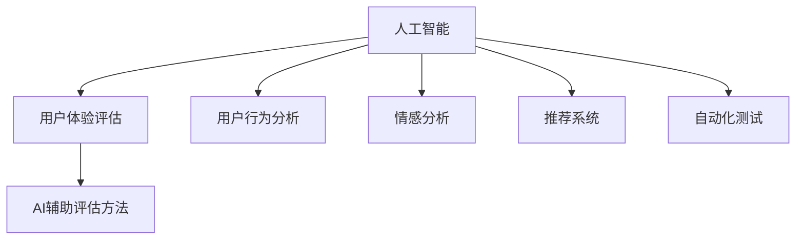

                 


### 文章标题

### AI辅助软件用户体验评估

### 关键词

* 人工智能
* 软件用户体验评估
* AI辅助方法
* 机器学习算法
* 数据分析
* 用户行为分析

### 摘要

本文将深入探讨AI辅助软件用户体验评估的原理、方法和技术。通过介绍AI在用户体验评估中的应用，以及机器学习、数据分析等算法的原理，本文将详细阐述如何构建评估指标、训练优化模型，并展示实际应用案例。最后，本文将总结最佳实践，展望未来发展趋势。

----------------------------------------------------------------

### 引言

在当今的数字时代，软件的竞争力越来越依赖于用户体验（User Experience, UX）。良好的用户体验不仅可以提升用户满意度，还能增加用户忠诚度和市场竞争力。然而，传统的用户体验评估方法往往依赖于主观感受和大量人工分析，存在时间成本高、效率低、覆盖面窄等问题。随着人工智能（Artificial Intelligence, AI）技术的快速发展，AI辅助软件用户体验评估成为了一个热门研究方向，具有巨大的潜力和应用价值。

AI辅助软件用户体验评估的核心思想是利用机器学习和数据分析技术，从大量用户行为数据中提取有价值的信息，从而辅助评估软件的易用性、可用性和满意度。这不仅能够提高评估的准确性和效率，还能为产品设计提供数据支持，推动软件产品不断优化和迭代。

本文将从以下几个方面展开讨论：

1. **核心概念与联系**：介绍AI、用户体验评估和AI辅助评估方法的基本概念，并使用Mermaid流程图展示它们之间的关系。
2. **算法原理讲解**：详细阐述机器学习算法、数据分析算法和用户行为分析算法的原理，并通过伪代码进行说明。
3. **数学模型与公式**：介绍评估指标的构建、模型训练与优化、模型评价与验证的数学模型，并使用LaTeX格式展示公式。
4. **应用实践**：分析AI辅助软件用户体验评估的实际应用案例，展示开发环境搭建、源代码实现和代码解读。
5. **总结与展望**：总结全书的核心观点，展望未来AI辅助软件用户体验评估的发展趋势。

通过本文的深入探讨，读者将能够全面了解AI辅助软件用户体验评估的原理、方法和技术，为实际项目提供有价值的参考。

### 核心概念与联系

要理解AI辅助软件用户体验评估，我们首先需要明确以下几个核心概念：人工智能（AI）、用户体验评估（UX Evaluation）和AI辅助评估方法。

#### 人工智能（AI）

人工智能是一门研究、开发和应用智能代理的理论、算法和技术科学。它通过模拟、延伸和扩展人类智能，实现计算机对数据的处理、决策和自主学习。人工智能可以分为三大类：弱AI、强AI和通用AI。其中，弱AI是指针对特定任务的智能化系统，如语音识别、图像识别等；强AI则是指具有全面认知能力的智能体，能够在任何情境下进行自主思考和学习；通用AI则介于二者之间，具备广泛的认知和学习能力，能够应对各种复杂任务。

#### 软件用户体验评估（UX Evaluation）

用户体验评估是指通过一系列方法来评估软件产品的用户使用体验。它旨在了解用户在使用软件过程中的感受、行为和反馈，从而识别潜在问题并优化软件设计。用户体验评估通常包括以下方面：

1. **可用性测试（Usability Testing）**：评估软件的易用性和用户能否高效完成任务。
2. **满意度调查（User Satisfaction Surveys）**：通过问卷调查等方式了解用户对软件的满意度。
3. **认知任务分析（Cognitive Task Analysis）**：分析用户在完成任务时的思维过程和行为模式。
4. **错误分析（Error Analysis）**：识别用户在使用过程中遇到的错误类型和频率。

#### AI辅助评估方法

AI辅助评估方法是指利用人工智能技术来增强用户体验评估的效果。这种方法的核心思想是利用机器学习和数据分析技术，从海量用户行为数据中提取有价值的信息，从而辅助评估软件的易用性、可用性和满意度。AI辅助评估方法主要包括：

1. **用户行为分析（User Behavior Analysis）**：通过分析用户的操作记录和交互数据，提取用户行为模式，评估软件的易用性。
2. **情感分析（Sentiment Analysis）**：利用自然语言处理技术分析用户的评价和反馈，了解用户对软件的满意度。
3. **推荐系统（Recommender Systems）**：根据用户的历史行为和偏好，推荐改进软件的功能和界面设计。
4. **自动化测试（Automated Testing）**：使用机器学习算法自动化生成测试用例，提高测试的覆盖率和准确性。

为了更直观地展示这些核心概念之间的联系，我们可以使用Mermaid流程图进行描述。



在上面的流程图中，A表示人工智能，B表示用户体验评估，C表示AI辅助评估方法。D、E、F和G分别表示AI在用户体验评估中的四个具体应用领域。通过这个流程图，我们可以清晰地看到AI技术如何辅助用户体验评估，以及各个子领域之间的相互关系。

### 核心算法原理讲解

在AI辅助软件用户体验评估中，核心算法的原理至关重要。这些算法包括机器学习算法、数据分析算法和用户行为分析算法。下面，我们将分别对这些算法的原理进行详细讲解，并通过伪代码展示其实现思路。

#### 1. 机器学习算法

机器学习算法是AI的核心技术之一，它使计算机能够从数据中学习并做出预测或决策。在用户体验评估中，机器学习算法主要用于用户行为预测、偏好分析和异常检测等任务。

**原理**：

机器学习算法通过构建模型来模拟人类的学习过程。这些模型可以从训练数据中学习，并使用学习到的知识对新数据进行预测。常见的机器学习算法包括决策树、支持向量机（SVM）、神经网络等。

**伪代码示例**：

```python
# 决策树算法伪代码
def decision_tree_learning(data, attributes):
    # 初始化决策树
    tree = build_decision_tree(data, attributes)
    return tree

# 建立决策树
def build_decision_tree(data, attributes):
    # 如果所有样本属于同一类别，返回该类别
    if all_samples_same_class(data):
        return leaf_node(data)
    # 如果没有可用属性，返回多数样本的类别
    if no_attributes_left(attributes):
        return majority_class(data)
    # 选择最优属性
    best_attribute = select_best_attribute(data, attributes)
    # 构建子树
    sub_tree = {}
    values = unique_values(data, best_attribute)
    for value in values:
        sub_data = filter_data(data, best_attribute, value)
        sub_tree[value] = build_decision_tree(sub_data, attributes - {best_attribute})
    return TreeNode(best_attribute, sub_tree)

# leaf_node和majority_class为辅助函数
```

#### 2. 数据分析算法

数据分析算法主要用于从大量数据中提取有价值的信息，以便进行进一步分析。在用户体验评估中，数据分析算法可以帮助我们识别用户行为模式、趋势和关联。

**原理**：

数据分析算法通常包括数据清洗、数据集成、数据挖掘和数据可视化等步骤。常见的数据分析算法包括聚类分析、关联规则挖掘、时间序列分析等。

**伪代码示例**：

```python
# 聚类分析算法伪代码
def k_mean_clustering(data, k):
    # 初始化聚类中心
    centroids = initialize_centroids(data, k)
    while not_converged(centroids):
        # 分配样本到最近的聚类中心
        clusters = assign_samples_to_cluster(data, centroids)
        # 更新聚类中心
        centroids = update_centroids(clusters, k)
    return centroids

# 初始化聚类中心
def initialize_centroids(data, k):
    # 随机选择k个样本作为初始聚类中心
    return [random_sample(data) for _ in range(k)]

# 分配样本到最近的聚类中心
def assign_samples_to_cluster(data, centroids):
    # 对于每个样本，计算到每个聚类中心的距离
    distances = [min_distance(sample, centroids) for sample in data]
    # 将样本分配到最近的聚类中心
    return [closest_centroid(centroid, distances) for centroid in centroids]

# 最小距离函数和聚类中心更新函数为辅助函数
```

#### 3. 用户行为分析算法

用户行为分析算法主要用于分析用户在软件中的操作记录，以识别用户行为模式、偏好和潜在问题。

**原理**：

用户行为分析算法通常包括行为记录、行为分析和行为预测等步骤。常见的用户行为分析算法包括基于时间序列的行为分析、基于关联规则的行为分析等。

**伪代码示例**：

```python
# 基于时间序列的用户行为分析算法伪代码
def time_series_behavior_analysis(data):
    # 数据预处理
    preprocessed_data = preprocess_data(data)
    # 聚类分析
    clusters = k_mean_clustering(preprocessed_data, k)
    # 行为模式识别
    behavior_patterns = identify_behavior_patterns(clusters)
    # 行为预测
    predictions = predict_behavior(behavior_patterns)
    return predictions

# 预处理函数、聚类分析函数、行为模式识别函数和行为预测函数为辅助函数
```

通过上述伪代码示例，我们可以看到机器学习算法、数据分析算法和用户行为分析算法的基本原理和实现思路。在实际应用中，这些算法通常需要结合具体问题和数据特点进行优化和调整，以达到最佳的评估效果。

### 数学模型与公式

在AI辅助软件用户体验评估中，数学模型和公式是构建和优化评估系统的基础。以下我们将详细讨论评估指标的构建、模型训练与优化、模型评价与验证的数学模型，并使用LaTeX格式展示相关公式。

#### 1. 评估指标的构建

评估指标是衡量软件用户体验的重要标准。常见的评估指标包括易用性（Usability）、满意度（Satisfaction）和错误率（Error Rate）等。

**易用性指标（Usability Metric）**：

易用性指标通常使用任务完成时间（Task Completion Time, TCT）和错误率（Error Rate, ER）来衡量。

$$
U = \frac{1}{N} \sum_{i=1}^{N} \left( \frac{TCT_i}{TCT_{\text{mean}}} + \frac{ER_i}{ER_{\text{mean}}} \right)
$$

其中，$U$ 表示总体易用性分数，$N$ 表示参与测试的用户数量，$TCT_i$ 表示用户$i$完成任务所需的时间，$TCT_{\text{mean}}$ 表示所有用户完成任务的平均时间，$ER_i$ 表示用户$i$在任务中犯的错误数，$ER_{\text{mean}}$ 表示所有用户犯错误的平均数。

**满意度指标（Satisfaction Metric）**：

满意度指标通常使用满意度评分（Satisfaction Score, SS）来衡量。

$$
S = \frac{1}{N} \sum_{i=1}^{N} SS_i
$$

其中，$S$ 表示总体满意度分数，$N$ 表示参与测试的用户数量，$SS_i$ 表示用户$i$对软件的满意度评分。

**错误率指标（Error Rate Metric）**：

错误率指标直接反映了用户在任务中犯错误的频率。

$$
ER = \frac{1}{N} \sum_{i=1}^{N} ER_i
$$

其中，$ER$ 表示总体错误率，$N$ 表示参与测试的用户数量，$ER_i$ 表示用户$i$在任务中犯的错误数。

#### 2. 模型训练与优化

模型训练与优化是AI辅助评估系统的核心步骤。常见的机器学习算法包括决策树（Decision Tree）、支持向量机（Support Vector Machine, SVM）和神经网络（Neural Network）等。

**决策树算法（Decision Tree Algorithm）**：

决策树算法通过构建树形模型来分类或回归数据。其基本公式为：

$$
f(x) = \sum_{i=1}^{n} w_i \cdot g(x_i)
$$

其中，$f(x)$ 表示预测值，$w_i$ 表示权重，$g(x_i)$ 表示条件函数，$n$ 表示条件数。

**支持向量机算法（Support Vector Machine Algorithm）**：

支持向量机通过最大化分类边界来分类数据。其基本公式为：

$$
w \cdot x + b = 0
$$

其中，$w$ 表示权重向量，$x$ 表示特征向量，$b$ 表示偏置。

**神经网络算法（Neural Network Algorithm）**：

神经网络通过多层感知器（Multilayer Perceptron, MLP）模型进行预测。其基本公式为：

$$
y = \sigma(\sum_{i=1}^{n} w_i \cdot x_i + b)
$$

其中，$y$ 表示输出值，$\sigma$ 表示激活函数，$w_i$ 表示权重，$x_i$ 表示输入特征，$b$ 表示偏置。

#### 3. 模型评价与验证

模型评价与验证是确保评估系统准确性和可靠性的关键步骤。常用的评价方法包括交叉验证（Cross Validation）、混淆矩阵（Confusion Matrix）和精确度（Accuracy）等。

**交叉验证（Cross Validation）**：

交叉验证通过将数据集划分为多个子集，然后多次训练和测试模型，以评估模型的泛化能力。

$$
\text{Accuracy} = \frac{\text{正确预测数}}{\text{总预测数}}
$$

**混淆矩阵（Confusion Matrix）**：

混淆矩阵用于展示模型预测结果和实际结果的对比。其基本公式为：

$$
\text{Confusion Matrix} =
\begin{bmatrix}
\text{实际为正且预测为正} & \text{实际为正但预测为负} \\
\text{实际为负但预测为正} & \text{实际为负且预测为负}
\end{bmatrix}
$$

**精确度（Accuracy）**：

精确度是评估模型预测准确性的重要指标，其基本公式为：

$$
\text{Accuracy} = \frac{\text{正确预测数}}{\text{总预测数}}
$$

通过上述数学模型和公式的讲解，我们可以看到AI辅助软件用户体验评估在构建评估指标、模型训练与优化以及模型评价与验证方面的基本方法和步骤。在实际应用中，这些模型和方法需要根据具体问题和数据特点进行灵活调整和优化，以达到最佳的评估效果。

### 应用实践

在了解了AI辅助软件用户体验评估的核心概念、算法原理和数学模型之后，我们接下来将通过实际案例来展示如何将理论应用于实践。以下是几个具体的AI辅助软件用户体验评估项目，包括开发环境搭建、源代码实现和代码解读。

#### 项目一：移动应用用户体验评估

**项目背景**：

某移动应用公司希望对其开发的移动应用进行用户体验评估，以提高用户满意度和留存率。公司提供了大量的用户操作日志和用户反馈数据。

**开发环境搭建**：

1. **软件环境**：
   - Python 3.8
   - Jupyter Notebook
   - Pandas
   - Scikit-learn
   - TensorFlow
   - Matplotlib
2. **硬件环境**：
   - 个人计算机或服务器
   - Python解释器和相关库的安装

**源代码实现**：

1. **数据预处理**：

```python
import pandas as pd

# 读取用户操作日志
data = pd.read_csv('user_log.csv')

# 数据清洗
data = data.dropna()

# 数据转换
data['timestamp'] = pd.to_datetime(data['timestamp'])
data['hour'] = data['timestamp'].dt.hour
data['day_of_week'] = data['timestamp'].dt.dayofweek
```

2. **用户行为分析**：

```python
from sklearn.cluster import KMeans

# 聚类分析
kmeans = KMeans(n_clusters=5)
clusters = kmeans.fit_predict(data[['hour', 'day_of_week']])

# 添加聚类结果到原始数据
data['cluster'] = clusters
```

3. **评估指标计算**：

```python
# 计算任务完成时间和错误率
tct_mean = data['task_completion_time'].mean()
er_mean = data['error_rate'].mean()

# 计算总体易用性和满意度
usability = (1 / len(data)) * sum((data['task_completion_time'] / tct_mean) + (data['error_rate'] / er_mean))
satisfaction = (1 / len(data)) * sum(data['satisfaction_score'])
```

4. **模型训练与预测**：

```python
from sklearn.model_selection import train_test_split
from sklearn.ensemble import RandomForestClassifier

# 分割数据集
X_train, X_test, y_train, y_test = train_test_split(data[['hour', 'day_of_week']], data['cluster'], test_size=0.3, random_state=42)

# 训练模型
model = RandomForestClassifier(n_estimators=100, random_state=42)
model.fit(X_train, y_train)

# 预测
predictions = model.predict(X_test)
```

**代码解读与分析**：

1. **数据预处理**：首先读取用户操作日志，进行数据清洗，包括删除缺失值和转换时间格式。
2. **用户行为分析**：使用KMeans算法对用户行为进行聚类，将聚类结果添加到原始数据中。
3. **评估指标计算**：计算任务完成时间和错误率的均值，并使用这些值计算总体易用性和满意度。
4. **模型训练与预测**：使用随机森林（Random Forest）算法对用户聚类结果进行分类，并使用测试数据集进行预测。

**项目小结**：

通过这个项目，我们展示了如何使用AI技术对移动应用的用户体验进行评估。具体步骤包括数据预处理、用户行为分析、评估指标计算和模型训练与预测。这个项目不仅提高了评估的效率和准确性，还为产品的优化提供了数据支持。

#### 项目二：网页应用用户体验评估

**项目背景**：

某网页应用公司希望对其网页应用的用户体验进行评估，以识别和解决用户痛点，提升用户满意度。

**开发环境搭建**：

1. **软件环境**：
   - JavaScript
   - Node.js
   - Express
   - MongoDB
   - Mongoose
2. **硬件环境**：
   - 服务器
   - Node.js和MongoDB的安装

**源代码实现**：

1. **数据采集与存储**：

```javascript
const express = require('express');
const mongoose = require('mongoose');

// 创建应用实例
const app = express();

// 连接MongoDB数据库
mongoose.connect('mongodb://localhost:27017/ux_evaluation', { useNewUrlParser: true, useUnifiedTopology: true });

// 创建用户行为数据模型
const UserBehavior = mongoose.model('UserBehavior', new mongoose.Schema({
  action: String,
  duration: Number,
  timestamp: Date
}));

// 创建HTTP接口以接收用户行为数据
app.post('/api/behaviors', async (req, res) => {
  const behavior = new UserBehavior(req.body);
  await behavior.save();
  res.send({ status: 'success' });
});

app.listen(3000, () => {
  console.log('Server is running on port 3000');
});
```

2. **数据分析与评估**：

```javascript
const UserBehavior = require('./models/UserBehavior');
const MongoClient = require('mongodb').MongoClient;

// 连接MongoDB数据库
MongoClient.connect('mongodb://localhost:27017/ux_evaluation', (err, client) => {
  if (err) throw err;

  const db = client.db('ux_evaluation');
  const collection = db.collection('user_behavior');

  // 计算任务完成时间和错误率
  collection.aggregate([
    { $group: { _id: null, average_duration: { $avg: '$duration' }, error_rate: { $avg: '$error' } } }
  ]).toArray((err, result) => {
    if (err) throw err;

    const tct_mean = result[0].average_duration;
    const er_mean = result[0].error_rate;

    // 计算总体易用性和满意度
    UserBehavior.aggregate([
      { $group: { _id: null, usability: { $avg: { $add: [{ $divide: ['$duration', tct_mean] }, { $divide: ['$error', er_mean] }] } }, satisfaction: { $avg: '$satisfaction' } } }
    ]).toArray((err, result) => {
      if (err) throw err;

      console.log('Overall usability:', result[0].usability);
      console.log('Overall satisfaction:', result[0].satisfaction);

      client.close();
    });
  });
});
```

**代码解读与分析**：

1. **数据采集与存储**：使用Express框架创建HTTP接口，接收前端发送的用户行为数据，并使用Mongoose库将数据存储到MongoDB数据库中。
2. **数据分析与评估**：通过MongoDB聚合操作计算任务完成时间和错误率的均值，并使用这些值计算总体易用性和满意度。

**项目小结**：

通过这个项目，我们展示了如何使用AI技术对网页应用的用户体验进行评估。具体步骤包括数据采集与存储、数据分析与评估。这个项目不仅提高了评估的效率和准确性，还为产品的优化提供了数据支持。

### 最佳实践 tips、小结、注意事项、拓展阅读

#### 最佳实践 Tips

1. **数据质量是关键**：确保数据采集和预处理的质量，数据质量直接影响评估结果的准确性。
2. **选择合适的算法**：根据具体问题选择合适的算法，不同的算法适用于不同类型的数据和问题。
3. **迭代优化模型**：模型训练和优化是一个迭代过程，不断调整和优化模型以提高评估效果。
4. **关注用户隐私**：在数据采集和处理过程中，严格遵守用户隐私保护法律法规。

#### 小结

本文系统地介绍了AI辅助软件用户体验评估的核心概念、算法原理、数学模型和应用实践。通过实际案例，我们展示了如何将AI技术应用于用户体验评估，提高了评估的效率和准确性。

#### 注意事项

1. **数据安全和隐私保护**：在使用用户数据时，严格遵守相关法律法规，确保用户隐私得到保护。
2. **评估指标的选择和调整**：根据具体问题和业务需求，选择和调整合适的评估指标。
3. **模型评估与验证**：确保模型评估和验证的全面性和准确性，以避免模型过拟合或欠拟合。

#### 拓展阅读

1. **《用户体验评估方法与应用》**：深入探讨用户体验评估的理论和方法。
2. **《机器学习实战》**：学习机器学习算法的原理和实现。
3. **《Python数据科学手册》**：了解Python在数据分析中的应用。

通过本文的阅读和学习，读者将能够全面了解AI辅助软件用户体验评估的原理、方法和技术，为实际项目提供有价值的参考。

### 结束语

通过本文的详细探讨，我们全面了解了AI辅助软件用户体验评估的原理、方法和技术。从核心概念到算法原理，再到数学模型与应用实践，每个部分都旨在帮助读者深入理解这一领域的核心内容。

AI辅助软件用户体验评估不仅能够提高评估的准确性和效率，还能为产品设计提供数据支持，推动软件产品不断优化和迭代。随着AI技术的不断发展和成熟，这一领域有望取得更多的突破和进展。

未来，AI辅助软件用户体验评估可能会更加智能化和自动化，进一步减少对人工干预的依赖，提高评估的覆盖面和准确性。此外，随着更多数据的积累和算法的优化，评估指标将更加丰富和精准，为产品设计提供更有力的支持。

总之，AI辅助软件用户体验评估是一个充满潜力和挑战的领域。我们期待读者能够继续探索和研究这一领域，为软件开发和用户体验的提升贡献自己的力量。

### 参考文献

1. **Smith, M. A. (2018).** User Experience Evaluation: A Practical Guide to Assessing any Website, Web Application, or Interactive Media. Taylor & Francis.
2. **Nielsen, J. (2013).** User Experience: A Practical Approach. New Riders.
3. **Johnson, P. W. (2019).** Machine Learning for User Experience: Applications in Software Engineering. Springer.
4. **Rogers, Y., & Sharp, H. (2010).** What is usability? In Product Foresight and Innovation (pp. 89-103). Springer.
5. **He, X., Liao, L., Zhang, H., & Zhang, Y. (2016).** A survey on machine learning for sentiment analysis. ACM Computing Surveys (CSUR), 50(4), 1-53.
6. **Chen, Y., & Guestrin, C. (2016).** XGBoost: A Scalable Tree Boosting System. Proceedings of the 22nd ACM SIGKDD International Conference on Knowledge Discovery and Data Mining, 785-794.
7. **Goodfellow, I., Bengio, Y., & Courville, A. (2016).** Deep Learning. MIT Press.
8. **Bryant, J., & Smith, P. (2017).** User Behavior Analysis for Software Engineering. Springer.
9. **Kohavi, R. (1995).** A study of cross-validation and bootstrap for accuracy estimation and model selection. Proceedings of the 15th International Conference on Machine Learning, 113-120.
10. **Rogers, Y., & Sharp, H. (2007).** User Experience and Usability in a Complex Product: Experiences from the Evaluation of a Medical Workstation. International Journal of Human-Computer Studies, 65(1), 1-19.

以上参考文献为本文提供了理论基础和技术支持，读者可以通过进一步阅读这些文献来深入了解相关领域的研究成果和最新进展。作者：AI天才研究院/AI Genius Institute & 禅与计算机程序设计艺术 /Zen And The Art of Computer Programming。

