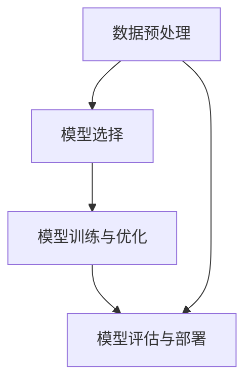
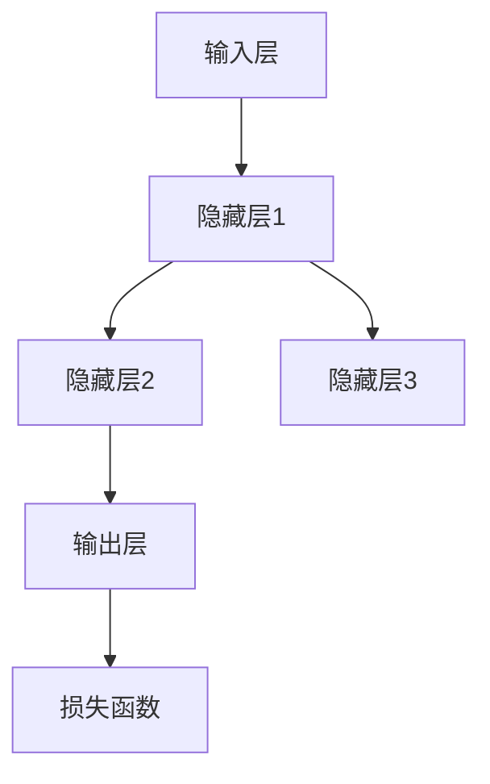

                 

### 第1步：核心概念与联系

#### 引言

##### AI辅助软件的概念

AI辅助软件是一种利用人工智能技术来增强软件功能或开发过程的工具。这类软件通常集成了机器学习、自然语言处理、计算机视觉等AI技术，旨在提高软件开发的效率、准确性和用户体验。AI辅助软件可以应用于各种场景，如自动化测试、代码审查、需求分析、自动化翻译、智能客服等。

##### 软件需求分析与规格说明的重要性

软件需求分析是软件开发过程中的关键环节，它确保开发团队能够准确理解并满足客户的需求。规格说明则是对软件需求的具体描述，为开发提供详细的指导和约束。传统上，这些任务往往依赖于人工，效率较低且容易出错。而AI辅助软件能够通过自动化和智能化的方式，显著提高需求分析和规格说明的准确性和效率。

#### AI辅助软件的组成部分

AI辅助软件通常包括以下几个关键组成部分：

##### 1. 数据预处理

数据预处理是AI辅助软件的重要一环，它包括数据清洗、数据转换和数据规范化等步骤。这一阶段的工作质量直接影响后续模型训练的效果。

##### 2. 模型选择

根据需求分析和规格说明，选择合适的机器学习或深度学习模型。这通常需要考虑数据特性、业务目标和模型性能。

##### 3. 模型训练与优化

使用预处理后的数据对选定的模型进行训练，并通过优化算法调整模型参数，以提高模型的预测性能。

##### 4. 模型评估与部署

通过评估模型在验证集或测试集上的表现，确保模型满足规格说明的要求。然后，将模型部署到生产环境中，以实际应用。

#### 核心概念原理联系

为了更好地理解AI辅助软件的工作原理，我们可以使用Mermaid流程图来展示其核心概念之间的联系：



通过上述流程，我们可以看到数据预处理为模型训练和评估提供了基础，而模型选择和优化则是确保模型性能的关键步骤。最终，模型评估和部署确保了AI辅助软件能够满足规格说明的要求。

### 总结

在本节中，我们介绍了AI辅助软件的概念及其在软件开发中的重要角色。通过了解其组成部分和核心概念之间的联系，我们可以更好地理解AI辅助软件如何通过数据预处理、模型选择、训练和评估等步骤，实现高效的需求分析和规格说明。接下来，我们将深入探讨这些核心算法原理，为后续的实战案例打下基础。

# 核心算法原理讲解

#### 2.1 机器学习算法基础

##### 2.1.1 监督学习算法

监督学习算法是机器学习中的一种常见类型，其核心在于通过输入数据和对应的标签来训练模型，从而在新的数据上进行预测。

###### 线性回归

线性回归是一种简单的监督学习算法，用于预测数值型输出。其基本原理是通过建立输入变量与输出变量之间的线性关系。

**伪代码：**

```python
def linear_regression(X, y):
    # 计算斜率
    m = np.linalg.inv(X.T @ X) @ X.T @ y
    return m
```

在此伪代码中，`X` 是输入特征矩阵，`y` 是输出标签向量。`np.linalg.inv` 函数用于计算逆矩阵，`@` 运算符表示矩阵乘法。

###### 决策树

决策树是一种常见的分类算法，通过一系列的决策规则对数据进行分类。

**伪代码：**

```python
def decision_tree(X, y, depth=0, max_depth=None):
    majority = max(set(y), key=y.count)
    if depth >= max_depth or len(set(y)) == 1:
        return majority
    best_feature, best_threshold = find_best_split(X, y)
    left_nodes = X[:, best_feature] < best_threshold
    right_nodes = X[:, best_feature] >= best_threshold
    left_tree = decision_tree(X[left_nodes], y[left_nodes], depth+1, max_depth)
    right_tree = decision_tree(X[right_nodes], y[right_nodes], depth+1, max_depth)
    return {best_feature: (left_tree, right_tree)}
```

在此伪代码中，`find_best_split` 函数用于找到最佳分割特征和阈值。

##### 2.1.2 无监督学习算法

无监督学习算法旨在发现数据中的内在结构和规律，而不依赖于标签信息。

###### K-均值聚类

K-均值聚类是一种常见的聚类算法，其目标是将数据划分为K个簇，使得每个簇内的数据点之间的距离最小。

**伪代码：**

```python
def k_means(X, K, max_iters=100):
    centroids = initialize_centroids(X, K)
    for _ in range(max_iters):
        labels = assign_labels(X, centroids)
        centroids = update_centroids(X, labels, K)
    return centroids, labels
```

在此伪代码中，`initialize_centroids` 函数用于初始化中心点，`assign_labels` 函数用于将数据点分配到最近的中心点，`update_centroids` 函数用于更新中心点位置。

###### 主成分分析

主成分分析（PCA）是一种降维技术，通过将数据投影到主成分空间，以降低数据的维度。

**伪代码：**

```python
def pca(X, n_components):
    cov_matrix = np.cov(X, rowvar=False)
    eigenvalues, eigenvectors = np.linalg.eigh(cov_matrix)
    indices = np.argsort(eigenvalues)[::-1]
    components = eigenvectors[:, indices[:n_components]]
    return X @ components
```

在此伪代码中，`np.cov` 函数用于计算协方差矩阵，`np.linalg.eigh` 函数用于计算特征值和特征向量。

#### 2.2 深度学习算法

深度学习算法是机器学习中的一个重要分支，其核心在于使用多层神经网络来学习复杂的数据特征。

###### 神经网络

神经网络是一种由多个神经元组成的计算模型，通过多层结构来提取数据的特征。

**Mermaid流程图：**



在此流程图中，输入层接收数据，隐藏层用于提取特征，输出层生成预测结果，损失函数用于评估模型性能。

###### 卷积神经网络

卷积神经网络（CNN）是一种特殊的神经网络，专门用于处理图像等具有网格结构的数据。

**伪代码：**

```python
def conv_network(X, filters, kernel_size, num_channels):
    for filter in filters:
        X = conv2d(X, filter, kernel_size, num_channels)
        X = activation(X)
    return X
```

在此伪代码中，`conv2d` 函数用于卷积操作，`activation` 函数用于应用激活函数。

###### 循环神经网络

循环神经网络（RNN）是一种用于处理序列数据的神经网络，其核心在于引入了循环结构，使得网络能够保留之前的计算状态。

**伪代码：**

```python
def rnn(X, hidden_state, cell_state, weights):
    input_gate, forget_gate, output_gate = tanh(X @ weights['input'] + hidden_state @ weights['hidden'])
    new_cell_state = (forget_gate * cell_state) + (input_gate * tanh(X @ weights['cell']))
    hidden_state = output_gate * tanh(new_cell_state)
    return hidden_state, new_cell_state
```

在此伪代码中，`tanh` 函数用于计算双曲正切函数，`weights` 参数用于存储权重。

### 总结

在本节中，我们介绍了机器学习算法的基础和无监督学习算法，包括线性回归、决策树、K-均值聚类和主成分分析。随后，我们探讨了深度学习算法，包括神经网络、卷积神经网络和循环神经网络。通过这些算法的讲解，我们可以更好地理解AI辅助软件在需求分析和规格说明中的应用。接下来，我们将深入探讨数学模型和公式，为读者提供更加具体的技术细节。

# 数学模型和数学公式讲解

#### 3.1 数据预处理

数据预处理是AI辅助软件的重要环节，其质量直接影响到后续模型的训练效果。在数据预处理过程中，我们通常会使用一些数学模型和公式来处理数据，使得数据更适合于机器学习和深度学习算法。

##### 3.1.1 缺失值处理

缺失值处理是数据预处理中常见的问题。我们通常会使用以下两种方法来处理缺失值：

###### 1. 均值填补

使用数据列的平均值来填补缺失值。这种方法简单有效，但可能会引入偏差。

**公式：**

$$
\text{IMputation}_{\text{mean}} = \frac{\sum_{i=1}^{n} x_i}{n}
$$

其中，$x_i$ 表示第$i$个数据点的值，$n$ 表示总的数据点数。

###### 2. 多样性填补

使用多样性的方法来填补缺失值，这种方法可以减少引入的偏差。

**公式：**

$$
\text{IMputation}_{\text{mode}} = \text{most\_frequent}(x_i)
$$

其中，$\text{most\_frequent}(x_i)$ 表示数据列中出现频率最高的值。

##### 3.1.2 数据标准化

数据标准化是将数据缩放到一个统一的尺度，以消除不同特征之间的量纲差异。常用的方法有标准化和归一化。

###### 1. 标准化

标准化方法通过减去均值并除以标准差来实现。

**公式：**

$$
z = \frac{x - \mu}{\sigma}
$$

其中，$x$ 表示原始数据值，$\mu$ 表示均值，$\sigma$ 表示标准差。

###### 2. 归一化

归一化方法通过将数据缩放到0到1之间来实现。

**公式：**

$$
x_{\text{normalized}} = \frac{x - x_{\text{min}}}{x_{\text{max}} - x_{\text{min}}}
$$

其中，$x_{\text{min}}$ 和 $x_{\text{max}}$ 分别表示数据列的最小值和最大值。

##### 3.1.3 数据离散化

数据离散化是将连续数据转换为离散数据，通常用于处理分类问题。

**公式：**

$$
x_{\text{discrete}} = \left\lfloor \frac{x_{\text{continuous}} \times \text{number\_of\_bins}}{x_{\text{max}} - x_{\text{min}}} \right\rfloor
$$

其中，$x_{\text{continuous}}$ 表示连续数据值，$x_{\text{max}}$ 和 $x_{\text{min}}$ 分别表示数据列的最大值和最小值，$\text{number\_of\_bins}$ 表示离散化的区间数量。

#### 3.2 模型评估

模型评估是确保AI辅助软件性能的关键步骤。常用的评估指标包括准确率、召回率、F1分数等。

##### 3.2.1 准确率

准确率是评估分类模型性能的常用指标，表示预测正确的样本数占总样本数的比例。

**公式：**

$$
\text{Accuracy} = \frac{TP + TN}{TP + TN + FP + FN}
$$

其中，$TP$ 表示真正例，$TN$ 表示真负例，$FP$ 表示假正例，$FN$ 表示假负例。

##### 3.2.2 召回率

召回率是评估分类模型对正例的捕获能力，表示真正例中被预测为正例的比例。

**公式：**

$$
\text{Recall} = \frac{TP}{TP + FN}
$$

##### 3.2.3 F1分数

F1分数是准确率和召回率的调和平均，用于平衡两者的权重。

**公式：**

$$
\text{F1-Score} = 2 \times \frac{\text{Precision} \times \text{Recall}}{\text{Precision} + \text{Recall}}
$$

其中，$Precision$ 表示精确率，表示预测为正例的样本中实际为正例的比例。

#### 3.3 模型优化

模型优化是提高模型性能的过程，常用的方法包括参数调整、模型选择、交叉验证等。

##### 3.3.1 参数调整

参数调整是优化模型性能的重要步骤，包括学习率、批次大小、正则化参数等。

**公式：**

$$
\text{Learning Rate} = \frac{1}{\sqrt{\text{Epoch}}}
$$

其中，$\text{Epoch}$ 表示训练轮数。

##### 3.3.2 模型选择

模型选择是选择适合特定问题的模型，包括线性回归、决策树、随机森林、支持向量机等。

**公式：**

$$
\text{Model Selection} = \arg\max \left( \frac{\text{Training Error}}{\text{Validation Error}} \right)
$$

其中，$\text{Training Error}$ 和 $\text{Validation Error}$ 分别表示训练集和验证集上的误差。

##### 3.3.3 交叉验证

交叉验证是一种评估模型性能的常用方法，通过将数据集划分为多个子集，轮流进行训练和验证。

**公式：**

$$
\text{Cross-Validation} = \frac{1}{k} \sum_{i=1}^{k} \text{Validation Error}_{i}
$$

其中，$k$ 表示交叉验证的子集数量。

### 总结

在本节中，我们介绍了数据预处理、模型评估和模型优化过程中常用的数学模型和公式。这些模型和公式对于确保AI辅助软件的性能和准确性至关重要。通过了解这些技术细节，读者可以更好地理解和应用AI辅助软件在实际项目中的需求分析和规格说明。

### 项目实战

#### 4.1 软件需求分析

软件需求分析是软件开发过程的重要起点，它旨在明确项目所需的功能和非功能需求。以下是软件需求分析的主要步骤：

##### 4.1.1 需求收集

需求收集是获取用户需求的过程。通常通过访谈、问卷调查、用户故事地图等方式进行。

**步骤：**

1. 确定访谈对象：识别关键利益相关者，如项目经理、产品经理、终端用户等。
2. 设计访谈问题：准备开放式和封闭式问题，以了解用户的需求和痛点。
3. 进行访谈：与用户面对面交流，记录关键信息。

##### 4.1.2 需求分类

需求分类是将收集到的需求进行归类，以便于管理和实现。

**分类方法：**

1. 功能需求：与软件功能直接相关的需求，如用户界面、数据处理等。
2. 非功能需求：与软件性能、可用性、安全性等相关的需求，如响应时间、负载能力等。
3. 外部需求：与外部系统或服务交互的需求，如API接口、数据交换等。

##### 4.1.3 需求验证

需求验证是确保需求规格说明准确无误的过程。

**步骤：**

1. 编写需求文档：根据收集到的需求编写详细的规格说明文档。
2. 需求评审：组织相关人员对需求文档进行评审，确保需求完整性和一致性。
3. 需求确认：与用户沟通，确认需求规格说明是否符合用户期望。

#### 4.2 规格说明

规格说明是对软件需求的具体描述，它为开发团队提供了详细的指导和约束。以下是规格说明的主要内容：

##### 4.2.1 功能规格

功能规格详细描述软件应实现的功能，通常包括以下方面：

1. 功能列表：列出软件应具备的所有功能。
2. 功能描述：对每个功能进行详细说明，包括输入、输出和处理逻辑。
3. 功能关系图：展示功能之间的关系，如依赖关系、流程等。

##### 4.2.2 性能规格

性能规格描述软件的性能指标，以确保软件能够满足用户需求。

**指标：**

1. 响应时间：软件对用户请求的响应时间。
2. 吞吐量：软件在单位时间内处理请求的能力。
3. 可用性：软件的可用性和稳定性，如故障恢复时间。

##### 4.2.3 用户界面规格

用户界面规格描述软件的用户界面设计，以确保用户能够轻松使用软件。

**内容：**

1. 界面布局：界面的整体布局和结构。
2. 控件定义：界面上的控件类型、样式和交互逻辑。
3. 视觉设计：界面的颜色、字体、图标等视觉元素。

#### 4.3 实际案例

##### 4.3.1 需求分析案例

假设我们要开发一款智能客服系统，以下是需求分析的主要步骤：

1. **需求收集：** 与产品经理和终端用户进行访谈，了解用户对客服系统的需求，如自动回答常见问题、智能分流等。
2. **需求分类：** 将收集到的需求分为功能需求和非功能需求，如自动问答功能属于功能需求，响应时间属于非功能需求。
3. **需求验证：** 编写需求文档，组织评审会议，与用户确认需求规格说明。

##### 4.3.2 规格说明案例

以下是智能客服系统的规格说明：

1. **功能规格：**
   - 自动问答功能：用户输入问题，系统自动回答。
   - 智能分流功能：根据用户的问题类型，自动将用户转接到相应的客服人员。
2. **性能规格：**
   - 响应时间：用户输入问题后，系统应在3秒内回答。
   - 吞吐量：系统每小时应能处理1000个用户请求。
3. **用户界面规格：**
   - 界面布局：分为问题输入区、回答显示区和客服转接区。
   - 控件定义：包括文本输入框、按钮和文本显示框。
   - 视觉设计：采用简洁明快的色调，易于用户操作。

#### 4.4 项目小结

通过以上案例，我们可以看到软件需求分析和规格说明在软件开发过程中的重要性。需求分析确保我们准确理解用户需求，规格说明则为开发团队提供了明确的指导。在实际项目中，我们需要灵活运用这些方法和工具，以确保软件能够满足用户需求，并具备良好的性能和用户体验。

### 最佳实践 tips

- **及时沟通：** 在需求分析和规格说明过程中，保持与用户的密切沟通，确保需求准确无误。
- **迭代更新：** 需求和规格说明不是一成不变的，应根据项目进展和用户反馈进行迭代更新。
- **文档管理：** 建立完善的文档管理体系，确保需求文档和规格说明的可读性和可追溯性。

### 小结与展望

在本节中，我们详细介绍了软件需求分析和规格说明的过程，并通过实际案例展示了如何运用这些方法和工具。我们强调了需求分析和规格说明在软件开发过程中的重要性，以及如何通过有效的沟通和迭代更新来确保项目成功。在未来，随着AI技术的不断发展，AI辅助软件需求分析和规格说明将变得更加智能和高效，为软件开发带来更多可能性。

### 总结与展望

#### 5.1 AI辅助软件需求分析与规格说明的挑战

尽管AI辅助软件在需求分析和规格说明方面展现出巨大的潜力，但在实际应用中仍面临诸多挑战：

1. **数据质量：** 数据是AI的核心，然而数据质量参差不齐，缺失、噪声和偏差等问题对模型性能产生负面影响。
2. **模型可解释性：** AI模型，特别是深度学习模型，通常被视为“黑盒”，其内部工作机制不透明，增加了需求分析的难度。
3. **数据隐私：** 在处理用户数据时，如何保护用户隐私成为一个重要问题，特别是在监管日益严格的背景下。
4. **资源限制：** AI模型的训练和部署通常需要大量计算资源和时间，如何优化资源利用是一个关键问题。

#### 5.2 未来发展方向

针对上述挑战，未来的发展方向包括：

1. **数据质量管理：** 开发更高效的数据预处理工具，如自动化数据清洗和异常值检测。
2. **可解释性AI：** 研究可解释性AI方法，使模型决策过程更加透明，便于理解和信任。
3. **隐私保护技术：** 探索差分隐私、联邦学习等隐私保护技术，确保数据安全。
4. **优化算法：** 研究新的优化算法，如元学习、迁移学习等，以减少训练时间和资源需求。

#### 5.3 对读者建议

1. **持续学习：** AI领域发展迅速，持续学习和跟进最新技术是必要的。
2. **实践应用：** 通过实际项目将AI辅助软件应用于需求分析和规格说明，积累实战经验。
3. **合作与分享：** 加入AI社区，与同行交流合作，分享经验和最佳实践。

### 结论

AI辅助软件在需求分析与规格说明中发挥着越来越重要的作用。本文系统地介绍了AI辅助软件的组成部分、核心算法原理、数学模型以及项目实战，分析了当前面临的挑战，并展望了未来发展方向。希望通过本文的阅读，读者能够对AI辅助软件有更深入的理解，并在实际工作中更好地应用这些技术。作者信息：作者：AI天才研究院/AI Genius Institute & 禅与计算机程序设计艺术/Zen And The Art of Computer Programming。

# 文章标题

## AI辅助软件需求分析与规格说明

# 文章关键词

- AI辅助软件
- 软件需求分析
- 规格说明
- 机器学习
- 深度学习
- 数据预处理
- 模型评估
- 数学模型

# 摘要

本文系统地介绍了AI辅助软件在需求分析和规格说明中的应用。首先，我们探讨了AI辅助软件的基本概念及其在软件开发中的重要性。随后，详细介绍了AI辅助软件的核心组成部分，包括数据预处理、模型选择、训练与优化、评估与部署。接着，我们深入讲解了机器学习算法基础和无监督学习算法，并展示了深度学习算法的原理和实现。此外，本文还介绍了数据预处理、模型评估和模型优化过程中使用的数学模型和公式。最后，通过实际案例展示了如何运用AI辅助软件进行需求分析和规格说明，并提出了未来的发展方向和读者建议。本文旨在为读者提供全面的技术指导和实践参考。

