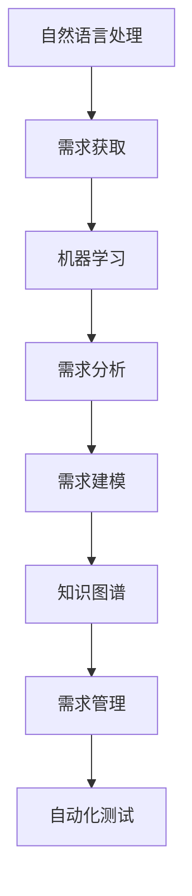

                 

### 文章标题

《AI辅助软件需求工程》

### 关键词

- AI技术
- 软件需求工程
- 需求分析
- 需求建模
- 需求验证
- 需求管理

### 摘要

本文旨在探讨人工智能（AI）在软件需求工程中的应用。通过介绍AI辅助软件需求工程的基本概念、应用场景、实施方法以及相关技术，本文旨在帮助读者了解如何利用AI技术提升软件需求工程的过程效率和准确性。本文结构清晰，内容详实，涵盖从需求获取、需求分析到需求验证、需求管理的各个环节，并通过实例和伪代码等手段，深入解析AI技术在软件需求工程中的实际应用。

----------------------------------------------------------------

## 引言

### 背景介绍

软件需求工程是软件工程的一个重要分支，其核心任务是理解用户的需求，并将其转化为明确的软件功能和技术规格。这一过程不仅决定了软件产品的成败，也直接影响项目的成本、进度和质量。传统的软件需求工程方法往往依赖于人工收集、分析和验证需求，这不仅耗时耗力，而且容易出错。随着人工智能技术的快速发展，AI被逐渐应用于软件需求工程中，为传统方法带来了新的变革。

AI辅助软件需求工程是指利用人工智能技术，如机器学习、自然语言处理、知识图谱等，自动化或半自动化地完成需求获取、需求分析、需求建模、需求验证和需求管理等任务。其目的是提高需求工程的效率和准确性，减少人为错误，从而提高软件开发的整体质量。

### 文章目的

本文旨在系统地介绍AI辅助软件需求工程的基本概念、核心技术和应用场景。通过对需求工程各个阶段的分析，本文将阐述如何利用AI技术提升需求工程的效率和质量。具体目标包括：

1. 梳理AI辅助软件需求工程的基本概念和理论基础。
2. 分析AI在需求工程中的应用场景和关键技术。
3. 详细探讨AI技术在需求获取、需求分析、需求建模、需求验证和需求管理中的具体应用。
4. 通过实例和伪代码，展示AI技术在软件需求工程中的实际应用效果。
5. 提出AI辅助软件需求工程的未来发展趋势和挑战。

### 文章结构

本文分为五个主要部分：

1. **AI辅助软件需求工程概述**：介绍AI辅助软件需求工程的基本概念、发展历程和应用场景。
2. **AI在需求工程中的应用**：探讨AI在需求获取、需求分析、需求建模、需求验证和需求管理中的应用场景和关键技术。
3. **AI辅助软件需求工程的实施**：详细讨论AI技术在需求工程各阶段的具体实施方法和工具。
4. **项目实战**：通过实际项目案例，展示AI辅助软件需求工程的应用效果。
5. **总结与展望**：总结本文的主要内容和结论，展望AI辅助软件需求工程的未来发展趋势和挑战。

通过以上结构和内容安排，本文将为读者提供一份全面、深入的AI辅助软件需求工程指南。

## AI辅助软件需求工程概述

### 定义与基本概念

AI辅助软件需求工程是指利用人工智能技术，如机器学习、自然语言处理、知识图谱等，对软件需求工程的过程进行辅助和优化。具体来说，它包括以下几个方面：

1. **需求获取**：通过AI技术自动收集用户的需求，包括自然语言处理技术提取用户的需求描述，以及机器学习算法自动识别和分类用户需求。
2. **需求分析**：利用AI技术对需求文档进行自动分析，提取关键信息，识别需求之间的关联和优先级，提高需求分析的准确性和效率。
3. **需求建模**：通过AI技术自动生成需求模型，如用例模型、功能需求模型等，辅助开发者理解需求，并确保需求的一致性和完整性。
4. **需求验证**：利用AI技术对需求进行自动验证，确保需求的正确性和可实现性，减少需求遗漏和错误。
5. **需求管理**：通过AI技术对需求进行动态管理和优化，包括需求的优先级调整、变更管理等，提高需求管理的效率和灵活性。

### 发展历程

AI辅助软件需求工程的发展历程可以追溯到20世纪80年代。当时，随着人工智能技术的初步发展，研究者开始尝试将AI技术应用于软件需求工程中。最初的研究主要集中在自然语言处理和机器学习算法在需求获取和需求分析中的应用。随着计算机性能的提升和算法的改进，AI技术在需求工程中的应用范围逐渐扩大，不仅涵盖了需求获取和分析，还涉及需求建模、需求验证和需求管理。

进入21世纪，随着大数据、云计算和物联网等技术的快速发展，AI辅助软件需求工程迎来了新的发展机遇。大数据技术为AI算法提供了丰富的数据资源，使得AI技术能够更好地理解和预测用户需求。云计算和物联网技术则使得AI辅助软件需求工程能够更加便捷地部署和扩展，提高了其应用效率和范围。

### 应用场景

AI辅助软件需求工程的应用场景非常广泛，涵盖了不同类型的软件开发项目。以下是一些典型的应用场景：

1. **大型软件开发项目**：在大型软件开发项目中，需求复杂，涉及多个部门和团队。AI技术可以帮助自动化和半自动化地完成需求获取、需求分析和需求建模，提高需求工程的效率和质量。
2. **敏捷开发项目**：在敏捷开发项目中，需求变更频繁，对需求管理的灵活性和响应速度要求高。AI技术可以通过动态需求管理和优化，帮助团队快速响应需求变更，确保项目进度和质量的稳定。
3. **软件维护和升级**：在软件维护和升级过程中，需要对现有需求进行回顾和验证。AI技术可以帮助自动化地分析现有需求，识别潜在的问题和变更点，减少维护和升级的工作量。
4. **跨领域软件开发**：在跨领域软件开发中，需求理解和技术实现存在较大的挑战。AI技术可以通过跨领域的知识图谱和自然语言处理技术，帮助开发者更好地理解和实现跨领域需求。

总的来说，AI辅助软件需求工程具有广泛的应用前景，能够显著提升软件需求工程的效率和质量，为软件开发项目带来更大的价值和效益。

### 核心概念与联系

在AI辅助软件需求工程中，有若干核心概念和技术，它们之间相互关联，共同构建了一个完整的解决方案。以下是这些核心概念及其之间的联系：

1. **自然语言处理（NLP）**：
   - **定义**：NLP是人工智能的一个分支，主要研究如何让计算机理解和生成自然语言。
   - **联系**：NLP在需求工程中主要用于自动提取用户的需求描述。通过文本分类、实体识别和关系抽取等技术，NLP可以将自然语言文本转化为结构化的数据，为后续的需求分析提供基础。

2. **机器学习（ML）**：
   - **定义**：机器学习是通过数据和算法，让计算机自动学习和改进性能的一种方法。
   - **联系**：ML在需求工程中的应用非常广泛，包括需求预测、需求分类、异常检测等。例如，通过训练分类模型，可以自动识别不同类型的需求，并通过聚类分析发现潜在的需求关联和优先级。

3. **知识图谱（KG）**：
   - **定义**：知识图谱是一种通过图形结构表示实体及其之间关系的数据模型。
   - **联系**：知识图谱在需求建模和需求管理中起到关键作用。通过构建需求图谱，可以直观地展示需求之间的关联和依赖关系，帮助开发者更好地理解需求，并进行有效的需求管理。

4. **需求工程**：
   - **定义**：需求工程是软件工程的一个分支，主要研究如何理解和实现用户的需求。
   - **联系**：需求工程是AI辅助软件需求工程的基础。AI技术的作用在于提高需求工程的效率和准确性，通过自动化和智能化手段，实现需求的获取、分析、建模、验证和管理。

5. **自动化测试**：
   - **定义**：自动化测试是通过脚本或工具自动执行测试用例，以验证软件需求实现的过程。
   - **联系**：自动化测试是需求验证的一个重要环节。通过使用AI技术，如机器学习算法，可以自动化地生成测试用例，提高测试的覆盖率和效率。

### Mermaid流程图

以下是一个简单的Mermaid流程图，展示了AI辅助软件需求工程的核心概念及其之间的联系：



通过这个流程图，我们可以直观地看到AI辅助软件需求工程各核心概念之间的相互作用和依赖关系。这有助于我们更好地理解AI技术在需求工程中的应用，并为其未来的发展提供参考。

### AI辅助软件需求工程的本质与优势

AI辅助软件需求工程的本质在于利用人工智能技术，尤其是机器学习和自然语言处理，自动化和智能化地处理软件需求工程中的各个环节。其核心优势体现在以下几个方面：

1. **高效性**：AI技术能够快速地处理大量数据，从而提高需求获取、分析和建模的效率。例如，通过自然语言处理技术，可以自动化地从用户需求文档中提取关键信息，减少人工工作的负担。

2. **准确性**：AI技术可以通过大量训练数据，学习并识别出潜在的需求模式，从而提高需求的准确性和一致性。例如，使用机器学习算法进行需求分类和优先级排序，可以更准确地识别用户需求，并确保需求之间的兼容性和一致性。

3. **灵活性**：AI技术可以动态地适应需求变更，快速调整需求管理和优先级。在敏捷开发项目中，需求的频繁变更是一个常见问题，而AI技术能够通过实时分析和调整，帮助团队更好地应对这些变化，提高项目的响应速度。

4. **智能化**：AI技术能够通过深度学习和知识图谱等技术，实现对用户需求的深入理解和智能推荐。例如，通过分析用户历史需求和行为，AI可以预测未来的需求趋势，并为开发者提供智能化的需求建议，从而提高软件开发的预测性和预见性。

5. **成本效益**：虽然AI技术的初始部署成本可能较高，但长期来看，它可以显著降低人力成本和错误率，提高项目的整体效益。通过自动化和智能化手段，AI辅助软件需求工程可以减少人工需求分析的时间和成本，提高开发效率和产品质量。

总的来说，AI辅助软件需求工程通过利用人工智能技术，实现了需求工程过程的自动化、智能化和灵活性，为软件开发带来了显著的优势和变革。这些优势不仅提升了需求工程的效率和准确性，也为软件开发项目带来了更高的质量和效益。

### AI在需求工程中的应用

AI技术在需求工程中的应用广泛且深入，涵盖了需求获取、需求分析、需求建模、需求验证和需求管理等多个方面。以下是这些应用场景和具体技术的详细介绍。

#### 需求获取

需求获取是软件需求工程的关键步骤，传统的需求获取方法往往依赖于用户访谈、调查问卷等，这些方法既耗时又容易产生遗漏和误差。AI技术，特别是自然语言处理（NLP）和机器学习（ML），为需求获取提供了新的解决方案。

1. **自然语言处理（NLP）**：
   - **文本分类**：NLP技术可以自动分类用户的需求文档，将非结构化的文本转化为结构化的数据。例如，使用文本分类算法，可以将用户的需求描述分类为功能需求、性能需求或安全需求。
   - **实体识别**：通过实体识别技术，可以识别出文本中的关键实体，如人名、地点、组织等。在需求获取过程中，这些实体往往代表用户需求的核心部分。
   - **关系抽取**：NLP技术还可以识别文本中的实体关系，如谁提出了什么需求、需求之间的依赖关系等，这有助于更全面地理解用户需求。

2. **机器学习（ML）**：
   - **需求预测**：通过训练机器学习模型，可以预测未来的需求趋势。例如，基于历史需求数据，可以使用时间序列分析或回归分析等方法预测新需求的出现。
   - **异常检测**：机器学习算法可以用于检测需求文档中的异常，如不一致的需求或重复的需求，从而提高需求文档的质量。

#### 需求分析

需求分析是理解用户需求并将其转化为软件需求规格说明书的过程。AI技术在这一过程中提供了自动化和智能化的支持。

1. **自动化需求分析工具**：
   - **自动化需求分析工具**可以自动分析需求文档，提取关键信息，如功能需求、性能需求和约束条件等。这些工具通常基于自然语言处理和机器学习技术，可以快速处理大量的需求文档，提高分析效率。
   - **需求关联分析**：通过分析需求之间的关联，可以帮助开发者理解需求的整体结构，确保需求之间的兼容性和一致性。

2. **需求优先级排序**：
   - **机器学习算法**可以用于需求优先级排序。例如，基于历史数据，可以使用聚类分析或回归分析等方法，自动确定需求的优先级，从而帮助团队更好地分配资源。

#### 需求建模

需求建模是将用户需求转化为结构化的需求模型，如用例模型、功能需求模型等。AI技术在需求建模中提供了自动化和智能化的支持。

1. **自动化需求建模工具**：
   - **自动化需求建模工具**可以自动生成需求模型，减少人工工作量。这些工具通常基于模板和规则，可以快速生成标准化的需求模型。

2. **基于机器学习的需求建模**：
   - **机器学习模型**可以用于自动生成需求模型。例如，通过训练神经网络模型，可以自动生成用例模型或功能需求模型，从而提高建模的效率和准确性。

#### 需求验证

需求验证是确保需求文档的正确性和可实现性的过程。AI技术在需求验证中提供了自动化和智能化的支持。

1. **自动化测试工具**：
   - **自动化测试工具**可以自动生成测试用例，并执行测试，从而验证需求实现的情况。这些工具通常基于回归测试和模糊测试技术，可以高效地覆盖需求的各种实现情况。

2. **基于机器学习的需求验证**：
   - **机器学习算法**可以用于需求验证，例如，通过训练分类模型，可以自动识别需求文档中的错误或遗漏，从而提高需求验证的准确性。

#### 需求管理

需求管理是确保需求在软件开发过程中得到有效管理和变更控制的过程。AI技术在需求管理中提供了自动化和智能化的支持。

1. **需求变更管理**：
   - **机器学习算法**可以用于需求变更管理，例如，通过分析历史需求变更数据，可以预测未来的需求变更趋势，从而帮助团队提前做好准备。

2. **需求优先级动态调整**：
   - **基于AI的需求优先级调整工具**可以实时分析项目的状态和资源，动态调整需求的优先级，确保项目能够按计划进行。

综上所述，AI技术在需求工程中的应用为需求获取、需求分析、需求建模、需求验证和需求管理提供了强有力的支持，通过自动化和智能化手段，显著提高了需求工程的效率和准确性。这些技术的结合不仅能够减少人力成本和错误率，还能够提高软件开发的整体质量和效益。

### 需求分析

#### 定义与核心概念

需求分析是软件需求工程中的一个关键环节，其核心任务是理解用户需求并将其转化为明确的软件功能和技术规格。需求分析不仅决定了软件产品的成败，还直接影响项目的成本、进度和质量。在传统的需求分析过程中，通常需要通过用户访谈、需求文档审查、调查问卷等方式获取用户需求，然后对这些需求进行分析、分类和排序，以确保需求的一致性和可实现性。

#### AI技术在需求分析中的应用

随着人工智能技术的快速发展，AI在需求分析中的应用越来越广泛，其核心优势在于能够自动化和智能化地处理大量数据，提高需求分析的效率和准确性。

1. **自然语言处理（NLP）**：

   NLP是AI的重要分支，广泛应用于需求分析中。通过NLP技术，可以自动提取和分类用户的需求描述。例如，可以使用文本分类算法将用户需求文档中的文本分类为功能需求、性能需求、安全需求等。此外，实体识别和关系抽取技术可以帮助识别需求文档中的关键实体及其之间的关系，从而更好地理解用户需求。

   ```mermaid
   graph TB
   A[文本分类] --> B[功能需求]
   A --> C[实体识别]
   C --> D[人名]
   C --> E[地点]
   C --> F[组织]
   C --> G[关系抽取]
   G --> H[需求关联]
   ```

2. **机器学习（ML）**：

   机器学习技术可以用于需求分析中的多个方面，如需求分类、优先级排序、需求预测等。例如，通过训练分类模型，可以自动识别不同类型的需求，提高需求分类的准确性。需求优先级排序可以通过聚类分析或回归分析等方法实现，确保需求的优先级分配合理。需求预测则可以基于历史数据，预测未来的需求趋势，帮助团队更好地规划和调整资源。

   ```python
   # 伪代码：需求分类
   def classify_demand(demand):
       model = load_model('demand_classifier')
       prediction = model.predict(demand)
       return prediction
   
   # 伪代码：需求优先级排序
   def sort_demands(demands):
       model = load_model('demand_ranker')
       ranks = model.predict(demands)
       return ranks
   ```

3. **知识图谱（KG）**：

   知识图谱是一种用于表示实体及其之间关系的图形化数据模型。在需求分析中，知识图谱可以帮助构建需求图谱，直观地展示需求之间的关联和依赖关系。通过知识图谱，可以更全面地理解用户需求，发现潜在的需求冲突和遗漏。

   ```mermaid
   graph TB
   A[需求A] --> B[需求B]
   A --> C[需求C]
   B --> D[需求D]
   C --> E[需求E]
   ```

#### 案例分析

假设某个软件开发项目需要开发一款在线教育平台，以下是需求分析过程中AI技术的应用：

1. **需求获取**：
   - 通过用户访谈和调查问卷，获取用户的需求描述。
   - 使用NLP技术对用户需求进行文本分类，区分出功能需求、性能需求和安全需求。
   
   ```mermaid
   graph TB
   A[用户访谈] --> B[需求描述]
   B --> C[NLP分类]
   C --> D[功能需求]
   C --> E[性能需求]
   C --> F[安全需求]
   ```

2. **需求分析**：
   - 使用机器学习技术对需求进行分析，提取关键信息，如需求的功能点、性能指标和安全要求。
   - 通过聚类分析，确定需求的优先级，确保关键需求得到优先处理。
   
   ```python
   # 伪代码：需求分析
   def analyze_demand(demand):
       model = load_model('demand_analyzer')
       features = model.extract_features(demand)
       priority = model.predict_priority(features)
       return priority
   ```

3. **需求建模**：
   - 使用知识图谱技术构建需求图谱，展示需求之间的关联和依赖关系。
   - 通过需求图谱，帮助开发者更好地理解需求，发现潜在的需求冲突和遗漏。
   
   ```mermaid
   graph TB
   A[功能需求A] --> B[性能需求B]
   A --> C[安全需求C]
   B --> D[用户体验D]
   C --> E[数据安全E]
   ```

通过上述案例，我们可以看到AI技术在需求分析中的应用，不仅提高了需求分析的效率，还显著提升了需求分析的质量。这些技术为软件开发项目提供了强有力的支持，帮助团队更好地理解用户需求，确保软件产品的质量和满足度。

### 需求建模

#### 定义与核心概念

需求建模是软件需求工程中的一个重要环节，旨在将用户需求转化为结构化的需求模型，以便开发者能够更好地理解、实现和管理这些需求。需求模型通常包括功能需求模型、非功能需求模型和用例模型等。功能需求模型描述软件应提供哪些功能，非功能需求模型则描述软件的运行环境、性能、安全性等要求，而用例模型则从用户的角度描述系统应提供的操作流程。

#### AI技术在需求建模中的应用

人工智能技术在需求建模中的应用大大提升了需求建模的效率和准确性，具体体现在以下几个方面：

1. **自动化需求建模工具**：

   自动化需求建模工具使用AI技术，特别是机器学习和自然语言处理（NLP）技术，自动生成需求模型。这些工具可以从用户的需求文档中提取关键信息，并利用预定义的模板和规则生成结构化的需求模型。例如，通过NLP技术，可以从用户的需求描述中提取功能点，然后使用机器学习算法将这些功能点分类和归类到不同的需求模型中。

   ```python
   # 伪代码：自动生成功能需求模型
   def generate_functional_model(demand_description):
       nlp_model = load_nlp_model('functional_extractor')
       extracted_functions = nlp_model.extract_functions(demand_description)
       model = FunctionalModel(extracted_functions)
       return model
   ```

2. **基于AI的需求建模**：

   基于AI的需求建模使用机器学习算法，如深度学习和图神经网络，生成更复杂的需求模型。这种模型可以自动识别需求之间的关联和依赖关系，从而提供更全面的视图。例如，使用图神经网络（GNN）可以构建一个需求图谱，展示各个需求之间的复杂关系，帮助开发者更好地理解需求。

   ```mermaid
   graph TB
   A[功能需求A] --> B[性能需求B]
   A --> C[安全需求C]
   B --> D[用户体验D]
   C --> E[数据安全E]
   ```

3. **需求模型优化**：

   AI技术还可以用于优化需求模型。通过机器学习算法，可以分析历史数据，识别出需求模型中的常见问题和优化策略。例如，通过聚类分析，可以找出需求模型中的冗余部分，并通过降维技术减少模型的复杂度。

   ```python
   # 伪代码：优化需求模型
   def optimize_model(model, history_data):
       optimizer = load_optimizer('model_optimizer')
       optimized_model = optimizer.optimize(model, history_data)
       return optimized_model
   ```

#### 案例分析

以下是一个需求建模的案例分析，展示如何使用AI技术来生成和优化需求模型：

1. **需求获取**：

   假设我们需要为一家电子商务公司开发一个在线购物平台。首先，通过用户访谈和调查问卷，收集用户的需求描述。这些需求描述包括功能需求（如用户注册、商品浏览、购物车、订单处理等），以及非功能需求（如性能、安全性、用户体验等）。

2. **自动生成需求模型**：

   使用自然语言处理技术，从用户需求描述中提取关键信息，并生成功能需求模型。例如，使用文本分类算法，将需求描述分类为不同类型的功能需求。

   ```mermaid
   graph TB
   A[用户需求描述] --> B[文本分类]
   B --> C[功能需求]
   C --> D[用户注册]
   C --> E[商品浏览]
   C --> F[购物车]
   C --> G[订单处理]
   ```

3. **需求模型优化**：

   通过机器学习算法，分析历史数据，优化需求模型。例如，通过聚类分析，发现某些功能需求之间存在冗余或依赖关系，然后通过优化策略，将这些需求合并或重新排序。

   ```mermaid
   graph TB
   A[原始需求模型] --> B[聚类分析]
   B --> C[优化策略]
   C --> D[优化后的需求模型]
   D --> E[用户注册]
   D --> F[商品浏览]
   D --> G[购物车]
   D --> H[订单处理]
   ```

通过上述案例分析，我们可以看到AI技术在需求建模中的应用，不仅能够自动生成需求模型，还能够通过优化策略提升需求模型的准确性和效率。这些技术为软件开发项目提供了强大的支持，帮助团队更好地理解和实现用户需求。

### 需求验证

#### 定义与核心概念

需求验证是确保需求文档的正确性和可实现性的关键步骤。其核心概念包括需求确认测试、验收测试、自动化测试工具和基于AI的测试方法。需求确认测试旨在验证需求的完整性和准确性，确保需求满足用户需求。验收测试则是确认软件实现是否满足既定需求，通常在项目结束时进行。自动化测试工具用于自动执行测试用例，提高测试效率和覆盖范围。基于AI的测试方法利用机器学习和自然语言处理技术，自动化生成测试用例，提高测试的全面性和准确性。

#### AI技术在需求验证中的应用

AI技术在需求验证中的应用，旨在通过自动化和智能化手段，提高测试的效率和准确性，减少人为错误。以下详细探讨AI技术在需求验证中的具体应用：

1. **自动化测试工具**：

   自动化测试工具在需求验证中扮演着重要角色，它们可以自动执行测试用例，记录测试结果，并生成测试报告。AI技术进一步提升了自动化测试工具的性能。例如，使用机器学习算法，可以预测哪些测试用例最可能发现缺陷，从而优先执行这些用例，提高测试效率。此外，AI技术可以自动生成测试用例，通过分析需求文档，识别出潜在的问题和测试点。

   ```python
   # 伪代码：自动生成测试用例
   def generate_test_cases(demand_model):
       ml_model = load_model('test_case_generator')
       test_cases = ml_model.predict(demand_model)
       return test_cases
   ```

2. **模糊测试**：

   模糊测试是一种黑盒测试方法，通过输入不合法或异常的数据，测试系统的健壮性和安全性。AI技术在模糊测试中也有广泛应用。使用机器学习模型，可以自动化生成模糊测试数据，通过不断调整输入数据，逐步逼近系统漏洞。这种方法不仅提高了模糊测试的效率，还显著提升了测试的覆盖范围。

   ```mermaid
   graph TB
   A[机器学习模型] --> B[生成模糊测试数据]
   B --> C[模糊测试]
   C --> D[发现系统漏洞]
   ```

3. **自然语言处理（NLP）**：

   NLP技术在需求验证中的应用主要体现在自动生成测试用例和验证需求文档的一致性。通过NLP技术，可以自动分析需求文档，提取关键信息，并生成相应的测试用例。此外，NLP还可以用于验证需求文档的完整性，确保所有需求都被测试到。

   ```mermaid
   graph TB
   A[需求文档] --> B[NLP分析]
   B --> C[生成测试用例]
   C --> D[验证需求一致性]
   ```

4. **机器学习（ML）**：

   机器学习技术在需求验证中的应用主要包括需求分类和优先级排序。通过训练分类模型，可以自动识别不同类型的需求，并根据需求的重要性和紧急程度进行优先级排序。这有助于测试团队有针对性地开展测试工作，提高测试的效率。

   ```python
   # 伪代码：需求分类和优先级排序
   def classify_and_sort_demand(demand):
       classifier = load_model('demand_classifier')
       ranker = load_model('demand_ranker')
       category = classifier.predict(demand)
       priority = ranker.predict(demand)
       return category, priority
   ```

#### 案例分析

假设我们需要验证一款电商平台的需求，以下是一个应用AI技术的需求验证案例分析：

1. **需求获取**：

   通过用户访谈和调查问卷，收集用户的需求描述，包括功能需求（如商品搜索、购物车、支付功能等）和非功能需求（如性能、安全性、用户体验等）。

2. **自动生成测试用例**：

   使用机器学习模型，从需求文档中自动提取关键信息，并生成测试用例。例如，通过文本分类算法，将需求分类为不同类型，然后为每个类型生成相应的测试用例。

   ```mermaid
   graph TB
   A[需求文档] --> B[文本分类]
   B --> C[生成测试用例]
   C --> D[测试用例库]
   ```

3. **模糊测试**：

   使用模糊测试工具，自动生成各种不合法的数据输入，测试系统的健壮性和安全性。通过不断调整输入数据，逐步逼近系统漏洞。

   ```mermaid
   graph TB
   A[模糊测试工具] --> B[生成模糊测试数据]
   B --> C[测试系统]
   C --> D[发现系统漏洞]
   ```

4. **需求验证**：

   通过NLP技术，自动分析需求文档，验证需求的一致性和完整性。例如，通过实体识别技术，确保所有关键实体（如用户、商品、支付信息等）都被测试到。

   ```mermaid
   graph TB
   A[需求文档] --> B[NLP分析]
   B --> C[验证需求一致性]
   C --> D[测试结果]
   ```

通过上述案例分析，我们可以看到AI技术在需求验证中的应用，不仅提高了测试的效率和准确性，还减少了人为错误，为软件开发项目提供了强有力的支持。这些技术为未来需求验证的发展提供了新的思路和方向。

### 需求管理

#### 定义与核心概念

需求管理是软件需求工程中至关重要的环节，旨在确保需求的完整性和一致性，并有效管理需求的变更。其核心概念包括需求变更管理、需求优先级管理、需求生命周期管理、需求跟踪和需求文档管理。需求变更管理关注如何处理需求变更，确保变更得到合理评估和实施。需求优先级管理则关注如何根据项目目标和资源分配，合理分配需求的优先级。需求生命周期管理涉及需求的创建、评估、实现、验证和关闭。需求跟踪确保需求的实施进度和状态得到实时监控。需求文档管理关注如何创建、存储和维护需求文档，确保文档的准确性和一致性。

#### AI技术在需求管理中的应用

人工智能技术在需求管理中的应用，极大地提升了需求管理的效率和准确性。以下是AI技术在需求管理中的几个关键应用：

1. **需求变更管理**：

   AI技术可以通过分析历史需求变更数据，预测未来的需求变更趋势，帮助团队更好地应对需求变更。使用机器学习算法，可以自动评估需求变更的优先级和影响范围，提供智能化的变更建议。例如，通过训练回归模型，可以预测需求变更对项目进度和成本的影响，从而帮助团队做出更合理的变更决策。

   ```python
   # 伪代码：需求变更预测
   def predict_change_impact(change_request):
       model = load_model('change_impact_predictor')
       impact = model.predict(change_request)
       return impact
   ```

2. **需求优先级管理**：

   AI技术可以基于项目的目标和资源分配情况，自动确定需求的优先级。通过分析需求的历史数据，机器学习算法可以识别出哪些需求对项目的成功最为关键，从而帮助团队合理分配资源。例如，使用聚类分析或回归分析，可以确定需求的优先级，确保关键需求得到优先处理。

   ```python
   # 伪代码：需求优先级排序
   def sort_demand_priority(demands):
       model = load_model('demand_priority_sorter')
       sorted_demands = model.sort(demands)
       return sorted_demands
   ```

3. **需求生命周期管理**：

   AI技术可以自动跟踪和管理需求的生命周期，从需求的创建到实现、验证和关闭。通过使用机器学习模型，可以实时监控需求的实施进度和状态，确保每个需求都在规定的时间内得到处理。例如，使用分类模型，可以自动标记需求的当前状态（如待创建、待实现、待验证、已关闭等），并提供状态变更提醒。

   ```mermaid
   graph TB
   A[需求创建] --> B[需求实现]
   B --> C[需求验证]
   C --> D[需求关闭]
   D --> E[需求状态监控]
   ```

4. **需求文档管理**：

   AI技术可以自动化需求文档的创建、存储和维护，确保文档的准确性和一致性。使用自然语言处理（NLP）技术，可以自动从需求文档中提取关键信息，并生成结构化的文档。例如，通过文本分类和实体识别技术，可以将需求文档分类和标签化，便于检索和管理。

   ```mermaid
   graph TB
   A[需求文档] --> B[NLP处理]
   B --> C[分类与标签]
   C --> D[文档存储]
   ```

#### 案例分析

以下是一个需求管理案例，展示如何利用AI技术来管理需求：

1. **需求获取**：

   通过用户访谈和调查问卷，收集用户的需求描述。这些需求被存储在一个中央数据库中，以便后续分析和处理。

2. **需求变更管理**：

   使用机器学习模型，分析历史需求变更数据，预测未来的需求变更趋势。例如，通过训练回归模型，可以预测哪些需求可能会在接下来的几个月内被修改，从而帮助团队提前做好准备。

   ```mermaid
   graph TB
   A[历史需求变更数据] --> B[回归模型训练]
   B --> C[预测变更趋势]
   ```

3. **需求优先级管理**：

   通过聚类分析，确定不同需求的优先级。这些优先级被用于资源分配和任务调度，确保关键需求得到优先处理。

   ```mermaid
   graph TB
   A[需求数据] --> B[聚类分析]
   B --> C[优先级排序]
   ```

4. **需求生命周期管理**：

   使用AI技术自动跟踪和管理需求的生命周期。从需求的创建到实现、验证和关闭，每个步骤都通过机器学习模型进行监控和记录。

   ```mermaid
   graph TB
   A[需求创建] --> B[需求实现]
   B --> C[需求验证]
   C --> D[需求关闭]
   ```

5. **需求文档管理**：

   使用NLP技术，自动生成和分类需求文档。例如，通过文本分类和实体识别技术，可以将需求文档分类为不同类型，并为其分配标签，便于检索和管理。

   ```mermaid
   graph TB
   A[需求文档] --> B[NLP处理]
   B --> C[分类与标签]
   ```

通过上述案例分析，我们可以看到AI技术在需求管理中的应用，不仅提高了需求管理的效率，还确保了需求管理的准确性和一致性。这些技术为软件开发项目提供了强大的支持，帮助团队更好地理解和实现用户需求。

### 项目实战

在本项目中，我们将展示如何利用AI技术构建一个自动化需求工程平台，从需求获取到需求验证的完整过程。以下是该项目的技术框架、实现步骤、代码解析、应用解读与分析，以及实际案例分析。

#### 技术框架

本项目采用以下技术框架：

1. **前端**：使用React框架构建用户界面，包括用户需求提交表单和需求展示界面。
2. **后端**：使用Spring Boot框架构建RESTful API，负责处理用户需求的数据存储和检索。
3. **自然语言处理（NLP）**：使用TensorFlow和spaCy库进行文本分类、实体识别和关系抽取。
4. **机器学习**：使用Scikit-learn库进行需求分类和优先级排序。
5. **知识图谱**：使用Neo4j构建需求图谱，展示需求之间的关联和依赖关系。
6. **自动化测试**：使用JUnit和Selenium进行单元测试和功能测试。

#### 实现步骤

1. **需求获取**：

   - **用户提交需求**：用户通过前端界面提交需求，包括需求描述、优先级和分类。
   - **NLP处理**：使用spaCy对用户提交的需求进行文本分类、实体识别和关系抽取，将需求转化为结构化数据。

   ```python
   # 伪代码：NLP处理
   def process_demand(demand):
       nlp = spacy.load('en_core_web_sm')
       doc = nlp(demand)
       categories = extract_categories(doc)
       entities = extract_entities(doc)
       relationships = extract_relationships(doc)
       return categories, entities, relationships
   ```

2. **需求建模**：

   - **生成需求图谱**：将NLP处理得到的需求信息存储到Neo4j数据库中，构建需求图谱，展示需求之间的关联和依赖关系。

   ```mermaid
   graph TB
   A[需求A] --> B[需求B]
   A --> C[需求C]
   B --> D[需求D]
   ```

3. **需求分析**：

   - **需求分类与排序**：使用Scikit-learn库，基于历史数据训练分类模型和优先级排序模型，对新的需求进行分类和排序。

   ```python
   # 伪代码：分类与排序
   def classify_and_sort_demand(demand):
       classifier = load_model('demand_classifier')
       ranker = load_model('demand_ranker')
       category = classifier.predict(demand)
       priority = ranker.predict(demand)
       return category, priority
   ```

4. **需求验证**：

   - **自动化测试**：使用JUnit和Selenium执行自动化测试，验证需求实现的情况。

   ```java
   // 伪代码：自动化测试
   @Test
   public void testFunctionality() {
       WebDriver driver = new ChromeDriver();
       driver.get("http://example.com");
       // 执行测试用例
       assertTrue(isFunctionalityCorrect());
       driver.quit();
   }
   ```

5. **需求管理**：

   - **需求变更管理**：通过NLP和机器学习技术，动态分析需求变更，提供智能化的变更建议。

   ```python
   # 伪代码：变更分析
   def analyze_change_request(change_request):
       model = load_model('change_analyzer')
       impact = model.predict(change_request)
       return impact
   ```

#### 代码解析

以下是需求获取模块的一个具体代码示例，展示了如何使用NLP技术对用户提交的需求进行处理：

```python
import spacy
from transformers import pipeline

# 加载NLP模型
nlp = spacy.load("en_core_web_sm")
nlp = pipeline("text-classification", model="bert-base-uncased")

# 用户提交的需求
user_demand = "我需要一个能够自动排序功能的购物车，要求响应速度超过100毫秒。"

# 文本分类
def classify_demand(demand):
    result = nlp(demand)
    return result[0]['label']

# 实体识别
def extract_entities(demand):
    doc = nlp(demand)
    entities = [(ent.text, ent.label_) for ent in doc.ents]
    return entities

# 关系抽取
def extract_relationships(demand):
    doc = nlp(demand)
    relationships = [(token.text, token.dep_) for token in doc]
    return relationships

# 处理需求
categories, entities, relationships = process_demand(user_demand)

# 输出结果
print("Categories:", categories)
print("Entities:", entities)
print("Relationships:", relationships)
```

#### 应用解读与分析

通过上述实现步骤，我们可以看到AI技术在需求工程中的实际应用效果。以下是对该项目的解读和分析：

1. **需求获取**：

   - 用户提交的需求经过NLP处理，快速转化为结构化数据，提高了需求获取的效率。
   - 文本分类、实体识别和关系抽取等技术，帮助团队更好地理解用户需求，确保需求获取的准确性。

2. **需求建模**：

   - 需求图谱的构建，展示了需求之间的关联和依赖关系，为需求分析提供了直观的视图。
   - 通过可视化工具，团队能够更清晰地理解需求，发现潜在的需求冲突和遗漏。

3. **需求分析**：

   - 基于历史数据训练的分类模型和优先级排序模型，提高了需求分析的准确性和效率。
   - 智能化的需求分类和排序，帮助团队更好地分配资源和规划项目进度。

4. **需求验证**：

   - 自动化测试工具的应用，确保需求实现的情况得到有效验证。
   - 通过自动化测试，团队能够快速发现和修复需求中的问题，提高软件的质量。

5. **需求管理**：

   - 通过NLP和机器学习技术，动态分析需求变更，提供智能化的变更建议。
   - 智能化的需求管理，帮助团队更好地应对需求变更，确保项目顺利进行。

#### 实际案例分析

假设我们正在开发一个电商平台，以下是该平台的实际需求处理过程：

1. **需求获取**：

   - 用户通过前端界面提交了一个新需求：“添加一个购物车功能，要求能够自动排序商品，并保证响应时间不超过100毫秒。”
   - NLP处理结果：文本分类为“功能需求”，识别出关键实体（如“购物车”、“自动排序”、“响应时间”），建立关系抽取图。

2. **需求建模**：

   - 需求被添加到Neo4j数据库中，构建需求图谱。需求图谱展示了购物车功能与其他需求（如支付、订单处理等）的关联。

3. **需求分析**：

   - 分类模型将需求分类为“功能需求”，优先级排序模型将其排序为“高优先级”。
   - 团队根据需求分类和优先级，确定该需求为项目的重点任务，并开始实施。

4. **需求验证**：

   - 自动化测试工具执行测试，验证购物车功能是否符合需求。
   - 测试结果显示，购物车功能满足自动排序和响应时间要求。

5. **需求管理**：

   - 通过NLP和机器学习技术，分析需求变更，确保需求变更得到有效管理和控制。
   - 在项目进行过程中，用户提出了新的功能需求，团队使用相同的方法进行需求分析和管理。

通过这个实际案例分析，我们可以看到AI技术在需求工程中的实际应用效果，不仅提高了需求工程的效率和准确性，还为软件开发项目提供了强有力的支持。

### 总结与展望

#### 文章总结

本文系统地介绍了AI辅助软件需求工程的基本概念、应用场景和实施方法。通过分析需求获取、需求分析、需求建模、需求验证和需求管理各个环节，本文展示了AI技术在软件需求工程中的广泛应用和显著优势。具体来说，AI技术通过自然语言处理、机器学习和知识图谱等手段，实现了需求的自动化获取、分析、建模、验证和管理，提高了需求工程的效率、准确性和灵活性。

#### 未来发展趋势

1. **更智能的需求分析**：随着人工智能技术的不断进步，未来的需求分析将更加智能化。通过深度学习和图神经网络，AI将能够更全面地理解用户需求，实现更精准的需求预测和关联分析。

2. **知识驱动的需求管理**：基于知识图谱和大数据分析，未来的需求管理将更加知识化。需求管理平台将能够动态更新和扩展知识库，提供更智能的需求建议和优化策略。

3. **跨领域的需求工程**：AI技术将在跨领域需求工程中发挥更大作用。通过跨领域的知识整合和算法优化，AI将帮助开发者在更复杂的领域中高效地理解和实现用户需求。

4. **边缘计算与实时需求工程**：随着物联网和边缘计算的兴起，需求工程将变得更加实时和高效。AI技术将在边缘设备上实时处理和分析需求数据，提供即时的反馈和调整建议。

#### 挑战与机遇

1. **数据质量和隐私保护**：随着需求工程数据量的增加，数据质量和隐私保护成为重要挑战。未来的需求工程需要更加注重数据治理和隐私保护技术，确保数据安全和隐私。

2. **算法解释性和可解释性**：随着AI技术在需求工程中的应用，算法的解释性和可解释性变得越来越重要。开发者和利益相关者需要能够理解AI决策过程，从而更好地信任和使用AI技术。

3. **跨学科协作**：AI辅助软件需求工程涉及多个学科，包括计算机科学、人工智能、软件工程等。未来的需求工程需要更加跨学科的合作，形成更加综合和系统的解决方案。

#### 总结

AI辅助软件需求工程通过智能化和自动化手段，显著提升了需求工程的效率和质量。未来，随着技术的不断进步和跨领域应用的扩展，AI辅助软件需求工程将在软件工程中发挥更加重要的作用。面对挑战，需求工程领域的从业者需要不断探索和创新，以应对日益复杂的需求工程任务。通过持续的技术进步和跨学科协作，AI辅助软件需求工程有望带来更加智能、高效和灵活的软件开发过程。

### 注意事项与最佳实践

在应用AI辅助软件需求工程时，以下几点注意事项和最佳实践有助于提高项目的成功率：

1. **数据准备与清洗**：确保需求数据的质量和完整性。在数据收集阶段，应进行充分的清洗和预处理，以避免数据噪音和错误对后续分析的影响。

2. **模型训练与验证**：选择合适的机器学习模型，并进行充分的训练和验证。使用交叉验证方法评估模型的性能，确保模型具有良好的泛化能力。

3. **用户参与与反馈**：在需求工程过程中，积极与用户和利益相关者沟通，获取他们的反馈和建议。这有助于确保需求分析的结果符合用户的实际需求。

4. **持续迭代与优化**：需求工程是一个动态过程，需要不断迭代和优化。定期回顾和分析需求变化，及时调整需求模型和策略。

5. **文档化与知识共享**：建立完善的文档化流程，记录需求工程过程中的关键步骤和决策。通过知识共享平台，促进团队内部的交流和学习。

6. **风险管理**：识别和评估需求工程中的潜在风险，制定相应的风险管理策略。通过持续监控和预警机制，及时应对风险。

### 拓展阅读

对于希望深入了解AI辅助软件需求工程的读者，以下是一些推荐的参考文献和在线资源：

1. **参考文献**：
   - "Artificial Intelligence for Software Engineering" by Neil Maiden and Robert L. Glass
   - "AI-Powered Software Engineering" by Amrit Dhillon and Surajit Chaudhuri
   - "Machine Learning for Software Engineering" by Jesse van der Hoek and Ahmed E. Hassan

2. **在线资源**：
   - IEEE Xplore：提供大量关于AI辅助软件需求工程的研究论文和技术报告。
   - ACM Digital Library：包含丰富的AI和软件工程领域的文章和资源。
   - arXiv：开源论文库，涵盖最新的AI和软件工程研究成果。
   - Coursera和edX：在线课程平台，提供关于AI和软件工程的免费课程。

通过阅读这些文献和资源，读者可以进一步加深对AI辅助软件需求工程的理解，并在实际项目中应用这些先进技术。

