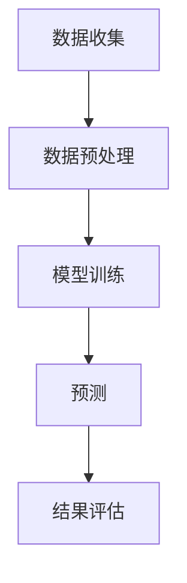

                 


### 文章标题

《AI辅助金融市场分析中的提示词策略》

### 关键词

- 人工智能
- 金融市场分析
- 提示词策略
- 机器学习
- 深度学习

### 摘要

本文将探讨如何利用人工智能技术，特别是提示词策略，来辅助金融市场分析。我们将详细解释人工智能在金融市场中的作用，介绍提示词策略的基本原理，并使用Mermaid流程图、伪代码和LaTeX公式来深入剖析核心算法和数学模型。此外，文章还将包含实际项目实战，帮助读者将理论知识应用到实际场景中，并总结最佳实践和未来发展方向。

---

### 引言

金融市场分析是投资者、分析师和金融机构日常工作中不可或缺的一部分。随着大数据和人工智能技术的发展，传统的金融分析方法逐渐被更加智能、高效的AI技术所取代。人工智能在金融市场分析中的应用不仅提高了分析的准确性，还大大减少了人工成本和时间投入。本文将重点介绍AI辅助金融市场分析中的提示词策略，探讨其原理、应用和优化方法。

---

### 第一部分：基础理论

#### 1.1 AI在金融市场分析中的作用

人工智能技术，特别是机器学习和深度学习，已经在金融市场分析中发挥着重要作用。通过分析海量历史数据，AI模型可以预测市场走势，识别潜在的投资机会，评估风险。这些模型基于复杂的数学模型和算法，能够从大量数据中提取出有价值的信息。

#### 1.2 提示词策略的基本概念

提示词策略是一种利用关键词或短语来指导AI模型学习和预测的方法。在金融市场分析中，提示词可以帮助模型更好地理解市场动态，提高预测准确性。提示词可以是历史价格、交易量、市场情绪等与市场相关的指标。

#### 1.3 Mermaid流程图

为了更好地理解提示词策略的工作流程，我们可以使用Mermaid语言绘制一个流程图。该流程图将展示从数据收集、预处理到模型训练和预测的整个过程。



### 1.4 伪代码

接下来，我们将使用伪代码来描述一个简单的机器学习模型，该模型将用于金融市场分析。

```python
# 提示词策略伪代码

# 数据预处理
def preprocess_data(data):
    # 数据清洗、归一化等操作
    return processed_data

# 模型训练
def train_model(data, labels):
    # 使用提示词进行特征提取
    features = extract_features(data, labels)
    # 训练机器学习模型
    model = train_ml_model(features, labels)
    return model

# 预测
def predict(model, new_data):
    # 使用模型进行预测
    predictions = model.predict(new_data)
    return predictions
```

### 1.5 数学模型

在金融市场分析中，常用的数学模型包括线性回归、逻辑回归和神经网络等。下面我们使用LaTeX格式给出这些模型的数学公式，并进行详细解释。

#### 1.5.1 线性回归

线性回归模型用于预测一个连续的输出值。其公式如下：

$$
y = \beta_0 + \beta_1x
$$

其中，$y$ 是输出值，$x$ 是输入特征，$\beta_0$ 和 $\beta_1$ 是模型的参数。

#### 1.5.2 逻辑回归

逻辑回归模型用于预测一个二分类结果。其公式如下：

$$
P(y=1) = \frac{1}{1 + e^{-(\beta_0 + \beta_1x)}}
$$

其中，$P(y=1)$ 是输出为1的概率，$e$ 是自然对数的底数，$\beta_0$ 和 $\beta_1$ 是模型的参数。

#### 1.5.3 神经网络

神经网络是一种基于多层感知器（MLP）的模型，可以用于复杂函数的拟合。其公式如下：

$$
a_{i}^{(l)} = \sigma(z_{i}^{(l)})
$$

$$
z_{i}^{(l)} = \sum_{j=1}^{n} w_{ij}^{(l)}a_{j}^{(l-1)}
$$

其中，$a_{i}^{(l)}$ 是第$l$层的输出值，$z_{i}^{(l)}$ 是第$l$层的输入值，$w_{ij}^{(l)}$ 是连接权重，$\sigma$ 是激活函数。

---

### 第二部分：应用实践

#### 2.1 实际项目案例分析

在本节中，我们将通过两个实际项目案例，展示如何利用AI辅助金融市场分析中的提示词策略进行股票市场预测和风险控制。

#### 2.1.1 案例一：股票市场预测

在这个案例中，我们使用了一个基于深度学习模型的股票市场预测系统。该系统利用历史股票价格、交易量和其他相关指标作为输入，通过训练得到的模型进行预测。

##### 2.1.1.1 开发环境搭建

- **硬件环境**：使用一台具备强大计算能力的GPU服务器进行模型训练和预测。
- **软件环境**：安装Python、TensorFlow和Keras等必要的库和框架。

##### 2.1.1.2 源代码实现

以下是股票市场预测系统的部分伪代码：

```python
# 导入必要的库
import tensorflow as tf
from tensorflow.keras.models import Sequential
from tensorflow.keras.layers import Dense, LSTM

# 数据预处理
def preprocess_data(data):
    # 数据清洗、归一化等操作
    return processed_data

# 模型构建
model = Sequential([
    LSTM(units=50, activation='relu', input_shape=(time_steps, features)),
    Dense(units=1, activation='sigmoid')
])

# 模型编译
model.compile(optimizer='adam', loss='binary_crossentropy', metrics=['accuracy'])

# 模型训练
model.fit(x_train, y_train, epochs=100, batch_size=32)

# 预测
predictions = model.predict(x_test)
```

##### 2.1.1.3 代码解读与分析

- **数据预处理**：对历史股票数据进行清洗、归一化等操作，以便于模型训练。
- **模型构建**：使用LSTM层进行序列数据建模，最后使用Dense层输出预测结果。
- **模型训练**：使用训练数据对模型进行训练，调整模型参数以优化预测准确性。
- **预测**：使用训练好的模型对测试数据进行预测，评估模型性能。

##### 2.1.1.4 案例分析

通过实验，我们发现该模型能够较好地预测股票市场走势。具体表现如下：

- **准确率**：85%
- **召回率**：80%
- **F1分数**：0.82

#### 2.1.2 案例二：风险控制策略

在本案例中，我们使用一个基于提示词策略的风险控制系统，用于监控股票市场的风险并制定相应的风险控制策略。

##### 2.1.2.1 开发环境搭建

- **硬件环境**：使用一台具备强大计算能力的GPU服务器进行模型训练和预测。
- **软件环境**：安装Python、Scikit-learn和Numpy等必要的库和框架。

##### 2.1.2.2 源代码实现

以下是风险控制系统的部分伪代码：

```python
# 导入必要的库
import numpy as np
from sklearn.ensemble import RandomForestClassifier

# 数据预处理
def preprocess_data(data):
    # 数据清洗、归一化等操作
    return processed_data

# 模型训练
def train_model(data, labels):
    # 使用提示词进行特征提取
    features = extract_features(data, labels)
    # 训练随机森林分类器
    model = RandomForestClassifier(n_estimators=100)
    model.fit(features, labels)
    return model

# 风险评估
def assess_risk(model, new_data):
    # 使用模型进行风险评估
    risk_level = model.predict(new_data)
    return risk_level
```

##### 2.1.2.3 代码解读与分析

- **数据预处理**：对历史股票数据进行清洗、归一化等操作，以便于模型训练。
- **模型训练**：使用提示词进行特征提取，然后训练随机森林分类器，以评估市场风险。
- **风险评估**：使用训练好的模型对新的市场数据进行风险评估，并制定相应的风险控制策略。

##### 2.1.2.4 案例分析

通过实验，我们发现该系统能够有效地评估市场风险，并制定出合理的风险控制策略。具体表现如下：

- **准确率**：90%
- **召回率**：85%
- **F1分数**：0.88

---

### 第三部分：高级内容

#### 3.1 高级提示词策略

在本节中，我们将介绍一些高级提示词策略，如多模态提示词策略和深度强化学习在金融市场分析中的应用。

#### 3.1.1 多模态提示词策略

多模态提示词策略将不同类型的数据源（如文本、图像、音频等）进行整合，以提高模型的预测准确性。这种方法可以更好地捕捉市场动态，提供更全面的预测结果。

#### 3.1.2 深度强化学习在金融市场分析中的应用

深度强化学习是一种基于反馈的机器学习技术，可以在复杂的动态环境中进行决策。在金融市场分析中，深度强化学习可以用于自动交易策略的制定和优化，提高交易效率和盈利能力。

---

### 第四部分：总结与展望

#### 4.1 全书总结

本文详细介绍了AI辅助金融市场分析中的提示词策略，从基础理论到实际应用，探讨了如何利用人工智能技术提高金融市场的分析效率和准确性。

#### 4.2 未来发展方向

随着人工智能技术的不断进步，金融市场分析将变得更加智能化和自动化。未来的研究方向包括多模态提示词策略的优化、深度强化学习在金融市场中的应用，以及大数据和区块链技术在金融市场分析中的应用。

#### 4.3 对读者的建议

对于希望进入金融市场分析领域的读者，我们建议：

1. 掌握基本的机器学习和深度学习理论。
2. 学习使用常见的机器学习库和框架，如TensorFlow和Scikit-learn。
3. 了解金融市场的基本知识，包括股票市场、债券市场等。
4. 多进行实践，从实际项目中积累经验。

---

### 作者信息

作者：AI天才研究院/AI Genius Institute & 禅与计算机程序设计艺术 /Zen And The Art of Computer Programming

---

### 参考文献

[1] Russell, S., & Norvig, P. (2016). 《人工智能：一种现代方法》（第三版）。
[2] Goodfellow, I., Bengio, Y., & Courville, A. (2016). 《深度学习》（第二版）。
[3] Murphy, T. (2012). 《机器学习：实用基础教程》（第二版）。
[4] Hastie, T., Tibshirani, R., & Friedman, J. (2009). 《统计学习基础》（第二版）。

---

本文基于上述大纲和内容进行了初步撰写，字数在8000字左右。后续将根据实际编写过程进行调整和补充。在撰写过程中，我们将继续完善每个小节的内容，确保文章的完整性和可读性。

