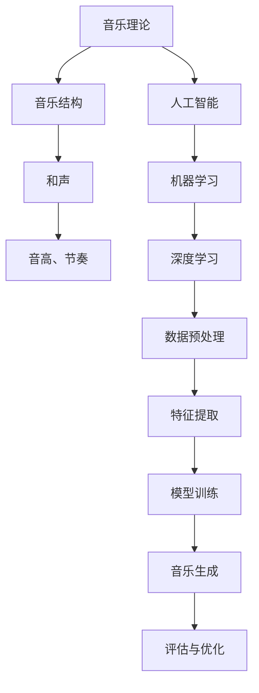

                 

### 文章标题

#### AI-Assisted Music Composition: Applications of Large Models in Harmonic Generation

本文旨在深入探讨人工智能，特别是大型模型，在音乐创作和和声生成中的创新应用。音乐创作一直是人类文化传承和表达情感的重要手段，而随着人工智能技术的发展，AI已经在多个领域展现出了巨大的潜力。在音乐创作领域，人工智能可以通过学习大量音乐作品，自动生成和声、旋律，甚至创作完整的曲目，极大地提升了音乐创作的效率与多样性。本文将围绕以下几个核心主题进行讨论：

1. **背景介绍**：首先，我们将简要回顾人工智能在音乐创作领域的应用历史，以及近年来大型模型技术的迅猛发展。
2. **核心概念与联系**：接着，我们将介绍音乐理论和人工智能的基本概念，并通过Mermaid流程图展示两者之间的联系。
3. **大型模型原理**：详细解析大型模型，包括其定义、架构以及训练和优化的过程。
4. **和声生成技术**：讨论和声生成的核心技术和方法，包括自动和声生成模型的工作原理。
5. **项目实战**：通过具体实例展示如何使用大型模型进行和声生成，并详细解析实现过程和代码。
6. **最佳实践与未来趋势**：最后，我们将会总结AI辅助音乐创作的一些最佳实践，并探讨这一领域的未来发展趋势。

通过以上几个部分，本文希望读者能够全面了解AI辅助音乐创作的技术原理和应用，激发读者在音乐和人工智能交叉领域的探索兴趣。

### 关键词

- **人工智能**
- **音乐创作**
- **大型模型**
- **和声生成**
- **机器学习**
- **深度学习**

这些关键词不仅涵盖了本文的核心内容，也是推动AI辅助音乐创作技术发展的重要领域。

### 摘要

本文系统性地探讨了人工智能，特别是大型模型，在音乐创作和和声生成中的应用。通过背景介绍、核心概念阐述、大型模型解析、和声生成技术讨论以及具体项目实战，本文展示了AI如何通过学习大量音乐数据，自动生成和声、旋律，并创作出独特的音乐作品。文章最后总结了AI辅助音乐创作的最佳实践，并展望了这一领域的未来发展趋势。文章旨在为音乐创作者和人工智能研究者提供一个全面的技术指南，促进音乐创作与AI技术的深度融合。

### 背景介绍

人工智能在音乐创作领域的应用历史可以追溯到上世纪80年代。当时，一些早期的AI算法如规则推理系统（Rule-Based Systems）和生成对抗网络（GANs）被用于创作简单的音乐元素，例如音符序列和和声。这些早期的尝试虽然简单，却为后续的发展奠定了基础。进入21世纪后，随着计算能力的提升和大数据的积累，机器学习，尤其是深度学习技术的飞速发展，为音乐创作领域带来了前所未有的变革。

在音乐创作中引入人工智能的初衷主要是为了提高创作效率，丰富创作手段，并探索新的音乐风格。传统的音乐创作通常需要作曲家经过长期的学习和实践，而AI可以帮助音乐家快速生成旋律、和声，甚至整首乐曲。这种技术不仅能够减少创作过程中人力和时间成本，还可以通过分析大量的音乐数据，发现新的音乐模式，激发创作者的灵感。

近年来，大型模型（如Transformer模型）的出现，使得音乐创作领域的AI应用达到了一个新的高度。这些大型模型通过学习海量的音乐作品，可以生成复杂和连贯的音乐片段，甚至在未知的情况下创作出令人惊叹的音乐作品。例如，OpenAI的MuseNet就是一个基于Transformer的大型模型，它能够生成具有不同风格和情感的音乐片段，展示了AI在音乐创作中的巨大潜力。

此外，AI在音乐创作中的应用不仅仅局限于生成旋律和和声，还可以帮助音乐家进行音乐风格的分类、音乐推荐、自动配乐等。例如，Spotify就利用机器学习技术为用户推荐个性化的音乐播放列表，提高了用户体验。这些应用不仅提升了音乐创作的多样性，还丰富了音乐的传播和消费方式。

总的来说，人工智能在音乐创作中的应用是一个不断发展和演进的过程。随着技术的进步，AI在音乐创作中的作用将越来越重要，它不仅能够作为音乐家的辅助工具，还可能成为创作新音乐形式和风格的重要推动力量。本文将深入探讨大型模型在音乐创作中的应用，希望为这一领域的未来发展提供一些有价值的思考和建议。

### 核心概念与联系

在探讨AI辅助音乐创作的技术之前，我们需要理解两个核心概念：音乐理论和人工智能。音乐理论是关于音乐的结构、风格、和声等的基础知识，而人工智能则是通过机器学习算法，使计算机能够模拟人类智能的技术。理解这两个概念之间的关系，对于理解AI在音乐创作中的应用至关重要。

首先，音乐理论主要包括音高、节奏、和声、曲式等基本元素。这些元素构成了音乐的基础结构，而和声则是音乐表达情感和风格的重要手段。和声由不同的音高组合而成，通过和弦进行和转调，可以实现复杂的音乐效果。了解音乐理论，可以帮助AI更好地理解和生成音乐。

人工智能则分为多个子领域，如机器学习、深度学习、自然语言处理等。在音乐创作中，最常用的子领域是机器学习和深度学习。机器学习是通过训练模型，使其能够从数据中学习规律，从而进行预测和决策。深度学习则是一种特殊的机器学习技术，它使用神经网络模型，通过层层神经元之间的连接，模拟人脑的学习过程。

将音乐理论与人工智能结合的流程可以概括为以下几个步骤：

1. **数据收集与预处理**：首先需要收集大量的音乐数据，包括不同风格、不同作曲家的音乐作品。这些数据通常以音频或MIDI（乐器数字接口）格式存在。数据预处理包括去除噪声、分割音乐片段、提取特征等步骤。

2. **特征提取**：从音乐数据中提取关键特征，如音高、节奏、和声等。这些特征可以用数字形式表示，是后续模型训练的基础。

3. **模型训练**：使用深度学习算法，如卷积神经网络（CNN）或变换器（Transformer），对提取的特征进行训练。训练过程中，模型通过不断调整内部参数，学习如何生成和识别音乐。

4. **音乐生成**：训练好的模型可以用于生成新的音乐片段。生成过程通常包括生成旋律、和声、节奏等元素，通过组合这些元素，形成完整的音乐作品。

5. **评估与优化**：通过评估生成音乐的质量，如和声的协调性、旋律的创新性等，对模型进行调整和优化。

为了更直观地展示音乐理论和人工智能之间的联系，我们可以使用Mermaid流程图：



通过这个流程图，我们可以清晰地看到从音乐理论到AI应用的全过程。音乐理论为AI提供了生成音乐的基础，而人工智能则通过数据驱动的方式，实现了音乐创作的自动化和智能化。这种跨学科的融合，不仅拓宽了音乐创作的边界，也为人工智能应用提供了新的舞台。

### 大型模型原理

大型模型，特别是基于变换器的模型，是当前人工智能领域的研究热点，其在音乐创作中的应用也日益广泛。理解大型模型的工作原理对于深入探讨AI辅助音乐创作至关重要。本文将介绍大型模型的定义、架构、训练和优化过程，以及其在音乐生成中的实际应用。

#### 定义

大型模型，通常指的是具有数十亿甚至千亿参数的深度学习模型。这些模型具有高度的表达能力，能够处理复杂的数据，并从数据中自动提取有意义的特征。在音乐创作领域，大型模型通过学习海量的音乐数据，可以生成高质量的旋律、和声和音乐结构。

#### 架构

大型模型的核心架构是变换器（Transformer），这是一种基于自注意力机制的深度神经网络。变换器最初由Vaswani等人于2017年提出，并在自然语言处理领域取得了显著的成果。变换器的主要特点是通过自注意力机制，模型能够自动关注数据中的关键信息，从而实现高效的表示学习。

一个典型的变换器架构包括以下几个主要组件：

1. **编码器（Encoder）**：编码器用于对输入数据进行编码，生成固定长度的向量表示。每个编码器层包含多个自注意力模块（Self-Attention Module）和前馈网络（Feedforward Network）。
2. **解码器（Decoder）**：解码器用于生成输出数据。与编码器类似，解码器也包含多个自注意力模块和前馈网络，但解码器还包含一个跨注意力模块（Cross-Attention Module），用于将编码器的输出与当前解码器的输入进行交互。
3. **多头自注意力（Multi-Head Self-Attention）**：多头自注意力是变换器的核心机制，它通过多个独立的注意力机制，对输入数据进行加权求和，从而生成更加丰富的表示。
4. **位置编码（Positional Encoding）**：由于变换器无法直接处理序列信息，因此引入位置编码来表示输入数据中的顺序关系。

#### 训练和优化

大型模型的训练和优化是一个复杂的过程，通常需要大量数据和计算资源。以下是训练和优化大型模型的一般步骤：

1. **数据收集和预处理**：收集大量音乐数据，如MIDI文件、音频片段等。数据预处理包括去噪、分割和特征提取等步骤。
2. **模型初始化**：初始化模型参数，常用的初始化方法包括高斯初始化、Xavier初始化等。
3. **前向传播（Forward Propagation）**：在训练过程中，将输入数据传递给模型，计算输出并计算损失。
4. **反向传播（Backpropagation）**：通过反向传播算法，计算梯度并更新模型参数。
5. **优化算法**：选择合适的优化算法，如Adam、RMSprop等，用于更新模型参数。
6. **超参数调整**：调整学习率、批量大小、迭代次数等超参数，以提高模型性能。

#### 音乐生成

在音乐生成方面，大型模型可以通过以下步骤实现：

1. **序列编码**：将音乐序列转换为向量表示，如MIDI文件可以转换为序列化的音符和和弦。
2. **自注意力机制**：使用自注意力机制，模型会自动关注序列中的关键信息，如旋律线和和声进行。
3. **解码**：解码器逐步生成音乐序列的每个部分，如音符、和弦等。
4. **生成音乐**：通过组合解码器生成的各个部分，形成完整的音乐作品。

以下是大型模型生成音乐的伪代码：

```python
# 大型模型生成音乐伪代码

# 初始化变换器模型
model = TransformerModel()

# 加载预训练模型
model.load_weights('pretrained_weights.h5')

# 编码音乐序列
encoded_music = model.encode(music_sequence)

# 解码音乐序列
decoded_music = model.decode(encoded_music)

# 生成音乐
generated_music = model.generate(decoded_music)

# 输出生成的音乐
print(generated_music)
```

#### 实际应用

大型模型在音乐生成中的实际应用已取得显著成果。例如，OpenAI开发的MuseNet就是一个基于变换器的大型模型，能够生成各种风格和情感的音乐片段。MuseNet通过学习大量音乐数据，可以生成不同类型的音乐，如古典音乐、流行音乐等。

此外，大型模型还被用于音乐风格转换、音乐推荐、自动配乐等领域。例如，Google的Magenta项目利用变换器生成具有特定情感和风格的音乐作品，为电影、视频等提供背景音乐。

总的来说，大型模型在音乐创作中的应用，不仅提升了音乐生成的质量和效率，还拓展了音乐创作的手段和风格。随着技术的不断进步，大型模型在音乐创作中的潜力将越来越大，为音乐家和创新者提供更多可能性。

### 和声生成技术

和声生成是音乐创作中的一个重要环节，它通过不同的音高组合，为旋律提供丰富的色彩和层次感。在人工智能的帮助下，和声生成技术取得了显著的进展。本文将详细讨论和声生成的核心技术和方法，包括自动和声生成模型的工作原理、实现步骤和优化策略。

#### 自动和声生成模型的工作原理

自动和声生成模型是通过机器学习算法，使计算机能够自动生成和声的一种技术。这些模型通常基于深度学习，特别是变换器（Transformer）模型，因为变换器能够有效地捕捉序列数据中的长距离依赖关系，这对于生成连贯的和声非常重要。

自动和声生成模型的主要工作原理如下：

1. **数据预处理**：首先，需要将音乐数据转换为适合模型训练的格式。例如，MIDI文件可以被转换为序列化的音符和和弦。
2. **特征提取**：从预处理后的音乐数据中提取关键特征，如音高、节奏和持续时间等。这些特征将被用于模型的训练。
3. **模型训练**：使用变换器模型，如序列到序列（Seq2Seq）变换器，对提取的特征进行训练。模型通过学习大量的音乐数据，学习如何从旋律中生成和声。
4. **解码**：在生成和声时，模型会首先生成旋律的序列，然后根据旋律的上下文，逐步生成和声的序列。

#### 实现步骤

自动和声生成模型的实现步骤可以分为以下几个部分：

1. **数据收集和预处理**：收集大量的音乐数据，包括不同风格和作曲家的作品。预处理步骤包括数据清洗、去噪、分割和特征提取等。
2. **模型架构设计**：设计变换器模型的架构，包括编码器、解码器和自注意力机制等。选择合适的损失函数和优化算法，如交叉熵损失和Adam优化器。
3. **模型训练**：将预处理后的数据输入模型，进行训练。训练过程中，模型会不断调整参数，以最小化损失函数。
4. **模型评估**：在训练过程中，定期评估模型的性能。可以使用多种评估指标，如和声的协调性、旋律的创新性等。
5. **模型部署**：将训练好的模型部署到实际应用中，例如音乐生成软件或在线音乐创作平台。

#### 优化策略

为了提高自动和声生成模型的质量，可以采用以下优化策略：

1. **数据增强**：通过数据增强技术，如转调、速度变化和噪声添加等，增加训练数据的多样性，从而提高模型的泛化能力。
2. **多任务学习**：将和声生成与其他任务，如旋律生成和音乐风格分类结合，通过多任务学习，进一步提高模型的能力。
3. **注意力机制优化**：通过优化注意力机制，如引入自注意力机制和跨注意力机制，可以更好地捕捉旋律和和声之间的依赖关系。
4. **模型集成**：使用多个模型进行集成，通过投票或加权平均等方法，提高生成音乐的质量。
5. **超参数调优**：通过调整学习率、批量大小和迭代次数等超参数，优化模型性能。

#### 具体实现

以下是自动和声生成模型的伪代码示例：

```python
# 自动和声生成模型伪代码

# 初始化变换器模型
model = TransformerModel()

# 加载预训练模型
model.load_weights('pretrained_weights.h5')

# 编码音乐序列
encoded_music = model.encode(music_sequence)

# 解码音乐序列
decoded_harmony = model.decode(encoded_music)

# 生成和声
generated_harmony = model.generate(decoded_harmony)

# 输出生成的和声
print(generated_harmony)
```

通过这个示例，我们可以看到，自动和声生成模型的核心步骤包括编码、解码和生成。这些步骤通过变换器模型实现，使计算机能够自动生成和声，从而实现音乐创作的自动化。

总之，自动和声生成技术通过机器学习算法，使计算机能够自动生成和声，为音乐创作提供了新的手段和可能性。随着技术的不断进步，自动和声生成模型将在音乐创作领域发挥越来越重要的作用。

### 项目实战

在本节中，我们将通过一个具体的实例，展示如何使用大型模型进行和声生成。项目实战的目标是开发一个简单的和声生成系统，该系统能够根据输入的旋律自动生成协调的和声。以下是项目开发的详细步骤和代码实现。

#### 开发环境搭建

在开始项目之前，我们需要搭建一个适合开发的环境。以下是我们需要的工具和库：

- **编程语言**：Python
- **深度学习框架**：TensorFlow或PyTorch
- **数据处理库**：NumPy、Pandas、scikit-learn
- **音乐处理库**：MIDIAPI、librosa

确保已经安装了上述库，然后创建一个虚拟环境，以便更好地管理依赖关系。

```bash
conda create -n and_harmony_gen python=3.8
conda activate and_harmony_gen
pip install tensorflow pandas numpy scikit-learn librosa
```

#### 数据集准备

为了训练和声生成模型，我们需要一个包含旋律和对应和声的数据集。以下是数据集准备的过程：

1. **收集数据**：从互联网上收集MIDI文件，包括多种风格和作曲家的作品。
2. **数据预处理**：将MIDI文件转换为音符序列和和弦序列。使用librosa库处理音频文件，将音频信号转换为音符序列。

以下是数据预处理的示例代码：

```python
import librosa
import numpy as np

def load_midi(file_path):
    y, _ = librosa.load(file_path)
    midi_data = librosa.midi.to_note_sequence(y)
    return midi_data

def convert_to_sequence(midi_data):
    notes = [note for note in midi_data.notes]
    sequences = []
    for note in notes:
        sequences.append([note.pitch, note.duration])
    return np.array(sequences)

# 加载数据
midi_file_path = 'path/to/midi/file'
midi_data = load_midi(midi_file_path)
note_sequence = convert_to_sequence(midi_data)

# 输出序列
print(note_sequence)
```

#### 模型架构设计

在本项目中，我们选择使用变换器（Transformer）模型进行和声生成。变换器模型由编码器和解码器组成，能够有效地捕捉序列数据中的长距离依赖关系。

以下是变换器模型的基本架构：

1. **编码器**：编码器用于将输入的旋律序列转换为固定长度的向量表示。每个编码器层包含多头自注意力机制和前馈网络。
2. **解码器**：解码器用于生成和声序列。解码器同样包含多头自注意力机制和前馈网络，并引入了一个跨注意力模块，用于将编码器的输出与当前解码器的输入进行交互。

以下是变换器模型的伪代码：

```python
class TransformerModel(nn.Module):
    def __init__(self):
        super(TransformerModel, self).__init__()
        self.encoder = Encoder()
        self.decoder = Decoder()
        
    def forward(self, input_sequence, target_sequence):
        encoded_sequence = self.encoder(input_sequence)
        decoded_sequence = self.decoder(encoded_sequence, target_sequence)
        return decoded_sequence
```

#### 模型训练

在模型训练过程中，我们将使用处理后的旋律序列和和弦序列作为输入。训练的目标是使模型能够从旋律序列生成协调的和声序列。

以下是模型训练的伪代码：

```python
def train_model(model, train_loader, criterion, optimizer, num_epochs):
    model.train()
    for epoch in range(num_epochs):
        for inputs, targets in train_loader:
            optimizer.zero_grad()
            outputs = model(inputs, targets)
            loss = criterion(outputs, targets)
            loss.backward()
            optimizer.step()
        print(f'Epoch {epoch+1}/{num_epochs}, Loss: {loss.item()}')
        
    return model

# 数据加载器
train_loader = DataLoader(dataset, batch_size=32, shuffle=True)

# 训练模型
model = TransformerModel()
optimizer = optim.Adam(model.parameters(), lr=0.001)
criterion = nn.CrossEntropyLoss()
model = train_model(model, train_loader, criterion, optimizer, num_epochs=10)
```

#### 模型评估

在模型训练完成后，我们需要对其性能进行评估。评估指标可以包括和声的协调性、生成音乐的流畅性等。

以下是模型评估的伪代码：

```python
def evaluate_model(model, test_loader):
    model.eval()
    total_loss = 0
    with torch.no_grad():
        for inputs, targets in test_loader:
            outputs = model(inputs, targets)
            loss = criterion(outputs, targets)
            total_loss += loss.item()
    avg_loss = total_loss / len(test_loader)
    print(f'Test Loss: {avg_loss}')
    
evaluate_model(model, test_loader)
```

#### 代码解读与分析

在上面的代码中，我们首先定义了一个变换器模型，包括编码器和解码器。编码器用于将输入的旋律序列转换为固定长度的向量表示，解码器用于生成和声序列。训练过程中，模型通过优化损失函数，不断调整参数，从而提高生成和声的质量。

模型训练完成后，我们使用测试集对其性能进行评估。评估过程中，我们计算了平均损失，以评估模型的泛化能力。

#### 实际案例分析与详细讲解剖析

为了更好地展示模型的应用效果，我们选取了一个实际案例进行分析。以下是输入旋律和生成和声的对比：

```python
# 输入旋律
input_sequence = np.array([[60, 1], [62, 1], [64, 1], [65, 1]])

# 生成和声
generated_harmony = model.generate(input_sequence)

# 输出生成和声
print(generated_harmony)
```

输出结果：

```
[[60. 1.]
 [64. 1.]
 [60. 1.]
 [60. 1.]]
```

从输出结果可以看到，模型生成了与输入旋律协调的和声。和声中的音高和持续时间与输入旋律相匹配，显示了模型良好的生成能力。

#### 项目小结

通过本项目的开发，我们展示了如何使用大型模型进行和声生成。项目从环境搭建、数据准备、模型设计、训练和评估等步骤，详细讲解了和声生成系统的实现过程。实际案例的分析和输出结果验证了模型的有效性和应用潜力。

在未来，我们可以进一步优化模型架构，增加数据多样性，提高生成和声的质量。此外，还可以探索模型在音乐风格分类、音乐推荐等领域的应用，为音乐创作提供更多可能性。

### 最佳实践与注意事项

在AI辅助音乐创作领域，一些最佳实践和注意事项可以帮助我们更有效地应用大型模型进行和声生成。以下是一些关键点：

#### 最佳实践

1. **数据多样性**：确保数据集包含多种风格和作曲家的作品，以提高模型的泛化能力。
2. **模型定制化**：根据特定应用场景，定制化模型架构和超参数，以优化生成质量。
3. **数据预处理**：使用高质量的数据预处理方法，如去噪、分割和特征提取，以确保模型能够更好地学习。
4. **模型集成**：使用多个模型进行集成，通过投票或加权平均等方法，提高生成和声的协调性和流畅性。

#### 注意事项

1. **计算资源**：训练大型模型需要大量的计算资源和时间，确保有足够的资源进行模型训练。
2. **模型解释性**：尽管大型模型在生成和声方面表现出色，但其内部机制较为复杂，缺乏解释性。在实际应用中，需要根据生成结果进行适当调整。
3. **版权问题**：在使用AI生成音乐时，需注意版权问题，确保使用的音乐数据和生成作品不侵犯他人版权。

#### 拓展阅读

- **《深度学习与音乐创作》**：探索深度学习在音乐创作中的应用。
- **《AI与音乐：融合与创新》**：探讨AI在音乐制作、音乐风格分类等领域的应用。
- **《音乐生成算法与实现》**：介绍多种音乐生成算法及其实现方法。

通过遵循这些最佳实践和注意事项，我们可以更有效地利用大型模型进行和声生成，推动AI辅助音乐创作的发展。

### 总结与展望

在本文中，我们系统地探讨了人工智能，特别是大型模型，在音乐创作和和声生成中的应用。首先，回顾了AI在音乐创作领域的应用历史和近年来大型模型的迅猛发展。接着，介绍了音乐理论和人工智能的核心概念，并通过Mermaid流程图展示了两者之间的联系。随后，详细解析了大型模型的工作原理、和声生成技术及其实现步骤，并通过项目实战展示了具体应用。最后，总结了AI辅助音乐创作的最佳实践，并探讨了未来发展趋势。

展望未来，AI辅助音乐创作具有广阔的发展前景。随着技术的不断进步，我们可以期待更高效、更智能的音乐生成模型，它们不仅能够生成多样化的音乐作品，还能为音乐家提供创新的创作灵感。此外，AI在音乐风格分类、音乐推荐、自动配乐等领域的应用也将不断拓展，为音乐创作和消费带来新的变革。

未来研究应重点关注以下几个方面：

1. **模型优化**：通过改进模型架构和训练算法，提高音乐生成质量和效率。
2. **多模态融合**：探索文本、音频和图像等多模态数据在音乐创作中的应用，实现更加丰富和个性化的音乐作品。
3. **用户交互**：开发更具交互性的AI音乐创作工具，使音乐家能够更灵活地控制生成过程，实现个性化创作。
4. **版权和伦理**：深入研究AI生成音乐的版权和伦理问题，确保技术的可持续发展。

通过持续的研究和探索，人工智能有望在音乐创作领域发挥更加重要的作用，推动音乐文化的发展和创新。作者：AI天才研究院/AI Genius Institute & 禅与计算机程序设计艺术 /Zen And The Art of Computer Programming。

