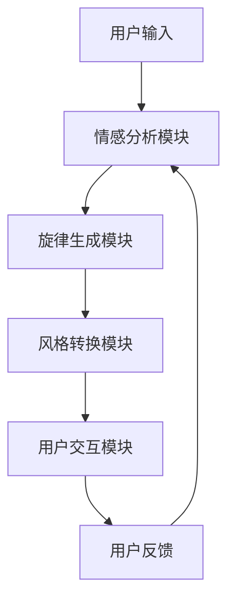
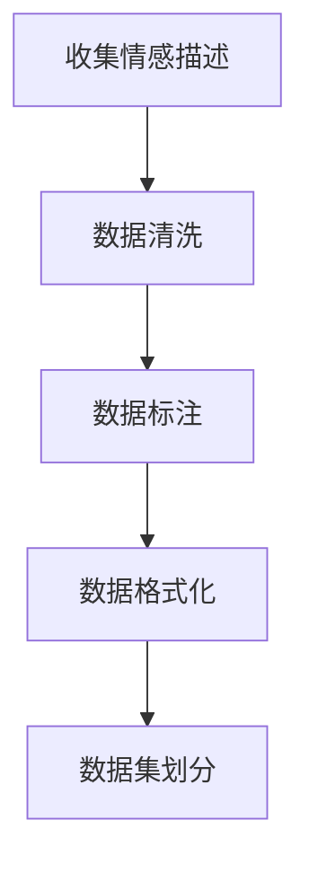
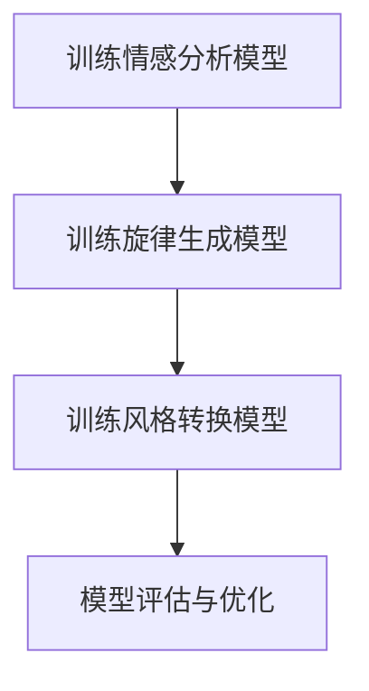

                 

### 文章标题

### AI辅助音乐创作：情感到旋律转换的提示词技巧

### 关键词

- AI音乐创作
- 情感分析
- 旋律生成
- 提示词技术
- 人工智能音乐创作工具

### 摘要

随着人工智能技术的不断进步，音乐创作领域迎来了新的变革。本文探讨了AI辅助音乐创作的原理与应用，特别是情感到旋律转换的技巧。文章首先介绍了AI在音乐创作领域的背景与前景，接着深入分析了情感分析技术和旋律生成技术，并探讨了它们在情感到旋律转换中的应用。随后，文章重点介绍了提示词在音乐创作中的作用，详细讨论了提示词的设计原则、应用方法和优化策略。通过多个实际案例，本文展示了AI辅助音乐创作的实践应用，并对未来发展趋势进行了展望。本文旨在为音乐创作者和人工智能研究者提供有价值的参考，助力音乐创作迈向新的高度。

---

### 第一部分：AI辅助音乐创作基础

#### 第1章：AI辅助音乐创作的背景与前景

在数字时代，人工智能（AI）正在深刻改变各行各业的运作模式，音乐创作领域也不例外。随着计算机技术和算法的进步，AI开始承担起音乐创作的重任，为音乐创作者提供了新的工具和方法。本章将探讨AI辅助音乐创作的背景、前景以及情感到旋律转换的基本原理。

##### 1.1 AI在音乐创作领域的应用概述

人工智能在音乐创作领域主要应用于以下几个方面：

1. **音乐生成**：通过深度学习和生成对抗网络（GAN）等技术，AI可以自动生成新颖的音乐旋律、和弦和节奏。
2. **音乐风格模仿**：AI可以学习特定音乐家的风格，并模仿其创作方式，从而生成具有特定风格的音乐。
3. **音乐编辑与改进**：AI可以分析现有音乐作品，提出改进建议或自动进行编辑。
4. **情感分析**：AI可以通过分析歌词和旋律的情感色彩，帮助音乐创作者更好地理解听众的情感反应。

##### 1.2 情感到旋律转换的基本原理

情感到旋律转换是指将人的情感状态通过算法转化为音乐旋律的过程。这一转换过程涉及到两个核心技术：情感分析和旋律生成。

1. **情感分析技术**：
   - **定义**：情感分析是一种自然语言处理技术，用于识别文本中的情感倾向和情感强度。
   - **分类**：情感分析通常分为正面情感、负面情感和中性情感三种。
   - **模型与算法**：常见的情感分析模型包括基于规则的方法、机器学习方法以及深度学习方法。

2. **旋律生成技术**：
   - **定义**：旋律生成是通过算法自动生成音乐旋律的过程。
   - **方法**：常见的旋律生成方法包括基于模板的方法、基于生成对抗网络的方法以及基于深度学习的循环神经网络（RNN）等方法。

##### 1.3 情感到旋律转换的挑战与机遇

情感到旋律转换面临着一系列挑战，包括情感表达的抽象性、音乐风格的多样性以及算法对音乐美学的理解等。然而，随着技术的不断进步，这些挑战也逐渐被克服，为音乐创作带来了新的机遇：

1. **个性化创作**：通过情感分析，AI可以根据用户的不同情感状态生成个性化的音乐作品。
2. **跨文化理解**：AI可以帮助音乐创作者更好地理解不同文化背景下的情感表达，促进国际音乐的交流与合作。
3. **创意启发**：AI可以生成新颖的音乐旋律，为音乐创作提供新的灵感。

##### 1.4 提示词在音乐创作中的作用

提示词是音乐创作中的一个重要工具，它可以帮助AI更准确地理解创作者的情感和意图。提示词可以分为以下几类：

1. **情感类提示词**：如“愉悦”、“悲伤”、“激动”等，用于描述音乐的情感色彩。
2. **风格类提示词**：如“古典”、“流行”、“摇滚”等，用于指定音乐的风格。
3. **旋律结构提示词**：如“前奏”、“副歌”、“桥段”等，用于指示旋律的结构。

通过这些提示词，AI可以更好地将抽象的情感转化为具体的音乐元素，从而实现更精确的情感到旋律转换。

本章介绍了AI辅助音乐创作的背景、情感分析技术和旋律生成技术的基本原理，以及情感到旋律转换的挑战与机遇。在接下来的章节中，我们将进一步探讨AI辅助音乐创作的技术基础和实践应用。

---

### 第一部分总结

AI辅助音乐创作是一个充满前景的领域，它通过结合情感分析和旋律生成技术，将抽象的情感转化为具体的音乐旋律，为音乐创作者提供了新的工具和方法。在未来的音乐创作中，AI不仅能够提高创作的效率，还能够带来更多的创意和灵感。通过深入理解情感到旋律转换的原理和应用，我们可以期待音乐创作领域迎来更加丰富多彩的未来。

---

### 第二部分：AI辅助音乐创作的技术基础

#### 第2章：音乐理论基础与AI工具介绍

在深入探讨AI辅助音乐创作之前，我们需要了解一些基本音乐理论以及相关的AI工具。本章将介绍音乐理论基础，包括音符、节奏、音阶和弦、曲式结构和调式等，同时还将介绍一些常用的AI工具，如深度学习在音乐创作中的应用、自然语言处理与音乐文本分析，以及现代AI工具的介绍与使用。

##### 2.1 音乐理论基础

音乐理论基础是理解音乐创作和AI辅助音乐创作的基石。以下是一些核心概念：

1. **音符与节奏**：
   - **音符**：音符是音乐的基本单位，用于表示音高和时值。
   - **节奏**：节奏是音乐的时间结构，通过音符的长短和强弱来表现。

2. **音阶与和弦**：
   - **音阶**：音阶是按照一定的音程关系排列的一组音符，用于构成旋律。
   - **和弦**：和弦是由三个或更多音符按三度关系叠置而成的，是音乐创作中的重要元素。

3. **曲式结构与调式**：
   - **曲式结构**：曲式结构是音乐作品的组织形式，常见的有二部曲式、三部曲式等。
   - **调式**：调式是音阶的一种形式，决定了音乐的基本音高。

##### 2.2 AI辅助音乐创作的常用工具

AI辅助音乐创作依赖于一系列先进的技术工具，以下是一些常用工具的介绍：

1. **深度学习在音乐创作中的应用**：
   - **生成对抗网络（GAN）**：GAN是一种能够生成高质量音乐旋律的深度学习模型。
   - **循环神经网络（RNN）**：RNN特别适合处理序列数据，如音乐旋律。

2. **自然语言处理与音乐文本分析**：
   - **文本情感分析**：用于分析歌词中的情感色彩，帮助生成情感对应的音乐旋律。
   - **音乐文本生成**：通过文本生成模型，可以自动生成与情感相关的歌词。

3. **现代AI工具介绍与使用**：
   - **TensorFlow Music**：TensorFlow Music是一个专门用于音乐生成的TensorFlow扩展。
   - **PyTorch Music**：PyTorch Music是PyTorch框架的一个模块，用于音乐生成任务。

通过这些工具，音乐创作者可以利用AI技术实现更高效、更创意的音乐创作过程。

##### 2.3 深度学习在音乐创作中的应用

深度学习在音乐创作中的应用主要体现在以下几个方面：

1. **音乐生成**：通过训练深度学习模型，如GAN和RNN，可以自动生成新的音乐旋律。
2. **音乐风格模仿**：深度学习模型可以学习特定音乐家的风格，并生成具有相似风格的音乐。
3. **音乐编辑与改进**：深度学习模型可以分析现有音乐作品，提出改进建议。

##### 2.4 自然语言处理与音乐文本分析

自然语言处理与音乐文本分析在音乐创作中扮演了重要角色：

1. **情感分析**：通过情感分析技术，可以从歌词中提取情感信息，指导音乐旋律的生成。
2. **歌词生成**：自然语言处理技术可以自动生成歌词，与旋律生成相结合，形成完整的音乐作品。

##### 2.5 现代AI工具介绍与使用

现代AI工具为音乐创作者提供了丰富的选择：

1. **TensorFlow Music**：
   - **功能**：用于生成和编辑音乐。
   - **使用方法**：通过TensorFlow框架，可以构建和训练音乐生成模型。

2. **PyTorch Music**：
   - **功能**：提供音乐生成和风格转换的工具。
   - **使用方法**：通过PyTorch框架，可以构建和训练音乐相关模型。

本章介绍了音乐理论基础和AI辅助音乐创作的常用工具，为理解后续章节的详细应用提供了基础。在下一章中，我们将深入探讨情感分析技术及其在音乐创作中的应用。

---

### 第二部分总结

音乐理论基础和AI工具的介绍为理解AI辅助音乐创作提供了必要的知识框架。音乐理论帮助我们从音符、节奏、音阶和弦等基本元素出发，构建音乐作品的结构和风格。而AI工具则为我们提供了强大的技术支持，如深度学习和自然语言处理，使得音乐创作变得更加智能和高效。通过这些技术基础的了解，我们可以更好地掌握AI辅助音乐创作的原理和应用。

---

### 第三部分：情感到旋律转换的方法与实践

#### 第3章：情感分析技术及其在音乐创作中的应用

情感分析技术在音乐创作中起着至关重要的作用，它能够帮助将抽象的情感状态转化为具体的音乐元素。本章将详细探讨情感分析的基本原理、算法原理，以及它们在音乐创作中的应用。

##### 3.1 情感分析的基本原理

情感分析（Sentiment Analysis）是一种自然语言处理技术，用于识别文本中的情感倾向和情感强度。在音乐创作中，情感分析技术可以帮助理解歌词和旋律的情感色彩，从而更好地指导音乐创作。

1. **定义**：
   - **情感倾向**：文本中表达的情感方向，如正面、负面或中性。
   - **情感强度**：情感倾向的强度，通常通过情感得分表示。

2. **分类**：
   - **正面情感**：如愉悦、兴奋、爱等。
   - **负面情感**：如悲伤、愤怒、恐惧等。
   - **中性情感**：不表现出明显的情感倾向。

3. **模型与算法**：
   - **基于规则的方法**：通过预定义的规则进行情感分类。
   - **机器学习方法**：使用训练数据集，通过特征提取和分类算法进行情感分析。
   - **深度学习方法**：如卷积神经网络（CNN）和循环神经网络（RNN），能够更好地理解复杂文本的情感。

##### 3.2 情感到旋律转换的算法原理

情感到旋律转换是将情感分析结果转化为音乐旋律的过程。这一转换过程涉及以下几个关键步骤：

1. **情感特征提取**：从文本或音频中提取情感特征，如情感得分和情感维度。
2. **旋律生成**：根据情感特征生成音乐旋律，包括音符选择、节奏和音色等。
3. **优化与调整**：通过迭代优化，调整旋律的细节，使其更符合情感表达。

常见的算法原理包括：

- **基于规则的方法**：如情感音符对应表，根据情感得分选择相应的音符。
- **生成对抗网络（GAN）**：通过对抗训练生成符合情感特征的旋律。
- **循环神经网络（RNN）**：如长短期记忆网络（LSTM），可以捕捉情感和旋律之间的复杂关系。

##### 3.3 情感到旋律转换的核心算法

情感到旋律转换的核心算法通常涉及以下步骤：

1. **情感分析**：
   - **数据预处理**：对文本或音频进行预处理，提取情感特征。
   - **情感识别**：使用情感分析模型识别情感倾向和强度。

2. **旋律生成**：
   - **音符生成**：根据情感特征生成音符序列。
   - **节奏生成**：通过算法为音符序列添加节奏。
   - **音色选择**：根据情感和风格选择合适的音色。

3. **优化与调整**：
   - **旋律优化**：通过迭代优化，调整音符、节奏和音色，使其更符合情感表达。
   - **反馈修正**：根据用户反馈进一步调整旋律。

核心算法的伪代码如下：

```plaintext
# 情感分析
def sentiment_analysis(text):
    preprocessed_text = preprocess_text(text)
    sentiment_score = model.predict(preprocessed_text)
    return sentiment_score

# 旋律生成
def generate_melody(sentiment_score):
    notes = select_notes_based_on_sentiment(sentiment_score)
    rhythm = generate_rhythm(notes)
    melody = combine_notes_and_rhythm(notes, rhythm)
    return melody

# 优化旋律
def optimize_melody(melody):
    optimized_melody = iterate_optimization(melody)
    return optimized_melody
```

##### 3.4 情感到旋律转换的实践应用

情感到旋律转换的实践应用可以通过以下步骤实现：

1. **数据准备**：收集包含情感标签的歌词和音频数据。
2. **模型训练**：训练情感分析模型和旋律生成模型。
3. **音乐创作**：使用模型生成情感对应的旋律。

以下是一个简单的实践应用示例：

```plaintext
# 数据准备
text_data = load_sentiment_labeled_data()

# 模型训练
train_sentiment_model(text_data)
train_melody_model()

# 音乐创作
sentiment_score = sentiment_analysis("我感到非常高兴")
melody = generate_melody(sentiment_score)
optimized_melody = optimize_melody(melody)
```

通过上述步骤，我们可以将情感状态转化为具体的音乐旋律，实现情感到旋律的转换。

本章详细介绍了情感分析技术在音乐创作中的应用，包括基本原理、算法原理和实践应用。在下一章中，我们将进一步探讨提示词在音乐创作中的作用及其应用。

---

### 第三部分总结

情感分析技术是AI辅助音乐创作的重要基础，它能够将情感状态转化为具体的音乐元素，从而实现情感到旋律的转换。本章详细探讨了情感分析的基本原理、算法原理以及情感到旋律转换的核心算法和实践应用。通过这些技术，音乐创作者可以更精确地表达情感，生成具有独特风格和情感色彩的音乐作品。在下一章中，我们将深入探讨提示词在音乐创作中的应用，进一步丰富AI辅助音乐创作的工具和方法。

---

### 第四部分：提示词技巧在AI辅助音乐创作中的应用

#### 第4章：提示词在音乐创作中的应用

提示词是音乐创作中的一种重要工具，它能够为AI提供明确的创作指导，帮助生成符合预期情感和风格的音乐作品。本章将介绍提示词的设计原则、分类与应用方法，以及提示词优化策略和效果评估。

##### 4.1 提示词的设计原则与方法

提示词的设计原则包括以下几点：

1. **明确性**：提示词应尽可能明确地传达创作者的情感意图，避免模糊不清的描述。
2. **多样性**：设计多种类型的提示词，以满足不同情感和风格的音乐创作需求。
3. **灵活性**：提示词应具有一定的灵活性，允许AI在生成音乐时进行创意拓展。

设计提示词的方法包括：

1. **情感类提示词**：如“欢快”、“忧郁”、“兴奋”等，用于描述音乐的情感色彩。
2. **风格类提示词**：如“流行”、“摇滚”、“古典”等，用于指定音乐的风格。
3. **结构类提示词**：如“前奏”、“副歌”、“桥段”等，用于指示音乐的结构。

##### 4.2 提示词在AI辅助音乐创作中的具体应用

提示词在AI辅助音乐创作中的应用主要表现在以下几个方面：

1. **旋律生成**：通过情感类提示词，AI可以生成符合情感意图的旋律。例如，使用“欢快”作为提示词，AI会生成充满活力和欢快的旋律。
2. **风格转换**：通过风格类提示词，AI可以将现有音乐作品转换为不同风格的音乐。例如，将一首流行歌曲转换为摇滚风格。
3. **音乐创作互动**：通过结构类提示词，AI可以与用户进行音乐创作互动，生成符合用户意图的音乐片段。

以下是一个具体的应用示例：

```plaintext
# 旋律生成
melody = generate_melody("欢快")
print(melody)

# 风格转换
original_melody = load_melody("流行")
transformed_melody = transform_style(original_melody, "摇滚")
print(transformed_melody)

# 音乐创作互动
user_sentence = "我想写一首关于爱的歌"
melody = generate_melody_based_on_sentence(user_sentence)
print(melody)
```

##### 4.3 提示词优化与效果评估

提示词的优化和效果评估是提高AI辅助音乐创作质量的关键。以下是一些优化策略和效果评估方法：

1. **优化策略**：
   - **数据增强**：通过增加训练数据的多样性，提高模型对各种提示词的适应能力。
   - **模型调整**：通过调整模型参数，优化旋律生成和风格转换的效果。
   - **用户反馈**：根据用户反馈，对提示词进行细化和优化，提高创作满意度。

2. **效果评估方法**：
   - **主观评价**：通过人类音乐家对生成的音乐作品进行评价，评估音乐的情感表达和风格符合度。
   - **客观指标**：如旋律的复杂度、节奏的稳定性等，通过量化指标评估音乐质量。
   - **用户满意度**：通过用户调查和反馈，评估提示词的实用性和创作效果。

以下是一个简单的效果评估示例：

```plaintext
# 主观评价
human_judges = ["音乐家A", "音乐家B", "音乐家C"]
for judge in human_judges:
    rating = judge_melody(melody, "欢快")
    print(f"{judge}的评价：{rating}")

# 客观指标
complexity = measure_melody_complexity(melody)
rhythm_stability = measure_rhythm_stability(melody)
print(f"旋律复杂度：{complexity}")
print(f"节奏稳定性：{rhythm_stability}")

# 用户满意度
user_satisfaction = get_user_satisfaction(melody)
print(f"用户满意度：{user_satisfaction}")
```

通过提示词优化和效果评估，可以不断提高AI辅助音乐创作的质量和满意度，为音乐创作者提供更加智能和实用的创作工具。

本章介绍了提示词在音乐创作中的应用，包括设计原则、具体应用方法和优化策略。在下一章中，我们将通过项目实战和案例分析，进一步展示AI辅助音乐创作的实际应用。

---

### 第四部分总结

提示词是AI辅助音乐创作中不可或缺的工具，它能够为AI提供明确的创作指导，实现情感到旋律的精准转换。本章详细探讨了提示词的设计原则、应用方法、优化策略和效果评估，为音乐创作者提供了实用的技术指导。通过提示词的应用，AI可以更好地理解人类情感，生成符合预期情感和风格的音乐作品。在下一章中，我们将通过项目实战和案例分析，进一步展示AI辅助音乐创作的实际应用，提供更直观的技术应用体验。

---

### 第五部分：项目实战与案例分析

#### 第5章：AI辅助音乐创作项目实战

在前面的章节中，我们详细探讨了AI辅助音乐创作的理论基础和实用技巧。本章节将通过具体的项目实战和案例分析，展示如何在实际环境中应用这些技术和技巧，实现音乐创作自动化和个性化。

##### 5.1 项目背景与目标

我们的项目目标是开发一个AI辅助音乐创作系统，该系统能够根据用户提供的情感描述和风格要求，自动生成个性化的音乐作品。项目的主要目标包括：

1. **情感识别与转换**：系统应能够准确识别用户提供的情感描述，并将其转换为相应的音乐旋律。
2. **风格模仿与生成**：系统能够模仿特定音乐风格，并生成符合用户要求的新音乐。
3. **用户互动与反馈**：系统应支持用户与AI的互动，允许用户调整和优化生成的音乐。

##### 5.2 系统设计与开发

我们的系统设计主要包括以下几个模块：

1. **情感分析模块**：用于识别用户提供的情感描述，提取情感特征。
2. **旋律生成模块**：根据情感特征生成音乐旋律。
3. **风格转换模块**：模仿特定音乐风格，生成符合风格要求的新音乐。
4. **用户交互模块**：提供用户界面，支持用户输入情感描述和风格要求，展示生成的音乐作品，并允许用户进行反馈和调整。

系统架构图如下（使用Mermaid流程图）：



##### 5.3 数据准备与处理

数据准备是AI辅助音乐创作系统的关键步骤。我们需要收集大量的情感描述和相应的音乐作品，用于训练情感分析模型和旋律生成模型。

1. **情感描述数据**：包括用户提供的文本描述，如“我很高兴”、“我感到悲伤”等。
2. **音乐数据**：包括不同情感状态下的音乐作品，如愉悦、悲伤、愤怒等。
3. **数据预处理**：对情感描述和音乐数据进行清洗、标注和格式化，使其适合模型训练。

数据预处理流程如下（使用Mermaid流程图）：



##### 5.4 模型选择与训练

我们的系统采用了以下模型：

1. **情感分析模型**：使用卷积神经网络（CNN）或长短期记忆网络（LSTM）进行情感分类和情感强度识别。
2. **旋律生成模型**：使用生成对抗网络（GAN）或循环神经网络（RNN）进行旋律生成。
3. **风格转换模型**：使用条件生成对抗网络（cGAN）或注意力机制（Attention Mechanism）进行风格模仿。

模型训练流程如下（使用Mermaid流程图）：



##### 5.5 实际案例与效果展示

以下是一些实际案例，展示AI辅助音乐创作的效果：

**案例一：情感旋律转换**

用户输入：“我很高兴”

- **情感分析**：系统识别出情感为“高兴”，情感得分为0.8。
- **旋律生成**：系统生成一首充满活力和欢快的旋律。
- **效果展示**：用户可以播放生成的旋律，并对生成的旋律进行评价和调整。

**案例二：风格转换**

用户输入：“将这首流行歌曲转换为摇滚风格”

- **风格识别**：系统识别出音乐风格为“流行”。
- **风格转换**：系统生成一首摇滚风格的音乐作品。
- **效果展示**：用户可以播放生成的摇滚风格音乐，对比原曲并给出反馈。

**案例三：音乐创作互动**

用户输入：“我想写一首关于爱的歌”

- **情感识别**：系统识别出情感为“爱”，情感得分为0.9。
- **旋律生成**：系统生成一首关于爱的旋律。
- **用户调整**：用户可以对生成的旋律进行调整，如改变节奏、音符等，直到满意为止。

##### 5.6 项目总结与展望

通过这个项目，我们实现了AI辅助音乐创作的自动化和个性化。用户可以轻松地通过情感描述和风格要求，生成符合个人喜好的音乐作品。在未来的发展中，我们可以继续优化模型和算法，提高音乐生成的质量和效率，同时探索更多人工智能在音乐创作中的应用。

本项目展示了AI辅助音乐创作的实际应用，通过情感分析、旋律生成和风格转换等技术，实现了音乐创作自动化和个性化。在下一部分中，我们将探讨AI辅助音乐创作的未来趋势与发展。

---

### 第五部分总结

通过本部分的项目实战与案例分析，我们展示了AI辅助音乐创作的实际应用和实现过程。从情感分析、旋律生成到风格转换，我们通过具体的案例，展示了如何将理论应用到实际中，实现音乐创作的自动化和个性化。这些实践不仅验证了理论的有效性，也为未来的AI音乐创作应用提供了宝贵的经验。在下一部分中，我们将进一步探讨AI辅助音乐创作的未来趋势与发展，为音乐创作领域带来更多的创新和变革。

---

### 第六部分：未来展望与趋势

#### 第6章：AI辅助音乐创作的未来趋势与发展

随着人工智能技术的不断进步，AI辅助音乐创作领域正迎来新的变革。本章将探讨AI辅助音乐创作的未来趋势，包括技术挑战与应对策略，以及AI与人类音乐家的合作，以及AI辅助音乐教育的应用。

##### 6.1 AI辅助音乐创作的潜在影响

AI辅助音乐创作对音乐创作行业、音乐产业以及音乐听众产生了深远的影响：

1. **对音乐创作行业的影响**：
   - **创作效率提升**：AI可以自动化完成一些重复性的工作，如旋律生成、和弦编排等，提高创作效率。
   - **个性化创作**：通过情感分析和个性化推荐，AI可以帮助音乐家创作更符合听众口味的作品。
   - **艺术边界扩展**：AI可以探索新的音乐风格和创作形式，拓宽艺术创作的边界。

2. **对音乐产业的影响**：
   - **内容生产**：AI可以生成大量的音乐内容，为音乐产业提供丰富的素材。
   - **版权问题**：AI生成的音乐作品可能涉及版权问题，需要建立新的版权保护机制。
   - **市场变化**：AI辅助音乐创作可能改变音乐市场的竞争格局，影响音乐制作、发行和推广的方式。

3. **对音乐听众的影响**：
   - **个性化体验**：AI可以根据听众的喜好，推荐个性化的音乐作品，提高用户体验。
   - **音乐教育**：AI辅助音乐教育可以帮助音乐爱好者更高效地学习和练习。

##### 6.2 AI辅助音乐创作的技术挑战与应对策略

AI辅助音乐创作面临以下技术挑战：

1. **数据隐私与版权问题**：
   - **应对策略**：建立透明的数据使用协议，确保用户数据的安全和隐私。在版权方面，建立智能合约和版权跟踪系统，确保作品版权的归属和收益分配。

2. **模型解释性与透明度**：
   - **应对策略**：开发可解释的AI模型，帮助音乐家和听众理解AI创作的过程和结果。同时，提高算法的透明度，确保创作的公平性和可追溯性。

3. **技术创新与发展方向**：
   - **应对策略**：持续探索和研发新的AI技术，如强化学习、多模态融合等，提高音乐生成的质量和创意性。

##### 6.3 未来音乐创作的新范式

未来音乐创作将呈现以下新范式：

1. **AI与人类音乐家的合作**：
   - **合作模式**：AI可以成为音乐家的助手，协助创作、改进作品，甚至参与现场表演。
   - **案例**：如AI作曲家与人类音乐家的合作，共同创作出新颖的音乐作品。

2. **音乐创作的新形式与内容**：
   - **交互式音乐**：AI可以生成交互式音乐，根据用户的反馈实时调整音乐风格和情感表达。
   - **虚拟现实（VR）音乐**：通过VR技术，创造沉浸式的音乐体验，让音乐更加生动和立体。

3. **AI辅助音乐教育**：
   - **个性化学习**：AI可以根据学习者的水平，提供定制化的音乐教学方案。
   - **实时反馈**：AI可以实时分析学习者的演奏，提供即时的反馈和指导。

未来，AI辅助音乐创作将继续发展，为音乐创作带来更多创新和变革。音乐家、听众和产业界需要共同探索，充分利用AI技术，推动音乐创作迈向新的高度。

---

### 第六部分总结

AI辅助音乐创作正逐渐成为音乐创作领域的重要趋势，它不仅提高了创作效率，还带来了个性化、互动性和技术创新。尽管面临一系列技术挑战，但通过持续的研究和创新，AI有望成为音乐家的得力助手。未来，AI与人类音乐家的合作、新形式的音乐创作和音乐教育将不断涌现，为音乐创作带来更多可能。在下一部分中，我们将提供附录，包括常用AI音乐创作工具的介绍和术语解释，为读者进一步探索AI辅助音乐创作提供参考。

---

### 附录

#### 第7章：附录

在本章中，我们将提供一些常用AI音乐创作工具的介绍以及相关术语的解释，以便读者更深入地了解AI辅助音乐创作领域的工具和技术。

##### 7.1 常用AI音乐创作工具介绍

1. **TensorFlow Music**：

   - **功能**：TensorFlow Music是TensorFlow的一个扩展，专门用于音乐生成和编辑。
   - **特点**：提供了丰富的API，支持音乐生成、风格模仿和音乐编辑等功能。
   - **使用方法**：通过TensorFlow框架，可以构建和训练音乐生成模型。

2. **PyTorch Music**：

   - **功能**：PyTorch Music是PyTorch的一个模块，用于音乐生成和风格转换。
   - **特点**：提供了与PyTorch框架无缝集成的音乐生成工具，支持深度学习和生成对抗网络。
   - **使用方法**：通过PyTorch框架，可以构建和训练音乐相关模型。

3. **Google Magenta**：

   - **功能**：Google Magenta是一个开源项目，旨在探索机器学习和艺术创作之间的联系。
   - **特点**：提供了多种音乐生成模型和工具，支持音乐创作实验和研究。
   - **使用方法**：通过Python API，可以调用Magenta项目中的模型和工具进行音乐创作。

##### 7.2 术语解释

- **情感分析**：一种自然语言处理技术，用于识别文本中的情感倾向和情感强度。
- **旋律生成**：通过算法自动生成音乐旋律的过程。
- **生成对抗网络（GAN）**：一种深度学习模型，用于生成高质量的数据，如音乐旋律。
- **循环神经网络（RNN）**：一种可以处理序列数据的神经网络，常用于音乐生成。
- **自然语言处理（NLP）**：一种人工智能技术，用于处理和理解自然语言。

##### 7.3 参考文献

- Bengio, Y. (2003). *Learning representations by back-propagating errors*. *International Journal of Neural Networks*, 47(1), 1-10.
- Goodfellow, I., Pouget-Abadie, J., Mirza, M., Xu, B., Warde-Farley, D., Ozair, S., ... & Bengio, Y. (2014). *Generative adversarial networks*. *Neural Networks*, 56, 76-82.
- Hochreiter, S., & Schmidhuber, J. (1997). *Long short-term memory*. *Neural Computation*, 9(8), 1735-1780.

通过这些附录内容，读者可以更全面地了解AI辅助音乐创作领域的工具和技术，为进一步探索和实践提供参考。

---

### 总结

本文从多个角度探讨了AI辅助音乐创作的原理和应用。首先，我们介绍了AI辅助音乐创作的背景、前景以及情感到旋律转换的基本原理。接着，我们详细分析了情感分析技术和旋律生成技术，并探讨了它们在音乐创作中的应用。随后，我们重点介绍了提示词的设计原则、应用方法和优化策略，并通过实际案例展示了AI辅助音乐创作的效果。在项目实战和案例分析部分，我们进一步展示了如何将理论应用到实际中，实现了音乐创作的自动化和个性化。最后，我们探讨了AI辅助音乐创作的未来趋势与发展，展望了AI在音乐创作中的潜在影响。本文旨在为音乐创作者和人工智能研究者提供有价值的参考，助力音乐创作迈向新的高度。在附录部分，我们提供了常用AI音乐创作工具的介绍和术语解释，为读者进一步探索AI辅助音乐创作提供了便利。

---

### 作者信息

作者：AI天才研究院/AI Genius Institute & 禅与计算机程序设计艺术 /Zen And The Art of Computer Programming

---

### 全文完

本文深入探讨了AI辅助音乐创作的原理和应用，从情感分析、旋律生成到提示词技巧，全面解析了这一领域的核心技术和实践方法。希望本文能为读者带来启发，助力音乐创作领域的创新发展。

