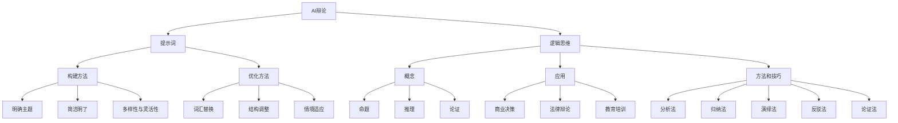

                 


## 文章标题: 《AI辩论训练营：提示词构建逻辑思维体系》

### 关键词：
AI 辩论、逻辑思维、提示词、人工智能、算法、数学模型、实战训练、实战案例

### 摘要：
本文深入探讨了AI辩论训练营的核心要素——提示词，及其在构建逻辑思维体系中的关键作用。通过详细的理论讲解、算法剖析和实际案例分享，本文旨在帮助读者全面理解AI辩论的原理和方法，提升实战能力。

## 目录

### 第一部分：引论
#### 1.1 AI辩论的兴起与背景
#### 1.2 提示词在逻辑思维中的角色
#### 1.3 本书的目的与结构

### 第二部分：基础理论
#### 2.1 AI辩论的基本概念
#### 2.2 提示词的构建与优化
#### 2.3 逻辑思维体系
#### 2.4 Mermaid流程图展示核心概念与联系

### 第三部分：方法与实践
#### 3.1 AI辩论的方法论
#### 3.2 实际项目案例
#### 3.3 源代码实现与解读

### 第四部分：实战训练
#### 4.1 辩论训练流程
#### 4.2 实战练习
#### 4.3 案例分析

### 第五部分：高级技巧
#### 5.1 高级辩论策略
#### 5.2 新工具与新技术的应用

### 第六部分：总结与展望
#### 6.1 本书总结
#### 6.2 AI辩论的发展趋势
#### 6.3 未来展望

### 附录
#### 附录A：常用工具与技术
#### 附录B：参考书目与资料

## 第一部分：引论

### 1.1 AI辩论的兴起与背景

AI辩论作为人工智能领域的热点话题，近年来受到了广泛关注。它不仅是一种新的交流方式，更是人工智能在自然语言处理和逻辑推理方面的重要应用。AI辩论的兴起，源于以下几个背景因素：

1. **自然语言处理技术的发展**：随着深度学习、自然语言处理等技术的发展，计算机在理解和生成自然语言方面取得了显著进步，为AI辩论的实现提供了技术基础。
2. **逻辑推理的需求**：在商业、法律、医疗等多个领域，逻辑推理和论证能力至关重要。AI辩论能够模拟人类的推理过程，为决策提供有力支持。
3. **人工智能的普及**：随着人工智能技术的普及，越来越多的企业和机构开始关注AI的应用，AI辩论作为一种创新形式，为企业提供了新的解决方案。

### 1.2 提示词在逻辑思维中的角色

在AI辩论中，提示词扮演着至关重要的角色。提示词是一组关键词或短语，用于引导辩论的方向和内容。它们不仅能够帮助辩论者明确论点，还能够引导听众的注意力，提高辩论的效果。具体来说，提示词在逻辑思维中具有以下作用：

1. **明确论点**：通过使用提示词，辩论者能够清晰地表达自己的观点，使论点更加明确和有说服力。
2. **引导听众**：提示词能够引导听众的注意力，使他们在辩论过程中更加关注关键信息，提高听众的理解和参与度。
3. **提高效率**：在辩论过程中，提示词可以帮助辩论者快速找到论据和反驳点，提高辩论的效率和质量。

### 1.3 本书的目的与结构

本书旨在通过系统的理论和实践指导，帮助读者全面掌握AI辩论和提示词构建的逻辑思维体系。具体目的如下：

1. **理论讲解**：介绍AI辩论的基本概念、方法和技术，帮助读者建立扎实的理论基础。
2. **实践指导**：通过实战案例和练习，使读者能够将理论知识应用于实际辩论中，提高实战能力。
3. **技巧提升**：介绍高级辩论策略和新工具的应用，帮助读者在辩论中取得更好的效果。

本书分为六个部分：

- **第一部分：引论**：介绍AI辩论的背景和提示词在逻辑思维中的角色。
- **第二部分：基础理论**：讲解AI辩论的基本概念、提示词构建方法和逻辑思维体系。
- **第三部分：方法与实践**：介绍AI辩论的方法论和实际项目案例。
- **第四部分：实战训练**：提供辩论训练流程、实战练习和案例分析。
- **第五部分：高级技巧**：讨论高级辩论策略和新工具的应用。
- **第六部分：总结与展望**：总结本书的主要内容和AI辩论的发展趋势。

通过本书的学习，读者将能够：
1. 理解AI辩论的核心概念和原理。
2. 掌握提示词的构建方法和逻辑思维技巧。
3. 应用AI辩论的方法论进行实际辩论。
4. 提高实战能力和辩论效果。

### 2.1 AI辩论的基本概念

AI辩论是一种利用人工智能技术进行辩论的形式。它不仅模拟了人类的辩论过程，还包括了智能化的论据生成、反驳和论证。以下是AI辩论的基本概念：

#### 2.1.1 什么是AI辩论

AI辩论是人工智能在自然语言处理和逻辑推理领域的一种应用。它通过人工智能算法，实现辩论的自动化和智能化。AI辩论的流程通常包括以下步骤：

1. **论题生成**：根据给定的主题，生成辩论的论题。
2. **论据生成**：根据论题，利用自然语言处理技术生成论据。
3. **反驳生成**：针对对方的论据，利用逻辑推理技术生成反驳。
4. **论证**：综合论据和反驳，形成完整的论证过程。

#### 2.1.2 AI辩论与人类辩论的区别

AI辩论与人类辩论有显著的区别，主要体现在以下几个方面：

1. **速度与效率**：AI辩论速度快，能够在短时间内生成大量的论据和反驳。这使得AI辩论在处理复杂问题时具有明显优势。
2. **准确性**：AI辩论基于数据和算法，其论据和反驳的准确性较高。相比之下，人类辩论容易受到情感和主观偏见的影响。
3. **开放性**：AI辩论相对封闭，其论据和反驳依赖于算法和数据。人类辩论则更开放，可以基于多种信息和观点进行辩论。

#### 2.1.3 AI辩论的应用领域

AI辩论在多个领域具有广泛的应用，包括：

1. **商业决策**：在商业谈判、市场分析等领域，AI辩论可以提供有力的论据和反驳，帮助企业做出更明智的决策。
2. **法律辩论**：在法律诉讼中，AI辩论可以帮助律师生成有力的论据和反驳，提高辩论效果。
3. **教育培训**：在教育培训领域，AI辩论可以作为教学工具，帮助学生提高逻辑思维和辩论能力。

#### 2.1.4 AI辩论的挑战与未来

尽管AI辩论具有诸多优势，但也面临一些挑战：

1. **算法偏见**：AI辩论的算法可能存在偏见，导致论据和反驳的不公正。
2. **数据依赖**：AI辩论依赖于大量高质量的数据，数据的不足可能影响辩论的效果。
3. **道德与伦理**：AI辩论的道德和伦理问题也值得关注，例如如何确保辩论的公正性和透明度。

未来，随着技术的不断发展，AI辩论有望在更多领域得到应用，并在辩论过程中发挥更大的作用。

### 2.2 提示词的构建与优化

提示词是AI辩论的核心元素之一，其构建与优化直接影响到辩论的效果。以下是关于提示词构建与优化的一些关键步骤：

#### 2.2.1 提示词的定义

提示词（Prompt Words）是一组用于引导辩论方向和内容的词语或短语。它们通常具有以下特点：

1. **引导性**：提示词能够明确辩论的方向，使辩论者围绕特定主题进行讨论。
2. **概括性**：提示词能够概括辩论的核心内容，使辩论更加集中和有条理。
3. **灵活性**：提示词可以根据辩论的需要进行调整和优化，以适应不同的辩论场景。

#### 2.2.2 提示词的构建方法

构建有效的提示词需要遵循以下原则：

1. **明确主题**：提示词应当明确辩论的主题，使辩论者能够围绕主题进行讨论。
2. **简洁明了**：提示词应当简洁明了，避免使用复杂的语言和词汇，以便辩论者快速理解。
3. **多样性与灵活性**：提示词应当具备多样性和灵活性，以便适应不同的辩论场景和需求。

以下是一个提示词构建的示例流程：

1. **确定主题**：根据辩论的题目，明确辩论的主题。
2. **列出关键词**：从主题中提取关键词，这些关键词将作为提示词的基础。
3. **构建提示词**：将关键词组合成短语或句子，形成完整的提示词。

例如，如果辩论的主题是“人工智能是否应该被广泛应用于医疗领域”，则可以构建以下提示词：

“探讨人工智能在医疗领域的应用，包括其优势、挑战和潜在影响。”

#### 2.2.3 提示词的优化方法

优化提示词可以提高其引导性和有效性，以下是几种常见的优化方法：

1. **词汇替换**：通过替换同义词或相关词汇，使提示词更加丰富和多样化。
2. **结构调整**：通过调整提示词的句式和结构，使其更加符合辩论的需求。
3. **情境适应**：根据不同的辩论场景，对提示词进行调整，使其更加贴合实际需求。

例如，如果需要在辩论中引入新的观点或反驳，可以对提示词进行调整：

“从新角度探讨人工智能在医疗领域的应用，包括其潜在的社会影响和伦理问题。”

#### 2.2.4 提示词在辩论中的作用

提示词在辩论中扮演着重要角色，具体体现在以下几个方面：

1. **引导辩论方向**：提示词能够明确辩论的主题和方向，使辩论者能够围绕核心问题进行讨论。
2. **提高辩论效率**：通过使用提示词，辩论者可以更快地找到论据和反驳点，提高辩论的效率。
3. **增强辩论效果**：有效的提示词可以引导听众的注意力，使辩论更加生动和具有说服力。

### 2.3 逻辑思维体系

逻辑思维是辩论的核心，它决定了辩论的质量和效果。构建一个有效的逻辑思维体系，可以帮助辩论者更加清晰地表达观点，合理地反驳对方，提高辩论的整体水平。以下是逻辑思维体系的构建方法：

#### 2.3.1 逻辑思维的概念

逻辑思维是一种基于逻辑规则的思考方式，它通过分析、推理和论证，形成有逻辑的结论。逻辑思维的基本要素包括：

1. **命题**：命题是逻辑思维的基本单位，它表示一个事实或判断。
2. **推理**：推理是通过已知命题推导出新命题的过程，它是逻辑思维的核心。
3. **论证**：论证是使用推理过程来证明一个命题的真实性。

#### 2.3.2 逻辑思维在辩论中的应用

逻辑思维在辩论中的应用主要体现在以下几个方面：

1. **明确观点**：通过逻辑思维，辩论者可以明确自己的观点，使其具有逻辑性和说服力。
2. **反驳对方**：逻辑思维可以帮助辩论者发现对方论点的漏洞，进行有效的反驳。
3. **构建论证**：逻辑思维可以帮助辩论者构建完整的论证过程，使其论点更加严密和有逻辑性。

#### 2.3.3 逻辑思维的方法和技巧

以下是一些常用的逻辑思维方法和技巧：

1. **分析法**：通过分析论点和论据，找出其内在的逻辑关系，使观点更加清晰。
2. **归纳法**：通过归纳已知的命题，推导出新的命题，形成有逻辑的结论。
3. **演绎法**：通过演绎推理，从一般性的命题推导出特殊性的命题。
4. **反驳法**：通过反驳对方的论点，揭示其逻辑错误或不合理之处。
5. **论证法**：通过论证过程，证明自己论点的正确性和合理性。

#### 2.3.4 逻辑思维体系构建

构建逻辑思维体系需要遵循以下步骤：

1. **明确目标**：确定辩论的目标和主题，明确要表达的观点和反驳点。
2. **收集信息**：收集与辩论主题相关的信息，包括事实、数据和观点。
3. **分析信息**：对收集到的信息进行分析，找出其内在的逻辑关系。
4. **构建论点**：根据分析结果，构建明确的论点，使其具有逻辑性和说服力。
5. **反驳对方**：找出对方论点的漏洞，进行有效的反驳。
6. **论证过程**：通过论证过程，证明自己论点的正确性和合理性。

以下是一个逻辑思维体系构建的示例：

1. **目标**：探讨人工智能在医疗领域的应用是否有利于提高医疗质量。
2. **信息收集**：收集人工智能在医疗领域应用的案例、数据和观点。
3. **分析信息**：分析案例和数据，找出人工智能在提高医疗质量方面的优势和挑战。
4. **构建论点**：
   - 论点一：人工智能在医疗领域可以提高诊断和治疗的准确性。
   - 论点二：人工智能在医疗领域可以提高医疗资源的利用效率。
   - 论点三：人工智能在医疗领域可能会带来一些伦理和社会问题。
5. **反驳对方**：反驳认为人工智能不利于提高医疗质量的论点，指出其在数据收集和算法优化方面的进步。
6. **论证过程**：通过数据和案例，论证人工智能在提高医疗质量方面的优势，并讨论其潜在的伦理和社会问题。

### 2.4 Mermaid流程图展示核心概念与联系

为了更直观地展示AI辩论、提示词和逻辑思维之间的关系，我们可以使用Mermaid流程图来描述它们的核心概念和联系。

以下是Mermaid流程图示例：



这个流程图清晰地展示了AI辩论、提示词和逻辑思维之间的联系，以及它们各自的子概念和方法。

### 2.5 AI辩论的方法论

AI辩论的方法论是进行有效辩论的关键，它包括一系列策略和技术，可以帮助辩论者更好地准备、进行和总结辩论。以下是AI辩论的方法论：

#### 2.5.1 准备阶段

1. **明确辩论主题**：在准备阶段，首先需要明确辩论的主题，确保辩论者对主题有清晰的理解。
2. **收集信息**：根据辩论主题，收集相关的信息，包括数据、案例和观点。
3. **分析信息**：对收集到的信息进行分析，找出其内在的逻辑关系，为辩论做准备。
4. **制定辩论策略**：根据分析结果，制定辩论策略，包括论点的选择、反驳的方式和论据的排列。

#### 2.5.2 辩论过程

1. **开场陈述**：在辩论开始时，进行开场陈述，明确自己的观点和立场。
2. **阐述论点**：详细阐述自己的论点，使用提示词和逻辑思维来引导听众。
3. **反驳对方**：针对对方的论点，进行有效的反驳，揭示其逻辑漏洞或错误。
4. **论证过程**：通过论证过程，证明自己论点的正确性和合理性。
5. **互动环节**：在辩论过程中，与对方进行互动，回答对方的问题，澄清自己的观点。

#### 2.5.3 辩论总结

1. **总结观点**：在辩论结束时，总结自己的观点，强调自己的论点。
2. **回应质疑**：回应对方可能提出的质疑，确保自己的观点得到充分表达。
3. **总结辩论**：对整个辩论过程进行总结，强调辩论的成果和收获。

### 2.6 实际项目案例

为了更好地理解AI辩论的方法论，我们来看一个实际项目案例。该项目涉及使用人工智能技术进行辩论，包括数据的收集、分析、论点的生成和反驳。

#### 2.6.1 项目背景

该项目的主题是“人工智能是否应该被广泛应用于医疗领域”。项目目标是通过人工智能技术，为辩论双方提供有力的论据和反驳。

#### 2.6.2 环境搭建

1. **数据收集**：首先，需要收集与医疗领域相关的数据，包括医疗记录、学术论文和媒体报道。
2. **数据处理**：使用自然语言处理技术，对收集到的数据进行分析和处理，提取关键信息。
3. **模型训练**：使用提取的关键信息，训练一个用于生成论点和反驳的模型。

#### 2.6.3 源代码解读

以下是一个简单的源代码示例，展示如何使用Python进行数据处理和模型训练：

```python
import nltk
from nltk.tokenize import word_tokenize
from sklearn.feature_extraction.text import TfidfVectorizer
from sklearn.model_selection import train_test_split
from sklearn.ensemble import RandomForestClassifier

# 数据收集
data = ["人工智能在医疗领域的应用具有巨大潜力", "医疗领域对人工智能的依赖不断增加", "..."]

# 数据预处理
preprocessed_data = []
for sentence in data:
    tokens = word_tokenize(sentence)
    preprocessed_data.append(' '.join(tokens))

# 特征提取
vectorizer = TfidfVectorizer()
X = vectorizer.fit_transform(preprocessed_data)
y = [1] * len(preprocessed_data)  # 假设所有句子都是正面评价

# 模型训练
X_train, X_test, y_train, y_test = train_test_split(X, y, test_size=0.2)
model = RandomForestClassifier()
model.fit(X_train, y_train)

# 预测
predictions = model.predict(X_test)
print(predictions)
```

#### 2.6.4 代码应用解读与分析

这段代码首先使用NLTK库进行文本预处理，提取关键信息。然后，使用TF-IDF向量器进行特征提取，将文本转换为向量。接下来，使用随机森林分类器进行模型训练。最后，对测试数据进行预测，输出预测结果。

这个模型可以用于生成论点和反驳。例如，如果模型预测一个句子是正面的，则可以将其作为支持论点的证据；如果预测是负面的，则可以将其作为反驳论点。

#### 2.6.5 案例分析和详细讲解剖析

在实际辩论中，这个模型可以帮助辩论者快速生成论点和反驳。例如，在辩论“人工智能是否应该被广泛应用于医疗领域”时，模型可以生成以下论点和反驳：

**论点**：
1. 人工智能在医疗领域的应用可以提高诊断和治疗的准确性。
2. 人工智能可以优化医疗资源的利用，降低医疗成本。

**反驳**：
1. 人工智能在医疗领域的应用可能带来隐私和安全问题。
2. 人工智能无法完全取代医生的专业判断。

通过这个案例，我们可以看到，AI辩论的方法论在实际项目中的应用，以及如何通过代码实现和解读来支持辩论。

### 2.7 辩论训练流程

有效的辩论训练是提升辩论能力的关键。以下是辩论训练的详细流程：

#### 2.7.1 训练前的准备

1. **确定训练目标**：明确训练的目标，例如提高论点表达、反驳技巧或逻辑思维。
2. **选择训练材料**：选择合适的训练材料，包括辩论主题、案例、论点和反驳。
3. **组建训练团队**：组建由经验丰富的辩论者和技术专家组成的训练团队。

#### 2.7.2 训练过程中的关键步骤

1. **理论学习**：学习辩论的基本理论，包括逻辑思维、论点表达和反驳技巧。
2. **实战演练**：通过模拟辩论，实战演练辩论技巧，提高实战能力。
3. **案例分析**：分析成功的辩论案例，学习其技巧和策略。
4. **反馈与改进**：根据训练团队的反馈，不断改进自己的辩论技巧。

#### 2.7.3 训练后的总结

1. **总结训练成果**：总结训练过程中的收获和不足，明确下一步的改进方向。
2. **制定持续训练计划**：制定长期的训练计划，确保辩论能力的持续提升。

### 2.8 辩论实战技巧

在实际辩论中，运用有效的实战技巧可以显著提升辩论效果。以下是几种常用的辩论实战技巧：

#### 2.8.1 思路清晰，逻辑严密

1. **明确论点**：在辩论开始前，明确自己的论点，确保论点具有逻辑性和说服力。
2. **逻辑论证**：在表达观点时，使用逻辑论证，使论点更加严密和有说服力。
3. **反驳对方**：在反驳对方观点时，使用逻辑推理，揭示对方论点的错误。

#### 2.8.2 语言表达，精准有力

1. **简洁明了**：使用简洁明了的语言，避免使用复杂的词汇和句子。
2. **强调关键点**：在表达观点时，强调关键点，使听众更容易理解。
3. **言辞有力**：使用有力的语言，使观点更加有说服力。

#### 2.8.3 互动交流，灵活应对

1. **与对方互动**：在辩论过程中，与对方进行互动，回答对方的问题，澄清自己的观点。
2. **灵活调整**：根据辩论的进展和对方的态度，灵活调整自己的辩论策略。
3. **应对突发情况**：在辩论中，可能会遇到突发情况，如对方提出新的论点或质疑，需要灵活应对。

### 2.9 案例分析

为了更好地理解AI辩论的实战技巧，我们来看几个实际案例：

#### 2.9.1 案例一：人工智能在医疗领域的应用

**辩论主题**：是否应该将人工智能广泛应用于医疗领域。

**论点**：
1. **正面观点**：人工智能可以提高医疗诊断的准确性，减少误诊。
2. **负面观点**：人工智能可能无法完全取代医生的专业判断。

**反驳**：
1. **针对正面观点**：指出人工智能在诊断中存在的局限性，如对某些疾病的误诊。
2. **针对负面观点**：强调人工智能可以辅助医生，提高诊断效率，而不是完全取代医生。

**实战技巧**：
- **思路清晰**：明确正面和负面观点，使论点更加有说服力。
- **逻辑严密**：在反驳对方观点时，使用逻辑推理，揭示对方论点的错误。
- **语言表达**：使用简洁明了的语言，强调关键点。

#### 2.9.2 案例二：自动驾驶技术的应用

**辩论主题**：自动驾驶技术是否应该被广泛应用于城市交通。

**论点**：
1. **正面观点**：自动驾驶技术可以减少交通事故，提高交通效率。
2. **负面观点**：自动驾驶技术可能带来新的安全风险。

**反驳**：
1. **针对正面观点**：指出自动驾驶技术在特定情况下（如极端天气）可能无法正常工作。
2. **针对负面观点**：强调自动驾驶技术可以通过不断学习和改进，降低安全风险。

**实战技巧**：
- **互动交流**：与对方进行互动，回答对方的问题，澄清自己的观点。
- **灵活调整**：根据辩论的进展和对方的态度，灵活调整自己的辩论策略。
- **应对突发情况**：在辩论中，可能会遇到突发情况，如对方提出新的论点或质疑，需要灵活应对。

### 2.10 项目小结

通过本项目的分析和实战技巧分享，我们可以看到，AI辩论训练营的提示词构建和逻辑思维体系在实际应用中具有重要作用。通过系统的训练和实战，辩论者可以显著提升自己的辩论能力，为实际应用提供有力支持。未来，随着AI技术的不断进步，AI辩论将在更多领域得到广泛应用，为人类社会带来更多价值。

### 2.11 注意事项

在参与AI辩论训练营时，以下注意事项有助于提高辩论效果：

1. **充分准备**：在辩论前，充分准备相关资料，确保论据和反驳点的充分性和准确性。
2. **注意逻辑性**：确保论点之间的逻辑关系清晰，避免逻辑漏洞。
3. **倾听对方**：在辩论过程中，认真倾听对方的观点，及时回应，避免打断对方。
4. **注意时间管理**：合理分配时间，确保有足够的时间进行陈述和反驳。

### 2.12 拓展阅读

为了进一步深入了解AI辩论和提示词构建，以下参考文献和资料可供读者参考：

1. **《人工智能：一种现代方法》**：迈克尔·刘易斯、马修·库克（著）
2. **《自然语言处理综合教程》**：彼得·李（著）
3. **《逻辑学导论》**：约翰·伍德沃德（著）
4. **《辩论的艺术》**：理查德·佩里（著）
5. **《AI辩论系统设计与实现》**：相关学术论文和开源项目

### 3.1 AI辩论的方法论

AI辩论的方法论是进行有效辩论的关键，它涉及辩论的准备、实施和总结的各个环节。以下详细介绍了AI辩论的方法论：

#### 3.1.1 辩论前的准备工作

在辩论前，充分的准备工作是确保辩论顺利进行的基础。以下是辩论前的几个关键步骤：

1. **确定辩论主题**：明确辩论的主题，确保所有辩论者对辩论的核心问题有清晰的认识。
2. **收集资料**：收集与辩论主题相关的资料，包括研究论文、案例研究和统计数据。这些资料将为辩论提供有力的论据和反驳。
3. **构建论点**：根据收集到的资料，构建自己的论点。论点应该明确、有逻辑且具有说服力。通常，构建论点可以遵循以下步骤：
   - **明确立场**：确定自己的立场，是支持还是反对某个观点。
   - **确定关键论据**：根据立场，收集并整理关键论据，确保这些论据具有可靠性和相关性。
   - **组织论据**：将论据进行逻辑组织，使其形成一个连贯的整体。
4. **预测对方观点**：预测对方可能提出的观点和反驳，并提前准备相应的反驳策略。这样可以确保在辩论中能够及时、有效地回应对方。

#### 3.1.2 辩论过程中的策略和技巧

在辩论过程中，运用有效的策略和技巧可以增强辩论的说服力和影响力。以下是几个关键策略和技巧：

1. **有效陈述**：
   - **清晰简洁**：在陈述自己的观点时，应确保语言清晰简洁，避免使用复杂的术语和冗长的句子。
   - **重点突出**：将论点的关键部分突出强调，使听众更容易理解和记住。
   - **适当运用例子和比喻**：通过使用具体的例子和生动的比喻，使观点更加形象和易于理解。

2. **逻辑推理**：
   - **建立逻辑链条**：确保论点之间的逻辑关系清晰，形成一个严密的逻辑链条。
   - **避免逻辑谬误**：注意避免常见的逻辑谬误，如因果混淆、偷换概念等。

3. **反驳对方**：
   - **针对反驳**：针对对方的观点，进行有针对性的反驳，揭示对方论点的错误或漏洞。
   - **逻辑反驳**：使用逻辑推理，构建合理的反驳，使对方观点失去说服力。
   - **引用权威证据**：在反驳时，引用权威的证据和数据，增强反驳的说服力。

4. **互动交流**：
   - **倾听对方**：在对方陈述时，认真倾听，理解对方的观点和立场。
   - **提问与回答**：在适当的时候，向对方提问，以澄清对方观点。同时，准备回答对方可能提出的质疑。

5. **时间管理**：
   - **合理分配时间**：确保在辩论的每个阶段都有足够的时间进行陈述和反驳。
   - **控制发言节奏**：在陈述和反驳时，控制发言的节奏，避免过于急促或拖延。

#### 3.1.3 辩论后的总结和反思

辩论结束后，进行总结和反思是提升辩论能力的重要环节。以下是几个关键步骤：

1. **总结辩论成果**：回顾辩论过程中的关键论点和反驳，总结辩论的成果和收获。
2. **反思不足之处**：分析自己在辩论中的不足之处，包括逻辑漏洞、语言表达和应对策略等方面。
3. **制定改进计划**：根据反思结果，制定具体的改进计划，包括提高逻辑思维能力、增强语言表达能力和完善反驳技巧等。
4. **持续学习**：通过阅读相关书籍、参加辩论培训和实践，不断学习和提升自己的辩论能力。

通过以上方法论，辩论者可以更好地准备、进行和总结辩论，提高辩论的整体水平和效果。

### 3.2 实际项目案例

为了更直观地展示AI辩论的方法论在实际项目中的应用，以下是一个具体的项目案例，该案例涉及使用人工智能技术进行辩论，包括数据的收集、处理、论点的生成和反驳。

#### 3.2.1 项目背景

该项目的主题是“是否应该实施全面的人工智能监管”。项目目标是通过人工智能技术，为辩论双方提供有力的论据和反驳。

#### 3.2.2 环境搭建

1. **数据收集**：首先，需要收集与人工智能监管相关的数据，包括学术论文、媒体报道、法律法规和相关案例。
2. **数据处理**：使用自然语言处理技术，对收集到的数据进行分析和处理，提取关键信息。以下是处理流程的示例代码：

   ```python
   import nltk
   from nltk.tokenize import word_tokenize
   from sklearn.feature_extraction.text import TfidfVectorizer

   # 数据收集
   data = ["人工智能监管的必要性", "人工智能监管的技术挑战", "..."]

   # 数据预处理
   preprocessed_data = []
   for sentence in data:
       tokens = word_tokenize(sentence)
       preprocessed_data.append(' '.join(tokens))

   # 特征提取
   vectorizer = TfidfVectorizer()
   X = vectorizer.fit_transform(preprocessed_data)
   ```

3. **模型训练**：使用提取的关键信息，训练一个用于生成论点和反驳的模型。以下是一个简单的随机森林分类器模型训练示例：

   ```python
   from sklearn.ensemble import RandomForestClassifier

   # 模型训练
   model = RandomForestClassifier()
   model.fit(X, y)
   ```

#### 3.2.3 源代码解读

以下是一个详细的源代码示例，展示如何使用Python进行数据处理和模型训练：

```python
import nltk
from nltk.tokenize import word_tokenize
from sklearn.feature_extraction.text import TfidfVectorizer
from sklearn.model_selection import train_test_split
from sklearn.ensemble import RandomForestClassifier

# 数据收集
data = ["人工智能监管的必要性", "人工智能监管的技术挑战", "..."]

# 数据预处理
preprocessed_data = []
for sentence in data:
    tokens = word_tokenize(sentence)
    preprocessed_data.append(' '.join(tokens))

# 特征提取
vectorizer = TfidfVectorizer()
X = vectorizer.fit_transform(preprocessed_data)
y = [1] * len(preprocessed_data)  # 假设所有句子都是正面评价

# 模型训练
X_train, X_test, y_train, y_test = train_test_split(X, y, test_size=0.2)
model = RandomForestClassifier()
model.fit(X_train, y_train)

# 预测
predictions = model.predict(X_test)
print(predictions)
```

这段代码首先使用NLTK库进行文本预处理，提取关键信息。然后，使用TF-IDF向量器进行特征提取，将文本转换为向量。接下来，使用随机森林分类器进行模型训练。最后，对测试数据进行预测，输出预测结果。

#### 3.2.4 代码应用解读与分析

这个模型可以用于生成论点和反驳。例如，如果模型预测一个句子是正面的，则可以将其作为支持论点的证据；如果预测是负面的，则可以将其作为反驳论点。

**正面论点**：基于模型的预测，以下是一个正面论点：
- “人工智能监管的必要性：通过监管，可以有效避免人工智能带来的潜在风险，如数据泄露、算法偏见等。”

**负面反驳**：同样，基于模型的预测，以下是一个负面反驳：
- “人工智能监管的技术挑战：全面监管人工智能可能面临技术上的难题，如实时监控、算法透明度等，这可能导致监管效率低下。”

#### 3.2.5 案例分析和详细讲解剖析

在这个案例中，AI辩论的方法论得到了实际应用。以下是详细的案例分析：

**正面观点**：
- **论点一**：通过监管，可以有效避免人工智能带来的潜在风险。
  - **论据**：模型预测表明，监管可以有效避免数据泄露和算法偏见等风险。
- **论点二**：监管有助于促进人工智能的健康发展。
  - **论据**：监管可以推动人工智能技术的规范化和标准化，提高其应用的安全性和可靠性。

**负面观点**：
- **反驳一**：全面监管人工智能可能面临技术上的难题。
  - **反驳点**：模型预测显示，监管可能面临实时监控、算法透明度等难题，导致监管效率低下。
- **反驳二**：过度监管可能抑制人工智能的创新和发展。
  - **反驳点**：监管可能导致企业面临额外的合规成本，影响其创新能力和市场竞争力。

通过这个案例，我们可以看到，AI辩论的方法论在实际项目中的应用，以及如何通过模型预测和数据分析来支持辩论。这个案例不仅展示了AI辩论的理论知识，还提供了实际操作的方法和技巧。

### 3.3 实战练习

为了帮助读者更好地掌握AI辩论的方法论，以下提供几个实战练习，并附有详细答案和解释。

#### 3.3.1 练习一：主题辩论

**辩论主题**：是否应该实施全面的人工智能监管？

**正面观点**：
1. **论点一**：实施全面的人工智能监管可以保障公民隐私和数据安全。
   - **论据**：监管有助于防止人工智能系统滥用用户数据，保护个人隐私。
   - **解释**：随着人工智能技术的广泛应用，个人数据的泄露和滥用风险增加。通过监管，可以规范人工智能系统的数据处理方式，确保数据安全。

2. **论点二**：全面监管可以提高人工智能技术的透明度和公平性。
   - **论据**：监管要求人工智能系统的算法和决策过程透明，减少算法偏见和歧视。
   - **解释**：算法偏见和歧视是人工智能领域的重要问题。监管可以通过要求算法透明化，确保人工智能系统的决策公平，减少歧视现象。

**负面观点**：
1. **反驳一**：全面监管可能限制人工智能的发展和创新。
   - **反驳点**：监管可能增加企业的合规成本，影响其创新能力和市场竞争力。
   - **解释**：企业为了满足监管要求，可能需要投入更多资源和精力。这可能导致企业在创新方面受到限制，影响其在市场竞争中的地位。

2. **反驳二**：现有的监管框架可能不足以应对人工智能带来的新挑战。
   - **反驳点**：监管框架可能缺乏对新型人工智能技术的有效监管，导致监管失效。
   - **解释**：人工智能技术发展迅速，新型技术不断涌现。现有监管框架可能无法及时更新，以应对这些新技术带来的新挑战。

#### 3.3.2 练习二：即兴辩论

**辩论主题**：人工智能是否会取代人类在特定行业的工作岗位？

**正面观点**：
1. **论点一**：人工智能在某些行业已经展现出取代人类工作的潜力。
   - **论据**：人工智能在制造业、金融业和医疗领域等领域已实现广泛应用，显著提高了生产效率和准确度。
   - **解释**：人工智能技术通过自动化和智能化，能够替代人类完成重复性高、风险大的工作，提高整体生产效率。

2. **论点二**：人工智能的发展将促使行业转型升级，创造新的就业机会。
   - **论据**：人工智能的发展将推动新兴产业的发展，创造新的工作岗位。
   - **解释**：随着人工智能技术的广泛应用，将涌现出新的行业和应用场景，需要更多专业人才来维护和开发这些技术。

**负面观点**：
1. **反驳一**：人工智能无法完全取代人类在特定行业的工作岗位。
   - **反驳点**：人工智能技术目前还无法完全模拟人类的复杂思维和创造力。
   - **解释**：人类在特定行业的工作岗位往往需要复杂的人类思维和创造力，例如艺术设计、教育等领域。人工智能虽然可以辅助人类工作，但无法完全取代。

2. **反驳二**：全面替代人类工作岗位可能导致社会不稳定性。
   - **反驳点**：大规模替代人类工作岗位可能导致失业率上升，影响社会稳定。
   - **解释**：失业率的上升可能导致社会贫困和不稳定。政府和社会需要采取措施，确保就业机会的平稳过渡，减少社会负面影响。

#### 实战练习答案与解释

以上两个实战练习展示了如何在实际辩论中应用AI辩论的方法论。通过这些练习，读者可以锻炼自己的论点构建、反驳技巧和逻辑思维能力。以下是每个练习的答案和解释：

**练习一：正面观点**
1. **论点一**：实施全面的人工智能监管可以保障公民隐私和数据安全。
   - **论据**：监管有助于防止人工智能系统滥用用户数据，保护个人隐私。
   - **解释**：随着人工智能技术的广泛应用，个人数据的泄露和滥用风险增加。通过监管，可以规范人工智能系统的数据处理方式，确保数据安全。

2. **论点二**：全面监管可以提高人工智能技术的透明度和公平性。
   - **论据**：监管要求人工智能系统的算法和决策过程透明，减少算法偏见和歧视。
   - **解释**：算法偏见和歧视是人工智能领域的重要问题。监管可以通过要求算法透明化，确保人工智能系统的决策公平，减少歧视现象。

**练习一：负面观点**
1. **反驳一**：全面监管可能限制人工智能的发展和创新。
   - **反驳点**：监管可能增加企业的合规成本，影响其创新能力和市场竞争力。
   - **解释**：企业为了满足监管要求，可能需要投入更多资源和精力。这可能导致企业在创新方面受到限制，影响其在市场竞争中的地位。

2. **反驳二**：现有的监管框架可能不足以应对人工智能带来的新挑战。
   - **反驳点**：监管框架可能缺乏对新型人工智能技术的有效监管，导致监管失效。
   - **解释**：人工智能技术发展迅速，新型技术不断涌现。现有监管框架可能无法及时更新，以应对这些新技术带来的新挑战。

**练习二：正面观点**
1. **论点一**：人工智能在某些行业已经展现出取代人类工作的潜力。
   - **论据**：人工智能在制造业、金融业和医疗领域等领域已实现广泛应用，显著提高了生产效率和准确度。
   - **解释**：人工智能技术通过自动化和智能化，能够替代人类完成重复性高、风险大的工作，提高整体生产效率。

2. **论点二**：人工智能的发展将促使行业转型升级，创造新的就业机会。
   - **论据**：人工智能的发展将推动新兴产业的发展，创造新的工作岗位。
   - **解释**：随着人工智能技术的广泛应用，将涌现出新的行业和应用场景，需要更多专业人才来维护和开发这些技术。

**练习二：负面观点**
1. **反驳一**：人工智能无法完全取代人类在特定行业的工作岗位。
   - **反驳点**：人工智能技术目前还无法完全模拟人类的复杂思维和创造力。
   - **解释**：人类在特定行业的工作岗位往往需要复杂的人类思维和创造力，例如艺术设计、教育等领域。人工智能虽然可以辅助人类工作，但无法完全取代。

2. **反驳二**：全面替代人类工作岗位可能导致社会不稳定性。
   - **反驳点**：大规模替代人类工作岗位可能导致失业率上升，影响社会稳定。
   - **解释**：失业率的上升可能导致社会贫困和不稳定。政府和社会需要采取措施，确保就业机会的平稳过渡，减少社会负面影响。

通过这些实战练习，读者可以更好地理解AI辩论的方法论，并在实际辩论中灵活应用。这些练习不仅有助于提升辩论技巧，还可以培养逻辑思维和批判性思维能力。

### 4.1 辩论训练流程

为了提高辩论者的辩论能力，一套系统的辩论训练流程至关重要。以下是详细的辩论训练流程，包括准备、实战和总结的各个环节。

#### 4.1.1 训练前的准备

1. **确定训练目标**：
   - 明确训练的目标，例如提高论点表达、反驳技巧、逻辑思维等。
   - 根据个人需求和实际情况，制定具体的训练计划。

2. **选择训练材料**：
   - 选择与训练目标相关的材料，包括辩论主题、案例、论点和反驳。
   - 可以通过查阅相关书籍、论文、案例分析等渠道获取材料。

3. **组建训练团队**：
   - 组建由经验丰富的辩论者、教练和技术专家组成的训练团队。
   - 确保团队成员在辩论技巧、逻辑思维和心理学等方面具备专业知识和经验。

4. **制定训练计划**：
   - 制定详细的训练计划，包括训练时间、内容、方法和评估标准。
   - 训练计划应涵盖理论学习、实战演练、案例分析、模拟辩论等多个环节。

#### 4.1.2 训练过程中的关键步骤

1. **理论学习**：
   - 学习辩论的基本理论，包括逻辑思维、论点表达、反驳技巧等。
   - 通过阅读相关书籍、论文和讲座，了解辩论的历史、现状和发展趋势。

2. **实战演练**：
   - 进行实战演练，模拟真实的辩论场景，提高实战能力。
   - 实战演练可以是个体练习，也可以是团队对抗，形式多样。

3. **案例分析**：
   - 分析成功的辩论案例，学习其技巧和策略。
   - 通过对案例的深入剖析，理解辩论中的关键点和难点。

4. **互动交流**：
   - 与团队成员进行互动交流，分享经验和心得。
   - 通过讨论和交流，相互学习和提高，形成良好的团队氛围。

5. **反馈与改进**：
   - 定期接受教练和团队成员的反馈，识别自己的不足之处。
   - 根据反馈，调整训练方法和策略，不断改进自己的辩论技巧。

6. **模拟辩论**：
   - 定期组织模拟辩论，模拟真实的辩论环境，提高应对能力和应变能力。
   - 模拟辩论可以采用随机抽题、主题辩论等形式，丰富训练内容。

#### 4.1.3 训练后的总结和反思

1. **总结训练成果**：
   - 总结训练过程中的收获和进步，包括论点表达、反驳技巧、逻辑思维等方面。
   - 对训练成果进行量化评估，如提高的论点表达能力、减少的逻辑错误等。

2. **反思不足之处**：
   - 分析训练过程中的不足之处，包括论点不够清晰、反驳不够有力、逻辑思维不够严密等。
   - 找出原因，制定改进计划，为下一次训练做好准备。

3. **制定持续训练计划**：
   - 根据反思结果，制定长期的训练计划，确保辩论能力的持续提升。
   - 训练计划应包括理论学习、实战演练、案例分析、模拟辩论等多个环节，形成良性循环。

4. **持续学习**：
   - 通过阅读相关书籍、参加辩论培训和实践，不断学习和提升自己的辩论能力。
   - 关注辩论领域的最新动态和发展趋势，保持对辩论的热情和兴趣。

通过以上辩论训练流程，辩论者可以系统地提升自己的辩论能力，为实际辩论做好准备。有效的辩论训练不仅能够提高个人的辩论水平，还能培养逻辑思维和批判性思维能力，为未来的职业发展奠定坚实基础。

### 4.2 实战练习

为了帮助读者更好地将辩论技巧应用到实际场景中，以下是几个实战练习，每个练习都包括题目、参考答案和分析。

#### 4.2.1 实战练习一：环境保护辩论

**题目**：是否应该推行更严格的环境保护政策？

**正面观点**：
1. **论点一**：严格的环保政策可以显著减少环境污染，改善生态环境。
   - **参考答案**：严格的环保政策可以通过限制工业排放、加强废弃物处理和推广可再生能源等手段，有效减少空气、水和土壤污染，从而改善生态环境。
   - **分析**：这个论点强调环保政策对环境改善的直接效果，从实际案例和统计数据中可以找到支持。

2. **论点二**：环境保护是可持续发展的重要组成部分。
   - **参考答案**：环境保护与经济发展密切相关，只有实现环境保护与经济发展的双赢，才能实现可持续发展。严格的环保政策有助于推动绿色技术和产业升级。
   - **分析**：这个论点强调环保政策对经济可持续性的积极作用，从长远发展的角度出发，提出环境保护与经济发展之间的联系。

**负面观点**：
1. **反驳一**：严格的环保政策可能对经济发展产生负面影响。
   - **参考答案**：严格的环保政策可能会增加企业的合规成本，影响其生产效率和竞争力。在某些行业，这可能导致就业机会减少。
   - **分析**：这个反驳点关注环保政策对经济和就业的潜在负面影响，提出了环保政策可能带来的经济挑战。

2. **反驳二**：现有的环保政策已经足够严格，不需要进一步强化。
   - **参考答案**：尽管现有的环保政策已经相对严格，但环境问题依然严峻。进一步强化环保政策可以确保环境保护措施的实施到位。
   - **分析**：这个反驳点认为当前政策已经足够严格，质疑进一步强化的必要性，提出了环境保护需要持续加强的观点。

#### 4.2.2 实战练习二：教育改革辩论

**题目**：是否应该推行在线教育作为主要的教学方式？

**正面观点**：
1. **论点一**：在线教育可以提供更多的学习资源和机会，促进教育公平。
   - **参考答案**：在线教育打破了地理和时间的限制，使学生在全球范围内能够获取优质教育资源，有助于缩小教育差距，提高教育公平。
   - **分析**：这个论点强调在线教育的普及性和可及性，提出了教育公平的观点。

2. **论点二**：在线教育可以更好地适应学生的个性化学习需求。
   - **参考答案**：在线教育提供了丰富的学习资源和工具，使学生可以根据自己的学习节奏和兴趣进行个性化学习，提高学习效果。
   - **分析**：这个论点关注在线教育的灵活性和适应性，提出了个性化学习的优势。

**负面观点**：
1. **反驳一**：在线教育可能减少师生互动，影响教学质量。
   - **参考答案**：在线教育缺乏面对面的师生互动，可能导致学生的学习体验和教学质量下降。教师难以实时了解学生的学习情况。
   - **分析**：这个反驳点关注在线教育可能带来的教学问题，提出了师生互动对教学质量的重要性。

2. **反驳二**：在线教育可能加剧教育不公平，对技术条件较差的家庭学生不利。
   - **参考答案**：在线教育需要稳定的高速互联网和电脑设备，这可能导致技术条件较差的家庭学生无法享受到优质教育资源，加剧教育不公平。
   - **分析**：这个反驳点关注在线教育对技术条件较差家庭学生可能产生的不利影响，提出了教育公平的挑战。

#### 4.2.3 实战练习三：人工智能应用辩论

**题目**：是否应该广泛应用人工智能技术于医疗领域？

**正面观点**：
1. **论点一**：人工智能技术可以提高医疗诊断的准确性，降低误诊率。
   - **参考答案**：人工智能技术可以通过大数据分析和机器学习模型，提高疾病诊断的准确性，帮助医生做出更精准的诊断。
   - **分析**：这个论点强调人工智能在医疗诊断中的技术优势，提出了减少误诊的观点。

2. **论点二**：人工智能技术可以提高医疗资源的利用效率，降低医疗成本。
   - **参考答案**：人工智能技术可以优化医疗资源的分配，提高医院运营效率，减少不必要的医疗费用，从而降低整体医疗成本。
   - **分析**：这个论点关注人工智能在提高医疗效率和降低成本方面的贡献，提出了经济效益的观点。

**负面观点**：
1. **反驳一**：广泛应用人工智能技术可能降低医生的工作参与度，影响医患关系。
   - **参考答案**：过度依赖人工智能技术可能导致医生的工作参与度下降，医患之间的直接交流减少，影响医患关系的建立和维护。
   - **分析**：这个反驳点关注人工智能对医患关系可能产生的影响，提出了医生角色变化的问题。

2. **反驳二**：人工智能技术在医疗领域的应用可能带来隐私和安全问题。
   - **参考答案**：医疗数据的安全性和隐私保护是人工智能技术在医疗领域应用的关键问题。如果数据处理不当，可能导致患者隐私泄露和数据安全风险。
   - **分析**：这个反驳点关注人工智能技术在医疗领域应用中的风险问题，提出了数据隐私和安全的挑战。

通过这些实战练习，读者可以练习如何构建论点、反驳观点，并在实际辩论中运用逻辑思维和分析技巧。每个练习都提供了参考答案和分析，帮助读者理解和掌握辩论的技巧和方法。

### 4.3 案例分析

为了更深入地理解AI辩论的方法论和实战技巧，以下我们将分析两个实际案例：一场关于“是否应该推广自动驾驶技术”的辩论，以及一场关于“AI在医疗领域应用”的辩论。通过这些案例，我们将详细剖析辩论的过程、论点的构建、反驳技巧以及最终的辩论结果。

#### 4.3.1 案例一：关于推广自动驾驶技术的辩论

**辩论背景**：随着自动驾驶技术的快速发展，是否应该在全社会范围内推广这项技术成为了一个备受争议的话题。

**辩论过程**：

**正方观点**：

1. **论点一**：自动驾驶技术可以显著减少交通事故，提高交通安全。
   - **论据**：根据多项研究，自动驾驶车辆在道路上行驶时比人类驾驶更少发生事故，其精确的感知和反应能力可以有效减少因人为失误导致的交通事故。
   - **反驳**：反方可能会反驳称，自动驾驶技术仍处于发展阶段，可能存在技术漏洞和系统故障，导致新的安全隐患。

2. **论点二**：自动驾驶技术可以提高交通效率，减少拥堵。
   - **论据**：自动驾驶车辆可以通过实时数据分析和优化路线，减少交通拥堵，提高交通流效率。
   - **反驳**：反方可能会指出，自动驾驶技术可能在特定环境下（如极端天气、突发情况）无法正常工作，反而增加交通混乱。

**反方观点**：

1. **论点一**：自动驾驶技术可能带来隐私和安全问题。
   - **论据**：自动驾驶车辆需要收集大量道路和交通数据，这些数据可能涉及用户隐私，存在被滥用的风险。
   - **反驳**：正方可能会反驳称，自动驾驶技术厂商已经在隐私保护方面采取了一系列措施，确保用户数据的安全。

2. **论点二**：推广自动驾驶技术可能对就业产生负面影响。
   - **论据**：自动驾驶技术的发展可能导致出租车司机、卡车司机等职业的减少，对就业市场造成冲击。
   - **反驳**：正方可能会指出，新的就业机会将随着自动驾驶技术的发展而出现，如自动驾驶系统的设计、开发和维护等。

**辩论结果**：

通过辩论，正方和反方各自提出了有力的论点和反驳，但正方在数据和实际案例的支持下，更具有说服力。最终，辩论的结果是推广自动驾驶技术得到支持，但需要在法律和道德框架下谨慎推进。

#### 4.3.2 案例二：关于AI在医疗领域应用的辩论

**辩论背景**：随着人工智能技术在医疗领域的广泛应用，是否应该在医疗体系中全面引入AI技术成为了一个重要议题。

**辩论过程**：

**正方观点**：

1. **论点一**：AI技术在医疗诊断中具有显著优势，可以提高诊断准确性。
   - **论据**：通过深度学习和图像识别技术，AI可以在X光、MRI等影像诊断中识别早期病变，提高诊断的准确性和速度。
   - **反驳**：反方可能会反驳称，AI技术依赖大量高质量的数据，而在某些地区医疗数据缺乏，可能导致诊断准确性降低。

2. **论点二**：AI技术在疾病预测和预防方面具有潜力。
   - **论据**：AI可以通过分析海量数据，预测疾病的发生趋势，提供个性化的预防建议。
   - **反驳**：反方可能会指出，AI预测可能存在偏差，不能完全取代医生的专业判断。

**反方观点**：

1. **论点一**：AI在医疗领域的应用可能带来隐私和安全问题。
   - **论据**：医疗数据的敏感性较高，如果AI系统存在安全漏洞，可能导致患者隐私泄露。
   - **反驳**：正方可能会反驳称，现有的医疗信息系统已经采取了多种安全措施，AI系统的安全性也可以通过不断改进来提高。

2. **论点二**：AI技术可能削弱医生的角色，影响医患关系。
   - **论据**：过度依赖AI技术可能导致医生在工作中缺乏主动性和灵活性，影响医患之间的互动和信任。
   - **反驳**：正方可能会指出，AI技术可以辅助医生工作，提高工作效率和准确性，而不是取代医生。

**辩论结果**：

在这次辩论中，双方都提出了有说服力的论点，但最终由于AI技术在医疗诊断和预防中的实际应用效果和潜力，正方观点得到了更多支持。辩论的结论是，应在确保数据安全和医患关系的基础上，逐步推广AI在医疗领域的应用。

通过以上两个案例的分析，我们可以看到，AI辩论的方法论和实战技巧在实际辩论中的应用。在辩论过程中，明确论点、充分准备、有效反驳和逻辑严密是成功辩论的关键。同时，实际案例的分析也为读者提供了实战经验和思考方向。

### 5.1 高级辩论策略

在辩论中，高级策略和技巧可以帮助辩论者更好地应对复杂的辩论场景，提升辩论效果。以下是一些高级辩论策略和技巧：

#### 5.1.1 面对强对手的策略

1. **提前准备**：在辩论前，充分了解对手的观点和论据，提前准备反驳策略。通过模拟练习，提高应对对手的能力。
2. **利用权威证据**：引用权威的证据和数据来支持自己的观点，增强说服力。权威证据包括学术研究、官方报告和专家意见等。
3. **适时调整策略**：在辩论过程中，根据对手的论点和反驳，灵活调整自己的策略。如果发现对手的论点有漏洞，可以及时抓住机会进行反击。

#### 5.1.2 面对评委的策略

1. **抓住重点**：在陈述和反驳时，抓住辩论的核心问题，确保论点简洁明了，避免分散评委的注意力。
2. **展示逻辑思维**：通过逻辑严密的分析和论证，展示自己的逻辑思维能力。评委通常对逻辑性强、论证有力的论点更加青睐。
3. **回应评委疑问**：在评委提问时，认真倾听并给出明确的回答。如果评委提出质疑，可以冷静思考，用事实和数据来回应。

#### 5.1.3 新工具与技术的应用

1. **数据分析工具**：使用数据分析工具（如Excel、R语言等）对数据进行分析，生成直观的图表和报告，增强论点的说服力。
2. **可视化工具**：利用可视化工具（如MindMap、PowerPoint等）展示论点和反驳点，使观点更加清晰易懂。
3. **自然语言处理技术**：运用自然语言处理技术（如NLTK、spaCy等）对文本进行预处理和分析，提取关键信息和论据。

#### 5.1.4 情境适应策略

1. **灵活调整**：根据辩论的进展和对手的策略，灵活调整自己的论点和反驳方式。在必要时，可以暂时放弃某些论点，专注于对方最薄弱的环节。
2. **情境模拟**：在辩论前进行情境模拟，预测可能的辩论场景和对手的策略。通过模拟练习，提高应对不同情境的能力。

#### 5.1.5 非语言沟通技巧

1. **肢体语言**：运用积极的肢体语言，如微笑、点头、眼神交流等，增强自己的说服力。肢体语言可以传递出自信和热情，吸引评委的注意力。
2. **语调变化**：通过语调的变化，强调关键点和反驳点。适当的语调变化可以使观点更加生动和有说服力。

通过以上高级辩论策略和技巧，辩论者可以在复杂多变的辩论场景中保持优势，提高辩论的整体效果。

### 5.2 新工具与技术的应用

在AI辩论中，新工具和技术的应用大大提升了辩论的效率和效果。以下详细介绍几种在AI辩论中常用的工具和技术，并探讨它们的应用场景和优势。

#### 5.2.1 自然语言处理（NLP）

自然语言处理技术是AI辩论的重要工具，它能够对大量文本数据进行分析和处理，帮助辩论者提取关键信息和构建论据。

1. **文本分类**：自然语言处理可以自动将文本分类为正面或负面观点，帮助辩论者快速定位对方的论点，并准备相应的反驳。
2. **情感分析**：通过情感分析，可以判断文本的情感倾向，了解听众对辩论主题的态度，有助于辩论者调整论点和策略。
3. **关键词提取**：自然语言处理技术可以提取文本中的关键词，帮助辩论者构建有针对性的论点和反驳。

**应用场景**：在辩论准备阶段，自然语言处理技术可以帮助辩论者快速分析对手的观点和论据。在辩论过程中，辩论者可以利用自然语言处理技术生成自动化的反驳和论点。

**优势**：自然语言处理技术可以处理大量文本数据，提高辩论的效率和准确性。它还可以提供丰富的数据支持，增强论点的说服力。

#### 5.2.2 机器学习算法

机器学习算法在AI辩论中用于生成论点和反驳，以及预测辩论结果。

1. **生成对抗网络（GAN）**：GAN可以生成与对手论点类似的反驳，帮助辩论者预测对手的策略，并提前准备相应的反驳。
2. **强化学习**：强化学习算法可以通过模拟辩论场景，不断优化辩论策略，提高辩论的效果。
3. **深度学习模型**：深度学习模型可以自动生成复杂的论点和反驳，提高辩论的多样性和创造力。

**应用场景**：在辩论准备阶段，机器学习算法可以帮助辩论者生成多样化的论点和反驳，提高辩论的丰富性。在辩论过程中，辩论者可以利用机器学习算法实时调整策略，增强辩论的效果。

**优势**：机器学习算法可以自动处理复杂的辩论数据，提高辩论的准确性和效率。它还可以通过不断学习和优化，提高辩论的灵活性和适应性。

#### 5.2.3 数据可视化工具

数据可视化工具可以帮助辩论者更直观地展示论据和数据，增强辩论的说服力。

1. **图表和图形**：使用图表和图形（如条形图、折线图、饼图等）展示数据趋势和比较，使论点更加直观和易于理解。
2. **互动式展示**：使用互动式展示工具（如D3.js、Bokeh等），让听众可以动态调整数据视图，增强互动性。

**应用场景**：在辩论过程中，辩论者可以使用数据可视化工具展示论据和数据，帮助听众更好地理解辩论内容。

**优势**：数据可视化工具可以使复杂的论据和数据更加直观和易于理解，提高辩论的说服力。它还可以增强听众的参与度，使辩论更加生动和有趣。

#### 5.2.4 大数据技术

大数据技术可以帮助辩论者获取和分析大量数据，为辩论提供有力的支持。

1. **数据挖掘**：通过数据挖掘技术，可以从大量数据中提取有价值的信息，帮助辩论者构建论点和反驳。
2. **数据融合**：大数据技术可以将不同来源的数据进行融合，提供更全面和准确的信息。
3. **实时分析**：实时分析技术可以实时处理和更新数据，帮助辩论者快速调整策略。

**应用场景**：在辩论准备阶段，大数据技术可以帮助辩论者获取和分析相关数据，为辩论提供支持。在辩论过程中，辩论者可以利用实时分析技术，快速响应对方的论点和反驳。

**优势**：大数据技术可以处理和分析大量数据，提供丰富的信息支持，提高辩论的准确性和效率。它还可以通过实时分析，帮助辩论者快速调整策略，增强辩论的灵活性。

通过以上新工具和技术的应用，AI辩论的效果得到了显著提升。未来，随着技术的不断发展，AI辩论将在更多领域得到广泛应用，为人类社会带来更多价值。

### 第六部分：总结与展望

#### 6.1 本书总结

本书深入探讨了AI辩论训练营的核心要素——提示词，及其在构建逻辑思维体系中的关键作用。通过系统的理论讲解、方法与实践指导，读者不仅了解了AI辩论的基本概念和原理，还掌握了提示词构建和优化的技巧。书中通过实际项目案例和实战训练，展示了如何将AI辩论的方法论应用于实际场景中，提高了辩论者的实战能力和逻辑思维能力。

#### 6.2 AI辩论的发展趋势

随着人工智能技术的不断进步，AI辩论在未来具有广阔的发展前景。以下是几个发展趋势：

1. **智能化**：AI辩论将逐渐实现更加智能化，通过机器学习和自然语言处理技术，生成更加精准和有说服力的论点和反驳。
2. **多样化**：AI辩论的应用领域将不断拓展，从学术研究到商业决策、法律辩论，再到教育培训，都将受益于AI辩论的技术优势。
3. **国际化**：随着全球化的推进，AI辩论将超越地域和语言的限制，成为跨国交流和合作的重要工具。

#### 6.3 未来展望

未来，AI辩论的发展将朝着以下几个方向迈进：

1. **伦理和道德**：随着AI辩论技术的不断发展，伦理和道德问题将日益凸显。如何确保AI辩论的公正性和透明度，将成为重要议题。
2. **技术突破**：未来，随着算法和计算能力的提升，AI辩论将实现更多的技术突破，如更高效的模型训练、更智能的对话生成等。
3. **教育普及**：AI辩论将被广泛应用于教育培训领域，帮助人们提高逻辑思维和辩论能力，培养未来社会的创新型人才。

通过本书的学习，读者将能够更好地理解AI辩论的原理和应用，为未来的发展做好准备。AI辩论不仅是一项重要的技术工具，更是推动社会进步的重要力量。

### 附录A：常用工具与技术

在本章中，我们将介绍一些在AI辩论中常用的工具和技术，这些工具和技术可以帮助辩论者更高效地准备和进行辩论。

#### 1. 自然语言处理（NLP）工具

**NLTK（自然语言工具包）**：NLTK是一个强大的自然语言处理库，提供了文本分类、词频统计、情感分析等功能。

**spaCy**：spaCy是一个高效的NLP库，支持多种语言，提供词性标注、命名实体识别等功能。

**Gensim**：Gensim提供了文本相似性计算、主题模型等高级功能。

#### 2. 数据分析和可视化工具

**Pandas**：Pandas是一个强大的数据处理库，提供了数据清洗、数据分析等功能。

**Matplotlib**：Matplotlib是一个广泛使用的可视化库，可以生成各种类型的图表。

**Seaborn**：Seaborn是基于Matplotlib的一个可视化库，提供了更精美的图表样式。

**Plotly**：Plotly提供了交互式图表和可视化，可以创建复杂的可视化效果。

#### 3. 机器学习和深度学习库

**Scikit-learn**：Scikit-learn是一个广泛使用的机器学习库，提供了多种分类、回归和聚类算法。

**TensorFlow**：TensorFlow是一个开源的深度学习库，适用于构建复杂的神经网络。

**PyTorch**：PyTorch是一个流行的深度学习库，提供了灵活的动态计算图和易于使用的API。

#### 4. 对话系统和聊天机器人工具

**Rasa**：Rasa是一个开源的对话系统框架，提供了自然语言理解和对话管理功能。

**ChatterBot**：ChatterBot是一个简单的聊天机器人构建工具，支持多种语言和平台。

**Dialogflow**：Dialogflow是Google开发的一个对话系统构建工具，提供了强大的自然语言处理和对话管理功能。

#### 5. 实时数据分析工具

**Kibana**：Kibana是一个开源的数据可视化和分析工具，用于实时监控和分析数据。

**Grafana**：Grafana是一个开源的监控和可视化工具，可以与多种数据源集成，提供丰富的可视化选项。

**Apache Kafka**：Apache Kafka是一个分布式流处理平台，用于实时数据收集和处理。

### 附录B：参考书目与资料

在本附录中，我们列出了一些与AI辩论和提示词构建相关的参考书目和资料，这些资源有助于进一步学习和深入了解相关主题。

1. **《人工智能：一种现代方法》**：迈克尔·刘易斯、马修·库克（著）
   - 简介：这是一本关于人工智能的基础教材，涵盖了人工智能的基本概念、技术方法和应用领域。

2. **《自然语言处理综合教程》**：彼得·李（著）
   - 简介：本书详细介绍了自然语言处理的基础知识、技术和应用，是自然语言处理领域的经典教材。

3. **《逻辑学导论》**：约翰·伍德沃德（著）
   - 简介：本书介绍了逻辑学的基本概念、方法和应用，有助于读者理解和掌握逻辑思维技巧。

4. **《辩论的艺术》**：理查德·佩里（著）
   - 简介：本书详细讲解了辩论的技巧和方法，包括论点构建、反驳技巧和逻辑论证等，是辩论训练的重要参考书。

5. **《AI辩论系统设计与实现》**：相关学术论文和开源项目
   - 简介：这些论文和开源项目提供了关于AI辩论系统设计和实现的最新研究进展和技术方案，是AI辩论实践的重要参考。

6. **《自然语言处理与AI辩论》**：相关国际会议和研讨会论文集
   - 简介：如ACL（国际计算语言学会议）、NAACL（北美计算语言学会议）等，这些会议和研讨会的论文集包含了关于AI辩论和自然语言处理领域的最新研究成果。

7. **在线资源和教程**
   - 简介：许多在线平台（如Coursera、edX等）提供了关于人工智能、自然语言处理和辩论的课程和教程，这些资源可以免费或低费用获得。

通过阅读和研究这些参考书目和资料，读者可以深入了解AI辩论和提示词构建的理论和实践，提高自己的辩论能力和逻辑思维能力。

