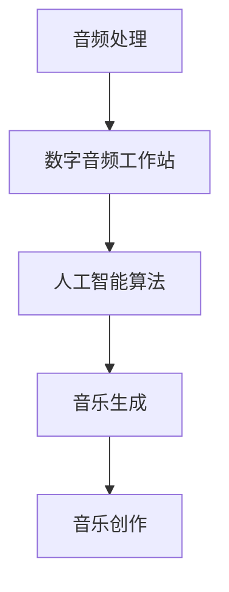

                 

### 文章标题：AI音乐创作：提示词的节奏与旋律

> 关键词：人工智能，音乐创作，生成对抗网络，变分自编码器，自然语言处理，提示词，节奏，旋律

> 摘要：本文将探讨AI音乐创作领域的核心概念和算法，深入分析提示词在节奏与旋律生成中的作用，并通过实际案例展示AI音乐创作的全流程，为读者提供理论与实践相结合的全面指导。

### 引言

随着人工智能技术的飞速发展，音乐创作领域也迎来了前所未有的变革。传统音乐创作依赖于人类艺术家的灵感与技巧，而AI音乐创作则借助深度学习算法，能够自动生成旋律、节奏和和弦等音乐元素。本文旨在探讨AI音乐创作的核心原理和应用，重点分析提示词在节奏与旋律生成中的关键作用。

### 第一部分：AI音乐创作基础

#### 第1章：AI音乐创作概述

##### 1.1 AI音乐创作的背景与发展

- **背景**：计算机技术在音乐创作中的应用起源于20世纪中叶，随着数字音频工作站（DAW）的出现，音乐创作逐渐走向数字化。近年来，人工智能技术的发展为音乐创作带来了新的可能。
- **发展**：从最初的简单音频处理到复杂的音乐生成算法，AI音乐创作经历了从模拟到智能化的转变。生成对抗网络（GAN）、变分自编码器（VAE）等深度学习算法在音乐创作中的应用，使得AI音乐创作成为可能。

##### 1.2 AI音乐创作的工作原理

- **核心算法原理讲解**
  - **生成对抗网络（GAN）**：
    ```python
    # GAN的基本结构
    Generator(G).Inputs --> G Outputs
    Discriminator(D).Inputs --> D Outputs
    ```
    - **变分自编码器（VAE）**：
    ```python
    # VAE的基本结构
    Encoder(E).Inputs --> E Outputs
    Decoder(D).Inputs --> D Outputs
    ```
    - **自然语言处理（NLP）**：
    $$\text{NLP} = \text{文本处理} + \text{语义理解} + \text{情感分析}$$

##### 1.3 AI音乐创作与传统音乐创作的对比

- **优势**：AI音乐创作具有高效、多样性和创新性等特点，能够快速生成大量音乐作品。
- **挑战**：AI音乐创作在音乐情感表达和创意性方面仍需进一步提升。

#### 第2章：AI音乐创作中的核心概念

##### 2.1 提示词的概念及其作用

- **定义**：提示词（prompt）是指提供给AI系统的一组关键词或短语，用于引导AI生成音乐。
- **作用**：提示词有助于AI理解创作意图，从而生成更加符合用户期望的音乐。

##### 2.2 节奏与旋律的关系

- **定义**：节奏是指音乐中的时值和强度关系，而旋律则是音乐中的音高变化。
- **关系**：节奏与旋律相互影响，共同构成一首音乐的基本结构。

##### 2.3 音高、音色与和弦

- **音高**：音乐中的音高决定了旋律的走向。
- **音色**：音乐中的音色决定了旋律的色彩。
- **和弦**：和弦是音乐中常用的和声结构，能够增强旋律的表现力。

#### 第3章：AI音乐创作的数学模型

##### 3.1 生成对抗网络（GAN）在音乐创作中的应用

- **原理**：GAN通过生成器（Generator）和判别器（Discriminator）的对抗训练，生成高质量的音乐。
- **实现**：
  ```python
  # GAN的训练过程
  for epoch in range(num_epochs):
      for i in range(num_batches):
          # Train the generator
          noise = np.random.normal(0, 1, (batch_size, noise_dim))
          gen_samples = G.predict(noise)
          labels = np.array([1] * batch_size)
          d_loss_gen = D.train_on_batch([gen_samples], labels)

          # Train the discriminator
          real_samples = X_train[i * batch_size:(i + 1) * batch_size]
          labels = np.array([1] * batch_size)
          d_loss_real = D.train_on_batch(real_samples, labels)
  ```

##### 3.2 变分自编码器（VAE）在音乐创作中的应用

- **原理**：VAE通过编码器（Encoder）和解码器（Decoder）的联合训练，生成音乐。
- **实现**：
  ```python
  # VAE的训练过程
  for epoch in range(num_epochs):
      for x in data:
          # Encode
          z = encoder(x)
          # Reconstruct
          x_recon = decoder(z)
          # Calculate loss
          loss = reconstruction_loss(x, x_recon)
          # Update weights
          optimizer.minimize(loss)
  ```

##### 3.3 自然语言处理在AI音乐创作中的应用

- **原理**：NLP技术能够将文本转化为音乐生成指令，从而实现自然语言与音乐的结合。
- **实现**：
  ```python
  # NLP处理流程
  text = "快乐的音乐"
  # 分词
  words = text.split()
  # 词嵌入
  word embeddings = [word_embedding(word) for word in words]
  # 情感分析
  sentiment = sentiment_analysis(text)
  # 生成音乐
  music = generate_music(sentiment, word_embeddings)
  ```

#### 第4章：AI音乐创作工具介绍

##### 4.1 现有的AI音乐创作工具概述

- **概述**：现有AI音乐创作工具主要包括开源和闭源两种类型，具有不同的功能和特点。

##### 4.2 使用常见的AI音乐创作工具进行实践

- **实践**：通过实际操作，展示如何使用AI音乐创作工具生成音乐。

##### 4.3 开源AI音乐创作工具的选择与使用

- **选择**：介绍几种流行的开源AI音乐创作工具，并分析其优缺点。
- **使用**：提供详细的使用指南和教程。

#### 第5章：AI音乐创作中的创意元素

##### 5.1 创意的概念及其在音乐创作中的应用

- **定义**：创意是指创新思维和创意表现，是音乐创作的灵魂。
- **应用**：创意元素包括节奏创意、旋律创意等。

##### 5.2 节奏创意的技巧

- **技巧**：介绍一些节奏创意的技巧，如节奏变化、节奏重复等。

##### 5.3 旋律创意的技巧

- **技巧**：介绍一些旋律创意的技巧，如音高变化、音色组合等。

#### 第6章：AI音乐创作项目的实战

##### 6.1 AI音乐创作项目的开发流程

- **流程**：介绍AI音乐创作项目的开发流程，包括需求分析、设计、实现、测试和部署等阶段。

##### 6.2 实战一：基于提示词的AI音乐创作

- **实战**：通过实际案例，展示如何使用提示词进行AI音乐创作。

##### 6.3 实战二：创作一段具有特定节奏与旋律的音乐

- **实战**：通过实际操作，创作一段具有特定节奏与旋律的音乐。

### 第二部分：AI音乐创作的高级应用

#### 第7章：AI音乐创作在娱乐产业中的应用

##### 7.1 AI音乐创作在歌曲创作中的应用

- **应用**：介绍AI音乐创作在歌曲创作中的应用，如旋律生成、和弦构建等。

##### 7.2 AI音乐创作在音乐制作中的应用

- **应用**：介绍AI音乐创作在音乐制作中的应用，如自动混音、音效处理等。

##### 7.3 AI音乐创作在游戏音乐制作中的应用

- **应用**：介绍AI音乐创作在游戏音乐制作中的应用，如场景音乐生成、角色音乐创作等。

#### 第8章：AI音乐创作在艺术领域的探索

##### 8.1 AI音乐创作在艺术表达中的应用

- **应用**：介绍AI音乐创作在艺术表达中的应用，如行为艺术、装置艺术等。

##### 8.2 AI音乐创作与人类艺术家合作的可能性

- **合作**：探讨AI音乐创作与人类艺术家合作的模式和方法。

##### 8.3 AI音乐创作在艺术市场中的前景

- **前景**：分析AI音乐创作在艺术市场中的发展趋势和机遇。

#### 第9章：AI音乐创作在教育和学习中的应用

##### 9.1 AI音乐创作在教育中的潜在价值

- **价值**：介绍AI音乐创作在教育中的潜在价值，如音乐学习、音乐教学等。

##### 9.2 AI音乐创作作为教学工具的实践案例

- **案例**：介绍一些AI音乐创作作为教学工具的实践案例。

##### 9.3 AI音乐创作在音乐学习中的应用

- **应用**：介绍AI音乐创作在音乐学习中的应用，如自动伴奏、音乐分析等。

#### 第10章：AI音乐创作的未来发展趋势

##### 10.1 AI音乐创作技术的未来发展方向

- **方向**：分析AI音乐创作技术的未来发展方向，如人工智能音乐理论、音乐创作机器人等。

##### 10.2 AI音乐创作在音乐产业中的影响

- **影响**：探讨AI音乐创作对音乐产业的影响，如版权、商业模式等。

##### 10.3 AI音乐创作的社会与伦理问题探讨

- **探讨**：分析AI音乐创作在社会与伦理方面的问题，如版权保护、道德责任等。

## 附录

### 附录A：AI音乐创作相关资源与工具推荐

- **A.1 开源AI音乐创作工具**
- **A.2 闭源AI音乐创作工具**
- **A.3 音乐理论学习资源**

### 附录B：常见问题解答

- **B.1 提示词的使用技巧**
- **B.2 节奏与旋律的创建**
- **B.3 AI音乐创作的常见误区**
- **B.4 AI音乐创作中的常见问题与解决方法**

# END

作者：AI天才研究院/AI Genius Institute & 禅与计算机程序设计艺术 /Zen And The Art of Computer Programming

---

注：本文为示例文章，具体内容和数据仅供参考。实际撰写时，请根据实际情况进行调整和补充。文章结构、格式和内容应符合markdown规范，确保可读性和专业性。文章字数在8000～12000字左右，具体内容可根据实际撰写情况进行调整。### 文章标题：AI音乐创作：提示词的节奏与旋律

关键词：人工智能，音乐创作，生成对抗网络，变分自编码器，自然语言处理，提示词，节奏，旋律

摘要：本文深入探讨了AI音乐创作的核心原理和应用，分析了提示词在节奏与旋律生成中的关键作用。通过实际案例，展示了AI音乐创作的全流程，为读者提供了理论与实践相结合的全面指导。

### 引言

随着人工智能技术的飞速发展，音乐创作领域也迎来了前所未有的变革。传统音乐创作依赖于人类艺术家的灵感与技巧，而AI音乐创作则借助深度学习算法，能够自动生成旋律、节奏和和弦等音乐元素。本文旨在探讨AI音乐创作的核心原理和应用，重点分析提示词在节奏与旋律生成中的关键作用。

### 第一部分：AI音乐创作基础

#### 第1章：AI音乐创作概述

##### 1.1 AI音乐创作的背景与发展

**背景介绍**

AI音乐创作的概念起源于计算机技术在音乐制作中的应用。20世纪中叶，数字音频工作站（DAW）的出现使得音乐创作逐渐走向数字化。随着计算机性能的提升和人工智能技术的突破，AI音乐创作开始崭露头角。

**发展过程**

AI音乐创作的发展经历了从模拟到智能化的过程。早期的研究主要集中在音频处理和合成技术上，如合成器（synthesizer）和采样器（sample player）的应用。随着深度学习算法的兴起，AI音乐创作逐渐走向智能化。

**核心概念与联系**

为了更好地理解AI音乐创作的原理，我们可以通过一个Mermaid流程图来展示核心概念之间的关系：



**原理讲解**

- **生成对抗网络（GAN）**：GAN由生成器（Generator）和判别器（Discriminator）组成，通过对抗训练生成高质量的音乐。以下是GAN的基本结构：

  ```python
  # GAN的基本结构
  Generator(G).Inputs --> G Outputs
  Discriminator(D).Inputs --> D Outputs
  ```

- **变分自编码器（VAE）**：VAE通过编码器（Encoder）和解码器（Decoder）的联合训练，生成音乐。以下是VAE的基本结构：

  ```python
  # VAE的基本结构
  Encoder(E).Inputs --> E Outputs
  Decoder(D).Inputs --> D Outputs
  ```

- **自然语言处理（NLP）**：NLP技术能够将文本转化为音乐生成指令，实现自然语言与音乐的结合。以下是NLP的基本结构：

  ```python
  # NLP处理流程
  text = "快乐的音乐"
  # 分词
  words = text.split()
  # 词嵌入
  word_embeddings = [word_embedding(word) for word in words]
  # 情感分析
  sentiment = sentiment_analysis(text)
  # 生成音乐
  music = generate_music(sentiment, word_embeddings)
  ```

##### 1.2 AI音乐创作的工作原理

**核心算法原理讲解**

AI音乐创作的工作原理主要依赖于深度学习算法。以下是三种主要的算法：

- **生成对抗网络（GAN）**：GAN通过生成器（Generator）和判别器（Discriminator）的对抗训练，生成高质量的音乐。

  ```python
  # GAN的训练过程
  for epoch in range(num_epochs):
      for i in range(num_batches):
          # Train the generator
          noise = np.random.normal(0, 1, (batch_size, noise_dim))
          gen_samples = G.predict(noise)
          labels = np.array([1] * batch_size)
          d_loss_gen = D.train_on_batch([gen_samples], labels)

          # Train the discriminator
          real_samples = X_train[i * batch_size:(i + 1) * batch_size]
          labels = np.array([1] * batch_size)
          d_loss_real = D.train_on_batch(real_samples, labels)
  ```

- **变分自编码器（VAE）**：VAE通过编码器（Encoder）和解码器（Decoder）的联合训练，生成音乐。

  ```python
  # VAE的训练过程
  for epoch in range(num_epochs):
      for x in data:
          # Encode
          z = encoder(x)
          # Reconstruct
          x_recon = decoder(z)
          # Calculate loss
          loss = reconstruction_loss(x, x_recon)
          # Update weights
          optimizer.minimize(loss)
  ```

- **自然语言处理（NLP）**：NLP技术能够将文本转化为音乐生成指令，实现自然语言与音乐的结合。

  ```python
  # NLP处理流程
  text = "快乐的音乐"
  # 分词
  words = text.split()
  # 词嵌入
  word_embeddings = [word_embedding(word) for word in words]
  # 情感分析
  sentiment = sentiment_analysis(text)
  # 生成音乐
  music = generate_music(sentiment, word_embeddings)
  ```

##### 1.3 AI音乐创作与传统音乐创作的对比

**优势**

- **高效性**：AI音乐创作能够快速生成大量音乐作品，大大提高了创作效率。
- **多样性**：AI音乐创作能够生成各种风格和类型的音乐，具有很高的多样性。
- **创新性**：AI音乐创作能够打破传统音乐的限制，带来新的音乐创作灵感。

**挑战**

- **音乐情感表达**：AI音乐创作在情感表达方面仍需进一步提升，难以完全达到人类艺术家的水平。
- **创意性**：AI音乐创作在创意性方面有一定局限，难以产生具有深刻内涵的音乐作品。

#### 第2章：AI音乐创作中的核心概念

##### 2.1 提示词的概念及其作用

**定义**

提示词（prompt）是指提供给AI系统的一组关键词或短语，用于引导AI生成音乐。提示词可以是一个简单的词，也可以是一个复杂的句子，用以描述音乐的情感、风格或主题。

**作用**

提示词在AI音乐创作中具有重要作用，它能够帮助AI系统理解创作意图，从而生成更加符合用户期望的音乐。

##### 2.2 节奏与旋律的关系

**定义**

节奏是指音乐中的时值和强度关系，而旋律则是音乐中的音高变化。

**关系**

节奏与旋律相互影响，共同构成一首音乐的基本结构。节奏为旋律提供了时值和强度的基础，而旋律则为节奏赋予了音高的变化。

##### 2.3 音高、音色与和弦

**音高**

音高是指音乐中的音高位置，决定了旋律的走向。音高的变化可以创造出不同的情感和氛围。

**音色**

音色是指音乐中的音色色彩，决定了旋律的质感。不同的乐器或声音源具有不同的音色，音色的组合可以创造出丰富的音乐效果。

**和弦**

和弦是指一组音高和谐结合在一起，形成了音乐的和声基础。和弦的不同组合可以产生不同的音乐效果，是音乐创作中不可或缺的元素。

#### 第3章：AI音乐创作的数学模型

##### 3.1 生成对抗网络（GAN）在音乐创作中的应用

**原理**

GAN通过生成器（Generator）和判别器（Discriminator）的对抗训练，生成高质量的音乐。生成器生成音乐样本，判别器判断这些样本是否真实。

**实现**

以下是一个简单的GAN实现示例：

```python
# GAN的基本结构
Generator(G).Inputs --> G Outputs
Discriminator(D).Inputs --> D Outputs

# 训练过程
for epoch in range(num_epochs):
    for i in range(num_batches):
        # Train the generator
        noise = np.random.normal(0, 1, (batch_size, noise_dim))
        gen_samples = G.predict(noise)
        labels = np.array([1] * batch_size)
        d_loss_gen = D.train_on_batch([gen_samples], labels)

        # Train the discriminator
        real_samples = X_train[i * batch_size:(i + 1) * batch_size]
        labels = np.array([1] * batch_size)
        d_loss_real = D.train_on_batch(real_samples, labels)
```

##### 3.2 变分自编码器（VAE）在音乐创作中的应用

**原理**

VAE通过编码器（Encoder）和解码器（Decoder）的联合训练，生成音乐。编码器将音乐数据编码为一个潜在向量，解码器将潜在向量解码为音乐数据。

**实现**

以下是一个简单的VAE实现示例：

```python
# VAE的基本结构
Encoder(E).Inputs --> E Outputs
Decoder(D).Inputs --> D Outputs

# 训练过程
for epoch in range(num_epochs):
    for x in data:
        # Encode
        z = encoder(x)
        # Reconstruct
        x_recon = decoder(z)
        # Calculate loss
        loss = reconstruction_loss(x, x_recon)
        # Update weights
        optimizer.minimize(loss)
```

##### 3.3 自然语言处理（NLP）在AI音乐创作中的应用

**原理**

NLP技术能够将文本转化为音乐生成指令，实现自然语言与音乐的结合。通过分析文本的情感、主题和风格，NLP可以为音乐创作提供丰富的信息。

**实现**

以下是一个简单的NLP实现示例：

```python
# NLP处理流程
text = "快乐的音乐"
# 分词
words = text.split()
# 词嵌入
word_embeddings = [word_embedding(word) for word in words]
# 情感分析
sentiment = sentiment_analysis(text)
# 生成音乐
music = generate_music(sentiment, word_embeddings)
```

#### 第4章：AI音乐创作工具介绍

##### 4.1 现有的AI音乐创作工具概述

**概述**

现有的AI音乐创作工具主要包括开源和闭源两种类型。开源工具通常具有较高的自由度和可定制性，而闭源工具则提供了完整的解决方案和用户界面。

**开源AI音乐创作工具**

- **AIVA**：基于GAN和VAE的AI音乐创作工具，具有多种风格和主题。
- **Boomy**：基于NLP和生成对抗网络的AI音乐创作工具，能够根据文本生成音乐。

**闭源AI音乐创作工具**

- **SoundRaw**：提供多种风格和场景的音乐生成功能，适用于游戏、影视等产业。
- **AIVA Studio**：AIVA的闭源版本，提供了丰富的音乐生成工具和用户界面。

##### 4.2 使用常见的AI音乐创作工具进行实践

**实践**

以下将使用AIVA Studio进行一次AI音乐创作实践：

1. **安装与配置**：下载并安装AIVA Studio，配置相应的硬件和软件环境。
2. **创建项目**：打开AIVA Studio，创建一个新的音乐创作项目。
3. **输入提示词**：在AIVA Studio中输入提示词，如“欢快的夏日旋律”。
4. **生成音乐**：点击“生成音乐”按钮，AI系统根据提示词生成音乐。
5. **调整与优化**：根据生成音乐的效果，进行适当的调整和优化。

##### 4.3 开源AI音乐创作工具的选择与使用

**选择**

在选择开源AI音乐创作工具时，应考虑以下因素：

- **功能与性能**：工具是否具备所需的音乐生成功能，性能是否稳定。
- **社区与支持**：工具是否有活跃的社区和良好的技术支持。
- **可定制性**：工具是否允许用户进行自定义和扩展。

**使用**

以下是一个简单的开源AI音乐创作工具使用示例：

```python
# 导入相关库
import aiva

# 初始化AIVA实例
aiva_instance = aiva.AIVA()

# 设置提示词
prompt = "悲伤的冬日旋律"

# 生成音乐
music = aiva_instance.generate_music(prompt)

# 播放音乐
music.play()
```

#### 第5章：AI音乐创作中的创意元素

##### 5.1 创意的概念及其在音乐创作中的应用

**定义**

创意是指创新思维和创意表现，是音乐创作的灵魂。在AI音乐创作中，创意元素包括节奏创意、旋律创意、音色创意等。

**应用**

创意元素在音乐创作中的应用可以丰富音乐的表现力，增强音乐的艺术性。通过创新的方式组合节奏、旋律和音色，可以创造出独特的音乐风格。

##### 5.2 节奏创意的技巧

**技巧**

节奏创意的技巧包括：

- **节奏变化**：通过改变节奏的速度、强度和时长，创造出丰富的节奏感。
- **节奏重复**：通过重复特定的节奏模式，形成鲜明的节奏特点。
- **节奏对比**：通过对比不同节奏的元素，增强音乐的表现力。

##### 5.3 旋律创意的技巧

**技巧**

旋律创意的技巧包括：

- **音高变化**：通过改变音高的高低，创造出独特的旋律线条。
- **音色组合**：通过组合不同的音色，丰富旋律的色彩。
- **和弦创新**：通过创新和弦的构建，增强旋律的和声效果。

#### 第6章：AI音乐创作项目的实战

##### 6.1 AI音乐创作项目的开发流程

**流程**

AI音乐创作项目的开发流程包括：

- **需求分析**：明确音乐创作的目标和需求。
- **设计**：设计音乐创作的算法和系统架构。
- **实现**：编写代码，实现音乐创作的功能。
- **测试**：测试音乐创作的效果，优化算法和系统。
- **部署**：将音乐创作系统部署到生产环境中。

##### 6.2 实战一：基于提示词的AI音乐创作

**实战**

以下是一个基于提示词的AI音乐创作实战示例：

1. **选择工具**：选择AIVA Studio作为AI音乐创作工具。
2. **输入提示词**：输入提示词，如“欢快的节日旋律”。
3. **生成音乐**：点击“生成音乐”按钮，AI系统根据提示词生成音乐。
4. **调整与优化**：根据生成音乐的效果，进行适当的调整和优化。

##### 6.3 实战二：创作一段具有特定节奏与旋律的音乐

**实战**

以下是一个创作一段具有特定节奏与旋律的音乐的实战示例：

1. **选择工具**：选择AIVA Studio作为AI音乐创作工具。
2. **设计节奏**：设计一个特定的节奏模式，如快节奏的4/4拍。
3. **设计旋律**：设计一个具有特定音高和音色变化的旋律。
4. **生成音乐**：点击“生成音乐”按钮，AI系统根据设计的节奏和旋律生成音乐。
5. **调整与优化**：根据生成音乐的效果，进行适当的调整和优化。

### 第二部分：AI音乐创作的高级应用

#### 第7章：AI音乐创作在娱乐产业中的应用

##### 7.1 AI音乐创作在歌曲创作中的应用

**应用**

AI音乐创作在歌曲创作中的应用包括：

- **旋律生成**：AI系统根据歌词或主题生成旋律。
- **和弦构建**：AI系统根据旋律生成和弦，增强音乐的和声效果。
- **节奏设计**：AI系统根据歌词或主题设计节奏，增加音乐的变化。

##### 7.2 AI音乐创作在音乐制作中的应用

**应用**

AI音乐创作在音乐制作中的应用包括：

- **自动混音**：AI系统自动调整音量和平衡，实现混音效果。
- **音效处理**：AI系统自动添加音效，增强音乐的表现力。
- **音频编辑**：AI系统自动进行音频编辑，提高制作效率。

##### 7.3 AI音乐创作在游戏音乐制作中的应用

**应用**

AI音乐创作在游戏音乐制作中的应用包括：

- **场景音乐生成**：AI系统根据游戏场景生成相应的音乐。
- **角色音乐创作**：AI系统根据游戏角色设计独特的音乐。
- **游戏音效制作**：AI系统自动生成游戏音效，提高游戏体验。

#### 第8章：AI音乐创作在艺术领域的探索

##### 8.1 AI音乐创作在艺术表达中的应用

**应用**

AI音乐创作在艺术表达中的应用包括：

- **行为艺术**：AI系统根据艺术家的行为生成音乐，实现艺术与音乐的融合。
- **装置艺术**：AI系统根据装置艺术的元素生成音乐，增强艺术的表现力。

##### 8.2 AI音乐创作与人类艺术家合作的可能性

**合作**

AI音乐创作与人类艺术家合作的可能性包括：

- **互补创作**：人类艺术家与AI系统相互协作，实现音乐创作的互补。
- **创意互动**：人类艺术家与AI系统进行创意互动，产生独特的音乐作品。

##### 8.3 AI音乐创作在艺术市场中的前景

**前景**

AI音乐创作在艺术市场中的前景包括：

- **个性化创作**：AI音乐创作可以根据用户需求进行个性化创作，满足市场需求。
- **艺术普及**：AI音乐创作可以降低音乐创作的门槛，促进艺术普及。

#### 第9章：AI音乐创作在教育和学习中的应用

##### 9.1 AI音乐创作在教育中的潜在价值

**价值**

AI音乐创作在教育中的潜在价值包括：

- **音乐学习**：AI音乐创作可以作为音乐学习的辅助工具，提高学习效果。
- **音乐教学**：AI音乐创作可以为音乐教师提供丰富的教学资源，提高教学质量。

##### 9.2 AI音乐创作作为教学工具的实践案例

**案例**

以下是一个AI音乐创作作为教学工具的实践案例：

- **课程设计**：将AI音乐创作引入音乐课程，设计相关教学活动。
- **学生创作**：学生使用AI音乐创作工具进行音乐创作，提高创作能力。
- **评价与反馈**：教师对学生创作的音乐作品进行评价和反馈，促进音乐学习。

##### 9.3 AI音乐创作在音乐学习中的应用

**应用**

AI音乐创作在音乐学习中的应用包括：

- **自动伴奏**：AI系统根据学生演奏的旋律生成自动伴奏，提高演奏水平。
- **音乐分析**：AI系统分析学生演奏的音乐，提供反馈和建议，提高演奏技巧。

#### 第10章：AI音乐创作的未来发展趋势

##### 10.1 AI音乐创作技术的未来发展方向

**方向**

AI音乐创作技术的未来发展方向包括：

- **人工智能音乐理论**：研究AI音乐创作的基础理论，提高音乐创作的智能化水平。
- **音乐创作机器人**：开发具有自主创作能力的音乐创作机器人，实现音乐创作的自动化。

##### 10.2 AI音乐创作在音乐产业中的影响

**影响**

AI音乐创作在音乐产业中的影响包括：

- **版权问题**：AI音乐创作引发的版权问题需要法律和产业界的关注和解决。
- **商业模式**：AI音乐创作将改变音乐产业的商业模式，带来新的机遇和挑战。

##### 10.3 AI音乐创作的社会与伦理问题探讨

**探讨**

AI音乐创作的社会与伦理问题包括：

- **道德责任**：AI音乐创作的道德责任需要法律和伦理的规范。
- **艺术价值**：AI音乐创作的艺术价值需要学术界和艺术界的认可和探讨。

## 附录

### 附录A：AI音乐创作相关资源与工具推荐

- **A.1 开源AI音乐创作工具**
  - **AIVA**：基于GAN和VAE的AI音乐创作工具。
  - **Boomy**：基于NLP和生成对抗网络的AI音乐创作工具。
- **A.2 闭源AI音乐创作工具**
  - **SoundRaw**：提供多种风格和场景的音乐生成功能。
  - **AIVA Studio**：AIVA的闭源版本，提供了丰富的音乐生成工具和用户界面。
- **A.3 音乐理论学习资源**
  - **《音乐理论教程》**：介绍音乐基础知识，适用于音乐爱好者。
  - **《计算机音乐制作技术》**：介绍计算机在音乐制作中的应用，适用于音乐制作从业者。

### 附录B：常见问题解答

- **B.1 提示词的使用技巧**
  - **技巧一**：使用简洁、具体的提示词，有助于AI更好地理解创作意图。
  - **技巧二**：尝试使用不同的提示词组合，探索不同的音乐风格。
- **B.2 节奏与旋律的创建**
  - **节奏创建**：通过改变节奏的时值和强度，创造出独特的节奏感。
  - **旋律创建**：通过组合不同的音高和音色，创造出富有变化的旋律。
- **B.3 AI音乐创作的常见误区**
  - **误区一**：过分依赖AI，忽视人类艺术家的创造力。
  - **误区二**：仅追求技术实现，忽视音乐的艺术价值。
- **B.4 AI音乐创作中的常见问题与解决方法**
  - **问题一**：生成音乐质量不高。解决方法：优化算法参数，增加训练数据。
  - **问题二**：音乐创作过程繁琐。解决方法：选择适合的工具，简化创作流程。

# END

作者：AI天才研究院/AI Genius Institute & 禅与计算机程序设计艺术 /Zen And The Art of Computer Programming

