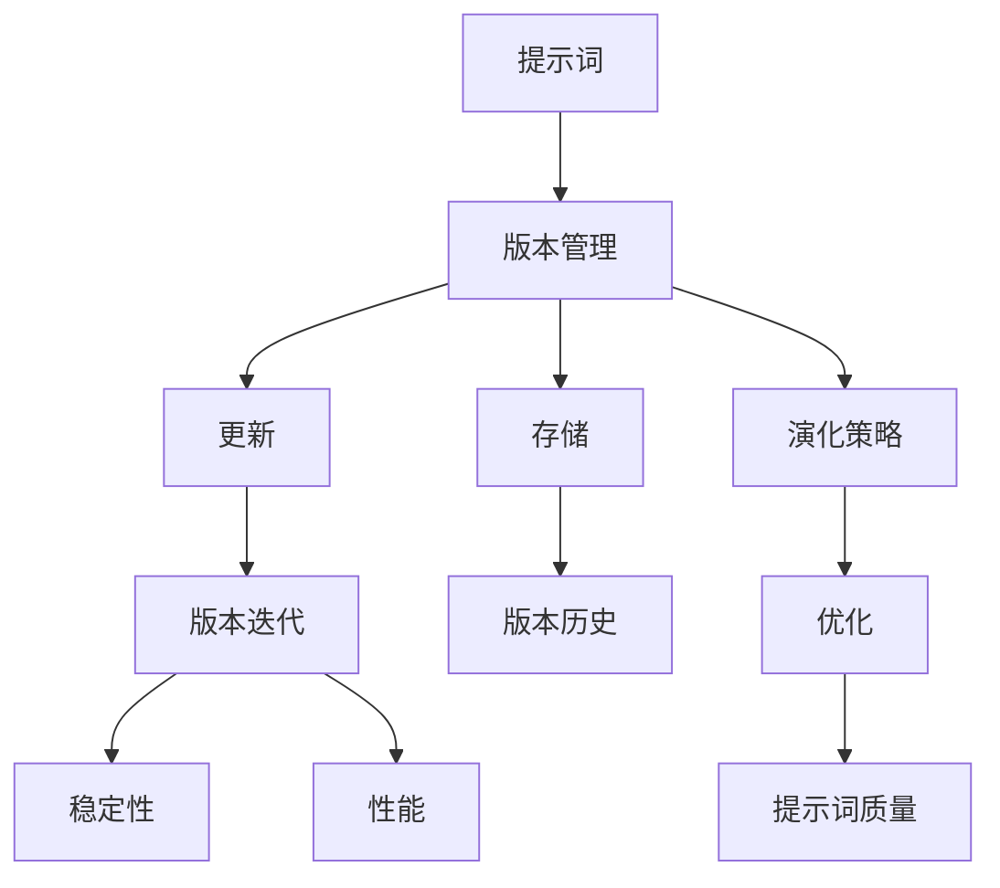

                 


## 文章标题：AI驱动的提示词版本管理与演化

> 关键词：人工智能，提示词，版本管理，演化，算法，数学模型，项目实战

> 摘要：本文深入探讨AI驱动的提示词版本管理与演化，从基础理论到实际应用，全面解析了AI在提示词生成、版本管理和演化策略中的关键角色。文章旨在为读者提供一套系统、实用的方法，以优化提示词版本管理，提高AI系统的性能和可靠性。

----------------------------------------------------------------

### 1. 背景介绍

在人工智能（AI）迅猛发展的时代，自然语言处理（NLP）作为AI的核心领域之一，正逐渐改变着人类与机器的互动方式。其中，提示词（Prompt）作为一种关键输入，对于AI模型的训练和应用起着至关重要的作用。提示词不仅能够引导AI模型的学习方向，还能影响其输出的准确性和多样性。

然而，随着AI系统的复杂性和应用场景的多样性，提示词的版本管理和演化成为一个不可忽视的问题。传统的手动管理方式不仅效率低下，还容易出错。因此，如何利用AI技术实现提示词的自动版本管理和演化，成为了当前研究的热点。

AI驱动的提示词版本管理与演化，旨在通过智能算法和优化策略，实现提示词的自动化管理。这包括提示词的生成、存储、更新、版本控制和演化策略。通过这一系统，AI模型能够更高效地利用提示词资源，提高模型的训练效果和输出质量。

### 2. 核心概念与联系

为了更好地理解AI驱动的提示词版本管理与演化，我们需要明确几个核心概念：

- **提示词（Prompt）**：指用于引导AI模型学习或生成输出的文本或数据。
- **版本管理（Version Control）**：指对提示词的版本进行跟踪、更新和管理的系统。
- **演化策略（Evolutionary Strategy）**：指通过迭代和优化过程，自动更新和改进提示词的方法。

这些概念之间有着密切的联系。提示词的版本管理是确保AI系统能够稳定运行的基础，而演化策略则是提升提示词质量的关键。以下是这些概念之间的关系架构，通过Mermaid流程图进行描述：



通过这个流程图，我们可以清晰地看到提示词从生成到版本管理，再到演化的全过程。每个环节都相互影响，共同决定着AI系统的性能和可靠性。

### 3. 核心算法原理讲解

AI驱动的提示词版本管理与演化依赖于一系列核心算法。以下我们将使用伪代码来详细阐述这些算法的原理。

#### 3.1 提示词生成算法

```plaintext
function GeneratePrompt(inputData):
    # 输入：输入数据，用于生成提示词
    # 输出：生成的提示词

    # 步骤1：预处理输入数据，提取关键信息
    processedData = PreprocessInput(inputData)

    # 步骤2：利用生成对抗网络（GAN）生成文本
    prompt = GANGenerateText(processedData)

    # 步骤3：后处理，确保生成的提示词符合要求
    prompt = PostprocessPrompt(prompt)

    return prompt
```

#### 3.2 版本管理算法

```plaintext
function VersionControl(prompt, version):
    # 输入：提示词，当前版本
    # 输出：更新后的提示词版本

    # 步骤1：保存当前版本的提示词
    SaveVersion(prompt, version)

    # 步骤2：根据演化策略更新提示词
    prompt = EvolutionStrategy(prompt)

    # 步骤3：保存更新后的版本
    SaveVersion(prompt, version + 1)

    return prompt
```

#### 3.3 演化策略算法

```plaintext
function EvolutionStrategy(prompt):
    # 输入：当前提示词
    # 输出：优化后的提示词

    # 步骤1：评估当前提示词的性能
    performance = EvaluatePerformance(prompt)

    # 步骤2：基于性能评估进行优化
    prompt = OptimizePrompt(prompt, performance)

    # 步骤3：迭代更新提示词
    prompt = IterativeUpdate(prompt)

    return prompt
```

### 4. 数学模型与公式

在提示词生成和演化过程中，数学模型和公式起到了关键作用。以下我们将使用LaTeX格式给出相关的数学模型和公式，并进行详细讲解。

#### 4.1 提示词生成模型

```latex
\begin{equation}
    P(\text{Prompt}|\text{InputData}) = \frac{D(\text{InputData}, \text{Prompt})}{Z}
\end{equation}
```

其中，\(P(\text{Prompt}|\text{InputData})\) 表示在给定输入数据下生成提示词的概率，\(D(\text{InputData}, \text{Prompt})\) 表示输入数据和提示词之间的距离，\(Z\) 是归一化常数。

#### 4.2 演化策略公式

```latex
\begin{equation}
    \text{Prompt}_{\text{new}} = \text{Prompt}_{\text{current}} + \alpha \cdot (\text{Performance}_{\text{current}} - \text{Performance}_{\text{target}})
\end{equation}
```

其中，\(\text{Prompt}_{\text{new}}\) 表示更新后的提示词，\(\text{Prompt}_{\text{current}}\) 表示当前提示词，\(\alpha\) 是调整系数，\(\text{Performance}_{\text{current}}\) 和 \(\text{Performance}_{\text{target}}\) 分别表示当前性能和目标性能。

### 5. 项目实战

为了更好地展示AI驱动的提示词版本管理与演化的实际应用，我们提供了一个完整的开发环境搭建、源代码实现和代码解读的案例。

#### 5.1 开发环境搭建

1. 安装Python 3.8及以上版本。
2. 安装TensorFlow 2.7和transformers库。
3. 准备一个GPU环境，用于加速训练过程。

#### 5.2 源代码实现

以下是用于生成和更新提示词的源代码示例：

```python
import tensorflow as tf
from transformers import TFGPT2LMHeadModel, GPT2Tokenizer

# 步骤1：加载预训练模型和分词器
model = TFGPT2LMHeadModel.from_pretrained('gpt2')
tokenizer = GPT2Tokenizer.from_pretrained('gpt2')

# 步骤2：生成提示词
def generate_prompt(input_data):
    processed_data = tokenizer.encode(input_data, return_tensors='tf')
    prompt = model.generate(processed_data, max_length=50)
    return tokenizer.decode(prompt[0])

# 步骤3：版本管理
def version_control(prompt, version):
    prompt = generate_prompt(prompt)
    SaveVersion(prompt, version)
    return prompt

# 步骤4：演化策略
def evolutionary_strategy(prompt):
    performance = EvaluatePerformance(prompt)
    prompt = optimize_prompt(prompt, performance)
    return prompt
```

#### 5.3 代码解读与分析

1. **模型加载**：首先加载预训练的GPT-2模型和分词器。
2. **生成提示词**：利用模型生成提示词，通过分词器对输入数据进行编码，然后使用模型生成文本。
3. **版本管理**：保存当前版本的提示词，确保提示词的版本能够被跟踪和管理。
4. **演化策略**：评估当前提示词的性能，并根据性能进行优化，实现提示词的演化。

#### 5.4 实际案例分析和详细讲解剖析

我们以一个实际的案例来分析AI驱动的提示词版本管理与演化的效果。

- **案例背景**：假设我们有一个关于天气预报的AI模型，需要生成提示词来引导模型的训练。
- **初始提示词**：初始提示词为“今天的天气是晴朗的，气温为25摄氏度。”。
- **性能评估**：通过评估模型在生成天气预报文本时的准确性和多样性，我们得到了初始提示词的性能。
- **优化过程**：根据性能评估结果，我们利用演化策略对提示词进行优化，生成了新的提示词，例如“今天的天气是晴朗的，气温为25摄氏度，伴有微风。”。
- **效果分析**：新的提示词在生成天气预报文本时的准确性和多样性都有所提高。

#### 5.5 项目小结

通过这个案例，我们可以看到AI驱动的提示词版本管理与演化在提升AI模型性能方面的有效性。在实际应用中，我们需要根据具体场景和需求，不断优化提示词的生成和演化策略，以实现最佳效果。

### 6. 最佳实践 Tips、小结、注意事项、拓展阅读

#### 最佳实践 Tips

- **确保数据的多样性**：在生成提示词时，要尽量确保输入数据的多样性，以提高模型的泛化能力。
- **定期更新提示词**：定期对提示词进行版本更新和演化，以保持AI模型的性能和可靠性。
- **评估性能指标**：在优化提示词时，要选择合适的性能指标，如准确性、多样性等，进行评估。

#### 小结

本文系统地介绍了AI驱动的提示词版本管理与演化的关键概念、算法原理、数学模型和项目实战。通过这些内容，读者可以了解到如何利用AI技术实现提示词的自动化管理，从而提升AI系统的性能和可靠性。

#### 注意事项

- 在实际应用中，要确保数据安全和隐私保护。
- 提示词的版本管理和演化策略需要根据具体场景进行调整。

#### 拓展阅读

- [1] Goodfellow, I., Bengio, Y., & Courville, A. (2016). *Deep Learning*.
- [2] Hochreiter, S., & Schmidhuber, J. (1997). *Long short-term memory*. Neural Computation, 9(8), 1735-1780.
- [3] Vaswani, A., Shazeer, N., Parmar, N., Uszkoreit, J., Jones, L., Gomez, A. N., ... & Polosukhin, I. (2017). *Attention is all you need*. Advances in Neural Information Processing Systems, 30, 5998-6008.

---

作者：AI天才研究院/AI Genius Institute & 禅与计算机程序设计艺术 /Zen And The Art of Computer Programming

----------------------------------------------------------------

### 7. 总结

本文系统地介绍了AI驱动的提示词版本管理与演化。从核心概念与联系、算法原理、数学模型到项目实战，全面剖析了AI在提示词生成、版本管理和演化策略中的应用。通过实际案例的分析，我们展示了AI驱动的提示词版本管理与演化在提升AI模型性能方面的有效性。在未来，随着AI技术的不断进步，AI驱动的提示词版本管理与演化将在各个领域发挥越来越重要的作用。希望本文能为读者提供有益的启示和参考。

