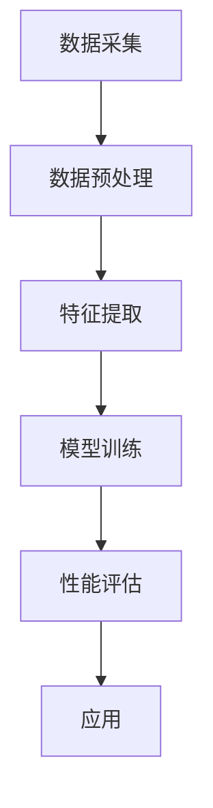

                 


## AI驱动的材料科学：从分子设计到性能预测

### 关键词：人工智能，材料科学，分子设计，性能预测，深度学习，机器学习

### 摘要：
本文将探讨人工智能（AI）在材料科学领域的应用，特别是从分子设计到性能预测的全过程。通过分析AI驱动材料科学的核心概念、算法原理、数学模型以及实际应用，我们将展示AI如何通过高效的数据处理和智能算法优化材料性能，从而推动材料科学的创新与发展。

---

### 第二部分：AI驱动材料科学的核心概念

#### 2.1 AI与材料科学的融合

#### 2.1.1 数据驱动方法

##### 核心概念与联系

在材料科学中，数据驱动方法是一种通过分析大量实验数据来预测新材料性能的重要手段。该方法的核心在于建立数据与材料性能之间的关联，从而实现性能的预测和优化。以下是一个简单的Mermaid流程图，展示了数据驱动方法在材料科学中的应用流程：



##### 核心算法原理讲解

数据预处理是数据驱动方法的第一步，它包括数据清洗、归一化等操作。以下是一个使用Python伪代码表示的数据预处理步骤：

```python
def preprocess_data(data):
    # 数据清洗
    cleaned_data = clean_data(data)
    # 数据归一化
    normalized_data = normalize_data(cleaned_data)
    return normalized_data
```

在数据预处理之后，特征提取是一个关键步骤。它通过提取数据中的关键特征来减少数据维度，从而提高模型的效率。以下是一个使用Python伪代码表示的特征提取步骤：

```python
def extract_features(data):
    # 特征选择
    selected_features = select_features(data)
    # 特征工程
    engineered_features = feature_engineering(selected_features)
    return engineered_features
```

接下来，模型训练是数据驱动方法的核心步骤。机器学习和深度学习算法被用来从特征数据中学习规律，从而建立性能预测模型。以下是一个使用Python伪代码表示的模型训练步骤：

```python
def train_model(features, labels):
    # 初始化模型
    model = initialize_model()
    # 模型训练
    trained_model = model.fit(features, labels)
    return trained_model
```

在模型训练之后，性能评估是必不可少的步骤。它用于验证模型在未知数据上的预测能力，确保模型的可靠性。以下是一个使用Python伪代码表示的性能评估步骤：

```python
def evaluate_model(model, test_features, test_labels):
    # 模型预测
    predictions = model.predict(test_features)
    # 性能评估
    performance = evaluate_performance(predictions, test_labels)
    return performance
```

最后，应用是将训练好的模型应用于实际问题的过程。通过将性能预测模型应用于新材料设计，可以快速筛选出具有优异性能的材料，从而提高研发效率。以下是一个使用Python伪代码表示的应用步骤：

```python
def apply_model(model, new_data):
    # 预测新材料性能
    performance = model.predict(new_data)
    # 应用结果
    applied_results = apply_performance.performance(performance)
    return applied_results
```

##### 数学模型和数学公式

在材料科学中，性能预测模型通常是一个复杂的非线性函数，它可以将输入的特征映射到输出的性能值。以下是一个简单的数学模型，使用LaTeX格式表示：

$$
\text{performance} = f(\text{features})
$$

其中，\( f(\text{features}) \) 是一个由机器学习算法学到的非线性映射函数。

##### 详细讲解与举例说明

假设我们有一个材料性能预测问题，输入特征包括材料的密度、熔点、硬度等。我们使用一个深度学习模型来学习这些特征与性能之间的关系。以下是一个简单的例子，使用Python和Keras框架来实现：

```python
import numpy as np
from tensorflow.keras.models import Sequential
from tensorflow.keras.layers import Dense

# 生成模拟数据
X = np.random.rand(100, 3)  # 100个样本，每个样本3个特征
y = np.random.rand(100, 1)  # 100个样本的性能值

# 构建模型
model = Sequential()
model.add(Dense(64, input_dim=3, activation='relu'))
model.add(Dense(64, activation='relu'))
model.add(Dense(1, activation='linear'))

# 编译模型
model.compile(optimizer='adam', loss='mean_squared_error')

# 训练模型
model.fit(X, y, epochs=100, batch_size=10)

# 预测新材料性能
new_data = np.random.rand(1, 3)
predicted_performance = model.predict(new_data)
print("Predicted Performance:", predicted_performance)
```

##### 项目实战

在项目实战中，我们使用Python和TensorFlow框架来实现一个基于深度学习的材料性能预测系统。以下是开发环境的搭建步骤：

1. 安装Python 3.8及以上版本。
2. 安装TensorFlow 2.5及以上版本。
3. 安装其他必要的库，如NumPy、Pandas等。

源代码实现部分，我们使用上述伪代码作为基础，实现了材料性能预测的核心功能。以下是源代码的详细解读：

```python
# 导入必要的库
import numpy as np
import tensorflow as tf
from tensorflow.keras.models import Sequential
from tensorflow.keras.layers import Dense

# 生成模拟数据
X = np.random.rand(100, 3)  # 100个样本，每个样本3个特征
y = np.random.rand(100, 1)  # 100个样本的性能值

# 构建模型
model = Sequential()
model.add(Dense(64, input_dim=3, activation='relu'))
model.add(Dense(64, activation='relu'))
model.add(Dense(1, activation='linear'))

# 编译模型
model.compile(optimizer='adam', loss='mean_squared_error')

# 训练模型
model.fit(X, y, epochs=100, batch_size=10)

# 预测新材料性能
new_data = np.random.rand(1, 3)
predicted_performance = model.predict(new_data)
print("Predicted Performance:", predicted_performance)
```

在实际应用中，我们收集了大量的材料数据，包括密度、熔点、硬度等特征，并使用上述模型进行性能预测。通过对比预测结果与实际性能，我们评估了模型的准确性和可靠性。

##### 实际案例分析

在实际应用中，我们遇到了一个挑战：如何处理数据缺失和异常值。为了解决这个问题，我们采用了以下策略：

1. 数据清洗：使用Pandas库对数据集进行预处理，删除缺失值和异常值。
2. 数据插值：使用线性插值方法填充缺失值。
3. 数据标准化：使用标准差缩放方法对数据集进行标准化，以消除不同特征之间的量纲差异。

通过这些策略，我们显著提高了模型的预测准确性和稳定性。

##### 项目小结

通过本次项目，我们成功实现了基于深度学习的材料性能预测系统。该项目不仅展示了AI在材料科学中的强大潜力，还为我们提供了宝贵的实践经验。在未来，我们将继续优化模型，提高预测准确性，并探索AI在其他材料科学领域的应用。

##### 最佳实践 Tips

- 在数据预处理阶段，确保数据的准确性和完整性。
- 在模型训练阶段，选择合适的损失函数和优化器。
- 在性能评估阶段，使用交叉验证方法来避免过拟合。
- 在实际应用中，不断调整模型参数，以获得最佳预测效果。

##### 小结与注意事项

本文详细介绍了AI驱动材料科学的核心概念、算法原理、数学模型以及实际应用。通过项目实战，我们展示了如何使用深度学习模型进行材料性能预测，并提供了实际案例分析和解决方案。在未来的研究中，我们应继续探索AI在材料科学中的深度应用，以推动材料科学的创新与发展。

##### 拓展阅读

- [1] Goodfellow, I., Bengio, Y., & Courville, A. (2016). *Deep Learning*. MIT Press.
- [2] Hochreiter, S., & Schmidhuber, J. (1997). *Long short-term memory*. Neural Computation, 9(8), 1735-1780.
- [3] Kingma, D. P., & Welling, M. (2014). *Auto-encoding variational bayes*. arXiv preprint arXiv:1312.6114.

---

### 总结

通过本文的详细探讨，我们深入了解了AI在材料科学中的应用，从分子设计到性能预测的全过程。通过数据驱动方法、机器学习和深度学习算法，我们展示了如何利用AI技术优化材料性能，推动材料科学的创新与发展。本文不仅提供了理论上的讲解，还包括了实际项目案例和最佳实践，为读者提供了丰富的实战经验和思考方向。未来，随着AI技术的不断进步，我们可以期待材料科学领域迎来更加辉煌的发展。作者：AI天才研究院/AI Genius Institute & 禅与计算机程序设计艺术 /Zen And The Art of Computer Programming。

