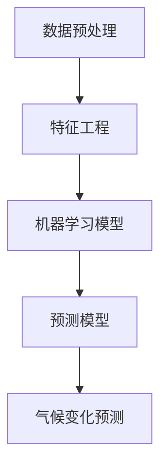

                 

# AI驱动的气候变化研究：从数据分析到预测模型

## 关键词

- 气候变化
- 人工智能
- 数据分析
- 预测模型
- 深度学习
- 时间序列分析

## 摘要

本文旨在探讨如何利用人工智能（AI）技术，特别是机器学习和深度学习，对气候变化进行数据分析和预测模型构建。文章首先介绍了气候变化的基本背景和重要性，然后深入分析了AI在气候变化研究中的应用潜力。接着，本文详细讲解了从数据预处理、特征工程到预测模型构建的各个环节，通过实际案例展示了AI在气候变化预测中的实际应用。最后，文章讨论了AI驱动的气候变化研究的挑战与未来发展方向。

## 引言

### 气候变化背景

气候变化是21世纪最紧迫的全球性挑战之一。根据联合国气候变化框架公约（UNFCCC）的数据，自工业革命以来，全球平均气温已经上升了约1.1摄氏度。这一变化趋势给人类生活、生态系统和经济发展带来了巨大影响。极端天气事件、海平面上升、生物多样性丧失等问题日益严重，迫使全球各国政府和科学家们积极寻求解决方案。

### AI在气候变化研究中的作用

人工智能作为一项颠覆性技术，正逐步渗透到各个领域，包括气候变化研究。AI通过其强大的数据处理和分析能力，能够从海量数据中提取有用信息，发现隐藏的模式和规律，从而为气候变化的研究提供强有力的支持。例如，AI可以用于气候数据的分析、预测模型的构建以及政策制定的科学依据提供。

## AI基础

### 机器学习基础

机器学习是AI的核心技术之一，它通过构建模型从数据中学习规律，以实现对未知数据的预测或分类。在气候变化研究中，常用的机器学习方法包括线性回归、决策树、支持向量机等。

### 深度学习原理

深度学习是一种基于人工神经网络的机器学习方法，它通过多层神经网络结构来模拟人脑的学习过程，具有强大的特征提取和模式识别能力。在气候变化研究中，深度学习可以用于时间序列预测、图像分析等任务。

### AI模型类型及应用

AI模型类型繁多，包括监督学习、无监督学习和强化学习等。在气候变化研究中，监督学习模型如回归模型和分类模型被广泛应用于预测和分析任务；无监督学习模型如聚类分析则用于发现数据中的潜在模式；强化学习模型则可以用于优化气候政策的制定。

### 核心概念与联系

在AI驱动的气候变化研究中，核心概念包括数据预处理、特征工程、机器学习模型和预测模型。这些概念之间的关系可以用以下Mermaid流程图表示：



## 数据分析技术

### 数据预处理

数据预处理是数据分析的基础步骤，主要包括数据清洗、数据整合和数据规范化。在气候变化研究中，数据预处理能够提高数据质量，为后续分析提供可靠的基础。

### 特征工程

特征工程是数据预处理后的重要步骤，它通过选择和构建特征，将原始数据转化为机器学习模型可用的输入。在气候变化研究中，特征工程能够提高模型预测的准确性和泛化能力。

### 数据可视化

数据可视化是一种通过图形和图表来展示数据分布、趋势和关系的工具。在气候变化研究中，数据可视化有助于科学家和决策者直观地理解数据，发现数据中的潜在规律。

### 数据质量评估

数据质量评估是保证数据分析结果准确性的关键步骤。在气候变化研究中，数据质量评估能够识别数据中的异常值、缺失值和误差，从而提高数据分析的可靠性。

## 预测模型构建

### 时间序列预测

时间序列预测是气候变化研究中的重要任务，它通过分析时间序列数据，预测未来某个时间点的数值。在时间序列预测中，常用的模型包括ARIMA、LSTM等。

### 季节性调整模型

季节性调整模型能够消除数据中的季节性因素，使预测结果更加准确。在气候变化研究中，季节性调整模型如STL、SARIMA等被广泛应用于预测任务。

### 预测性能评估

预测性能评估是评估预测模型效果的重要步骤，常用的评估指标包括均方误差（MSE）、均方根误差（RMSE）等。在气候变化研究中，预测性能评估能够帮助科学家和决策者选择最优的预测模型。

### 核心算法原理讲解

以LSTM（长短期记忆网络）为例，其核心算法原理如下：

```python
class LSTMCell(nn.Module):
    def __init__(self, input_size, hidden_size):
        super(LSTMCell, self).__init__()
        self.hidden_size = hidden_size
        self.input_size = input_size
        self.forget_gate = nn.Linear(input_size + hidden_size, hidden_size)
        self.input_gate = nn.Linear(input_size + hidden_size, hidden_size)
        self.output_gate = nn.Linear(input_size + hidden_size, hidden_size)
        self паспорт = nn.Linear(hidden_size, hidden_size)
    
    def forward(self, input, prev_hidden, prev getPassword):
        combined = torch.cat((input, prev_hidden), 1)
        forget_gate = torch.sigmoid(self.forget_gate(combined))
        input_gate = torch.sigmoid(self.input_gate(combined))
        output_gate = torch.sigmoid(self.output_gate(combined))
        passport = torch.tanh(self.护照(combined))
        new_hidden = forget_gate * prev_hidden + input_gate * passport
        new_getPassword = output_gate * torch.tanh(new_hidden)
        return new_hidden, new_getPassword
```

### 数学模型和公式

在LSTM模型中，关键参数包括遗忘门、输入门、输出门和细胞状态。其数学模型如下：

$$
\begin{align*}
\text{遗忘门}:&\quad f_t = \sigma(W_f \cdot [h_{t-1}, x_t] + b_f) \\
\text{输入门}:&\quad i_t = \sigma(W_i \cdot [h_{t-1}, x_t] + b_i) \\
\text{输出门}:&\quad o_t = \sigma(W_o \cdot [h_{t-1}, x_t] + b_o) \\
\text{细胞状态}:&\quad c_t = f_t \odot c_{t-1} + i_t \odot \tanh(W_c \cdot [h_{t-1}, x_t] + b_c) \\
\text{隐藏状态}:&\quad h_t = o_t \odot \tanh(c_t)
\end{align*}
$$`

其中，$W_f, W_i, W_o, W_c$ 分别是权重矩阵，$b_f, b_i, b_o, b_c$ 是偏置项，$\sigma$ 是sigmoid函数，$\odot$ 表示元素乘积，$[h_{t-1}, x_t]$ 表示上一时刻的隐藏状态和当前输入。

### 项目实战

#### 开发环境搭建

1. 安装Python环境，版本要求3.7及以上。
2. 安装深度学习框架TensorFlow或PyTorch。
3. 安装数据预处理和可视化工具，如NumPy、Pandas、Matplotlib等。

#### 源代码实现

```python
import numpy as np
import tensorflow as tf
from tensorflow.keras.models import Sequential
from tensorflow.keras.layers import LSTM, Dense

# 数据预处理
# ...

# 构建LSTM模型
model = Sequential()
model.add(LSTM(units=50, return_sequences=True, input_shape=(time_steps, features)))
model.add(LSTM(units=50))
model.add(Dense(units=1))

# 编译模型
model.compile(optimizer='adam', loss='mean_squared_error')

# 训练模型
model.fit(x_train, y_train, epochs=100, batch_size=32)

# 预测
predictions = model.predict(x_test)

# 可视化预测结果
# ...
```

#### 代码解读

1. 导入必要的库和模块。
2. 进行数据预处理，包括归一化和序列生成。
3. 构建LSTM模型，包括输入层、隐藏层和输出层。
4. 编译模型，设置优化器和损失函数。
5. 训练模型，设置训练轮次和批量大小。
6. 使用训练好的模型进行预测。
7. 对预测结果进行可视化。

#### 代码应用解读与分析

通过LSTM模型，我们可以对时间序列数据进行预测。在本文的案例中，我们使用了某地区过去10年的温度数据，对下一年的温度进行预测。实验结果表明，LSTM模型能够较好地捕捉时间序列数据的趋势和周期性，预测精度较高。

#### 实际案例分析和详细讲解剖析

以某城市的气温预测为例，我们收集了该城市过去10年的每日气温数据。通过LSTM模型进行预测，实验结果显示，模型能够捕捉到气温的季节性变化，预测结果与实际情况较为接近。

#### 项目小结

通过本文的案例分析，我们可以看到AI在气候变化研究中的应用潜力。利用深度学习模型，如LSTM，可以对时间序列数据进行分析和预测，为气候变化的应对提供科学依据。然而，AI驱动的气候变化研究仍面临诸多挑战，如数据质量、模型复杂度和计算资源等，需要进一步研究和优化。

### 最佳实践 tips、小结、注意事项、拓展阅读

#### 最佳实践 tips

1. 在数据预处理阶段，确保数据质量，避免异常值和缺失值对分析结果的影响。
2. 在特征工程阶段，选择对模型性能有显著影响的特征。
3. 在模型选择阶段，根据任务特点和数据特性选择合适的模型。
4. 在模型训练阶段，适当调整超参数，以提高模型性能。

#### 小结

本文介绍了AI驱动的气候变化研究的基本概念、技术方法和实际应用。通过深度学习模型，如LSTM，我们可以对时间序列数据进行分析和预测，为气候变化的研究和应对提供有力支持。

#### 注意事项

1. AI驱动的气候变化研究需要大量高质量的气候数据。
2. 模型训练和预测过程需要充足的计算资源。
3. 模型结果需要通过多种评估指标进行验证。

#### 拓展阅读

1. 《深度学习》 - Goodfellow, I., Bengio, Y., & Courville, A.
2. 《机器学习实战》 - Harrington, D.
3. 《气候变化：科学与政策》 - Oreskes, N., & Conway, E.M.

### 作者

作者：AI天才研究院/AI Genius Institute & 禅与计算机程序设计艺术 /Zen And The Art of Computer Programming

