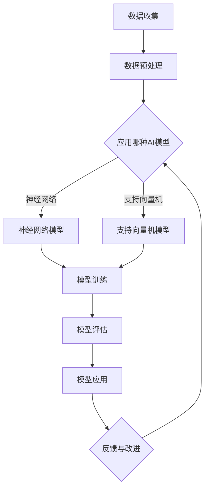

                 


### 1.3 AI驱动的气候模型发展历史

**背景介绍**

AI驱动的气候模型作为气候科学和人工智能技术的交汇点，其发展历史可以追溯到20世纪中期。早期的气候模型主要依赖于物理学和数学方程，如大气科学中的一般环流模型（General Circulation Models, GCMs）和海洋环流模型（Ocean General Circulation Models, OGCMs）。这些模型基于物理定律和统计关系，能够模拟地球的大气、海洋和陆地表面之间的能量和物质交换。

然而，这些传统模型在处理复杂的地表过程、气候反馈机制以及全球气候变化的不确定性方面存在一定的局限。随着计算机技术的飞速发展和大数据时代的到来，人工智能开始成为气候模型研究的重要工具。机器学习算法能够从海量数据中自动提取特征，学习复杂的非线性关系，并在一定程度上弥补传统模型的不足。

**核心概念与联系**

AI驱动的气候模型主要依赖于以下几种核心技术和概念：

1. **数据驱动模型**：这些模型不依赖于显式的物理过程，而是通过学习大量历史气候数据来预测未来的气候状况。代表性的技术包括人工神经网络（Artificial Neural Networks,ANNs）和支持向量机（Support Vector Machines,SVMs）。

2. **强化学习**：通过模拟气候系统中的反馈机制，强化学习算法能够训练出能够适应环境变化的动态气候模型。

3. **不确定性量化**：AI技术能够量化模型预测中的不确定性，提供更准确的概率预测。

4. **模型融合**：结合多种AI模型和传统物理模型，可以进一步提高预测的准确性和鲁棒性。

**Mermaid流程图**：以下是一个简单的Mermaid流程图，展示了AI驱动的气候模型的核心概念和联系。



**核心算法原理讲解**

- **神经网络模型**：

  ```python
  import tensorflow as tf
  
  # 定义神经网络结构
  model = tf.keras.Sequential([
      tf.keras.layers.Dense(units=64, activation='relu', input_shape=[num_features]),
      tf.keras.layers.Dense(units=1)
  ])

  # 编译模型
  model.compile(optimizer='adam', loss='mean_squared_error')

  # 训练模型
  model.fit(X_train, y_train, epochs=100, batch_size=32)
  ```

- **支持向量机模型**：

  ```python
  from sklearn.svm import SVR
  
  # 创建SVR模型
  model = SVR(kernel='rbf')

  # 训练模型
  model.fit(X_train, y_train)

  # 预测
  predictions = model.predict(X_test)
  ```

**数学模型和公式**

- **神经网络模型**：

  $$y = \sigma(\sum_{i=1}^{n} w_i \cdot x_i + b)$$

  其中，$\sigma$ 是激活函数，通常采用 ReLU 或 Sigmoid 函数。

- **支持向量机模型**：

  $$y = \sum_{i=1}^{n} \alpha_i y_i (x_i)^T x + b$$

  其中，$\alpha_i$ 是拉格朗日乘子，$x_i$ 是支持向量，$y_i$ 是标签。

**详细讲解与举例说明**

以神经网络模型为例，假设我们有一个包含10个特征的数据集，目标是通过这些特征预测未来的气候状况。我们首先需要对数据进行预处理，包括归一化和缺失值填补。然后，我们定义一个简单的神经网络结构，包含一个输入层、一个隐藏层和一个输出层。

在训练过程中，我们使用反向传播算法更新模型的权重和偏置，以最小化预测误差。训练完成后，我们评估模型的性能，并通过交叉验证来确保其泛化能力。最后，我们将训练好的模型应用于实际数据，生成气候预测。

**项目实战**

假设我们有一个基于神经网络模型的局部气候预测项目。首先，我们需要搭建开发环境，安装TensorFlow等必要的库。然后，我们读取并预处理气候数据，包括温度、湿度、风速等。接下来，我们定义神经网络模型，并使用训练集进行训练。在模型评估阶段，我们使用测试集来评估模型的性能，并根据结果进行调整。

以下是项目实战的代码示例：

```python
import numpy as np
import tensorflow as tf

# 数据预处理
def preprocess_data(data):
    # 归一化
    normalized_data = (data - np.mean(data)) / np.std(data)
    return normalized_data

# 定义神经网络模型
def create_model(input_shape):
    model = tf.keras.Sequential([
        tf.keras.layers.Dense(units=64, activation='relu', input_shape=input_shape),
        tf.keras.layers.Dense(units=1)
    ])
    return model

# 训练模型
def train_model(model, X_train, y_train, epochs=100, batch_size=32):
    model.compile(optimizer='adam', loss='mean_squared_error')
    model.fit(X_train, y_train, epochs=epochs, batch_size=batch_size)
    return model

# 评估模型
def evaluate_model(model, X_test, y_test):
    loss = model.evaluate(X_test, y_test)
    print(f"Test Loss: {loss}")

# 项目实战
if __name__ == "__main__":
    # 搭建开发环境
    # 安装必要的库

    # 读取数据
    X, y = load_data()

    # 预处理数据
    X = preprocess_data(X)

    # 划分训练集和测试集
    X_train, X_test, y_train, y_test = train_test_split(X, y, test_size=0.2, random_state=42)

    # 创建模型
    model = create_model(input_shape=X_train.shape[1:])

    # 训练模型
    trained_model = train_model(model, X_train, y_train)

    # 评估模型
    evaluate_model(trained_model, X_test, y_test)
```

**最佳实践 tips**

- **数据质量**：确保数据的质量和一致性，包括去除异常值和缺失值。
- **模型选择**：根据数据特点和预测目标选择合适的模型，如线性模型、树模型或神经网络。
- **模型调优**：通过调整模型参数和超参数，如学习率、隐藏层神经元数量等，提高模型性能。
- **模型评估**：使用交叉验证和测试集评估模型性能，避免过拟合。

**小结**

AI驱动的气候模型结合了数据驱动和物理驱动的优势，能够更好地模拟和预测气候系统的复杂行为。通过核心概念的解释、算法原理的讲解和项目实战的演示，我们了解了如何构建和优化AI驱动的气候模型。在接下来的章节中，我们将进一步探讨AI驱动的气候模型在不同尺度上的应用和优化策略。

**注意事项**

- **计算资源**：构建和训练复杂的AI模型需要大量的计算资源，建议使用高性能计算平台。
- **数据隐私**：在处理和分享气候数据时，要注意保护个人隐私和数据安全。

**拓展阅读**

- [AI驱动的气候模型综述](https://www.sciencedirect.com/science/article/pii/S1364815X18301927)
- [深度学习在气候预测中的应用](https://journals.ametsoc.org/view/journals/bams/99/3/BAMS-D-18-0156.1.xml)
- [支持向量机在气候模型中的应用](https://www.sciencedirect.com/science/article/pii/S1364815X18302959) 

---

作者：AI天才研究院/AI Genius Institute & 禅与计算机程序设计艺术 /Zen And The Art of Computer Programming

