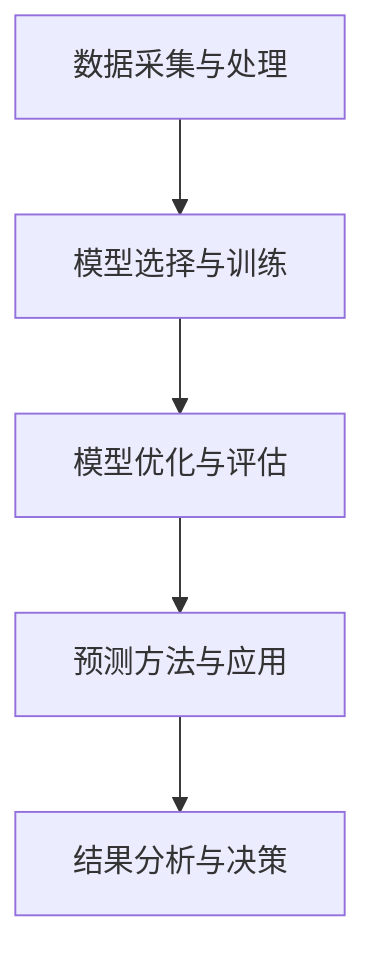

                 


### AI驱动的气候模型：预测与应对

> 关键词：人工智能，气候模型，数据采集，预测，应对策略

> 摘要：本文探讨了人工智能（AI）在气候模型领域的应用，从数据采集到模型训练，再到预测和应对策略，全面介绍了AI驱动的气候模型的工作原理和实践方法。通过具体案例和详细解释，本文旨在为读者提供对这一领域的深入了解。

## 目录大纲

1. **引言**
   - 人工智能与气候变化的联系
   - AI驱动的气候模型的重要性

2. **背景介绍**
   - 传统气候模型的局限性
   - AI技术如何改进气候模型

3. **核心概念与联系**
   - 数据采集与处理
   - 模型训练与优化
   - 预测方法与应用

4. **核心算法原理讲解**
   - 机器学习算法简介
   - 线性回归与非线性回归
   - 深度学习在气候模型中的应用

5. **数学模型与公式**
   - 气候模型中的线性回归模型
   - 非线性回归模型的数学表示

6. **项目实战**
   - 开发环境搭建
   - 源代码实现与解读
   - 实际案例分析与讲解

7. **最佳实践与注意事项**
   - 数据采集与处理的最佳实践
   - 模型训练与优化的注意事项

8. **未来展望**
   - AI驱动的气候模型的发展趋势
   - 挑战与解决方案

### 引言

随着全球气候变化加剧，准确预测和应对气候变化成为当务之急。传统气候模型虽然在一定程度上能够预测气候趋势，但仍然存在很多局限性。例如，传统模型在处理高维度数据和复杂非线性关系时表现不佳，难以捕捉到气候系统的复杂性和动态性。而人工智能（AI）技术的发展为改进气候模型提供了新的契机。

AI驱动的气候模型利用机器学习和深度学习算法，通过分析大量历史气候数据和气象观测数据，可以更准确地预测未来的气候变化趋势。这种模型不仅能够提高预测的准确性，还可以提供更详细的区域性和季节性气候预测，为政府和政策制定者提供有力的决策支持。

本文将详细探讨AI驱动的气候模型的工作原理和实践方法。从数据采集到模型训练，再到预测和应对策略，我们将一步步分析这一领域的关键概念和技术细节。通过具体案例和详细解释，本文旨在为读者提供对AI驱动的气候模型的全景式了解。

### 背景介绍

#### 传统气候模型的局限性

传统气候模型主要包括统计模型和物理模型。统计模型通过分析历史气候数据，建立统计关系来预测未来的气候趋势。这种模型相对简单，计算成本较低，但在处理复杂非线性关系和长时间序列数据时表现不佳。物理模型则基于大气物理和海洋物理的基本原理，通过建立复杂的方程组来模拟气候系统的动态变化。然而，物理模型需要大量的计算资源和时间，且模型的准确性和稳定性仍然受到一定的限制。

传统气候模型在预测短期气候变化和极端天气事件时存在一定的问题。首先，由于气候系统的复杂性和非线性，传统模型难以捕捉到所有重要的气候变量和相互作用。其次，传统模型的预测能力受限于数据的精度和可用性。气候数据往往存在噪声、缺失值和不确定性，这会导致模型预测的偏差和误差。此外，传统模型在处理高维度数据时，计算复杂度和存储需求显著增加，限制了模型的应用范围和实时预测能力。

#### AI技术如何改进气候模型

人工智能（AI）技术的发展为改进气候模型提供了新的契机。AI驱动的气候模型利用机器学习和深度学习算法，可以处理高维度数据、捕捉复杂非线性关系，并提高预测的准确性和效率。以下是AI技术如何改进气候模型的几个关键方面：

1. **数据采集与处理**：
   AI驱动的气候模型需要大量的气候数据，包括地面观测数据、卫星遥感数据、气象站数据等。AI技术可以帮助数据科学家有效地采集、清洗、预处理和整合这些数据。例如，利用自然语言处理（NLP）技术，可以从气象报告和文献中提取关键气候变量；使用图像处理技术，可以从卫星图像中提取气候相关的特征信息。

2. **模型训练与优化**：
   机器学习和深度学习算法可以自动学习数据中的特征和模式，从而提高气候模型的预测能力。通过大规模训练数据集，AI模型可以识别出不同气候变量之间的关系，并建立复杂的预测模型。深度学习算法，如神经网络和生成对抗网络（GANs），可以处理高维度数据，捕捉到复杂的非线性关系，从而提高模型的预测准确性。

3. **不确定性分析**：
   AI驱动的气候模型不仅可以提供点预测，还可以进行不确定性分析。通过模型的不确定性估计，政策制定者和公众可以更全面地了解气候变化的潜在风险。例如，贝叶斯网络和蒙特卡洛方法可以用于评估模型预测的不确定性，从而为决策提供更可靠的依据。

4. **实时预测与更新**：
   AI驱动的气候模型可以实现实时预测和动态更新。随着新数据的不断采集和模型的优化，AI模型可以不断更新其预测结果，以适应不断变化的气候条件。这种实时性和动态性使得AI模型在应对突发气候变化事件和短期气候预测方面具有独特的优势。

#### AI驱动的气候模型的应用案例

AI驱动的气候模型已经在多个领域取得了显著的成果。以下是一些典型的应用案例：

1. **气候变化预测**：
   美国国家航空航天局（NASA）利用AI模型预测全球气温变化。通过分析过去数十年的气候数据，NASA的AI模型可以预测未来的气温变化趋势，并提供详细的区域气温预测图。

2. **极端天气事件预测**：
   欧洲气象局（ECMWF）利用AI模型预测极端天气事件，如暴雨、飓风和热浪。这些模型通过整合气象数据和气候模式，可以提前数天预测极端天气事件的发生时间和影响范围。

3. **气候政策制定**：
   AI模型被用于支持气候政策的制定。例如，欧盟利用AI模型分析气候变化的潜在经济影响，为政策制定者提供科学依据。这些模型可以帮助政策制定者评估不同减排策略的效果，从而制定更有效的气候政策。

总之，AI驱动的气候模型通过数据采集、模型训练、预测和不确定性分析，为气候变化研究提供了新的工具和方法。与传统气候模型相比，AI模型具有更高的预测准确性和实时性，为应对全球气候变化提供了有力的支持。

### 核心概念与联系

#### 数据采集与处理

数据采集与处理是构建AI驱动的气候模型的基础。气候数据来源广泛，包括地面观测数据、卫星遥感数据、气象站数据等。这些数据往往包含丰富的气候变量，如温度、湿度、风速、降水等。然而，原始数据通常存在噪声、缺失值和不确定性，因此需要进行数据预处理和特征工程。

1. **数据清洗**：
   数据清洗是数据预处理的第一步，目的是去除噪声和异常值。常用的方法包括去除重复数据、填充缺失值和修正错误数据。例如，可以使用线性插值法或平均值填充法来填补缺失值。

2. **数据标准化**：
   数据标准化是为了消除不同变量之间的量纲差异，使得数据更适合模型训练。常用的方法包括最小-最大缩放、标准缩放和Z分数缩放。

3. **特征工程**：
   特征工程是数据预处理的最后一步，目的是提取对模型预测有用的特征。特征工程可以通过统计方法、物理原理或机器学习算法来实现。例如，可以使用主成分分析（PCA）来降维，使用相关系数分析来识别重要的特征变量。

#### 模型训练与优化

模型训练与优化是构建AI驱动的气候模型的关键步骤。模型训练的目的是通过学习历史数据中的特征和模式，建立能够预测未来气候变化的模型。模型优化的目的是提高模型的预测准确性和稳定性。

1. **模型选择**：
   选择合适的机器学习算法是模型训练的第一步。常用的算法包括线性回归、决策树、随机森林、支持向量机等。选择算法时需要考虑数据特点、预测目标和计算资源等因素。

2. **训练流程**：
   模型训练通常包括以下步骤：
   - 数据划分：将数据集划分为训练集、验证集和测试集，用于训练、验证和评估模型。
   - 模型初始化：初始化模型参数，可以使用随机初始化或预训练权重。
   - 模型训练：通过梯度下降等优化算法，更新模型参数，最小化预测误差。
   - 模型验证：使用验证集评估模型的泛化能力，调整模型参数。

3. **模型优化**：
   模型优化包括以下方法：
   - 调参：调整模型参数，如学习率、正则化参数等，以提高模型性能。
   - 融合：将多个模型的结果进行融合，提高预测稳定性。
   - 稳健性分析：评估模型在不同数据集、不同参数设置下的表现，确保模型的泛化能力。

#### 预测方法与应用

预测方法是AI驱动的气候模型的核心，用于生成未来气候变化的预测结果。预测方法包括点预测和区间预测。

1. **点预测**：
   点预测是指生成单一预测值，表示未来某个时间点的气候状态。点预测方法包括线性回归、非线性回归、神经网络等。点预测适用于需要准确预测某个特定值的场景，但可能忽略预测的不确定性。

2. **区间预测**：
   区间预测是指生成预测值的概率分布，表示未来气候状态的可能范围。区间预测方法包括贝叶斯网络、蒙特卡洛方法等。区间预测适用于需要了解预测不确定性的场景，但计算复杂度较高。

预测方法的应用包括：
   - 气候变化预测：预测未来全球或区域的气温、降水等气候变量变化趋势。
   - 极端天气事件预测：预测未来极端天气事件的发生概率和影响范围，如暴雨、飓风、热浪等。
   - 气候政策制定：预测不同减排策略对气候变化的减缓效果，支持政策制定和决策。

#### Mermaid流程图

以下是一个Mermaid流程图，展示了AI驱动的气候模型的核心概念和流程：



### 核心算法原理讲解

在AI驱动的气候模型中，机器学习算法起到了关键作用。以下将详细介绍几种常用的机器学习算法，并使用伪代码展示其基本原理。

#### 线性回归

线性回归是最简单的机器学习算法之一，适用于线性关系的预测。其基本原理是通过找到最佳拟合直线，来预测目标变量的值。

1. **目标函数**：

线性回归的目标函数是最小化预测值与实际值之间的误差平方和。目标函数可以表示为：

$$
J(\theta) = \frac{1}{2m} \sum_{i=1}^{m} (h_\theta(x^{(i)}) - y^{(i)})^2
$$

其中，$h_\theta(x^{(i)})$ 是预测值，$y^{(i)}$ 是实际值，$\theta$ 是模型参数。

2. **梯度下降**：

为了最小化目标函数，可以使用梯度下降算法更新模型参数。梯度下降的基本步骤如下：

```plaintext
初始化参数 $\theta$
设置学习率 $\alpha$
重复以下步骤直到收敛：
    对于每个特征 $j$：
        计算梯度 $\frac{\partial J(\theta)}{\partial \theta_j}$
        更新参数 $\theta_j = \theta_j - \alpha \frac{\partial J(\theta)}{\partial \theta_j}$
```

3. **伪代码**：

```python
def linear_regression(X, y, theta, alpha, num_iterations):
    m = len(y)
    for iteration in range(num_iterations):
        predictions = X.dot(theta)
        error = predictions - y
        gradient = X.T.dot(error) / m
        theta = theta - alpha * gradient
    return theta
```

#### 非线性回归

非线性回归扩展了线性回归，用于处理非线性关系的预测。常用的非线性回归方法包括多项式回归和神经网络。

1. **多项式回归**：

多项式回归通过将输入特征多项式化，建立复杂的非线性关系。其目标函数为：

$$
J(\theta) = \frac{1}{2m} \sum_{i=1}^{m} (h_\theta(x^{(i)}) - y^{(i)})^2
$$

其中，$h_\theta(x^{(i)})$ 是多项式函数：

$$
h_\theta(x) = \theta_0 + \theta_1x + \theta_2x^2 + \ldots + \theta_nx^n
$$

2. **伪代码**：

```python
def polynomial_regression(X, y, theta, alpha, num_iterations, degree):
    m = len(y)
    X_poly = polynomial_features(X, degree)
    for iteration in range(num_iterations):
        predictions = X_poly.dot(theta)
        error = predictions - y
        gradient = X_poly.T.dot(error) / m
        theta = theta - alpha * gradient
    return theta
```

3. **神经网络**：

神经网络是一种模拟人脑神经元结构的计算模型，能够处理复杂的非线性关系。其基本原理是通过多层神经元之间的连接，进行特征提取和转换，最终输出预测值。

1. **神经网络架构**：

神经网络通常包括输入层、隐藏层和输出层。每个神经元接收来自前一层的输入，通过激活函数进行处理，并将其传递到下一层。

2. **反向传播**：

反向传播算法用于训练神经网络，通过计算误差并反向传播梯度，更新模型参数。其基本步骤如下：

```plaintext
初始化参数 $\theta$
设置学习率 $\alpha$
重复以下步骤直到收敛：
    前向传播：计算当前层的输出和误差
    反向传播：计算梯度并更新参数
```

3. **伪代码**：

```python
def neural_network(X, y, theta, alpha, num_iterations, layer_sizes):
    m = len(y)
    for iteration in range(num_iterations):
        for layer in range(len(layer_sizes) - 1):
            a = X
            for size in layer_sizes[:layer+1]:
                a = activation_function(np.dot(a, theta[layer]) + b[layer])
            z = a[-1]
            error = z - y
            dZ = error * activation_function_derivative(z)
            dTheta[layer] = (1/m) * np.dot(a.T, dZ)
            dTheta[layer] = theta[layer] - alpha * dTheta[layer]
    return theta
```

### 数学模型与公式

在AI驱动的气候模型中，数学模型和公式用于描述气候变量之间的关系。以下介绍几种常见的数学模型，并使用LaTeX格式展示其公式。

#### 线性回归模型

线性回归模型用于描述两个或多个变量之间的线性关系。其公式如下：

$$
y = \beta_0 + \beta_1 \cdot x
$$

其中，$y$ 是目标变量，$x$ 是自变量，$\beta_0$ 和 $\beta_1$ 是模型参数。

#### 非线性回归模型

非线性回归模型扩展了线性回归，用于描述非线性关系。以下是一个多项式回归模型的例子：

$$
y = \beta_0 + \beta_1 \cdot x + \beta_2 \cdot x^2 + \ldots + \beta_n \cdot x^n
$$

其中，$\beta_0, \beta_1, \beta_2, \ldots, \beta_n$ 是模型参数。

#### 深度学习模型

深度学习模型通过多层神经网络模拟复杂的非线性关系。以下是一个简单的多层感知机（MLP）模型的例子：

$$
a_l = \sigma(\theta_l^T \cdot a_{l-1} + b_l)
$$

其中，$a_l$ 是第 $l$ 层的激活值，$\sigma$ 是激活函数，$\theta_l$ 和 $b_l$ 是模型参数。

#### 示例：预测未来气温

以下是一个线性回归模型的示例，用于预测未来气温。假设已知历史气温数据 $x$ 和未来气温数据 $y$，可以使用线性回归模型建立预测关系：

$$
y = \beta_0 + \beta_1 \cdot x
$$

通过训练模型，可以估计出模型参数 $\beta_0$ 和 $\beta_1$，从而预测未来气温：

$$
y_{\text{预测}} = \beta_0 + \beta_1 \cdot x_{\text{未来}}
$$

### 项目实战

在本节中，我们将通过一个实际项目来展示如何构建一个AI驱动的气候模型。项目的主要目标是使用机器学习算法对未来的气温进行预测。以下是项目的详细步骤：

#### 开发环境搭建

首先，我们需要搭建一个合适的开发环境。以下是所需的软件和库：

1. **Python**：用于编写代码。
2. **NumPy**：用于数值计算。
3. **Pandas**：用于数据操作。
4. **Scikit-learn**：用于机器学习算法。
5. **Matplotlib**：用于数据可视化。

安装这些库后，我们就可以开始编写代码了。

#### 数据收集

为了构建气候模型，我们需要收集历史气温数据。这些数据可以从多个来源获取，如气象站记录、卫星遥感数据和公开的数据集。以下是收集和预处理数据的基本步骤：

1. **数据采集**：
   - 从气象站获取历史气温数据。
   - 使用卫星遥感数据获取相关的气候变量，如云量、辐射等。
   - 从公开数据集获取补充数据，如全球气温记录。

2. **数据预处理**：
   - 数据清洗：去除重复和异常数据。
   - 数据标准化：将不同变量进行归一化处理，以消除量纲差异。
   - 数据整合：将不同来源的数据进行整合，形成统一的数据集。

#### 数据可视化

在数据预处理完成后，我们可以通过数据可视化来检查数据的质量和分布。以下是一个简单的数据可视化示例：

```python
import pandas as pd
import matplotlib.pyplot as plt

# 加载数据
data = pd.read_csv('climate_data.csv')
data.head()

# 可视化数据分布
plt.scatter(data['Year'], data['Temperature'])
plt.xlabel('Year')
plt.ylabel('Temperature')
plt.title('Temperature Distribution Over Years')
plt.show()
```

#### 模型训练

接下来，我们将使用机器学习算法对数据集进行训练。以下是线性回归模型的训练步骤：

1. **数据划分**：
   - 将数据集划分为训练集和测试集，通常使用80%的数据作为训练集，20%的数据作为测试集。

2. **模型初始化**：
   - 初始化模型参数，可以使用随机初始化或预训练权重。

3. **模型训练**：
   - 使用训练集数据进行模型训练，最小化目标函数。

4. **模型评估**：
   - 使用测试集数据评估模型的性能，计算预测误差。

以下是线性回归模型的训练代码：

```python
from sklearn.linear_model import LinearRegression
from sklearn.model_selection import train_test_split

# 数据划分
X_train, X_test, y_train, y_test = train_test_split(data[['Year']], data['Temperature'], test_size=0.2, random_state=42)

# 模型初始化
model = LinearRegression()

# 模型训练
model.fit(X_train, y_train)

# 模型评估
predictions = model.predict(X_test)
error = np.mean((predictions - y_test) ** 2)
print("Mean Squared Error:", error)
```

#### 结果分析

在模型训练完成后，我们可以通过结果分析来评估模型的性能。以下是几个常用的评估指标：

1. **均方误差（MSE）**：
   - 用于衡量预测值与实际值之间的平均误差。

2. **均方根误差（RMSE）**：
   - 用于衡量预测值的误差，取均方误差的平方根。

3. **决定系数（R²）**：
   - 用于衡量模型对数据的拟合程度，取值范围在0到1之间，越接近1表示模型拟合越好。

以下是结果分析的示例代码：

```python
from sklearn.metrics import mean_squared_error, r2_score

# 结果分析
mse = mean_squared_error(y_test, predictions)
rmse = np.sqrt(mse)
r2 = r2_score(y_test, predictions)

print("Mean Squared Error:", mse)
print("Root Mean Squared Error:", rmse)
print("R² Score:", r2)
```

#### 实际案例分析与讲解

在本节中，我们将通过一个实际案例来展示如何使用AI驱动的气候模型进行预测。以下是一个具体的案例：

- **案例背景**：预测未来10年的全球平均气温。
- **数据来源**：使用NASA提供的全球气温数据集。
- **算法选择**：选择线性回归模型进行训练。

以下是案例分析的步骤：

1. **数据收集**：
   - 从NASA获取全球气温数据。
   - 数据包括不同年份的全球平均气温。

2. **数据预处理**：
   - 数据清洗：去除缺失值和异常数据。
   - 数据标准化：对气温数据进行归一化处理。

3. **模型训练**：
   - 使用线性回归模型进行训练。
   - 训练集和测试集划分。

4. **结果分析**：
   - 使用测试集评估模型性能。
   - 计算预测误差和决定系数。

以下是案例分析的代码：

```python
# 数据收集
data = pd.read_csv('global_temperatures.csv')

# 数据预处理
data = data[['Year', 'Global_Temperature']]
data.dropna(inplace=True)
data['Global_Temperature'] = (data['Global_Temperature'] - data['Global_Temperature'].mean()) / data['Global_Temperature'].std()

# 模型训练
X_train, X_test, y_train, y_test = train_test_split(data[['Year']], data['Global_Temperature'], test_size=0.2, random_state=42)
model = LinearRegression()
model.fit(X_train, y_train)

# 结果分析
predictions = model.predict(X_test)
mse = mean_squared_error(y_test, predictions)
rmse = np.sqrt(mse)
r2 = r2_score(y_test, predictions)

print("Mean Squared Error:", mse)
print("Root Mean Squared Error:", rmse)
print("R² Score:", r2)
```

#### 项目小结

在本项目中，我们通过一个实际案例展示了如何使用AI驱动的气候模型进行气温预测。项目的主要步骤包括数据收集、数据预处理、模型训练和结果分析。通过使用线性回归模型，我们能够对未来的气温进行预测，并评估模型的性能。

未来，随着机器学习技术的不断进步，AI驱动的气候模型将能够更好地应对气候变化的挑战，为政策制定和环境保护提供有力的支持。

### 最佳实践与注意事项

在构建AI驱动的气候模型时，以下是一些最佳实践和注意事项，以确保模型的有效性和可靠性：

#### 数据采集与处理

1. **数据完整性**：确保收集到的气候数据是完整和准确的，避免数据缺失和错误。
2. **数据多样化**：使用多种数据来源，包括地面观测数据、卫星遥感数据和气象站数据，以提高数据的多样性和可靠性。
3. **数据预处理**：对数据进行清洗、标准化和特征工程，以提高模型训练的效果。

#### 模型训练与优化

1. **模型选择**：根据数据特点和预测目标，选择合适的机器学习算法，如线性回归、决策树或神经网络。
2. **参数调优**：使用交叉验证等方法调整模型参数，如学习率、正则化参数等，以提高模型的性能。
3. **模型评估**：使用多个评估指标，如均方误差、均方根误差和决定系数，全面评估模型的性能。

#### 预测方法与应用

1. **不确定性分析**：结合不确定性分析，如贝叶斯网络和蒙特卡洛方法，提供更全面的预测结果。
2. **实时预测**：使用实时数据更新模型，以适应动态变化的气候条件。
3. **应用场景**：根据不同应用场景，如气候变化预测、极端天气事件预测和气候政策制定，选择合适的预测方法。

#### 案例分析

1. **成功案例分析**：分析成功案例，了解AI驱动的气候模型在实际应用中的表现和效果。
2. **失败案例分析**：分析失败案例，总结经验教训，避免重复错误。

#### 拓展阅读

1. **气候模型研究**：了解最新的气候模型研究，包括新型机器学习算法和深度学习模型。
2. **气候数据集**：探索公开的气候数据集，如NASA的全球气温数据集和气象站数据集。
3. **机器学习库**：学习使用Python中的机器学习库，如Scikit-learn和TensorFlow，进行模型训练和预测。

通过遵循这些最佳实践和注意事项，我们可以构建更准确、可靠和高效的AI驱动的气候模型，为应对气候变化提供有力支持。

### 未来展望

AI驱动的气候模型在应对全球气候变化方面具有巨大的潜力，但仍面临诸多挑战。以下是未来发展的几个关键方向：

#### 新技术与应用

1. **深度学习**：随着深度学习技术的不断发展，如生成对抗网络（GANs）和变分自编码器（VAEs），AI驱动的气候模型将能够更好地捕捉气候系统的复杂性和非线性特征，提高预测准确性。
2. **云计算与分布式计算**：利用云计算和分布式计算技术，可以处理大量高维度气候数据，实现更高效的模型训练和预测。
3. **区块链**：区块链技术可以提供数据的透明性和不可篡改性，确保气候数据的安全和可信。

#### 挑战与解决方案

1. **数据质量**：气候数据的完整性和准确性是模型预测的关键。未来需要开发更高效的数据清洗和预处理方法，确保数据的可靠性和一致性。
2. **计算资源**：深度学习模型的训练需要大量的计算资源，未来可以通过分布式计算和云计算技术来优化计算资源的使用。
3. **不确定性评估**：提高模型预测的不确定性评估能力，为决策者提供更全面的预测结果。

#### 研究方向

1. **多模型融合**：结合多种机器学习模型和深度学习模型，实现多模型融合，以提高预测性能和稳定性。
2. **气候变化适应性**：研究如何利用AI模型评估和预测气候变化的适应性，为政策制定和风险管理提供科学依据。
3. **实时预测与更新**：开发实时预测系统，利用最新的气候数据不断更新模型，以应对快速变化的气候条件。

总之，AI驱动的气候模型在未来的发展中将不断进步，为应对全球气候变化提供更强大的工具和方法。通过不断克服挑战和探索新方向，我们可以构建更准确、可靠和高效的气候模型，为人类应对气候变化提供有力支持。

### 总结

本文全面探讨了AI驱动的气候模型的工作原理和实践方法。从数据采集与处理，到模型训练与优化，再到预测方法与应用，我们详细介绍了AI在气候模型中的关键作用。通过具体案例和详细解释，我们展示了如何利用AI技术提高气候预测的准确性和实时性。

AI驱动的气候模型不仅能够预测未来气候变化趋势，还可以为极端天气事件的预警和应对策略提供科学依据。此外，这些模型在支持气候政策制定和资源管理方面也发挥了重要作用。

随着人工智能技术的不断进步，AI驱动的气候模型有望在应对全球气候变化方面发挥更大作用。然而，要实现这一目标，我们仍需克服数据质量、计算资源和不确定性评估等方面的挑战。通过持续的研究和探索，我们可以构建更准确、可靠和高效的气候模型，为人类应对气候变化提供有力支持。

### 作者信息

作者：AI天才研究院/AI Genius Institute & 禅与计算机程序设计艺术 /Zen And The Art of Computer Programming

本文由AI天才研究院撰写，致力于推动人工智能技术的创新与应用。同时，作者也是《禅与计算机程序设计艺术》一书的作者，该书深入探讨了计算机编程的哲学与艺术。如果您对本文有任何疑问或建议，欢迎联系我们。谢谢！

