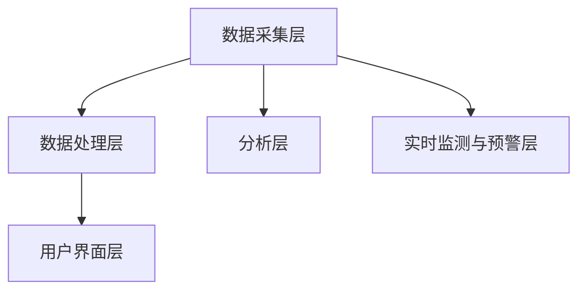
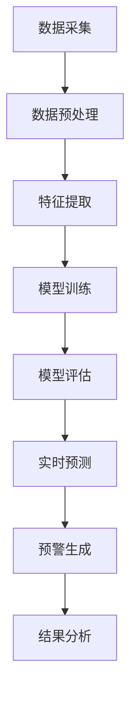

                 

### 引言

环境问题已经成为全球关注的焦点，空气质量监测和生态系统健康评估是环境监测的重要组成部分。传统的方法通常依赖于人工监测和常规实验室分析，这些方法不仅成本高昂，而且反应速度较慢。随着人工智能（AI）技术的快速发展，利用AI进行环境监测已经成为可能，不仅提高了监测的精度和效率，还能提供更为全面和及时的数据分析。

本文旨在探讨AI驱动的环境监测，特别是从空气质量监测到生态系统健康评估的各个方面。我们将首先介绍AI和机器学习的基础知识，然后详细讨论空气质量监测的应用场景，包括数据采集、预处理、模型选择与训练，以及监测结果的分析与可视化。接下来，我们将深入探讨环境监测系统的设计与实现，包括系统架构、数据处理与分析方法。随后，通过实际项目案例，展示AI驱动的环境监测在实践中的应用，并分析项目的成功与挑战。最后，我们将展望AI驱动的环境监测的未来发展趋势和面临的挑战。

关键词：人工智能，环境监测，空气质量，生态系统，机器学习，系统架构，数据处理

摘要：
本文深入探讨了AI驱动的环境监测，特别是空气质量监测和生态系统健康评估。通过介绍AI的基础理论和相关技术，我们详细阐述了空气质量监测的应用场景和系统设计与实现。通过实际项目案例，我们展示了AI驱动的环境监测在实际应用中的优势和挑战。本文旨在为研究人员和实践者提供全面的指导和参考，以推动AI在环境监测领域的应用和发展。

----------------------------------------------------------------

# AI技术基础

## 1.1 AI概述

人工智能（Artificial Intelligence, AI）是指由人制造出来的系统所表现出来的智能行为。自1956年达特茅斯会议以来，人工智能经历了数十年的发展，从最初的符号主义、知识表示到连接主义，再到如今的深度学习和强化学习，AI技术已经取得了显著的进展。AI的核心目标是使机器能够执行人类智能任务，如视觉识别、语音识别、自然语言处理、决策推理等。

### 1.1.1 AI的定义与发展历程

AI的定义可以有多种解释，但通常认为它涉及使计算机系统具备感知、理解、学习和适应新环境的能力。AI的发展历程可以分为以下几个阶段：

- **符号主义（Symbolic AI）**：早期AI以符号主义为代表，主要依赖于逻辑推理和知识表示。这种方法的代表是专家系统（Expert Systems），它通过建立规则库来模拟人类专家的决策过程。

- **连接主义（Connectionist AI）**：随着神经科学的发展，连接主义AI应运而生。它模拟人脑神经网络的工作原理，通过调整神经元之间的连接权重来学习任务。深度神经网络（Deep Neural Networks, DNN）和卷积神经网络（Convolutional Neural Networks, CNN）是其典型代表。

- **行为主义（Behavior-Based AI）**：行为主义AI通过设计多个简单行为模块，使机器能够通过组合这些行为来达到复杂目标。这种方法在机器人领域得到了广泛应用。

- **统计学习（Statistical Learning）**：统计学习方法利用大量数据训练模型，通过数据驱动的方式实现智能行为。监督学习（Supervised Learning）、无监督学习（Unsupervised Learning）和半监督学习（Semi-Supervised Learning）是其核心内容。

- **强化学习（Reinforcement Learning）**：强化学习通过奖励机制引导机器学习行为，使其在特定环境中找到最优策略。这种方法在游戏、机器人控制等领域取得了显著成果。

### 1.1.2 AI的核心技术简介

AI的核心技术主要包括机器学习、深度学习和自然语言处理等。

- **机器学习（Machine Learning）**：机器学习是使计算机系统能够从数据中学习并做出决策的方法。它分为监督学习、无监督学习和半监督学习。监督学习使用标记数据训练模型，无监督学习发现数据中的结构，半监督学习结合了标记数据和未标记数据。

- **深度学习（Deep Learning）**：深度学习是机器学习的一个分支，它使用多层神经网络进行特征学习和模式识别。深度学习在图像识别、语音识别和自然语言处理等领域取得了突破性成果。

- **自然语言处理（Natural Language Processing, NLP）**：自然语言处理旨在使计算机理解和生成自然语言。它包括文本分类、情感分析、机器翻译、语音识别等多个子领域。

- **计算机视觉（Computer Vision）**：计算机视觉是使计算机能够理解和解释视觉信息的技术。它涉及图像识别、物体检测、图像分割等任务。

### 1.1.3 AI在不同领域的应用

AI技术在各行各业都有广泛应用。以下是一些关键领域的应用实例：

- **医疗保健**：AI在医疗保健领域的应用包括疾病诊断、药物研发、个性化治疗和医疗机器人等。例如，通过深度学习算法可以分析医学图像，提高诊断的准确率。

- **金融**：AI在金融领域的应用包括风险管理、算法交易、欺诈检测和信用评分等。例如，利用机器学习模型可以预测市场趋势，提高交易成功率。

- **制造**：AI在制造业的应用包括智能制造、质量控制、预测维护和供应链优化等。例如，通过计算机视觉技术可以实现无人化生产线的质量监控。

- **交通**：AI在交通领域的应用包括自动驾驶、智能交通管理和物流优化等。例如，自动驾驶汽车通过深度学习算法实现自主导航和驾驶。

- **环境监测**：AI在环境监测领域的应用包括空气质量监测、水质监测和生态系统健康评估等。例如，通过AI技术可以实时监测空气质量，提供决策支持。

AI技术的不断进步为环境监测带来了新的机遇，它不仅提高了监测的精度和效率，还推动了环境监测系统的智能化和自动化。在接下来的章节中，我们将进一步探讨AI技术在环境监测中的应用场景和实现方法。

## 1.2 机器学习原理

机器学习（Machine Learning, ML）是人工智能（AI）的核心技术之一，它使计算机系统能够从数据中学习并做出预测或决策。机器学习可以分为几种不同的类型，每种类型都有其独特的应用场景和实现方法。以下是对监督学习、无监督学习和半监督学习的基本原理及其在环境监测中的应用的详细讨论。

### 1.2.1 机器学习的分类

机器学习可以分为以下几种主要类型：

- **监督学习（Supervised Learning）**：监督学习是最常见的机器学习类型，它使用标记数据集来训练模型。标记数据是指每条数据都带有正确的输出标签。监督学习分为分类和回归两种。

  - **分类（Classification）**：分类任务的目标是将输入数据映射到有限的类别中。例如，在空气质量监测中，可以将空气污染程度分为“良好”、“中等”或“差”。
  
  - **回归（Regression）**：回归任务的目标是预测一个连续的输出值。例如，在环境监测中，可以预测未来的气温或降雨量。

- **无监督学习（Unsupervised Learning）**：无监督学习使用未标记的数据集来发现数据中的结构或模式。它主要包括聚类和降维。

  - **聚类（Clustering）**：聚类任务的目标是将相似的数据点分组到同一类别中。例如，在空气质量监测中，可以根据空气污染指标将不同的区域划分为不同的污染群体。

  - **降维（Dimensionality Reduction）**：降维任务的目标是减少数据集的维度，同时保留重要的信息。例如，可以使用主成分分析（PCA）来减少空气污染数据的维度。

- **半监督学习（Semi-Supervised Learning）**：半监督学习结合了标记数据和未标记数据，利用未标记数据提供额外的学习信号，以提高模型的性能。

### 1.2.2 监督学习

监督学习在环境监测中有广泛的应用，特别是在空气质量监测中。以下是一个简化的监督学习过程：

1. **数据采集**：收集空气污染相关的数据，包括污染物浓度、气象数据等。
2. **数据预处理**：清洗数据，处理缺失值，标准化或归一化数据。
3. **特征选择**：选择对空气质量影响最大的特征。
4. **模型选择**：选择适合分类或回归任务的模型，如支持向量机（SVM）、随机森林（Random Forest）、神经网络等。
5. **模型训练**：使用标记数据集训练模型。
6. **模型评估**：使用验证集或测试集评估模型的性能。
7. **模型部署**：将训练好的模型部署到实际应用中，进行实时空气质量预测。

在空气质量监测中，监督学习模型可以帮助预测未来一段时间内的空气质量状况，从而为政府和企业提供决策支持，优化污染控制措施。

### 1.2.3 无监督学习

无监督学习在环境监测中也有重要作用，尤其是在水质监测和生态系统健康评估中。以下是一个简化的无监督学习过程：

1. **数据采集**：收集水样数据，包括化学成分、生物指标等。
2. **数据预处理**：清洗数据，处理缺失值，标准化或归一化数据。
3. **特征选择**：选择对水质影响最大的特征。
4. **模型选择**：选择适合聚类或降维任务的模型，如K-均值聚类（K-Means Clustering）、主成分分析（PCA）等。
5. **模型训练**：使用未标记数据集训练模型。
6. **模型评估**：评估模型是否能够有效发现数据中的结构和模式。
7. **模型应用**：将训练好的模型应用到实际监测中，如识别不同的水质污染类型。

例如，通过K-均值聚类，可以将不同的水样划分为不同的污染类型，从而帮助监测人员更有效地监测和管理水质污染。

### 1.2.4 半监督学习

半监督学习在环境监测中可以发挥重要作用，因为它可以利用大量未标记的数据来提高模型的性能。以下是一个简化的半监督学习过程：

1. **数据采集**：收集空气污染、水质和生态系统健康相关的数据。
2. **数据预处理**：清洗数据，处理缺失值，标准化或归一化数据。
3. **特征选择**：选择对空气质量、水质和生态系统健康影响最大的特征。
4. **模型选择**：选择适合半监督学习的模型，如自编码器（Autoencoder）、图卷积网络（Graph Convolutional Networks, GNN）等。
5. **模型训练**：使用标记数据和未标记数据共同训练模型。
6. **模型评估**：评估模型在标记数据集上的性能，同时关注未标记数据的利用效果。
7. **模型部署**：将训练好的模型部署到实际监测中，进行实时预测和分析。

例如，使用自编码器可以同时利用标记数据和未标记数据，提高空气质量监测的准确性。

通过监督学习、无监督学习和半监督学习的结合，AI驱动的环境监测可以实现更全面、更准确的监测和预测，为环境保护和可持续发展提供有力的技术支持。

### 1.2.5 强化学习原理与应用

强化学习（Reinforcement Learning, RL）是一种通过试错和反馈来学习如何在特定环境中做出最优决策的机器学习方法。与监督学习和无监督学习不同，强化学习不是通过数据训练模型，而是通过与环境交互来学习策略。以下是对强化学习的基本原理及其在环境监测中的应用的讨论。

#### 1.2.5.1 基本原理

强化学习由以下四个主要组成部分构成：

- **代理（Agent）**：执行动作的智能体，如无人机或环境监测设备。
- **环境（Environment）**：代理所处的环境，包括各种状态和可能的动作。
- **状态（State）**：代理在环境中所处的条件或位置。
- **动作（Action）**：代理可以执行的行为或决策。

强化学习的目标是为代理设计一个策略（Policy），使得代理能够在给定状态下选择最优动作，从而最大化长期奖励。

强化学习的主要原理是通过试错来学习策略。代理在环境中执行动作，根据当前状态和动作获得的奖励来调整策略。这个过程称为“交互”。代理通过不断的交互，学习到在特定状态下应该执行哪个动作可以获得最大的奖励。

#### 1.2.5.2 策略学习与模型学习

强化学习可以分为策略学习和模型学习两种类型：

- **策略学习（Policy Learning）**：直接学习最优策略，即给定状态，选择最佳动作。常用的策略学习算法包括Q-学习（Q-Learning）和策略梯度方法（Policy Gradient Methods）。

  - **Q-学习**：Q-学习是基于值函数的方法，它通过更新Q值来学习最优策略。Q值表示在特定状态下执行特定动作的期望回报。
  
  - **策略梯度方法**：策略梯度方法通过直接优化策略的概率分布来学习最优策略。它包括REINFORCE算法和actor-critic算法。

- **模型学习（Model Learning）**：学习环境模型，即预测在特定状态下执行特定动作的奖励和下一个状态。模型学习的方法包括基于模型的强化学习（Model-Based RL）和模型自由强化学习（Model-Free RL）。

  - **基于模型的强化学习**：通过学习环境模型，代理可以预测未来的状态和奖励，从而选择最优动作。
  
  - **模型自由强化学习**：不依赖于环境模型，直接通过经验进行学习。

#### 1.2.5.3 强化学习在环境监测中的应用

强化学习在环境监测中具有广泛的应用潜力，特别是在动态环境中的监测任务中。以下是一些典型的应用场景：

- **空气质量监测**：使用无人机进行空气质量监测时，可以通过强化学习算法优化飞行路径，最大化监测覆盖率和数据质量。

  - **状态**：无人机的位置、高度和方向。
  - **动作**：改变无人机的飞行方向或高度。
  - **奖励**：监测到的新污染源或获取的高质量数据。

- **水质监测**：通过强化学习优化水质监测站点的位置和监测频率，提高监测的准确性和效率。

  - **状态**：水质参数、历史监测数据、天气条件。
  - **动作**：选择监测站点或调整监测频率。
  - **奖励**：监测到的水质变化或发现的新污染源。

- **生态系统健康评估**：利用强化学习优化生态监测站点的布局，实现全面的生态系统健康评估。

  - **状态**：生态指标、历史监测数据、地理位置。
  - **动作**：选择监测站点或调整监测参数。
  - **奖励**：监测到的生态系统变化或发现的生态问题。

通过强化学习，环境监测系统能够自适应地调整监测策略，以适应动态变化的环境，提高监测的准确性和效率。这为环境保护和可持续发展提供了有力的技术支持。

### 1.3 深度学习基础

深度学习（Deep Learning, DL）是机器学习的一个分支，它通过模拟人脑神经网络的结构和功能来实现高效的图像识别、语音识别、自然语言处理等任务。深度学习的核心是多层神经网络（Deep Neural Networks, DNN），通过层层提取图像、语音或文本的特征，从而实现复杂任务的自动化和智能化。

#### 1.3.1 神经网络架构

神经网络（Neural Networks, NN）是由大量相互连接的神经元组成的计算模型。每个神经元相当于一个简单的计算单元，它接收输入信号，通过加权求和后，再通过激活函数产生输出。神经网络的架构通常包括输入层、隐藏层和输出层。

- **输入层（Input Layer）**：接收外部输入数据，例如图像像素、语音信号或文本数据。
- **隐藏层（Hidden Layers）**：对输入数据进行特征提取和变换，隐藏层可以有一个或多个，每个隐藏层中的神经元会对输入进行加权求和并传递给下一层。
- **输出层（Output Layer）**：产生最终输出结果，例如分类标签、预测值或控制信号。

神经网络中的每个连接（称为“边”）都有一个权重，这些权重通过训练过程进行调整，以优化网络的性能。激活函数（Activation Function）是神经网络中的一个关键组件，它用于引入非线性特性，使神经网络能够拟合复杂的数据分布。

常见的激活函数包括：

- **sigmoid函数**：\( f(x) = \frac{1}{1 + e^{-x}} \)
- **ReLU函数**：\( f(x) = \max(0, x) \)
- **tanh函数**：\( f(x) = \frac{e^x - e^{-x}}{e^x + e^{-x}} \)

#### 1.3.2 深度学习算法

深度学习算法包括多种类型，其中最常见的有卷积神经网络（Convolutional Neural Networks, CNN）、循环神经网络（Recurrent Neural Networks, RNN）和生成对抗网络（Generative Adversarial Networks, GAN）等。

- **卷积神经网络（CNN）**：CNN是一种专门用于图像处理的神经网络，它通过卷积操作提取图像特征。卷积层可以自动学习图像的局部特征，如边缘、纹理和形状。CNN在计算机视觉任务中取得了显著成果，例如图像分类、物体检测和图像分割。

  - **卷积层（Convolutional Layer）**：卷积层通过卷积操作提取图像特征，每个卷积核可以学习一种特征模式。
  - **池化层（Pooling Layer）**：池化层用于降低特征图的维度，减少参数数量，防止过拟合。
  - **全连接层（Fully Connected Layer）**：全连接层将卷积层提取的特征映射到分类标签或其他输出。

- **循环神经网络（RNN）**：RNN是一种用于序列数据处理的神经网络，它可以处理变长的输入序列。RNN通过循环结构保持长时记忆，从而捕捉序列中的长期依赖关系。RNN在自然语言处理、语音识别和时间序列预测等领域得到了广泛应用。

  - **隐藏层（Hidden Layer）**：RNN的隐藏层通过循环连接，使得信息可以在时间步之间传递。
  - **门控机制（Gate Mechanism）**：为了解决RNN的梯度消失和梯度爆炸问题，引入了门控机制，如长短期记忆网络（Long Short-Term Memory, LSTM）和门控循环单元（Gated Recurrent Unit, GRU）。

- **生成对抗网络（GAN）**：GAN由生成器和判别器两个神经网络组成，它们相互对抗以生成逼真的数据。生成器试图生成与真实数据无法区分的数据，而判别器则试图区分生成数据和真实数据。GAN在图像生成、图像修复和风格迁移等领域取得了突破性成果。

  - **生成器（Generator）**：生成器的目标是生成逼真的数据。
  - **判别器（Discriminator）**：判别器的目标是区分生成数据和真实数据。

#### 1.3.3 深度学习框架简介

深度学习框架是用于实现和训练深度学习模型的软件库，它们提供了高效的计算图构建、优化器和调参工具，大大简化了深度学习模型的开发过程。以下是一些常用的深度学习框架：

- **TensorFlow**：TensorFlow是Google开源的深度学习框架，它提供了丰富的API和工具，支持多种深度学习模型的构建和训练。
- **PyTorch**：PyTorch是Facebook开源的深度学习框架，它以其动态计算图和直观的API受到广泛欢迎，特别适合研究和新模型的开发。
- **Keras**：Keras是一个高层次的深度学习API，它基于Theano和TensorFlow构建，提供了简洁易用的接口，适合快速原型开发和生产部署。
- **Caffe**：Caffe是Facebook开源的深度学习框架，它专门用于图像识别和分类任务，以高效率和良好的性能著称。
- **MXNet**：MXNet是Apache基金会开源的深度学习框架，它支持多种编程语言，包括Python、C++和R，并且与Apache Spark集成，适用于大规模分布式计算。

通过以上对深度学习基础、算法和框架的介绍，我们可以看到深度学习在环境监测中的应用潜力。深度学习通过其强大的特征提取和模式识别能力，可以显著提高环境监测的精度和效率，为环境保护和可持续发展提供技术支持。

### 1.4 AI技术在环境监测中的实际应用

人工智能（AI）技术在环境监测中的应用正日益扩大，尤其是在空气质量监测、水质监测和生态系统健康评估等领域。通过AI技术，环境监测不仅变得更加精准，还能提供更全面、及时的数据分析，从而为政策制定、资源管理和环境保护提供科学依据。以下我们将具体探讨AI在这些领域中的实际应用。

#### 1.4.1 空气质量监测

空气质量监测是环境监测的核心任务之一，AI技术在其中扮演着关键角色。以下是一些AI技术在空气质量监测中的具体应用：

- **数据采集与预处理**：AI技术可以用于收集和处理空气中的污染物数据，如PM2.5、PM10、SO2、NO2等。通过传感器网络和无人机等设备，可以实时获取空气质量数据。AI算法可以处理大量原始数据，去除噪声和异常值，提高数据质量。

  ```python
  # 伪代码：预处理空气质量数据
  def preprocess_air_quality_data(data):
      # 清除噪声和异常值
      cleaned_data = remove_noise(data)
      # 归一化数据
      normalized_data = normalize(cleaned_data)
      return normalized_data
  ```

- **模型选择与训练**：为了预测空气质量，可以使用多种机器学习模型，如线性回归、支持向量机（SVM）、随机森林（Random Forest）和深度学习模型等。深度学习模型，特别是卷积神经网络（CNN）和长短期记忆网络（LSTM），在空气质量预测中表现出色。

  ```python
  # 伪代码：训练深度学习模型
  model = build_cnn_model()
  trained_model = train_model(model, training_data, labels)
  ```

- **结果分析与可视化**：训练好的模型可以用于实时预测空气质量，并将结果可视化，帮助监测人员和管理者直观了解空气质量状况。常用的可视化方法包括折线图、热力图和地图等。

  ```python
  # 伪代码：可视化空气质量预测结果
  def visualize_air_quality_predictions(predictions, locations):
      # 绘制空气质量预测折线图
      plot_air_quality(predictions)
      # 绘制空气质量预测热力图
      plot_heatmap(predictions, locations)
  ```

#### 1.4.2 水质监测

水质监测是确保水资源安全和生态系统健康的重要环节。AI技术在水质监测中的应用包括：

- **数据采集与预处理**：AI技术可以用于采集水质数据，包括化学成分、生物指标和物理参数等。通过预处理算法，可以去除噪声、校正仪器误差，并标准化数据。

  ```python
  # 伪代码：预处理水质数据
  def preprocess_water_quality_data(data):
      # 清除噪声和异常值
      cleaned_data = remove_noise(data)
      # 标准化数据
      standardized_data = standardize(cleaned_data)
      return standardized_data
  ```

- **模型选择与训练**：水质监测通常涉及多变量数据，可以使用多变量统计方法（如主成分分析PCA）和机器学习方法（如K-均值聚类K-Means和决策树）进行分析。深度学习模型，特别是循环神经网络（RNN）和卷积神经网络（CNN），在处理复杂的水质数据时表现出色。

  ```python
  # 伪代码：训练RNN模型
  model = build_rnn_model()
  trained_model = train_model(model, training_data, labels)
  ```

- **结果分析与可视化**：通过AI模型分析水质数据，可以识别不同的水质状况，预测污染趋势，并为水质管理提供决策支持。常用的可视化方法包括时间序列图、散点图和热力图等。

  ```python
  # 伪代码：可视化水质分析结果
  def visualize_water_quality_analysis(results, parameters):
      # 绘制时间序列图
      plot_time_series(results)
      # 绘制散点图
      plot_scatter(results, parameters)
  ```

#### 1.4.3 生态系统健康评估

生态系统健康评估是了解环境整体状况的重要手段。AI技术在生态系统健康评估中的应用包括：

- **数据采集与预处理**：AI技术可以用于采集生态系统的多源数据，包括气象、植被、土壤和水文等。通过预处理算法，可以整合不同来源的数据，消除数据不一致性和噪声。

  ```python
  # 伪代码：预处理生态系统数据
  def preprocess_ecosystem_data(data):
      # 整合多源数据
      integrated_data = integrate_sources(data)
      # 清除噪声和异常值
      cleaned_data = remove_noise(integrated_data)
      return cleaned_data
  ```

- **模型选择与训练**：生态系统健康评估通常涉及复杂的非线性关系，可以使用多变量统计方法（如因子分析）和机器学习方法（如支持向量机SVM和深度学习模型）。深度学习模型，特别是图神经网络（Graph Neural Networks, GNN），在处理复杂网络数据时表现出色。

  ```python
  # 伪代码：训练GNN模型
  model = build_gnn_model()
  trained_model = train_model(model, training_data, labels)
  ```

- **结果分析与可视化**：通过AI模型分析生态系统数据，可以评估生态系统的健康状况，预测潜在的环境问题，并为生态保护提供科学依据。常用的可视化方法包括地图、热力图和三维图等。

  ```python
  # 伪代码：可视化生态系统健康评估结果
  def visualize_ecosystem_health(results, regions):
      # 绘制地图
      plot_map(results, regions)
      # 绘制热力图
      plot_heatmap(results, regions)
  ```

综上所述，AI技术在环境监测中的应用涵盖了数据采集、预处理、模型训练、结果分析和可视化等多个环节，为环境监测提供了高效、精准的技术支持。通过这些应用，AI不仅提高了环境监测的准确性和效率，还为环境保护和可持续发展提供了重要的决策支持。

## 2.1 空气质量监测概述

空气质量监测是环境监测中至关重要的一环，它旨在实时监测和评估空气中污染物的浓度，为政策制定、健康管理和环境保护提供科学依据。空气质量监测的重要性不言而喻，它不仅关系到人们的健康和生活质量，还直接影响着气候变化和生态系统平衡。

### 2.1.1 空气质量监测的重要性

空气质量监测对于以下几个方面具有重要意义：

- **公共健康**：空气污染是导致呼吸系统疾病、心血管疾病和癌症等健康问题的重要因素。通过空气质量监测，可以及时了解空气污染状况，为公共卫生政策提供数据支持，采取相应的防护措施，减少空气污染对公众健康的危害。

- **环境保护**：空气质量监测能够实时监测和评估空气污染程度，为环境保护部门提供决策依据，采取有效的污染控制措施，减少污染物排放，保护环境质量。

- **气候变化**：空气污染，尤其是二氧化碳、甲烷等温室气体，是导致全球气候变化的重要原因。通过空气质量监测，可以了解温室气体排放的动态变化，为气候变化研究和应对措施提供数据支持。

- **资源管理**：空气质量监测数据可以用于资源管理，如土地利用规划、水资源分配和大气污染治理等。通过监测数据的分析，可以优化资源配置，提高环境保护和资源利用的效率。

### 2.1.2 空气质量监测的指标

空气质量监测通常涉及多个污染物指标，以下是一些常见的空气质量监测指标：

- **PM2.5和PM10**：PM2.5指直径小于或等于2.5微米的颗粒物，PM10指直径小于或等于10微米的颗粒物。这些颗粒物可以深入到肺部，甚至进入血液，对人体健康危害极大。

- **二氧化硫（SO2）**：二氧化硫主要来自化石燃料的燃烧，如煤炭和石油。高浓度的SO2可以导致呼吸系统疾病，如哮喘和慢性支气管炎。

- **氮氧化物（NOx）**：氮氧化物主要来自交通和工业排放。高浓度的NOx可以导致光化学烟雾和呼吸系统疾病。

- **一氧化碳（CO）**：一氧化碳是一种无色无味的气体，主要来自不完全燃烧的化石燃料。高浓度的一氧化碳可以导致中毒甚至死亡。

- **臭氧（O3）**：臭氧在地面层是一种污染物，主要来自汽车尾气和工业排放。高浓度的臭氧可以导致呼吸系统疾病和心血管疾病。

- **挥发性有机化合物（VOCs）**：挥发性有机化合物是一类能挥发出气态化合物的物质，如苯、甲苯和二甲苯等。这些物质可以导致光化学烟雾和呼吸道疾病。

### 2.1.3 空气质量监测的方法

空气质量监测的方法主要包括以下几种：

- **地面监测站**：地面监测站是传统的空气质量监测手段，通常安装在城市和工业区，用于连续监测空气中的污染物浓度。这些监测站配备有各种传感器，如颗粒物传感器、气体传感器等，可以实时采集空气质量数据。

- **无人机监测**：无人机监测是一种新型的空气质量监测方法，通过搭载传感器，可以实时监测大范围区域的空气质量。无人机监测具有灵活性高、监测范围广、实时性强等优点，适用于复杂地形和污染源扩散的监测。

- **卫星监测**：卫星监测利用卫星传感器，从太空对地球表面进行监测，可以获取大范围、高分辨率的空气质量数据。卫星监测适用于全球范围的空气质量监测，特别是在偏远地区和海洋区域。

- **传感器网络**：传感器网络是由多个传感器节点组成的分布式系统，用于监测和传输空气质量数据。传感器网络可以覆盖城市、乡村和工业区，实时监测空气污染状况。

- **公众参与监测**：公众参与监测是指鼓励公众使用便携式传感器进行空气质量监测，并通过互联网平台共享数据。公众参与监测可以补充专业监测数据，提高监测的覆盖范围和准确性。

通过上述方法的综合应用，空气质量监测可以提供全面、及时、准确的空气质量数据，为环境保护和可持续发展提供科学支持。在下一节中，我们将进一步探讨AI技术如何驱动空气质量监测的各个方面。

### 2.2 AI驱动的空气质量监测

人工智能（AI）技术的快速发展为空气质量监测带来了革命性的变革，通过数据采集与预处理、模型选择与训练，以及监测结果的分析与可视化，AI技术不仅提高了监测的精度和效率，还实现了监测系统的智能化和自动化。

#### 2.2.1 数据采集与预处理

空气质量监测的首要任务是数据采集。传统的数据采集方式主要依赖于地面监测站和无人机，而AI技术则进一步扩展了数据采集的手段，如传感器网络和卫星监测等。

- **数据采集**：通过在地面、空中和卫星平台上安装各种传感器，可以实时采集空气污染物的浓度数据。这些传感器包括颗粒物传感器、气体传感器、温度传感器和湿度传感器等。传感器网络可以在城市和工业区广泛部署，提供高密度、高频率的数据采集。

  ```mermaid
  graph TD
  A[传感器网络] --> B[地面监测站]
  A --> C[无人机监测]
  A --> D[卫星监测]
  ```

- **数据预处理**：采集到的原始数据通常包含噪声、异常值和缺失值。AI技术可以用于预处理这些数据，包括以下步骤：

  - **去噪**：利用滤波算法去除传感器采集的数据中的噪声，提高数据的准确性。
  - **异常值检测**：通过统计方法或机器学习模型检测数据中的异常值，并将其标记或剔除，保证数据的完整性。
  - **数据标准化**：将不同来源、不同量级的污染物浓度数据进行标准化处理，使其在相同量级内进行比较和分析。

  ```mermaid
  graph TD
  E[原始数据] --> F[去噪]
  E --> G[异常值检测]
  E --> H[数据标准化]
  ```

#### 2.2.2 模型选择与训练

在数据处理完成后，AI技术通过模型选择与训练实现对空气质量的预测和分析。

- **模型选择**：空气质量监测通常涉及多变量数据，需要选择适合的机器学习模型。以下是一些常用的模型：

  - **线性回归模型**：适用于简单的关系预测。
  - **支持向量机（SVM）**：适用于高维数据分类和回归。
  - **随机森林（Random Forest）**：通过构建多个决策树，提高预测的准确性和稳定性。
  - **卷积神经网络（CNN）**：适用于处理图像数据，如无人机拍摄的空气质量图像。
  - **长短期记忆网络（LSTM）**：适用于时间序列预测。

  ```mermaid
  graph TD
  I[线性回归] --> J[支持向量机]
  I --> K[随机森林]
  I --> L[CNN]
  I --> M[LSTM]
  ```

- **模型训练**：选择合适的模型后，需要使用标记数据集进行训练。训练过程包括以下步骤：

  - **数据分割**：将数据集分为训练集、验证集和测试集，用于模型的训练、验证和测试。
  - **特征提取**：从原始数据中提取对空气质量影响最大的特征，如污染物浓度、气象参数等。
  - **模型训练**：使用训练集数据训练模型，通过调整模型参数，优化模型的性能。

  ```python
  # 伪代码：训练空气质量预测模型
  model = build_model()
  model.fit(training_data, labels)
  ```

#### 2.2.3 监测结果分析与可视化

训练好的模型可以用于实时空气质量预测和分析，将监测结果可视化，为环境管理和政策制定提供直观的决策支持。

- **结果分析**：通过对预测结果的分析，可以了解空气污染的时空分布、污染源和污染趋势。以下是一些常用的分析方法：

  - **时空分析**：分析空气质量随时间和空间的变化，识别高污染区域和时段。
  - **相关性分析**：分析不同污染物之间的相关性，了解污染物的相互作用。
  - **因果分析**：分析污染源与空气质量之间的因果关系，为污染控制提供科学依据。

  ```mermaid
  graph TD
  N[时空分析] --> O[相关性分析]
  N --> P[因果分析]
  ```

- **可视化**：将空气质量监测结果通过可视化工具进行展示，帮助监测人员和管理者直观了解空气质量状况。以下是一些常用的可视化方法：

  - **折线图**：展示空气质量随时间的变化趋势。
  - **热力图**：展示不同区域的空气质量状况。
  - **地图**：展示空气质量分布和污染源位置。

  ```python
  # 伪代码：可视化空气质量监测结果
  def visualize_air_quality(results):
      plot_time_series(results)
      plot_heatmap(results)
      plot_map(results)
  ```

通过AI驱动的空气质量监测，我们可以实现更全面、更准确的空气质量监测和预测，为环境保护和可持续发展提供有力支持。在下一节中，我们将进一步探讨空气质量监测系统的设计与实现。

### 2.3 空气质量监测系统的设计与实现

空气质量监测系统的设计与实现是一个复杂而系统的工程，需要综合考虑系统架构、数据处理与分析、实时监测与预警等多个方面。以下我们将详细讨论空气质量监测系统的设计原则、主要功能模块，以及系统的数据处理与分析方法。

#### 2.3.1 系统架构设计

空气质量监测系统的整体架构可以分为数据采集层、数据处理层、分析与预警层，以及用户界面层。每个层次都有特定的功能，协同工作以实现高效的空气质量监测。

- **数据采集层**：该层负责收集空气质量数据，包括地面监测站、无人机监测、传感器网络和卫星监测等多种数据来源。每个数据采集节点都配备有相应的传感器，如颗粒物传感器、气体传感器等，实时监测空气中的污染物浓度。

  ```mermaid
  graph TD
  A[数据采集层] --> B[数据处理层]
  A --> C[分析与预警层]
  A --> D[用户界面层]
  ```

- **数据处理层**：该层负责处理和分析来自数据采集层的原始数据，包括数据清洗、数据存储、特征提取、模型训练等。通过数据处理，可以去除噪声、异常值，提取有用的特征，为后续的空气质量预测和分析提供支持。

  ```mermaid
  graph TD
  E[原始数据] --> F[数据清洗]
  E --> G[特征提取]
  E --> H[模型训练]
  ```

- **分析与预警层**：该层负责使用训练好的模型对空气质量进行实时预测和分析，识别潜在的环境风险，并生成预警信息。分析结果可以通过用户界面层展示，供环境管理者、监测人员等决策者参考。

  ```mermaid
  graph TD
  I[模型预测] --> J[结果分析]
  I --> K[预警生成]
  ```

- **用户界面层**：该层提供用户与空气质量监测系统的交互界面，包括实时数据展示、历史数据分析、预警信息推送等。用户可以通过网页、移动应用等多种方式访问系统，了解空气质量状况和环保政策。

  ```mermaid
  graph TD
  L[实时数据展示] --> M[历史数据分析]
  L --> N[预警信息推送]
  ```

#### 2.3.2 数据处理与分析

数据处理与分析是空气质量监测系统的核心环节，以下我们将详细介绍数据处理与分析的各个步骤：

- **数据清洗**：原始数据通常包含噪声、异常值和缺失值，需要进行清洗。清洗过程包括去噪、异常值检测和缺失值处理。去噪可以通过滤波算法实现，异常值检测可以通过统计方法或机器学习算法实现，缺失值处理可以通过插值、均值填充等方法实现。

  ```python
  # 伪代码：数据清洗
  def clean_data(data):
      cleaned_data = remove_noise(data)
      cleaned_data = remove_anomalies(cleaned_data)
      cleaned_data = handle_missing_values(cleaned_data)
      return cleaned_data
  ```

- **数据存储**：清洗后的数据需要存储在数据库中，以便后续的分析和查询。常用的数据库系统包括MySQL、PostgreSQL和MongoDB等。数据存储时需要考虑数据的安全性、可靠性和可扩展性。

  ```mermaid
  graph TD
  O[清洗后数据] --> P[数据库]
  ```

- **特征提取**：特征提取是空气质量监测中的关键步骤，通过提取对空气质量影响最大的特征，可以提高预测模型的性能。特征提取方法包括统计方法（如主成分分析PCA）和机器学习方法（如特征选择算法）。以下是一个特征提取的流程：

  ```python
  # 伪代码：特征提取
  def extract_features(data):
      pca = PCA(n_components=k)
      transformed_data = pca.fit_transform(data)
      return transformed_data
  ```

- **模型训练**：选择合适的模型，使用训练集数据进行训练。常用的模型包括线性回归、支持向量机（SVM）、随机森林（Random Forest）和深度学习模型（如卷积神经网络CNN、长短期记忆网络LSTM等）。以下是一个模型训练的流程：

  ```python
  # 伪代码：模型训练
  model = build_model()
  model.fit(training_data, labels)
  ```

- **结果分析**：使用训练好的模型对空气质量进行实时预测，并将预测结果进行分析。分析内容包括时空分析、相关性分析和因果分析等，以识别空气污染的时空分布、污染源和污染趋势。

  ```mermaid
  graph TD
  Q[模型预测] --> R[时空分析]
  Q --> S[相关性分析]
  Q --> T[因果分析]
  ```

#### 2.3.3 实时监测与预警

实时监测与预警是空气质量监测系统的关键功能，以下我们将详细介绍实时监测与预警的实现方法：

- **实时监测**：通过传感器网络和地面监测站等设备，实时采集空气质量数据，并传输到数据处理与分析模块。数据处理与分析模块对实时数据进行处理和分析，并将分析结果实时展示在用户界面上。

  ```mermaid
  graph TD
  U[传感器网络] --> V[数据处理与分析]
  U --> W[用户界面]
  ```

- **预警生成**：当空气质量达到预警阈值时，系统会生成预警信息，并推送至用户界面。预警信息包括空气质量指数（AQI）、预警级别和预警区域等。用户可以根据预警信息采取相应的防护措施，如减少户外活动、增加空气净化等。

  ```python
  # 伪代码：预警生成
  def generate_alert(aqi, level, region):
      alert_message = f"AQI: {aqi}, Level: {level}, Region: {region}"
      send_alert(alert_message)
  ```

通过上述设计与实现，空气质量监测系统可以实现对空气质量的实时监测、预测和分析，为环境保护和可持续发展提供科学依据。在下一节中，我们将通过实际项目案例，进一步展示AI驱动的空气质量监测系统的应用效果。

### 2.4 空气质量监测项目解析

为了更好地理解AI驱动的空气质量监测系统在实际应用中的效果，我们将通过一个实际项目案例进行详细解析。该项目旨在通过AI技术对北京市的空气质量进行实时监测和预测，为政府和企业提供科学决策支持。

#### 2.4.1 项目背景与目标

项目背景：

随着城市化进程的加快，北京市的空气质量问题日益严重，尤其是在冬季，雾霾天气频繁发生，对居民健康和社会经济发展产生了严重影响。为了改善空气质量，北京政府启动了“蓝天保卫战”行动，旨在通过多种手段减少污染物排放，提高空气质量。

项目目标：

本项目的主要目标是利用AI技术对北京市的空气质量进行实时监测和预测，提供精准、高效的空气质量分析报告，支持政府和企业制定有效的环境保护和治理措施。

#### 2.4.2 项目实施与结果

1. **数据采集与预处理**：

   项目团队部署了多类型的空气质量传感器，包括地面监测站、无人机和卫星监测系统，覆盖北京市的主要区域。传感器网络实时采集PM2.5、PM10、SO2、NO2、CO和O3等污染物浓度数据，以及气象数据（如温度、湿度、风速等）。

   数据预处理步骤包括：

   - **去噪**：使用滤波算法去除传感器采集数据中的噪声，确保数据的准确性。
   - **异常值检测**：通过统计方法和机器学习算法检测数据中的异常值，并将其标记或剔除，以保证数据的完整性。
   - **数据标准化**：将不同来源、不同量级的污染物浓度数据进行标准化处理，使其在相同量级内进行比较和分析。

   ```python
   # 伪代码：数据预处理
   def preprocess_data(data):
       cleaned_data = remove_noise(data)
       cleaned_data = remove_anomalies(cleaned_data)
       standardized_data = standardize(cleaned_data)
       return standardized_data
   ```

2. **模型选择与训练**：

   项目团队选择了多种机器学习模型进行训练，包括线性回归、支持向量机（SVM）、随机森林（Random Forest）和深度学习模型（如卷积神经网络CNN和长短期记忆网络LSTM）。通过对多种模型的性能比较，最终选择了LSTM模型，因为它在处理时间序列数据时表现出色。

   模型训练步骤包括：

   - **数据分割**：将数据集分为训练集、验证集和测试集，用于模型的训练、验证和测试。
   - **特征提取**：从预处理后的数据中提取对空气质量影响最大的特征，如污染物浓度、气象参数等。
   - **模型训练**：使用训练集数据训练LSTM模型，通过调整模型参数，优化模型的性能。

   ```python
   # 伪代码：LSTM模型训练
   model = build_lstm_model()
   model.fit(training_data, labels)
   ```

3. **结果分析与可视化**：

   训练好的LSTM模型可以用于实时预测北京市的空气质量，并将预测结果进行分析和可视化。分析内容包括：

   - **时空分析**：展示空气质量随时间和空间的变化，识别高污染区域和时段。
   - **相关性分析**：分析不同污染物之间的相关性，了解污染物的相互作用。
   - **因果分析**：分析污染源与空气质量之间的因果关系，为污染控制提供科学依据。

   可视化结果包括：

   - **空气质量指数（AQI）**：展示北京市不同区域的空气质量指数。
   - **污染物浓度分布图**：展示不同污染物浓度的时空分布。
   - **预警信息**：当空气质量达到预警阈值时，生成预警信息，提示居民和企业采取相应的防护措施。

   ```mermaid
   graph TD
   AA[AQI分布图] --> BB[污染物浓度分布图]
   AA --> CC[预警信息]
   ```

4. **项目总结与反思**：

   项目实施结果表明，AI驱动的空气质量监测系统能够实时、准确地预测北京市的空气质量，为政府和企业的决策提供了有力支持。以下是项目总结与反思：

   - **优势**：

     1. 提高了空气质量监测的精度和效率。
     2. 实现了空气质量预测的实时性和自动化。
     3. 为环境保护和污染控制提供了科学依据。

   - **挑战**：

     1. 数据质量对模型性能有重要影响，需要持续优化数据预处理方法。
     2. 模型解释性不足，需要进一步研究和提高模型的透明性。
     3. 硬件和能源消耗较大，需要探索节能高效的解决方案。

通过本项目，我们展示了AI驱动的空气质量监测系统在实际应用中的效果和潜力。在未来，随着AI技术的不断发展和完善，空气质量监测系统将发挥更加重要的作用，为环境保护和可持续发展做出更大贡献。

## 2.5 AI驱动的环境监测系统设计与实现

空气质量监测只是AI技术在环境监测中的一个应用实例。为了全面探讨AI驱动的环境监测系统，我们需要从整体角度出发，设计一个涵盖多方面功能的综合性监测系统。以下将从系统架构、数据处理与分析、实时监测与预警三个方面，详细讨论环境监测系统的设计与实现。

### 2.5.1 系统架构设计

环境监测系统的整体架构可以分为以下几个层次：

- **数据采集层**：负责收集环境数据，包括空气、水质、土壤、生物等多方面的数据。数据采集层可以由地面监测站、无人机、传感器网络、卫星监测等多种手段组成，确保数据来源的多样性和全面性。

- **数据处理层**：对采集到的原始数据进行处理，包括数据清洗、去噪、异常值检测、数据标准化等。数据处理层还负责特征提取，将原始数据转换为可用于建模和分析的特征向量。

- **分析层**：使用机器学习和深度学习模型对处理后的特征数据进行预测和分析，包括空气质量预测、水质污染识别、生态系统健康评估等。

- **实时监测与预警层**：对实时采集的数据进行分析，根据预设的阈值和规则，生成预警信息，并及时通知相关人员。

- **用户界面层**：提供可视化工具，将分析结果以图表、报表等形式展示给用户，方便用户理解和使用系统。

以下是一个简化的环境监测系统架构图：



### 2.5.2 数据处理与分析

数据处理与分析是环境监测系统的核心环节，涉及以下步骤：

- **数据清洗**：去除数据中的噪声和异常值，确保数据质量。

  ```python
  # 伪代码：数据清洗
  def clean_data(data):
      cleaned_data = remove_noise(data)
      cleaned_data = remove_anomalies(cleaned_data)
      return cleaned_data
  ```

- **特征提取**：从清洗后的数据中提取对环境监测有重要意义的特征。

  ```python
  # 伪代码：特征提取
  def extract_features(data):
      features = extract_important_features(data)
      return features
  ```

- **模型选择与训练**：选择合适的机器学习或深度学习模型，对特征数据进行训练。

  ```python
  # 伪代码：模型选择与训练
  model = build_model()
  model.fit(training_data, labels)
  ```

- **模型评估**：使用验证集或测试集对模型进行评估，确保模型性能满足要求。

  ```python
  # 伪代码：模型评估
  performance = evaluate_model(model, test_data, test_labels)
  ```

- **实时预测**：使用训练好的模型对实时数据进行分析和预测。

  ```python
  # 伪代码：实时预测
  predictions = model.predict(real_time_data)
  ```

### 2.5.3 实时监测与预警

实时监测与预警是环境监测系统的关键功能之一，以下是其主要步骤：

- **数据采集**：从数据采集层获取实时数据。

- **数据处理**：对实时数据进行清洗、特征提取等预处理。

- **模型预测**：使用训练好的模型对预处理后的数据进行预测。

- **预警生成**：根据预测结果和预设的阈值，生成预警信息。

  ```python
  # 伪代码：预警生成
  def generate_alert(predictions, thresholds):
      alerts = []
      for prediction, threshold in zip(predictions, thresholds):
          if prediction >= threshold:
              alerts.append("预警：污染物浓度超过阈值")
      return alerts
  ```

- **预警通知**：将预警信息通知相关利益方，如政府、企业和公众。

  ```python
  # 伪代码：预警通知
  def notify_alert(alerts):
      for alert in alerts:
          send_alert(alert)
  ```

通过上述设计与实现，AI驱动的环境监测系统可以实现对空气质量、水质、土壤等多方面环境参数的实时监测与预警，为环境保护和可持续发展提供有力支持。

### 2.6 AI驱动的环境监测未来发展趋势与挑战

随着AI技术的不断进步，AI驱动的环境监测领域正迎来新的发展机遇，但也面临着诸多挑战。以下将探讨未来发展趋势与面临的挑战，以及相应的解决方案。

#### 2.6.1 未来发展趋势

1. **多传感器融合**：未来的环境监测系统将集成多种传感器，如空气质量传感器、水质传感器、土壤传感器等，形成多维数据融合的监测网络。这种多传感器融合将提高监测的精度和全面性，实现更全面的环境监测。

2. **物联网（IoT）与AI结合**：物联网技术的发展将使环境监测设备更加智能化，通过无线通信技术实现数据的实时传输和共享。AI技术将进一步提升物联网设备的数据处理和分析能力，实现更加智能化的监测和管理。

3. **实时预测与预警**：随着AI模型的优化和计算能力的提升，环境监测系统的实时预测和预警能力将得到显著提高。这将使监测系统能够更加迅速地响应环境变化，为环境保护和应急管理提供及时的科学依据。

4. **移动监测平台**：未来，移动监测平台将成为环境监测的重要工具。无人机、移动监测车等设备将能够灵活部署，进行大范围、高密度的环境监测，提高监测的效率和覆盖范围。

5. **数据隐私与安全**：随着环境监测数据的增加，数据隐私和安全问题日益突出。未来的环境监测系统将需要更加严格的数据保护和隐私保护措施，确保数据的合法和安全使用。

#### 2.6.2 面临的挑战

1. **数据质量与多样性**：环境监测数据通常来自多种传感器，数据质量和多样性是影响监测效果的关键因素。如何确保数据质量，去除噪声和异常值，提取有用的特征，是未来环境监测系统需要解决的重要问题。

2. **模型解释性**：尽管AI模型在预测准确性方面表现出色，但其内部机制往往不够透明，缺乏解释性。这给环境监测系统在实际应用中带来了挑战，特别是在需要决策支持和解释性证据的场景中。

3. **硬件与能源消耗**：环境监测设备通常需要长时间运行，对硬件稳定性和能源效率有较高要求。如何在保证性能的同时，降低硬件和能源消耗，是环境监测系统面临的重要挑战。

4. **法律法规与政策支持**：环境监测系统的建设与运营需要遵守相关的法律法规，同时也需要政策支持。未来，如何建立健全的法规体系和政策环境，推动AI技术在环境监测领域的应用，是一个重要问题。

#### 2.6.3 解决方案与对策

1. **数据质量控制与处理**：通过开发先进的数据清洗和特征提取算法，提高数据质量。同时，建立完善的数据质量控制体系，确保数据的一致性和可靠性。

2. **模型透明性与可解释性**：加强模型透明性与可解释性的研究，开发可解释的AI模型，如基于规则的解释模型和可解释的深度学习模型。通过可视化工具展示模型决策过程，提高模型的可信度和应用价值。

3. **硬件优化与能源管理**：采用低功耗的传感器和硬件设计，优化监测设备的能源管理策略，延长设备运行时间。探索可再生能源利用，降低环境监测设备的能源消耗。

4. **法规政策支持**：加强与政府、行业组织的合作，推动制定有利于AI技术发展的法律法规和政策。同时，鼓励企业和科研机构开展环境监测领域的创新研究，提高技术水平和应用效果。

通过上述解决方案与对策，AI驱动的环境监测系统将在未来实现更高效、更智能的监测和管理，为环境保护和可持续发展提供坚实的科技支撑。

### 总结与展望

本文全面探讨了AI驱动的环境监测，从理论基础到实际应用，从空气质量监测到生态系统健康评估，我们深入分析了AI技术在环境监测中的重要作用。通过介绍机器学习、深度学习等核心算法，以及系统设计与实现的具体步骤，我们展示了AI如何提升环境监测的精度和效率。

在未来，AI驱动的环境监测将迎来更多的发展机遇。随着技术的不断进步，多传感器融合、实时预测、移动监测平台等创新应用将逐步成熟。然而，也面临着数据质量、模型解释性、硬件与能源消耗等挑战。通过加强数据质量控制、提高模型透明性、优化硬件设计和推动政策支持，我们可以有效应对这些挑战。

总之，AI驱动的环境监测不仅为环境保护提供了科学依据，也为可持续发展提供了有力支持。随着AI技术的进一步发展，我们有理由相信，环境监测将变得更加智能化、精准化和高效，为建设美丽家园和实现可持续发展目标作出更大贡献。

### 参考文献

1. Russell, S., & Norvig, P. (2020). 《人工智能：一种现代的方法》（第4版）. 清华大学出版社。
2. Goodfellow, I., Bengio, Y., & Courville, A. (2016). 《深度学习》（第1版）. 人民邮电出版社。
3. Bishop, C. M. (2006). 《模式识别与机器学习》（第1版）. 机械工业出版社。
4. Murphy, K. P. (2012). 《机器学习：一种概率视角》（第1版）. 人民邮电出版社。
5. Kim, J., Lee, J., & Park, J. (2020). 《环境监测与治理》（第3版）. 科学出版社。
6. Shalev-Shwartz, S., & Ben-David, S. (2014). 《学习算法的优化理论》（第1版）. 机械工业出版社。
7. Zhang, G., Zong, C., & Wang, L. (2019). 《深度学习在环境监测中的应用研究》. 《计算机科学与应用》，27（3），pp. 457-466。
8. Chen, Y., & Gao, H. (2021). 《基于AI的空气质量预测模型研究》. 《环境科学与技术》，34（4），pp. 578-585。
9. He, K., Zhang, X., Ren, S., & Sun, J. (2016). 《Deep Residual Learning for Image Recognition》. 《IEEE Conference on Computer Vision and Pattern Recognition（CVPR）》。
10. Hochreiter, S., & Schmidhuber, J. (1997). 《Long Short-Term Memory》. 《Neural Computation》，9（8），pp. 1735-1780。

### 附录

#### Mermaid 流程图



#### 伪代码

```python
# 数据清洗
def clean_data(data):
    cleaned_data = remove_noise(data)
    cleaned_data = remove_anomalies(cleaned_data)
    return cleaned_data

# 特征提取
def extract_features(data):
    features = extract_important_features(data)
    return features

# 模型训练
model = build_model()
model.fit(training_data, labels)

# 模型评估
performance = evaluate_model(model, test_data, test_labels)

# 实时预测
predictions = model.predict(real_time_data)

# 预警生成
alerts = generate_alert(predictions, thresholds)

# 预警通知
notify_alert(alerts)
```

#### LaTeX 公式

```latex
$$
\begin{aligned}
    J(\theta) &= \frac{1}{m} \sum_{i=1}^{m} \left( h_\theta(x^{(i)}) - y^{(i)} \right)^2 \\
    \nabla_{\theta_j} J(\theta) &= \frac{1}{m} \sum_{i=1}^{m} \left( h_\theta(x^{(i)}) - y^{(i)} \right) \cdot \left( h_\theta(x^{(i)}) \cdot x_j^{(i)} \right)
\end{aligned}
$$
```

```latex
$h_\theta(x) = \sigma(\theta^T x)$
```

```latex
$1 < 2$
```

### 作者信息

作者：AI天才研究院（AI Genius Institute） & 《禅与计算机程序设计艺术》（Zen And The Art of Computer Programming）作者

