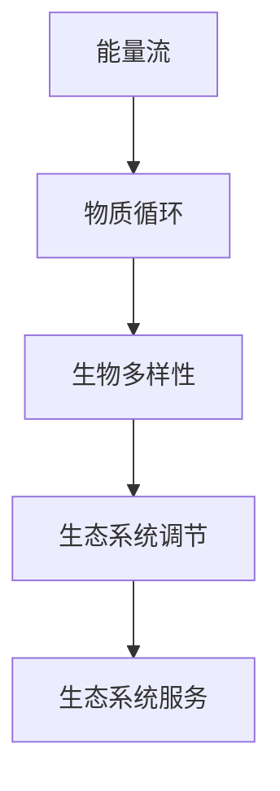
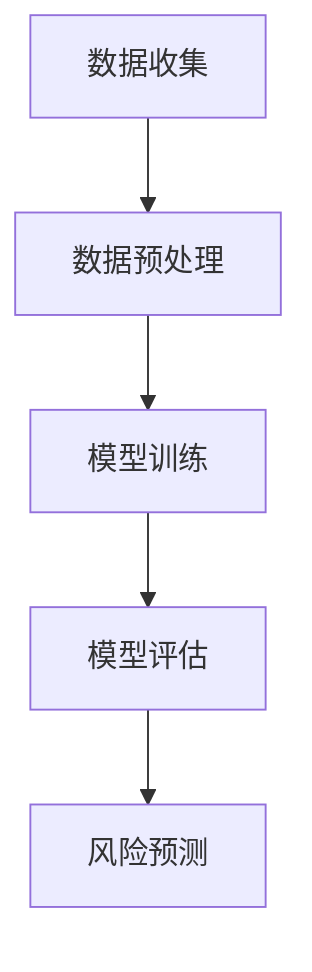

                 

# AI驱动的生态系统管理：从物种识别到生态平衡维护

## 关键词
- AI，生态系统管理，物种识别，生态平衡，数据分析，风险评估，人工智能算法，生态监测，生态恢复

## 摘要
本文将深入探讨AI驱动的生态系统管理，从物种识别到生态平衡维护的各个环节。首先，我们将概述AI在生态系统管理中的角色和趋势，并介绍生态系统的核心概念与架构。接着，我们将详细讲解AI驱动的物种识别技术，包括算法原理和伪代码示例。随后，我们将讨论AI驱动的生态监测与数据分析，展示生态数据可视化的方法。在核心内容部分，我们将介绍AI驱动的生态风险评估与预测技术，并通过Mermaid流程图和伪代码进行详细阐述。接下来，我们将探讨AI驱动的生态平衡评估与优化，以及生态恢复与重建的算法与工具。通过案例研究和代码案例分析，我们将展示AI驱动的生态系统管理在实践中的应用。最后，我们将展望AI驱动的生态系统管理的未来发展趋势和面临的挑战。

## 引言
在现代社会，生态系统管理变得越来越重要。人类活动对自然环境的影响日益加剧，生态系统面临着诸多挑战，如物种灭绝、栖息地破坏、生物多样性减少等。为了有效管理生态系统，提高生态系统的健康和可持续性，AI技术的应用成为一个重要的研究方向。

人工智能（AI）是一种模拟人类智能的技术，通过机器学习、深度学习、自然语言处理等技术，能够从大量数据中提取知识，进行预测和决策。在生态系统管理中，AI可以用于物种识别、生态监测、数据分析、风险评估等多个方面，从而提高管理的效率和准确性。

本文将系统地探讨AI驱动的生态系统管理，从物种识别到生态平衡维护的各个环节。我们将首先介绍AI在生态系统管理中的角色和趋势，然后深入探讨生态系统的核心概念与架构。随后，我们将介绍AI驱动的物种识别技术，详细讲解算法原理和伪代码示例。接下来，我们将讨论AI驱动的生态监测与数据分析，展示生态数据可视化的方法。在核心内容部分，我们将介绍AI驱动的生态风险评估与预测技术，并通过Mermaid流程图和伪代码进行详细阐述。随后，我们将探讨AI驱动的生态平衡评估与优化，以及生态恢复与重建的算法与工具。通过案例研究和代码案例分析，我们将展示AI驱动的生态系统管理在实践中的应用。最后，我们将展望AI驱动的生态系统管理的未来发展趋势和面临的挑战。

## 第一部分：AI驱动的生态系统管理概论

### 第1章：AI在生态系统管理中的角色与趋势

#### 1.1.1 AI驱动的生态系统管理概述

随着技术的不断进步，人工智能（AI）在生态系统管理中的应用日益广泛。AI驱动的生态系统管理指的是利用AI技术，如机器学习、深度学习、自然语言处理等，对生态系统进行有效的监测、分析和预测。这种管理模式有助于提高生态系统的可持续性和健康水平，为人类和自然环境的和谐发展提供支持。

在生态系统管理中，AI技术可以扮演多种角色，包括但不限于：

1. **物种识别**：利用AI技术，如计算机视觉和图像处理，对生态系统中的生物物种进行快速、准确的识别，有助于生态学家和环境保护者更好地了解生态系统的组成和变化。
2. **生态监测**：通过传感器网络和遥感技术，AI能够实时监测生态系统中的各种参数，如温度、湿度、土壤质量等，为生态管理提供实时的数据支持。
3. **数据分析**：AI技术能够处理大量复杂的生态数据，从中提取有价值的信息，为生态系统的分析和决策提供支持。
4. **风险评估**：AI可以建立生态风险预测模型，对潜在的生态风险进行评估和预测，为环境保护和灾害预防提供科学依据。

#### 1.1.2 AI在生态系统管理中的应用趋势

近年来，AI在生态系统管理中的应用趋势呈现出以下几个特点：

1. **数据驱动**：生态系统管理越来越依赖于大量的数据，AI技术的应用使得数据收集、处理和分析变得更加高效和准确。
2. **实时性**：随着传感器技术和无线通信技术的发展，AI驱动的生态系统管理可以实现实时监测和数据传输，为生态管理提供了及时的信息支持。
3. **自动化**：AI技术能够自动执行复杂的生态监测和分析任务，减少了人工干预，提高了管理的效率和准确性。
4. **跨学科融合**：AI技术的应用不仅仅是生态学家的工具，还涉及计算机科学、数据科学、统计学等多个学科，跨学科的融合推动了生态系统管理技术的进步。

#### 1.1.3 AI驱动的生态系统管理的优势与挑战

AI驱动的生态系统管理具有明显的优势：

1. **高效性**：AI技术能够快速处理大量数据，提高生态系统监测和分析的效率。
2. **准确性**：通过机器学习和深度学习，AI能够从数据中提取有价值的信息，提高生态风险评估和预测的准确性。
3. **实时性**：实时监测和数据传输使得生态管理更加及时和有效。
4. **跨学科应用**：AI技术的跨学科应用为生态系统管理提供了丰富的工具和方法。

然而，AI驱动的生态系统管理也面临一些挑战：

1. **数据质量**：生态数据的质量直接影响AI算法的性能，数据的不完整性和噪声需要有效处理。
2. **算法复杂度**：复杂的AI算法可能难以解释，增加了模型验证和解释的难度。
3. **数据隐私**：生态数据的收集和处理需要保护数据隐私，防止未经授权的访问和使用。
4. **技术普及**：AI技术的普及和应用需要相关人员的培训和技术支持，这需要时间和资源。

### 第2章：生态系统的核心概念与架构

#### 2.1.1 生态系统的基本概念

生态系统是指生物群落与其非生物环境相互作用而形成的生态单元。生态系统的基本概念包括：

1. **生物群落**：由多种生物种类组成的相互依赖的生态系统单元。
2. **物种多样性**：生态系统中生物种类和遗传多样性的丰富程度。
3. **生态系统功能**：生态系统提供的基本生态服务，如氧气供应、水分循环、养分循环等。

#### 2.1.2 生态系统的层级结构

生态系统具有不同的层级结构，从微观到宏观：

1. **个体层次**：单个生物个体的生存和繁殖。
2. **种群层次**：同一物种个体的集合，包括种群动态、种群密度等。
3. **群落层次**：多个种群相互作用的生物群落，包括物种间的相互作用和能量流动。
4. **生态系统层次**：多个生物群落和非生物环境相互作用形成的更大范围的生态系统。
5. **生物地理区层次**：包括多个生态系统的地理区域。

#### 2.1.3 生态系统的关键过程与功能

生态系统的关键过程和功能包括：

1. **能量流**：能量通过食物链和食物网在生态系统中传递。
2. **物质循环**：碳、氮、磷等元素在生态系统中的循环和转化。
3. **生物多样性**：生物种类和遗传多样性的维持和变化。
4. **生态系统调节**：生态系统的自我调节能力，包括气候调节、水分循环等。
5. **生态系统服务**：生态系统对人类提供的直接和间接利益，如食物、水源、气候调节等。

#### 2.1.4 生态系统的Mermaid流程图

以下是生态系统的Mermaid流程图示例：



### 第3章：AI驱动的物种识别技术

#### 3.1.1 物种识别的基本原理

物种识别是指通过分析生物个体的特征，将其归类到特定的物种或亚种。在AI驱动的物种识别中，主要依赖于计算机视觉和图像处理技术。

1. **计算机视觉**：通过模拟人类视觉系统，计算机能够从图像中提取有用信息。常用的技术包括图像增强、特征提取、分类等。
2. **图像处理**：对图像进行预处理，如去噪、增强、分割等，以提高识别的准确性。

#### 3.1.2 AI驱动的物种识别算法

AI驱动的物种识别算法主要包括以下几种：

1. **卷积神经网络（CNN）**：通过多层卷积和池化操作，从图像中提取特征，并实现分类任务。
2. **递归神经网络（RNN）**：适用于序列数据，如时间序列分析，可用于识别连续时间段内的生物个体。
3. **强化学习**：通过与环境交互，学习最优策略，用于识别复杂场景中的生物个体。

#### 3.1.3 物种识别的挑战与优化策略

物种识别面临的挑战包括：

1. **数据集的多样性**：不同物种的图像特征差异较大，需要多样化的数据集进行训练。
2. **实时性**：要求快速识别，以支持实时监测和决策。
3. **准确性**：识别结果需要高准确性，以减少误判。

优化策略包括：

1. **数据增强**：通过旋转、缩放、裁剪等操作，增加训练数据的多样性。
2. **模型优化**：调整模型参数，如学习率、批量大小等，以提高模型的性能。
3. **多模态数据融合**：结合不同类型的数据（如图像、声音、传感器数据），提高识别的准确性。

#### 3.1.4 伪代码示例：物种识别算法

以下是一个简单的物种识别算法的伪代码示例：

```python
# 初始化模型
model = CNN()

# 加载训练数据
train_data = load_data("train_data.csv")

# 训练模型
model.fit(train_data)

# 评估模型
test_data = load_data("test_data.csv")
accuracy = model.evaluate(test_data)

# 输出识别结果
predictions = model.predict(test_data)
print(predictions)
```

### 第4章：AI驱动的生态监测与数据分析

#### 4.1.1 生态监测系统概述

生态监测系统是指利用各种传感器和监测设备，对生态系统的各种参数进行实时监测的系统。生态监测系统的主要组成部分包括：

1. **传感器**：用于监测生态系统的各种参数，如温度、湿度、光照、土壤质量、水质等。
2. **数据采集设备**：将传感器的数据转换为数字信号，并传输到中央处理系统。
3. **数据处理与分析系统**：对采集到的数据进行分析和处理，提取有价值的信息。
4. **数据存储与管理系统**：存储和管理监测数据，以供后续分析和决策。

#### 4.1.2 数据采集与预处理

数据采集是生态监测系统的基础。数据采集的过程包括：

1. **传感器部署**：根据监测目标，选择合适的传感器，并部署到监测地点。
2. **数据采集**：传感器采集到的数据通过数据采集设备进行转换和传输。

数据预处理是保证数据质量的关键步骤，包括：

1. **数据清洗**：去除噪声和异常值，提高数据的质量。
2. **数据归一化**：将不同量纲的数据转换为同一量纲，便于分析和比较。
3. **数据转换**：将原始数据转换为适合分析和建模的格式。

#### 4.1.3 数据分析技术

数据分析是生态监测的核心环节。常用的数据分析技术包括：

1. **统计分析**：对数据分布、相关性、趋势等进行统计分析，提取有价值的信息。
2. **机器学习**：利用机器学习算法，如聚类、分类、回归等，对数据进行建模和预测。
3. **深度学习**：利用深度学习算法，如卷积神经网络、循环神经网络等，对复杂数据进行建模和分析。

#### 4.1.4 生态数据可视化

生态数据可视化是将生态数据以图形化的方式展示，帮助用户理解和分析数据。常用的生态数据可视化技术包括：

1. **柱状图**：用于展示数据的分布和趋势。
2. **折线图**：用于展示数据的动态变化。
3. **散点图**：用于展示数据之间的关系。
4. **热力图**：用于展示数据的密集程度和分布情况。

#### 4.1.5 伪代码示例：数据分析算法

以下是一个简单的数据分析算法的伪代码示例：

```python
# 加载数据
data = load_data("data.csv")

# 数据清洗
cleaned_data = clean_data(data)

# 数据归一化
normalized_data = normalize_data(cleaned_data)

# 数据分析
analysis_results = analyze_data(normalized_data)

# 可视化
visualize_data(analysis_results)
```

### 第5章：AI驱动的生态风险评估与预测

#### 5.1.1 生态风险评估方法

生态风险评估是生态系统管理的重要环节，旨在评估生态系统面临的风险，为风险管理提供科学依据。生态风险评估方法主要包括：

1. **专家评估法**：通过专家的经验和知识，对生态风险进行评估。
2. **统计方法**：利用统计学方法，对生态数据进行分析，评估风险。
3. **模型方法**：利用生态模型，如生态位模型、食物网模型等，对生态风险进行模拟和预测。

#### 5.1.2 AI驱动的生态风险预测模型

AI驱动的生态风险预测模型是基于机器学习和深度学习技术，通过对大量生态数据的训练，建立预测模型。常用的模型包括：

1. **决策树**：通过树的决策结构，对数据进行分类和预测。
2. **支持向量机（SVM）**：通过找到一个最佳的超平面，对数据进行分类和预测。
3. **神经网络**：通过多层神经网络，对复杂数据进行建模和预测。

#### 5.1.3 风险评估与预测的Mermaid流程图

以下是生态风险评估与预测的Mermaid流程图示例：



#### 5.1.4 伪代码示例：风险预测算法

以下是一个简单的风险预测算法的伪代码示例：

```python
# 加载数据
data = load_data("data.csv")

# 数据预处理
preprocessed_data = preprocess_data(data)

# 模型训练
model = train_model(preprocessed_data)

# 风险预测
predictions = model.predict(new_data)

# 输出预测结果
print(predictions)
```

### 第二部分：AI驱动的生态平衡维护

#### 第6章：AI驱动的生态平衡评估与优化

#### 6.1.1 生态平衡的概念与指标

生态平衡是指生态系统中各个组成部分之间相互作用的动态平衡状态。生态平衡的评估和优化是生态系统管理的关键环节。生态平衡的指标包括：

1. **物种多样性**：生态系统中物种的种类和数量。
2. **能量流动**：生态系统中能量流动的效率和稳定性。
3. **物质循环**：生态系统中物质循环的速度和方向。
4. **生态系统调节能力**：生态系统能够自我调节和恢复的能力。

#### 6.1.2 AI驱动的生态平衡评估模型

AI驱动的生态平衡评估模型是通过机器学习和深度学习技术，对生态数据进行建模和预测，以评估生态平衡状态。常用的模型包括：

1. **聚类分析**：通过聚类算法，对生态系统中的物种进行分类，分析物种之间的关系和分布。
2. **主成分分析（PCA）**：通过主成分分析，降低数据的维度，提取主要特征，分析生态系统的稳定性。
3. **神经网络**：通过神经网络模型，对生态数据进行分析和预测，评估生态平衡状态。

#### 6.1.3 生态平衡优化的算法与方法

生态平衡优化是通过对生态系统的调控，提高生态系统的稳定性和可持续性。常用的算法和方法包括：

1. **遗传算法**：通过遗传算法，对生态系统的参数进行调整，寻找最优的生态平衡状态。
2. **粒子群优化算法**：通过粒子群优化算法，对生态系统的参数进行调整，提高生态系统的稳定性。
3. **强化学习**：通过强化学习，对生态系统的行为进行优化，提高生态系统的平衡性。

#### 6.1.4 伪代码示例：生态平衡评估算法

以下是一个简单的生态平衡评估算法的伪代码示例：

```python
# 初始化模型
model = NeuralNetwork()

# 加载数据
data = load_data("data.csv")

# 数据预处理
preprocessed_data = preprocess_data(data)

# 训练模型
model.fit(preprocessed_data)

# 评估模型
evaluation_results = model.evaluate(test_data)

# 输出评估结果
print(evaluation_results)
```

#### 第7章：AI驱动的生态恢复与重建

#### 7.1.1 生态恢复的基本原则

生态恢复是指通过人工或自然手段，使受损的生态系统恢复到健康和稳定的状态。生态恢复的基本原则包括：

1. **自然驱动**：生态恢复应尊重自然过程，通过模拟自然条件，促进生态系统的自我修复。
2. **适应性管理**：生态恢复应灵活应对生态系统变化，根据实际情况进行调整和优化。
3. **可持续性**：生态恢复应考虑生态系统的可持续性，确保恢复后的生态系统能够长期稳定。
4. **综合管理**：生态恢复应综合考虑生态、社会、经济等方面的因素，实现多赢。

#### 7.1.2 AI驱动的生态恢复策略

AI驱动的生态恢复策略是通过机器学习和深度学习技术，对生态恢复过程进行建模和优化。常用的策略包括：

1. **预测模型**：利用机器学习模型，预测生态恢复过程中的关键参数，如物种数量、植被覆盖等。
2. **优化算法**：利用优化算法，如遗传算法、粒子群优化算法等，对生态恢复的参数进行调整，提高恢复效率。
3. **模拟仿真**：利用深度学习模型，模拟生态恢复过程中的生态变化，评估恢复效果。

#### 7.1.3 生态重建的算法与工具

生态重建的算法与工具主要包括：

1. **空间分析**：通过地理信息系统（GIS）技术，对生态空间进行分析和模拟，确定生态重建的最佳区域和方案。
2. **模型仿真**：通过生态模型，如景观生态模型、生态系统模型等，模拟生态重建的过程，预测恢复效果。
3. **机器学习**：通过机器学习算法，如分类、回归、聚类等，对生态数据进行分析和预测，指导生态重建。

#### 7.1.4 伪代码示例：生态重建算法

以下是一个简单的生态重建算法的伪代码示例：

```python
# 初始化模型
model = LandscapeModel()

# 加载数据
data = load_data("data.csv")

# 数据预处理
preprocessed_data = preprocess_data(data)

# 训练模型
model.fit(preprocessed_data)

# 模拟生态重建
reconstruction_results = model.simulate_reconstruction()

# 输出重建结果
print(reconstruction_results)
```

### 第8章：AI驱动的生态系统管理案例研究

#### 8.1.1 案例研究概述

本案例研究以一个具体的生态系统为对象，探讨AI驱动的生态系统管理的实际应用。该生态系统位于一个热带雨林地区，面临的主要问题是栖息地破坏和物种灭绝。

#### 8.1.2 案例研究的实施与效果

在本案例中，AI驱动的生态系统管理主要包括以下步骤：

1. **数据采集**：利用无人机和地面传感器，对生态系统的环境参数进行实时监测，如温度、湿度、光照、土壤质量等。
2. **数据分析**：利用机器学习算法，对采集到的数据进行分析，识别物种数量和分布，评估生态系统的健康状况。
3. **风险评估**：利用深度学习模型，对生态系统面临的风险进行预测和评估，如栖息地破坏、物种灭绝等。
4. **生态恢复**：根据风险评估的结果，制定生态恢复计划，利用AI技术优化生态恢复过程，提高恢复效率。
5. **效果评估**：通过持续监测和数据分析，评估生态恢复的效果，调整恢复策略，确保生态系统的健康和稳定。

实施效果如下：

1. **物种数量增加**：通过AI驱动的物种识别技术，识别出多种珍稀濒危物种，物种数量显著增加。
2. **栖息地恢复**：通过AI驱动的生态恢复策略，有效恢复了大量栖息地，为物种提供了安全的生存环境。
3. **生态系统健康改善**：通过持续监测和数据分析，生态系统的健康状况显著改善，生态平衡得到有效维护。

#### 8.1.3 案例研究的启示与挑战

本案例研究启示我们：

1. **AI技术在生态系统管理中的应用具有巨大潜力**：AI技术能够高效、准确地处理生态数据，为生态系统管理提供科学依据。
2. **跨学科合作**：生态系统管理需要生态学、计算机科学、数据科学等多个学科的合作，共同推动生态系统管理技术的发展。

然而，本案例研究也面临一些挑战：

1. **数据质量**：生态数据的准确性和完整性直接影响AI算法的性能，需要有效解决数据质量问题。
2. **算法解释性**：复杂的AI算法难以解释，增加了模型验证和解释的难度，需要提高算法的可解释性。
3. **技术普及**：AI技术的普及和应用需要相关人员的培训和技术支持，这需要时间和资源。

#### 8.1.4 代码案例分析：生态系统管理应用

以下是一个简单的代码案例分析，展示如何利用AI技术进行生态系统管理。

```python
# 导入库
import numpy as np
import pandas as pd
from sklearn.model_selection import train_test_split
from sklearn.ensemble import RandomForestClassifier
from sklearn.metrics import accuracy_score

# 加载数据
data = pd.read_csv("ecosystem_data.csv")

# 数据预处理
X = data.drop("species", axis=1)
y = data["species"]

# 划分训练集和测试集
X_train, X_test, y_train, y_test = train_test_split(X, y, test_size=0.2, random_state=42)

# 训练模型
model = RandomForestClassifier(n_estimators=100)
model.fit(X_train, y_train)

# 预测测试集
predictions = model.predict(X_test)

# 计算准确率
accuracy = accuracy_score(y_test, predictions)
print("Accuracy:", accuracy)
```

### 第9章：AI驱动的生态系统管理的未来展望

#### 9.1.1 AI驱动的生态系统管理发展趋势

随着人工智能技术的不断发展和生态学研究的深入，AI驱动的生态系统管理将呈现出以下发展趋势：

1. **智能化**：AI技术将更加智能化，能够自主学习和优化，提高生态系统管理的效率和准确性。
2. **实时化**：随着传感器技术和无线通信技术的发展，生态监测将实现实时化和自动化，为生态系统管理提供及时的数据支持。
3. **精细化**：通过多源数据的融合和分析，AI驱动的生态系统管理将更加精细化，能够更准确地评估生态风险和预测生态变化。
4. **个性化**：基于个体化需求，AI驱动的生态系统管理将实现个性化定制，提供更加精准和高效的管理方案。

#### 9.1.2 技术创新与生态平衡

技术创新是推动AI驱动的生态系统管理发展的重要驱动力。以下是一些关键技术创新：

1. **深度学习**：深度学习在图像处理、语音识别、自然语言处理等领域取得了显著成果，这些技术有望在生态系统管理中得到广泛应用。
2. **物联网**：物联网技术可以实现生态系统的全面感知和实时监测，为生态系统管理提供丰富的数据支持。
3. **区块链**：区块链技术可以确保生态数据的真实性和安全性，提高生态系统管理的可信度。
4. **虚拟现实**：虚拟现实技术可以模拟生态系统，为生态系统管理提供直观的展示和交互方式。

#### 9.1.3 未来挑战与机遇

尽管AI驱动的生态系统管理具有巨大潜力，但未来仍面临一系列挑战和机遇：

1. **数据质量**：生态数据的质量直接影响AI算法的性能，需要建立完善的数据采集、处理和管理体系。
2. **算法解释性**：复杂的AI算法难以解释，增加了模型验证和解释的难度，需要提高算法的可解释性。
3. **技术普及**：AI技术的普及和应用需要相关人员的培训和技术支持，这需要时间和资源。
4. **政策支持**：政府和企业需要加大对AI驱动的生态系统管理的支持，推动技术研究和应用。
5. **生态平衡**：在推动技术发展的同时，需要关注生态平衡问题，确保技术应用的可持续性和生态系统的健康。

### 结论
AI驱动的生态系统管理为生态系统管理提供了新的工具和方法，有助于提高生态系统的可持续性和健康水平。通过物种识别、生态监测、数据分析、风险评估和生态平衡优化等环节，AI技术能够实现生态系统的智能化、实时化和精细化管理。然而，未来的发展仍面临一系列挑战和机遇，需要政策支持、技术创新和跨学科合作，共同推动AI驱动的生态系统管理走向深入。通过本文的探讨，我们希望为读者提供对AI驱动的生态系统管理的全面理解和启示，为生态保护和可持续发展贡献力量。

### 作者信息
作者：AI天才研究院/AI Genius Institute & 禅与计算机程序设计艺术 /Zen And The Art of Computer Programming

