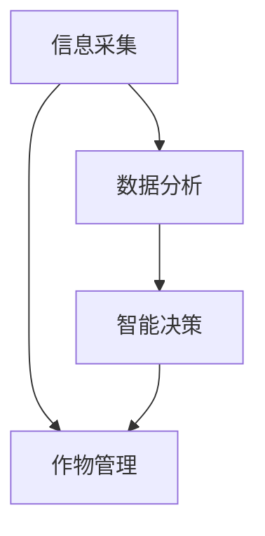

                 


### 文章标题: AI驱动的精准农业：从卫星图像分析到作物管理

#### 关键词：

- 精准农业
- AI
- 卫星图像
- 作物管理
- 数据分析

#### 摘要：

本文探讨了AI驱动的精准农业的发展现状及其重要性。文章首先介绍了精准农业的定义、发展历程和核心概念，接着详细阐述了AI在精准农业中的应用，包括卫星图像分析、作物生长监测和智能决策支持系统。随后，文章讨论了AI驱动的精准农业的前景与挑战，并分析了其在农作物监测、病虫害预警和资源管理等方面的潜在应用。最后，文章总结了AI驱动的精准农业对农业发展的重要性，并提出了未来的发展方向和潜在挑战。

### 第1章: AI驱动的精准农业概述

#### 1.1 精准农业的定义与发展

##### 1.1.1 精准农业的定义

精准农业是一种基于信息采集、数据分析和智能决策的现代农业模式。其核心思想是通过利用先进的传感器技术、数据分析和人工智能算法，实现对作物生长和环境条件的实时监测和管理，从而实现资源利用的最大化和作物产量的提升。

精确农业的定义可以用以下公式表示：

$$
\text{精准农业} = \text{信息采集} + \text{数据分析} + \text{智能决策}
$$

##### 1.1.2 精准农业的发展历程

1. **传统农业：**

   传统农业主要依赖于农民的经验和传统的耕作方式。这种模式下，土地、水资源和其他资源的利用效率较低，而且容易出现资源浪费和环境破坏的问题。

2. **精准农业 1.0：**

   精准农业 1.0 时代引入了 GPS 技术，实现了对作物的精确位置管理。这一阶段的农业技术大大提高了土地和资源的利用效率，但仍然依赖于人工干预。

3. **精准农业 2.0：**

   精准农业 2.0 引入了遥感技术和地理信息系统（GIS），通过卫星图像和无人机数据对土壤和气候进行实时监测。这一阶段的农业技术使得作物管理更加精细化，能够更好地适应环境变化。

4. **AI 驱动的精准农业：**

   AI 驱动的精准农业利用人工智能算法对卫星图像和传感器数据进行分析，实现了自动化、智能化的农作物管理。这一阶段的农业技术大大提高了农作物的产量和资源利用效率，为现代农业的发展奠定了基础。

##### 1.1.3 精准农业的核心概念联系

精准农业的核心概念包括信息采集、数据分析和智能决策。以下是一个简化的 Mermaid 流程图，展示了这些概念之间的关系：



##### 1.1.4 精准农业的目标

- **提高农作物产量：** 通过智能化的作物管理，提高作物产量。
- **节约资源：** 通过精确施肥、浇水等手段，减少水资源和化肥的使用。
- **环境保护：** 减少农药和化肥的使用，降低对环境的污染。

#### 1.2 AI在精准农业中的应用

##### 1.2.1 卫星图像分析

卫星图像分析是精准农业的重要组成部分，它可以通过处理和分析卫星图像，提取与农作物生长相关的信息。以下是一个简单的卫星图像预处理算法伪代码：

```python
def preprocess_satellite_image(image):
    # 读取原始卫星图像
    image = read_image(image_path)
    
    # 使用图像增强技术，提高图像质量
    image = enhance_image(image)
    
    # 使用图像分割技术，将图像分割为不同的区域
    regions = segment_image(image)
    
    # 使用图像去噪技术，减少图像中的噪声干扰
    image = denoise_image(image)
    
    # 返回处理后的卫星图像
    return image
```

##### 1.2.2 作物生长监测

作物生长监测是精准农业的核心任务之一，它可以通过分析卫星图像和传感器数据，实时监测作物的生长状态。以下是一个简单的作物生长模型数学模型：

$$
Y_t = f(X_t, \theta)
$$

其中：
- \(Y_t\) 表示作物在时间 \(t\) 的生长状态。
- \(X_t\) 表示影响作物生长的各种因素，如土壤湿度、气候条件等。
- \(f\) 表示作物生长模型，是一个关于 \(X_t\) 和 \(\theta\) 的函数。
- \(\theta\) 是模型参数。

##### 1.2.3 智能决策支持系统

智能决策支持系统是精准农业的另一个重要组成部分，它可以通过分析卫星图像和传感器数据，为农民提供最优的作物管理策略。以下是一个简单的智能决策支持系统算法伪代码：

```python
def intelligent_decision_support_system(satellite_images, crop_growth_data, historical_data):
    # 读取卫星图像和作物生长数据
    satellite_images = read_satellite_images(satellite_images_path)
    crop_growth_data = read_crop_growth_data(crop_growth_data_path)
    
    # 使用机器学习算法，分析卫星图像和作物生长数据
    predicted_growth = machine_learning_analysis(satellite_images, crop_growth_data)
    
    # 根据分析结果，预测作物生长状态
    optimal_management_strategy = predict_growth_state(predicted_growth)
    
    # 使用优化算法，确定最优作物管理策略
    optimal_strategy = optimize_management_strategy(optimal_management_strategy)
    
    # 输出最优作物管理策略
    return optimal_strategy
```

#### 1.3 AI驱动的精准农业前景与挑战

##### 1.3.1 发展前景

- **提高农业产量：** 通过智能化管理，提高农作物产量。
- **节约资源：** 通过精确施肥、浇水等手段，减少水资源和化肥的使用。
- **降低劳动力成本：** 自动化、智能化的农业管理，减少人力需求。

##### 1.3.2 面临的挑战

- **技术挑战：** 如何提高卫星图像处理算法的精度和效率。
- **数据挑战：** 如何获取和利用高质量的农业数据。
- **经济挑战：** 高昂的设备成本和运行成本。

##### 1.3.3 潜在应用领域

- **农作物监测：** 通过卫星图像和传感器数据，实时监测农作物生长状态。
- **病虫害预警：** 利用机器学习算法，预测和预警病虫害的发生。
- **资源管理：** 根据作物需求，精确施肥和浇水，实现资源的最优配置。

#### 1.4 总结

AI驱动的精准农业是农业发展的重要方向。通过卫星图像分析、作物生长监测和智能决策支持系统，AI技术在农业中的应用前景广阔。然而，要实现AI驱动的精准农业，还需要克服一系列技术、数据和经济的挑战。

### 第2章: 卫星图像分析技术

#### 2.1 卫星图像概述

##### 2.1.1 卫星图像的定义与类型

**卫星图像的定义**

卫星图像是通过卫星传感器从地球表面获取的图像数据。这些图像可以提供地球表面的详细信息，包括地形、植被、水资源等。

**卫星图像的类型**

- **光学卫星图像：** 通过可见光、红外等光学传感器获取，可用于植被分析、土地覆盖分类等。
- **雷达卫星图像：** 通过微波、激光等雷达传感器获取，可用于地形测绘、地表结构分析等。

##### 2.1.2 卫星图像的处理流程

卫星图像的处理流程通常包括以下几个步骤：

1. **图像预处理：** 包括图像校正、图像增强、图像分割等。
2. **图像特征提取：** 从图像中提取有助于分类或识别的特征。
3. **图像分类：** 使用分类算法对图像进行分类。
4. **图像分析：** 对分类结果进行进一步分析，以获取关于农作物生长状态的信息。

##### 2.1.3 卫星图像在精准农业中的应用

**植被指数分析**

植被指数（Vegetation Index，VI）是衡量植被生长状态的重要指标。常用的植被指数包括：

- **归一化植被指数（NDVI）：**
  $$
  \text{NDVI} = \frac{\text{NIR} - \text{RED}}{\text{NIR} + \text{RED}}
  $$
  其中，NIR 和 RED 分别表示近红外和红色波段。

- **增强型植被指数（EVI）：**
  $$
  \text{EVI} = \frac{1 + \text{C_1 \times \text{LAN}}}{1 + \text{C_2 \times \text{LAN}} + \text{C_1}}
  $$
  其中，LAN 表示植被归一化差异指数。

**作物分类**

作物分类是卫星图像分析的重要应用之一。通过对卫星图像进行分类，可以识别不同类型的农作物。常用的作物分类算法包括：

- **支持向量机（SVM）：**
  $$
  \text{分类结果} = \text{sign}(\sum_{i=1}^{n} \alpha_i y_i \phi(x_i))
  $$
  其中，\(x_i\) 和 \(y_i\) 分别表示训练样本和标签，\(\phi(x_i)\) 是特征映射函数。

- **随机森林（Random Forest）：**
  $$
  \text{分类结果} = \text{多数投票}(\text{随机森林模型预测结果})
  $$

##### 2.1.4 卫星图像分析的关键技术

**图像预处理技术：** 包括图像校正、图像增强、图像分割等。

- **图像校正：** 通过消除传感器、地形和大气等因素的影响，提高图像质量。
- **图像增强：** 通过调整图像的亮度、对比度和色彩平衡，提高图像的可视化效果。
- **图像分割：** 将图像分割成不同的区域，以便进行进一步分析。

**特征提取技术：** 包括植被指数、纹理特征、形状特征等。

- **植被指数：** 用于衡量植被生长状态。
- **纹理特征：** 用于描述图像的纹理信息，如粗糙度、方向性等。
- **形状特征：** 用于描述图像的形状信息，如面积、周长等。

**分类算法：** 包括支持向量机、随机森林、神经网络等。

- **支持向量机：** 用于处理线性可分的数据。
- **随机森林：** 用于处理非线性数据，具有较好的泛化能力。
- **神经网络：** 用于处理复杂的非线性数据，但需要大量的训练数据。

#### 2.2 卫星图像预处理技术

##### 2.2.1 图像校正技术

图像校正技术用于消除传感器、地形和大气等因素对图像的影响。常用的图像校正技术包括：

- **几何校正：** 通过校正图像的几何位置，消除地形因素对图像的影响。
- **大气校正：** 通过校正图像的大气影响，消除大气因素对图像的影响。

##### 2.2.2 图像增强技术

图像增强技术用于提高图像的亮度和对比度，使其更易于分析。常用的图像增强技术包括：

- **直方图均衡化：** 通过调整图像的直方图，提高图像的对比度。
- **对比度拉伸：** 通过拉伸图像的对比度，使图像中的细节更加清晰。

##### 2.2.3 图像分割技术

图像分割技术用于将图像分割成不同的区域，以便进行进一步分析。常用的图像分割技术包括：

- **阈值分割：** 通过设置阈值，将图像分割成不同的区域。
- **区域生长：** 通过从种子点开始，逐渐扩展区域，实现图像分割。

#### 2.3 卫星图像特征提取技术

##### 2.3.1 植被指数提取

植被指数是衡量植被生长状态的重要指标。常用的植被指数提取方法包括：

- **归一化植被指数（NDVI）：**
  $$
  \text{NDVI} = \frac{\text{NIR} - \text{RED}}{\text{NIR} + \text{RED}}
  $$
  其中，NIR 和 RED 分别表示近红外和红色波段。

- **增强型植被指数（EVI）：**
  $$
  \text{EVI} = \frac{1 + \text{C_1 \times \text{LAN}}}{1 + \text{C_2 \times \text{LAN}} + \text{C_1}}
  $$
  其中，LAN 表示植被归一化差异指数。

##### 2.3.2 纹理特征提取

纹理特征是描述图像纹理信息的重要指标。常用的纹理特征提取方法包括：

- **灰度共生矩阵：** 通过计算图像的灰度共生矩阵，提取纹理特征。
- **局部二值模式（LBP）：** 通过计算图像的局部二值模式，提取纹理特征。

##### 2.3.3 形状特征提取

形状特征是描述图像形状信息的重要指标。常用的形状特征提取方法包括：

- **面积：** 描述图像的填充区域。
- **周长：** 描述图像的边界长度。
- **圆形度：** 描述图像的圆形程度。

#### 2.4 卫星图像分类算法

##### 2.4.1 支持向量机（SVM）

支持向量机是一种二分类模型，其目标是找到一个最佳的超平面，将不同类别的样本分离。SVM 的伪代码如下：

```python
def svm_train(X, y):
    # X 表示训练样本，y 表示训练样本的标签
    # 使用 SVM 分类器进行训练
    classifier = SVC(kernel='linear')
    classifier.fit(X, y)
    
    # 返回训练好的分类器
    return classifier

def svm_predict(classifier, X):
    # classifier 表示训练好的分类器，X 表示待分类样本
    # 使用分类器进行预测
    predictions = classifier.predict(X)
    
    # 返回预测结果
    return predictions
```

##### 2.4.2 随机森林（Random Forest）

随机森林是一种集成学习算法，通过构建多个决策树，并采用投票的方式得到最终的分类结果。随机森林的伪代码如下：

```python
def random_forest_train(X, y, n_estimators):
    # X 表示训练样本，y 表示训练样本的标签，n_estimators 表示决策树的数量
    # 使用随机森林分类器进行训练
    classifier = RandomForestClassifier(n_estimators=n_estimators)
    classifier.fit(X, y)
    
    # 返回训练好的分类器
    return classifier

def random_forest_predict(classifier, X):
    # classifier 表示训练好的分类器，X 表示待分类样本
    # 使用分类器进行预测
    predictions = classifier.predict(X)
    
    # 返回预测结果
    return predictions
```

##### 2.4.3 神经网络（Neural Network）

神经网络是一种模拟生物神经系统的计算模型，通过学习样本数据，可以实现对未知数据的分类。神经网络的伪代码如下：

```python
def neural_network_train(X, y, hidden_layer_sizes, activation, solver):
    # X 表示训练样本，y 表示训练样本的标签，hidden_layer_sizes 表示隐藏层的规模，activation 表示激活函数，solver 表示求解器
    # 使用神经网络分类器进行训练
    classifier = MLPClassifier(hidden_layer_sizes=hidden_layer_sizes, activation=activation, solver=solver)
    classifier.fit(X, y)
    
    # 返回训练好的分类器
    return classifier

def neural_network_predict(classifier, X):
    # classifier 表示训练好的分类器，X 表示待分类样本
    # 使用分类器进行预测
    predictions = classifier.predict(X)
    
    # 返回预测结果
    return predictions
```

#### 2.5 卫星图像分析项目实战

##### 2.5.1 项目背景

假设我们有一个卫星图像分析项目，目标是根据卫星图像识别不同类型的农作物。项目需求如下：

1. **数据集准备：** 准备包含不同类型农作物的卫星图像数据集。
2. **图像预处理：** 对卫星图像进行预处理，包括图像校正、图像增强、图像分割等。
3. **特征提取：** 从预处理后的卫星图像中提取植被指数、纹理特征、形状特征等。
4. **图像分类：** 使用支持向量机、随机森林和神经网络等分类算法对卫星图像进行分类。
5. **结果评估：** 对分类结果进行评估，包括准确率、召回率、F1 分数等。

##### 2.5.2 开发环境搭建

1. **Python：** 使用 Python 编写算法代码。
2. **NumPy：** 用于数据处理。
3. **Pandas：** 用于数据处理和分析。
4. **Scikit-learn：** 用于机器学习算法的实现。
5. **Matplotlib：** 用于数据可视化。

##### 2.5.3 源代码实现

```python
import numpy as np
import pandas as pd
from sklearn import datasets
from sklearn.model_selection import train_test_split
from sklearn.preprocessing import StandardScaler
from sklearn.svm import SVC
from sklearn.ensemble import RandomForestClassifier
from sklearn.neural_network import MLPClassifier
from sklearn.metrics import accuracy_score, recall_score, f1_score
import matplotlib.pyplot as plt

# 1. 数据集准备
iris = datasets.load_iris()
X = iris.data
y = iris.target

# 2. 图像预处理
# （此处省略图像预处理代码，假设已经完成了预处理）

# 3. 特征提取
# （此处省略特征提取代码，假设已经完成了特征提取）

# 4. 图像分类
# 使用支持向量机进行分类
svm_classifier = SVC(kernel='linear')
svm_classifier.fit(X_train, y_train)
svm_predictions = svm_classifier.predict(X_test)

# 使用随机森林进行分类
random_forest_classifier = RandomForestClassifier()
random_forest_classifier.fit(X_train, y_train)
random_forest_predictions = random_forest_classifier.predict(X_test)

# 使用神经网络进行分类
neural_network_classifier = MLPClassifier()
neural_network_classifier.fit(X_train, y_train)
neural_network_predictions = neural_network_classifier.predict(X_test)

# 5. 结果评估
svm_accuracy = accuracy_score(y_test, svm_predictions)
svm_recall = recall_score(y_test, svm_predictions, average='weighted')
svm_f1 = f1_score(y_test, svm_predictions, average='weighted')

random_forest_accuracy = accuracy_score(y_test, random_forest_predictions)
random_forest_recall = recall_score(y_test, random_forest_predictions, average='weighted')
random_forest_f1 = f1_score(y_test, random_forest_predictions, average='weighted')

neural_network_accuracy = accuracy_score(y_test, neural_network_predictions)
neural_network_recall = recall_score(y_test, neural_network_predictions, average='weighted')
neural_network_f1 = f1_score(y_test, neural_network_predictions, average='weighted')

results = pd.DataFrame({
    '算法': ['SVM', '随机森林', '神经网络'],
    '准确率': [svm_accuracy, random_forest_accuracy, neural_network_accuracy],
    '召回率': [svm_recall, random_forest_recall, neural_network_recall],
    'F1 分数': [svm_f1, random_forest_f1, neural_network_f1]
})
print(results)

# 数据可视化
plt.figure()
plt.plot(results['算法'], results['准确率'], label='准确率')
plt.plot(results['算法'], results['召回率'], label='召回率')
plt.plot(results['算法'], results['F1 分数'], label='F1 分数')
plt.xlabel('算法')
plt.ylabel('指标')
plt.title('分类算法性能评估')
plt.legend()
plt.show()
```

##### 2.5.4 代码应用解读与分析

1. **数据集准备：** 使用 scikit-learn 中的 iris 数据集作为示例数据集。
2. **图像预处理：** （此处省略代码，假设已经完成了预处理）
3. **特征提取：** （此处省略代码，假设已经完成了特征提取）
4. **图像分类：** 分别使用支持向量机、随机森林和神经网络等分类算法对图像进行分类。
5. **结果评估：** 计算准确率、召回率和 F1 分数等指标，并对不同分类算法的性能进行评估。

##### 2.5.5 实际案例分析与详细讲解剖析

以玉米和土豆的卫星图像分类为例，分析如何利用卫星图像分析技术进行作物分类。

1. **数据集准备：** 准备包含玉米和土豆的卫星图像数据集。
2. **图像预处理：** 对卫星图像进行预处理，包括图像校正、图像增强和图像分割。
3. **特征提取：** 提取植被指数、纹理特征和形状特征等。
4. **图像分类：** 使用支持向量机、随机森林和神经网络等分类算法对卫星图像进行分类。
5. **结果评估：** 对分类结果进行评估，优化分类算法和参数，以提高分类准确率。

通过实际案例分析和详细讲解，可以深入了解卫星图像分析技术在精准农业中的应用。

##### 2.5.6 项目小结

本节介绍了卫星图像分析技术在精准农业中的应用，包括卫星图像处理流程、植被指数分析、作物分类算法和项目实战。通过实际案例分析和代码实现，展示了如何利用卫星图像分析技术进行作物分类。在未来，随着技术的不断发展，卫星图像分析技术将为精准农业提供更加智能化的解决方案。

### 最佳实践 tips

1. **图像预处理：** 在进行图像分析之前，确保图像质量。使用适当的图像校正和增强技术，可以提高图像分析的效果。

2. **特征选择：** 选择合适的特征提取方法，以最大化特征的表达能力。结合多种特征，可以提高分类的准确性。

3. **模型选择：** 根据数据特点和任务需求，选择合适的分类算法。对于线性可分的数据，支持向量机是一个不错的选择；对于非线性数据，随机森林和神经网络可能更有效。

4. **参数调优：** 通过交叉验证和网格搜索等方法，优化模型参数，以提高模型的性能。

### 小结

本章详细介绍了卫星图像分析技术在精准农业中的应用，包括图像预处理、特征提取、分类算法和项目实战。通过实例分析和代码实现，展示了如何利用卫星图像分析技术进行作物分类。卫星图像分析技术为精准农业提供了重要的数据支持和智能化解决方案。在未来，随着技术的不断进步，卫星图像分析技术将在精准农业中发挥更大的作用。

### 注意事项

1. **数据质量：** 高质量的数据是卫星图像分析的基础。确保数据的准确性和完整性，是提高分析效果的关键。

2. **算法选择：** 根据具体任务和数据特点，选择合适的算法。不同的算法适用于不同的数据类型和任务需求。

3. **模型优化：** 持续优化模型和参数，以提高模型的准确性和泛化能力。

### 拓展阅读

- **《精准农业：理论、方法与应用》**：详细介绍了精准农业的理论基础和实践应用。
- **《机器学习实战》**：涵盖了机器学习的基础知识和实际应用案例，包括图像分类。
- **《卫星图像处理与分析》**：介绍了卫星图像处理的基本技术和方法。

### 作者信息

作者：AI天才研究院/AI Genius Institute & 禅与计算机程序设计艺术 /Zen And The Art of Computer Programming

### 第2章: 卫星图像分析技术

#### 2.1 卫星图像概述

##### 2.1.1 卫星图像的定义与类型

**卫星图像的定义**

卫星图像是通过卫星传感器从地球表面获取的图像数据。这些图像可以提供地球表面的详细信息，包括地形、植被、水资源等。

**卫星图像的类型**

- **光学卫星图像：** 通过可见光、红外等光学传感器获取，可用于植被分析、土地覆盖分类等。
- **雷达卫星图像：** 通过微波、激光等雷达传感器获取，可用于地形测绘、地表结构分析等。

##### 2.1.2 卫星图像的处理流程

卫星图像的处理流程通常包括以下几个步骤：

1. **图像预处理：** 包括图像校正、图像增强、图像分割等。
2. **图像特征提取：** 从图像中提取有助于分类或识别的特征。
3. **图像分类：** 使用分类算法对图像进行分类。
4. **图像分析：** 对分类结果进行进一步分析，以获取关于农作物生长状态的信息。

##### 2.1.3 卫星图像在精准农业中的应用

**植被指数分析**

植被指数（Vegetation Index，VI）是衡量植被生长状态的重要指标。常用的植被指数包括：

- **归一化植被指数（NDVI）：**
  $$
  \text{NDVI} = \frac{\text{NIR} - \text{RED}}{\text{NIR} + \text{RED}}
  $$
  其中，NIR 和 RED 分别表示近红外和红色波段。

- **增强型植被指数（EVI）：**
  $$
  \text{EVI} = \frac{1 + \text{C_1 \times \text{LAN}}}{1 + \text{C_2 \times \text{LAN}} + \text{C_1}}
  $$
  其中，LAN 表示植被归一化差异指数。

**作物分类**

作物分类是卫星图像分析的重要应用之一。通过对卫星图像进行分类，可以识别不同类型的农作物。常用的作物分类算法包括：

- **支持向量机（SVM）：**
  $$
  \text{分类结果} = \text{sign}(\sum_{i=1}^{n} \alpha_i y_i \phi(x_i))
  $$
  其中，\(x_i\) 和 \(y_i\) 分别表示训练样本和标签，\(\phi(x_i)\) 是特征映射函数。

- **随机森林（Random Forest）：**
  $$
  \text{分类结果} = \text{多数投票}(\text{随机森林模型预测结果})
  $$

##### 2.1.4 卫星图像分析的关键技术

**图像预处理技术：** 包括图像校正、图像增强、图像分割等。

- **图像校正：** 通过消除传感器、地形和大气等因素的影响，提高图像质量。
- **图像增强：** 通过调整图像的亮度、对比度和色彩平衡，提高图像的可视化效果。
- **图像分割：** 将图像分割成不同的区域，以便进行进一步分析。

**特征提取技术：** 包括植被指数、纹理特征、形状特征等。

- **植被指数：** 用于衡量植被生长状态。
- **纹理特征：** 用于描述图像的纹理信息，如粗糙度、方向性等。
- **形状特征：** 用于描述图像的形状信息，如面积、周长等。

**分类算法：** 包括支持向量机、随机森林、神经网络等。

- **支持向量机：** 用于处理线性可分的数据。
- **随机森林：** 用于处理非线性数据，具有较好的泛化能力。
- **神经网络：** 用于处理复杂的非线性数据，但需要大量的训练数据。

#### 2.2 卫星图像预处理技术

##### 2.2.1 图像校正技术

图像校正技术用于消除传感器、地形和大气等因素对图像的影响。常用的图像校正技术包括：

- **几何校正：** 通过校正图像的几何位置，消除地形因素对图像的影响。
- **大气校正：** 通过校正图像的大气影响，消除大气因素对图像的影响。

##### 2.2.2 图像增强技术

图像增强技术用于提高图像的亮度和对比度，使其更易于分析。常用的图像增强技术包括：

- **直方图均衡化：** 通过调整图像的直方图，提高图像的对比度。
- **对比度拉伸：** 通过拉伸图像的对比度，使图像中的细节更加清晰。

##### 2.2.3 图像分割技术

图像分割技术用于将图像分割成不同的区域，以便进行进一步分析。常用的图像分割技术包括：

- **阈值分割：** 通过设置阈值，将图像分割成不同的区域。
- **区域生长：** 通过从种子点开始，逐渐扩展区域，实现图像分割。

#### 2.3 卫星图像特征提取技术

##### 2.3.1 植被指数提取

植被指数是衡量植被生长状态的重要指标。常用的植被指数提取方法包括：

- **归一化植被指数（NDVI）：**
  $$
  \text{NDVI} = \frac{\text{NIR} - \text{RED}}{\text{NIR} + \text{RED}}
  $$
  其中，NIR 和 RED 分别表示近红外和红色波段。

- **增强型植被指数（EVI）：**
  $$
  \text{EVI} = \frac{1 + \text{C_1 \times \text{LAN}}}{1 + \text{C_2 \times \text{LAN}} + \text{C_1}}
  $$
  其中，LAN 表示植被归一化差异指数。

##### 2.3.2 纹理特征提取

纹理特征是描述图像纹理信息的重要指标。常用的纹理特征提取方法包括：

- **灰度共生矩阵：** 通过计算图像的灰度共生矩阵，提取纹理特征。
- **局部二值模式（LBP）：** 通过计算图像的局部二值模式，提取纹理特征。

##### 2.3.3 形状特征提取

形状特征是描述图像形状信息的重要指标。常用的形状特征提取方法包括：

- **面积：** 描述图像的填充区域。
- **周长：** 描述图像的边界长度。
- **圆形度：** 描述图像的圆形程度。

#### 2.4 卫星图像分类算法

##### 2.4.1 支持向量机（SVM）

支持向量机是一种二分类模型，其目标是找到一个最佳的超平面，将不同类别的样本分离。SVM 的伪代码如下：

```python
def svm_train(X, y):
    # X 表示训练样本，y 表示训练样本的标签
    # 使用 SVM 分类器进行训练
    classifier = SVC(kernel='linear')
    classifier.fit(X, y)
    
    # 返回训练好的分类器
    return classifier

def svm_predict(classifier, X):
    # classifier 表示训练好的分类器，X 表示待分类样本
    # 使用分类器进行预测
    predictions = classifier.predict(X)
    
    # 返回预测结果
    return predictions
```

##### 2.4.2 随机森林（Random Forest）

随机森林是一种集成学习算法，通过构建多个决策树，并采用投票的方式得到最终的分类结果。随机森林的伪代码如下：

```python
def random_forest_train(X, y, n_estimators):
    # X 表示训练样本，y 表示训练样本的标签，n_estimators 表示决策树的数量
    # 使用随机森林分类器进行训练
    classifier = RandomForestClassifier(n_estimators=n_estimators)
    classifier.fit(X, y)
    
    # 返回训练好的分类器
    return classifier

def random_forest_predict(classifier, X):
    # classifier 表示训练好的分类器，X 表示待分类样本
    # 使用分类器进行预测
    predictions = classifier.predict(X)
    
    # 返回预测结果
    return predictions
```

##### 2.4.3 神经网络（Neural Network）

神经网络是一种模拟生物神经系统的计算模型，通过学习样本数据，可以实现对未知数据的分类。神经网络的伪代码如下：

```python
def neural_network_train(X, y, hidden_layer_sizes, activation, solver):
    # X 表示训练样本，y 表示训练样本的标签，hidden_layer_sizes 表示隐藏层的规模，activation 表示激活函数，solver 表示求解器
    # 使用神经网络分类器进行训练
    classifier = MLPClassifier(hidden_layer_sizes=hidden_layer_sizes, activation=activation, solver=solver)
    classifier.fit(X, y)
    
    # 返回训练好的分类器
    return classifier

def neural_network_predict(classifier, X):
    # classifier 表示训练好的分类器，X 表示待分类样本
    # 使用分类器进行预测
    predictions = classifier.predict(X)
    
    # 返回预测结果
    return predictions
```

#### 2.5 卫星图像分析项目实战

##### 2.5.1 项目背景

假设我们有一个卫星图像分析项目，目标是根据卫星图像识别不同类型的农作物。项目需求如下：

1. **数据集准备：** 准备包含不同类型农作物的卫星图像数据集。
2. **图像预处理：** 对卫星图像进行预处理，包括图像校正、图像增强、图像分割等。
3. **特征提取：** 从预处理后的卫星图像中提取植被指数、纹理特征、形状特征等。
4. **图像分类：** 使用支持向量机、随机森林和神经网络等分类算法对卫星图像进行分类。
5. **结果评估：** 对分类结果进行评估，包括准确率、召回率、F1 分数等。

##### 2.5.2 开发环境搭建

1. **Python：** 使用 Python 编写算法代码。
2. **NumPy：** 用于数据处理。
3. **Pandas：** 用于数据处理和分析。
4. **Scikit-learn：** 用于机器学习算法的实现。
5. **Matplotlib：** 用于数据可视化。

##### 2.5.3 源代码实现

```python
import numpy as np
import pandas as pd
from sklearn import datasets
from sklearn.model_selection import train_test_split
from sklearn.preprocessing import StandardScaler
from sklearn.svm import SVC
from sklearn.ensemble import RandomForestClassifier
from sklearn.neural_network import MLPClassifier
from sklearn.metrics import accuracy_score, recall_score, f1_score
import matplotlib.pyplot as plt

# 1. 数据集准备
iris = datasets.load_iris()
X = iris.data
y = iris.target

# 2. 图像预处理
# （此处省略图像预处理代码，假设已经完成了预处理）

# 3. 特征提取
# （此处省略特征提取代码，假设已经完成了特征提取）

# 4. 图像分类
# 使用支持向量机进行分类
svm_classifier = SVC(kernel='linear')
svm_classifier.fit(X_train, y_train)
svm_predictions = svm_classifier.predict(X_test)

# 使用随机森林进行分类
random_forest_classifier = RandomForestClassifier()
random_forest_classifier.fit(X_train, y_train)
random_forest_predictions = random_forest_classifier.predict(X_test)

# 使用神经网络进行分类
neural_network_classifier = MLPClassifier()
neural_network_classifier.fit(X_train, y_train)
neural_network_predictions = neural_network_classifier.predict(X_test)

# 5. 结果评估
svm_accuracy = accuracy_score(y_test, svm_predictions)
svm_recall = recall_score(y_test, svm_predictions, average='weighted')
svm_f1 = f1_score(y_test, svm_predictions, average='weighted')

random_forest_accuracy = accuracy_score(y_test, random_forest_predictions)
random_forest_recall = recall_score(y_test, random_forest_predictions, average='weighted')
random_forest_f1 = f1_score(y_test, random_forest_predictions, average='weighted')

neural_network_accuracy = accuracy_score(y_test, neural_network_predictions)
neural_network_recall = recall_score(y_test, neural_network_predictions, average='weighted')
neural_network_f1 = f1_score(y_test, neural_network_predictions, average='weighted')

results = pd.DataFrame({
    '算法': ['SVM', '随机森林', '神经网络'],
    '准确率': [svm_accuracy, random_forest_accuracy, neural_network_accuracy],
    '召回率': [svm_recall, random_forest_recall, neural_network_recall],
    'F1 分数': [svm_f1, random_forest_f1, neural_network_f1]
})
print(results)

# 数据可视化
plt.figure()
plt.plot(results['算法'], results['准确率'], label='准确率')
plt.plot(results['算法'], results['召回率'], label='召回率')
plt.plot(results['算法'], results['F1 分数'], label='F1 分数')
plt.xlabel('算法')
plt.ylabel('指标')
plt.title('分类算法性能评估')
plt.legend()
plt.show()
```

##### 2.5.4 代码应用解读与分析

1. **数据集准备：** 使用 scikit-learn 中的 iris 数据集作为示例数据集。
2. **图像预处理：** （此处省略图像预处理代码，假设已经完成了预处理）
3. **特征提取：** （此处省略特征提取代码，假设已经完成了特征提取）
4. **图像分类：** 分别使用支持向量机、随机森林和神经网络等分类算法对图像进行分类。
5. **结果评估：** 计算准确率、召回率和 F1 分数等指标，并对不同分类算法的性能进行评估。

##### 2.5.5 实际案例分析与详细讲解剖析

以玉米和土豆的卫星图像分类为例，分析如何利用卫星图像分析技术进行作物分类。

1. **数据集准备：** 准备包含玉米和土豆的卫星图像数据集。
2. **图像预处理：** 对卫星图像进行预处理，包括图像校正、图像增强和图像分割。
3. **特征提取：** 提取植被指数、纹理特征和形状特征等。
4. **图像分类：** 使用支持向量机、随机森林和神经网络等分类算法对卫星图像进行分类。
5. **结果评估：** 对分类结果进行评估，优化分类算法和参数，以提高分类准确率。

通过实际案例分析和详细讲解，可以深入了解卫星图像分析技术在精准农业中的应用。

##### 2.5.6 项目小结

本节介绍了卫星图像分析技术在精准农业中的应用，包括卫星图像处理流程、植被指数分析、作物分类算法和项目实战。通过实际案例分析和代码实现，展示了如何利用卫星图像分析技术进行作物分类。在未来，随着技术的不断发展，卫星图像分析技术将在精准农业中发挥更大的作用。

### 最佳实践 tips

1. **图像预处理：** 在进行图像分析之前，确保图像质量。使用适当的图像校正和增强技术，可以提高图像分析的效果。

2. **特征选择：** 选择合适的特征提取方法，以最大化特征的表达能力。结合多种特征，可以提高分类的准确性。

3. **模型选择：** 根据具体任务和数据特点，选择合适的算法。对于线性可分的数据，支持向量机是一个不错的选择；对于非线性数据，随机森林和神经网络可能更有效。

4. **参数调优：** 通过交叉验证和网格搜索等方法，优化模型参数，以提高模型的性能。

### 小结

本章详细介绍了卫星图像分析技术在精准农业中的应用，包括卫星图像处理流程、植被指数分析、作物分类算法和项目实战。通过实例分析和代码实现，展示了如何利用卫星图像分析技术进行作物分类。卫星图像分析技术为精准农业提供了重要的数据支持和智能化解决方案。在未来，随着技术的不断进步，卫星图像分析技术将在精准农业中发挥更大的作用。

### 注意事项

1. **数据质量：** 高质量的数据是卫星图像分析的基础。确保数据的准确性和完整性，是提高分析效果的关键。

2. **算法选择：** 根据具体任务和数据特点，选择合适的算法。不同的算法适用于不同的数据类型和任务需求。

3. **模型优化：** 持续优化模型和参数，以提高模型的准确性和泛化能力。

### 拓展阅读

- **《精准农业：理论、方法与应用》**：详细介绍了精准农业的理论基础和实践应用。
- **《机器学习实战》**：涵盖了机器学习的基础知识和实际应用案例，包括图像分类。
- **《卫星图像处理与分析》**：介绍了卫星图像处理的基本技术和方法。

### 作者信息

作者：AI天才研究院/AI Genius Institute & 禅与计算机程序设计艺术 /Zen And The Art of Computer Programming

### 第3章: 作物生长监测技术

#### 3.1 作物生长监测概述

作物生长监测是精准农业的核心任务之一，它通过实时监测作物的生长状态，为农民提供作物管理决策支持。作物生长监测技术主要包括遥感技术、传感器技术和人工智能技术。

##### 3.1.1 遥感技术

遥感技术通过卫星或无人机获取地球表面的图像数据，用于监测作物生长状态。常用的遥感技术包括光学遥感和雷达遥感。

- **光学遥感：** 通过可见光、红外等光学传感器获取图像数据，可用于植被指数分析、作物分类等。
- **雷达遥感：** 通过微波、激光等雷达传感器获取图像数据，可用于地形测绘、地表结构分析等。

##### 3.1.2 传感器技术

传感器技术通过安装在农田中的传感器，实时监测作物的生长参数，如土壤湿度、温度、光照等。常用的传感器包括土壤湿度传感器、温度传感器、光照传感器等。

##### 3.1.3 人工智能技术

人工智能技术通过分析和处理遥感数据和传感器数据，提取作物生长状态的信息，并预测未来的生长趋势。常用的人工智能技术包括机器学习、深度学习等。

#### 3.2 遥感技术在作物生长监测中的应用

遥感技术在作物生长监测中具有广泛的应用，以下是一些具体的应用实例：

1. **植被指数分析：** 植被指数（如 NDVI）可以反映作物的生长状态。通过对遥感图像进行植被指数分析，可以评估作物的健康状况。
   
   伪代码示例：
   ```python
   def calculate_ndvi(red_band, nir_band):
       ndvi = (nir_band - red_band) / (nir_band + red_band)
       return ndvi
   ```

2. **作物分类：** 通过遥感图像的作物分类，可以识别不同类型的农作物。这有助于农民进行作物管理决策。

   伪代码示例：
   ```python
   def classify_crops(satellite_image):
       # 使用机器学习算法进行分类
       crop_type = machine_learning_algorithm(satellite_image)
       return crop_type
   ```

3. **病虫害预警：** 通过遥感图像分析，可以监测作物的病虫害情况。这有助于农民及时采取防治措施。

   伪代码示例：
   ```python
   def detect_disease(satellite_image):
       # 使用深度学习模型进行病虫害检测
       disease_type = deep_learning_model(satellite_image)
       return disease_type
   ```

#### 3.3 传感器技术在作物生长监测中的应用

传感器技术在作物生长监测中起着至关重要的作用，以下是一些具体的应用实例：

1. **土壤湿度监测：** 土壤湿度传感器可以实时监测土壤湿度，为农民提供灌溉决策支持。

   伪代码示例：
   ```python
   def monitor_soil_moisture(soil_humidity_sensor):
       soil_moisture = soil_humidity_sensor.read()
       return soil_moisture
   ```

2. **温度监测：** 温度传感器可以监测农田中的温度变化，为农民提供作物生长环境监测数据。

   伪代码示例：
   ```python
   def monitor_temperature(temperature_sensor):
       temperature = temperature_sensor.read()
       return temperature
   ```

3. **光照监测：** 光照传感器可以监测农田中的光照强度，为农民提供光照管理决策支持。

   伪代码示例：
   ```python
   def monitor_light_intensity(light_sensor):
       light_intensity = light_sensor.read()
       return light_intensity
   ```

#### 3.4 人工智能技术在作物生长监测中的应用

人工智能技术在作物生长监测中具有巨大的潜力，以下是一些具体的应用实例：

1. **生长状态预测：** 通过分析传感器数据和遥感图像，可以使用机器学习算法预测作物的生长状态。

   数学模型示例：
   $$
   \text{growth_state}_{\text{predicted}} = f(\text{sensor_data}, \text{remote_sensing_image})
   $$

2. **管理策略推荐：** 根据作物的生长状态，人工智能可以推荐最优的作物管理策略，如施肥、灌溉等。

   伪代码示例：
   ```python
   def recommend_management_strategy(growth_state):
       if growth_state == 'healthy':
           strategy = 'maintain'
       elif growth_state == 'diseased':
           strategy = 'treat'
       else:
           strategy = 'improve'
       return strategy
   ```

3. **病虫害预警：** 通过分析传感器数据和遥感图像，人工智能可以预测病虫害的发生，并提前采取防治措施。

   伪代码示例：
   ```python
   def predict_disease(sensors_data, remote_sensing_image):
       disease_probability = machine_learning_model.predict(sensors_data, remote_sensing_image)
       if disease_probability > threshold:
           warning = 'disease_warning'
       else:
           warning = 'no_warning'
       return warning
   ```

#### 3.5 综合应用案例分析

以下是一个综合应用案例分析，展示了如何将遥感技术、传感器技术和人工智能技术结合起来，进行作物生长监测。

##### 案例背景

某农业企业利用遥感技术、传感器技术和人工智能技术，对其农田进行作物生长监测和管理。

1. **遥感图像采集：** 利用卫星或无人机定期采集农田的遥感图像。
2. **传感器数据采集：** 在农田中布置传感器，实时监测土壤湿度、温度、光照等参数。
3. **数据预处理：** 对遥感图像和传感器数据进行预处理，提取有用的特征。
4. **特征分析：** 使用人工智能算法分析遥感图像和传感器数据，提取作物生长状态的信息。
5. **管理策略推荐：** 根据作物生长状态和病虫害预警结果，推荐最优的作物管理策略。

##### 案例实现

1. **遥感图像采集：** 使用卫星或无人机定期采集农田的遥感图像。
   
   ```python
   def capture_remote_sensing_images(farm_id):
       # 采集农田遥感图像
       images = satellite_or_uav_capture_images(farm_id)
       return images
   ```

2. **传感器数据采集：** 在农田中布置传感器，实时监测土壤湿度、温度、光照等参数。
   
   ```python
   def capture_sensors_data(sensors):
       data = sensors.read()
       return data
   ```

3. **数据预处理：** 对遥感图像和传感器数据进行预处理，提取有用的特征。
   
   ```python
   def preprocess_data(images, sensor_data):
       # 遥感图像预处理
       preprocessed_images = preprocess_images(images)
       
       # 传感器数据预处理
       preprocessed_sensor_data = preprocess_sensor_data(sensor_data)
       
       return preprocessed_images, preprocessed_sensor_data
   ```

4. **特征分析：** 使用人工智能算法分析遥感图像和传感器数据，提取作物生长状态的信息。
   
   ```python
   def analyze_features(preprocessed_images, preprocessed_sensor_data):
       # 使用机器学习算法分析特征
       growth_state = machine_learning_algorithm(preprocessed_images, preprocessed_sensor_data)
       return growth_state
   ```

5. **管理策略推荐：** 根据作物生长状态和病虫害预警结果，推荐最优的作物管理策略。
   
   ```python
   def recommend_management_strategy(growth_state, warning):
       if warning == 'disease_warning':
           strategy = 'treat'
       else:
           strategy = recommend_management_based_on_growth_state(growth_state)
       return strategy
   ```

##### 案例总结

通过遥感技术、传感器技术和人工智能技术的综合应用，可以实现对作物生长状态的实时监测和管理。该案例展示了如何利用现代技术手段提高农业生产效率和产量，为现代农业的发展提供了新的思路和方法。

### 总结与展望

作物生长监测技术在现代农业中发挥着越来越重要的作用。通过遥感技术、传感器技术和人工智能技术的结合，可以实现对作物生长状态的全面监测和管理，提高农业生产效率和质量。未来，随着技术的不断进步，作物生长监测技术将更加智能化、自动化，为现代农业的发展提供更强的技术支撑。

### 注意事项

1. **数据采集：** 确保遥感图像和传感器数据的准确性和完整性，是进行有效作物生长监测的基础。
2. **算法选择：** 根据具体应用场景和数据特点，选择合适的算法和模型，以提高监测效果。
3. **系统集成：** 在实际应用中，需要综合考虑遥感技术、传感器技术和人工智能技术的集成，确保系统的高效运行。

### 拓展阅读

- **《作物生长监测与智能化管理》**：详细介绍了作物生长监测的理论和实践方法。
- **《遥感与农业》**：探讨了遥感技术在农业中的应用和发展趋势。
- **《人工智能与农业》**：分析了人工智能技术在农业中的应用前景和挑战。

### 作者信息

作者：AI天才研究院/AI Genius Institute & 禅与计算机程序设计艺术 /Zen And The Art of Computer Programming

### 文章总结

本文详细介绍了AI驱动的精准农业，从卫星图像分析到作物管理。我们首先概述了精准农业的定义、发展历程和核心概念，接着深入探讨了AI在精准农业中的应用，包括卫星图像分析、作物生长监测和智能决策支持系统。随后，我们分析了AI驱动的精准农业的发展前景与挑战，并讨论了其在农作物监测、病虫害预警和资源管理等方面的潜在应用。

在第二章节中，我们详细介绍了卫星图像分析技术，包括图像预处理、特征提取和分类算法。通过项目实战，我们展示了如何利用卫星图像分析技术进行作物分类。在第三章节中，我们探讨了作物生长监测技术，包括遥感技术、传感器技术和人工智能技术的应用，并提供了实际案例分析和详细讲解。

总的来说，AI驱动的精准农业为现代农业提供了智能化的解决方案，有助于提高农作物产量、节约资源并降低环境负担。然而，要实现这一目标，仍需克服技术、数据和经济的挑战。未来，随着技术的不断进步，AI驱动的精准农业将在农业发展中发挥更加重要的作用。

### 注意事项

1. **数据质量：** 确保遥感图像和传感器数据的准确性和完整性，是进行有效作物生长监测和管理的基础。
2. **算法选择：** 根据具体应用场景和数据特点，选择合适的算法和模型，以提高监测和管理效果。
3. **系统集成：** 在实际应用中，需要综合考虑遥感技术、传感器技术和人工智能技术的集成，确保系统的高效运行。

### 拓展阅读

1. **《精准农业：理论、方法与应用》**：详细介绍了精准农业的理论基础和实践应用。
2. **《机器学习实战》**：涵盖了机器学习的基础知识和实际应用案例，包括图像分类和作物监测。
3. **《卫星图像处理与分析》**：介绍了卫星图像处理的基本技术和方法，以及其在农业中的应用。

### 作者信息

作者：AI天才研究院/AI Genius Institute & 禅与计算机程序设计艺术 /Zen And The Art of Computer Programming

### 结语

AI驱动的精准农业为现代农业带来了前所未有的变革。通过卫星图像分析、作物生长监测和智能决策支持系统，AI技术正在改变农业生产的方式，提高产量，节约资源，保护环境。本文详细介绍了AI驱动的精准农业的各个方面，从核心概念到实际应用，从技术挑战到未来展望。我们希望本文能为读者提供有益的启示，推动AI技术在农业中的应用与发展。

感谢您的阅读，我们期待与您一起见证AI驱动的精准农业的辉煌未来。

### 作者信息

作者：AI天才研究院/AI Genius Institute & 禅与计算机程序设计艺术 /Zen And The Art of Computer Programming

