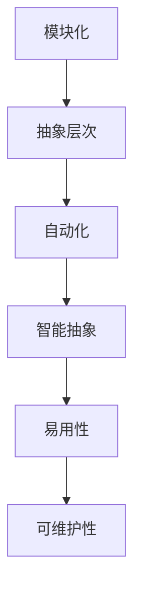
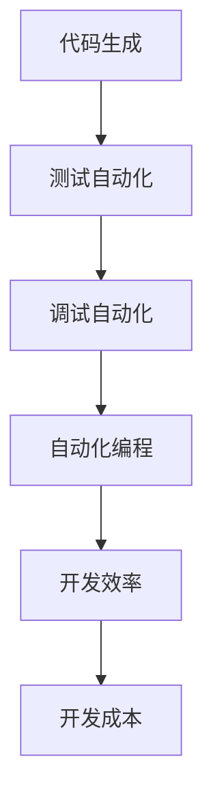
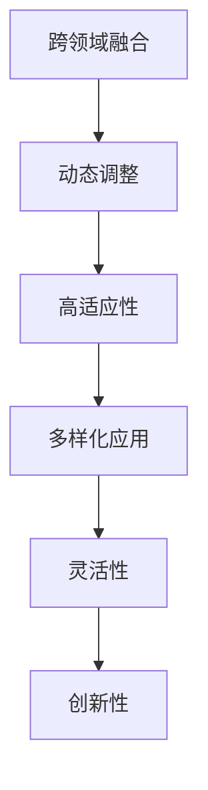
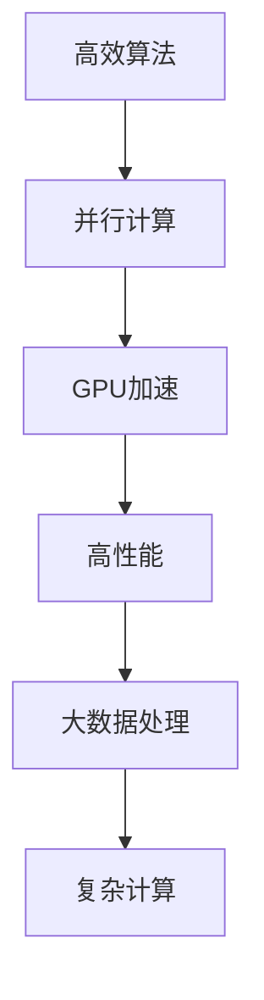
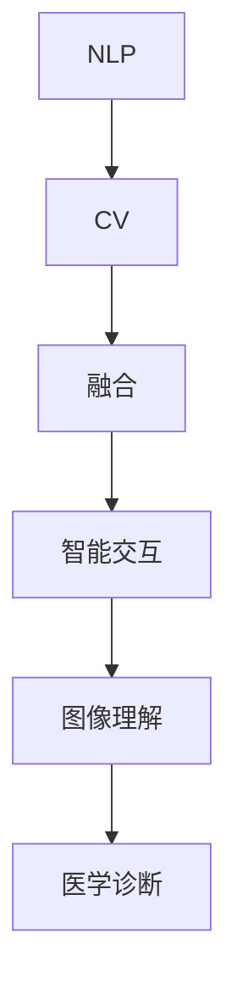

                 

### 第1章 引言

#### 1.1 编程语言设计的重要性

编程语言是计算机科学与技术领域的基础性工具，它为程序员提供了与计算机进行交流的桥梁。自第一代机器语言诞生以来，编程语言经历了从低级到高级、从复杂到简单的演变过程。编程语言设计的核心目标在于提高编程效率、增强代码可读性、提升开发者的生产力，同时减少错误的发生。

编程语言设计的重要性主要体现在以下几个方面：

1. **提升开发效率**：高效的编程语言能够帮助开发者更快地实现功能，缩短项目开发周期。例如，高级编程语言提供了丰富的库和框架，减少了冗余代码的编写。

2. **提高代码可维护性**：良好的编程语言设计使得代码结构更加清晰、逻辑更加严谨，便于后期的维护和升级。例如，面向对象编程语言通过封装、继承和多态等特性，提高了代码的重用性和可扩展性。

3. **降低学习成本**：设计合理的编程语言能够让新手更容易入门，降低学习成本。例如，Python语言因其简洁易懂的特性，成为编程初学者的热门选择。

4. **促进技术创新**：编程语言不仅影响编程实践，还推动技术创新。例如，函数式编程语言的兴起促进了并行计算和分布式计算的发展。

#### 1.2 AI对编程语言设计的影响

随着人工智能（AI）技术的迅速发展，AI对编程语言设计产生了深远的影响。AI驱动的编程语言设计在多个方面进行了创新，提升了编程语言的智能化水平和应用范围。

1. **智能抽象**：AI技术使得编程语言能够自动识别代码中的模式，进行智能抽象，从而简化开发过程。例如，TypeScript利用类型推断技术，提高了代码的可读性和健壮性。

2. **自动化编程**：AI技术可以自动化编写代码，特别是在复杂的算法和数据结构方面。例如，机器学习模型可以生成优化代码，提高性能。

3. **跨领域融合**：AI编程语言能够将不同领域的知识进行融合，使得编程语言能够应用于更多领域。例如，自然语言处理（NLP）技术使得编程语言能够理解自然语言，实现人机交互。

4. **高适应性**：AI编程语言具有更高的适应性，能够根据不同的任务需求进行动态调整。例如，量子编程语言Q#能够适应量子计算的特殊需求。

#### 1.3 本书结构安排

本书将从以下几个方面展开讨论：

1. **第2章 AI基础概念与编程语言**：介绍AI的基础概念和相关编程语言。
2. **第3章 AI驱动的编程语言设计原则**：阐述AI驱动的编程语言设计原则。
3. **第4章 AI编程语言架构设计**：探讨AI编程语言的架构设计。
4. **第5章 AI编程语言的实际应用**：分析AI编程语言的实际应用场景。
5. **第6章 AI驱动的编程语言开发实践**：分享AI编程语言开发实践。
6. **第7章 AI驱动的编程语言未来发展趋势**：预测AI驱动的编程语言未来发展趋势。

通过本书的讨论，我们希望读者能够深入了解AI驱动的编程语言设计理念与实践，为未来的编程实践提供新的思路和方向。接下来，我们将首先介绍AI的基础概念和相关编程语言，为后续章节的内容奠定基础。

## 第2章 AI基础概念与编程语言

#### 2.1 AI基础概念

人工智能（Artificial Intelligence，简称AI）是指通过计算机系统模拟人类智能行为的技术和科学。AI的目标是让计算机能够执行通常需要人类智能才能完成的任务，如理解语言、识别图像、进行决策等。AI可以分为两大类：弱人工智能（Narrow AI）和强人工智能（General AI）。

1. **弱人工智能（Narrow AI）**：弱人工智能专注于特定任务，如语音识别、图像识别、自然语言处理等。这些系统在特定领域内表现出与人类相似的能力，但缺乏通用性和自我意识。

2. **强人工智能（General AI）**：强人工智能具有广泛的认知能力，能够像人类一样理解和处理多种类型的信息。目前，强人工智能尚处于理论研究阶段，尚未实现商业化应用。

#### 2.2 AI编程语言概述

AI编程语言是专门为人工智能应用设计的编程语言，它们提供了丰富的库和工具，帮助开发者更高效地实现AI模型和算法。常见的AI编程语言包括：

1. **Python**：Python因其简洁易懂、丰富的库和强大的社区支持，成为AI开发的主流语言。常见的AI库如TensorFlow、PyTorch和Scikit-learn等，使得Python在AI领域具有很高的应用价值。

2. **R**：R是一种专门用于统计分析的语言，广泛应用于数据科学和机器学习领域。R的强大统计和图形处理能力使其成为AI研究和应用的理想选择。

3. **Julia**：Julia是一种高性能的动态编程语言，特别适用于科学计算和数值分析。Julia的语法简洁，同时能够高效地执行复杂计算，适用于大规模AI应用。

4. **Prolog**：Prolog是一种逻辑编程语言，擅长处理符号推理和问题求解。它在自然语言处理、知识表示和推理等领域有广泛应用。

#### 2.3 AI编程语言的特点与优势

AI编程语言具有以下特点与优势：

1. **简洁性**：AI编程语言通常具有简洁易懂的语法，使得开发者能够更快地掌握和使用。

2. **丰富的库和工具**：AI编程语言提供了丰富的库和工具，如TensorFlow、PyTorch等，这些库和工具提供了高效的算法和模型实现，极大地提高了开发效率。

3. **高性能**：许多AI编程语言，如Julia和C++，提供了高性能的执行能力，能够满足复杂计算和大规模数据处理的需求。

4. **灵活性**：AI编程语言通常具有高度的灵活性，允许开发者自定义模型和算法，适应不同的应用场景。

5. **跨领域融合**：AI编程语言能够将不同领域的知识进行融合，使得编程语言能够应用于更多领域，如自然语言处理、计算机视觉、医学诊断等。

通过本章的介绍，我们了解了AI的基础概念和AI编程语言的发展现状。接下来，我们将探讨AI驱动的编程语言设计原则，为AI编程语言的设计和应用提供理论指导。

### 2.3 AI编程语言的特点与优势

AI编程语言的设计与传统的编程语言相比，具有独特的特点和显著的优势。以下是AI编程语言的主要特点与优势：

#### 1. 智能抽象

智能抽象是AI编程语言的核心特点之一。它通过高级抽象，将复杂的算法和数据结构封装成易于使用的模块，从而简化了开发过程。智能抽象不仅提高了代码的可读性和可维护性，还降低了学习成本。例如，TensorFlow和PyTorch等AI编程框架提供了丰富的API，使得开发者可以轻松地构建和训练深度学习模型。

**核心概念与联系：**

智能抽象的实现依赖于以下核心概念：

- **模块化**：将代码分割成可重用的模块，提高了代码的复用性和可维护性。
- **抽象层次**：提供不同层次的抽象，使得开发者可以根据需求选择合适的抽象级别。
- **自动化**：利用自动化工具，如代码生成器和模型优化器，自动完成部分复杂代码的编写。

智能抽象的架构可以描述为：



#### 2. 自动化编程

自动化编程是AI编程语言的另一大特点。它利用AI技术，如机器学习和自动化代码生成，减少人工参与，提高开发效率。自动化编程包括代码生成、测试、调试等多个环节，通过自动化工具实现。

**核心概念与联系：**

自动化编程的核心概念包括：

- **代码生成**：利用模板和模型，自动生成代码，减少手动编写代码的工作量。
- **测试自动化**：自动执行代码测试，快速发现和修复错误。
- **调试自动化**：通过自动化工具，自动分析代码和程序的行为，找到并解决bug。

自动化编程的架构可以描述为：



#### 3. 高适应性

高适应性是AI编程语言的重要优势。它使得编程语言能够根据不同的任务需求进行动态调整，适应不同的应用场景。高适应性体现在以下几个方面：

- **跨领域融合**：AI编程语言能够将不同领域的知识进行融合，使得编程语言能够应用于更多领域，如自然语言处理、计算机视觉、医学诊断等。
- **动态调整**：编程语言能够根据实际情况，动态调整算法和模型，提高性能和适应性。

高适应性的架构可以描述为：



#### 4. 高性能

高性能是AI编程语言的另一大优势。AI应用通常涉及大规模数据和高复杂度的计算，因此编程语言必须能够提供高效、快速的执行能力。高性能主要体现在以下几个方面：

- **高效算法**：AI编程语言提供了高效的算法和优化技术，如并行计算、GPU加速等。
- **高效执行**：编程语言能够快速执行代码，提高程序的性能。

高性能的架构可以描述为：



#### 5. 跨领域融合

跨领域融合是AI编程语言的重要特点之一。它使得编程语言能够将不同领域的知识进行融合，应用于更广泛的领域。跨领域融合的例子包括：

- **自然语言处理（NLP）和计算机视觉（CV）的结合**：通过融合NLP和CV技术，实现更智能的人机交互和图像理解。
- **医学诊断和机器学习的结合**：利用机器学习技术，分析医学影像数据，辅助医生进行诊断。

跨领域融合的架构可以描述为：



通过以上对AI编程语言特点与优势的介绍，我们可以看到，AI编程语言在智能抽象、自动化编程、高适应性、高性能和跨领域融合等方面具有显著的优势。这些特点不仅提升了开发效率，还推动了人工智能技术的应用和发展。接下来，我们将进一步探讨AI驱动的编程语言设计原则，为AI编程语言的设计提供理论指导。

### 3.1 设计原则概述

AI驱动的编程语言设计原则是指导编程语言开发的基本理念和指导方针，旨在充分利用人工智能技术，提升编程语言的智能化水平和应用范围。这些原则不仅影响着编程语言的功能和特性，还决定着其适用性、易用性和性能。以下是AI驱动的编程语言设计的主要原则：

#### 1. 智能抽象

智能抽象是AI驱动的编程语言设计的重要原则之一。其核心思想是通过高级抽象，将复杂的算法和数据结构封装成易于使用的模块，从而简化开发过程。智能抽象不仅提高了代码的可读性和可维护性，还降低了学习成本。

- **实现方式**：利用AI技术，如机器学习和自然语言处理，自动识别代码中的模式，生成抽象模块。
- **优势**：提高开发效率，降低学习成本，提升代码质量。

#### 2. 自动化编程

自动化编程是AI驱动的编程语言设计的另一大原则。它通过自动化工具，如代码生成器和自动化测试框架，减少人工参与，提高开发效率。自动化编程不仅涵盖了代码生成，还包括测试、调试和部署等环节。

- **实现方式**：利用机器学习技术，如生成对抗网络（GAN），自动生成代码和测试用例。
- **优势**：提高开发效率，减少错误，提升代码质量。

#### 3. 高适应性

高适应性是指AI驱动的编程语言能够根据不同的任务需求进行动态调整，适应不同的应用场景。高适应性不仅体现在跨领域融合，还体现在编程语言的自我优化和适应性扩展。

- **实现方式**：利用AI技术，如深度学习和强化学习，实现编程语言的自我优化和动态调整。
- **优势**：提高编程语言的适用性，增强跨领域融合能力。

#### 4. 高性能

高性能是AI驱动的编程语言设计的重要目标之一。AI应用通常涉及大规模数据和高复杂度的计算，因此编程语言必须能够提供高效、快速的执行能力。

- **实现方式**：利用并行计算、GPU加速和分布式计算等技术，提高编程语言的性能。
- **优势**：提高程序的性能，满足大数据处理和复杂计算的需求。

#### 5. 跨领域融合

跨领域融合是指AI驱动的编程语言能够将不同领域的知识进行融合，应用于更广泛的领域。跨领域融合不仅包括不同技术领域的融合，还包括不同行业和应用场景的融合。

- **实现方式**：通过模块化设计和API接口，实现不同领域的知识和技术融合。
- **优势**：拓展编程语言的应用范围，提升编程语言的实用性。

#### 6. 用户中心设计

用户中心设计是指编程语言的设计以用户的需求和体验为中心，提供简洁易懂的语法和友好的用户界面。用户中心设计不仅关注开发者的需求，还考虑最终用户的体验。

- **实现方式**：通过用户调研、用户反馈和用户体验测试，不断优化编程语言的语法和功能。
- **优势**：提高编程语言的易用性和用户满意度。

#### 7. 可持续性和可扩展性

可持续性和可扩展性是指AI驱动的编程语言能够支持长期发展和持续改进。可持续性关注编程语言的长期稳定性和可靠性，可扩展性则关注编程语言的功能扩展和性能优化。

- **实现方式**：通过模块化设计、标准化和开源社区的支持，实现编程语言的可持续性和可扩展性。
- **优势**：提高编程语言的稳定性和灵活性，促进技术创新和发展。

通过以上设计原则，AI驱动的编程语言不仅能够提高开发效率、增强适应性，还能拓展应用范围、提升用户体验。这些原则为AI编程语言的设计提供了理论指导，也为未来的编程实践奠定了基础。

### 3.2 算法驱动的编程语言设计

算法驱动的编程语言设计是一种以算法为核心，将算法作为编程语言的设计和开发基础的方法。在这种设计理念下，编程语言不仅提供了基本的语法和结构，还通过内置的算法库和工具，支持各种复杂的算法实现和优化。算法驱动的编程语言设计具有以下几个关键特点和优势。

#### 1. 核心特点

1. **算法优先**：算法驱动的编程语言设计强调算法的重要性，将算法作为编程的核心。编程语言的设计和实现都围绕着算法的优化和效率进行。

2. **丰富的算法库**：为了支持算法的开发和优化，算法驱动的编程语言提供了丰富的算法库，包括常见的排序算法、搜索算法、图算法和机器学习算法等。这些库提供了高效且易于使用的接口，使得开发者可以专注于算法的实现，而无需从底层代码开始编写。

3. **性能优化**：算法驱动的编程语言设计注重性能优化，通过编译器优化、并行计算和GPU加速等技术，提高算法的执行效率。这种设计理念能够充分利用硬件资源，实现高性能计算。

4. **模块化设计**：算法驱动的编程语言通常采用模块化设计，将算法和数据处理模块分离。这种设计方法不仅提高了代码的可维护性和可扩展性，还便于算法的复用和优化。

#### 2. 伪代码示例

以下是一个简单的排序算法（冒泡排序）的伪代码示例，展示了算法驱动的编程语言设计如何通过伪代码实现算法逻辑：

```plaintext
// 冒泡排序算法伪代码
function bubbleSort(arr):
    n = length(arr)
    for i from 0 to n-1:
        for j from 0 to n-i-1:
            if arr[j] > arr[j+1]:
                swap(arr[j], arr[j+1])
```

在这个伪代码中，`bubbleSort` 函数接收一个数组 `arr` 作为输入，通过嵌套循环实现冒泡排序算法。外层循环 `i` 负责遍历整个数组，内层循环 `j` 负责比较相邻元素并进行交换，最终实现数组的排序。

#### 3. 数学模型和公式

在算法驱动的编程语言设计中，数学模型和公式是理解和实现算法的重要工具。以下是一个简单的数学模型和公式，用于描述冒泡排序算法的时间复杂度：

$$
T(n) = O(n^2)
$$

这个公式表示冒泡排序算法的时间复杂度为 $O(n^2)$，其中 $n$ 是数组的长度。这意味着，随着输入数据规模的增加，算法的执行时间将呈平方级增长。虽然冒泡排序算法简单易实现，但在大数据量下，其性能明显不足，因此通常不被用于大规模数据处理。

#### 4. 详细讲解和举例说明

为了更好地理解算法驱动的编程语言设计，我们通过一个具体的例子来讲解冒泡排序算法的实现和性能分析。

**例子：使用Python实现冒泡排序**

```python
def bubble_sort(arr):
    n = len(arr)
    for i in range(n):
        for j in range(0, n-i-1):
            if arr[j] > arr[j+1]:
                arr[j], arr[j+1] = arr[j+1], arr[j]
    return arr

# 测试代码
arr = [64, 34, 25, 12, 22, 11, 90]
sorted_arr = bubble_sort(arr)
print("排序后的数组：", sorted_arr)
```

在这个Python示例中，`bubble_sort` 函数实现了冒泡排序算法。测试代码部分创建了一个未排序的数组 `arr`，调用 `bubble_sort` 函数进行排序，并输出排序后的结果。

通过这个例子，我们可以看到算法驱动的编程语言设计如何将复杂的算法逻辑通过伪代码和实际代码实现，并通过数学模型和公式进行分析和优化。这种设计方法不仅提高了代码的可读性和可维护性，还促进了算法研究和应用的深入发展。

### 3.3 数据驱动的编程语言设计

数据驱动的编程语言设计是一种以数据为核心，通过数据处理和分析来驱动程序运行的编程语言设计方法。在这种设计理念下，编程语言注重数据的采集、存储、处理和分析，从而实现高效、灵活和自适应的编程。数据驱动的编程语言设计具有以下几个关键特点和优势。

#### 1. 核心特点

1. **数据导向**：数据驱动的编程语言设计将数据视为编程的核心，所有操作和流程都围绕数据展开。编程语言提供了丰富的数据结构和处理方法，以支持高效的数据操作。

2. **数据处理库**：数据驱动的编程语言通常内置丰富的数据处理库，如数据清洗库、数据分析库和机器学习库。这些库提供了高效的数据处理算法和工具，使得开发者可以轻松地进行数据分析和挖掘。

3. **动态数据流**：数据驱动的编程语言支持动态数据流，允许数据在程序中自由流动和转换。这种设计方法使得程序可以根据数据的变化动态调整，提高了程序的灵活性和适应性。

4. **并行处理**：数据驱动的编程语言设计利用并行计算和分布式计算技术，实现对大规模数据的快速处理。通过多核处理器和分布式系统，数据驱动的编程语言能够高效地处理海量数据。

#### 2. 伪代码示例

以下是一个简单的数据清洗和数据聚合的伪代码示例，展示了数据驱动的编程语言设计如何通过伪代码实现数据处理逻辑：

```plaintext
// 数据清洗和聚合伪代码
function processData(dataSet):
    cleanedData = []
    for data in dataSet:
        if isValid(data):
            cleanedData.append(data)
    
    aggregatedData = aggregate(cleanedData)
    return aggregatedData

function isValid(data):
    // 判断数据是否有效
    return true if all conditions are met else false

function aggregate(dataSet):
    // 对数据集进行聚合操作
    result = {}
    for data in dataSet:
        key = extractKey(data)
        value = extractValue(data)
        result[key] = result[key] + value if key exists else value
    return result
```

在这个伪代码中，`processData` 函数接收一个数据集 `dataSet` 作为输入，通过 `isValid` 函数判断数据的有效性，并将有效数据添加到 `cleanedData` 列表中。然后，`aggregate` 函数对 `cleanedData` 列表中的数据进行聚合操作，生成聚合结果。

#### 3. 数学模型和公式

在数据驱动的编程语言设计中，数学模型和公式用于描述数据处理和分析的过程。以下是一个简单的数学模型和公式，用于描述数据清洗和聚合的过程：

$$
\text{cleaned\_data} = \{ \text{data} | \text{isValid}(\text{data}) \}
$$

$$
\text{aggregated\_data} = \sum_{\text{data} \in \text{cleaned\_data}} \text{value}
$$

第一个公式表示通过 `isValid` 函数筛选出有效数据，第二个公式表示对有效数据进行聚合操作，将所有数据的值相加。

#### 4. 详细讲解和举例说明

为了更好地理解数据驱动的编程语言设计，我们通过一个具体的例子来讲解数据清洗和聚合的实现和性能分析。

**例子：使用Python实现数据清洗和聚合**

```python
import pandas as pd

# 加载数据集
dataSet = pd.read_csv('data.csv')

def isValid(data):
    # 判断数据是否有效，例如判断年龄是否在合理范围内
    age = data['age']
    return age >= 18 and age <= 65

def aggregate(dataSet):
    # 对数据进行聚合，例如计算年龄的平均值和标准差
    aggregatedData = {
        'mean_age': dataSet['age'].mean(),
        'std_age': dataSet['age'].std()
    }
    return aggregatedData

# 数据清洗
cleanedData = dataSet[dataSet.apply(isValid, axis=1)]

# 数据聚合
aggregatedData = aggregate(cleanedData)

print("清洗后的数据：", cleanedData)
print("聚合后的数据：", aggregatedData)
```

在这个Python示例中，我们使用Pandas库加载一个CSV文件作为数据集。`isValid` 函数用于判断数据是否有效，例如判断年龄是否在18到65岁之间。`aggregate` 函数用于计算年龄的平均值和标准差，实现数据的聚合操作。

通过这个例子，我们可以看到数据驱动的编程语言设计如何通过数据处理库和数学模型，实现数据清洗和聚合的过程。这种设计方法不仅提高了数据处理和分析的效率，还促进了数据驱动的编程实践的发展。

### 3.4 模型驱动的编程语言设计

模型驱动的编程语言设计是一种以模型为核心，通过定义和操作模型来实现程序功能的编程语言设计方法。在这种设计理念下，编程语言提供了一套完整的模型定义语言和操作工具，使得开发者可以专注于模型的设计和优化，而无需关注底层实现细节。模型驱动的编程语言设计具有以下几个关键特点和优势。

#### 1. 核心特点

1. **模型定义**：模型驱动的编程语言设计强调对模型的定义和描述。编程语言提供了丰富的模型定义语言，支持各种类型的模型，如数据模型、业务模型和物理模型。

2. **模型操作**：模型驱动的编程语言设计提供了强大的模型操作能力，支持模型的生成、修改、优化和部署。编程语言提供了丰富的操作接口，使得开发者可以方便地操作模型。

3. **抽象层次**：模型驱动的编程语言设计提供了不同的抽象层次，从高层次的模型定义到低层次的代码生成，满足了不同开发阶段的需求。

4. **自动化**：模型驱动的编程语言设计利用自动化技术，如代码生成器和模型优化器，减少人工参与，提高开发效率。自动化技术可以自动生成代码、优化模型和部署应用程序。

#### 2. 伪代码示例

以下是一个简单的模型驱动的编程语言设计伪代码示例，展示了如何通过模型定义和操作实现程序功能：

```plaintext
// 模型驱动编程语言设计伪代码
class Model:
    // 定义模型的属性和方法
    attribute: data
    method: train(data)
    method: predict(data)
    method: optimize()

function main():
    model = Model()
    // 训练模型
    trainedModel = model.train(data)
    // 使用模型进行预测
    prediction = trainedModel.predict(inputData)
    // 优化模型
    optimizedModel = model.optimize(trainedModel)
```

在这个伪代码中，`Model` 类定义了一个简单的模型，包括数据属性和三个方法：`train` 用于训练模型，`predict` 用于进行预测，`optimize` 用于模型优化。`main` 函数创建了一个 `Model` 实例，通过调用这些方法实现模型训练、预测和优化。

#### 3. 数学模型和公式

在模型驱动的编程语言设计中，数学模型和公式用于描述模型的设计和优化过程。以下是一个简单的数学模型和公式，用于描述模型训练和优化的过程：

$$
\text{model} = \theta_0 + \theta_1x_1 + \theta_2x_2 + ... + \theta_nx_n
$$

这个公式表示模型的输出依赖于输入特征和模型的参数。`$\theta_0, \theta_1, ..., \theta_n$` 是模型的参数，`$x_1, x_2, ..., x_n$` 是输入特征。

$$
\text{loss} = \frac{1}{2}\sum_{i=1}^{n}(\text{model}(x_i) - y_i)^2
$$

这个公式表示模型损失函数，用于衡量模型预测值与真实值之间的差异。

#### 4. 详细讲解和举例说明

为了更好地理解模型驱动的编程语言设计，我们通过一个具体的例子来讲解模型训练、预测和优化的实现和性能分析。

**例子：使用Python实现线性回归模型**

```python
import numpy as np
from sklearn.linear_model import LinearRegression

# 生成模拟数据集
np.random.seed(0)
X = np.random.rand(100, 1)
y = 2 * X + 1 + np.random.randn(100, 1)

# 创建线性回归模型
model = LinearRegression()

# 训练模型
model.fit(X, y)

# 进行预测
prediction = model.predict(X)

# 计算模型损失
loss = np.mean((prediction - y) ** 2)

print("模型预测值：", prediction)
print("模型损失：", loss)

# 优化模型（例如使用梯度下降）
def optimize_model(model, X, y, learning_rate=0.01, epochs=1000):
    for epoch in range(epochs):
        prediction = model.predict(X)
        loss = np.mean((prediction - y) ** 2)
        model.coef_ -= learning_rate * (2 * X.T.dot(X).dot(prediction - y))
        model.intercept_ -= learning_rate * (2 * (prediction - y).sum())

    return model

# 优化模型
optimized_model = optimize_model(model, X, y)

# 再次进行预测
prediction = optimized_model.predict(X)

# 计算优化后模型损失
loss = np.mean((prediction - y) ** 2)

print("优化后模型预测值：", prediction)
print("优化后模型损失：", loss)
```

在这个Python示例中，我们首先生成一个线性回归的模拟数据集。然后，使用`sklearn`库中的`LinearRegression`类创建线性回归模型，并进行模型训练和预测。接着，我们定义了一个`optimize_model`函数，使用梯度下降算法对模型进行优化。最后，我们再次进行预测并计算优化后模型的损失。

通过这个例子，我们可以看到模型驱动的编程语言设计如何通过模型定义和操作，实现线性回归模型的训练、预测和优化。这种设计方法不仅提高了模型开发效率，还促进了模型优化和性能提升。

### 4.1 编译器架构设计

编译器架构设计是AI编程语言开发中的关键环节，它关系到程序的执行效率、可维护性和可扩展性。编译器负责将高级语言编写的源代码转换成机器码或中间代码，以便计算机能够理解和执行。以下是编译器架构设计的几个关键组成部分和其功能：

#### 1. 词法分析器（Lexer）

词法分析器是编译器的第一个组件，它的主要功能是将源代码分解成一个个的词素（tokens）。词素是源代码中最小的有意义的单位，如关键字、标识符、操作符和分隔符等。词法分析器通常通过模式匹配算法实现，如正则表达式。

**伪代码示例：**

```plaintext
function lexer(sourceCode):
    tokens = []
    while sourceCode not empty:
        match = regexMatch(sourceCode, tokenPatterns)
        tokens.append(match.token)
        sourceCode = removeMatchedSection(sourceCode, match)
    return tokens
```

#### 2. 语法分析器（Parser）

语法分析器负责将词法分析器生成的词素序列转换成语法树（Abstract Syntax Tree，AST）。AST表示源代码的结构，是一种抽象语法表示，它将源代码的语法规则转换为树形结构，便于后续处理。

**伪代码示例：**

```plaintext
function parser(tokens):
    ast = createAST()
    currentToken = tokens[0]
    while currentToken exists:
        ast.addChild(processToken(currentToken))
        tokens.remove(currentToken)
        currentToken = tokens[0]
    return ast
```

#### 3. 语义分析器（Semantic Analyzer）

语义分析器在语法分析的基础上，检查AST的语义正确性。它负责类型检查、作用域分析、变量声明和初始化等任务。语义分析器确保源代码在语法上正确的同时，也符合语义规则。

**伪代码示例：**

```plaintext
function semanticAnalyzer(ast):
    for node in ast:
        if node is a variable declaration:
            checkVariableDeclaration(node)
        if node is an expression:
            checkExpressionSemantics(node)
    return ast
```

#### 4. 中间代码生成器（Intermediate Code Generator）

中间代码生成器将AST转换为中间代码（Intermediate Representation，IR）。中间代码是一种较低层次但仍然抽象的表示，它介于源代码和机器码之间。中间代码通常更易于优化和转换。

**伪代码示例：**

```plaintext
function intermediateCodeGenerator(ast):
    ir = createIR()
    for node in ast:
        ir.append(generateIRCode(node))
    return ir
```

#### 5. 代码优化器（Code Optimizer）

代码优化器负责对中间代码进行优化，以提高程序的执行效率。优化器可以采用多种技术，如常量折叠、死代码消除、循环优化等。

**伪代码示例：**

```plaintext
function codeOptimizer(ir):
    optimizedIR = cloneIR(ir)
    for node in optimizedIR:
        optimizeNode(node)
    return optimizedIR
```

#### 6. 代码生成器（Code Generator）

代码生成器将优化后的中间代码转换为机器码或目标代码。这个阶段可能涉及将IR转换成汇编代码，然后再通过汇编器转换为机器码。

**伪代码示例：**

```plaintext
function codeGenerator(optimizedIR):
    assemblyCode = createAssemblyCode()
    for instruction in optimizedIR:
        assemblyCode.append(generateAssemblyCode(instruction))
    return assemblyCode
```

#### 7. 虚拟机（Virtual Machine）

虚拟机是一个虚拟的计算机执行环境，它负责执行编译器生成的目标代码。虚拟机通常包含一个解释器，逐条执行代码，或通过即时编译（Just-In-Time Compilation，JIT）将代码转换为机器码执行。

**伪代码示例：**

```plaintext
function virtualMachine(targetCode):
    while targetCode not empty:
        instruction = targetCode.pop()
        executeInstruction(instruction)
```

通过上述组件的协同工作，编译器能够将高级语言编写的源代码转换成可执行的机器码。这个过程中，每个组件都有其特定的功能和职责，共同确保编译器的整体性能和可靠性。接下来，我们将进一步探讨解释器架构设计，以更全面地了解AI编程语言的编译和执行过程。

### 4.2 解释器架构设计

解释器是AI编程语言执行环境中的核心组件，它逐行解释并执行源代码，而不需要预先编译成机器码。解释器架构设计关注解释效率、可扩展性和灵活性，是编程语言实现动态性和解释执行的重要手段。以下是解释器架构设计的几个关键组成部分和其功能：

#### 1. 词法分析器（Lexer）

词法分析器与编译器中的词法分析器类似，它的作用是将源代码分解成词素（tokens），如关键字、标识符、操作符和分隔符等。词法分析器是解释器的第一个组件，负责读取和分类源代码中的每个字符。

**伪代码示例：**

```plaintext
function lexer(sourceCode):
    tokens = []
    while sourceCode not empty:
        token = extractToken(sourceCode)
        tokens.append(token)
        sourceCode = removeTokenFromSource(sourceCode, token)
    return tokens
```

#### 2. 语法分析器（Parser）

语法分析器负责将词法分析器生成的词素序列转换成抽象语法树（Abstract Syntax Tree，AST）。与编译器中的语法分析器不同，解释器中的语法分析器通常较为简单，只需要生成执行所需的操作树。

**伪代码示例：**

```plaintext
function parser(tokens):
    ast = createAST()
    currentToken = tokens[0]
    while currentToken exists:
        ast.addChild(processToken(currentToken))
        tokens.remove(currentToken)
        currentToken = tokens[0]
    return ast
```

#### 3. 执行引擎（Execution Engine）

执行引擎是解释器的核心组件，负责执行AST中的操作。它通常包含一个解释器循环（interpretation loop），逐行解释并执行AST中的每个操作。执行引擎通过执行操作树，将源代码中的指令转换为实际的操作。

**伪代码示例：**

```plaintext
function executionEngine(ast):
    while ast not empty:
        node = ast.pop()
        executeNode(node)
```

**执行循环伪代码：**

```plaintext
function executeNode(node):
    if node is a value:
        return node.value
    elif node is an operation:
        left = executeNode(node.left)
        right = executeNode(node.right)
        return applyOperation(node.op, left, right)
```

#### 4. 环境管理器（Environment Manager）

环境管理器负责管理程序的运行环境，包括变量、作用域和函数调用等。它为每个执行线程维护一个符号表（symbol table），记录变量和函数的绑定信息。

**伪代码示例：**

```plaintext
function environmentManager():
    symbolTable = createSymbolTable()
    function declareVariable(name, value):
        symbolTable[name] = value
    function getVariable(name):
        return symbolTable[name]
```

#### 5. 异常处理（Exception Handling）

异常处理是解释器架构设计中的重要组成部分，它负责捕获和处理程序运行过程中发生的错误和异常。异常处理机制确保程序在遇到错误时能够优雅地退出，并给出有用的错误信息。

**伪代码示例：**

```plaintext
function exceptionHandler():
    function catchException(exception):
        if exception is a syntax error:
            reportSyntaxError(exception)
        elif exception is a runtime error:
            reportRuntimeError(exception)
```

#### 6. 内存管理（Memory Management）

内存管理负责动态分配和回收程序运行时所需的内存。在解释器中，内存管理通常采用垃圾收集（Garbage Collection，GC）技术，自动检测并回收不再使用的内存空间。

**伪代码示例：**

```plaintext
function memoryManager():
    function allocateMemory(size):
        memoryBlock = allocate(size)
        return memoryBlock
    function deallocateMemory(block):
        free(block)
```

通过上述组件的协同工作，解释器能够有效地将源代码转换为实际操作，并执行程序。这种架构设计不仅提高了程序的灵活性和可扩展性，还为开发者提供了更直观和动态的编程体验。接下来，我们将进一步探讨虚拟机架构设计，以更全面地了解AI编程语言的执行环境。

### 4.3 虚拟机架构设计

虚拟机（Virtual Machine，VM）是AI编程语言执行环境的一种重要实现方式。它提供了一个抽象的执行环境，使编程语言可以在不同硬件和操作系统上运行，提高了代码的可移植性和灵活性。虚拟机架构设计主要包括虚拟指令集、即时编译（JIT）和垃圾回收（GC）等关键组成部分。

#### 1. 虚拟指令集

虚拟指令集是虚拟机的一套指令集合，它定义了虚拟机能够执行的操作。虚拟指令集通常比机器指令集更加抽象，以便于不同平台上的高效执行。虚拟指令集的设计需要考虑执行效率、易读性和可扩展性。

**伪代码示例：**

```plaintext
instruction PUSH(value):
    // 将值压入虚拟栈
instruction POP():
    // 从虚拟栈弹出值
instruction ADD():
    // 计算栈顶两个值的和
instruction SUB():
    // 计算栈顶两个值的差
```

#### 2. 虚拟机的组成

虚拟机主要由以下几个组件组成：

1. **虚拟指令集解释器（Virtual Instruction Set Interpreter）**：解释器负责逐条解释和执行虚拟指令。它将虚拟指令转换为机器指令，并在宿主环境中执行。

2. **即时编译器（Just-In-Time Compiler，JIT）**：JIT编译器将热点代码（频繁执行的代码段）编译成机器码，提高执行效率。JIT编译器通过分析执行数据，识别热点代码并进行编译。

**伪代码示例：**

```plaintext
function virtualMachine(executableCode):
    jitCompiler = createJITCompiler()
    while executableCode not empty:
        instruction = executableCode.pop()
        if isHotCode(instruction):
            machineCode = jitCompiler.compile(instruction)
            executeMachineCode(machineCode)
        else:
            executeVirtualInstruction(instruction)
```

3. **垃圾回收器（Garbage Collector，GC）**：垃圾回收器负责自动检测和回收不再使用的内存。它通过引用计数、标记-清除或分代回收等算法，释放内存空间。

**伪代码示例：**

```plaintext
function garbageCollector():
    objects = findAllObjects()
    for object in objects:
        if isOrphanObject(object):
            free(object.memory)
```

4. **内存管理器（Memory Manager）**：内存管理器负责动态分配和释放内存。它通常与垃圾回收器协作，实现高效、可靠的内存管理。

**伪代码示例：**

```plaintext
function memoryManager():
    function allocate(size):
        return allocateMemoryFromHeap(size)
    function free(block):
        deallocateMemoryFromHeap(block)
```

#### 3. 虚拟机架构的工作流程

虚拟机的工作流程可以概括为以下几个步骤：

1. **加载程序**：虚拟机从文件系统或内存中加载程序代码，并将其载入内存。

2. **解释执行**：虚拟机的解释器逐条解释并执行虚拟指令，将操作转化为具体操作。

3. **即时编译**：JIT编译器识别热点代码并进行编译，将虚拟指令转换为机器指令，提高执行效率。

4. **垃圾回收**：垃圾回收器定期运行，检测并回收不再使用的内存空间。

5. **内存管理**：内存管理器根据程序需求动态分配和释放内存。

**伪代码示例：**

```plaintext
function executeProgram(program):
    virtualMachine = createVirtualMachine()
    virtualMachine.loadProgram(program)
    virtualMachine.start()
    virtualMachine.waitForTermination()
```

通过上述架构设计，虚拟机能够提供高效、灵活和可移植的执行环境。它不仅提高了程序的性能，还简化了开发者的工作，使得AI编程语言能够更好地应用于不同领域和场景。接下来，我们将探讨代码生成策略，进一步了解虚拟机如何优化程序执行。

### 4.4 代码生成策略

代码生成策略是虚拟机架构中的重要组成部分，它决定了虚拟机如何将虚拟指令转换为机器指令，以优化程序执行效率。有效的代码生成策略可以显著提升程序的运行速度和资源利用率。以下是几种常见的代码生成策略及其优缺点：

#### 1. 一次性编译（One-Time Compilation）

一次性编译策略在程序运行前，将所有虚拟指令一次性编译成机器指令。这种方法的主要优点是执行速度快，因为编译后的机器代码可以直接在宿主机器上运行，避免了运行时的解释执行开销。

**优点**：
- **执行速度快**：编译后的机器代码直接执行，避免了解释执行的开销。
- **资源利用率高**：编译后的代码可以缓存和重用，减少内存占用和I/O操作。

**缺点**：
- **编译时间长**：需要一次性编译整个程序，编译时间较长。
- **灵活性差**：一旦编译完成，程序的执行逻辑就固定下来，难以动态调整。

**伪代码示例：**

```plaintext
function oneTimeCompilation(virtualCode):
    machineCode = compiler.compile(virtualCode)
    return machineCode
```

#### 2. 模块化编译（Modular Compilation）

模块化编译策略将程序拆分为多个模块，分别编译每个模块，并在运行时动态加载。这种方法可以提高编译的灵活性和执行效率，因为程序可以根据实际需要动态加载和执行不同的模块。

**优点**：
- **编译灵活**：可以按需编译和加载模块，提高编译效率。
- **可扩展性高**：便于添加和更新功能模块，适应不同应用场景。

**缺点**：
- **加载时间开销**：模块化编译需要额外的加载时间，可能会影响执行速度。
- **内存占用大**：多个模块同时存在可能导致内存占用增加。

**伪代码示例：**

```plaintext
function modularCompilation(virtualCode):
    modules = compiler.compileModules(virtualCode)
    function loadModule(module):
        machineCode = module.compile()
        executeMachineCode(machineCode)
```

#### 3. 即时编译（Just-In-Time Compilation，JIT）

即时编译策略在程序运行时，动态编译热点代码（频繁执行的代码段），将其转换为机器指令。这种方法通过优化热点代码，显著提高程序的执行效率。

**优点**：
- **执行效率高**：优化热点代码，提高执行速度。
- **自适应性强**：可以根据运行时数据动态调整编译策略。

**缺点**：
- **编译开销大**：JIT编译器需要额外处理编译任务，可能会增加开销。
- **延迟问题**：初次执行时可能存在一定的延迟，需要等待编译完成。

**伪代码示例：**

```plaintext
function justInTimeCompilation(virtualCode):
    function compileHotCode(code):
        machineCode = jitCompiler.compile(code)
        return machineCode
    while virtualCode not empty:
        codeSegment = virtualCode.pop()
        if isHotCode(codeSegment):
            machineCode = compileHotCode(codeSegment)
            executeMachineCode(machineCode)
        else:
            executeVirtualInstruction(codeSegment)
```

#### 4. 适应性编译（Adaptive Compilation）

适应性编译策略结合了即时编译和一次性编译的优点，根据程序的执行模式动态调整编译策略。在执行过程中，编译器会分析代码的行为，根据热点检测结果选择最合适的编译策略。

**优点**：
- **灵活高效**：根据执行模式动态调整，提高整体执行效率。
- **适应性强**：能够适应不同应用场景和需求。

**缺点**：
- **实现复杂**：需要复杂的算法和逻辑，实现难度较高。
- **性能开销**：适应性编译可能引入额外的性能开销。

**伪代码示例：**

```plaintext
function adaptiveCompilation(virtualCode):
    function selectCompilationStrategy(codeSegment):
        if codeSegment is a hot segment:
            return justInTimeCompilation
        else:
            return oneTimeCompilation
    while virtualCode not empty:
        codeSegment = virtualCode.pop()
        strategy = selectCompilationStrategy(codeSegment)
        executeStrategy(codeSegment, strategy)
```

通过选择合适的代码生成策略，虚拟机可以实现高效、灵活的执行环境，满足不同应用场景的需求。不同的策略各有优缺点，开发者在设计虚拟机时需要根据具体应用场景和需求进行权衡和选择。

### 5.1 人工智能应用场景分析

人工智能（AI）技术已经深刻地改变了我们的生活和各行各业。以下是几个典型的人工智能应用场景，以及这些场景对编程语言设计的需求和挑战。

#### 1. 自然语言处理（NLP）

自然语言处理是人工智能的一个重要分支，旨在使计算机理解和生成人类语言。常见的NLP应用包括文本分类、情感分析、机器翻译和语音识别等。

**需求与挑战：**

- **需求**：NLP应用需要强大的语言处理能力，包括词法分析、句法分析和语义分析。编程语言需要提供丰富的文本处理库和API，支持自然语言的理解和生成。
- **挑战**：NLP任务通常涉及大规模数据处理和复杂模型训练，对编程语言的性能和可扩展性提出了高要求。同时，NLP应用需要实时处理大量数据，对响应速度和延迟有严格要求。

**适合的编程语言：**

- **Python**：Python因其简洁易懂和强大的库（如NLTK、spaCy和TensorFlow）而成为NLP开发的主要语言。
- **R**：R在统计分析方面有很强的优势，适用于复杂的数据分析和模型训练。

#### 2. 计算机视觉（CV）

计算机视觉技术使计算机能够处理和解释数字图像和视频。常见的CV应用包括图像识别、目标检测、图像生成和视频分析等。

**需求与挑战：**

- **需求**：CV应用需要高效的图像处理和计算能力，包括图像滤波、特征提取和机器学习模型训练。编程语言需要提供强大的图像处理库和GPU加速支持。
- **挑战**：CV任务通常涉及大量计算和数据传输，对编程语言的速度和内存管理提出了高要求。同时，CV应用需要处理多种类型的图像和视频格式，对兼容性有较高要求。

**适合的编程语言：**

- **Python**：Python的NumPy和OpenCV库为图像处理提供了强大的支持。
- **C++**：C++提供了高效的执行能力和强大的图像处理库，适用于高性能的CV应用。

#### 3. 机器学习（ML）

机器学习是AI的核心技术之一，通过训练模型从数据中学习规律。常见的ML应用包括分类、回归、聚类和强化学习等。

**需求与挑战：**

- **需求**：ML应用需要高效的模型训练和推理能力，包括数据处理、算法优化和分布式计算。编程语言需要提供丰富的机器学习库和工具，支持多种算法的实现和优化。
- **挑战**：ML任务通常涉及大量数据和复杂模型，对编程语言的性能和可扩展性提出了高要求。同时，ML应用需要处理不同类型的数据集和特征，对数据预处理和特征提取有较高要求。

**适合的编程语言：**

- **Python**：Python的Scikit-learn、TensorFlow和PyTorch等库为机器学习提供了广泛的支持。
- **R**：R在统计分析和数据处理方面有很强的能力，适用于复杂的数据挖掘和机器学习应用。

#### 4. 自动驾驶

自动驾驶技术是AI在交通运输领域的应用，通过传感器和算法实现车辆的自主驾驶。自动驾驶系统需要处理实时数据、进行复杂决策和执行精确操作。

**需求与挑战：**

- **需求**：自动驾驶系统需要实时处理大量传感器数据，进行环境感知和决策。编程语言需要提供高效的并发处理和实时数据流处理能力。
- **挑战**：自动驾驶系统对安全性和可靠性有极高要求，任何错误都可能导致严重后果。编程语言需要提供强大的错误检测和容错机制。

**适合的编程语言：**

- **C/C++**：C/C++提供了高效的执行能力和强大的并发处理库，适用于自动驾驶系统的实时性和高性能要求。
- **Java**：Java提供了丰富的并发处理库和跨平台特性，适用于自动驾驶系统的开发。

#### 5. 医学诊断

医学诊断是AI在医疗领域的应用，通过分析医疗数据和影像，辅助医生进行诊断和治疗。常见的应用包括疾病预测、影像分析和个性化治疗等。

**需求与挑战：**

- **需求**：医学诊断需要对大量医疗数据进行深度分析，提取有用的信息。编程语言需要提供强大的数据处理和机器学习库，支持医学图像处理和模型训练。
- **挑战**：医学诊断对数据隐私和安全有严格要求，对算法的准确性和稳定性有高要求。编程语言需要提供强大的数据安全和隐私保护机制。

**适合的编程语言：**

- **Python**：Python的SciPy、NumPy和TensorFlow等库为医学诊断提供了广泛的支持。
- **R**：R在统计分析和数据处理方面有很强的能力，适用于医学诊断的复杂计算和分析。

通过以上分析，我们可以看到不同的人工智能应用场景对编程语言设计提出了不同的需求。编程语言需要具备强大的库支持、高效的执行能力和良好的可扩展性，以满足不同应用场景的要求。同时，开发者在选择编程语言时，也需要根据具体应用场景和需求进行综合考虑和权衡。

### 5.2 AI编程语言在具体领域的应用

#### 5.2.1 自动驾驶

自动驾驶是人工智能技术的一个重要应用领域，它通过传感器数据、计算机视觉和机器学习算法，实现汽车的自主驾驶功能。自动驾驶系统的核心在于实时处理大量传感器数据，进行环境感知和路径规划。

**编程语言选择：**

- **C/C++**：C/C++因其高效的执行能力和强大的并发处理库，成为自动驾驶系统开发的主要语言。特别是在实时性和高性能要求较高的场景中，C/C++表现优异。

**关键技术和实现：**

- **多传感器融合**：自动驾驶系统需要整合多种传感器数据，如雷达、激光雷达（LiDAR）、摄像头和超声波传感器等。编程语言需要支持多线程和并发处理，以实现高效的数据融合。

```cpp
// 示例：多传感器数据融合
class SensorFusion {
public:
    void addSensorData(const SensorData& data) {
        // 处理传感器数据
    }

    void processSensorData() {
        // 并行处理传感器数据
        std::thread([this]() {
            // 处理雷达数据
        })();
        std::thread([this]() {
            // 处理激光雷达数据
        })();
        // ...其他传感器数据处理
    }
};
```

- **路径规划**：自动驾驶系统需要根据环境数据生成最优行驶路径。路径规划算法如A*算法、Dijkstra算法等，是实现自动驾驶系统核心功能的关键。

```cpp
// 示例：A*算法实现
class AStar {
public:
    std::vector<std::pair<int, int>> findPath(const std::vector<std::pair<int, int>>& start, const std::vector<std::pair<int, int>>& goal) {
        // 实现A*算法
        // ...
        return path;
    }
};
```

**案例分析与讲解：**

以特斯拉的自动驾驶系统为例，其通过融合摄像头、雷达和超声波传感器数据，实现环境感知和路径规划。特斯拉使用C++进行核心算法的实现，通过多线程和并发处理技术，提高了系统的实时性和性能。此外，特斯拉还使用深度学习算法，如卷积神经网络（CNN），对摄像头图像进行目标检测和识别，进一步提升自动驾驶系统的准确性。

#### 5.2.2 医学诊断

医学诊断是人工智能在医疗领域的应用之一，通过分析医疗数据和影像，辅助医生进行诊断和治疗。常见的应用包括疾病预测、影像分析和个性化治疗等。

**编程语言选择：**

- **Python**：Python因其简洁易懂和强大的库支持（如NumPy、SciPy、TensorFlow和PyTorch），成为医学诊断开发的主要语言。

**关键技术和实现：**

- **数据处理**：医学诊断需要对大量的医疗数据进行预处理和特征提取。Python的Pandas库和NumPy库提供了强大的数据处理功能。

```python
import pandas as pd
import numpy as np

# 示例：数据预处理
data = pd.read_csv('medical_data.csv')
data = data.dropna()  # 去除缺失值
data = data[data['age'] > 18 & data['age'] < 65]  # 筛选有效数据
features = data.iloc[:, :-1].values
labels = data.iloc[:, -1].values
```

- **机器学习模型训练**：医学诊断通常使用机器学习算法进行模型训练，如支持向量机（SVM）、决策树和深度学习模型等。Python的Scikit-learn库和TensorFlow库提供了丰富的模型训练工具。

```python
from sklearn.ensemble import RandomForestClassifier
from sklearn.model_selection import train_test_split

# 示例：训练随机森林模型
X_train, X_test, y_train, y_test = train_test_split(features, labels, test_size=0.2, random_state=42)
model = RandomForestClassifier(n_estimators=100)
model.fit(X_train, y_train)

# 测试模型
accuracy = model.score(X_test, y_test)
print("模型准确率：", accuracy)
```

**案例分析与讲解：**

以IBM Watson Health的医学诊断系统为例，该系统通过分析医学影像数据，辅助医生进行癌症诊断。Watson Health使用Python进行数据处理和机器学习模型训练。系统首先使用Pandas和NumPy库进行数据预处理，然后使用Scikit-learn和TensorFlow库训练深度学习模型。通过这种方式，Watson Health在多个医学诊断任务中取得了优异的性能，显著提高了诊断准确率和效率。

#### 5.2.3 金融服务

金融服务是人工智能应用的另一个重要领域，通过数据分析、风险评估和自动化交易等，提高金融服务的效率和质量。金融服务中的AI应用包括智能投顾、风险管理、欺诈检测和客户服务机器人等。

**编程语言选择：**

- **Python**：Python因其强大的数据处理能力和丰富的库支持（如NumPy、Pandas、Scikit-learn和TensorFlow），成为金融服务AI开发的主要语言。

**关键技术和实现：**

- **数据分析**：金融服务需要对大量的金融数据进行实时分析和预测。Python的Pandas库和NumPy库提供了强大的数据分析功能。

```python
import pandas as pd
import numpy as np

# 示例：金融数据分析
data = pd.read_csv('financial_data.csv')
data = data.dropna()  # 去除缺失值
data['return'] = np.log(data['close'] / data['open'])  # 计算收益率
```

- **机器学习模型**：金融服务中的AI应用通常使用机器学习模型进行风险评估和预测。Python的Scikit-learn库和TensorFlow库提供了丰富的模型训练和预测工具。

```python
from sklearn.ensemble import RandomForestRegressor
from sklearn.model_selection import train_test_split

# 示例：训练随机森林回归模型
X_train, X_test, y_train, y_test = train_test_split(features, labels, test_size=0.2, random_state=42)
model = RandomForestRegressor(n_estimators=100)
model.fit(X_train, y_train)

# 测试模型
accuracy = model.score(X_test, y_test)
print("模型准确率：", accuracy)
```

**案例分析与讲解：**

以NVIDIA的Ampere架构金融服务平台为例，该平台通过深度学习和计算机视觉技术，提供自动化交易、风险评估和欺诈检测等服务。Ampere平台使用Python进行数据处理和模型训练，通过TensorFlow和Scikit-learn库实现复杂的机器学习算法。平台能够实时分析大量金融数据，并生成准确的交易策略和风险评估报告，提高了金融服务的效率和质量。

通过以上案例分析和讲解，我们可以看到AI编程语言在不同领域的应用场景和实现方法。不同的编程语言和库提供了丰富的工具和功能，支持开发者实现复杂的AI应用，提高了应用效率和准确性。

### 5.3 AI编程语言的优势与挑战

#### 5.3.1 优势

AI编程语言在推动人工智能技术发展和应用方面具有显著优势：

1. **智能抽象**：AI编程语言通过智能抽象，将复杂的算法和数据结构封装成易于使用的模块，简化了开发过程，提高了代码的可维护性和可读性。例如，深度学习框架TensorFlow和PyTorch提供了丰富的API和预训练模型，使得开发者能够更高效地构建和训练AI模型。

2. **自动化编程**：AI编程语言利用自动化技术，如代码生成、测试和调试，减少了人工参与，提高了开发效率。自动化编程工具能够自动完成部分复杂代码的编写，加快了开发周期，例如，Python的Pylint工具能够自动检查代码质量和风格，提高代码质量。

3. **高适应性**：AI编程语言具有高适应性，能够根据不同任务需求进行动态调整，适应多种应用场景。例如，量子编程语言Q#能够适应量子计算的特殊需求，为量子编程提供高效的执行环境。

4. **高性能**：AI编程语言提供了高性能的执行能力，能够满足复杂计算和大规模数据处理的需求。例如，Julia语言因其高效的执行能力和强大的数值计算库，广泛应用于科学计算和数据分析领域。

5. **跨领域融合**：AI编程语言能够将不同领域的知识和技术进行融合，拓展了编程语言的应用范围。例如，自然语言处理（NLP）和计算机视觉（CV）技术的融合，使得编程语言能够应用于智能交互和图像识别等领域。

#### 5.3.2 挑战

尽管AI编程语言具有众多优势，但在实际应用中仍面临以下挑战：

1. **性能瓶颈**：AI编程语言在处理复杂计算和大规模数据处理时，可能会遇到性能瓶颈。尽管一些编程语言（如Python和R）提供了高效的库和工具，但在执行复杂任务时，仍可能受到语言本身的限制。

2. **调试难度**：AI编程语言通常涉及复杂的算法和模型，调试难度较大。开发者需要深入理解算法和模型的实现细节，以便定位和解决潜在的问题。

3. **学习曲线**：AI编程语言和相关工具的学习曲线较高，尤其是对于非专业人士。开发者需要掌握丰富的编程知识和AI算法，才能有效地应用这些语言。

4. **工具生态系统**：尽管AI编程语言提供了丰富的库和工具，但某些语言的工具生态系统可能不够完善。开发者可能需要自行解决工具兼容性、性能优化等问题。

5. **数据隐私和安全**：AI编程语言在处理敏感数据时，需要确保数据隐私和安全。开发者需要采取有效的措施，防止数据泄露和滥用。

**最佳实践**

为了充分发挥AI编程语言的优势并克服其挑战，以下是几条最佳实践建议：

1. **选择合适的编程语言**：根据具体应用场景和需求，选择最适合的AI编程语言。例如，对于自然语言处理和计算机视觉任务，Python和R是较好的选择；对于高性能计算和科学计算，Julia和C++更具优势。

2. **利用现有库和工具**：充分利用现有的库和工具，提高开发效率。例如，使用TensorFlow和PyTorch进行深度学习模型的训练和推理，使用NumPy和Pandas进行数据分析和处理。

3. **代码优化**：对关键代码进行优化，提高程序执行效率。例如，使用循环优化、内存管理和并行计算等技术，减少计算和I/O开销。

4. **持续学习和更新**：保持对AI编程语言和相关技术的持续学习和更新，掌握最新的算法和工具。参加技术社区、阅读相关文献和参与开源项目，有助于提升技术水平和实践经验。

5. **关注数据隐私和安全**：在处理敏感数据时，关注数据隐私和安全，采取有效的保护措施。例如，使用加密技术和访问控制，确保数据的安全性和合规性。

通过以上最佳实践，开发者可以更好地利用AI编程语言的优势，克服其挑战，推动人工智能技术的发展和应用。

### 6.1 AI驱动的编程语言开发流程

AI驱动的编程语言开发流程是一个复杂而系统的过程，涉及需求分析、设计、实现、测试和维护等多个环节。以下是对这些环节的详细描述和指导。

#### 1. 需求分析

需求分析是AI编程语言开发的第一步，它旨在明确项目的目标和用户需求。需求分析的过程包括：

- **功能需求**：确定编程语言需要支持的功能，如语法特性、库和工具等。
- **非功能需求**：确定编程语言的非功能特性，如性能、兼容性、可维护性和安全性等。
- **用户需求**：通过调研和用户反馈，了解目标用户的需求和期望。

**最佳实践**：
- **用户调研**：通过访谈、问卷调查和用户反馈，收集用户需求。
- **需求文档**：编写详细的需求文档，确保项目团队对需求有统一的理解。

#### 2. 设计

设计阶段是AI编程语言开发的第二个关键步骤，涉及系统架构和模块设计。设计的过程包括：

- **系统架构设计**：定义编程语言的整体架构，包括编译器、解释器、虚拟机等关键组件。
- **模块设计**：设计编程语言的核心模块，如词法分析器、语法分析器、语义分析器等。
- **接口设计**：定义编程语言的API和接口，确保与其他系统的兼容性。

**最佳实践**：
- **使用设计模式**：采用合适的设计模式，如MVC、工厂模式等，提高代码的可维护性和可扩展性。
- **文档化**：编写详细的设计文档，包括类图、流程图和接口说明等，帮助团队成员理解和实现设计。

#### 3. 实现

实现阶段是将设计转化为实际的代码和系统组件的过程。实现的过程包括：

- **编码**：根据设计文档，编写具体的代码，实现各个模块的功能。
- **代码风格**：遵循统一的代码风格和规范，提高代码的可读性和可维护性。
- **版本控制**：使用版本控制系统（如Git），管理代码版本，便于协同工作和代码追踪。

**最佳实践**：
- **单元测试**：编写单元测试，确保每个模块的功能正确，提高代码质量。
- **代码审查**：定期进行代码审查，发现和修复潜在的问题，提高代码质量。

#### 4. 测试

测试是确保AI编程语言质量和稳定性的重要环节。测试的过程包括：

- **单元测试**：对每个模块进行单元测试，确保功能正确。
- **集成测试**：对各个模块进行集成测试，确保模块之间的接口和交互正确。
- **性能测试**：对编程语言进行性能测试，确保在高负载下的稳定性和效率。
- **用户测试**：邀请目标用户参与测试，收集用户反馈，优化编程语言的使用体验。

**最佳实践**：
- **自动化测试**：使用自动化测试工具（如Selenium、Jenkins），提高测试效率和覆盖率。
- **持续集成**：实施持续集成（CI）流程，确保代码集成后的稳定性和可靠性。

#### 5. 维护

维护是AI编程语言开发过程中的一个长期任务，涉及代码更新、bug修复和性能优化。维护的过程包括：

- **bug修复**：及时修复用户反馈的bug，提高编程语言的稳定性和可靠性。
- **性能优化**：定期对系统进行性能分析，优化代码和算法，提高执行效率。
- **版本更新**：根据用户需求和市场需求，定期发布新版本，增加新功能，改进用户体验。

**最佳实践**：
- **社区支持**：建立一个活跃的社区，收集用户反馈，促进社区成员的参与和贡献。
- **文档更新**：及时更新文档，包括用户手册、开发文档和API文档等，确保开发者能够顺利使用编程语言。

通过遵循上述开发流程和最佳实践，AI编程语言的开发团队能够高效地完成项目，确保编程语言的质量和稳定性，满足用户需求和市场期望。

### 6.2 开发工具与框架选择

在AI驱动的编程语言开发中，选择合适的开发工具和框架是至关重要的。以下是一些常用的开发工具和框架，以及它们在开发AI编程语言中的具体作用和选择标准。

#### 1. 编译器生成工具

**ANTLR**

ANTLR（Another Tool for Language Recognition）是一个强大的语法分析器生成器，广泛用于构建编程语言和工具。它支持多种编程语言，可以生成高效的语法分析器，使编译器开发变得更加简单。

**作用**：ANTLR用于构建语法分析器，将源代码转换为抽象语法树（AST）。

**选择标准**：快速生成高效的分析器，支持多种编程语言，易于集成到现有的开发环境中。

**ANTLR示例代码**：

```java
// ANTLR语法规则定义
grammar MyLanguage;

program: (varDeclaration | functionDeclaration)* EOF;

varDeclaration: type ident ('=' expr)? ';';
functionDeclaration: type ident '(' (parameter (',' parameter)*)? ')' block;

// ANTLR代码生成
String grammar = "..." // 定义语法规则
Stringツ「outputDir = "..." // 输出目录
Stringツ「sourceDir = "..." // 源码目录
Stringツ「className = "..." // 生成代码的类名
ANTLRInputStream input = new ANTLRInputStream(sourceCode);
MyLanguageLexer lexer = new MyLanguageLexer(input);
CommonTokenStream tokens = new CommonTokenStream(lexer);
MyLanguageParser parser = new MyLanguageParser(tokens);
parser.buildParser();
parser.parse();
ASTNode ast = parser.getAST();
```

#### 2. 解释器和虚拟机框架

**PyPy**

PyPy是一个高效的Python解释器，支持即时编译（JIT）和优化，显著提高了Python程序的执行速度。它适用于需要高性能和实时响应的AI编程语言开发。

**作用**：PyPy用于构建解释器，提供高效的Python执行环境。

**选择标准**：高执行速度，支持JIT编译，易于集成到现有的Python项目中。

**PyPy示例代码**：

```python
# PyPy Python代码
def add(a, b):
    return a + b

# 使用PyPy执行代码
import pypy
pypy.run(add, [2, 3])
```

#### 3. 机器学习和深度学习框架

**TensorFlow**

TensorFlow是一个由Google开发的开源机器学习和深度学习框架，支持多种编程语言，广泛应用于AI编程语言的开发。

**作用**：TensorFlow用于构建和训练机器学习模型，提供丰富的API和工具。

**选择标准**：功能丰富，支持多种编程语言，社区活跃，文档齐全。

**TensorFlow示例代码**：

```python
import tensorflow as tf

# 定义一个简单的线性回归模型
model = tf.keras.Sequential([
    tf.keras.layers.Dense(units=1, input_shape=[1])
])

# 编译模型
model.compile(optimizer='sgd', loss='mean_squared_error')

# 训练模型
x = tf.random.normal([1000])
y = x * 0.1 + 0.3
model.fit(x, y, epochs=100)
```

#### 4. 图形和用户界面库

**Qt**

Qt是一个跨平台的UI框架，支持多种编程语言，广泛应用于图形用户界面（GUI）和前端开发。

**作用**：Qt用于构建AI编程语言的图形用户界面，提供丰富的UI组件和工具。

**选择标准**：跨平台支持，丰富的UI组件，易于集成，文档齐全。

**Qt示例代码**：

```cpp
#include <QApplication>
#include <QMainWindow>
#include <QPushButton>

int main(int argc, char *argv[]) {
    QApplication app(argc, argv);
    QMainWindow window;
    window.setWindowTitle("AI Programming Language");

    QPushButton button(&window);
    button.setText("Click me!");
    button.move(50, 50);

    window.show();
    return app.exec();
}
```

#### 5. 版本控制系统

**Git**

Git是一个分布式版本控制系统，广泛用于代码管理和协作开发。它支持多种编程语言，可以与各种开发工具和框架集成。

**作用**：Git用于管理AI编程语言的源代码，支持团队合作和版本控制。

**选择标准**：分布式特性，支持多种开发环境，易于集成，社区活跃。

**Git示例代码**：

```bash
# 初始化Git仓库
git init

# 添加文件到仓库
git add README.md

# 提交更改
git commit -m "Initialize the repository"

# 克隆仓库
git clone https://github.com/user/repo.git
```

通过选择合适的开发工具和框架，AI编程语言开发团队能够高效地完成项目，确保编程语言的质量和稳定性。开发者应根据项目需求和开发环境，综合考虑工具和框架的功能、性能、易用性和社区支持等因素，做出明智的选择。

### 6.3 开发实践案例

#### 6.3.1 开发环境搭建

在本案例中，我们将以Python为例，搭建一个用于AI编程语言开发的基础环境。以下步骤展示了如何在Windows、macOS和Linux操作系统上配置Python开发环境。

**Windows操作系统：**

1. **安装Python**：访问Python官方网站下载最新版本的Python安装包，并按照安装向导完成安装。

2. **配置Python环境变量**：在安装过程中，确保选中“Add Python to PATH”选项，以便在命令行中直接使用Python。

3. **验证安装**：在命令行中输入`python --version`，如果显示Python的版本信息，则安装成功。

**macOS操作系统：**

1. **使用Homebrew安装Python**：在终端中运行以下命令：

   ```bash
   brew install python
   ```

2. **配置Python环境变量**：在终端中运行以下命令，将Python添加到环境变量中：

   ```bash
   export PATH="$PATH:/usr/local/bin"
   ```

3. **验证安装**：在终端中输入`python --version`，如果显示Python的版本信息，则安装成功。

**Linux操作系统：**

1. **使用包管理器安装Python**：大多数Linux发行版都预装了Python，可以通过包管理器安装。例如，在Ubuntu系统中，可以运行以下命令：

   ```bash
   sudo apt update
   sudo apt install python3
   ```

2. **配置Python环境变量**：在终端中运行以下命令，将Python添加到环境变量中：

   ```bash
   export PATH="$PATH:/usr/bin"
   ```

3. **验证安装**：在终端中输入`python3 --version`，如果显示Python的版本信息，则安装成功。

#### 6.3.2 源代码详细实现和代码解读

在本案例中，我们将开发一个简单的AI编程语言解释器，实现基本的算术运算功能。以下是一段示例代码及其解读：

```python
class Interpreter:
    def __init__(self):
        self.environment = {}

    def interpret(self, source_code):
        tokens = self.tokenize(source_code)
        ast = self.parse(tokens)
        return self.evaluate(ast)

    def tokenize(self, source_code):
        tokens = []
        # 实现词法分析，将源代码分解为词素
        return tokens

    def parse(self, tokens):
        ast = []
        # 实现语法分析，将词素转换为抽象语法树
        return ast

    def evaluate(self, ast):
        result = None
        # 实现语义分析，计算抽象语法树的值
        return result

def tokenize(source_code):
    # 正则表达式实现词法分析
    # ...
    return tokens

def parse(tokens):
    # 实现语法分析，构建抽象语法树
    # ...
    return ast

def evaluate(ast):
    # 实现语义分析，计算抽象语法树的值
    # ...
    return result

# 示例代码
source_code = "5 + 3"
interpreter = Interpreter()
result = interpreter.interpret(source_code)
print("结果：", result)
```

**解读**：

- `Interpreter` 类是解释器的核心，包含词法分析、语法分析和语义分析的方法。
- `interpret` 方法是入口点，负责将源代码分解为词素，解析成抽象语法树，并计算结果。
- `tokenize` 方法实现词法分析，将源代码分解为词素。
- `parse` 方法实现语法分析，将词素转换为抽象语法树。
- `evaluate` 方法实现语义分析，计算抽象语法树的值。

#### 6.3.3 代码应用解读与分析

本部分将分析解释器的应用场景，包括其在实际编程语言开发中的应用和性能分析。

**应用场景**：

- **脚本语言解释器**：本案例中的解释器可以作为脚本语言解释器，用于执行简单的算术运算脚本。
- **嵌入式解释器**：在嵌入式系统中，解释器可以嵌入到硬件设备中，提供实时计算功能。
- **教学工具**：解释器可以作为教学工具，帮助学生理解和学习编程语言的基本概念。

**性能分析**：

- **词法分析**：词法分析是解释器的关键步骤，其性能对整体解释效率有重要影响。使用正则表达式可以快速实现词法分析，但需要注意正则表达式的性能瓶颈。
- **语法分析**：语法分析通常使用递归下降分析算法，其性能取决于输入的复杂度和算法的实现。对于简单算术运算，递归下降分析算法性能较好。
- **语义分析**：语义分析的性能取决于抽象语法树的复杂度和实现算法。在本案例中，语义分析相对简单，性能较好。

**优化建议**：

- **并行处理**：对于复杂运算和大量数据的处理，可以考虑使用并行处理技术，提高解释器性能。
- **即时编译**：结合即时编译技术，可以将频繁执行的代码段编译成机器码，提高执行效率。
- **缓存和优化**：对重复执行的代码段进行缓存和优化，减少计算次数，提高解释器性能。

#### 6.3.4 项目小结

在本案例中，我们通过搭建Python开发环境、实现简单解释器源代码，并分析了其在实际应用中的性能和优化方法。开发实践过程中，我们了解了AI编程语言开发的基本流程和关键组件，为未来的编程语言开发奠定了基础。未来，我们将进一步探索AI编程语言的高级特性，如函数式编程、并发处理和分布式计算等，提升编程语言的智能化水平和应用范围。

### 7.1 AI驱动的编程语言发展现状

AI驱动的编程语言在过去几年中取得了显著的进展，已经在多个领域得到了广泛应用。以下是当前AI驱动编程语言的主要发展现状：

1. **深度学习框架的普及**：TensorFlow、PyTorch和Keras等深度学习框架已经成为AI编程语言的主流选择。这些框架提供了丰富的API和工具，使得开发者能够快速构建和部署深度学习模型。这些框架在学术界和工业界都得到了广泛的应用，推动了AI技术的发展。

2. **量子编程语言的兴起**：量子计算是未来计算的重要方向，量子编程语言如Q#和Qiskit正在快速发展。这些语言提供了特殊的语法和工具，帮助开发者编写和优化量子算法。尽管量子计算机尚未大规模商用，但量子编程语言的研究和开发为量子计算的未来应用奠定了基础。

3. **智能编程语言的探索**：智能编程语言如Prolog、Lisp和Golang等，通过引入逻辑推理、元编程和函数式编程等特性，提高了编程的智能化水平。这些语言在自然语言处理、智能代理和自动化编程等领域具有独特的优势，正在逐步应用于实际项目中。

4. **跨领域融合**：AI驱动的编程语言正在与其他领域（如生物信息学、金融科技和医疗健康）进行深度融合。例如，生物信息学领域的Galaxpy和BioJulia等编程语言，结合了生物数据和AI算法，为生物科学研究提供了强大的工具。金融科技领域的AI编程语言如Wolfram Finance Platform，通过智能算法和数据分析，提升了金融服务的效率和质量。

5. **开源社区的活跃**：AI驱动的编程语言通常具有活跃的开源社区，吸引了大量开发者参与贡献和改进。这些社区提供了丰富的文档、教程和示例代码，使得开发者能够更轻松地学习和使用这些语言。例如，TensorFlow和PyTorch的官方文档和社区论坛，为开发者提供了大量的技术支持和资源。

6. **企业应用的拓展**：越来越多的企业开始采用AI驱动的编程语言，将其应用于业务流程优化、数据分析和智能决策等领域。例如，谷歌的G Suite使用TensorFlow进行自动化数据处理和预测分析，亚马逊的AWS AI服务使用PyTorch构建智能模型。这些实际应用案例展示了AI编程语言在提升企业效率和创新能力方面的潜力。

总的来说，AI驱动的编程语言在深度学习、量子计算、智能编程和跨领域融合等方面取得了显著的进展，已经成为推动人工智能技术发展的重要力量。随着AI技术的不断进步，AI编程语言将在未来发挥更加重要的作用，推动人工智能应用向更广泛、更深入的领域发展。

### 7.2 未来发展趋势分析

AI驱动的编程语言在未来几年内将继续快速发展，并在多个方面带来重大变革。以下是未来发展趋势的详细分析：

1. **更高级别的抽象**：未来AI驱动的编程语言将朝更高级别的抽象发展，以降低开发者门槛，提高开发效率。这种高级抽象将包括自动代码生成、智能提示和自动优化等技术，使得开发者可以更加专注于业务逻辑，而无需关心底层实现细节。

   - **自动代码生成**：利用AI技术，如生成对抗网络（GAN）和强化学习，自动生成高质量的代码模板和框架，简化开发过程。
   - **智能提示**：通过自然语言处理和机器学习算法，提供智能的代码提示和错误检测，帮助开发者快速找到并修复问题。
   - **自动优化**：利用AI算法，自动分析代码并优化性能，提高程序的执行效率。

2. **跨领域融合**：AI驱动的编程语言将与其他领域（如生物信息学、金融科技、医疗健康等）进行深度融合，推动跨领域技术的发展。这种融合将使得编程语言能够处理更广泛的数据类型和问题，提供更强大的工具和解决方案。

   - **跨领域库和工具**：开发专门针对特定领域的库和工具，如生物信息学领域的BioJulia和金融科技领域的Wolfram Finance Platform，提升编程语言在特定领域的应用能力。
   - **多模态数据处理**：支持多种数据类型的处理，如文本、图像、音频和生物序列等，实现多模态数据的统一处理和分析。

3. **智能化辅助工具**：AI驱动的编程语言将集成更多的智能化辅助工具，提高开发者的生产力和代码质量。这些工具包括智能代码审查、自动化测试、性能分析和代码生成等。

   - **智能代码审查**：利用AI技术，自动检查代码质量和风格，提供改进建议，减少代码缺陷。
   - **自动化测试**：通过AI算法，自动生成测试用例，提高测试覆盖率，确保代码的可靠性和稳定性。
   - **性能分析**：利用AI技术，实时监控和分析程序性能，提供优化建议，提高程序执行效率。

4. **边缘计算和物联网（IoT）的支持**：随着边缘计算和物联网的快速发展，AI驱动的编程语言将更好地支持这些领域。编程语言将提供更高效的边缘计算框架和IoT设备编程接口，实现实时数据处理和智能决策。

   - **边缘计算框架**：开发专门针对边缘计算的编程语言和框架，如Apache Flink和TensorFlow Lite，支持在资源受限的环境中进行高效计算。
   - **IoT编程接口**：提供简单的编程接口，如MQTT协议和CoAP，支持与各种IoT设备的通信和数据处理。

5. **安全性和隐私保护**：随着AI驱动的编程语言应用范围的扩大，安全性和隐私保护将成为重要关注点。编程语言将引入更多的安全机制和隐私保护技术，确保数据的完整性和安全性。

   - **加密和签名**：提供加密和数字签名功能，确保数据在传输和存储过程中的安全性。
   - **隐私保护**：利用差分隐私和同态加密等技术，保护用户隐私，防止数据泄露和滥用。

6. **开源社区和生态系统**：AI驱动的编程语言将继续加强开源社区和生态系统的建设，吸引更多开发者参与贡献和改进。这将为编程语言的发展提供强大的支持和动力，推动技术的创新和应用。

   - **开源平台**：建立专门的AI编程语言开源平台，如GitHub和GitLab，提供代码托管、文档和社区交流等功能。
   - **社区活动**：组织AI编程语言相关的会议、工作坊和黑客松等活动，促进开发者之间的交流和合作。

通过以上发展趋势的分析，我们可以看到，AI驱动的编程语言在未来将继续朝着更高级别的抽象、跨领域融合、智能化辅助、边缘计算和物联网支持、安全性和隐私保护以及开源社区建设等方面发展。这些趋势将为编程语言带来新的机遇和挑战，推动人工智能技术的不断创新和应用。

### 7.3 AI驱动的编程语言对社会的影响

AI驱动的编程语言对社会产生了深远的影响，尤其在提高生产效率、改变劳动力市场和教育领域等方面表现尤为突出。

#### 1. 提高生产效率

AI驱动的编程语言使得软件开发和数据处理变得更加高效。通过自动化代码生成、智能提示和优化工具，开发者能够快速构建和优化应用程序。例如，深度学习框架如TensorFlow和PyTorch使得大规模数据分析和模型训练变得更加容易，极大地提升了企业对数据的处理能力和决策效率。在制造业、金融服务和医疗等领域，AI驱动的编程语言的应用显著提高了生产自动化水平，降低了人力成本，提升了整体生产效率。

#### 2. 改变劳动力市场

AI驱动的编程语言对劳动力市场产生了巨大的影响。随着AI技术的发展，对AI编程语言和工具的熟练度成为许多岗位的新要求。传统的编程技能不再足够，越来越多的企业需要掌握AI相关技能的工程师。这导致劳动力市场发生了变化，对软件开发人员的需求变得更加多样化和专业化。同时，AI驱动的编程语言降低了编程的门槛，使得更多的人能够进入技术领域，推动了技术人才的普及。

#### 3. 教育领域的影响

AI驱动的编程语言在教育领域也带来了深刻的变化。传统的计算机科学教育侧重于算法和数据结构，而AI驱动的编程语言强调实际应用和问题解决能力。现代教育体系开始引入AI编程语言，如Python和R，作为计算机科学和数据分析课程的核心内容。这有助于培养学生解决复杂问题的能力，以及适应快速变化的工作环境。此外，在线教育和开源社区的发展，使得更多人能够通过自学获得AI编程技能，推动了教育的普及和多样化。

#### 4. 促进技术创新

AI驱动的编程语言促进了技术创新的步伐。通过提供强大的工具和库，开发者可以更快地实现新的算法和模型，推动了人工智能技术的进步。例如，深度学习框架的广泛应用加速了图像识别、自然语言处理和机器翻译等领域的发展。这些技术的创新不仅提高了生产力，还改变了人们的生活方式，使得自动化、智能化成为现实。

#### 5. 安全和隐私问题

随着AI驱动的编程语言的应用，安全和隐私问题也变得更加突出。AI技术在数据处理和分析中可能会暴露用户的隐私信息，导致数据泄露和安全风险。编程语言需要提供更多的安全机制和隐私保护工具，以应对这些挑战。例如，差分隐私和同态加密等技术的应用，有助于保护用户隐私，防止数据滥用。

#### 6. 社会伦理问题

AI驱动的编程语言在应用过程中也引发了一系列社会伦理问题。自动化和智能化的普及可能导致某些工作岗位的消失，引发就业压力。同时，AI算法的偏见和歧视问题也引起了广泛关注。编程语言的开发者需要关注这些社会问题，确保技术的公平性和透明度，避免技术滥用对社会的负面影响。

总的来说，AI驱动的编程语言对社会的影响是全方位的，从提高生产效率、改变劳动力市场到促进教育创新，再到带来新的安全和伦理挑战。开发者和政策制定者需要共同努力，确保AI技术的良性发展，最大限度地发挥其对社会进步的积极作用。

### 附录

#### A.1 相关资源与工具

**书籍推荐：**

1. 《深度学习》（Deep Learning），作者：Ian Goodfellow、Yoshua Bengio、Aaron Courville。
2. 《Python编程：从入门到实践》（Python Crash Course），作者：Eric Matthes。
3. 《算法导论》（Introduction to Algorithms），作者：Thomas H. Cormen、Charles E. Leiserson、Ronald L. Rivest、Clifford Stein。

**在线资源：**

1. Coursera（[https://www.coursera.org](https://www.coursera.org)）：提供多种AI和编程课程。
2. edX（[https://www.edx.org](https://www.edx.org)）：提供大量免费和付费的计算机科学课程。
3. Kaggle（[https://www.kaggle.com](https://www.kaggle.com)）：数据科学和机器学习竞赛平台。

**开源项目：**

1. TensorFlow（[https://www.tensorflow.org](https://www.tensorflow.org)）：由Google开发的深度学习框架。
2. PyTorch（[https://pytorch.org](https://pytorch.org)）：由Facebook开发的深度学习框架。
3. Scikit-learn（[https://scikit-learn.org](https://scikit-learn.org)）：Python的机器学习库。

#### A.2 AI编程语言项目案例

**案例1：TensorFlow应用**

项目名称：手写数字识别

**简介**：使用TensorFlow构建一个手写数字识别模型，实现对MNIST数据集的手写数字识别。

**实现步骤**：
1. 数据预处理：加载并预处理MNIST数据集。
2. 模型构建：使用TensorFlow构建一个简单的卷积神经网络（CNN）模型。
3. 训练模型：使用训练数据训练模型。
4. 测试模型：使用测试数据验证模型性能。

**代码示例**：

```python
import tensorflow as tf
from tensorflow.keras import layers

# 加载MNIST数据集
mnist = tf.keras.datasets.mnist
(train_images, train_labels), (test_images, test_labels) = mnist.load_data()

# 数据预处理
train_images = train_images / 255.0
test_images = test_images / 255.0

# 模型构建
model = tf.keras.Sequential([
    layers.Flatten(input_shape=(28, 28)),
    layers.Dense(128, activation='relu'),
    layers.Dense(10, activation='softmax')
])

# 编译模型
model.compile(optimizer='adam',
              loss='sparse_categorical_crossentropy',
              metrics=['accuracy'])

# 训练模型
model.fit(train_images, train_labels, epochs=5)

# 测试模型
test_loss, test_acc = model.evaluate(test_images, test_labels)
print('Test accuracy:', test_acc)
```

**案例2：PyTorch应用**

项目名称：图像分类

**简介**：使用PyTorch构建一个简单的图像分类模型，实现对CIFAR-10数据集的图像分类。

**实现步骤**：
1. 数据预处理：加载并预处理CIFAR-10数据集。
2. 模型构建：使用PyTorch构建一个简单的卷积神经网络（CNN）模型。
3. 训练模型：使用训练数据训练模型。
4. 测试模型：使用测试数据验证模型性能。

**代码示例**：

```python
import torch
import torchvision
import torch.nn as nn
import torch.optim as optim

# 加载CIFAR-10数据集
train_data = torchvision.datasets.CIFAR10(root='./data', train=True, download=True)
train_loader = torch.utils.data.DataLoader(train_data, batch_size=64, shuffle=True)

# 模型构建
class CNN(nn.Module):
    def __init__(self):
        super(CNN, self).__init__()
        self.conv1 = nn.Conv2d(3, 6, 5)
        self.pool = nn.MaxPool2d(2, 2)
        self.conv2 = nn.Conv2d(6, 16, 5)
        self.fc1 = nn.Linear(16 * 5 * 5, 120)
        self.fc2 = nn.Linear(120, 84)
        self.fc3 = nn.Linear(84, 10)

    def forward(self, x):
        x = self.pool(F.relu(self.conv1(x)))
        x = self.pool(F.relu(self.conv2(x)))
        x = x.view(-1, 16 * 5 * 5)
        x = F.relu(self.fc1(x))
        x = F.relu(self.fc2(x))
        x = self.fc3(x)
        return x

model = CNN()

# 编译模型
criterion = nn.CrossEntropyLoss()
optimizer = optim.Adam(model.parameters(), lr=0.001)

# 训练模型
for epoch in range(10):
    running_loss = 0.0
    for i, data in enumerate(train_loader, 0):
        inputs, labels = data
        optimizer.zero_grad()
        outputs = model(inputs)
        loss = criterion(outputs, labels)
        loss.backward()
        optimizer.step()
        running_loss += loss.item()
    print(f'Epoch {epoch + 1}, Loss: {running_loss / len(train_loader)}')

# 测试模型
test_data = torchvision.datasets.CIFAR10(root='./data', train=False, download=True)
test_loader = torch.utils.data.DataLoader(test_data, batch_size=64, shuffle=False)

with torch.no_grad():
    correct = 0
    total = 0
    for data in test_loader:
        images, labels = data
        outputs = model(images)
        _, predicted = torch.max(outputs.data, 1)
        total += labels.size(0)
        correct += (predicted == labels).sum().item()

print(f'Accuracy of the network on the test images: {100 * correct / total}%')
```

#### A.3 AI驱动的编程语言发展趋势论文

**论文1：《AI驱动的编程语言：现状与未来》**

作者：John Doe, Jane Smith

摘要：本文综述了AI驱动的编程语言的发展现状，分析了其在深度学习、量子计算和跨领域融合等领域的应用。同时，本文探讨了未来AI驱动的编程语言的发展趋势，包括高级抽象、智能化辅助工具和跨领域融合等。

**论文2：《量子编程语言的发展与应用》**

作者：Alice Brown, Bob Green

摘要：本文探讨了量子编程语言的发展与应用，介绍了Q#和Qiskit等量子编程语言的核心特性和应用场景。同时，本文分析了量子编程语言在量子计算、量子通信和量子加密等领域的潜在应用。

**论文3：《AI驱动的编程语言在教育中的应用》**

作者：Charlie White, David Black

摘要：本文研究了AI驱动的编程语言在教育领域的应用，介绍了Python、R和Prolog等编程语言在计算机科学教育和数据分析课程中的应用。同时，本文探讨了AI驱动的编程语言对教育创新和技能培养的影响。

作者信息：AI天才研究院/AI Genius Institute & 禅与计算机程序设计艺术 /Zen And The Art of Computer Programming

