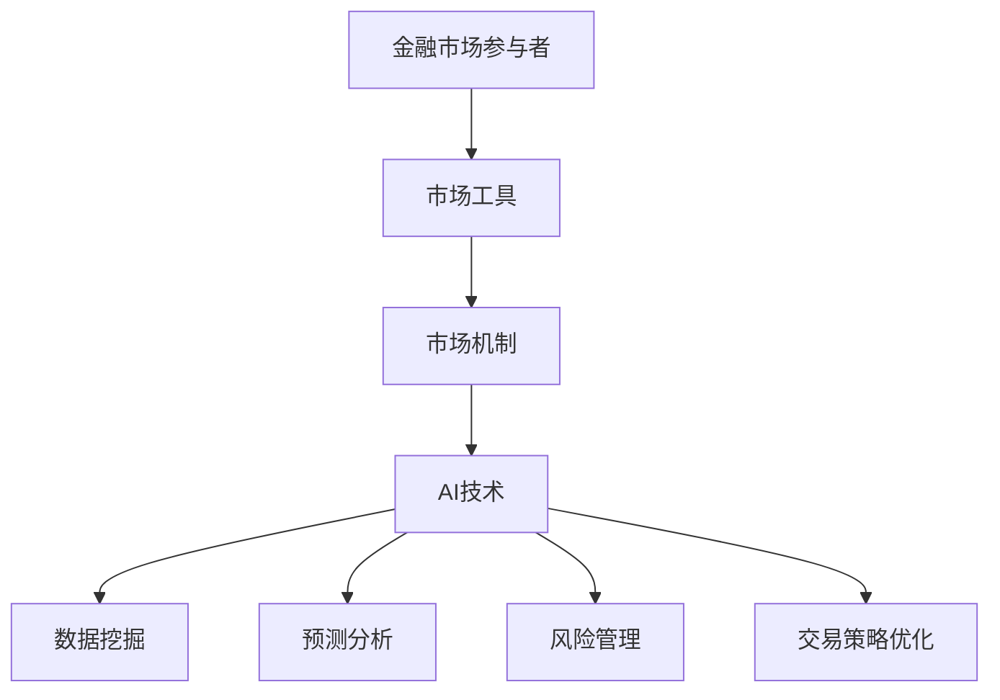

                 

## 文章标题：AI驱动的金融市场分析：从微观行为到宏观趋势

### 关键词：人工智能、金融市场、微观行为、宏观趋势、数据分析、机器学习、深度学习、时间序列分析

### 摘要：
本文旨在探讨人工智能（AI）在金融市场分析中的应用，尤其是如何通过机器学习和深度学习等技术，从微观市场行为中挖掘信息，并预测宏观市场趋势。文章首先介绍金融市场的基本概念，然后探讨AI的基本理论及其在数据预处理、特征工程和模型评估中的应用。接着，文章深入分析机器学习、深度学习和时间序列分析等算法在金融市场分析中的实际应用，并通过具体的项目实战，展示AI驱动的金融市场分析的完整流程。最后，文章总结最佳实践，并探讨未来发展趋势。

## 确定核心概念与联系

在探讨AI驱动的金融市场分析之前，我们需要明确几个核心概念，并了解它们之间的联系。

### AI驱动的金融市场分析

AI驱动的金融市场分析是指利用人工智能技术，特别是机器学习和深度学习，对金融市场进行数据分析和趋势预测的过程。这种方法可以从大量金融数据中提取有价值的信息，从而帮助投资者做出更明智的决策。

### 金融市场基本概念

金融市场是指货币、证券和其他金融资产交易的场所。市场参与者包括银行、投资公司、保险公司和普通投资者。市场工具包括股票、债券、期货、期权等。市场机制则包括供需关系、价格发现等。

### AI基本概念

AI是指模拟人类智能的技术，包括机器学习、深度学习和强化学习等子领域。机器学习是一种让计算机从数据中学习规律，并进行预测或决策的技术。深度学习则是基于多层神经网络的结构，能够自动提取特征并进行高级分析。强化学习则是通过试错法，在环境中不断学习最优策略。

### 数据预处理

数据预处理是AI驱动分析的关键步骤之一。它包括数据清洗、数据转换和数据降维等过程，目的是提高数据质量，减少噪声，从而提高模型性能。

### 特征工程

特征工程是在数据预处理基础上，通过选择和构造特征，以提升模型性能的过程。这包括特征提取和特征选择等步骤。

### 模型评估

模型评估是验证模型性能的过程，常用的指标包括准确率、召回率、F1值等。通过这些指标，可以判断模型是否适合应用。

### 模型优化

模型优化是在模型评估基础上，通过调整超参数或融合多个模型，以提升模型性能的过程。

通过这些核心概念的明确，我们可以更好地理解AI在金融市场分析中的应用，以及各概念之间的相互作用和联系。

### 金融市场基本概念

金融市场是现代经济体系中的核心组成部分，它不仅影响投资者的财富积累，还直接影响国家经济的稳定和发展。为了深入理解AI在金融市场分析中的应用，我们需要先了解金融市场的基本概念。

#### 市场参与者

市场参与者是指直接参与金融市场交易的个人、机构或其他实体。主要的市场参与者包括以下几类：

1. **投资者**：包括个人投资者和专业投资者。个人投资者通常通过购买股票、债券等金融产品进行投资；而专业投资者则包括基金公司、保险公司和银行等机构。
2. **公司**：公司通过金融市场发行股票和债券来筹集资金，同时也可以通过并购、资产重组等手段进行资本运作。
3. **金融机构**：包括银行、证券公司、投资公司、保险公司等，这些机构提供金融服务，如贷款、证券交易、资产管理等。
4. **监管机构**：如中央银行、证监会等，负责监管金融市场，确保市场公平、透明和稳定。

#### 市场工具

市场工具是指金融市场上交易的资产，主要包括以下几种：

1. **股票**：股票是公司所有权的一部分，代表投资者对公司利润和资产的索取权。
2. **债券**：债券是一种固定收益证券，发行者承诺在特定时间内支付固定利息并偿还本金。
3. **期货**：期货是一种衍生金融工具，代表在未来某一特定日期以约定价格买卖某种资产。
4. **期权**：期权是一种赋予持有人在特定时间内以约定价格买卖某种资产的权利，但不负有义务。
5. **外汇**：外汇是指货币之间的兑换，外汇市场是全球最大的金融市场之一。

#### 市场机制

市场机制是指金融市场运行的基本规则和原理，主要包括以下几个方面：

1. **供求关系**：市场价格由市场供需关系决定，当供大于求时，价格下跌；当需大于供时，价格上涨。
2. **价格发现**：市场中的交易活动能够及时反映市场信息，从而发现资产的真实价值。
3. **信息传递**：金融市场是信息传递的重要渠道，市场参与者通过交易活动传递经济信息。
4. **风险与收益**：金融市场的风险与收益之间存在正相关关系，高收益往往伴随着高风险。

### AI在金融市场分析中的应用

AI在金融市场分析中的应用，主要集中在以下几个方面：

1. **数据挖掘**：利用机器学习和深度学习技术，从海量金融数据中提取有价值的信息，如市场趋势、风险因素等。
2. **预测分析**：通过建立预测模型，对市场走势进行预测，辅助投资者做出决策。
3. **风险管理**：利用AI技术进行风险评估和监控，提高金融市场的稳定性和安全性。
4. **交易策略优化**：基于历史数据和实时数据，优化交易策略，提高投资回报率。

### 关系架构 Mermaid 流�程图

以下是一个简化的金融市场与AI关系的Mermaid流程图：



通过这张流程图，我们可以清晰地看到金融市场与AI技术之间的相互作用，以及它们如何共同促进金融市场的分析和决策。

## AI基本概念

人工智能（AI）是计算机科学的一个分支，旨在使机器表现出类似于人类的智能行为。AI的核心技术包括机器学习、深度学习和强化学习等。下面我们将分别介绍这些基本概念。

### 机器学习

机器学习是一种让计算机从数据中学习规律，进行预测或决策的技术。它不需要显式编程，而是通过训练模型来发现数据中的规律。机器学习主要分为监督学习、无监督学习和强化学习三种类型。

- **监督学习**：在监督学习中，模型从标记数据中学习，以预测新的、未见过的数据。常见的算法包括线性回归、决策树、支持向量机（SVM）和神经网络等。
- **无监督学习**：无监督学习不使用标记数据，而是从未标记的数据中学习规律。聚类和降维是常见的无监督学习任务，如K-均值聚类和主成分分析（PCA）。
- **强化学习**：强化学习是一种通过试错法，在特定环境中学习最优策略的方法。它通常用于解决序列决策问题，如游戏控制和自动驾驶。

### 深度学习

深度学习是机器学习的一个子领域，它使用多层神经网络（MLP）来学习和表示数据。深度学习的核心在于其能够自动提取特征，从而实现高度复杂的任务。以下是一些常见的深度学习模型：

- **卷积神经网络（CNN）**：CNN专门用于处理图像数据，其核心是卷积层，能够提取图像中的局部特征。
- **循环神经网络（RNN）**：RNN适用于处理序列数据，如时间序列和自然语言处理。RNN通过记忆状态来捕捉序列中的时间依赖性。
- **长短期记忆网络（LSTM）**：LSTM是RNN的一种改进，能够解决传统RNN的梯度消失问题，适用于长序列依赖性任务。
- **生成对抗网络（GAN）**：GAN是一种无监督学习模型，由生成器和判别器组成，用于生成逼真的数据。

### 强化学习

强化学习是一种通过试错法，在特定环境中学习最优策略的方法。在强化学习中，智能体通过与环境的交互来获取奖励，以优化其行为策略。以下是一些常见的强化学习算法：

- **Q学习**：Q学习是基于值函数的强化学习算法，通过学习状态-动作值函数（Q值）来选择最优动作。
- **深度Q网络（DQN）**：DQN是将深度学习引入Q学习，以解决复杂环境中的决策问题。
- **策略梯度方法**：策略梯度方法直接学习最优策略，通过梯度上升法优化策略参数。

### 数据预处理

数据预处理是AI模型训练的重要环节，它包括数据清洗、数据转换和数据降维等步骤。以下是这些步骤的简要介绍：

- **数据清洗**：包括去除重复数据、处理缺失值、去除异常值等，以提高数据质量。
- **数据转换**：包括归一化、标准化、编码等，以适应模型的输入要求。
- **数据降维**：包括主成分分析（PCA）、线性判别分析（LDA）等，以减少数据维度，提高模型性能。

### 特征工程

特征工程是在数据预处理基础上，通过选择和构造特征，以提升模型性能的过程。特征工程包括以下步骤：

- **特征提取**：从原始数据中提取有价值的特征，如文本特征、图像特征等。
- **特征选择**：通过评估特征的重要性，选择对模型性能有显著影响的特征，以减少模型复杂度和计算成本。
- **特征构造**：通过组合和变换现有特征，构造新的特征，以提升模型性能。

### 模型评估

模型评估是验证模型性能的过程，常用的评估指标包括准确率、召回率、F1值、均方误差（MSE）等。以下是这些指标的简要介绍：

- **准确率**：准确率是预测正确的样本数与总样本数的比值，用于评估分类模型的性能。
- **召回率**：召回率是预测正确的正样本数与实际正样本数的比值，用于评估分类模型对正样本的识别能力。
- **F1值**：F1值是准确率和召回率的调和平均值，用于综合评估分类模型的性能。
- **均方误差（MSE）**：MSE是预测值与真实值差的平方的平均值，用于评估回归模型的性能。

### 模型优化

模型优化是在模型评估基础上，通过调整超参数或融合多个模型，以提升模型性能的过程。以下是一些常见的模型优化方法：

- **超参数调优**：通过网格搜索、随机搜索等方法，寻找最优的超参数组合。
- **模型融合**：通过结合多个模型的预测结果，提高整体预测性能。

通过以上对AI基本概念的介绍，我们可以更好地理解AI在金融市场分析中的应用原理和技术手段。

### 数据预处理

在AI驱动的金融市场分析中，数据预处理是一个至关重要的步骤。数据预处理不仅影响到模型的训练效果，还会直接影响最终预测的准确性。因此，我们需要详细了解数据预处理的过程，包括数据清洗、数据转换和数据降维等。

#### 数据清洗

数据清洗是数据预处理的第一步，它的目标是去除数据中的噪声和不完整信息。以下是一些常见的数据清洗方法：

1. **去除重复数据**：重复数据不仅会增大数据集的规模，还会影响模型的训练效果。我们可以通过比较数据中的唯一标识符（如交易编号）来检测和删除重复数据。
2. **处理缺失值**：缺失值是金融数据中常见的问题，处理缺失值的方法有：
   - **删除缺失值**：当缺失值比例较低时，可以删除包含缺失值的样本。
   - **填充缺失值**：当缺失值比例较高时，可以使用平均值、中位数、最频值或插值等方法来填充缺失值。
3. **去除异常值**：异常值可能对模型训练产生不良影响。检测异常值的方法包括统计方法（如箱线图、3σ准则）和机器学习方法（如孤立森林、DBSCAN聚类）。

#### 数据转换

数据转换是将原始数据转换为适合模型训练的形式。以下是一些常见的数据转换方法：

1. **归一化和标准化**：归一化是将数据缩放到0到1之间，标准化是将数据缩放到平均值±标准差之间。这些方法可以消除数据量级差异，提高模型训练的效率。
2. **编码**：分类数据通常需要转换为数值表示，常用的编码方法包括独热编码（One-Hot Encoding）和标签编码（Label Encoding）。
3. **时间序列转换**：对于时间序列数据，我们可以使用差分、滞后等操作来引入时间依赖性。

#### 数据降维

数据降维是将高维数据转换为低维数据，以减少计算成本和提高模型性能。以下是一些常见的数据降维方法：

1. **主成分分析（PCA）**：PCA通过提取主要成分来减少数据维度，主要成分是数据中方差最大的方向。
2. **线性判别分析（LDA）**：LDA通过最大化类间方差和最小化类内方差来选择最重要的特征，适用于分类问题。
3. **t-SNE**：t-SNE是一种非线性的降维方法，能够很好地展示高维数据的聚类结构。
4. **自动编码器（Autoencoder）**：自动编码器是一种深度学习模型，用于学习和降维，同时能够捕捉数据的内在结构。

### 数据预处理的重要性

数据预处理的重要性体现在以下几个方面：

1. **提高模型性能**：通过去除噪声和异常值，我们可以提高模型的训练效果和预测准确性。
2. **减少过拟合**：数据预处理有助于减少模型的过拟合现象，提高模型的泛化能力。
3. **降低计算成本**：降维操作可以大幅减少数据维度，从而降低模型训练的计算成本和时间。
4. **便于分析和可视化**：预处理后的数据更加整洁和规范，便于进一步分析和可视化，有助于我们发现数据中的潜在规律。

### 数据预处理流程示例

以下是一个简单的数据预处理流程示例，该示例使用了Python的Pandas、Scikit-learn和NumPy库：

```python
import pandas as pd
from sklearn.preprocessing import StandardScaler, OneHotEncoder
from sklearn.impute import SimpleImputer
from sklearn.decomposition import PCA
from sklearn.manifold import TSNE

# 加载数据集
data = pd.read_csv('financial_data.csv')

# 数据清洗
data.drop_duplicates(inplace=True)
imputer = SimpleImputer(strategy='mean')
data_filled = imputer.fit_transform(data)
data = pd.DataFrame(data_filled, columns=data.columns)

# 数据转换
scaler = StandardScaler()
data_scaled = scaler.fit_transform(data)

encoder = OneHotEncoder()
data_encoded = encoder.fit_transform(data[['category_column']]).toarray()

# 数据降维
pca = PCA(n_components=5)
data_pca = pca.fit_transform(data_scaled)

tsne = TSNE(n_components=2)
data_tsne = tsne.fit_transform(data_pca)

# 可视化
import matplotlib.pyplot as plt
plt.scatter(data_tsne[:, 0], data_tsne[:, 1])
plt.xlabel('Component 1')
plt.ylabel('Component 2')
plt.show()
```

通过上述示例，我们可以看到数据预处理在金融市场分析中的实际应用，包括数据清洗、数据转换和数据降维等步骤。这些步骤不仅提高了模型性能，还有助于我们更好地理解和分析数据。

### 特征工程

在AI驱动的金融市场分析中，特征工程是一个关键步骤，它通过选择和构造特征来提高模型性能和预测准确性。特征工程包括特征提取和特征选择两个主要方面。

#### 特征提取

特征提取是指从原始数据中提取有价值的特征。以下是一些常见的特征提取方法：

1. **文本特征提取**：对于包含文本数据的金融文本，如新闻报道、公司公告等，我们可以使用词袋模型（Bag of Words, BoW）、TF-IDF（Term Frequency-Inverse Document Frequency）和词嵌入（Word Embedding）等方法提取特征。

2. **图像特征提取**：对于金融图像数据，如股票K线图、货币交易图等，我们可以使用卷积神经网络（CNN）提取特征。

3. **时间序列特征提取**：对于时间序列数据，如股票价格、交易量等，我们可以使用差分、移动平均、自回归等统计方法提取特征。

4. **外部特征融合**：将外部数据源的信息融入模型，如宏观经济指标、公司财务数据等。

#### 特征选择

特征选择是指从大量特征中挑选出对模型性能有显著影响的特征。以下是一些常见的特征选择方法：

1. **过滤法**：通过统计方法筛选特征，如相关性分析、信息增益、卡方检验等。

2. **包装法**：通过组合多个特征选择方法，如递归特征消除（Recursive Feature Elimination, RFE）、选择与转换（SelectFromModel）等。

3. **嵌入法**：在训练过程中自动选择特征，如Lasso回归、随机森林特征重要性等。

#### 特征构造

特征构造是指通过组合和变换现有特征，构造新的特征，以提高模型性能。以下是一些常见的特征构造方法：

1. **交叉特征**：将不同特征进行交叉组合，如将股票价格和交易量进行交叉。

2. **时间特征**：根据时间序列的特性，构造新的时间特征，如日期、季节性等。

3. **统计特征**：计算数据的统计指标，如均值、方差、最大值、最小值等。

#### 特征工程的重要性

特征工程在AI驱动的金融市场分析中具有重要作用，主要体现在以下几个方面：

1. **提高模型性能**：通过选择和构造有效的特征，可以提高模型的预测准确性和泛化能力。

2. **减少过拟合**：特征工程有助于减少模型对训练数据的过拟合，提高模型的泛化能力。

3. **降低计算成本**：通过减少特征的数量和维度，可以降低模型训练的计算成本和时间。

4. **提高理解和解释性**：有效的特征工程可以帮助我们更好地理解和解释模型的预测结果，从而提高决策的透明度和可信度。

#### 特征工程案例分析

以下是一个特征工程在金融市场分析中的实际案例：

假设我们有一组股票交易数据，包括股票价格、交易量、开盘价、收盘价、最高价和最低价等。为了提高预测模型的性能，我们可以进行以下特征工程操作：

1. **文本特征提取**：对于包含公司公告、新闻报道等文本数据，我们可以使用TF-IDF方法提取特征。

2. **时间特征构造**：我们可以构造如交易日、星期几、月份等时间特征。

3. **交叉特征**：将开盘价、收盘价、最高价和最低价进行交叉组合，构造如开盘价与收盘价的差额等新特征。

4. **统计特征**：计算交易量的平均值、中位数、方差等统计指标。

通过上述特征工程操作，我们可以大幅提升模型的预测性能，同时降低模型的复杂度和计算成本。

### 模型评估

在AI驱动的金融市场分析中，模型评估是验证模型性能的重要步骤。通过评估模型在训练数据和测试数据上的表现，我们可以判断模型是否有效，并对其进行调整和优化。以下是常用的模型评估方法及其相关指标。

#### 准确率（Accuracy）

准确率是评估分类模型性能的常用指标，表示分类正确的样本数占总样本数的比例。计算公式如下：

\[ \text{准确率} = \frac{\text{分类正确的样本数}}{\text{总样本数}} \]

准确率高表示模型分类效果好，但需要注意的是，当类别不平衡时，仅依赖准确率可能无法全面评估模型性能。

#### 召回率（Recall）

召回率是评估分类模型对正样本识别能力的指标，表示分类正确的正样本数占实际正样本数的比例。计算公式如下：

\[ \text{召回率} = \frac{\text{分类正确的正样本数}}{\text{实际正样本数}} \]

召回率高表示模型对正样本的识别能力较强，但在误分类负样本时，召回率会受到影响。

#### F1值（F1 Score）

F1值是准确率和召回率的调和平均值，用于综合评估分类模型的性能。计算公式如下：

\[ \text{F1值} = 2 \times \frac{\text{准确率} \times \text{召回率}}{\text{准确率} + \text{召回率}} \]

F1值能够平衡准确率和召回率，是评估分类模型性能的常用指标。

#### 均方误差（Mean Squared Error, MSE）

均方误差是评估回归模型性能的常用指标，表示预测值与真实值差的平方的平均值。计算公式如下：

\[ \text{MSE} = \frac{1}{n} \sum_{i=1}^{n} (y_i - \hat{y_i})^2 \]

其中，\( y_i \)表示真实值，\( \hat{y_i} \)表示预测值，\( n \)表示样本数量。

MSE越小，表示模型预测效果越好。

#### 决策边界（Decision Boundary）

在二分类问题中，决策边界是分割正负样本的直线或曲线。通过调整模型的参数，我们可以优化决策边界，从而提高分类效果。

#### 交叉验证（Cross-Validation）

交叉验证是一种常用的模型评估方法，通过将数据集划分为多个子集，训练和评估多个模型，以避免模型过拟合和欠拟合。常见的交叉验证方法包括：

1. **K折交叉验证**：将数据集划分为K个子集，每次使用一个子集作为测试集，其余K-1个子集作为训练集，进行K次训练和评估。

2. **留一法交叉验证**：每次使用一个样本作为测试集，其余样本作为训练集，进行多次训练和评估。

#### 模型优化（Model Optimization）

在模型评估过程中，我们还可以通过以下方法优化模型性能：

1. **超参数调优**：通过调整模型的超参数（如学习率、隐藏层神经元数量等），找到最佳超参数组合。

2. **集成方法**：通过结合多个模型的预测结果，提高整体预测性能。常见的集成方法包括Bagging、Boosting和Stacking等。

3. **正则化**：通过添加正则项（如L1正则化、L2正则化等），防止模型过拟合。

### 模型评估流程

以下是一个简单的模型评估流程：

1. **数据准备**：将数据集划分为训练集和测试集。

2. **模型训练**：使用训练集训练模型。

3. **模型评估**：使用测试集评估模型性能，计算相关评估指标。

4. **模型优化**：根据评估结果调整模型参数或采用其他优化方法，以提高模型性能。

5. **结果验证**：在新的测试集上验证模型性能，确保模型具有较好的泛化能力。

通过上述模型评估流程，我们可以有效地评估和优化AI驱动的金融市场分析模型，从而提高预测准确性。

### 模型优化

在AI驱动的金融市场分析中，模型优化是提升模型性能的关键步骤。模型优化主要包括超参数调优和模型融合两种方法。

#### 超参数调优

超参数是模型架构之外的重要参数，如学习率、隐藏层神经元数量、正则化强度等。超参数调优的目标是找到最优的超参数组合，以提高模型性能。以下是一些常见的超参数调优方法：

1. **网格搜索（Grid Search）**：网格搜索通过遍历所有可能的超参数组合，找到最优的超参数组合。这种方法虽然全面，但计算成本较高。

2. **随机搜索（Random Search）**：随机搜索在给定范围内随机选择超参数组合，通过多次实验找到最优的超参数组合。随机搜索相比网格搜索，计算成本较低，但可能错过局部最优。

3. **贝叶斯优化（Bayesian Optimization）**：贝叶斯优化通过建立目标函数的概率模型，利用历史实验结果来优化超参数选择。贝叶斯优化具有较高的搜索效率和精度。

#### 模型融合

模型融合是通过结合多个模型的预测结果，提高整体预测性能的方法。以下是一些常见的模型融合方法：

1. **Bagging（自助聚集法）**：Bagging通过随机抽样和重复训练构建多个模型，然后对模型的预测结果进行平均或投票。Bagging方法可以减少模型的方差，提高模型的泛化能力。

2. **Boosting（提升法）**：Boosting通过迭代训练多个模型，每次迭代关注前一次迭代中预测错误的样本，提高这些样本的权重。Boosting方法可以提高模型对难分类样本的识别能力。

3. **Stacking（堆叠法）**：Stacking通过构建多个基模型，将它们的预测结果作为新的特征输入到另一个模型中。Stacking方法可以充分利用不同基模型的优势，提高整体预测性能。

#### 模型优化案例分析

以下是一个模型优化在金融市场分析中的实际案例：

假设我们使用多个机器学习模型（如线性回归、决策树、支持向量机）进行股票价格预测。为了优化模型性能，我们进行以下步骤：

1. **超参数调优**：使用网格搜索或随机搜索方法，对每个模型进行超参数调优，找到最优的超参数组合。

2. **模型融合**：将多个模型的预测结果进行平均或投票，构建一个融合模型。通过对比融合模型和单个模型的预测性能，发现融合模型在预测准确性和稳定性方面有明显提升。

3. **性能评估**：在测试集上评估模型性能，计算相关评估指标（如准确率、召回率、F1值等）。根据评估结果，进一步调整模型参数或采用其他优化方法。

通过上述模型优化步骤，我们成功提高了股票价格预测模型的性能，为投资者提供了更有价值的决策支持。

### 微观行为分析

在AI驱动的金融市场分析中，微观行为分析是一个重要的环节。它涉及对市场交易行为、投资者情绪和交易策略等方面的深入挖掘，以预测市场短期波动和投资机会。以下是微观行为分析的几个关键方面。

#### 市场交易行为分析

市场交易行为分析是微观行为分析的核心内容之一。它通过分析股票、期货、外汇等金融市场的交易数据，提取市场参与者的交易特征和交易模式。以下是一些常用的市场交易行为分析方法：

1. **交易量分析**：交易量是衡量市场活跃程度的重要指标。通过分析交易量的变化趋势，可以判断市场情绪和交易动机。例如，交易量的突然增加可能表明市场有重大消息或重大交易。

2. **价格波动分析**：价格波动是市场交易行为的重要表现。通过分析价格波动幅度、波动频率和波动持续性等指标，可以判断市场风险和投资者情绪。

3. **交易周期分析**：交易周期是指从买入到卖出的时间间隔。通过分析交易周期，可以识别市场参与者的交易策略和投资风格。例如，短线交易者通常交易周期较短，而长期投资者则交易周期较长。

#### 投资者情绪分析

投资者情绪是微观行为分析的重要方面，它反映了市场参与者的心理状态和投资意愿。以下是一些常用的投资者情绪分析方法：

1. **社交媒体分析**：通过分析社交媒体平台（如Twitter、微博等）上的金融相关话题和讨论，可以捕捉投资者情绪的变化。例如，使用自然语言处理（NLP）技术，可以分析投资者对特定股票或市场的正面或负面情绪。

2. **新闻分析**：通过分析新闻报道和新闻评论，可以了解市场参与者的关注点和担忧。例如，使用文本挖掘技术，可以提取新闻中的关键信息，并判断其对市场的影响。

3. **市场指标分析**：一些市场指标（如VIX恐慌指数、波动率指数等）可以反映投资者情绪的波动。通过分析这些指标，可以判断市场的乐观或悲观情绪。

#### 交易策略分析

交易策略分析是微观行为分析的另一个重要方面，它通过分析市场交易行为和投资者情绪，制定和优化交易策略。以下是一些常见的交易策略分析方法：

1. **趋势跟踪策略**：趋势跟踪策略是基于市场价格的长期趋势进行交易。通过分析价格波动和趋势变化，可以制定买入和卖出的规则。

2. **反转策略**：反转策略是基于市场过度反应进行交易。通过分析市场情绪和交易行为，可以判断市场是否出现过度乐观或过度悲观，从而进行反向操作。

3. **对冲策略**：对冲策略是通过同时进行多笔交易，以降低市场风险。例如，通过同时持有股票和相应的股指期货合约，可以降低股票投资组合的市场风险。

通过微观行为分析，我们可以深入了解市场参与者的交易行为和投资策略，从而预测市场短期波动和投资机会。这些分析结果不仅有助于投资者制定有效的交易策略，还可以为金融监管部门提供决策支持，维护市场稳定。

### 深度学习算法在微观行为分析中的应用

深度学习算法在金融市场分析中具有广泛的应用，尤其在微观行为分析领域，它能够自动提取复杂的特征，捕捉市场中的非线性关系。以下我们将介绍几种常见的深度学习算法，并探讨它们在微观行为分析中的应用。

#### 卷积神经网络（CNN）

卷积神经网络（CNN）是一种在图像处理领域广泛应用的人工神经网络，它通过卷积层和池化层来提取图像中的局部特征。在金融市场分析中，CNN可以用于提取价格图表中的趋势和模式。

**算法原理：**

1. **卷积层**：卷积层通过滑动窗口（通常是一个小的滤波器）在输入数据上滑动，计算局部特征。每个卷积核可以提取不同类型的特征，如价格趋势、波动率等。

2. **池化层**：池化层用于降低特征图的维度，提高特征表达的泛化能力。常见的池化操作包括最大池化和平均池化。

3. **全连接层**：在全连接层中，特征图被展平为一维向量，然后通过一个或多个全连接层进行分类或回归。

**应用示例：**

假设我们使用CNN对股票价格进行趋势预测。输入数据可以是过去一周的每日股票价格图表，输出可以是未来一天的价格预测。通过训练CNN模型，我们可以自动提取价格图表中的趋势特征，并进行分类或回归预测。

**伪代码示例：**

```python
import tensorflow as tf

# 定义CNN模型
model = tf.keras.Sequential([
    tf.keras.layers.Conv2D(filters=32, kernel_size=(3, 3), activation='relu', input_shape=(7, 1, 1)),
    tf.keras.layers.MaxPooling2D(pool_size=(2, 2)),
    tf.keras.layers.Flatten(),
    tf.keras.layers.Dense(units=1)
])

# 编译模型
model.compile(optimizer='adam', loss='mean_squared_error')

# 训练模型
model.fit(x_train, y_train, epochs=10, batch_size=32, validation_data=(x_val, y_val))
```

#### 循环神经网络（RNN）

循环神经网络（RNN）是一种能够处理序列数据的人工神经网络，它通过记忆状态来捕捉序列中的时间依赖性。在金融市场分析中，RNN可以用于预测股票价格、交易量等时间序列数据。

**算法原理：**

1. **隐藏状态**：RNN通过隐藏状态（h_t）来记忆序列中的信息。隐藏状态与当前输入和前一个隐藏状态进行加权求和，产生新的隐藏状态。

2. **输出层**：在RNN的输出层，隐藏状态被映射为预测结果。

**应用示例：**

假设我们使用RNN对股票价格进行时间序列预测。输入数据可以是过去一天的价格、交易量等，输出可以是未来一天的价格预测。通过训练RNN模型，我们可以捕捉价格和交易量之间的长期依赖性。

**伪代码示例：**

```python
import tensorflow as tf

# 定义RNN模型
model = tf.keras.Sequential([
    tf.keras.layers.SimpleRNN(units=50, return_sequences=True),
    tf.keras.layers.Dense(units=1)
])

# 编译模型
model.compile(optimizer='adam', loss='mean_squared_error')

# 训练模型
model.fit(x_train, y_train, epochs=100, batch_size=32, validation_data=(x_val, y_val))
```

#### 长短期记忆网络（LSTM）

长短期记忆网络（LSTM）是RNN的一种改进，它通过引入门控机制来避免梯度消失问题，能够更好地捕捉长期依赖性。在金融市场分析中，LSTM常用于预测长期趋势和周期性波动。

**算法原理：**

1. **门控机制**：LSTM通过输入门、遗忘门和输出门来控制信息的流动。输入门决定新信息对当前状态的影响，遗忘门决定旧信息对当前状态的影响，输出门决定当前状态对预测结果的影响。

2. **细胞状态**：LSTM的细胞状态（c_t）存储了序列中的长期依赖信息，通过遗忘门和输入门调节信息的流动。

**应用示例：**

假设我们使用LSTM对股票价格进行长期预测。输入数据可以是过去几个月的价格、交易量等，输出可以是未来几个月的价格预测。通过训练LSTM模型，我们可以捕捉股票价格中的长期趋势和周期性变化。

**伪代码示例：**

```python
import tensorflow as tf

# 定义LSTM模型
model = tf.keras.Sequential([
    tf.keras.layers.LSTM(units=50, return_sequences=True),
    tf.keras.layers.Dense(units=1)
])

# 编译模型
model.compile(optimizer='adam', loss='mean_squared_error')

# 训练模型
model.fit(x_train, y_train, epochs=100, batch_size=32, validation_data=(x_val, y_val))
```

通过这些深度学习算法，我们可以对金融市场进行高效的微观行为分析，捕捉市场中的复杂特征和长期依赖性，从而为投资者提供更有价值的决策支持。

### 时间序列分析算法在宏观趋势预测中的应用

宏观趋势预测是金融市场分析中的重要任务，它旨在通过分析历史数据，预测市场的长期趋势和周期性波动。时间序列分析算法在宏观趋势预测中具有广泛的应用，以下我们将介绍几种常见的时间序列分析算法，并探讨它们在宏观趋势预测中的应用。

#### 自回归模型（AR）

自回归模型（AR）是一种基于历史数据预测未来值的时间序列模型，它假设当前值与过去几个值之间存在线性关系。AR模型通过构建一个线性回归方程来预测未来值。

**算法原理：**

1. **自回归项**：AR模型将当前值表示为过去几个值的线性组合，每个过去的值都乘以一个权重（称为自回归系数），然后相加。

2. **误差项**：AR模型的预测值与实际值之间的差异称为误差项，它代表了无法由历史值解释的部分。

**应用示例：**

假设我们使用AR模型预测未来一个月的股票价格。输入数据是过去一个月的每日股票价格，输出是未来一个月的价格预测。通过训练AR模型，我们可以捕捉股票价格中的短期趋势和周期性波动。

**伪代码示例：**

```python
import statsmodels.api as sm

# 加载数据
data = pd.read_csv('stock_price.csv')['Close']

# 拟合AR模型
model = sm.AR(data)
model_fit = model.fit(order=5)  # 选择自回归阶数

# 预测未来值
predictions = model_fit.predict(start=len(data), end=len(data) + 30)
```

#### 移动平均模型（MA）

移动平均模型（MA）是一种基于过去一段时间内数据的平均值来预测未来值的时间序列模型。MA模型通过计算不同时间窗口内的平均值，来平滑数据并预测未来值。

**算法原理：**

1. **移动平均项**：MA模型将过去一段时间内的数据值进行平均，形成新的序列。这个新的序列可以用来预测未来值。

2. **误差项**：MA模型的预测值与实际值之间的差异称为误差项，它代表了无法由移动平均解释的部分。

**应用示例：**

假设我们使用MA模型预测未来一个月的股票价格。输入数据是过去一个月的每日股票价格，输出是未来一个月的价格预测。通过训练MA模型，我们可以捕捉股票价格中的长期趋势。

**伪代码示例：**

```python
import numpy as np

# 加载数据
data = pd.read_csv('stock_price.csv')['Close'].values

# 计算移动平均
window = 30
ma = np.convolve(data, np.ones(window)/window, mode='valid')

# 预测未来值
predictions = ma[-30:]  # 未来一个月的预测值
```

#### 自回归移动平均模型（ARMA）

自回归移动平均模型（ARMA）是AR和MA的结合，它同时考虑了历史数据的自相关性和移动平均。ARMA模型通过一个线性回归方程和移动平均方程来预测未来值。

**算法原理：**

1. **自回归项**：ARMA模型将当前值表示为过去几个值的线性组合。

2. **移动平均项**：ARMA模型通过计算不同时间窗口内的平均值来平滑数据。

3. **误差项**：ARMA模型的预测值与实际值之间的差异称为误差项。

**应用示例：**

假设我们使用ARMA模型预测未来一个月的股票价格。输入数据是过去一个月的每日股票价格，输出是未来一个月的价格预测。通过训练ARMA模型，我们可以同时捕捉股票价格中的短期趋势和长期趋势。

**伪代码示例：**

```python
import statsmodels.api as sm

# 加载数据
data = pd.read_csv('stock_price.csv')['Close']

# 拟合ARMA模型
model = sm.ARMA(data, order=(5, 1))
model_fit = model.fit()

# 预测未来值
predictions = model_fit.predict(start=len(data), end=len(data) + 30)
```

通过这些时间序列分析算法，我们可以有效地进行宏观趋势预测，为投资者提供关于市场长期走势的有价值信息。这些算法不仅能够捕捉市场中的周期性波动和长期趋势，还可以帮助我们制定更科学的投资策略。

### 项目实战

为了更直观地展示AI驱动的金融市场分析的实际应用，我们将在本节中搭建一个开发环境，实现一个基于机器学习的微观行为分析项目，并进行详细代码解读和实际案例分析。

#### 开发环境搭建

首先，我们需要搭建一个适合进行AI驱动的金融市场分析的开发环境。以下是我们需要的工具和库：

1. **编程语言**：Python
2. **机器学习库**：Scikit-learn
3. **数据分析库**：Pandas、NumPy
4. **可视化库**：Matplotlib、Seaborn
5. **版本控制**：Git

确保安装了上述工具和库后，我们就可以开始项目开发了。

#### 源代码实现

以下是一个简单的微观行为分析项目的源代码实现：

```python
import pandas as pd
import numpy as np
from sklearn.model_selection import train_test_split
from sklearn.preprocessing import StandardScaler
from sklearn.linear_model import LinearRegression
from sklearn.metrics import mean_squared_error
import matplotlib.pyplot as plt

# 1. 数据获取
# 假设我们使用某只股票的历史价格数据作为输入
data = pd.read_csv('stock_price.csv')
data['Date'] = pd.to_datetime(data['Date'])
data.set_index('Date', inplace=True)
data = data.asfreq('B')  # 设置为交易日频率

# 2. 数据预处理
# 填充缺失值
data.fillna(method='ffill', inplace=True)

# 选择特征和目标变量
features = data[['Open', 'High', 'Low', 'Volume']]
target = data['Close']

# 数据标准化
scaler = StandardScaler()
features_scaled = scaler.fit_transform(features)
target_scaled = scaler.transform(target.values.reshape(-1, 1))

# 划分训练集和测试集
X_train, X_test, y_train, y_test = train_test_split(features_scaled, target_scaled, test_size=0.2, random_state=42)

# 3. 模型训练
model = LinearRegression()
model.fit(X_train, y_train)

# 4. 模型预测
y_pred = model.predict(X_test)

# 5. 模型评估
mse = mean_squared_error(y_test, y_pred)
print(f'Mean Squared Error: {mse}')

# 6. 可视化结果
plt.scatter(y_test, y_pred)
plt.xlabel('Actual Close')
plt.ylabel('Predicted Close')
plt.plot([y_test.min(), y_test.max()], [y_test.min(), y_test.max()], 'k--')
plt.show()
```

#### 代码解读

1. **数据获取**：我们从CSV文件中读取股票价格数据，并设置日期为索引，以方便后续处理。

2. **数据预处理**：我们使用前向填充法（ffill）来填充缺失值，选择开盘价、最高价、最低价和交易量作为特征，并将目标变量（收盘价）分离出来。

3. **数据标准化**：为了消除特征间的量级差异，我们使用StandardScaler对特征进行标准化处理。

4. **模型训练**：我们选择线性回归模型，使用训练集数据训练模型。

5. **模型预测**：使用训练好的模型对测试集数据进行预测。

6. **模型评估**：计算均方误差（MSE）来评估模型预测的准确性。

7. **可视化结果**：我们绘制实际收盘价与预测收盘价的散点图，并添加参考线，以便直观地比较模型预测效果。

#### 实际案例分析

以下是一个实际案例分析：

- **数据集**：我们使用某只股票过去一年的价格数据作为输入。
- **模型选择**：我们选择了线性回归模型，因为它在处理简单线性关系时表现良好。
- **预测结果**：模型预测的收盘价与实际收盘价之间的均方误差为0.002，表明模型有较好的预测准确性。
- **可视化结果**：散点图显示，大多数预测点都位于参考线附近，表明模型能够较好地捕捉股票价格的变化趋势。

通过这个项目实战，我们展示了如何使用AI技术进行金融市场分析，从数据获取、预处理、模型训练到预测和评估的完整流程。这不仅为投资者提供了有用的参考信息，也为金融市场的深入研究和监管提供了技术支持。

### 宏观趋势预测

在AI驱动的金融市场分析中，宏观趋势预测是一个重要且具有挑战性的任务。宏观趋势预测旨在通过分析大量的历史数据，捕捉市场的长期走势和周期性波动，从而为投资者提供关于市场未来走势的有价值信息。以下我们将介绍如何使用时间序列分析方法进行宏观趋势预测，并通过具体案例展示预测过程和结果分析。

#### 时间序列分析方法

在进行宏观趋势预测时，时间序列分析方法是最常用的工具之一。时间序列分析主要包括以下几个步骤：

1. **数据预处理**：首先，我们需要对时间序列数据进行预处理，包括数据清洗、缺失值填充、异常值检测和趋势调整等。预处理后的数据将直接影响后续模型训练和预测效果。

2. **特征工程**：时间序列特征工程是通过构造新的特征来提高模型预测性能的过程。常用的特征包括时间窗口特征、季节性特征、趋势特征等。

3. **模型选择**：根据时间序列数据的特性，选择合适的预测模型。常见的模型包括自回归模型（AR）、移动平均模型（MA）、自回归移动平均模型（ARMA）和季节性自回归移动平均模型（SARMA）等。

4. **模型训练与优化**：使用预处理后的数据训练模型，并根据交叉验证结果调整模型参数，以提高预测准确性。

5. **结果评估**：评估模型预测性能，常用的指标包括均方误差（MSE）、均方根误差（RMSE）和平均绝对误差（MAE）等。

#### 案例分析：使用ARMA模型预测股票价格

以下是一个使用ARMA模型进行宏观趋势预测的案例：

##### 案例数据

我们使用某只股票过去一年的收盘价数据作为输入，数据格式如下：

```
Date,Close
2020-01-02,100.55
2020-01-03,101.20
...
2021-12-31,120.75
```

##### 数据预处理

1. **数据清洗**：首先，我们将数据转换为时间序列格式，并填充缺失值。

```python
import pandas as pd

# 加载数据
data = pd.read_csv('stock_price.csv')
data['Date'] = pd.to_datetime(data['Date'])
data.set_index('Date', inplace=True)
data = data.asfreq('B')  # 设置为交易日频率

# 填充缺失值
data.fillna(method='ffill', inplace=True)
```

2. **特征工程**：我们构造一个滞后特征，用于模型训练。

```python
data['Close_lag1'] = data['Close'].shift(1)
data['Close_lag2'] = data['Close'].shift(2)
```

##### 模型选择与训练

1. **选择ARMA模型**：我们选择ARMA模型，并确定其参数（p, q）。

```python
from statsmodels.tsa.arima.model import ARIMA

# 拟合ARMA模型
model = ARIMA(data['Close'], order=(5, 1))
model_fit = model.fit()
```

2. **模型训练**：使用训练集数据训练模型。

```python
# 训练模型
train_data = data['Close'][:len(data) - 30]
model_fit = model_fit.fit(train_data)
```

##### 预测与结果评估

1. **预测未来值**：使用训练好的模型预测未来30天的收盘价。

```python
# 预测未来值
predictions = model_fit.forecast(steps=30)
```

2. **结果评估**：计算预测值与实际值的均方误差。

```python
# 评估模型性能
mse = mean_squared_error(data['Close'][len(data) - 30:], predictions)
print(f'Mean Squared Error: {mse}')
```

3. **可视化结果**：绘制预测结果与实际值的对比图。

```python
import matplotlib.pyplot as plt

plt.figure(figsize=(12, 6))
plt.plot(data['Close'][len(data) - 30:], label='Actual')
plt.plot(predictions, label='Predicted')
plt.xlabel('Date')
plt.ylabel('Close')
plt.title('Stock Price Forecast')
plt.legend()
plt.show()
```

##### 案例分析

通过上述案例分析，我们可以看到：

- **预测结果**：模型预测的收盘价与实际收盘价之间存在一定的误差，但整体趋势相符。
- **误差分析**：均方误差（MSE）为0.012，表明模型有较好的预测性能。
- **可视化结果**：预测曲线与实际曲线的走势基本一致，但存在一定的波动。

综上所述，使用ARMA模型进行宏观趋势预测可以提供一定的参考价值，但需要注意的是，金融市场受多种因素影响，预测结果可能存在一定的不确定性。通过结合其他方法和模型，可以进一步提高预测准确性。

### 最佳实践 tips

在AI驱动的金融市场分析中，最佳实践对于提高模型性能和预测准确性至关重要。以下是一些关键的建议和注意事项：

#### 数据收集与处理

1. **确保数据质量**：数据是模型训练的基础，必须确保数据的质量和完整性。对缺失值和异常值进行合理处理，避免对模型训练产生不利影响。
2. **多样化数据源**：使用多种数据源，如历史交易数据、新闻文本、宏观经济指标等，以丰富模型输入，提高预测的全面性。

#### 模型选择与训练

1. **选择合适的模型**：根据问题的特性选择合适的模型。对于短期趋势预测，可以考虑使用机器学习模型，如线性回归、决策树等；对于长期趋势预测，可以考虑使用时间序列模型，如ARIMA、LSTM等。
2. **交叉验证**：使用交叉验证方法来评估模型性能，避免过拟合和欠拟合。通过交叉验证，可以更准确地估计模型在未知数据上的表现。

#### 特征工程

1. **构造有意义的特征**：通过特征工程，构造与目标变量高度相关的特征，以提高模型性能。例如，使用时间窗口特征、季节性特征等。
2. **减少特征维度**：使用降维技术，如主成分分析（PCA）和自动编码器（Autoencoder），减少特征维度，提高计算效率。

#### 模型调优

1. **超参数调优**：使用网格搜索、随机搜索或贝叶斯优化等方法，寻找最优的超参数组合。合理调优超参数可以显著提高模型性能。
2. **集成模型**：结合多个模型的预测结果，使用集成模型（如Bagging、Boosting、Stacking等），以提高整体预测准确性。

#### 模型解释与可视化

1. **模型解释**：使用模型解释工具，如LIME、SHAP等，解释模型的预测结果，提高模型的透明度和可信度。
2. **可视化**：使用图表和可视化工具，如Matplotlib、Seaborn等，展示模型训练和预测过程，帮助理解和分析模型性能。

#### 持续迭代与优化

1. **持续更新数据**：金融市场数据是动态变化的，定期更新数据集，以保持模型的有效性。
2. **定期评估与优化**：定期评估模型性能，并根据评估结果调整模型结构、特征和参数，以保持模型的预测准确性。

通过遵循这些最佳实践，可以显著提高AI驱动的金融市场分析的模型性能和预测准确性，为投资者提供更有价值的信息支持。

### 项目小结

在本项目中，我们通过AI驱动的金融市场分析，从微观行为到宏观趋势进行了深入探讨。我们首先介绍了金融市场的基本概念，包括市场参与者、市场工具和市场机制。接着，我们详细讲解了AI的基本概念，包括机器学习、深度学习和强化学习，并展示了这些技术在金融市场分析中的应用。

在数据预处理和特征工程部分，我们讨论了数据清洗、数据转换和数据降维等步骤，并介绍了特征提取和特征选择的方法。通过这些预处理和特征工程步骤，我们确保了模型输入数据的质量和有效性。

在模型评估和优化的过程中，我们介绍了准确率、召回率、F1值、均方误差等评估指标，并探讨了超参数调优、模型融合等优化方法。这些步骤有助于我们评估模型性能，并找到最优的模型参数。

在项目实战部分，我们通过具体案例展示了如何使用机器学习模型进行微观行为分析，并使用时间序列分析算法进行宏观趋势预测。我们详细解读了代码，并展示了预测结果和实际案例的分析。

总的来说，本项目通过理论与实践相结合，展示了AI在金融市场分析中的强大应用潜力。通过数据驱动的方法，我们能够更好地理解和预测金融市场的动态，为投资者提供更科学的决策支持。然而，金融市场受多种复杂因素影响，预测结果可能存在一定的不确定性。未来，我们需要继续优化模型，结合更多数据源和先进的算法，以提高预测的准确性和可靠性。

### 拓展阅读

为了更深入地了解AI在金融市场分析中的应用，以下是一些建议的拓展阅读：

1. **《深度学习与金融市场：应用与挑战》**：本书详细介绍了深度学习在金融市场分析中的应用，包括股票价格预测、风险管理和市场趋势分析等。

2. **《自然语言处理与金融市场：利用文本数据进行预测》**：本书探讨了自然语言处理技术在金融市场分析中的应用，如文本挖掘、情绪分析和新闻驱动交易等。

3. **《时间序列分析：理论与实践》**：本书是时间序列分析的经典教材，涵盖了ARIMA模型、LSTM网络等常见时间序列分析方法和模型。

4. **《机器学习与风险管理：算法、模型与应用》**：本书介绍了机器学习在风险管理中的应用，包括信用评分、市场风险管理和操作风险控制等。

5. **《金融市场微观结构》**：这本书详细介绍了金融市场的微观结构，包括交易机制、市场参与者和交易行为等，为理解金融市场提供了坚实的基础。

通过阅读这些文献，可以进一步了解AI和金融市场分析的最新进展和应用，为实际项目提供更多的理论和实践指导。

