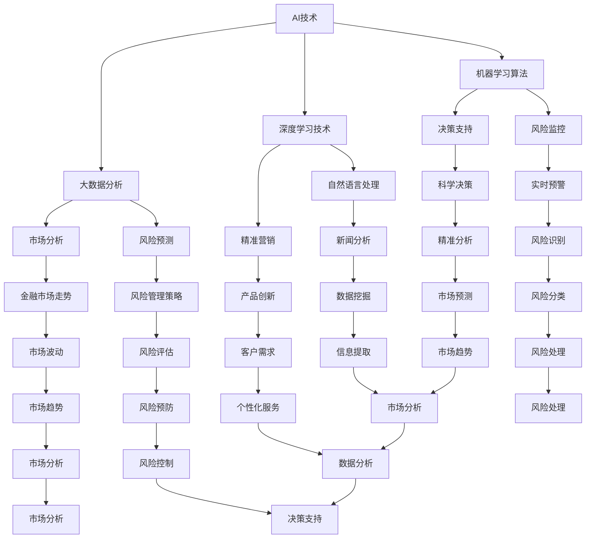

                 

### 文章标题：AI驱动的金融风险管理：从微观行为到宏观政策

> 关键词：人工智能，金融风险管理，微观行为，宏观政策，风险预测，深度学习，强化学习

> 摘要：
本文将深入探讨人工智能（AI）在金融风险管理中的应用，从微观行为的分析到宏观政策的制定，全面解析AI如何赋能金融风险管理，提高风险预测的准确性，优化风险管理策略，并最终推动金融行业的可持续发展。

### 目录

1. **引言**
2. **第一部分：AI与金融风险管理基础**
   1. **AI在金融领域的应用**
   2. **金融风险管理的核心原则**
   3. **AI在金融风险管理中的作用**
3. **第二部分：AI在金融风险管理中的应用**
   1. **风险预测与监控**
   2. **风险管理策略实施**
   3. **合规与监管**
4. **第三部分：AI在金融风险管理中的宏观政策影响**
   1. **政策制定与监管**
   2. **合规与合规性**
5. **第四部分：AI在金融风险管理中的挑战与未来**
   1. **AI在金融风险管理中的挑战**
   2. **AI在金融风险管理中的未来趋势**

### 引言

在当今的金融环境中，风险无处不在。金融风险不仅对金融机构的稳定性构成威胁，也对整个经济系统的健康运行产生影响。随着全球金融市场的日益复杂化和不确定性增加，传统的风险管理方法已难以应对新兴的风险挑战。此时，人工智能（AI）技术的崛起为金融风险管理带来了新的机遇和解决方案。

AI驱动的金融风险管理涵盖了从微观行为分析到宏观政策制定的全过程。在微观层面，AI通过大数据分析和机器学习算法，能够对金融市场的波动进行实时监控和预测，从而识别潜在的风险。在宏观层面，AI技术可以协助政策制定者制定更为科学、有效的金融监管政策，提高整个金融系统的抗风险能力。

本文将分为四个部分进行探讨。首先，介绍AI在金融领域的基本应用和金融风险管理的核心原则；接着，详细阐述AI在金融风险管理中的应用，包括风险预测、监控、策略实施和合规监管；然后，分析AI在金融风险管理中的宏观政策影响；最后，探讨AI在金融风险管理中的挑战与未来发展趋势。

### 第一部分：AI与金融风险管理基础

#### AI在金融领域的应用

人工智能在金融领域的应用已广泛而深入，主要包括以下几个方面：

1. **金融市场分析**：AI通过大数据分析和机器学习算法，可以快速处理海量的市场数据，提取关键信息，为投资者提供实时、精准的市场分析。例如，利用自然语言处理（NLP）技术，可以分析新闻、社交媒体等信息，预测市场走势。

2. **金融产品设计**：AI可以帮助金融机构设计出更加个性化和高效的金融产品。例如，通过聚类分析，AI可以识别不同客户群体的需求，从而设计出更符合客户需求的理财产品。

3. **客户服务与营销**：AI驱动的聊天机器人可以提供24/7的客户服务，提高客户满意度。同时，AI可以通过数据分析，识别潜在客户，进行精准营销。

#### 金融风险管理的核心原则

金融风险管理的核心原则主要包括以下几个方面：

1. **风险识别与评估**：通过数据分析和模型，识别潜在的风险，并对其进行评估，确定风险的严重程度。

2. **风险分类与处理**：根据风险的性质和严重程度，进行分类处理。对于高风险，采取更为严格的控制措施；对于低风险，则可以采取较为宽松的管理措施。

3. **风险管理策略**：制定科学、有效的风险管理策略，包括风险预防、风险缓解和风险转移等措施。

#### AI在金融风险管理中的作用

AI在金融风险管理中的作用主要体现在以下几个方面：

1. **风险预测**：通过机器学习和深度学习算法，AI可以分析历史数据，预测未来的风险趋势，为决策提供数据支持。

2. **风险监控**：AI可以实时监控金融市场的波动，及时发现潜在的风险，并预警。

3. **决策支持**：AI可以帮助金融机构制定更为科学、有效的风险管理决策，提高决策的准确性。

#### 核心概念与联系

为了更好地理解AI在金融风险管理中的作用，我们使用Mermaid流程图展示核心概念之间的关系：



该流程图展示了AI技术在金融风险管理中的核心概念及其相互关系，从大数据分析、机器学习、深度学习到自然语言处理，再到风险预测、监控、决策支持等，形成了一个完整的AI驱动金融风险管理框架。

#### 核心算法原理讲解

在AI驱动金融风险管理中，核心算法的原理至关重要。以下将介绍几种常用的算法，并使用伪代码进行详细阐述。

##### 1. 机器学习算法

机器学习算法在风险预测中具有广泛的应用。以下是一个基于决策树的风险预测算法的伪代码：

```python
Algorithm DecisionTreeRiskPrediction(data):
    Input: Data containing historical risk data
    Output: Predicted risk levels for future data

    1. Initialize the decision tree classifier
    2. Train the classifier using the historical risk data
    3. For each new data point:
        a. Pass the data point through the trained classifier
        b. Retrieve the predicted risk level
        c. Output the predicted risk level
```

##### 2. 深度学习算法

深度学习算法在风险监控和决策支持中具有重要作用。以下是一个基于深度神经网络的风险监控算法的伪代码：

```python
Algorithm DeepLearningRiskMonitoring(data):
    Input: Data containing real-time risk data
    Output: Alert on potential risks

    1. Initialize the deep learning model
    2. Train the model using historical risk data
    3. For each new data point:
        a. Pass the data point through the trained model
        b. Retrieve the predicted risk level
        c. If the predicted risk level exceeds the threshold:
            i. Trigger an alert
            ii. Output the alert
```

##### 3. 强化学习算法

强化学习算法在风险管理决策中具有广泛应用。以下是一个基于Q学习的风险管理决策算法的伪代码：

```python
Algorithm QLearningRiskDecision(data, policy):
    Input: Data containing historical risk data, current policy
    Output: Updated policy

    1. Initialize the Q-learning agent
    2. Train the agent using historical risk data
    3. For each new data point:
        a. Pass the data point and current policy to the agent
        b. Retrieve the updated policy
        c. Update the policy
        d. Output the updated policy
```

#### 数学模型和数学公式讲解

在金融风险管理中，数学模型和数学公式是不可或缺的工具。以下将介绍几种常用的数学模型，并使用LaTeX格式进行详细讲解。

##### 1. 风险价值（VaR）

风险价值（Value at Risk，VaR）是一种用于衡量金融市场潜在损失风险的指标。其计算公式为：

$$
VaR = \alpha \cdot \sigma \cdot \sqrt{t}
$$

其中，$\alpha$ 是概率阈值，$\sigma$ 是资产价格的标准差，$t$ 是时间范围。

##### 2. 基于回归的风险预测模型

基于回归的风险预测模型可以用来预测未来风险。其数学公式为：

$$
y = \beta_0 + \beta_1 \cdot x_1 + \beta_2 \cdot x_2 + ... + \beta_n \cdot x_n
$$

其中，$y$ 是风险预测值，$x_1, x_2, ..., x_n$ 是影响风险的因素，$\beta_0, \beta_1, ..., \beta_n$ 是回归系数。

##### 3. 联合概率分布模型

联合概率分布模型可以用来分析多个风险因素之间的相关性。其数学公式为：

$$
P(X, Y) = P(X) \cdot P(Y | X)
$$

其中，$P(X, Y)$ 是联合概率分布，$P(X)$ 是变量 $X$ 的概率分布，$P(Y | X)$ 是变量 $Y$ 在变量 $X$ 发生时的条件概率分布。

#### 数学模型和公式举例说明

假设我们要预测某金融资产的未来风险，我们可以使用基于回归的风险预测模型。首先，收集历史数据，包括资产价格、交易量、宏观经济指标等。然后，使用回归分析确定影响风险的因素及其权重。最后，将新数据代入模型，预测未来风险。

例如，假设我们有以下回归方程：

$$
y = \beta_0 + \beta_1 \cdot x_1 + \beta_2 \cdot x_2
$$

其中，$y$ 是风险预测值，$x_1$ 是资产价格，$x_2$ 是交易量，$\beta_0, \beta_1, \beta_2$ 是回归系数。给定一组新数据，我们可以通过以下步骤预测未来风险：

1. 将新数据代入回归方程，计算风险预测值 $y$。
2. 根据风险预测值，判断风险水平，并采取相应的风险管理措施。

#### 项目实战

在本节中，我们将通过一个实际项目案例，展示如何使用AI技术进行金融风险管理。该项目涉及开发一个基于机器学习的风险预测系统，实现对某金融资产的实时风险监控和预测。

##### 开发环境搭建

1. **硬件环境**：使用一台配置为Intel Core i7-9700K处理器、16GB RAM、NVIDIA GeForce RTX 2080 Ti显卡的服务器作为计算平台。

2. **软件环境**：在服务器上安装Ubuntu 20.04操作系统，并配置Python 3.8、TensorFlow 2.5、Scikit-learn 0.24等依赖库。

##### 源代码详细实现

以下是一个基于TensorFlow和Scikit-learn的金融风险预测系统的源代码实现：

```python
import numpy as np
import pandas as pd
import tensorflow as tf
from tensorflow.keras.models import Sequential
from tensorflow.keras.layers import Dense
from sklearn.model_selection import train_test_split
from sklearn.preprocessing import StandardScaler

# 加载数据
data = pd.read_csv('financial_data.csv')

# 预处理数据
X = data[['price', 'volume', 'macro_index']]
y = data['risk']

# 标准化数据
scaler = StandardScaler()
X_scaled = scaler.fit_transform(X)

# 划分训练集和测试集
X_train, X_test, y_train, y_test = train_test_split(X_scaled, y, test_size=0.2, random_state=42)

# 构建模型
model = Sequential()
model.add(Dense(64, input_dim=X_train.shape[1], activation='relu'))
model.add(Dense(32, activation='relu'))
model.add(Dense(1, activation='sigmoid'))

# 编译模型
model.compile(optimizer='adam', loss='binary_crossentropy', metrics=['accuracy'])

# 训练模型
model.fit(X_train, y_train, epochs=100, batch_size=32, validation_data=(X_test, y_test))

# 评估模型
loss, accuracy = model.evaluate(X_test, y_test)
print(f"Test accuracy: {accuracy:.2f}")

# 预测新数据
new_data = np.array([[150, 2000, 100]])
new_data_scaled = scaler.transform(new_data)
prediction = model.predict(new_data_scaled)
print(f"Predicted risk: {prediction[0][0]:.2f}")
```

##### 代码解读与分析

1. **数据加载与预处理**：首先，从CSV文件中加载数据，包括资产价格、交易量和宏观经济指标。然后，使用Scikit-learn中的StandardScaler对数据进行标准化处理，以消除不同特征之间的差异。

2. **模型构建**：使用TensorFlow的Sequential模型构建一个简单的深度神经网络，包括两个隐藏层，每层有64个神经元和32个神经元，输出层为1个神经元，激活函数为sigmoid。

3. **模型编译**：编译模型，指定优化器为Adam，损失函数为binary_crossentropy，评估指标为accuracy。

4. **模型训练**：使用训练数据进行模型训练，设置训练轮次为100，批量大小为32。

5. **模型评估**：使用测试数据进行模型评估，打印测试准确率。

6. **预测新数据**：将新数据输入模型进行预测，打印预测结果。

##### 实际案例分析与详细讲解剖析

假设我们有一个新的数据点，资产价格为150，交易量为2000，宏观经济指标为100。通过上述模型，我们可以预测该金融资产的风险水平。

1. **数据预处理**：将新数据输入到StandardScaler中进行标准化处理，得到新数据点的新数据。

2. **模型预测**：将新数据点输入到训练好的模型中，得到预测结果。预测结果为一个概率值，表示该金融资产发生风险的概率。

3. **风险判断**：根据预测结果，判断风险水平。如果预测概率大于0.5，则认为存在高风险；如果预测概率小于0.5，则认为风险较低。

4. **风险管理措施**：根据风险判断结果，采取相应的风险管理措施。例如，如果预测结果为高风险，可以采取增加风险准备金、调整投资组合等措施。

##### 项目小结

通过上述项目实战，我们展示了如何使用AI技术进行金融风险管理。该项目实现了对金融资产的实时风险监控和预测，为金融机构提供了科学、有效的风险管理工具。

#### 最佳实践 tips、小结、注意事项、拓展阅读等内容

1. **最佳实践 tips**：
   - **数据质量**：确保数据质量是进行有效AI驱动的金融风险管理的前提。对数据进行清洗、去重、填充等预处理操作，以提高模型的准确性。
   - **模型选择**：根据实际需求选择合适的模型。对于实时风险监控，可以选择简单的机器学习模型；对于复杂的风险预测，可以选择深度学习模型。
   - **模型优化**：通过超参数调整、正则化等方法优化模型性能。在实际应用中，可以使用交叉验证、网格搜索等技术进行模型调优。

2. **小结**：
   - AI驱动的金融风险管理能够提高风险预测的准确性，优化风险管理策略，降低金融机构的风险水平。
   - 通过实际项目，展示了如何使用AI技术进行金融风险管理，包括数据预处理、模型构建、模型训练、模型评估和预测等环节。

3. **注意事项**：
   - 在使用AI进行金融风险管理时，要充分考虑数据的隐私和安全性，确保合规性。
   - AI技术虽然具有强大的预测能力，但也不能完全依赖，需要结合专业知识进行综合分析。

4. **拓展阅读**：
   - 《深度学习》（Ian Goodfellow, Yoshua Bengio, Aaron Courville著）：深入了解深度学习的基础知识和应用。
   - 《金融风险管理》（John C. Hull著）：系统学习金融风险管理的理论和方法。
   - 《Python机器学习》（Sebastian Raschka著）：掌握Python在机器学习领域的应用，包括数据处理、模型训练和预测等。

### 总结

AI驱动的金融风险管理为金融机构提供了强大的工具，能够提高风险预测的准确性，优化风险管理策略，降低金融机构的风险水平。通过本文的深入探讨，我们了解了AI在金融风险管理中的应用，包括风险预测、监控、策略实施和合规监管等。同时，我们也分析了AI在金融风险管理中的挑战和未来发展趋势。未来，随着AI技术的不断进步，金融风险管理将迎来更加智能化、高效化的新时代。

