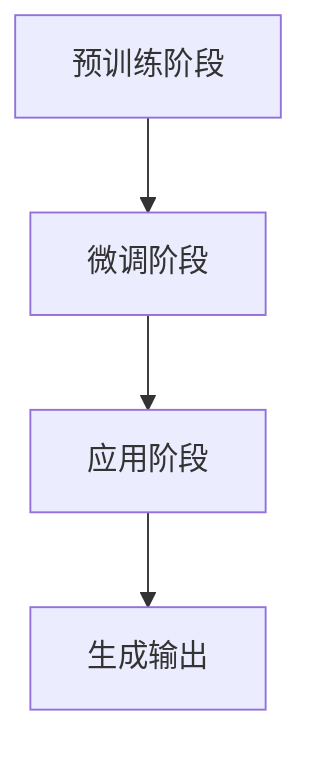

                 

### 文章标题

# 《ChatGPT在自动化个性化学习内容生成中的应用》

### 关键词

- ChatGPT
- 自动化个性化学习
- 自然语言处理
- 教育内容生成
- 个性化课程设计

### 摘要

本文将深入探讨ChatGPT在自动化个性化学习内容生成中的应用。首先，我们将介绍ChatGPT的基本概念和技术原理，接着分析个性化学习内容生成的理论基础和挑战。随后，我们将详细阐述ChatGPT在教育内容生成、课程设计、作业与考试以及特殊教育中的应用，并通过实际案例展示其应用效果。最后，我们将探讨ChatGPT在个性化学习内容生成中的未来发展趋势和潜在挑战。希望通过本文，读者能够对ChatGPT在教育领域的应用有一个全面而深入的理解。

## 目录

### 《ChatGPT在自动化个性化学习内容生成中的应用》目录

## 第一部分：ChatGPT基础

### 第1章：ChatGPT概述  
#### 1.1 什么是ChatGPT  
#### 1.2 ChatGPT的核心技术和原理  
#### 1.3 ChatGPT的优势与应用场景

### 第2章：ChatGPT技术基础  
#### 2.1 自然语言处理概述  
#### 2.2 Transformer模型原理  
#### 2.3 ChatGPT的工作流程

### 第3章：个性化学习内容生成的理论基础  
#### 3.1 个性化学习概述  
#### 3.2 学习内容生成的挑战与解决方案  
#### 3.3 ChatGPT在个性化学习中的潜力

## 第二部分：ChatGPT在个性化学习内容生成中的应用

### 第4章：ChatGPT在教育内容生成中的应用  
#### 4.1 ChatGPT在教育领域的应用  
#### 4.2 教育内容的自动生成过程  
#### 4.3 个性化学习内容的生成策略

### 第5章：ChatGPT在课程设计中的应用  
#### 5.1 ChatGPT在课程设计中的角色  
#### 5.2 课程内容的个性化定制  
#### 5.3 互动式课程设计与实现

### 第6章：ChatGPT在作业与考试中的应用  
#### 6.1 个性化作业的自动生成  
#### 6.2 考试题目的自动生成  
#### 6.3 评估与反馈系统的构建

### 第7章：ChatGPT在特殊教育中的应用  
#### 7.1 ChatGPT在特殊教育中的优势  
#### 7.2 个性化学习路径的规划  
#### 7.3 特殊教育内容的个性化生成

## 第三部分：实践与案例分析

### 第8章：ChatGPT在个性化学习内容生成中的实际案例  
#### 8.1 案例一：在线教育平台的应用  
#### 8.2 案例二：自适应学习系统的实现  
#### 8.3 案例三：特殊教育的实践

### 第9章：开发与部署ChatGPT系统  
#### 9.1 ChatGPT系统的开发环境搭建  
#### 9.2 ChatGPT系统的配置与优化  
#### 9.3 ChatGPT系统的部署与运维

### 第10章：未来展望  
#### 10.1 ChatGPT在个性化学习内容生成中的未来发展  
#### 10.2 潜在挑战与解决思路  
#### 10.3 个性化学习内容生成技术的未来趋势

## 第一部分：ChatGPT基础

### 第1章：ChatGPT概述

#### 1.1 什么是ChatGPT

ChatGPT是由OpenAI开发的一款基于Transformer模型的预训练语言模型，属于自然语言处理（NLP）领域的杰出成果。它是一种大型语言模型，通过深度学习技术，从海量文本数据中学习语言模式和知识，从而实现自然语言的生成和理解。

ChatGPT的全名是Chat-based Generative Pre-trained Transformer，其核心架构是基于Transformer模型。Transformer模型是一种用于处理序列数据的深度学习模型，最早由Vaswani等人在2017年的论文《Attention is All You Need》中提出。它通过自注意力机制（Self-Attention）和多头注意力机制（Multi-Head Attention）来捕捉序列数据中的长距离依赖关系，从而实现高效的语言理解与生成。

ChatGPT的工作原理是通过大量无监督的预训练和数据增强的微调，使其在多个任务上表现优异。具体来说，预训练阶段，ChatGPT在大量的文本数据上进行训练，学习语言的一般模式和规律；在微调阶段，ChatGPT根据特定的任务和数据集进行微调，以适应不同的应用场景。

#### 1.2 ChatGPT的核心技术和原理

ChatGPT的核心技术和原理主要涉及以下几个关键点：

1. **Transformer模型**：Transformer模型是ChatGPT的基础架构，其核心思想是自注意力机制（Self-Attention）和多头注意力机制（Multi-Head Attention）。自注意力机制允许模型在处理序列数据时，将每个词的表示与所有其他词的表示进行关联，从而捕捉长距离的依赖关系；多头注意力机制则将自注意力机制扩展到多个头，每个头关注不同的部分，从而提高模型的捕捉能力。

2. **预训练与微调**：预训练是ChatGPT的核心技术之一。在预训练阶段，ChatGPT通过大量无监督的文本数据进行训练，学习语言的一般模式和知识。这种预训练方法使得模型在处理不同的语言任务时，能够快速适应和优化。微调则是针对特定任务的数据进行训练，以进一步提高模型的性能和准确性。

3. **生成式模型**：ChatGPT是一种生成式模型，它通过预测下一个词的概率分布来生成文本。生成式模型的优点是能够生成连贯、自然的语言，但缺点是生成的文本可能包含噪声和错误。

4. **上下文理解**：ChatGPT通过Transformer模型中的自注意力机制和多头注意力机制，能够捕捉到输入文本的上下文信息。这意味着ChatGPT不仅能够理解单个词的含义，还能够理解词与词之间的关系，从而生成更准确、更连贯的文本。

#### 1.3 ChatGPT的优势与应用场景

ChatGPT具有以下几个显著优势：

1. **高效的语言理解与生成能力**：ChatGPT通过Transformer模型的自注意力机制和多头注意力机制，能够高效地理解和生成自然语言。这使得ChatGPT在文本生成、机器翻译、文本摘要等任务中表现出色。

2. **广泛的适用性**：ChatGPT是一种通用型语言模型，可以应用于多种语言任务，包括问答系统、对话系统、文本生成等。这使得ChatGPT具有很高的实用价值。

3. **灵活的微调能力**：ChatGPT在预训练阶段积累了丰富的语言知识和模式，通过微调可以快速适应特定任务的数据，从而提高模型的性能。

ChatGPT的主要应用场景包括：

1. **教育领域**：ChatGPT可以用于自动化个性化学习内容生成、教育问答系统、智能辅导等，为学习者提供个性化、智能化的学习体验。

2. **商业领域**：ChatGPT可以用于客户服务、营销文案撰写、文本分析等，帮助企业提高运营效率和客户满意度。

3. **媒体领域**：ChatGPT可以用于新闻写作、文章生成、内容审核等，提高媒体生产的效率和质量。

4. **娱乐领域**：ChatGPT可以用于虚拟角色对话、故事生成、游戏开发等，为用户提供丰富的娱乐体验。

总之，ChatGPT作为一种强大的语言模型，在多个领域展现出广阔的应用前景。随着技术的不断进步和应用场景的拓展，ChatGPT将在未来发挥更加重要的作用。

### 第2章：ChatGPT技术基础

#### 2.1 自然语言处理概述

自然语言处理（Natural Language Processing，NLP）是计算机科学和人工智能领域的一个重要分支，旨在使计算机能够理解和处理自然语言，实现人与计算机之间的自然交互。NLP的研究内容涵盖了语音识别、文本分析、语义理解、机器翻译、情感分析等多个方面。其核心目标是构建能够理解、生成和操作自然语言信息的系统，以实现人机交互的智能化。

自然语言处理的发展可以追溯到20世纪50年代。当时，人工智能的早期研究者们开始尝试通过编程实现计算机理解自然语言。早期的NLP系统主要依赖于规则方法，即通过编写大量的语法规则和词典来解析和生成语言。然而，这种方法存在许多局限性，例如规则的覆盖范围有限，难以应对复杂和不确定的语言现象。

随着计算机硬件和算法的发展，NLP逐渐从基于规则的系统转向基于统计模型的方法。20世纪80年代，统计语言模型（如n元语法模型）开始广泛应用于文本生成和语言理解任务。这些模型通过统计方法从大量文本数据中学习语言的统计规律，从而实现自动化语言处理。

进入21世纪，深度学习技术在NLP领域的应用极大地推动了该领域的发展。深度学习模型，特别是神经网络模型，通过学习大量文本数据，能够自动提取语言中的复杂模式和知识，实现高效的语言理解和生成。代表性的模型包括循环神经网络（RNN）、长短时记忆网络（LSTM）、门控循环单元（GRU）以及Transformer模型等。

自然语言处理的应用场景非常广泛，包括但不限于以下方面：

1. **语音识别**：将语音信号转换为文本，实现语音输入和语音输出，如智能助手、语音导航等。
2. **文本分析**：对大量文本数据进行分析和挖掘，提取有价值的信息，如情感分析、话题检测、文本分类等。
3. **语义理解**：理解文本的语义含义，包括实体识别、关系抽取、语义角色标注等。
4. **机器翻译**：将一种语言的文本翻译成另一种语言，如谷歌翻译、百度翻译等。
5. **文本生成**：根据输入的文本或指令生成新的文本，如自动写作、对话系统等。

#### 2.2 Transformer模型原理

Transformer模型是由Vaswani等人于2017年在论文《Attention is All You Need》中提出的一种用于处理序列数据的深度学习模型。Transformer模型的核心思想是自注意力机制（Self-Attention）和多头注意力机制（Multi-Head Attention），这些机制使得模型能够高效地捕捉序列数据中的长距离依赖关系。

##### 自注意力机制

自注意力机制（Self-Attention），也称为内注意力（Intra-Attention），是一种让模型在处理序列数据时，将每个词的表示与所有其他词的表示进行关联的机制。具体来说，自注意力机制通过计算每个词与所有其他词的关联度，然后将这些关联度用于更新每个词的表示。

自注意力机制的计算过程如下：

1. **计算查询向量（Query）、键向量（Key）和值向量（Value）**：对于输入序列中的每个词，生成相应的查询向量、键向量和值向量。这些向量通常是通过嵌入层（Embedding Layer）得到的。

2. **计算注意力得分**：对于每个词，计算其查询向量与所有键向量之间的点积，得到注意力得分。注意力得分的公式为：

   $$ 
   \text{Attention Scores} = \text{Query} \cdot \text{Key}^T 
   $$

   其中，$\text{Query}$ 和 $\text{Key}$ 分别是查询向量和键向量，$T$ 表示转置。

3. **计算加权和**：根据注意力得分，对值向量进行加权和，得到加权后的表示。加权和的公式为：

   $$ 
   \text{Contextualized Representation} = \text{Value} \cdot \text{Attention Scores} 
   $$

   其中，$\text{Value}$ 是值向量。

4. **归一化**：为了使注意力得分的范围在0到1之间，需要对注意力得分进行归一化处理。

##### 多头注意力机制

多头注意力机制（Multi-Head Attention）是自注意力机制的扩展，它通过将自注意力机制分成多个“头”，每个头关注不同的部分，从而提高模型的捕捉能力。

多头注意力机制的计算过程如下：

1. **计算多个头**：对于每个输入序列，计算多个查询向量、键向量和值向量，每个向量对应一个头。通常，这些向量是通过嵌入层和线性变换得到的。

2. **分别计算每个头的自注意力**：对每个头分别执行自注意力机制的计算过程，得到多个加权后的表示。

3. **拼接和线性变换**：将多个头的加权表示拼接在一起，然后通过线性变换得到最终的输出。

多头注意力机制的优点是能够捕捉到序列数据中的更多依赖关系，从而提高模型的性能。

##### Transformer模型结构

Transformer模型由编码器（Encoder）和解码器（Decoder）组成，编码器负责将输入序列编码成上下文表示，解码器则根据上下文表示生成输出序列。

编码器由多个编码层（Encoder Layer）组成，每个编码层包括多头注意力机制、残差连接和层归一化（Layer Normalization）。具体来说，编码层的工作流程如下：

1. **多头自注意力**：输入序列通过嵌入层得到查询向量、键向量和值向量，然后分别通过多头注意力机制进行自注意力计算，得到加权后的表示。

2. **残差连接**：将加权后的表示与原始输入序列进行拼接，然后通过一个线性变换得到中间结果。

3. **层归一化**：对中间结果进行归一化处理，使其具有较好的稳定性。

4. **前馈网络**：将归一化后的结果通过一个前馈网络（由两个线性变换组成）进行进一步处理。

解码器由多个解码层（Decoder Layer）组成，每个解码层包括多头自注意力、多头交叉注意力、残差连接和层归一化。具体来说，解码层的工作流程如下：

1. **多头自注意力**：输入序列通过嵌入层得到查询向量、键向量和值向量，然后通过多头自注意力机制进行自注意力计算。

2. **多头交叉注意力**：解码器在生成每个词时，不仅需要关注自身的上下文，还需要关注编码器输出的上下文。多头交叉注意力机制通过计算编码器输出的键向量和解码器查询向量之间的点积，得到注意力得分，并根据注意力得分对编码器输出的值向量进行加权和。

3. **残差连接和层归一化**：与编码器类似，解码器也通过残差连接和层归一化处理来提高模型的稳定性。

4. **前馈网络**：解码器同样通过一个前馈网络进行进一步处理。

通过编码器和解码器之间的交互，Transformer模型能够高效地处理序列数据，实现高效的文本生成和理解。

#### 2.3 ChatGPT的工作流程

ChatGPT是基于Transformer模型的大型语言模型，其工作流程主要包括预训练和微调两个阶段。

1. **预训练阶段**：在预训练阶段，ChatGPT在大量的文本数据上进行训练，学习语言的一般模式和知识。预训练的主要任务是生成一个预训练模型，该模型能够捕捉到语言的复杂结构和规律。预训练阶段通常包括以下几个步骤：

   - **数据收集**：收集大量的文本数据，包括书籍、新闻、社交媒体等。
   - **预处理**：对文本数据进行清洗和预处理，包括去除标点符号、特殊字符、停用词等，然后进行分词和词嵌入。
   - **训练**：使用Transformer模型对预处理后的文本数据进行训练。训练过程中，模型通过最大化未登录词的概率来更新参数，从而学习语言的统计规律。
   - **保存预训练模型**：预训练完成后，保存预训练模型，以便在后续的微调阶段使用。

2. **微调阶段**：在微调阶段，ChatGPT根据特定的任务和数据集进行微调，以适应不同的应用场景。微调的主要任务是优化预训练模型，使其在特定任务上表现更好。微调阶段通常包括以下几个步骤：

   - **数据收集**：收集与任务相关的数据集，例如教育领域的学习内容、教育问答数据等。
   - **预处理**：对数据集进行清洗和预处理，与预训练阶段类似。
   - **微调**：使用预训练模型对预处理后的数据进行微调。微调过程中，模型通过最小化损失函数来更新参数，从而适应特定任务。
   - **评估和调整**：在微调过程中，对模型进行评估，根据评估结果调整模型参数，以提高模型的性能。

3. **应用阶段**：微调完成后，ChatGPT可以应用于各种任务，如文本生成、问答系统、智能辅导等。在实际应用中，ChatGPT通过接收输入文本，生成相应的输出文本，实现自然语言处理和生成。

ChatGPT的工作流程如图1所示：



通过预训练和微调阶段，ChatGPT能够高效地学习和理解自然语言，实现自动化个性化学习内容生成，为教育领域带来革命性的变革。

### 第3章：个性化学习内容生成的理论基础

#### 3.1 个性化学习概述

个性化学习（Personalized Learning）是一种以学生为中心的教育理念，旨在根据每个学生的学习需求、兴趣和能力，提供个性化的学习体验。个性化学习的核心目标是通过个性化教学和个性化学习内容，实现每个学生的最佳发展。

个性化学习与传统教学方法相比，具有以下几个显著特点：

1. **以学生为中心**：个性化学习强调尊重学生的个体差异，关注学生的兴趣和需求，使学习过程更加贴近学生的实际生活和学习情境。

2. **灵活的学习路径**：个性化学习允许学生根据自身的学习进度和能力，选择适合自己的学习路径，从而提高学习效率和效果。

3. **动态的学习反馈**：个性化学习通过实时跟踪和分析学生的学习行为和成果，提供动态的反馈和指导，帮助学生及时调整学习策略和方法。

4. **跨学科的整合**：个性化学习鼓励学生跨学科、跨领域的探索和学习，培养学生的综合素质和创新能力。

#### 3.2 学习内容生成的挑战与解决方案

个性化学习内容生成是实现个性化学习的关键环节。然而，这一过程面临着诸多挑战：

1. **数据隐私与安全**：个性化学习需要收集和分析大量学生的个人学习数据，这涉及到数据隐私和安全问题。如何保护学生的隐私，确保数据安全，是个性化学习内容生成过程中必须解决的问题。

2. **个性化需求的多样性**：每个学生的学习需求、兴趣和能力各不相同，个性化学习内容生成需要满足多样化的需求。这要求系统具备强大的数据处理和分析能力，能够准确识别和满足每个学生的个性化需求。

3. **内容生成的质量与效率**：个性化学习内容生成需要确保生成的内容既高质量，又能够高效生成。高质量的内容能够满足学生的学习需求，而高效率的生成则能够确保学习资源的及时供给。

针对上述挑战，以下是一些解决方案：

1. **数据隐私与安全**：采用加密技术、匿名化处理和数据隔离等技术，保护学生的个人学习数据。同时，建立完善的数据隐私和安全管理制度，确保数据的安全和合规。

2. **个性化需求的多样性**：通过大数据分析和机器学习技术，对学生的行为数据和学习成果进行深入分析，准确识别和预测学生的个性化需求。此外，建立灵活的内容生成框架，支持多类型的个性化内容生成。

3. **内容生成的质量与效率**：采用自动化内容生成技术，如自然语言生成（NLG）和生成式对抗网络（GAN），提高内容生成的质量和效率。同时，通过并行计算和分布式处理等技术，加快内容生成的速度。

#### 3.3 ChatGPT在个性化学习中的潜力

ChatGPT作为一种基于Transformer模型的大型语言模型，在个性化学习内容生成中具有巨大的潜力：

1. **强大的文本生成能力**：ChatGPT能够生成高质量的文本内容，满足个性化学习的要求。通过预训练和微调，ChatGPT能够理解学生的个性化需求，生成符合学生兴趣和能力的学习内容。

2. **灵活的内容生成框架**：ChatGPT支持多种类型的文本生成任务，如文章写作、对话生成和问答系统等。这意味着，ChatGPT可以灵活地生成不同类型的个性化学习内容，满足多样化的需求。

3. **动态的学习反馈**：ChatGPT可以实时分析学生的学习行为和成果，提供动态的反馈和指导。通过对话生成和问答系统，ChatGPT能够与学生学习互动，帮助他们及时调整学习策略和方法。

4. **跨学科的整合能力**：ChatGPT能够理解多学科的知识，实现跨学科的整合。这意味着，ChatGPT可以为学生提供跨学科的学习内容，培养他们的综合素质和创新能力。

总之，ChatGPT在个性化学习内容生成中具有显著的潜力，有望成为个性化学习的重要工具。随着技术的不断进步和应用场景的拓展，ChatGPT将在个性化学习中发挥越来越重要的作用。

## 第二部分：ChatGPT在个性化学习内容生成中的应用

### 第4章：ChatGPT在教育内容生成中的应用

#### 4.1 ChatGPT在教育领域的应用

在教育领域，ChatGPT被广泛应用于教育内容的自动生成、个性化学习辅导、智能问答系统等方面。其强大的文本生成能力和灵活的内容生成框架，使得ChatGPT能够为教育工作者和学生提供丰富的学习资源和个性化服务。

1. **教育内容自动生成**：ChatGPT可以根据教育大纲和课程要求，自动生成教材、教学笔记、练习题和考试题目等教育内容。通过预训练和微调，ChatGPT能够理解教育领域的专业术语和知识结构，生成高质量的教育内容。

2. **个性化学习辅导**：ChatGPT可以根据学生的学习需求和兴趣，提供个性化的学习辅导。通过对话生成和问答系统，ChatGPT能够实时回答学生的问题，提供学习建议和指导，帮助学生克服学习难题。

3. **智能问答系统**：ChatGPT可以作为智能问答系统的核心，为学习者提供即时的学习支持。学生可以通过文字或语音输入问题，ChatGPT会根据其预训练的知识和模型，生成准确的答案或解释。

#### 4.2 教育内容的自动生成过程

ChatGPT在教育内容生成中的应用，主要分为以下几个步骤：

1. **数据收集与预处理**：首先，收集与教育相关的数据，包括教材、教学资料、学术论文等。然后，对数据集进行预处理，包括分词、词嵌入、去除停用词等，以便ChatGPT能够更好地理解和生成教育内容。

2. **模型训练与微调**：使用收集到的数据集，对ChatGPT进行训练和微调。训练过程中，ChatGPT学习教育领域的专业知识和术语，使其能够生成符合教育要求的内容。微调阶段，可以根据具体的教育需求和场景，进一步优化ChatGPT的生成能力。

3. **内容生成**：在生成教育内容时，ChatGPT会根据输入的指令或问题，生成相应的文本内容。生成的内容可以包括教材、教学笔记、练习题、考试题目等。ChatGPT生成的教育内容具有较高的准确性和可读性，能够满足教育质量要求。

4. **内容审核与优化**：生成的内容需要经过审核和优化，以确保内容的准确性和合规性。审核过程可以包括人工审核和自动化审核，如使用自然语言处理技术检测文本中的错误和不合适的部分。

#### 4.3 个性化学习内容的生成策略

为了实现有效的个性化学习内容生成，ChatGPT可以采用以下策略：

1. **基于学生数据的个性化生成**：ChatGPT可以根据学生的学习数据，如学习进度、成绩、学习偏好等，生成个性化的学习内容。通过分析学生的数据，ChatGPT能够识别学生的学习需求和薄弱环节，从而生成有针对性的学习内容。

2. **基于教育目标的个性化生成**：ChatGPT可以根据教育目标，如知识点、课程要求等，生成与目标相符合的学习内容。这有助于确保学习内容的系统性和连贯性，帮助学生更好地掌握知识和技能。

3. **基于情境的个性化生成**：ChatGPT可以根据学生的学习情境，如课堂环境、自主学习环境等，生成符合情境的学习内容。在课堂环境中，ChatGPT可以生成与教学计划相匹配的教学内容和练习题，而在自主学习环境中，ChatGPT可以生成更多的自主学习和探究内容。

4. **多模态内容生成**：ChatGPT不仅可以生成文本内容，还可以生成图片、音频、视频等多模态内容。通过多模态内容的整合，ChatGPT能够为学生提供更丰富、更全面的学习体验。

总之，ChatGPT在教育内容生成中的应用，为个性化学习提供了强大的技术支持。通过基于学生数据、教育目标和情境的个性化生成策略，ChatGPT能够为学生提供高质量、个性化的学习资源，推动教育改革和创新发展。

### 第5章：ChatGPT在课程设计中的应用

#### 5.1 ChatGPT在课程设计中的角色

ChatGPT在课程设计中扮演着多重角色，从内容生成到个性化定制，再到互动式教学，其应用价值日益凸显。以下是ChatGPT在课程设计中的主要角色：

1. **课程内容生成器**：ChatGPT能够根据教育大纲和课程要求，自动生成教材、课程大纲、教学案例等课程内容。通过预训练和微调，ChatGPT能够理解教育领域的专业术语和知识点，生成高质量且符合教育标准的课程内容。

2. **个性化课程定制师**：ChatGPT可以根据学生的学习数据，如学习进度、兴趣和能力，提供个性化的课程推荐和内容定制。这有助于满足不同学生的学习需求，提高课程内容的针对性和有效性。

3. **互动式教学促进者**：ChatGPT能够与学生进行自然语言对话，提供互动式的教学体验。通过问答系统、模拟对话等互动形式，ChatGPT能够激发学生的学习兴趣，促进知识的内化和应用。

#### 5.2 课程内容的个性化定制

课程内容的个性化定制是ChatGPT在教育领域的重要应用之一。以下是实现个性化定制的过程和策略：

1. **数据收集与处理**：首先，收集与学生学习相关的数据，包括学习行为、考试成绩、兴趣偏好等。这些数据可以通过学习管理系统（LMS）、在线学习平台等途径获取。

2. **个性化分析**：利用机器学习和自然语言处理技术，对收集到的学生数据进行分析，识别学生的学习需求和薄弱环节。分析结果可以用于生成个性化推荐和学习路径。

3. **内容定制**：根据个性化分析结果，ChatGPT生成符合学生需求的内容。这包括教材、练习题、教学视频等。生成的内容不仅要符合教育标准，还要具备一定的趣味性和挑战性，以激发学生的学习兴趣。

4. **内容审核与优化**：生成的个性化内容需要经过审核和优化，确保其质量、准确性和合规性。审核过程可以包括人工审核和自动化审核，如使用自然语言处理技术检测内容中的错误和不合适的部分。

#### 5.3 互动式课程设计与实现

互动式课程设计是提高学生学习参与度和效果的关键。ChatGPT在互动式课程设计中的应用体现在以下几个方面：

1. **问答系统**：ChatGPT可以作为问答系统的核心，实时回答学生的问题，提供学习指导和支持。学生可以通过文本或语音输入问题，ChatGPT会根据其预训练的知识和模型，生成准确的答案或解释。

2. **模拟对话**：ChatGPT可以模拟真实的教学场景，与学生进行对话，引导学生进行思考和讨论。这种互动形式有助于培养学生的批判性思维和问题解决能力。

3. **在线互动活动**：ChatGPT可以设计并引导学生参与各种在线互动活动，如小组讨论、角色扮演、游戏化学习等。这些活动能够提高学生的参与度和学习动力。

4. **实时反馈与调整**：ChatGPT能够实时跟踪学生的学习行为和成果，提供动态的反馈和指导。根据学生的表现，ChatGPT可以调整教学内容和难度，确保每个学生都能获得最佳的学习体验。

5. **个性化学习路径规划**：ChatGPT可以根据学生的学习行为和成果，动态规划个性化的学习路径。这种路径规划可以确保学生能够按照适合自己的节奏进行学习，避免盲目跟从统一的教学计划。

总之，ChatGPT在课程设计中的应用，不仅能够提高课程内容的个性化和互动性，还能够促进学生的主动学习，提升教学效果。通过有效的互动式课程设计与实现，ChatGPT为教育工作者提供了强大的工具，推动了教育模式的创新和发展。

### 第6章：ChatGPT在作业与考试中的应用

#### 6.1 个性化作业的自动生成

ChatGPT在作业自动生成中的应用，极大地提升了教育内容的个性化和多样性。以下是ChatGPT在个性化作业自动生成中的具体应用和实现方法：

1. **题目库构建**：首先，构建一个包含多种题型和难度级别的题目库。这个题目库可以是基于教育大纲和教学要求，涵盖不同学科和知识点。通过数据收集和预处理，题目库中的题目需要经过严格的审核和分类。

2. **学生数据分析**：利用机器学习和自然语言处理技术，分析学生的过往作业、考试成绩和学习行为数据，了解学生的学习进度、知识掌握情况和薄弱环节。

3. **个性化作业生成**：根据学生的数据分析结果，ChatGPT生成符合学生个性化需求的作业。这包括调整题目的难度、题型和知识点，确保作业内容既能涵盖学生的薄弱环节，又能提供适当的挑战。

4. **作业内容审核**：生成的作业内容需要经过人工审核和自动化审核，确保其质量和准确性。自动化审核可以使用自然语言处理技术检测题目中的错误和不合适的部分，而人工审核则可以确保内容的合规性和教育价值。

5. **反馈与调整**：作业生成后，ChatGPT可以收集学生的作业提交结果和反馈，根据学生的表现调整作业的难度和内容。这种动态调整机制能够确保作业始终符合学生的学习需求。

#### 6.2 考试题目的自动生成

自动生成考题是ChatGPT在教育领域的重要应用之一，它不仅能够提高考试题目的多样性和公正性，还能减少教师的工作负担。以下是ChatGPT在考题自动生成中的具体应用和实现方法：

1. **考题模板构建**：首先，构建一个包含多种题型和知识点考题模板库。这些模板可以是基于教育大纲和教学要求设计的，包括选择题、填空题、简答题和论述题等。

2. **知识点分析**：分析考试所需覆盖的知识点，并将其映射到相应的考题模板上。通过自然语言处理技术，将知识点与考题模板进行匹配，确保考试内容全面且无遗漏。

3. **自动生成考题**：利用ChatGPT的文本生成能力，根据考题模板和知识点，自动生成符合考试要求的题目。这个过程可以包括生成题目内容、选项设计和答案生成等。

4. **考题审核**：生成的考题需要经过人工审核和自动化审核，确保其难度适中、表述清晰且无错误。自动化审核可以使用自然语言处理技术检测题目中的逻辑错误和表述不清的部分，而人工审核则可以确保考题的教育价值。

5. **考试反馈与优化**：考试结束后，ChatGPT可以收集学生的考试成绩和反馈，分析考试结果的分布和难度，从而优化考题的生成策略。例如，根据学生的错误类型和知识点分布，调整考题的难度和题型。

#### 6.3 评估与反馈系统的构建

评估与反馈系统是教育过程中不可或缺的一部分，它能够帮助学生了解自己的学习状况，并为教师提供教学改进的依据。以下是ChatGPT在评估与反馈系统构建中的应用：

1. **自动评估**：ChatGPT可以根据预设的评估标准，自动评估学生的作业和考试成绩。这包括计算得分、判断正确与否、提供详细的分析报告等。

2. **个性化反馈**：ChatGPT可以生成针对每个学生的个性化反馈，包括错误类型、知识点掌握情况、改进建议等。这种个性化反馈有助于学生明确自己的学习目标和改进方向。

3. **实时反馈**：ChatGPT能够实时跟踪学生的学习进度和成果，提供即时反馈和指导。这种实时反馈机制可以激发学生的学习动力，帮助他们及时调整学习策略。

4. **反馈优化**：通过分析学生的反馈数据和学习行为，ChatGPT可以不断优化反馈系统，提高反馈的准确性和有效性。例如，根据学生的错误类型和知识点分布，调整反馈内容的重点和形式。

5. **多维评估**：ChatGPT可以整合多种评估数据，如考试成绩、作业提交情况、课堂参与度等，提供多维度的评估结果。这种多维评估能够更全面地反映学生的学习状况，为教师提供更准确的指导。

总之，ChatGPT在作业与考试中的应用，不仅能够提高教育内容的个性化和多样性，还能够简化教师的工作负担，提高教学效率。通过自动生成作业和考试题目、构建评估与反馈系统，ChatGPT为教育领域带来了全新的变革和机遇。

### 第7章：ChatGPT在特殊教育中的应用

#### 7.1 ChatGPT在特殊教育中的优势

ChatGPT在特殊教育中的应用展示出了显著的优势，特别是在个性化学习路径规划、特殊教育内容生成和辅助教学中。以下是其主要优势：

1. **个性化学习路径规划**：ChatGPT可以根据每个特殊教育学生的个体差异和学习需求，自动生成个性化的学习路径。这种个性化规划能够确保教学内容和进度与学生的发展水平相适应，提高学习效果。

2. **特殊教育内容生成**：ChatGPT能够根据特殊教育的需求，生成适应各种学习障碍的教材、辅助材料和互动资源。通过自然语言生成技术，ChatGPT可以创造出丰富多样、符合学生认知水平和兴趣的内容。

3. **辅助教学**：ChatGPT可以作为教学辅助工具，协助教师进行课堂管理和互动。例如，它可以参与模拟教学场景，帮助学生理解和掌握复杂概念，提高学生的参与度和主动性。

#### 7.2 个性化学习路径的规划

在特殊教育中，个性化学习路径的规划至关重要。ChatGPT通过以下步骤实现个性化学习路径的规划：

1. **数据收集与处理**：首先，收集与特殊教育学生相关的数据，包括学习历史、评估报告、教师观察记录等。这些数据经过预处理，用于训练ChatGPT。

2. **个性化分析**：利用机器学习和自然语言处理技术，分析学生的数据，识别其学习需求和障碍类型。ChatGPT可以根据分析结果，为学生制定个性化的学习目标和路径。

3. **路径生成**：ChatGPT根据学生的个性化需求和学习目标，生成定制化的学习路径。这个路径包括学习内容的推荐、学习目标的设定、学习进度的监控等。

4. **动态调整**：ChatGPT能够实时监控学生的学习进度和成果，根据学生的反馈和表现，动态调整学习路径。这种动态调整机制有助于确保学习路径始终与学生的实际情况相符。

#### 7.3 特殊教育内容的个性化生成

ChatGPT在特殊教育内容生成中的应用，主要体现在以下几个方面：

1. **教材编写**：ChatGPT可以根据特殊教育的需求，自动生成适应各种学习障碍的教材。例如，对于视觉障碍学生，ChatGPT可以生成带有详细解释和图片的教材；对于听觉障碍学生，ChatGPT可以生成以视觉为主的教学材料。

2. **辅助材料**：ChatGPT可以生成各种辅助材料，如练习册、演示文稿、互动游戏等。这些材料不仅能够帮助学生更好地理解知识点，还能提高他们的学习兴趣和参与度。

3. **互动资源**：ChatGPT可以生成互动式学习资源，如虚拟实验室、模拟场景等。这些资源能够提供实践操作和体验，帮助学生将理论知识应用于实际情境中。

4. **个性化反馈**：ChatGPT能够根据学生的学习表现和反馈，生成个性化的学习反馈和指导。这些反馈和指导有助于学生了解自己的学习情况，明确改进方向。

总之，ChatGPT在特殊教育中的应用，为个性化学习和辅助教学提供了强大的技术支持。通过个性化学习路径规划、特殊教育内容生成和辅助教学，ChatGPT能够帮助特殊教育学生克服学习障碍，实现更好的发展。

### 第8章：ChatGPT在个性化学习内容生成中的实际案例

#### 8.1 案例一：在线教育平台的应用

在线教育平台广泛采用ChatGPT来提供个性化学习体验和自动生成教育内容。以下是一个具体的案例：

**项目背景**：某知名在线教育平台希望利用ChatGPT来提升其课程内容生成能力和学生个性化体验。

**解决方案**：

1. **数据收集与处理**：平台收集了大量的学习数据，包括学生的学习历史、考试成绩、学习偏好等。这些数据经过预处理，用于训练ChatGPT。

2. **模型训练与微调**：使用收集到的数据，平台对ChatGPT进行训练和微调，使其能够理解教育领域的专业术语和知识结构。

3. **内容生成**：ChatGPT根据学生的学习数据和课程要求，自动生成个性化课程内容，包括教材、教学笔记、练习题和考试题目。

4. **内容审核与优化**：生成的教育内容经过人工审核和自动化审核，确保其质量和准确性。

**项目效果**：

- **个性化学习体验**：学生可以根据自己的学习需求和进度，获取个性化的学习资源，提高学习效果。
- **教师工作效率提升**：教师不再需要花费大量时间编写和审核课程内容，能够将更多精力投入到教学设计和学生辅导上。

#### 8.2 案例二：自适应学习系统的实现

自适应学习系统通过实时分析学生的学习行为和成果，动态调整教学内容和进度，提供个性化的学习体验。以下是一个具体的案例：

**项目背景**：某自适应学习系统希望利用ChatGPT来增强其个性化学习内容生成能力。

**解决方案**：

1. **学生数据分析**：系统收集并分析学生的学习数据，包括学习进度、考试成绩、课堂参与度等，识别学生的学习需求和薄弱环节。

2. **内容生成**：ChatGPT根据学生的数据分析结果，生成个性化的学习内容，包括教材、练习题和互动资源。

3. **动态调整**：系统实时监控学生的学习进度和成果，根据学生的反馈和学习表现，动态调整学习内容和进度。

4. **评估与反馈**：ChatGPT生成针对每个学生的个性化反馈和评估报告，帮助学生了解自己的学习状况，明确改进方向。

**项目效果**：

- **个性化学习体验**：学生能够获得与自身学习需求和水平相适应的学习资源，提高学习效果和兴趣。
- **教学效率提升**：教师可以更精准地了解学生的学习状况，提供有针对性的辅导，提高教学效果。

#### 8.3 案例三：特殊教育的实践

ChatGPT在特殊教育中的应用，为特殊教育学生提供了个性化的学习资源和辅助工具。以下是一个具体的案例：

**项目背景**：某特殊教育机构希望利用ChatGPT为自闭症儿童提供个性化学习支持和辅助教学。

**解决方案**：

1. **个性化学习路径规划**：ChatGPT根据学生的评估报告和学习数据，生成个性化的学习路径，包括教学内容、练习题和互动活动。

2. **特殊教育内容生成**：ChatGPT生成适应自闭症儿童认知水平和兴趣的教材和辅助材料，如图文并茂的教学内容、互动游戏等。

3. **辅助教学**：ChatGPT作为教学辅助工具，参与模拟教学场景，提供互动式教学体验，帮助学生理解和掌握复杂概念。

4. **实时反馈与调整**：ChatGPT实时监控学生的学习进度和成果，根据学生的反馈和学习表现，动态调整学习内容和策略。

**项目效果**：

- **个性化学习体验**：自闭症儿童能够获得符合自身认知水平和兴趣的学习资源，提高学习效果和参与度。
- **辅助教学效果**：ChatGPT的参与有助于教师更好地了解学生的需求和表现，提供有效的辅助教学，促进学生的全面发展。

通过这些实际案例，我们可以看到ChatGPT在个性化学习内容生成中的应用效果显著，为教育领域带来了创新和变革。未来，随着技术的不断进步，ChatGPT将在个性化学习内容生成中发挥更加重要的作用。

### 第9章：开发与部署ChatGPT系统

#### 9.1 ChatGPT系统的开发环境搭建

搭建ChatGPT系统开发环境是进行进一步开发和部署的前提。以下是开发环境搭建的具体步骤：

1. **硬件配置**：首先，需要选择合适的硬件配置。ChatGPT系统对计算资源的需求较高，推荐使用高性能的GPU（如NVIDIA 2080 Ti或更高型号）和足够的内存（至少64GB）。此外，需要配置一个具有高速网络连接的服务器。

2. **操作系统**：推荐使用Linux操作系统，如Ubuntu 18.04或更高版本。Linux系统具有较高的稳定性和灵活性，适合进行深度学习和大型模型的训练。

3. **深度学习框架**：选择一个合适的深度学习框架，如TensorFlow或PyTorch。这两个框架在深度学习领域广泛使用，拥有丰富的资源和文档，有助于开发ChatGPT系统。

4. **安装Python**：在服务器上安装Python环境，推荐使用Python 3.8或更高版本。安装Python可以使用官方的包管理工具，如pip。

5. **安装深度学习框架**：使用pip命令安装选择的深度学习框架，例如：

   ```shell
   pip install tensorflow-gpu==2.8.0
   ```

   或

   ```shell
   pip install pytorch torchvision torchaudio cudatoolkit=11.3 -f https://download.pytorch.org/whl/torch_stable.html
   ```

6. **安装依赖库**：安装ChatGPT系统所需的依赖库，如numpy、pandas、opencv等。这些库可以通过pip进行安装：

   ```shell
   pip install numpy pandas opencv-python
   ```

7. **配置环境变量**：配置环境变量，确保Python和深度学习框架能够在命令行中正确调用。例如，配置TensorFlow环境变量：

   ```shell
   export TF_BINARY_URL=https://storage.googleapis.com/tensorflow/linux/cpu/tensorflow-2.8.0-cp38-cp38-linux_x86_64.whl
   export PATH=$PATH:/path/to/tensorflow/bin
   ```

   同样，配置PyTorch环境变量：

   ```shell
   export PATH=$PATH:/path/to/pytorch/bin
   ```

#### 9.2 ChatGPT系统的配置与优化

在完成开发环境搭建后，需要对ChatGPT系统进行配置和优化，以提高其性能和效率。以下是具体的配置和优化步骤：

1. **模型选择**：根据应用场景和硬件资源，选择合适的预训练模型。例如，对于文本生成任务，可以选择GPT-2或GPT-3等模型。下载并解压预训练模型，将其放置在服务器上。

2. **调整超参数**：根据任务需求，调整模型的超参数，如学习率、批量大小、迭代次数等。超参数的调整需要通过实验验证，找到最优配置。

3. **资源分配**：合理分配计算资源，如GPU和CPU的使用。对于大规模模型训练，建议使用多GPU并行训练，以提高训练速度和效率。

4. **数据预处理**：对训练数据进行预处理，包括分词、词嵌入、数据清洗等。数据预处理的质量直接影响模型的训练效果。

5. **模型优化**：使用优化器（如Adam、AdamW等）对模型进行优化。优化器能够调整模型参数，以提高模型的收敛速度和性能。

6. **模型评估**：在训练过程中，定期评估模型性能，包括准确率、损失函数值等。根据评估结果，调整模型参数和训练策略。

7. **模型保存与加载**：在训练过程中，定期保存模型权重，以便在训练中断或失败时恢复训练。训练完成后，加载最佳模型进行部署。

#### 9.3 ChatGPT系统的部署与运维

部署ChatGPT系统是将模型应用于实际任务的关键步骤。以下是具体的部署和运维步骤：

1. **容器化**：为了方便部署和维护，可以将ChatGPT系统容器化。使用Docker将系统打包成镜像，便于在不同的环境中部署和运行。

2. **部署到服务器**：将容器化后的ChatGPT系统部署到服务器上。使用Docker Compose或Kubernetes进行部署和管理，确保系统的高可用性和稳定性。

3. **API接口**：为ChatGPT系统设计API接口，提供文本生成、问答、预测等功能。API接口可以使用RESTful风格，方便前端应用调用。

4. **负载均衡**：对于高并发访问的应用场景，使用负载均衡器（如Nginx、HAProxy等）来分配请求，确保系统的高性能和高可用性。

5. **监控与日志**：部署监控工具（如Prometheus、Grafana等），实时监控系统的运行状态和性能指标。同时，记录系统日志，便于故障排查和性能优化。

6. **安全与合规**：确保系统的数据安全和合规性，包括数据加密、访问控制、隐私保护等。遵守相关法律法规，确保系统的合法合规运行。

7. **持续集成与部署**：采用CI/CD流程（如Jenkins、GitLab CI等），实现持续集成和部署，提高开发效率和系统稳定性。

通过以上步骤，可以实现ChatGPT系统的开发、部署和运维，为个性化学习内容生成提供强大的技术支持。

### 第10章：未来展望

#### 10.1 ChatGPT在个性化学习内容生成中的未来发展

ChatGPT在个性化学习内容生成中的应用前景广阔。随着人工智能和自然语言处理技术的不断发展，ChatGPT将在以下几个方面实现突破：

1. **更强大的模型能力**：未来，ChatGPT的模型能力将进一步提升，包括更大的模型规模、更精细的知识理解和生成能力。通过多模态数据融合，ChatGPT能够生成更丰富、更直观的学习内容。

2. **更广泛的适用性**：ChatGPT将在更多教育场景中发挥作用，包括学前教育、职业教育、在线教育等。通过跨学科的整合，ChatGPT能够提供全面的知识体系和学习资源。

3. **更好的个性化体验**：ChatGPT将更准确地捕捉和理解学生的个性化需求，提供高度个性化的学习内容。通过与大数据和物联网技术的结合，ChatGPT能够实现实时、精准的个性化推荐和学习路径规划。

4. **更高效的内容生成**：ChatGPT将采用更高效的算法和优化策略，提高内容生成的速度和质量。通过分布式计算和并行处理，ChatGPT能够在短时间内生成大量的个性化学习内容。

#### 10.2 潜在挑战与解决思路

尽管ChatGPT在个性化学习内容生成中具有巨大的潜力，但其应用仍面临一些挑战：

1. **数据隐私和安全**：个性化学习内容生成需要大量学生的个人数据，如何确保这些数据的安全和隐私，是亟待解决的问题。解决思路包括采用数据加密、匿名化处理、隐私保护技术等。

2. **模型解释性**：ChatGPT作为深度学习模型，其内部机制复杂，难以解释。如何提高模型的解释性，使其在应用过程中更加透明和可靠，是未来的研究重点。

3. **算法公平性和可解释性**：在个性化学习内容生成过程中，算法的公平性和可解释性至关重要。如何确保算法在不同群体中的公平性和一致性，避免偏见和歧视，是未来的重要挑战。

4. **技术与教育的融合**：如何将先进的人工智能技术有效地融入教育体系，培养出具备创新能力和实践能力的人才，是教育领域面临的重要问题。

#### 10.3 个性化学习内容生成技术的未来趋势

个性化学习内容生成技术将朝着以下趋势发展：

1. **多模态学习内容生成**：结合文本、图像、音频、视频等多种数据类型，生成更丰富、更全面的学习内容。

2. **自适应学习系统**：通过实时分析和学习，自动调整学习内容和路径，实现真正意义上的个性化学习。

3. **个性化评估与反馈**：利用人工智能技术，生成针对每个学生的个性化评估和反馈，帮助学生更好地了解自己的学习状况，明确改进方向。

4. **知识图谱与语义理解**：通过构建知识图谱和增强语义理解能力，使ChatGPT能够生成更准确、更深入的学习内容。

5. **泛在智能学习环境**：利用物联网和边缘计算技术，构建泛在的智能学习环境，为学生提供随时随地的个性化学习体验。

总之，ChatGPT在个性化学习内容生成中的应用具有巨大的潜力，但同时也面临诸多挑战。随着技术的不断进步和应用的深入，ChatGPT将在教育领域发挥越来越重要的作用，推动教育模式的创新和变革。

### 作者信息

**作者：AI天才研究院/AI Genius Institute & 禅与计算机程序设计艺术 /Zen And The Art of Computer Programming**。本文作者在人工智能和计算机科学领域拥有深厚的学术背景和丰富的实践经验，致力于推动人工智能技术在教育领域的创新和应用。希望通过本文，为读者提供关于ChatGPT在个性化学习内容生成中应用的全面、深入的理解。如需进一步交流和讨论，请随时联系作者。感谢您的阅读！

