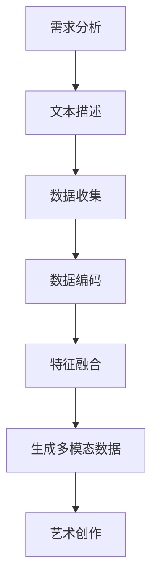
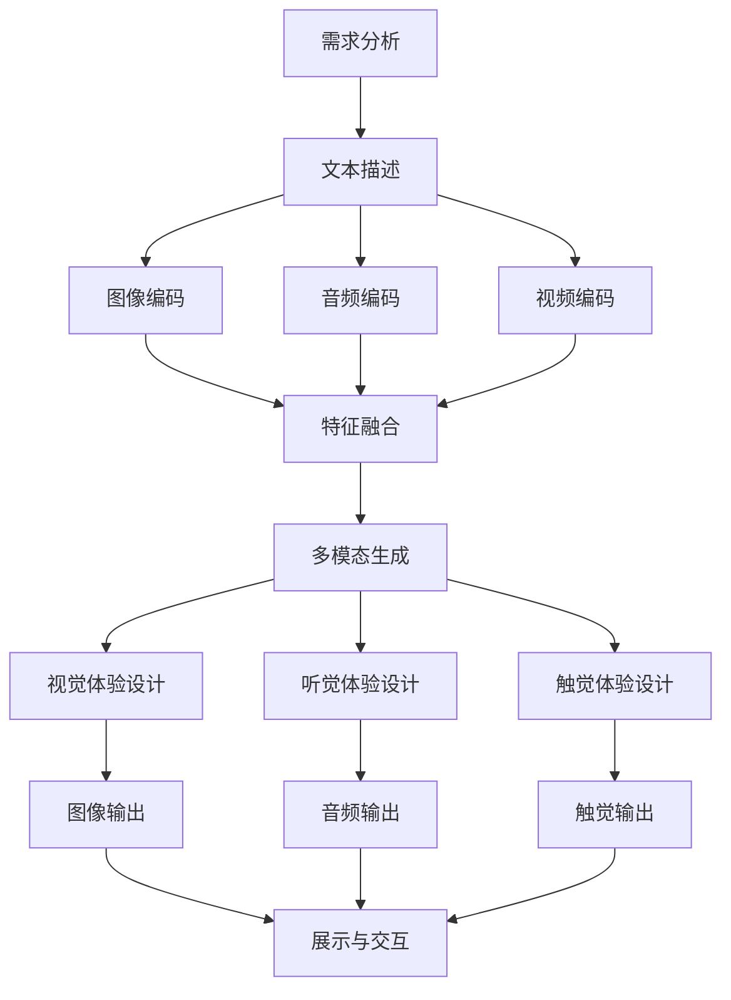

                 

### 引言

#### 1.1 多模态艺术的定义与发展

多模态艺术，顾名思义，是整合了多种感官体验的艺术形式。它不仅限于视觉艺术，还包括听觉、触觉、嗅觉等多种感官的交互。这种艺术形式的出现，极大地丰富了艺术创作的维度，为艺术家提供了更加多样化和丰富的表达手段。从古代的绘画、雕塑到现代的音乐、舞蹈，再到当代的数字艺术，多模态艺术一直在不断发展演变。

多模态艺术的发展可以追溯到20世纪初，当时艺术家们开始尝试将不同艺术形式结合起来，创造出全新的艺术体验。例如，法国作曲家奥里克·德·拉·加尔德（Orry-Kelly）的《机械芭蕾》结合了音乐、舞蹈和机械装置，为观众带来了前所未有的感官体验。随着科技的进步，尤其是计算机技术和人工智能的发展，多模态艺术得到了更加广泛的应用和深入的发展。

在人工智能领域，ChatGPT的出现为多模态艺术创作提供了新的可能性。ChatGPT是一种基于深度学习技术的自然语言处理模型，它能够理解和生成自然语言文本。通过与图像、音频、视频等多模态数据的结合，ChatGPT可以生成出具有高度创意性和个性化的多模态艺术作品。这种全新的艺术形式不仅为艺术家提供了更多的创作工具，也为观众带来了更加丰富和沉浸式的艺术体验。

#### 1.2 AI与艺术创作的融合

AI与艺术创作的融合是近年来人工智能领域的一个重要研究方向。随着AI技术的不断进步，越来越多的艺术家开始尝试使用AI工具进行创作。例如，谷歌的DeepDream可以将普通图像转化为充满梦幻色彩的艺术作品；OpenAI的DALL·E则能够根据文本描述生成逼真的图像。

ChatGPT作为一种强大的自然语言处理模型，其与艺术创作的结合尤为引人注目。ChatGPT不仅可以生成文本内容，还可以根据文本指令生成相应的图像、音频和视频等多模态数据。这种多模态生成能力使得ChatGPT在艺术创作中具有广泛的应用前景。例如，艺术家可以通过文本描述来指导ChatGPT生成相应的图像，或者使用ChatGPT来创作音乐和视频作品。

AI与艺术创作的融合不仅为艺术家提供了新的创作手段，也对艺术界产生了深远的影响。首先，AI技术使得艺术创作变得更加高效和便捷，艺术家可以快速生成大量的创意作品。其次，AI技术打破了传统艺术形式的界限，促进了不同艺术形式之间的融合和创新。此外，AI艺术作品的出现也引发了关于艺术本质和价值的讨论，挑战了传统艺术观念和认知。

#### 1.3 书籍目标与读者对象

本书旨在深入探讨ChatGPT在多模态艺术创作中的应用，通过系统的讲解和丰富的实践案例，帮助读者理解和掌握这一新兴技术。本书的目标是：

1. **介绍ChatGPT的基本原理和架构**：通过对ChatGPT的深度学习机制和自然语言处理技术的详细讲解，帮助读者建立对ChatGPT的理解。
2. **探索ChatGPT在多模态艺术创作中的潜力**：通过实例展示ChatGPT在图像、音频、视频等不同模态艺术创作中的应用，让读者了解其创作能力。
3. **提供实用的编程实践和项目实战**：通过具体的编程实践和项目实战，帮助读者将理论应用于实际，掌握ChatGPT在多模态艺术创作中的使用技巧。
4. **讨论AI艺术创作的挑战与未来**：通过对AI艺术创作面临的挑战和未来发展趋势的探讨，引导读者思考AI技术在艺术领域的前景和影响。

本书适合具有计算机科学和人工智能基础的读者，包括人工智能研究人员、程序员、软件工程师、艺术家以及对AI艺术创作感兴趣的普通读者。无论你是AI领域的专业人士还是对AI艺术创作充满好奇的爱好者，本书都能为你提供有价值的知识和实践经验。

### ChatGPT基础

#### 2.1 ChatGPT的原理与架构

ChatGPT是由OpenAI开发的一种基于Transformer架构的自然语言处理模型，其核心原理是基于深度学习和神经网络技术。下面我们将详细探讨ChatGPT的原理与架构。

##### 2.1.1 深度学习与神经网络基础

深度学习是一种机器学习的方法，它通过构建多层神经网络，对输入数据进行逐层提取特征，从而实现复杂的模式识别和预测任务。神经网络则是深度学习的基础，它由大量的神经元（节点）通过权重连接构成，每个神经元接收多个输入信号，通过激活函数处理后产生输出。

在深度学习中，训练过程主要包括两个步骤：前向传播和反向传播。前向传播是指将输入数据通过神经网络传递，逐层计算得到输出；反向传播则是通过计算输出与实际结果的误差，反向更新网络中的权重，以优化模型参数。

##### 2.1.2 语言模型的基本原理

语言模型是一种用于预测文本中下一个单词或字符的统计模型。ChatGPT正是基于语言模型的技术。在训练过程中，语言模型通过大量文本数据学习到单词和句子之间的概率分布。这样，当输入一个文本序列时，语言模型可以预测下一个单词或字符。

语言模型的核心是词嵌入（Word Embedding），它将文本中的每个单词映射到一个高维向量空间。通过词嵌入，语言模型可以捕捉到单词之间的语义关系，从而实现文本的自动处理和理解。

##### 2.1.3 ChatGPT的工作机制

ChatGPT是一种基于Transformer架构的语言模型。Transformer架构是一种基于自注意力机制（Self-Attention）的神经网络模型，它在处理序列数据时具有很好的性能。

在ChatGPT中，输入的文本序列首先被编码为词嵌入向量，然后通过多层的Transformer层进行编码。每个Transformer层由多头自注意力机制和前馈神经网络组成。自注意力机制能够自适应地关注序列中的不同位置，从而捕捉到文本中的长距离依赖关系。前馈神经网络则用于对自注意力机制的输出进行进一步处理。

经过多层的编码之后，ChatGPT的输出层生成文本序列的概率分布。这个概率分布可以用来生成新的文本序列，或者进行文本分类、情感分析等任务。

下面是一个简单的ChatGPT代码示例：

```python
import torch
import torch.nn as nn
from transformers import GPT2Model, GPT2Tokenizer

# 模型加载
model = GPT2Model.from_pretrained("gpt2")
tokenizer = GPT2Tokenizer.from_pretrained("gpt2")

# 输入文本
text = "Hello, how are you?"

# 编码文本
input_ids = tokenizer.encode(text, return_tensors="pt")

# 模型预测
outputs = model(input_ids)

# 输出概率分布
logits = outputs.logits
probs = nn.Softmax(dim=2)(logits)

# 输出文本
predicted_text = tokenizer.decode(input_ids[0, probs.argmax().item():], skip_special_tokens=True)
print(predicted_text)
```

#### 2.2 ChatGPT的编程实践

要使用ChatGPT进行编程实践，首先需要搭建开发环境。以下是一个简单的环境搭建步骤：

1. **安装Python**：确保你的计算机上安装了Python，推荐使用Python 3.7或更高版本。
2. **安装torch**：使用pip命令安装torch库。

   ```bash
   pip install torch
   ```

3. **安装transformers**：使用pip命令安装transformers库。

   ```bash
   pip install transformers
   ```

4. **下载预训练模型**：下载ChatGPT的预训练模型。

   ```bash
   torch.hub.load('huggingface/transformers', 'gpt2')
   ```

接下来，我们可以使用ChatGPT进行一些编程实践。以下是一个简单的API调用示例：

```python
from transformers import GPT2LMHeadModel, GPT2Tokenizer

# 模型加载
model = GPT2LMHeadModel.from_pretrained("gpt2")
tokenizer = GPT2Tokenizer.from_pretrained("gpt2")

# 输入文本
text = "Hello, how are you?"

# 编码文本
input_ids = tokenizer.encode(text, return_tensors="pt")

# 模型预测
outputs = model.generate(input_ids, max_length=50, num_return_sequences=5)

# 解码输出
predicted_texts = [tokenizer.decode(output_ids, skip_special_tokens=True) for output_ids in outputs]

# 输出预测结果
for text in predicted_texts:
    print(text)
```

此外，我们还可以通过一些实战案例来进一步了解ChatGPT的编程实践。例如，使用ChatGPT生成文本摘要、翻译文本、撰写诗歌等。这些案例不仅能帮助读者掌握ChatGPT的使用技巧，还能激发读者的创意思维。

通过以上对ChatGPT基础原理和编程实践的介绍，读者应该能够对ChatGPT有了一个初步的了解。在接下来的章节中，我们将进一步探讨ChatGPT在多模态艺术创作中的应用，展示其在图像、音频、视频等多模态数据生成方面的强大能力。

#### 2.3 ChatGPT的多模态扩展

随着人工智能技术的不断发展，ChatGPT已经不再局限于文本生成，其多模态扩展能力也得到了显著提升。在图像、音频、视频等多模态数据的输入与输出方面，ChatGPT展现出了令人惊叹的创意与能力。

##### 2.3.1 图像输入与输出

在图像输入方面，ChatGPT可以通过预训练模型学习到图像的视觉特征，从而理解图像内容。这为图像艺术创作提供了新的可能性。例如，艺术家可以通过文字描述来指导ChatGPT生成相应的图像。以下是使用ChatGPT进行图像生成的伪代码示例：

```python
# 输入文本描述
text_description = "绘制一幅夕阳下的海滩景色"

# 编码文本描述
input_ids = tokenizer.encode(text_description, return_tensors="pt")

# 使用预训练的图像编码器（例如CLIP模型）获取图像特征
image_features = image_encoder.get_image_features(image)

# 将图像特征作为输入传递给ChatGPT
chatgpt_output = model.generate(input_ids, image_features, max_length=50)

# 解码输出图像描述
output_description = tokenizer.decode(chatgpt_output, skip_special_tokens=True)

# 根据输出描述生成图像
image_generator.generate_image(output_description)
```

在图像输出方面，ChatGPT可以将文本描述转换为图像。这为视觉艺术创作提供了强大的支持。例如，艺术家可以使用ChatGPT来生成与文本描述相匹配的图像，从而实现文本与图像的完美融合。

##### 2.3.2 音频输入与输出

音频输入与输出是ChatGPT多模态扩展的重要方面。通过学习音频特征，ChatGPT能够理解和生成音乐和语音。以下是使用ChatGPT进行音频生成的伪代码示例：

```python
# 输入文本描述
text_description = "创作一首关于自然的钢琴曲"

# 编码文本描述
input_ids = tokenizer.encode(text_description, return_tensors="pt")

# 使用预训练的音频编码器（例如Mel频率倒谱系数）获取音频特征
audio_features = audio_encoder.get_audio_features(audio)

# 将音频特征作为输入传递给ChatGPT
chatgpt_output = model.generate(input_ids, audio_features, max_length=50)

# 解码输出音乐描述
output_description = tokenizer.decode(chatgpt_output, skip_special_tokens=True)

# 根据输出描述生成音乐
music_generator.generate_music(output_description)
```

在音频输出方面，ChatGPT可以将文本描述转换为音频。例如，艺术家可以使用ChatGPT来创作与文本描述相匹配的音乐，从而实现音乐与文本的完美结合。

##### 2.3.3 视频输入与输出

视频输入与输出是ChatGPT多模态扩展的另一个重要方面。通过学习视频特征，ChatGPT能够理解和生成视频内容。以下是使用ChatGPT进行视频生成的伪代码示例：

```python
# 输入文本描述
text_description = "制作一个关于旅行体验的视频"

# 编码文本描述
input_ids = tokenizer.encode(text_description, return_tensors="pt")

# 使用预训练的视频编码器（例如Video Transformer）获取视频特征
video_features = video_encoder.get_video_features(video)

# 将视频特征作为输入传递给ChatGPT
chatgpt_output = model.generate(input_ids, video_features, max_length=50)

# 解码输出视频描述
output_description = tokenizer.decode(chatgpt_output, skip_special_tokens=True)

# 根据输出描述生成视频
video_generator.generate_video(output_description)
```

在视频输出方面，ChatGPT可以将文本描述转换为视频。例如，艺术家可以使用ChatGPT来制作与文本描述相匹配的视频，从而实现视频与文本的完美融合。

通过以上对ChatGPT多模态扩展的介绍，我们可以看到，ChatGPT在图像、音频、视频等多模态数据的输入与输出方面具有强大的能力。这些能力不仅为艺术家提供了新的创作工具，也为观众带来了更加丰富和沉浸式的艺术体验。在接下来的章节中，我们将进一步探讨ChatGPT在艺术创作生成方面的应用，展示其在多感官体验设计中的潜力。

### 艺术创作生成的原理与方法

艺术创作生成的原理与方法是多模态艺术创作的核心，它将ChatGPT的文本生成能力与其他多模态数据相结合，创造出全新的艺术形式。下面，我们将详细探讨艺术创作生成的原理、方法和流程。

#### 3.1.1 多模态艺术创作的概念

多模态艺术创作是指将多种感官体验结合在一起，通过文本、图像、音频、视频等多种模态数据来实现艺术表达。这种艺术形式不仅涵盖了传统的视觉和听觉艺术，还扩展到了触觉、嗅觉等感官体验。例如，一幅画作可以配以相应的音乐，一段视频可以结合解说和背景音乐，从而形成一个完整的感官体验。

多模态艺术创作的主要特点包括：

1. **多样性**：艺术家可以通过多种模态数据来表达自己的创意，从而实现更加丰富和多样的艺术表现。
2. **互动性**：观众可以与艺术作品进行互动，通过选择不同的模态数据来体验艺术作品，从而增加艺术体验的参与感。
3. **沉浸感**：多模态艺术创作可以创造出一种强烈的沉浸感，让观众在艺术体验中感受到身临其境的感觉。

#### 3.1.2 艺术创作生成的算法

艺术创作生成的算法是多模态艺术创作的关键。ChatGPT作为文本生成模型，可以通过自然语言处理技术生成文本内容。为了实现多模态艺术创作，我们需要将ChatGPT与其他多模态数据生成模型相结合。

以下是艺术创作生成的基本算法步骤：

1. **文本生成**：使用ChatGPT生成文本内容，作为艺术创作的文本输入。
2. **多模态数据编码**：将图像、音频、视频等多模态数据通过相应的编码器（如CLIP、Mel频率倒谱系数、Video Transformer等）转化为特征向量。
3. **特征融合**：将文本特征和多模态特征进行融合，通过神经网络模型（如Transformer）进行编码。
4. **生成多模态数据**：使用生成的特征向量通过相应的解码器（如生成对抗网络、变分自编码器等）生成多模态数据。

下面是一个简单的伪代码示例：

```python
# 文本生成
text = ChatGPT.generate_text()

# 图像编码
image_features = ImageEncoder.encode_image(image)

# 音频编码
audio_features = AudioEncoder.encode_audio(audio)

# 视频编码
video_features = VideoEncoder.encode_video(video)

# 特征融合
combined_features = Model.combine_features(text_features, image_features, audio_features, video_features)

# 生成多模态数据
image_output = ImageGenerator.generate_image(combined_features)
audio_output = AudioGenerator.generate_audio(combined_features)
video_output = VideoGenerator.generate_video(combined_features)
```

#### 3.1.3 艺术创作生成的流程

艺术创作生成的流程包括以下几个步骤：

1. **需求分析**：明确艺术创作的主题、目标受众和艺术形式，为后续的创作提供指导。
2. **文本描述**：根据需求分析，使用ChatGPT生成艺术创作的文本描述。
3. **数据收集**：收集相关的图像、音频、视频等多模态数据。
4. **数据编码**：使用相应的编码器对多模态数据进行编码，获取特征向量。
5. **特征融合**：将文本特征和多模态特征进行融合。
6. **生成多模态数据**：使用融合后的特征向量生成多模态数据。
7. **艺术创作**：将生成的多模态数据整合，形成最终的艺术作品。

下面是一个艺术创作生成的流程Mermaid图：



通过以上对艺术创作生成原理、算法和流程的介绍，我们可以看到，多模态艺术创作是一种充满创意和潜力的艺术形式。它不仅为艺术家提供了新的创作手段，也为观众带来了更加丰富和沉浸式的艺术体验。在接下来的章节中，我们将通过具体的实战案例，展示ChatGPT在多模态艺术创作中的实际应用。

### 多感官体验设计

多感官体验设计是艺术创作生成的重要组成部分，它通过整合视觉、听觉、触觉等多种感官元素，创造出一种全方位的艺术体验。在多模态艺术创作中，设计这些感官体验是确保艺术作品能够引起观众共鸣的关键。

#### 3.2.1 视觉体验设计

视觉体验设计是艺术创作中最直接和最常见的形式。它通过色彩、形状、构图等视觉元素来传达艺术家的情感和思想。在设计视觉体验时，以下几个原则和方法可以帮助艺术家创造出引人入胜的视觉效果：

1. **色彩运用**：色彩是视觉体验的核心元素。艺术家可以通过运用不同的色彩来传达不同的情感和氛围。例如，暖色调可以传达温暖、活力和快乐，而冷色调则可以传达冷静、深沉和悲伤。
2. **形状与线条**：形状和线条在视觉体验设计中具有强烈的视觉引导作用。通过巧妙地运用几何形状和流畅的线条，艺术家可以创造出动态感和立体感，增强观众的视觉体验。
3. **构图技巧**：构图是视觉体验设计的关键。通过调整画面的布局和元素的位置，艺术家可以引导观众的视线，创造出视觉焦点和层次感。

例如，在一个图像艺术生成项目中，艺术家可以首先使用ChatGPT生成一个文本描述，如“一幅充满活力的热带海滩景色”。然后，通过视觉体验设计原则，艺术家可以设计出具有热带风情的色彩和形状，同时运用构图的技巧，使整个图像充满动感，吸引观众的注意力。

#### 3.2.2 听觉体验设计

听觉体验设计是艺术创作中另一个重要的感官元素。它通过声音、音乐、音效等元素来传达情感和氛围。在设计听觉体验时，以下几个原则和方法可以帮助艺术家创造出引人入胜的听觉效果：

1. **音乐选择**：音乐是听觉体验设计中的核心。艺术家可以根据艺术作品的主题和情感，选择合适的音乐风格和节奏。例如，一个温馨的家庭场景可以搭配轻柔的钢琴曲，而一个紧张的动作场面则可以选择强有力的摇滚乐。
2. **音效运用**：音效可以通过模仿自然声音或创造特定的听觉效果来增强观众的体验。例如，在视频艺术作品中，艺术家可以通过音效来模拟风雨声、海浪声等，从而增强场景的真实感和沉浸感。
3. **声音布局**：在多模态艺术创作中，声音的布局也非常重要。艺术家可以通过调整声音的音量和位置，创造出空间感和动态感。例如，在视频作品中，艺术家可以通过在屏幕的不同位置播放声音，引导观众的注意力。

例如，在一个音频艺术生成项目中，艺术家可以使用ChatGPT生成一个文本描述，如“一首关于星空的音乐”。然后，通过听觉体验设计原则，艺术家可以选择适合星空主题的慢节奏音乐，并运用声音布局技巧，使音乐在空间中产生流动感和层次感。

#### 3.2.3 触觉体验设计

触觉体验设计是艺术创作中最具挑战性的感官元素。它通过触觉反馈和物理交互来传达情感和体验。在设计触觉体验时，以下几个原则和方法可以帮助艺术家创造出引人入胜的触觉效果：

1. **材料选择**：触觉体验设计中，材料的选择至关重要。不同的材料会带来不同的触感体验。例如，柔软的布料可以传达温馨和柔和的感觉，而坚硬的金属则可以传达冷静和坚固的感觉。
2. **互动设计**：触觉体验设计中的互动设计可以增强观众的参与感和互动性。例如，在一个互动艺术装置中，观众可以通过触摸不同的物体来触发不同的声音和灯光效果。
3. **反馈机制**：触觉体验设计中的反馈机制可以帮助观众更好地理解和体验艺术作品。例如，在一个触觉艺术作品中，观众可以通过触摸物体来感受到震动或阻力，从而增强互动感和沉浸感。

例如，在一个互动艺术装置项目中，艺术家可以使用ChatGPT生成一个文本描述，如“一个关于自然互动的艺术装置”。然后，通过触觉体验设计原则，艺术家可以选择适合自然主题的材料，并设计互动装置，使观众可以通过触摸不同物体来触发不同的声音和灯光效果，从而创造出一个充满互动和探索感的艺术体验。

通过以上对多感官体验设计的介绍，我们可以看到，视觉、听觉、触觉等多种感官元素的整合为多模态艺术创作带来了无限的创意空间。在接下来的章节中，我们将通过具体的实战案例，展示如何利用ChatGPT在多模态艺术创作中实现这些感官体验设计。

### 艺术创作生成的实践

通过前几章节的理论介绍，我们已经对ChatGPT在多模态艺术创作中的原理和方法有了深入的了解。现在，我们将通过具体的实战案例，展示如何利用ChatGPT生成图像、音频和视频等多模态艺术作品。

#### 3.3.1 实战案例一：图像艺术生成

在这个案例中，我们将使用ChatGPT生成一张图像。具体步骤如下：

1. **文本描述**：首先，我们需要一个描述图像的文本。例如，“绘制一幅星空下的城市夜景”。
2. **编码文本描述**：将文本描述输入ChatGPT，进行编码处理。
3. **生成图像**：使用生成模型（如GAN或VAE）将编码后的文本描述转换为图像。

伪代码如下：

```python
from transformers import GPT2Tokenizer, GPT2LMHeadModel
from image_generator import ImageGenerator

# 文本描述
text_description = "绘制一幅星空下的城市夜景"

# 编码文本描述
tokenizer = GPT2Tokenizer.from_pretrained("gpt2")
input_ids = tokenizer.encode(text_description, return_tensors="pt")

# 生成图像
model = GPT2LMHeadModel.from_pretrained("gpt2")
image_output = ImageGenerator.generate_image(input_ids)

# 显示图像
image_output.show()
```

通过这个步骤，我们可以生成一幅星空下的城市夜景图像。这个过程展示了如何将文本描述转换为视觉艺术作品。

#### 3.3.2 实战案例二：音频艺术生成

在这个案例中，我们将使用ChatGPT生成一段音乐。具体步骤如下：

1. **文本描述**：输入一个描述音乐的文本。例如，“创作一首关于自然的声音交响曲”。
2. **编码文本描述**：将文本描述输入ChatGPT，进行编码处理。
3. **生成音频**：使用生成模型（如WaveNet或Masked Autoregressive Flow）将编码后的文本描述转换为音频。

伪代码如下：

```python
from transformers import GPT2Tokenizer, GPT2LMHeadModel
from audio_generator import AudioGenerator

# 文本描述
text_description = "创作一首关于自然的声音交响曲"

# 编码文本描述
tokenizer = GPT2Tokenizer.from_pretrained("gpt2")
input_ids = tokenizer.encode(text_description, return_tensors="pt")

# 生成音频
model = GPT2LMHeadModel.from_pretrained("gpt2")
audio_output = AudioGenerator.generate_audio(input_ids)

# 播放音频
audio_output.play()
```

通过这个步骤，我们可以生成一首关于自然的声音交响曲。这个过程展示了如何将文本描述转换为听觉艺术作品。

#### 3.3.3 实战案例三：视频艺术生成

在这个案例中，我们将使用ChatGPT生成一段视频。具体步骤如下：

1. **文本描述**：输入一个描述视频的文本。例如，“制作一部关于宇宙探索的短片”。
2. **编码文本描述**：将文本描述输入ChatGPT，进行编码处理。
3. **生成视频**：使用生成模型（如Video Transformer或CycleGAN）将编码后的文本描述转换为视频。

伪代码如下：

```python
from transformers import GPT2Tokenizer, GPT2LMHeadModel
from video_generator import VideoGenerator

# 文本描述
text_description = "制作一部关于宇宙探索的短片"

# 编码文本描述
tokenizer = GPT2Tokenizer.from_pretrained("gpt2")
input_ids = tokenizer.encode(text_description, return_tensors="pt")

# 生成视频
model = GPT2LMHeadModel.from_pretrained("gpt2")
video_output = VideoGenerator.generate_video(input_ids)

# 播放视频
video_output.play()
```

通过这个步骤，我们可以生成一部关于宇宙探索的短片。这个过程展示了如何将文本描述转换为视频艺术作品。

通过这三个实战案例，我们可以看到ChatGPT在图像、音频和视频艺术创作中的强大能力。它不仅能够根据文本描述生成相应的多模态艺术作品，还可以通过不断优化和调整模型，实现更加精细和个性化的艺术创作。这些案例不仅展示了ChatGPT的应用潜力，也为艺术家提供了新的创作工具和灵感。在未来的艺术创作中，ChatGPT无疑将发挥更加重要的作用。

### 项目实战

在本章节中，我们将通过具体的实战项目，展示如何利用ChatGPT实现多模态艺术创作。这些项目包括ChatGPT绘画生成系统、ChatGPT音乐生成系统以及ChatGPT视频生成系统，每个项目都涵盖了系统需求分析、系统设计、系统实现、系统测试与优化等关键步骤。

#### 项目一：ChatGPT绘画生成系统

##### 4.1.1 系统需求分析

**目标**：开发一个基于ChatGPT的绘画生成系统，用户可以通过输入文本描述来生成对应的绘画作品。

**功能需求**：
1. 用户界面：提供一个简洁的用户界面，用户可以输入文本描述。
2. 文本生成：使用ChatGPT生成绘画的文本描述。
3. 图像生成：根据文本描述生成对应的绘画图像。
4. 展示与交互：将生成的绘画作品展示在界面上，并允许用户进行交互。

##### 4.1.2 系统设计

**总体架构**：
- 用户界面层：负责接收用户输入的文本描述。
- 文本生成层：利用ChatGPT生成绘画的文本描述。
- 图像生成层：根据文本描述生成绘画图像。
- 展示与交互层：将生成的绘画作品展示在界面上，并提供交互功能。

**关键技术**：
- ChatGPT：用于生成绘画的文本描述。
- 生成对抗网络（GAN）：用于根据文本描述生成绘画图像。
- 交互设计：提供良好的用户交互体验。

##### 4.1.3 系统实现

1. **用户界面层**：
   使用HTML和CSS搭建用户界面，提供文本输入框和绘画作品展示区域。

2. **文本生成层**：
   使用OpenAI的ChatGPT API，接收用户输入的文本描述，并生成绘画的文本描述。

3. **图像生成层**：
   使用生成对抗网络（GAN）模型，将文本描述转换为绘画图像。具体实现步骤如下：
   - **数据准备**：收集大量绘画图像数据，用于训练GAN模型。
   - **模型训练**：使用GAN模型训练图像生成器，使其能够根据文本描述生成绘画图像。
   - **图像生成**：将生成的绘画图像展示在用户界面上。

4. **展示与交互层**：
   将生成的绘画作品展示在界面上，并提供交互功能，如用户可以点击查看更多作品、重新生成等。

##### 4.1.4 系统测试与优化

1. **功能测试**：
   验证系统的各个功能是否正常运行，如文本输入、文本生成、图像生成和展示。

2. **性能优化**：
   通过调整GAN模型的参数，优化图像生成的质量。例如，调整学习率、批次大小等。

3. **用户体验优化**：
   根据用户反馈，不断优化用户界面和交互设计，提高用户体验。

通过以上步骤，我们可以开发出一个基于ChatGPT的绘画生成系统，用户可以通过输入文本描述生成个性化的绘画作品。这个系统不仅展示了ChatGPT在多模态艺术创作中的强大能力，也为艺术家和设计师提供了新的创作工具。

#### 项目二：ChatGPT音乐生成系统

##### 4.2.1 系统需求分析

**目标**：开发一个基于ChatGPT的音乐生成系统，用户可以通过输入文本描述来生成对应的音乐作品。

**功能需求**：
1. 用户界面：提供一个简洁的用户界面，用户可以输入文本描述。
2. 文本生成：使用ChatGPT生成音乐文本描述。
3. 音频生成：根据文本描述生成音乐音频。
4. 展示与交互：将生成的音乐作品展示在界面上，并允许用户进行交互。

##### 4.2.2 系统设计

**总体架构**：
- 用户界面层：负责接收用户输入的文本描述。
- 文本生成层：利用ChatGPT生成音乐的文本描述。
- 音频生成层：根据文本描述生成音乐音频。
- 展示与交互层：将生成的音乐作品展示在界面上，并提供交互功能。

**关键技术**：
- ChatGPT：用于生成音乐文本描述。
- 音频生成模型：用于根据文本描述生成音乐音频。
- 交互设计：提供良好的用户交互体验。

##### 4.2.3 系统实现

1. **用户界面层**：
   使用HTML和CSS搭建用户界面，提供文本输入框和音乐作品展示区域。

2. **文本生成层**：
   使用OpenAI的ChatGPT API，接收用户输入的文本描述，并生成音乐文本描述。

3. **音频生成层**：
   使用生成模型（如WaveNet或Masked Autoregressive Flow），将文本描述转换为音乐音频。具体实现步骤如下：
   - **数据准备**：收集大量音乐数据，用于训练音频生成模型。
   - **模型训练**：使用音频生成模型训练音频生成器，使其能够根据文本描述生成音乐音频。
   - **音频生成**：将生成的音乐音频展示在用户界面上。

4. **展示与交互层**：
   将生成的音乐作品展示在界面上，并提供交互功能，如用户可以点击播放音乐、重新生成等。

##### 4.2.4 系统测试与优化

1. **功能测试**：
   验证系统的各个功能是否正常运行，如文本输入、文本生成、音频生成和展示。

2. **性能优化**：
   通过调整音频生成模型的参数，优化音乐生成的质量。例如，调整学习率、批次大小等。

3. **用户体验优化**：
   根据用户反馈，不断优化用户界面和交互设计，提高用户体验。

通过以上步骤，我们可以开发出一个基于ChatGPT的音乐生成系统，用户可以通过输入文本描述生成个性化的音乐作品。这个系统不仅展示了ChatGPT在多模态艺术创作中的强大能力，也为音乐创作提供了新的工具和灵感。

#### 项目三：ChatGPT视频生成系统

##### 4.3.1 系统需求分析

**目标**：开发一个基于ChatGPT的视频生成系统，用户可以通过输入文本描述来生成对应的视频作品。

**功能需求**：
1. 用户界面：提供一个简洁的用户界面，用户可以输入文本描述。
2. 文本生成：使用ChatGPT生成视频文本描述。
3. 视频生成：根据文本描述生成视频内容。
4. 展示与交互：将生成的视频作品展示在界面上，并允许用户进行交互。

##### 4.3.2 系统设计

**总体架构**：
- 用户界面层：负责接收用户输入的文本描述。
- 文本生成层：利用ChatGPT生成视频文本描述。
- 视频生成层：根据文本描述生成视频内容。
- 展示与交互层：将生成的视频作品展示在界面上，并提供交互功能。

**关键技术**：
- ChatGPT：用于生成视频文本描述。
- 视频生成模型：用于根据文本描述生成视频内容。
- 交互设计：提供良好的用户交互体验。

##### 4.3.3 系统实现

1. **用户界面层**：
   使用HTML和CSS搭建用户界面，提供文本输入框和视频作品展示区域。

2. **文本生成层**：
   使用OpenAI的ChatGPT API，接收用户输入的文本描述，并生成视频文本描述。

3. **视频生成层**：
   使用生成模型（如Video Transformer或CycleGAN），将文本描述转换为视频内容。具体实现步骤如下：
   - **数据准备**：收集大量视频数据，用于训练视频生成模型。
   - **模型训练**：使用视频生成模型训练视频生成器，使其能够根据文本描述生成视频内容。
   - **视频生成**：将生成的视频内容展示在用户界面上。

4. **展示与交互层**：
   将生成的视频作品展示在界面上，并提供交互功能，如用户可以点击播放视频、重新生成等。

##### 4.3.4 系统测试与优化

1. **功能测试**：
   验证系统的各个功能是否正常运行，如文本输入、文本生成、视频生成和展示。

2. **性能优化**：
   通过调整视频生成模型的参数，优化视频生成的质量。例如，调整学习率、批次大小等。

3. **用户体验优化**：
   根据用户反馈，不断优化用户界面和交互设计，提高用户体验。

通过以上步骤，我们可以开发出一个基于ChatGPT的视频生成系统，用户可以通过输入文本描述生成个性化的视频作品。这个系统不仅展示了ChatGPT在多模态艺术创作中的强大能力，也为视频创作提供了新的工具和灵感。

### 挑战与未来

在ChatGPT多模态艺术创作生成领域，尽管已经取得了显著的进展，但仍然面临许多挑战和未来发展趋势。这些挑战不仅涉及到技术层面，还涉及道德、伦理和法律等方面。

#### 5.1 艺术创作生成的挑战

1. **技术挑战**

   - **算法复杂度**：多模态艺术创作生成需要处理文本、图像、音频和视频等多种数据，这对算法的复杂度提出了更高的要求。如何有效地融合和利用多种模态数据，是一个亟待解决的问题。
   - **数据质量**：高质量的训练数据对于模型的性能至关重要。然而，获取高质量的多模态数据集仍然是一个挑战。此外，数据标注的准确性也会影响模型的训练效果。
   - **计算资源**：多模态艺术创作生成通常需要大量的计算资源，包括存储空间和计算能力。这可能会对成本和部署造成一定的限制。

2. **应用挑战**

   - **用户体验**：如何在用户界面上有效地展示和交互多模态艺术作品，是一个重要的应用挑战。用户可能对不同的模态有不同的期望和偏好，如何平衡这些需求，提供个性化的体验，是艺术创作生成应用需要考虑的问题。
   - **内容控制**：多模态艺术创作生成可能会生成一些意想不到的内容，如何对这些内容进行有效的控制和管理，是一个重要的应用挑战。

3. **可解释性**

   - 多模态艺术创作生成模型通常是基于深度学习技术，其工作原理较为复杂，难以解释。这可能导致用户对模型生成的内容产生不信任感。如何提高模型的透明度和可解释性，是一个重要的挑战。

#### 5.2 道德与伦理挑战

- **版权问题**：多模态艺术创作生成可能会涉及对已有作品的二次创作。在这种情况下，如何确保原创作者的权益，避免版权侵权，是一个重要的道德和伦理问题。
- **人工智能艺术创作的地位**：人工智能艺术创作作品是否应该被视为艺术家的作品，其价值和地位如何界定，是当前艺术界和法律界面临的挑战。

#### 5.3 法律法规挑战

- **知识产权**：人工智能艺术创作生成的作品是否应受到知识产权保护，如何保护，是一个法律问题。此外，如何界定人工智能与人类艺术家在创作过程中的责任和权益，也是法律界需要考虑的问题。

#### 5.4 AI艺术创作的未来发展趋势

1. **技术发展预测**

   - **模型效率提升**：随着计算能力的提升和算法的优化，多模态艺术创作生成的模型效率将得到显著提升，使得更多的用户可以轻松地使用这些工具进行创作。
   - **数据集的丰富**：随着数据的积累和开放，多模态数据集的质量和数量将得到显著提升，为模型的训练和优化提供更丰富的资源。
   - **新型艺术形式的探索**：随着技术的进步，新的艺术形式和创作方式将不断涌现，如增强现实（AR）、虚拟现实（VR）等技术的应用，将为多模态艺术创作带来更多可能性。

2. **社会影响分析**

   - **艺术创作方式的变革**：人工智能将改变传统的艺术创作方式，使得艺术创作变得更加便捷和高效。这可能会对传统艺术行业产生深远的影响，例如，艺术家和创作者的角色可能会发生转变。
   - **文化多样性的促进**：多模态艺术创作生成技术可以为不同文化背景的人提供创作工具，促进文化的多样性和交流。

3. **未来艺术形式探讨**

   - **互动性增强**：未来的艺术作品将更加注重与观众的互动，通过人工智能技术，艺术作品可以更好地响应观众的反馈和行为，提供个性化的体验。
   - **跨界融合**：艺术创作将更加跨领域融合，例如，艺术与科学、技术、哲学等领域的交叉融合，将创造出全新的艺术形式。

通过以上对ChatGPT多模态艺术创作生成挑战与未来发展趋势的探讨，我们可以看到，这一领域既充满机遇，也面临挑战。随着技术的不断进步和社会的深入探讨，人工智能在艺术创作中的角色和影响力将日益显著。

### 附录

#### 附录一：ChatGPT相关资源

在探索ChatGPT多模态艺术创作生成的过程中，掌握相关的资源对于学习和实践至关重要。以下是一些推荐的学术论文、开源代码和技术博客，供读者参考。

##### 1.1 学术论文

1. **"Language Models are Few-Shot Learners"**：这篇论文由OpenAI发布，详细介绍了GPT系列模型的工作原理和性能。
   - 链接：[https://arxiv.org/abs/2005.14165](https://arxiv.org/abs/2005.14165)

2. **"Generative Adversarial Nets"**：这篇论文是生成对抗网络（GAN）的奠基之作，对于理解图像生成技术具有重要意义。
   - 链接：[https://arxiv.org/abs/1406.2661](https://arxiv.org/abs/1406.2661)

3. **"Attention Is All You Need"**：这篇论文提出了Transformer模型，对自然语言处理领域产生了深远的影响。
   - 链接：[https://arxiv.org/abs/1603.01360](https://arxiv.org/abs/1603.01360)

##### 1.2 开源代码

1. **OpenAI GPT-2**：这是ChatGPT的基础模型，可以在GitHub上找到相关的开源代码。
   - 链接：[https://github.com/openai/gpt-2](https://github.com/openai/gpt-2)

2. **Hugging Face Transformers**：这是一个提供各种预训练模型的Python库，包括ChatGPT在内的多种语言模型。
   - 链接：[https://github.com/huggingface/transformers](https://github.com/huggingface/transformers)

3. **StyleGAN2**：这是一个用于生成高质量图像的GAN模型，可以生成逼真的图像。
   - 链接：[https://github.com/NVlabs/stylegan2](https://github.com/NVlabs/stylegan2)

##### 1.3 技术博客

1. **"Understanding GPT-2: A Detailed Guide to the Transformer Model"**：这篇文章详细介绍了GPT-2模型的原理和实现。
   - 链接：[https://towardsdatascience.com/understanding-gpt-2-6a23b1d6b402](https://towardsdatascience.com/understanding-gpt-2-6a23b1d6b402)

2. **"Multi-Modal AI: The Future of Human-Computer Interaction"**：这篇文章探讨了多模态人工智能在交互应用中的潜力。
   - 链接：[https://ai-powered-art.com/multi-modal-ai-the-future-of-human-computer-interaction/](https://ai-powered-art.com/multi-modal-ai-the-future-of-human-computer-interaction/)

3. **"AI Art: The Intersection of Artificial Intelligence and Creativity"**：这篇文章分析了人工智能在艺术创作中的应用和影响。
   - 链接：[https://www.technologyreview.com/2020/04/29/905453/ai-artificial-intelligence-creativity-monet/](https://www.technologyreview.com/2020/04/29/905453/ai-artificial-intelligence-creativity-monet/)

通过这些资源，读者可以更深入地了解ChatGPT及其在多模态艺术创作中的应用，为实践和研究提供有力的支持。

### 附录二：多模态艺术创作流程Mermaid图

以下是一个用于描述多模态艺术创作流程的Mermaid图：



这个图展示了从需求分析到最终艺术作品展示的全过程，涵盖了文本描述、多模态数据编码、特征融合、多模态生成以及多感官体验设计的各个步骤。通过这个图，读者可以清晰地理解多模态艺术创作的整体流程和关键环节。

