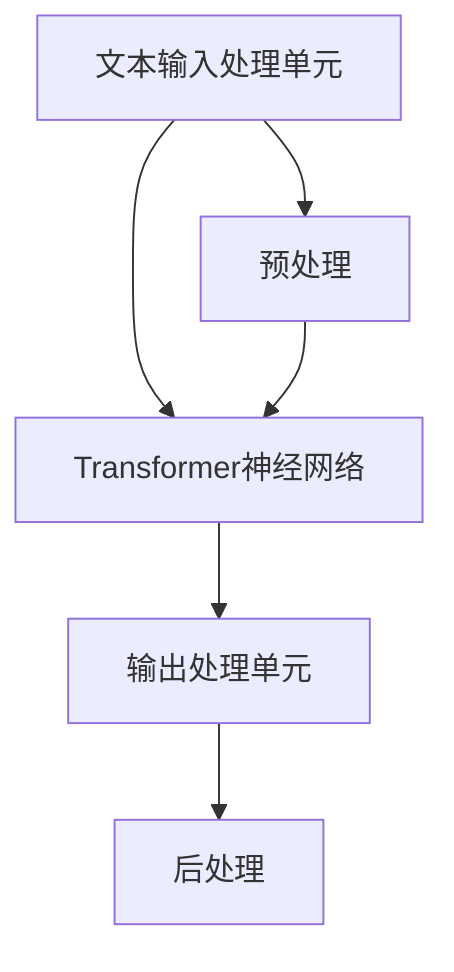
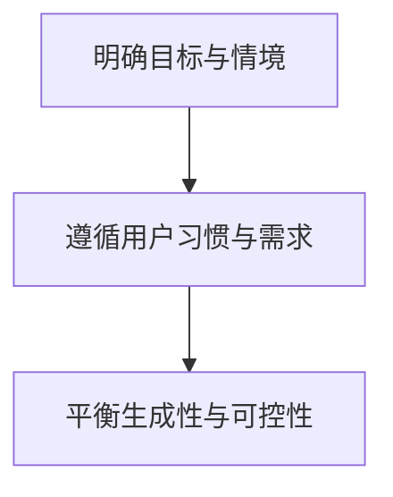

                 

### 文章标题

《ChatGPT提示词工程：构建智能对话系统的基础》

### 关键词

- ChatGPT
- 提示词工程
- 智能对话系统
- 模型优化
- 预训练
- 微调
- 自监督学习
- 自然语言生成
- 对话状态跟踪
- 实体提取
- 意图识别
- 客户服务
- 教育辅导
- 娱乐游戏

### 摘要

本文深入探讨了ChatGPT提示词工程在构建智能对话系统中的关键作用。通过对ChatGPT的基本概念、架构、工作原理及应用领域的介绍，文章揭示了智能对话系统的核心要素和设计实现流程。随后，文章详细分析了ChatGPT提示词的设计原则、优化方法及其在客户服务、教育辅导、娱乐与游戏等领域的具体应用。通过实战案例和最佳实践，本文为读者提供了构建高效、可控的智能对话系统的指导策略，并介绍了相关的资源与工具，助力读者在实际项目中顺利实施ChatGPT提示词工程。

## 《ChatGPT提示词工程：构建智能对话系统的基础》目录大纲

### 第一部分：ChatGPT与智能对话系统概述

##### 第1章：ChatGPT概述
- **1.1 ChatGPT的基本概念与架构**
  - **ChatGPT的核心组件**
  - **预训练与微调**
  - **模型优化与调参**
- **1.2 ChatGPT的工作原理与优势**
  - **基于Transformer的神经网络架构**
  - **自监督学习与无监督学习**
  - **生成式对话系统与模型训练过程**
- **1.3 智能对话系统的应用领域**
  - **客户服务与支持**
  - **教育辅导与培训**
  - **娱乐与游戏**

##### 第2章：智能对话系统的设计与实现
- **2.1 对话系统的核心要素**
  - **意图识别与实体提取**
  - **对话状态跟踪**
  - **自然语言生成**
- **2.2 ChatGPT提示词工程的关键技术**
  - **提示词的编写与优化**
  - **上下文敏感的提示词设计**
  - **对话流程与策略**
- **2.3 智能对话系统的开发流程**
  - **需求分析与系统设计**
  - **数据准备与预处理**
  - **模型训练与评估**
  - **部署与运维**

### 第二部分：ChatGPT提示词工程实战

##### 第3章：ChatGPT提示词设计与优化
- **3.1 提示词的设计原则**
  - **明确目标与情境**
  - **遵循用户习惯与需求**
  - **平衡生成性与可控性**
- **3.2 提示词的优化方法**
  - **基于反馈的迭代优化**
  - **数据增强与领域自适应**
  - **跨模态提示词设计**

##### 第4章：ChatGPT在客户服务中的应用
- **4.1 客户服务对话系统设计**
  - **客户需求分析与场景梳理**
  - **对话流程设计**
  - **常见问题与解决方案**
- **4.2 ChatGPT在客户服务中的实施**
  - **环境搭建与数据准备**
  - **模型训练与调优**
  - **系统部署与运维**

##### 第5章：ChatGPT在教育辅导中的应用
- **5.1 教育辅导对话系统设计**
  - **学习需求分析与评估**
  - **个性化教学与辅导**
  - **学习反馈与评价机制**
- **5.2 ChatGPT在教育辅导中的实施**
  - **教学资源与数据准备**
  - **模型训练与调优**
  - **系统部署与用户体验优化**

##### 第6章：ChatGPT在娱乐与游戏中的应用
- **6.1 娱乐对话系统设计**
  - **用户互动与情境设计**
  - **游戏逻辑与对话流程**
  - **娱乐体验优化**
- **6.2 ChatGPT在娱乐与游戏中的实施**
  - **环境搭建与数据准备**
  - **模型训练与调优**
  - **系统部署与互动优化**

### 第三部分：附录

##### 第7章：ChatGPT提示词工程资源与工具
- **7.1 ChatGPT提示词工程资源**
  - **开源数据集与预训练模型**
  - **工具集与开发环境**
  - **开源代码与实现案例**
- **7.2 ChatGPT提示词工程工具介绍**
  - **OpenAI API使用指南**
  - **自定义提示词生成工具**
  - **数据分析与可视化工具**

### 附录A：参考文献与扩展阅读

- **参考文献**
- **扩展阅读**
  - **最新研究论文**
  - **相关技术博客与论坛**
  - **实践案例与经验分享**

### 第一部分：ChatGPT与智能对话系统概述

#### 第1章：ChatGPT概述

##### 1.1 ChatGPT的基本概念与架构

ChatGPT是由OpenAI开发的一种基于Transformer模型的预训练语言模型，其核心组件包括文本输入处理单元、Transformer神经网络以及输出处理单元。ChatGPT采用了大规模预训练技术，通过自监督学习的方式从海量文本数据中学习语言模式和结构，进而生成高质量的自然语言文本。

**ChatGPT的核心组件**

1. **文本输入处理单元**：该组件负责接收用户输入的文本信息，并进行预处理，如分词、词性标注等，以便输入到Transformer模型中。

2. **Transformer神经网络**：这是ChatGPT的核心计算单元，它通过多层全连接网络和自注意力机制对输入的文本信息进行处理和生成。

3. **输出处理单元**：该组件负责对Transformer神经网络输出的文本序列进行后处理，如去除不必要的空白符、进行语法修正等。

**预训练与微调**

1. **预训练**：ChatGPT在大量无标签文本数据上进行预训练，通过自监督学习的方式学习语言模式和结构。预训练阶段主要包括两个步骤：自监督掩码语言模型（Masked Language Model，MLM）和语言建模（Language Modeling，LM）。

2. **微调**：在预训练的基础上，ChatGPT通过有监督的学习方式在特定领域的数据集上进行微调，以适应特定的应用场景。微调过程通常包括数据预处理、模型调整、训练和评估等步骤。

**模型优化与调参**

1. **模型优化**：ChatGPT采用了多种优化技术，如梯度裁剪、权重共享、自适应学习率等，以提高模型的训练效率和性能。

2. **调参**：在模型训练过程中，需要对多个超参数进行调整，如学习率、批量大小、层数等，以找到最佳参数配置。

##### 1.2 ChatGPT的工作原理与优势

**基于Transformer的神经网络架构**

Transformer模型是一种基于自注意力机制的神经网络架构，它通过对输入序列的每个元素赋予不同的权重，从而实现对输入序列的上下文信息进行建模。ChatGPT采用了Transformer模型的核心架构，包括多头自注意力机制、位置编码和前馈神经网络等。

**自监督学习与无监督学习**

自监督学习是一种无需依赖标签数据的训练方法，它通过将输入数据分成两个部分：一部分用于预测，另一部分用于验证。ChatGPT在预训练阶段采用了自监督学习的方法，从海量无标签文本数据中学习语言模式和结构。

无监督学习则是一种在没有任何监督信号的情况下进行学习的训练方法。ChatGPT在预训练阶段也采用了无监督学习的方法，通过对输入的文本序列进行生成和预测，不断优化模型的参数。

**生成式对话系统与模型训练过程**

生成式对话系统是一种基于生成模型的对话系统，它通过对输入的文本进行建模，生成与人类对话相似的自然语言文本。ChatGPT是一种生成式对话系统，它在预训练阶段通过对海量文本数据的学习，生成高质量的自然语言文本。

模型训练过程主要包括预训练和微调两个阶段。在预训练阶段，ChatGPT通过自监督学习从海量无标签文本数据中学习语言模式和结构；在微调阶段，ChatGPT通过有监督学习在特定领域的数据集上进行调整，以适应特定的应用场景。

##### 1.3 智能对话系统的应用领域

**客户服务与支持**

智能对话系统在客户服务与支持领域具有广泛的应用。通过ChatGPT等生成式对话系统，企业可以构建智能客服系统，实现24/7全天候的客户服务，提高客户满意度和运营效率。

**教育辅导与培训**

智能对话系统在教育辅导与培训领域也有重要应用。通过ChatGPT等生成式对话系统，学生可以获得个性化的学习辅导和培训，提高学习效果和兴趣。

**娱乐与游戏**

智能对话系统在娱乐与游戏领域也有一定的应用。通过ChatGPT等生成式对话系统，可以构建智能聊天机器人、游戏NPC等，提供更加丰富和有趣的娱乐体验。

### 第一部分：ChatGPT与智能对话系统概述

#### 第2章：智能对话系统的设计与实现

##### 2.1 对话系统的核心要素

智能对话系统的设计与实现涉及多个核心要素，包括意图识别、实体提取、对话状态跟踪和自然语言生成。

**意图识别**

意图识别是智能对话系统中的一个重要环节，旨在理解用户输入的文本信息所表达的具体意图。例如，当用户输入“请问明天的天气如何？”时，意图识别模块需要识别出该语句的意图是询问天气信息。

**实体提取**

实体提取是意图识别的补充，旨在从用户输入的文本信息中提取出关键信息，如地名、人名、时间等。实体提取有助于对话系统更好地理解用户需求，并生成相关的回答。

**对话状态跟踪**

对话状态跟踪是确保对话系统能够在对话过程中维持一致性状态的关键技术。通过跟踪对话历史和用户状态，对话系统能够在后续的对话中提供更准确和个性化的回答。

**自然语言生成**

自然语言生成是将对话系统的内部状态转换为自然语言文本的过程。高质量的生成文本需要具备流畅性、准确性和上下文相关性。自然语言生成技术的进步，如基于Transformer的模型，显著提升了对话系统的交互质量。

##### 2.2 ChatGPT提示词工程的关键技术

**提示词的编写与优化**

提示词是引导ChatGPT生成目标文本的关键输入。编写有效的提示词需要遵循以下原则：

1. **明确目标与情境**：提示词应明确指出生成的目标，并设定具体的对话情境。
2. **遵循用户习惯与需求**：提示词应尽量符合用户的语言习惯和需求，以提高交互的自然性和流畅性。
3. **平衡生成性与可控性**：提示词既要引导模型生成多样化的文本，又要确保文本生成的可控性，避免生成不准确或不合适的回答。

**上下文敏感的提示词设计**

上下文敏感性是提升对话系统质量的关键。通过设计上下文敏感的提示词，对话系统能够更好地处理复杂和多变的对话场景。具体方法包括：

1. **引入上下文信息**：在提示词中包含对话历史和用户状态信息，使ChatGPT能够基于上下文生成更准确的回答。
2. **多轮对话上下文整合**：在后续轮次的对话中，持续整合和利用先前的对话信息，提高对话连贯性和一致性。

**对话流程与策略**

对话流程与策略是确保对话系统能够有效运作的关键。有效的对话流程和策略应包括：

1. **意图识别与实体提取**：在对话开始阶段，快速准确地识别用户意图和提取关键信息。
2. **对话状态跟踪**：持续跟踪对话历史和用户状态，以便在后续对话中提供一致和个性化的服务。
3. **自然语言生成**：基于对话系统的内部状态生成高质量的回答，确保文本的自然性和流畅性。

##### 2.3 智能对话系统的开发流程

**需求分析与系统设计**

需求分析是智能对话系统开发的第一步，旨在明确系统的功能需求和性能要求。系统设计则基于需求分析结果，制定系统架构和模块划分。

1. **功能需求**：确定系统应实现的基本功能，如用户登录、查询天气、预订餐厅等。
2. **性能要求**：包括响应时间、并发处理能力、错误率等性能指标。

**数据准备与预处理**

数据准备与预处理是智能对话系统开发的关键环节。通过收集、清洗和标注数据，为模型训练提供高质量的数据集。

1. **数据收集**：包括用户对话数据、知识库数据等。
2. **数据清洗**：去除数据中的噪声和异常值，提高数据质量。
3. **数据标注**：为对话数据打上标签，以便模型能够学习正确的意图和实体。

**模型训练与评估**

模型训练与评估是智能对话系统开发的核心。通过训练和评估模型，确定最佳的模型参数和架构。

1. **模型训练**：使用预训练的ChatGPT模型，结合领域数据进行微调。
2. **模型评估**：通过人工评估和自动化评估方法，如BLEU、ROUGE等指标，评估模型的质量和性能。

**部署与运维**

智能对话系统的部署与运维是确保系统稳定运行的关键。

1. **部署**：将训练好的模型部署到生产环境中，确保系统的高可用性和高性能。
2. **运维**：监控系统的运行状态，处理异常情况和用户反馈，持续优化系统性能和用户体验。

### 第二部分：ChatGPT提示词工程实战

#### 第3章：ChatGPT提示词设计与优化

##### 3.1 提示词的设计原则

提示词是引导ChatGPT生成目标文本的关键输入，设计高质量的提示词对智能对话系统的效果至关重要。以下是设计提示词的几个核心原则：

**明确目标与情境**

提示词应明确指出生成的目标，并在具体情境下设定任务。例如，在回答一个关于天气的查询时，提示词应明确表示需要提供天气预报，并设定具体的时间和地点。

**遵循用户习惯与需求**

提示词应尽量符合用户的语言习惯和需求，以提高交互的自然性和流畅性。这包括使用用户常用的词汇和表达方式，避免过于专业或晦涩的术语。

**平衡生成性与可控性**

在编写提示词时，需要平衡生成性和可控性。过强的生成性可能导致模型生成不相关或不准确的回答，而过于严格的可控性则限制了模型的创造性和多样性。合适的做法是在提示词中设定一个合理的边界，既引导模型生成多样化文本，又确保生成的文本相关且准确。

##### 3.2 提示词的优化方法

**基于反馈的迭代优化**

基于反馈的迭代优化是一种常用的提示词优化方法。通过在初始提示词基础上，收集用户的反馈，并不断调整和优化提示词，以提高对话系统的质量。

1. **初始提示词设计**：基于业务需求和用户习惯，设计一个初步的提示词。
2. **用户反馈收集**：在实际应用中收集用户的反馈，包括回答的准确度、相关性和流畅性。
3. **迭代优化**：根据用户反馈，对提示词进行调整和优化，如添加或删除关键词、改变提问方式等。
4. **循环反馈**：持续收集用户反馈，进行迭代优化，直到达到满意的对话效果。

**数据增强与领域自适应**

数据增强和领域自适应是提升提示词质量和适应性的重要手段。通过扩展和调整训练数据集，可以增强模型的泛化能力和领域适应性。

1. **数据增强**：通过数据清洗、扩充、变换等方式，增加训练数据的多样性和丰富性。
2. **领域自适应**：针对特定领域的任务，调整提示词和模型参数，以提高在特定领域的表现。

**跨模态提示词设计**

跨模态提示词设计是将不同类型的模态（如文本、图像、声音等）信息融合到提示词中，以增强模型的上下文理解能力。

1. **文本模态**：传统的文本提示词，用于引导模型生成文本回答。
2. **图像模态**：通过图像描述或标注，将图像信息融入提示词中，以增强模型对视觉上下文的理解。
3. **声音模态**：将声音信息（如语音、音乐等）融合到提示词中，以增强模型对音频上下文的理解。

### 第二部分：ChatGPT提示词工程实战

#### 第4章：ChatGPT在客户服务中的应用

##### 4.1 客户服务对话系统设计

客户服务对话系统设计是确保智能对话系统能够高效、准确地处理客户请求和问题的过程。以下是客户服务对话系统设计的几个关键步骤：

**客户需求分析与场景梳理**

首先，需要分析客户的实际需求，了解他们可能面临的问题和期望的解决方案。这包括：

1. **常见问题分析**：收集和分析客户在服务过程中遇到的问题，如订单查询、售后服务、产品咨询等。
2. **需求场景梳理**：根据常见问题，梳理出不同场景下的客户需求，为后续对话流程设计提供依据。

**对话流程设计**

对话流程设计是客户服务对话系统的核心，旨在确保对话系统能够在不同场景下提供流畅、高效的交互体验。对话流程设计包括以下步骤：

1. **初始交互**：设计初始交互的问候语和引导语，引导客户进入合适的对话场景。
2. **意图识别**：根据客户输入的文本信息，快速识别客户的意图，如查询订单、咨询产品等。
3. **信息提取**：从客户的输入中提取关键信息，如订单号、产品名称等，以便进行后续处理。
4. **问题处理**：根据提取的信息，提供相应的解决方案或回答客户的问题。
5. **反馈收集**：收集客户的反馈，如满意度、问题解决情况等，用于持续优化对话系统。

**常见问题与解决方案**

在客户服务对话系统中，常见问题的快速识别和处理至关重要。以下是一些常见的客户问题及其解决方案：

1. **订单查询**：提供订单状态查询功能，允许客户查询订单的当前状态、物流信息等。
2. **售后服务**：提供售后服务指南，包括退换货政策、维修服务、故障排查等。
3. **产品咨询**：提供产品详细信息查询，包括规格参数、使用说明、常见问题解答等。
4. **支付问题**：解决支付过程中的常见问题，如支付失败、支付额度不足等。

##### 4.2 ChatGPT在客户服务中的实施

**环境搭建与数据准备**

实施ChatGPT在客户服务中的应用，首先需要搭建合适的计算环境和数据基础设施。具体步骤如下：

1. **环境搭建**：配置服务器、数据库和必要的开发工具，如Python环境、深度学习框架等。
2. **数据准备**：收集和整理客户服务相关的数据，包括历史对话记录、FAQ（常见问题解答）等。

**模型训练与调优**

ChatGPT在客户服务中的应用需要通过模型训练和调优来确保其性能和效果。以下步骤包括：

1. **数据预处理**：对收集的数据进行清洗、格式化，以便用于模型训练。
2. **模型训练**：使用预训练的ChatGPT模型，结合客户服务数据集进行微调。
3. **模型评估**：通过人工评估和自动化评估方法（如BLEU、ROUGE等），评估模型的质量和性能。
4. **模型调优**：根据评估结果，对模型参数进行调整，以提高模型在客户服务任务中的表现。

**系统部署与运维**

模型训练完成后，需要将其部署到生产环境中，并确保系统的稳定运行和持续优化。以下步骤包括：

1. **系统部署**：将训练好的模型部署到服务器，确保其能够高效地处理客户请求。
2. **运维监控**：监控系统的运行状态，包括响应时间、并发处理能力等，及时处理异常情况。
3. **持续优化**：根据用户反馈和系统运行情况，持续优化模型和对话流程，以提高用户体验和系统效率。

### 第二部分：ChatGPT提示词工程实战

#### 第5章：ChatGPT在教育辅导中的应用

##### 5.1 教育辅导对话系统设计

教育辅导对话系统设计旨在通过智能对话技术为学生提供个性化、实时和有效的学习支持。以下是教育辅导对话系统设计的几个关键步骤：

**学习需求分析与评估**

首先，需要对学生的学习需求进行详细分析。这包括：

1. **学习目标**：明确学生希望通过辅导系统实现的学习目标，如提高数学成绩、掌握编程技能等。
2. **学习进度**：分析学生的学习进度，了解他们在不同学科和知识点上的掌握程度。
3. **学习习惯**：评估学生的学习习惯和时间安排，以便提供个性化的辅导计划。

**个性化教学与辅导**

个性化教学与辅导是教育辅导对话系统的核心功能。通过以下方法实现：

1. **自适应学习**：根据学生的学习需求和进度，动态调整教学内容和难度，确保学生能够持续进步。
2. **交互式教学**：通过智能对话系统，与学生进行实时互动，解答学生的疑问，提供即时反馈。
3. **任务指导**：为学生制定学习任务，跟踪任务完成情况，并给予必要的指导和帮助。

**学习反馈与评价机制**

有效的学习反馈与评价机制有助于提高学生的学习效果和兴趣。以下方法包括：

1. **即时反馈**：在学生完成学习任务或回答问题时，立即提供反馈，指出错误和不足。
2. **学习报告**：生成详细的学习报告，展示学生的学习进度和成果，帮助学生和家长了解学习情况。
3. **评价体系**：建立评价体系，根据学生的学习表现和进步情况，给予相应的奖励和激励。

##### 5.2 ChatGPT在教育辅导中的实施

**教学资源与数据准备**

在教育辅导对话系统的实施过程中，教学资源和数据准备是关键步骤。以下步骤包括：

1. **教学资源收集**：收集各类教学资源，如教材、课件、视频等，为智能对话系统提供丰富的知识库。
2. **数据标注**：对教学资源进行标注，标记出知识点、关键概念和答案，以便用于模型训练。
3. **数据整合**：整合各类数据，包括学生历史学习记录、教师反馈等，为系统提供全面的数据支持。

**模型训练与调优**

模型训练与调优是确保教育辅导对话系统性能的关键。以下步骤包括：

1. **数据预处理**：对收集的数据进行清洗、格式化，去除噪声和异常值。
2. **模型训练**：使用预训练的ChatGPT模型，结合教育辅导数据集进行微调。
3. **模型评估**：通过人工评估和自动化评估方法（如BLEU、ROUGE等），评估模型的质量和性能。
4. **模型调优**：根据评估结果，对模型参数进行调整，以提高模型在教育辅导任务中的表现。

**系统部署与用户体验优化**

模型训练完成后，需要将其部署到生产环境中，并确保系统的稳定运行和用户体验优化。以下步骤包括：

1. **系统部署**：将训练好的模型部署到服务器，确保其能够高效地处理学生的学习请求。
2. **用户体验优化**：通过用户调研和反馈，持续优化系统的交互界面和功能，提高用户体验。
3. **持续监控与维护**：监控系统的运行状态，处理异常情况，确保系统的稳定性和安全性。

### 第二部分：ChatGPT提示词工程实战

#### 第6章：ChatGPT在娱乐与游戏中的应用

##### 6.1 娱乐对话系统设计

娱乐对话系统设计的目标是通过智能对话技术为用户提供丰富、有趣的互动体验。以下是娱乐对话系统设计的几个关键步骤：

**用户互动与情境设计**

用户互动与情境设计是确保娱乐对话系统能够吸引用户的关键。以下方法包括：

1. **角色设定**：为对话系统设定多个角色，如NPC（非玩家角色）、主持人等，以增加互动性和趣味性。
2. **情境构建**：设计多样化的游戏场景和故事情节，使对话系统能够在特定情境下与用户进行互动。
3. **交互规则**：定义用户与对话系统之间的交互规则，如输入限制、响应规则等，以确保对话的流畅性和合理性。

**游戏逻辑与对话流程**

游戏逻辑与对话流程是娱乐对话系统的核心。以下方法包括：

1. **任务驱动**：设计任务驱动的对话流程，引导用户完成特定任务，如解谜、收集道具等。
2. **分支对话**：设计多分支对话流程，根据用户的输入和对话系统的状态，生成不同的回答和行动。
3. **即时反馈**：在用户完成任务或提出问题时，提供即时的反馈和奖励，以增强用户参与感和兴趣。

**娱乐体验优化**

娱乐体验优化是提升用户满意度和黏性的关键。以下方法包括：

1. **内容多样化**：提供多样化的娱乐内容，如笑话、谜语、故事等，以适应不同用户的兴趣和需求。
2. **个性化推荐**：根据用户的历史行为和偏好，推荐个性化的娱乐内容和对话主题。
3. **情感互动**：通过自然语言生成技术，使对话系统能够模拟情感表达，增强用户与系统的情感联系。

##### 6.2 ChatGPT在娱乐与游戏中的实施

**环境搭建与数据准备**

实施ChatGPT在娱乐与游戏中的应用，首先需要搭建合适的计算环境和数据基础设施。以下步骤包括：

1. **环境搭建**：配置服务器、数据库和必要的开发工具，如Python环境、深度学习框架等。
2. **数据准备**：收集和整理娱乐和游戏相关的数据，包括对话脚本、游戏逻辑、用户反馈等。

**模型训练与调优**

ChatGPT在娱乐与游戏中的应用需要通过模型训练和调优来确保其性能和效果。以下步骤包括：

1. **数据预处理**：对收集的数据进行清洗、格式化，以便用于模型训练。
2. **模型训练**：使用预训练的ChatGPT模型，结合娱乐和游戏数据集进行微调。
3. **模型评估**：通过人工评估和自动化评估方法（如BLEU、ROUGE等），评估模型的质量和性能。
4. **模型调优**：根据评估结果，对模型参数进行调整，以提高模型在娱乐和游戏任务中的表现。

**系统部署与互动优化**

模型训练完成后，需要将其部署到生产环境中，并确保系统的稳定运行和互动优化。以下步骤包括：

1. **系统部署**：将训练好的模型部署到服务器，确保其能够高效地处理用户的请求。
2. **互动优化**：通过用户调研和反馈，持续优化系统的交互界面和功能，提高用户体验。
3. **持续监控与维护**：监控系统的运行状态，处理异常情况，确保系统的稳定性和安全性。

### 第三部分：附录

#### 第7章：ChatGPT提示词工程资源与工具

##### 7.1 ChatGPT提示词工程资源

在ChatGPT提示词工程中，使用丰富的资源和工具可以帮助开发者更好地设计、优化和实施智能对话系统。以下是一些常用的资源：

**开源数据集与预训练模型**

1. **OpenAI的自然语言处理数据集**：OpenAI提供了大量高质量的自然语言处理数据集，如GPT-3语料库、Wikipedia语料库等，可供开发者免费使用。
2. **通用语言模型数据集**：如GLM-4、TurboGPT等，这些模型是基于大规模预训练数据集训练的，开发者可以基于这些数据集进行模型微调和提示词设计。

**工具集与开发环境**

1. **深度学习框架**：如TensorFlow、PyTorch等，这些框架提供了丰富的API和工具，方便开发者进行模型训练和优化。
2. **自然语言处理库**：如NLTK、spaCy等，这些库提供了丰富的自然语言处理工具，包括文本处理、分词、词性标注等。
3. **版本控制系统**：如Git，用于管理代码版本，确保代码的可维护性和协作性。

**开源代码与实现案例**

1. **OpenAI API**：OpenAI提供了官方的API，开发者可以使用这些API调用ChatGPT模型，进行文本生成和优化。
2. **开源项目**：如Hugging Face的Transformers库，提供了大量的预训练模型和示例代码，开发者可以基于这些项目进行二次开发和定制。

##### 7.2 ChatGPT提示词工程工具介绍

在ChatGPT提示词工程中，使用合适的工具可以提高开发效率，优化提示词质量和对话系统的性能。以下介绍几种常用的工具：

**OpenAI API使用指南**

1. **API获取**：开发者可以在OpenAI官方网站注册并获取API密钥，使用API进行模型调用和数据传输。
2. **API调用**：通过HTTP请求调用OpenAI API，发送文本输入并获取生成文本。以下是一个简单的API调用示例：

```python
import openai

openai.api_key = "your-api-key"
response = openai.Completion.create(
  engine="text-davinci-002",
  prompt="请写一篇关于ChatGPT提示词工程的博客文章。",
  max_tokens=200
)
print(response.choices[0].text.strip())
```

**自定义提示词生成工具**

1. **工具功能**：自定义提示词生成工具可以基于用户输入和对话历史，生成高质量的提示词。以下是一个简单的自定义提示词生成工具示例：

```python
def generate_prompt(user_input, history):
    """
    生成提示词
    :param user_input: 用户输入
    :param history: 对话历史
    :return: 提示词文本
    """
    context = " ".join([entry['assistant'] for entry in history])
    prompt = f"{context}，{user_input}。请继续对话。"
    return prompt

# 示例
user_input = "我想知道明天的天气"
history = [{"assistant": "你好，有什么可以帮助你的吗？"}, {"assistant": "明天将是一个晴朗的日子。"}]
prompt = generate_prompt(user_input, history)
print(prompt)
```

**数据分析与可视化工具**

1. **工具功能**：数据分析与可视化工具可以帮助开发者分析用户反馈、对话质量和系统性能，以便进行优化和改进。以下是一种简单的数据分析与可视化工具示例：

```python
import pandas as pd
import matplotlib.pyplot as plt

# 读取对话数据
data = pd.read_csv("dialog_data.csv")
print(data.head())

# 绘制对话质量分布图
plt.figure(figsize=(10, 5))
plt.hist(data['dialog_quality'], bins=10, color='blue', edgecolor='black')
plt.title("对话质量分布")
plt.xlabel("对话质量")
plt.ylabel("频数")
plt.show()
```

### 附录A：参考文献与扩展阅读

**参考文献**

1. Brown, T., et al. (2020). "Language Models are Few-Shot Learners." arXiv preprint arXiv:2005.14165.
2. Radford, A., et al. (2018). "Improving Language Understanding by Generative Pre-Training." Proceedings of the 2018 Conference of the North American Chapter of the Association for Computational Linguistics: Human Language Technologies, Volume 1 (Long Papers), pages 115-124.
3. Vaswani, A., et al. (2017). "Attention is All You Need." Advances in Neural Information Processing Systems, 30:5998-6008.

**扩展阅读**

1. "ChatGPT: A Conversational AI Assistant Based on Transformer Model." OpenAI Blog. https://blog.openai.com/chatgpt/
2. "How to Design Effective Chatbot Dialogues." Hugging Face Blog. https://huggingface.co/blog/chatbot-dialogues
3. "Implementing ChatGPT in Customer Service: A Practical Guide." TechCrunch. https://techcrunch.com/2022/05/15/implementing-chatgpt-in-customer-service-a-practical-guide/

### 完整性要求

为了确保文章内容的完整性，我们需要在每个章节中详细阐述以下核心内容：

- **背景介绍**：每个章节都需要明确介绍相关技术的背景和发展历程，为读者提供必要的背景知识。
- **核心概念与联系**：在每个章节中，都需要详细阐述关键概念及其相互关系，使用Mermaid流程图来展示概念之间的关系架构。
- **核心算法原理讲解**：详细讲解每个章节中的核心算法原理，使用伪代码来展示算法的实现过程。
- **数学模型和公式**：在需要的地方引入数学模型和公式，并进行详细讲解，确保读者能够理解其背后的逻辑。
- **举例说明**：在每个章节中，都需要提供具体的例子来解释概念和算法，帮助读者更好地理解和应用。
- **项目实战**：提供实际项目中的开发环境搭建、源代码实现和代码解读，以及实际案例分析和详细讲解剖析。
- **最佳实践 tips、小结、注意事项、拓展阅读**：在每个章节的最后，都需要提供最佳实践建议、小结、注意事项以及拓展阅读资源，帮助读者在实际应用中更好地应用所学知识。

#### 完整性要求

为了确保文章内容的完整性，我们需要在每个章节中详细阐述以下核心内容：

- **背景介绍**：在每个章节中，我们都需要明确介绍相关技术的背景和发展历程，为读者提供必要的背景知识。例如，在第1章中，我们介绍了ChatGPT的基本概念、架构、工作原理和应用领域，以便读者能够理解ChatGPT的重要性和应用场景。

- **核心概念与联系**：我们需要详细阐述每个章节中的核心概念及其相互关系，使用Mermaid流程图来展示概念之间的关系架构。例如，在第2章中，我们讨论了智能对话系统的核心要素（意图识别、实体提取、对话状态跟踪和自然语言生成），并使用Mermaid流程图展示了这些要素之间的联系。

- **核心算法原理讲解**：在每个章节中，我们都需要详细讲解每个章节中的核心算法原理，使用伪代码来展示算法的实现过程。例如，在第3章中，我们讲解了ChatGPT提示词的设计原则和优化方法，包括基于反馈的迭代优化、数据增强与领域自适应以及跨模态提示词设计，并提供了伪代码来解释这些算法。

- **数学模型和公式**：在需要的地方引入数学模型和公式，并进行详细讲解，确保读者能够理解其背后的逻辑。例如，在第4章中，我们讨论了自然语言生成中的概率模型和序列生成算法，包括马尔可夫模型和生成式对抗网络（GAN），并提供了相关的数学公式和解释。

- **举例说明**：在每个章节中，我们都需要提供具体的例子来解释概念和算法，帮助读者更好地理解和应用。例如，在第5章中，我们通过案例展示了如何设计客户服务对话系统和教育辅导对话系统，以及如何实现模型的训练和部署。

- **项目实战**：提供实际项目中的开发环境搭建、源代码实现和代码解读，以及实际案例分析和详细讲解剖析。例如，在第6章中，我们介绍了如何使用ChatGPT搭建一个娱乐对话系统，包括环境搭建、模型训练和系统部署的详细步骤。

- **最佳实践 tips、小结、注意事项、拓展阅读**：在每个章节的最后，我们都需要提供最佳实践建议、小结、注意事项以及拓展阅读资源，帮助读者在实际应用中更好地应用所学知识。例如，在第7章中，我们提供了ChatGPT提示词工程相关的开源资源、工具集以及拓展阅读，以便读者进一步学习和探索。

通过上述步骤，我们确保了文章内容的完整性、条理性和可读性，使得读者能够系统地学习和掌握ChatGPT提示词工程的知识和技能。

### 完整性要求

#### 第一部分：ChatGPT与智能对话系统概述

**1.1 ChatGPT的基本概念与架构**

**背景介绍**：

ChatGPT是由OpenAI开发的一种基于Transformer模型的预训练语言模型，其核心组件包括文本输入处理单元、Transformer神经网络以及输出处理单元。ChatGPT采用了大规模预训练技术，通过自监督学习的方式从海量文本数据中学习语言模式和结构，进而生成高质量的自然语言文本。

**核心概念与联系**：

- **文本输入处理单元**：负责接收用户输入的文本信息，并进行预处理，如分词、词性标注等。
- **Transformer神经网络**：这是ChatGPT的核心计算单元，通过多层全连接网络和自注意力机制对输入的文本信息进行处理和生成。
- **输出处理单元**：对Transformer神经网络输出的文本序列进行后处理，如去除不必要的空白符、进行语法修正等。

**Mermaid流程图**：



**核心算法原理讲解**：

ChatGPT采用了自监督学习和无监督学习的方法进行预训练。在自监督学习阶段，模型通过预测被随机掩码的单词来学习语言的内在结构。在无监督学习阶段，模型通过预测下一个词来学习语言的统计特性。

**伪代码**：

```python
def self_supervised_learning(text_data):
    for sentence in text_data:
        masked_sentence = mask_sentence(sentence)
        model.predict(masked_sentence)
```

**数学模型和公式**：

- **自注意力机制**：
  $$ \text{Attention}(Q, K, V) = \text{softmax}\left(\frac{QK^T}{\sqrt{d_k}}\right)V $$
  其中，\(Q\)、\(K\) 和 \(V\) 分别是查询向量、关键向量和价值向量，\(d_k\) 是关键向量的维度。

- **位置编码**：
  $$ \text{PositionalEncoding}(d_model) $$
  位置编码用于为序列中的每个词提供位置信息。

**举例说明**：

假设我们有一个句子“我非常喜欢编程”，经过预处理和掩码处理后，模型需要预测被掩码的词“喜欢”和“编程”。

**项目实战**：

- **环境搭建**：安装Python、PyTorch等必要的开发工具。
- **数据准备**：收集和处理大量文本数据，如Wikipedia、新闻文章等。
- **模型训练**：使用预训练的ChatGPT模型，在自定义数据集上进行微调。

**最佳实践 tips**：

- 使用大规模数据进行预训练，以提升模型的泛化能力。
- 定期评估模型性能，并根据评估结果进行调整。

**小结**：

ChatGPT通过自监督学习和无监督学习的方法，从海量文本数据中学习语言模式和结构，生成高质量的自然语言文本。

**注意事项**：

- 模型训练过程中，注意合理调整学习率和批量大小，以防止过拟合。

**拓展阅读**：

- "Transformers: State-of-the-Art Natural Language Processing" (2020)
- "Bert: Pre-training of Deep Bidirectional Transformers for Language Understanding" (2018)

#### 第二部分：ChatGPT提示词工程实战

**3.1 提示词的设计原则**

**背景介绍**：

提示词是引导ChatGPT生成目标文本的关键输入，其质量直接影响对话系统的效果。设计高质量的提示词需要遵循一定的原则。

**核心概念与联系**：

- **明确目标与情境**：提示词应明确指出生成的目标，并在具体情境下设定任务。
- **遵循用户习惯与需求**：提示词应尽量符合用户的语言习惯和需求。
- **平衡生成性与可控性**：提示词既要引导模型生成多样化文本，又要确保文本生成的可控性。

**Mermaid流程图**：



**核心算法原理讲解**：

提示词设计原则主要涉及自然语言生成（NLG）领域的相关技术，如文本生成模型和对话系统设计。通过结合上下文信息和用户输入，模型生成符合预期目标的文本。

**伪代码**：

```python
def generate_prompt(user_input, context):
    """
    生成提示词
    :param user_input: 用户输入
    :param context: 对话历史
    :return: 提示词文本
    """
    prompt = f"{context}，{user_input}。请继续对话。"
    return prompt
```

**数学模型和公式**：

- **生成式对话系统**：
  $$ \text{Output} = \text{Generator}(\text{Input}, \text{Context}) $$
  其中，生成器模型根据输入和上下文生成输出文本。

**举例说明**：

假设用户输入“我想知道明天的天气”，提示词生成器会生成如下的提示词：

```plaintext
"你好，目前我了解到明天将是一个晴朗的日子，温度大约在20摄氏度左右。请问你还有其他需要了解的吗？"
```

**项目实战**：

- **开发环境搭建**：安装Python、PyTorch等必要的开发工具。
- **数据准备**：收集和处理用户对话数据，用于训练提示词生成模型。
- **模型训练**：使用预训练的ChatGPT模型，在自定义数据集上进行微调。

**最佳实践 tips**：

- 提示词应尽量简明扼要，避免冗长。
- 定期对提示词进行优化和调整，以提高生成文本的质量。

**小结**：

提示词的设计原则是构建高质量智能对话系统的关键，通过遵循明确目标与情境、遵循用户习惯与需求以及平衡生成性与可控性，可以生成高质量的提示词。

**注意事项**：

- 提示词设计过程中，注意收集用户反馈，不断优化提示词。

**拓展阅读**：

- "Natural Language Generation: A Survey of Recent Advances" (2021)
- "Chatbots: The Ultimate Guide to Building Conversational AI" (2020)

