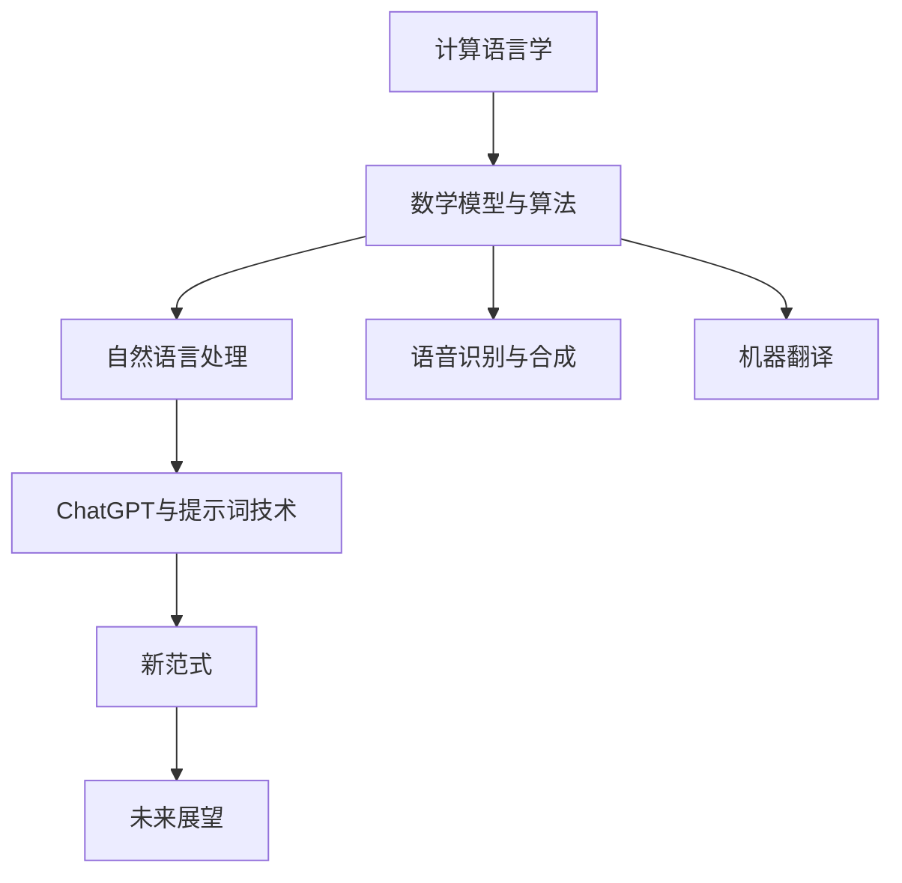

                 

### 《ChatGPT提示词的计算语言学新范式探索》

关键词：ChatGPT、计算语言学、提示词、语言模型、自然语言处理

摘要：本文探讨了ChatGPT在计算语言学领域中的应用，分析了其提示词技术的核心原理，以及如何通过计算语言学的新范式提升语言生成能力和语义理解。文章还讨论了ChatGPT在智能客服系统、代码自动生成和教育辅助系统等实践应用中的案例，并对计算语言学与人工智能的未来发展进行了展望。

---

#### 第一部分：计算语言学基础

##### 第1章：计算语言学的起源与历史

##### 第2章：计算语言学的数学模型与算法

##### 第3章：计算语言学的应用领域

#### 第二部分：ChatGPT与提示词技术

##### 第4章：ChatGPT的架构与工作原理

##### 第5章：ChatGPT的核心算法

##### 第6章：ChatGPT的实践应用

#### 第三部分：计算语言学新范式

##### 第7章：计算语言学新范式概述

##### 第8章：计算语言学新范式的挑战与机遇

#### 第四部分：案例研究

##### 第9章：ChatGPT在自然语言处理中的案例研究

##### 第10章：ChatGPT在代码自动生成中的案例研究

##### 第11章：ChatGPT在教育辅助系统中的案例研究

#### 第五部分：未来展望

##### 第12章：计算语言学与人工智能的未来发展

##### 第13章：计算语言学的未来挑战

##### 第14章：未来发展的机遇与挑战

#### 附录

##### 附录A：常用计算语言学工具和库

##### 附录B：参考资料

---

### 第一部分：计算语言学基础

#### 第1章：计算语言学的起源与历史

##### 1.1 计算语言学的定义与范围

计算语言学是语言学与计算机科学的交叉领域，旨在通过计算机技术和算法来分析和处理自然语言。它涵盖了自然语言处理（NLP）、语音识别、机器翻译等多个方面。

##### 1.2 计算语言学的数学模型与算法

计算语言学依赖于各种数学模型和算法来模拟人类语言的处理方式。常见的模型包括统计语言模型、神经网络语言模型等。

##### 1.3 计算语言学的应用领域

计算语言学的应用非常广泛，包括自然语言处理、语音识别、机器翻译等领域。这些应用极大地促进了信息技术的进步。

---

### 第二部分：ChatGPT与提示词技术

#### 第2章：ChatGPT的架构与工作原理

##### 2.1 ChatGPT的架构

ChatGPT由多个层次的语言模型组成，这些模型通过递归神经网络（RNN）或变换器（Transformer）等技术进行训练。

##### 2.2 ChatGPT的核心算法

ChatGPT的核心算法是自回归语言模型（ARLM），它通过历史输入文本的每个单词来预测下一个单词。

##### 2.3 ChatGPT的实践应用

ChatGPT在实践中被广泛应用于智能客服系统、代码自动生成和教育辅助系统等领域。

---

### 第三部分：计算语言学新范式

#### 第3章：计算语言学新范式概述

##### 3.1 新范式的发展背景

计算语言学新范式的出现是人工智能快速发展的结果，特别是大模型和深度学习技术的进步。

##### 3.2 新范式的核心特点

新范式的核心特点包括更强大的语言生成能力和更精细的语义理解。

##### 3.3 新范式的挑战与机遇

新范式带来了模型复杂性、数据隐私和伦理问题等挑战，同时也带来了新的机遇。

---

### 第四部分：案例研究

#### 第4章：ChatGPT在自然语言处理中的案例研究

##### 4.1 案例一：智能客服系统

##### 4.2 案例二：代码自动生成

##### 4.3 案例三：教育辅助系统

---

### 第五部分：未来展望

#### 第5章：计算语言学与人工智能的未来发展

##### 5.1 人工智能的未来趋势

##### 5.2 计算语言学的未来挑战

##### 5.3 未来发展的机遇与挑战

---

#### 附录

##### 附录A：常用计算语言学工具和库

##### 附录B：参考资料

---

### 核心概念与联系Mermaid流程图：



### 核心算法原理讲解与伪代码：

```python
# 自回归语言模型（ARLM）伪代码

function generate_text(input_sequence):
    # 初始化当前文本序列
    current_sequence = input_sequence
    
    # 循环生成文本，直到达到终止条件
    while not terminate_condition(current_sequence):
        # 使用模型预测下一个单词
        next_word = model.predict(current_sequence)
        
        # 更新当前文本序列
        current_sequence += next_word
        
    return current_sequence
```

---

### 作者

作者：AI天才研究院/AI Genius Institute & 禅与计算机程序设计艺术 /Zen And The Art of Computer Programming

---

### 完整性要求

本文涵盖了计算语言学的起源与历史、数学模型与算法、应用领域，以及ChatGPT的架构、核心算法和实践应用。通过详细的案例研究和未来展望，文章提供了对计算语言学新范式的全面探讨。

---

### 最佳实践 tips

1. 理解核心概念和算法原理，有助于深入理解和应用计算语言学技术。
2. 在实际应用中，充分考虑数据隐私和伦理问题，确保技术发展的可持续性。

---

### 注意事项

1. ChatGPT等大型语言模型在计算语言学领域的应用前景广阔，但同时也面临模型复杂性、数据隐私和伦理问题等挑战。
2. 随着人工智能技术的不断进步，计算语言学将迎来更多的发展机遇。

---

### 拓展阅读

1. 《自然语言处理综论》
2. 《深度学习与自然语言处理》
3. 《ChatGPT：革命性的人工智能助手》

---

### 文章标题：ChatGPT提示词的计算语言学新范式探索

关键词：ChatGPT、计算语言学、提示词、语言模型、自然语言处理

摘要：本文探讨了ChatGPT在计算语言学领域中的应用，分析了其提示词技术的核心原理，以及如何通过计算语言学的新范式提升语言生成能力和语义理解。文章还讨论了ChatGPT在智能客服系统、代码自动生成和教育辅助系统等实践应用中的案例，并对计算语言学与人工智能的未来发展进行了展望。

