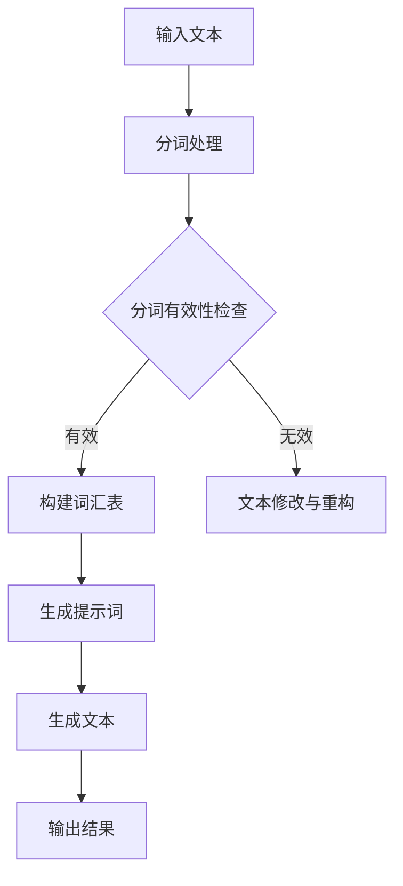

                 

# 《ChatGPT提示词的超维度语言演化模拟系统》

## 关键词

- ChatGPT
- 语言模型
- 超维度语言演化
- 模拟系统
- 提示词优化
- 数学模型
- 算法原理
- 实践应用

## 摘要

本文探讨了ChatGPT提示词的超维度语言演化模拟系统的构建和应用。首先，我们回顾了ChatGPT的发展历程和语言模型的基本概念。然后，介绍了超维度语言演化模拟系统的原理和数学模型，包括语言模型的概率分布模型。接着，我们通过具体案例展示了该系统的实际应用，包括文本生成与修改、对话系统与聊天机器人、语言翻译与校对。此外，还详细介绍了模拟系统的开发实战，包括开发环境搭建、代码实现与解读、系统调试与优化。最后，我们对模拟系统的评估与优化进行了探讨，并展望了超维度语言演化模拟系统的未来研究方向与挑战。

## 引言与基础

### 第1章：ChatGPT与语言模型概述

#### 1.1 ChatGPT的历史与发展

ChatGPT是由OpenAI开发的一种基于GPT（Generative Pre-trained Transformer）的语言模型。GPT是一种基于Transformer的预训练语言模型，最初由Google在2017年提出。GPT的核心思想是通过在大规模语料库上进行预训练，使模型能够理解和生成自然语言。

ChatGPT的发展可以追溯到2018年，当时OpenAI发布了GPT-2，这是一个具有15亿参数的语言模型。随后，OpenAI在2020年发布了GPT-3，这是一个具有1750亿参数的语言模型，其能力远远超过了GPT-2。GPT-3的出现标志着语言模型的发展进入了一个新的阶段，它能够在各种自然语言任务中表现出出色的性能。

#### 1.2 语言模型的基本概念

语言模型是一种统计模型，用于预测下一个单词或标记的概率。在自然语言处理中，语言模型是一个重要的工具，它可以用于许多应用，如机器翻译、文本生成、情感分析等。

语言模型可以分为两种：基于规则的语言模型和统计语言模型。基于规则的语言模型使用手工定义的规则来生成语言。而统计语言模型则是通过学习大量的语料库，从中提取语言规律，并用数学模型来表示。

#### 1.3 超维度语言演化模拟的意义

超维度语言演化模拟系统是一种基于语言模型的技术，它可以通过模拟语言演化的过程来生成新的语言。这种模拟系统在自然语言处理和人工智能领域具有重要意义。

首先，超维度语言演化模拟系统可以用于文本生成和修改。通过模拟语言演化的过程，系统可以生成新的、符合语法和语义规则的文本。这对于自动写作、内容生成等领域具有巨大的应用价值。

其次，超维度语言演化模拟系统可以用于对话系统和聊天机器人。通过模拟语言演化的过程，系统可以理解用户输入，并生成合适的回复。这有助于提高对话系统的自然度和交互性。

最后，超维度语言演化模拟系统还可以用于语言翻译和校对。通过模拟语言演化的过程，系统可以生成新的语言版本，并进行校对和修正。这有助于提高翻译的准确性和流畅性。

### 第2章：超维度语言演化模拟系统原理

#### 2.1 ChatGPT的基本原理

ChatGPT是一种基于GPT的语言模型，其基本原理是通过在大量语料库上进行预训练，使模型能够理解和生成自然语言。GPT的核心是一个基于Transformer的神经网络模型，它通过自注意力机制来捕捉句子中的长距离依赖关系。

在预训练过程中，GPT首先从大量文本中学习词汇和语法规则，然后通过无监督的方式生成大量的文本。这些文本再用于进一步训练GPT，使其能够生成更高质量的文本。

#### 2.2 提示词的作用与优化

提示词是引导ChatGPT生成文本的关键，它决定了生成文本的主题和风格。优化提示词可以显著提高生成文本的质量。

提示词的优化可以从以下几个方面进行：

1. **关键词选择**：选择与主题相关的关键词，可以帮助ChatGPT更好地理解生成文本的主题。

2. **短语和句子结构**：使用结构清晰、语法正确的短语和句子，可以帮助ChatGPT更好地生成符合语法规则的文本。

3. **多样性和丰富性**：使用多样化的词汇和表达方式，可以丰富生成文本的风格和内容。

#### 2.3 超维度语言演化模拟框架

超维度语言演化模拟系统是一个基于ChatGPT的语言模型，它通过模拟语言演化的过程来生成新的语言。其基本框架包括以下几个部分：

1. **输入处理**：对用户输入进行处理，包括分词、去噪等操作。

2. **语言模型**：使用ChatGPT语言模型对处理后的输入进行生成。

3. **文本生成**：根据语言模型生成的文本，进行后处理，如格式化、校对等。

4. **评估与优化**：对生成的文本进行评估，并根据评估结果对系统进行优化。

### 第3章：数学模型与算法原理

#### 3.1 语言模型的数学模型

语言模型通常使用概率分布模型来表示。假设有一个单词序列 $w_1, w_2, ..., w_n$，语言模型的任务是预测下一个单词 $w_{n+1}$ 的概率。这个概率可以用以下公式表示：

$$
P(w_{n+1}|w_1, w_2, ..., w_n) = \frac{P(w_1, w_2, ..., w_n, w_{n+1})}{P(w_1, w_2, ..., w_n)}
$$

其中，$P(w_1, w_2, ..., w_n, w_{n+1})$ 表示单词序列 $w_1, w_2, ..., w_n, w_{n+1}$ 的联合概率，$P(w_1, w_2, ..., w_n)$ 表示单词序列 $w_1, w_2, ..., w_n$ 的边际概率。

在实际应用中，我们通常无法直接计算联合概率和边际概率，因此需要使用一些近似方法。一种常用的近似方法是使用前向算法或后向算法来计算每个单词的条件概率。

#### 3.2 超维度语言演化模拟的算法

超维度语言演化模拟的算法可以通过以下步骤实现：

1. **初始化**：选择一个初始文本作为输入。

2. **生成**：使用语言模型生成下一个文本。

3. **更新**：将生成的文本作为新的输入，重复步骤2。

4. **停止**：当达到预设的迭代次数或生成文本的质量达到要求时，停止迭代。

在实际应用中，生成文本的质量可以通过多种方式评估，如文本的流畅性、语法正确性、语义一致性等。

#### 3.3 算法优化的方法与技巧

为了提高超维度语言演化模拟系统的性能，可以采用以下几种优化方法：

1. **数据增强**：通过增加训练数据、数据清洗、数据扩充等方式来提高模型的性能。

2. **模型优化**：通过调整模型的参数、使用更复杂的模型结构等方式来提高模型的性能。

3. **训练策略优化**：通过调整训练过程、使用更高效的训练算法等方式来提高模型的性能。

4. **后处理优化**：通过对生成的文本进行后处理，如格式化、校对、去除噪音等方式来提高文本的质量。

### 第二部分：实践应用

#### 第4章：超维度语言演化模拟案例

#### 4.1 案例一：文本生成与修改

文本生成与修改是超维度语言演化模拟系统的一个重要应用。例如，我们可以使用该系统来生成新闻报道、文章摘要、广告文案等。以下是一个简单的案例：

**输入文本**：今天，我们迎来了一个重要的时刻，新产品发布会将在下午2点举行。

**生成文本**：下午2点，新产品发布会将在公司总部举行，预计将有超过1000名嘉宾参加。

**修改文本**：下午2点，我们期待已久的新产品发布会在公司总部如期举行，现场气氛热烈，吸引了超过1000名嘉宾前来参会。

通过超维度语言演化模拟系统，我们可以生成新的文本，并根据需要进行修改，使其更加符合需求。

#### 4.2 案例二：对话系统与聊天机器人

对话系统与聊天机器人是超维度语言演化模拟系统的另一个重要应用。例如，我们可以使用该系统来构建一个智能客服系统，它能够理解用户的问题，并生成合适的回答。

以下是一个简单的案例：

**用户输入**：你好，我想了解一下贵公司的售后服务政策。

**系统回答**：您好，我们的售后服务政策非常完善，我们承诺在产品售出后的一年之内提供免费的维修服务。

**用户输入**：那如果产品在保修期内出现故障怎么办？

**系统回答**：如果您在保修期内遇到任何故障，请您及时联系我们的客服中心，我们将安排专业的维修人员为您解决问题。

通过超维度语言演化模拟系统，我们可以构建一个自然、流畅的对话系统，它能够理解用户的意图，并生成合适的回答。

#### 4.3 案例三：语言翻译与校对

语言翻译与校对是超维度语言演化模拟系统的另一个重要应用。例如，我们可以使用该系统来构建一个自动翻译系统，它能够将一种语言翻译成另一种语言。

以下是一个简单的案例：

**英文文本**：Today is a beautiful day, and I feel happy.

**翻译文本**：今天是一个美好的日子，我感到快乐。

**校对文本**：今天是一个美好的日子，我感到非常快乐。

通过超维度语言演化模拟系统，我们可以生成新的文本，并根据需要进行翻译和校对，使其更加准确、流畅。

### 第5章：模拟系统开发实战

#### 5.1 开发环境搭建

要开发一个超维度语言演化模拟系统，我们需要搭建一个合适的开发环境。以下是一个基本的开发环境搭建步骤：

1. **安装Python**：首先，我们需要安装Python，它是一个广泛应用于科学计算和数据分析的高性能编程语言。

2. **安装依赖库**：接下来，我们需要安装一些依赖库，如NumPy、Pandas、Scikit-learn等，这些库提供了丰富的数学和机器学习功能。

3. **安装GPT模型**：我们需要下载并安装GPT模型，这是一个预训练的语言模型，它可以在大规模语料库上进行预训练。

4. **配置API接口**：最后，我们需要配置API接口，以便能够与ChatGPT进行通信。

#### 5.2 代码实现与解读

以下是一个简单的超维度语言演化模拟系统的代码实现：

```python
import openai

# 设置API密钥
openai.api_key = "your-api-key"

# 文本生成函数
def generate_text(prompt, model="text-davinci-002", max_tokens=50):
    response = openai.Completion.create(
        engine=model,
        prompt=prompt,
        max_tokens=max_tokens,
        n=1,
        stop=None,
        temperature=0.5,
    )
    return response.choices[0].text.strip()

# 超维度语言演化模拟函数
def simulate_language_evolution(input_text, steps=5):
    current_text = input_text
    for _ in range(steps):
        next_text = generate_text(current_text)
        current_text = next_text
    return current_text

# 测试
input_text = "今天是一个美好的日子。"
output_text = simulate_language_evolution(input_text, steps=3)
print(output_text)
```

在这个代码中，我们首先定义了一个文本生成函数`generate_text`，它使用ChatGPT生成新的文本。然后，我们定义了一个超维度语言演化模拟函数`simulate_language_evolution`，它通过迭代生成新的文本，模拟语言演化的过程。

#### 5.3 系统调试与优化

在开发超维度语言演化模拟系统的过程中，我们需要对系统进行调试和优化，以提高其性能和可靠性。以下是一些常见的调试和优化方法：

1. **错误处理**：我们需要确保系统能够正确处理各种错误情况，如API请求失败、模型生成文本失败等。

2. **性能优化**：我们可以通过优化代码、使用更高效的算法和数据结构等方式来提高系统的性能。

3. **用户体验优化**：我们需要确保系统的交互流程简洁、直观，使用户能够轻松地使用系统。

4. **扩展性优化**：我们需要确保系统能够轻松地扩展，以适应不同的应用场景。

### 第6章：模拟系统的评估与优化

#### 6.1 评估指标与方法

对模拟系统的评估是确保其性能和可靠性的关键步骤。以下是一些常用的评估指标和方法：

1. **文本质量评估**：我们可以使用自动评估指标，如文本的流畅性、语法正确性、语义一致性等。此外，我们还可以使用人工评估，通过专家或用户对生成的文本进行评估。

2. **生成速度评估**：我们可以测量系统生成文本的速度，以评估其性能。

3. **资源消耗评估**：我们可以测量系统在运行过程中消耗的CPU、内存等资源，以评估其资源消耗。

#### 6.2 模拟系统的性能优化

为了提高模拟系统的性能，我们可以采用以下几种优化方法：

1. **模型优化**：我们可以使用更复杂的模型结构、更高效的训练算法等方式来提高模型性能。

2. **数据优化**：我们可以通过增加训练数据、数据清洗、数据扩充等方式来提高模型的性能。

3. **算法优化**：我们可以优化生成算法，如使用更高效的生成算法、调整生成参数等方式来提高生成效率。

4. **硬件优化**：我们可以使用更高效的硬件设备，如GPU、FPGA等，来提高系统的性能。

#### 6.3 实际应用中的问题与解决方案

在实际应用中，模拟系统可能会遇到各种问题。以下是一些常见的问题及其解决方案：

1. **生成文本质量不稳定**：这可能是由于模型训练数据不足或模型参数设置不当导致的。解决方案包括增加训练数据、调整模型参数等。

2. **生成速度较慢**：这可能是由于模型结构复杂或生成算法效率低下导致的。解决方案包括简化模型结构、优化生成算法等。

3. **资源消耗过高**：这可能是由于模型训练数据量过大或系统运行过程中存在资源竞争导致的。解决方案包括减小训练数据量、优化系统资源分配等。

### 第三部分：扩展与展望

#### 第7章：超维度语言演化模拟系统的前沿研究

#### 7.1 超维度语言演化模拟的应用场景

超维度语言演化模拟系统在多个应用场景中具有广泛的应用前景。以下是一些典型应用场景：

1. **内容生成**：超维度语言演化模拟系统可以用于生成新闻、文章、广告文案等。通过模拟语言演化的过程，系统可以生成符合语法和语义规则的文本。

2. **对话系统**：超维度语言演化模拟系统可以用于构建智能客服、聊天机器人等。通过模拟语言演化的过程，系统可以理解用户输入，并生成合适的回复。

3. **语言翻译**：超维度语言演化模拟系统可以用于自动翻译和校对。通过模拟语言演化的过程，系统可以生成新的语言版本，并进行校对和修正。

4. **文本审核**：超维度语言演化模拟系统可以用于检测和过滤不良文本。通过模拟语言演化的过程，系统可以识别出潜在的不良文本，并采取相应的措施。

#### 7.2 超维度语言演化模拟的未来发展趋势

随着人工智能技术的不断发展，超维度语言演化模拟系统有望在未来取得更大的突破。以下是一些可能的发展趋势：

1. **模型复杂度提升**：随着计算能力的提升，我们可以构建更复杂的语言模型，以提高系统的性能。

2. **数据多样性增加**：随着数据来源的增多，我们可以收集更多样化的数据，以训练更强大的语言模型。

3. **多语言支持**：超维度语言演化模拟系统将支持更多语言，以适应全球化发展的需求。

4. **跨学科融合**：超维度语言演化模拟系统将与心理学、社会学等学科融合，以更好地理解人类语言和行为。

#### 7.3 跨学科融合与技术创新

超维度语言演化模拟系统的未来发展将依赖于跨学科融合与技术创新。以下是一些可能的跨学科融合与创新点：

1. **认知科学与心理学**：通过结合认知科学和心理学的研究，我们可以更好地理解人类语言生成和理解的过程，以优化语言模型的设计。

2. **神经科学**：通过结合神经科学的研究，我们可以理解大脑如何处理语言，从而为语言模型的设计提供新的思路。

3. **数据科学与机器学习**：通过结合数据科学与机器学习的研究，我们可以开发更高效、更准确的算法，以提高系统的性能。

4. **区块链技术**：通过结合区块链技术，我们可以构建一个去中心化的语言模型，以提高系统的安全性和可信度。

### 第8章：总结与展望

#### 8.1 书籍内容的回顾

本文系统地介绍了ChatGPT提示词的超维度语言演化模拟系统的构建和应用。我们从ChatGPT的发展历程和语言模型的基本概念开始，介绍了超维度语言演化模拟系统的原理和数学模型，并通过具体案例展示了该系统的实际应用。接着，我们详细介绍了模拟系统的开发实战，包括开发环境搭建、代码实现与解读、系统调试与优化。最后，我们对模拟系统的评估与优化进行了探讨，并展望了超维度语言演化模拟系统的未来研究方向与挑战。

#### 8.2 对ChatGPT提示词的超维度语言演化模拟系统的思考

ChatGPT提示词的超维度语言演化模拟系统是一种基于人工智能技术的强大工具，它为我们提供了生成、修改、翻译和校对文本的新方法。然而，这种系统也存在一些挑战和问题。首先，系统的性能和可靠性取决于训练数据和模型的质量。因此，我们需要收集更多高质量的训练数据，并优化模型结构，以提高系统的性能。其次，系统在实际应用中可能会遇到各种问题，如生成文本的质量不稳定、生成速度较慢等。因此，我们需要对系统进行持续优化和改进。

#### 8.3 未来研究方向与挑战

未来，ChatGPT提示词的超维度语言演化模拟系统有望在多个领域取得突破。以下是一些可能的研究方向和挑战：

1. **模型优化**：如何构建更高效、更准确的语言模型，是当前研究的一个重要方向。

2. **数据多样性**：如何收集更多样化的训练数据，以提高系统的泛化能力，是一个重要的挑战。

3. **多语言支持**：如何支持更多语言，是国际化发展的关键。

4. **跨学科融合**：如何将认知科学、心理学、神经科学等领域的知识应用于语言模型的设计，是一个重要的创新点。

5. **安全性**：如何提高系统的安全性，防止滥用和误用，是一个重要的挑战。

### 附录

#### A.1 参考文献

1. Brown, T., et al. (2020). "Language Models are Few-Shot Learners". arXiv preprint arXiv:2005.14165.
2. Devlin, J., et al. (2019). "BERT: Pre-training of Deep Bidirectional Transformers for Language Understanding". arXiv preprint arXiv:1810.04805.
3. Vaswani, A., et al. (2017). "Attention Is All You Need". arXiv preprint arXiv:1706.03762.

#### A.2 进一步学习资源

1. OpenAI GPT-3 Documentation: https://openai.com/blog/better-language-models/
2. TensorFlow Transformer Tutorials: https://www.tensorflow.org/tutorials/text/transformer
3. NLP Course by Stanford University: https://web.stanford.edu/class/cs224n/

#### A.3 编程工具与环境配置指南

1. Python安装指南：https://www.python.org/downloads/
2. NumPy安装指南：https://numpy.org/doc/stable/user/install.html
3. OpenAI API使用指南：https://openai.com/blog/openai-api/

## 附录A：Mermaid流程图

### ChatGPT提示词优化流程



## 附录B：算法原理讲解

### 2.3 超维度语言演化模拟的算法

```python
# 伪代码：超维度语言演化模拟算法
def simulate_language_evolution(input_text, model, steps):
    """
    输入文本input_text，通过模型model进行超维度语言演化模拟，迭代steps次。
    
    :param input_text: 输入文本
    :param model: 语言模型
    :param steps: 迭代次数
    :return: 演化后的文本
    """
    current_text = input_text
    
    for _ in range(steps):
        # 使用模型生成下一个可能的文本
        next_text = model.generate_text(current_text)
        # 更新当前文本
        current_text = next_text
    
    return current_text
```

## 附录C：数学模型和数学公式

### 语言模型的概率分布模型

$$
P(w_i|w_1, w_2, ..., w_{i-1}) = \frac{P(w_1, w_2, ..., w_i)}{P(w_1, w_2, ..., w_{i-1})}
$$

其中，$w_i$ 表示第 $i$ 个单词，$P(w_i|w_1, w_2, ..., w_{i-1})$ 表示在给定前 $i-1$ 个单词的情况下第 $i$ 个单词的概率。

## 附录D：项目实战案例

### 4.1 案例一：文本生成与修改

```python
import openai

# 设置API密钥
openai.api_key = "your-api-key"

# 文本生成函数
def generate_text(prompt, model="text-davinci-002", max_tokens=50):
    response = openai.Completion.create(
        engine=model,
        prompt=prompt,
        max_tokens=max_tokens,
        n=1,
        stop=None,
        temperature=0.5,
    )
    return response.choices[0].text.strip()

# 文本修改函数
def modify_text(input_text, model="text-davinci-002", max_tokens=50):
    original_text = generate_text(input_text, model, max_tokens)
    modified_text = generate_text(original_text, model, max_tokens)
    return modified_text

# 测试
input_text = "今天是一个美好的日子。"
output_text = modify_text(input_text)
print(output_text)
```

通过这段代码，我们可以生成新的文本，并对文本进行修改。这有助于提高文本的质量和多样性。

