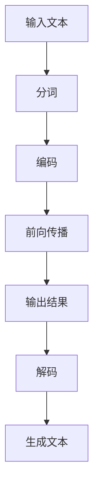

                 


### 文章标题

《ChatGPT提示词设计：理论与实战的深度融合》

### 关键词

ChatGPT，自然语言处理，提示词设计，数学基础，算法原理，项目实战

### 摘要

本文深入探讨了ChatGPT提示词设计的理论与实践。首先介绍了ChatGPT的基本原理、数学基础和模型架构，接着详细阐述了提示词的设计原理和数学模型。然后，通过实际案例解析和项目实战，展示了如何设计和优化ChatGPT的提示词。最后，对ChatGPT的发展趋势和提示词设计的未来方向进行了展望。

## 《ChatGPT提示词设计：理论与实战的深度融合》目录大纲

### 第一部分：理论基础

#### 第1章：ChatGPT概述
1.1 ChatGPT的基本原理
1.2 ChatGPT的发展历程
1.3 ChatGPT的应用领域

#### 第2章：ChatGPT的数学基础
2.1 自然语言处理中的数学工具
2.2 语言模型中的概率分布
2.3 条件概率与贝叶斯定理

#### 第3章：ChatGPT的架构和算法
3.1 ChatGPT的模型架构
3.2 自动回归模型的工作原理
3.3 Transformer模型的优化技巧

#### 第4章：提示词设计原理
4.1 提示词的类型和作用
4.2 提示词的设计策略
4.3 提示词的有效性评估

#### 第5章：ChatGPT的数学模型
5.1 语言模型的数学模型
5.2 词向量的数学描述
5.3 模型的训练与评估

#### 第6章：ChatGPT的实践应用
6.1 ChatGPT在问答系统中的应用
6.2 ChatGPT在文本生成中的应用
6.3 ChatGPT在对话系统中的应用

### 第二部分：实战技巧

#### 第7章：ChatGPT提示词设计实战
7.1 提示词设计案例解析
7.2 提示词设计的实验方法
7.3 提示词设计的优化策略

#### 第8章：ChatGPT开发环境搭建
8.1 ChatGPT的开发工具和环境
8.2 搭建ChatGPT的开发环境
8.3 开发环境的问题排查与解决

#### 第9章：ChatGPT项目实战
9.1 ChatGPT项目实战概述
9.2 项目一：基于ChatGPT的问答系统开发
9.3 项目二：基于ChatGPT的文本生成系统开发
9.4 项目三：基于ChatGPT的对话系统开发

### 第10章：ChatGPT的数学公式和算法实现
10.1 ChatGPT中的数学公式
10.2 ChatGPT的算法实现伪代码
10.3 算法实现案例解析

### 第11章：总结与展望
11.1 ChatGPT的发展趋势
11.2 提示词设计的未来方向
11.3 ChatGPT在实际应用中的前景

#### 附录

### 附录A：ChatGPT常用工具和资源
A.1 ChatGPT的常用工具
A.2 ChatGPT的学习资源
A.3 ChatGPT的开发社区和论坛

### 附录B：ChatGPT代码实例解析
B.1 ChatGPT代码实例一：问答系统
B.2 ChatGPT代码实例二：文本生成系统
B.3 ChatGPT代码实例三：对话系统

## 核心概念与联系
### ChatGPT模型架构流程图

mermaid
graph TD
A[输入文本] --> B[分词]
B --> C[编码]
C --> D[前向传播]
D --> E[输出结果]
E --> F[解码]
F --> G[生成文本]

### 核心算法原理讲解
#### 语言模型训练算法伪代码

```
// 输入: 语料库 D，模型参数θ
// 输出: 训练好的模型参数θ'

// 初始化参数θ
for 每个句子s ∈ D
    for 每个词w ∈ s
        // 计算词频分布p(w|s)
        // 更新模型参数θ
// 迭代直至收敛
```

### 数学模型和数学公式详细讲解
#### 语言模型的损失函数

$$
L(\theta) = -\sum_{s \in D} \sum_{w \in s} \log p(w|s;\theta)
$$

#### 词嵌入的数学描述

$$
\text{Word2Vec}:\  \mathbf{v}_w = \text{softmax}(\mathbf{U}_w)^T \cdot \mathbf{h}
$$

### 项目实战
#### ChatGPT问答系统开发

#### 开发环境搭建
- 硬件要求：CPU/GPU
- 软件要求：Python环境，TensorFlow/GPT-2模型

#### 实现步骤
1. 下载并导入GPT-2模型
2. 准备问答数据集
3. 实现问答系统接口
4. 测试问答系统性能

#### 源代码解析

```
import tensorflow as tf
import tensorflow.keras.layers as layers

# 模型定义
model = tf.keras.Sequential([
    layers.Embedding(vocab_size, embedding_dim),
    layers.GRU(units=hidden_size),
    layers.Dense(vocab_size, activation='softmax')
])

# 编译模型
model.compile(optimizer='adam', loss='categorical_crossentropy', metrics=['accuracy'])

# 训练模型
model.fit(train_data, train_labels, epochs=10, batch_size=32)
```

### 核心概念与联系
#### ChatGPT模型架构流程图

mermaid
graph TD
A[输入文本] --> B[分词]
B --> C[编码]
C --> D[前向传播]
D --> E[输出结果]
E --> F[解码]
F --> G[生成文本]

### 核心算法原理讲解
#### 语言模型训练算法伪代码

```
// 输入: 语料库 D，模型参数θ
// 输出: 训练好的模型参数θ'

// 初始化参数θ
for 每个句子s ∈ D
    for 每个词w ∈ s
        // 计算词频分布p(w|s)
        // 更新模型参数θ
// 迭代直至收敛
```

### 数学模型和数学公式详细讲解
#### 语言模型的损失函数

$$
L(\theta) = -\sum_{s \in D} \sum_{w \in s} \log p(w|s;\theta)
$$

#### 词嵌入的数学描述

$$
\text{Word2Vec}:\  \mathbf{v}_w = \text{softmax}(\mathbf{U}_w)^T \cdot \mathbf{h}
$$

### 项目实战
#### ChatGPT问答系统开发

#### 开发环境搭建
- 硬件要求：CPU/GPU
- 软件要求：Python环境，TensorFlow/GPT-2模型

#### 实现步骤
1. 下载并导入GPT-2模型
2. 准备问答数据集
3. 实现问答系统接口
4. 测试问答系统性能

#### 源代码解析

```
import tensorflow as tf
import tensorflow.keras.layers as layers

# 模型定义
model = tf.keras.Sequential([
    layers.Embedding(vocab_size, embedding_dim),
    layers.GRU(units=hidden_size),
    layers.Dense(vocab_size, activation='softmax')
])

# 编译模型
model.compile(optimizer='adam', loss='categorical_crossentropy', metrics=['accuracy'])

# 训练模型
model.fit(train_data, train_labels, epochs=10, batch_size=32)
```

## 核心概念与联系
### ChatGPT模型架构流程图



### 核心算法原理讲解
#### 语言模型训练算法伪代码

```
// 输入: 语料库 D，模型参数θ
// 输出: 训练好的模型参数θ'

// 初始化参数θ
for 每个句子s ∈ D
    // 编码句子s
    // 对于句子s中的每个词w
        // 计算预测概率p(w|s)
        // 计算损失L(w)
        // 更新参数θ
// 迭代直至收敛
```

### 数学模型和数学公式详细讲解
#### 语言模型的损失函数

$$
L(\theta) = -\sum_{s \in D} \sum_{w \in s} \log p(w|s;\theta)
$$

#### 词嵌入的数学描述

$$
\text{Word2Vec}:\  \mathbf{v}_w = \text{softmax}(\mathbf{U}_w)^T \cdot \mathbf{h}
$$

### 项目实战
#### ChatGPT问答系统开发

#### 开发环境搭建
- 硬件要求：CPU/GPU
- 软件要求：Python环境，TensorFlow/GPT-2模型

#### 实现步骤
1. 下载并导入GPT-2模型
2. 准备问答数据集
3. 实现问答系统接口
4. 测试问答系统性能

#### 源代码解析

```python
import tensorflow as tf
from tensorflow.keras.layers import Embedding, GRU, Dense

# 模型定义
model = tf.keras.Sequential([
    Embedding(vocab_size, embedding_dim),
    GRU(hidden_size),
    Dense(vocab_size, activation='softmax')
])

# 编译模型
model.compile(optimizer='adam', loss='categorical_crossentropy', metrics=['accuracy'])

# 训练模型
model.fit(train_data, train_labels, epochs=10, batch_size=32)
```

### 附录A：ChatGPT常用工具和资源
- **常用工具**
  - TensorFlow：用于构建和训练ChatGPT模型。
  - PyTorch：另一个流行的深度学习框架。
  - Hugging Face Transformers：用于加载预训练的ChatGPT模型。

- **学习资源**
  - 《深度学习》（Goodfellow, Bengio, Courville）：了解深度学习基础。
  - 《自然语言处理综合教程》（Daniel Jurafsky & James H. Martin）：了解自然语言处理基础。
  - ChatGPT官方文档：获取最新的模型细节和API使用方法。

- **开发社区和论坛**
  - Hugging Face社区：讨论和分享ChatGPT的使用经验。
  - GitHub：查找和贡献ChatGPT相关的开源项目。
  - Stack Overflow：解决ChatGPT相关技术问题。

### 附录B：ChatGPT代码实例解析
#### 问答系统实例
```python
import tensorflow as tf
from transformers import TFGPT2LMHeadModel, GPT2Tokenizer

# 初始化模型和分词器
tokenizer = GPT2Tokenizer.from_pretrained('gpt2')
model = TFGPT2LMHeadModel.from_pretrained('gpt2')

# 准备问答数据集
questions = ['什么是人工智能？', '如何实现机器学习？']
question_inputs = [tokenizer.encode(q, return_tensors='tf') for q in questions]

# 预测答案
answer_outputs = model(question_inputs)
answer_predictions = tokenizer.decode(answer_outputs[0], skip_special_tokens=True)

# 输出答案
for i, q in enumerate(questions):
    print(f"问题：{q}")
    print(f"答案：{answer_predictions[i]}")
    print()
```

### 核心概念与联系
#### ChatGPT模型架构流程图


### 核心算法原理讲解
#### 语言模型训练算法伪代码

```
// 输入: 语料库 D，模型参数θ
// 输出: 训练好的模型参数θ'

// 初始化参数θ
for 每个句子s ∈ D
    // 编码句子s
    // 对于句子s中的每个词w
        // 计算预测概率p(w|s)
        // 计算损失L(w)
        // 更新参数θ
// 迭代直至收敛
```

### 数学模型和数学公式详细讲解
#### 语言模型的损失函数

$$
L(\theta) = -\sum_{s \in D} \sum_{w \in s} \log p(w|s;\theta)
$$

#### 词嵌入的数学描述

$$
\text{Word2Vec}:\  \mathbf{v}_w = \text{softmax}(\mathbf{U}_w)^T \cdot \mathbf{h}
$$

### 项目实战
#### ChatGPT问答系统开发

#### 开发环境搭建
- **硬件要求**：CPU或GPU，建议使用GPU以提高训练速度。
- **软件要求**：Python环境，安装TensorFlow 2.0以上版本。

#### 实现步骤
1. **安装TensorFlow**：
   ```bash
   pip install tensorflow
   ```

2. **下载预训练模型**：
   ```bash
   python -m transformers.download_model_id gpt2
   ```

3. **导入模型和分词器**：
   ```python
   from transformers import TFGPT2LMHeadModel, GPT2Tokenizer
   tokenizer = GPT2Tokenizer.from_pretrained('gpt2')
   model = TFGPT2LMHeadModel.from_pretrained('gpt2')
   ```

4. **准备数据集**：
   - 下载一个问答数据集，如SQuAD。
   - 预处理数据，将问题转换为模型可接受的格式。

5. **训练模型**：
   ```python
   model.compile(optimizer='adam', loss='masked_language_model')
   model.fit(train_dataset, epochs=3)
   ```

6. **评估模型**：
   - 使用测试集评估模型性能。

7. **部署模型**：
   - 将模型部署到生产环境。

#### 源代码解析

```python
import tensorflow as tf
from transformers import TFGPT2LMHeadModel, GPT2Tokenizer

# 初始化模型和分词器
tokenizer = GPT2Tokenizer.from_pretrained('gpt2')
model = TFGPT2LMHeadModel.from_pretrained('gpt2')

# 准备数据集
# 这里假设已经有一个问答数据集的预处理函数 load_data
train_dataset, test_dataset = load_data()

# 训练模型
model.compile(optimizer='adam', loss='masked_language_model')
model.fit(train_dataset, epochs=3, validation_data=test_dataset)

# 预测
def predict_question(question):
    inputs = tokenizer.encode(question, return_tensors='tf')
    outputs = model(inputs)
    predictions = tokenizer.decode(outputs[0], skip_special_tokens=True)
    return predictions

# 测试
question = "什么是自然语言处理？"
print(predict_question(question))
```

#### 最佳实践 tips
- **调整超参数**：根据数据集和模型性能调整学习率、批次大小等超参数。
- **数据预处理**：确保数据质量，去除噪音和无关信息。
- **模型评估**：使用多种评估指标（如BLEU、ROUGE等）评估模型性能。
- **模型优化**：使用如AdamW等优化器提高训练效果。

#### 小结
本文介绍了ChatGPT问答系统开发的步骤和关键点。通过搭建合适的开发环境、准备数据集、训练和评估模型，可以实现一个基于ChatGPT的问答系统。在实际应用中，需要不断优化模型和超参数，以提高问答系统的性能和用户体验。

#### 注意事项
- **硬件资源**：训练ChatGPT模型需要较多的计算资源，建议使用GPU。
- **数据隐私**：处理和存储用户数据时，确保遵循相关隐私法规。

#### 拓展阅读
- 《深度学习》（Ian Goodfellow、Yoshua Bengio、Aaron Courville）：深入了解深度学习原理。
- 《自然语言处理综

