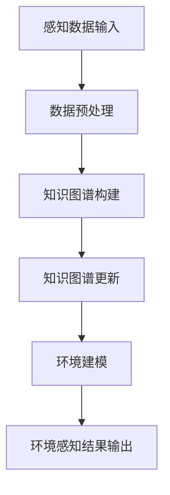
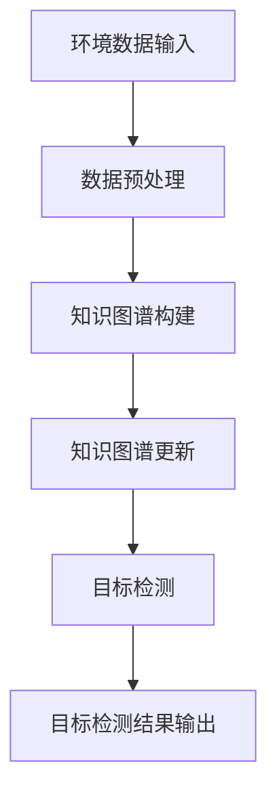
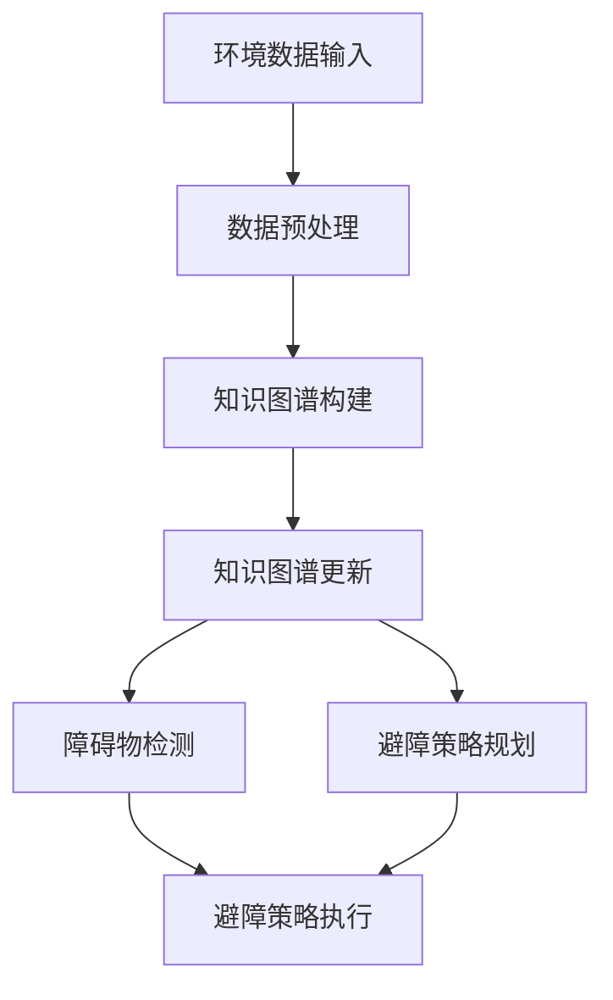
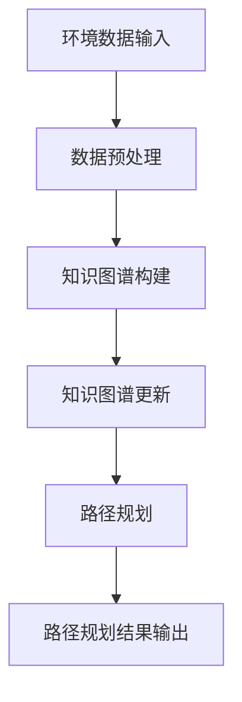
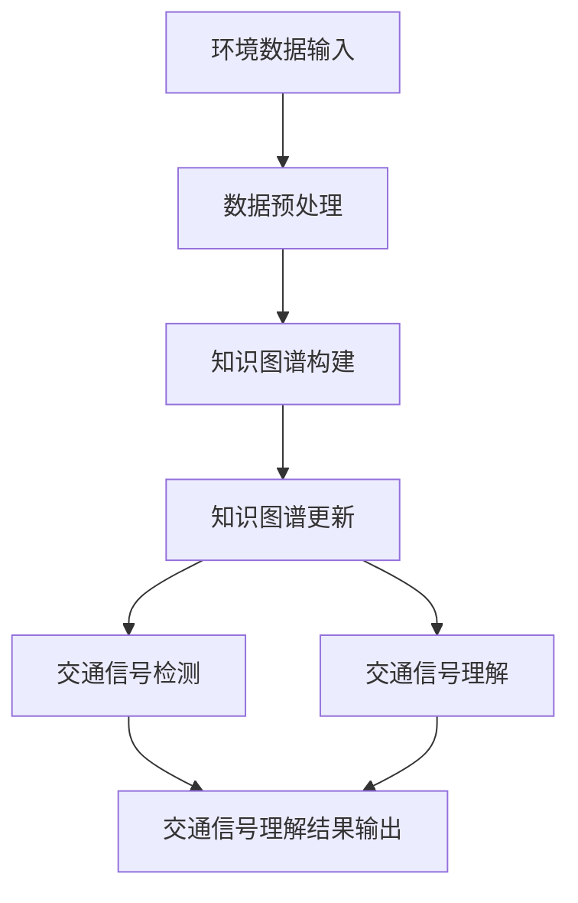
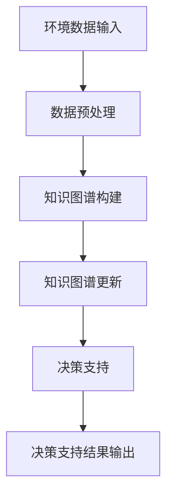
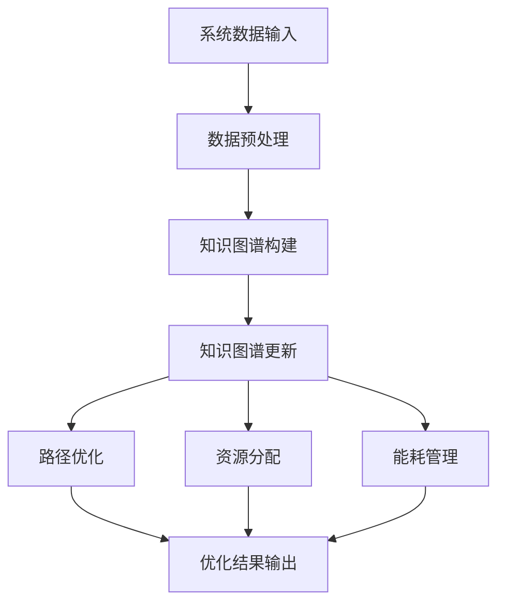
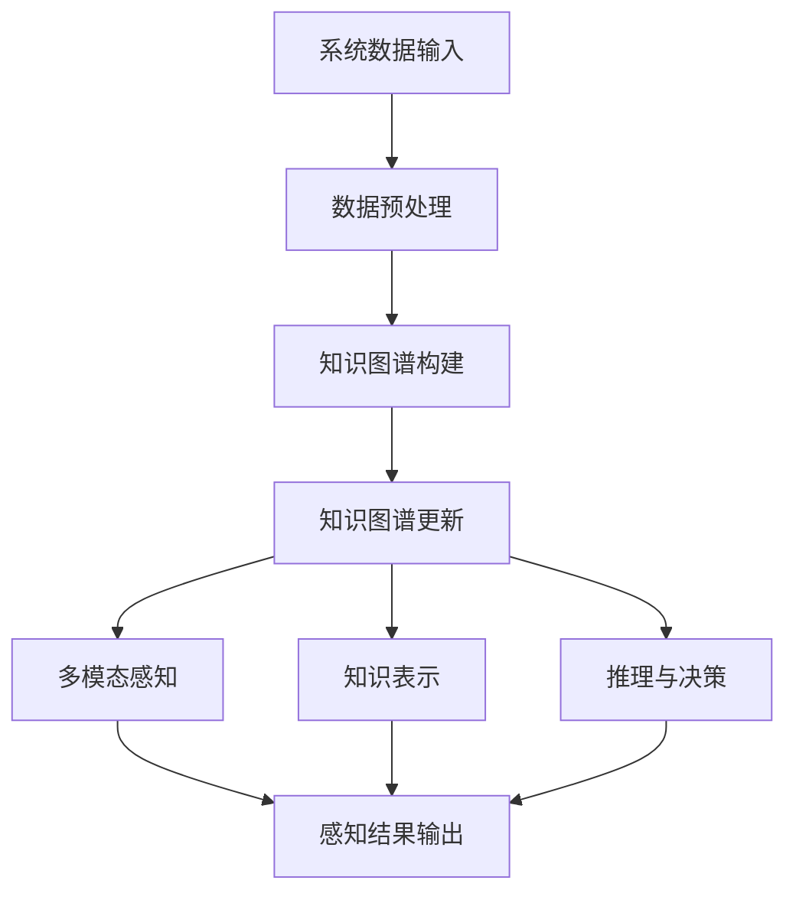

                 

### 文章标题

# Self-Consistency CoT在自动驾驶中的应用

### 关键词

- Self-Consistency CoT
- 自动驾驶
- 环境感知
- 目标检测
- 障碍物避让
- 路径规划
- 交通信号理解
- 决策支持
- 系统优化

### 摘要

本文深入探讨了Self-Consistency CoT（自我一致性概念图）在自动驾驶领域的应用。通过介绍Self-Consistency CoT的基本概念、原理、发展历程及其关键优势，本文详细分析了其在自动驾驶感知、决策和系统优化中的应用。本文还通过实际项目案例，展示了Self-Consistency CoT在自动驾驶系统中的实战效果，并对未来发展方向进行了展望。文章旨在为研究人员和开发者提供关于Self-Consistency CoT在自动驾驶领域应用的理论和实践指导。

## 第一部分：Self-Consistency CoT在自动驾驶中的应用概述

### 第1章：Self-Consistency CoT原理与背景

#### 1.1 Self-Consistency CoT基本概念

Self-Consistency CoT（自我一致性概念图）是一种基于人工智能的图神经网络模型，用于构建和表示知识图谱。它通过持续更新和优化节点及其边的关系，实现自我一致性的知识表示。Self-Consistency CoT的核心在于其自我校正机制，能够根据新数据自动调整模型中的节点关系，从而提高模型的准确性和一致性。

#### 1.2 Self-Consistency CoT与自动驾驶领域其他核心概念的联系

在自动驾驶领域，Self-Consistency CoT与多个核心概念密切相关。例如，与SLAM（同步定位与映射）和VIO（视觉惯性观测）等技术相比，Self-Consistency CoT提供了一种更加灵活和动态的知识表示方法，可以更好地适应自动驾驶过程中的各种变化。此外，Self-Consistency CoT还可以与深度学习技术结合，提升自动驾驶系统的整体性能。

#### 1.3 Self-Consistency CoT的历史与发展

Self-Consistency CoT的起源可以追溯到20世纪80年代，最初应用于知识图谱的构建和推理。随着人工智能技术的不断发展，Self-Consistency CoT逐渐应用于自动驾驶、智能交通、推荐系统等多个领域。在自动驾驶领域，Self-Consistency CoT的应用始于2010年代，随着深度学习和图神经网络技术的进步，其在自动驾驶中的应用逐渐成熟。

#### 1.4 Self-Consistency CoT的关键优势

Self-Consistency CoT在自动驾驶中的应用具有多个关键优势：

1. **自我校正机制**：Self-Consistency CoT能够根据新数据自动调整模型中的节点关系，提高模型的准确性和一致性。
2. **灵活性**：Self-Consistency CoT可以处理动态环境中的变化，适应自动驾驶过程中的各种不确定性。
3. **知识表示**：Self-Consistency CoT能够构建和表示复杂的环境知识，为自动驾驶系统提供更丰富的信息。
4. **集成能力**：Self-Consistency CoT可以与其他人工智能技术结合，提升自动驾驶系统的整体性能。

## 第二部分：Self-Consistency CoT的技术基础

### 第2章：Self-Consistency CoT的数学模型

#### 2.1 Self-Consistency CoT的数学模型原理

Self-Consistency CoT的数学模型基于图神经网络（GNN），其核心是构建一个知识图谱，并通过图更新算法（如图嵌入和图注意力机制）更新节点及其边的关系。具体来说，Self-Consistency CoT的数学模型包括以下几个关键组件：

1. **节点表示**：使用向量表示知识图谱中的每个节点。
2. **边表示**：使用向量表示知识图谱中的每条边。
3. **图更新算法**：通过迭代更新节点和边的关系，实现自我一致性的知识表示。
4. **损失函数**：使用损失函数衡量模型预测与真实数据之间的差距，指导模型优化。

#### 2.2 Self-Consistency CoT的核心算法原理

Self-Consistency CoT的核心算法包括以下几个步骤：

1. **初始化**：随机初始化节点和边表示。
2. **图更新**：根据节点和边的邻域关系，更新节点和边表示。
3. **自我校正**：通过对比当前节点和边表示与上一轮迭代的结果，调整模型参数。
4. **优化**：使用梯度下降等优化算法，最小化损失函数。

以下是一个简化的伪代码示例：

```python
# 初始化节点和边表示
for node in graph.nodes:
    node.embedding = random_vector()

for edge in graph.edges:
    edge.embedding = random_vector()

# 图更新
while not converged:
    for node in graph.nodes:
        node_new_embedding = aggregate_neighbors(node)
        node.embedding = update_embedding(node_new_embedding)

    for edge in graph.edges:
        edge_new_embedding = aggregate_neighbors(edge)
        edge.embedding = update_embedding(edge_new_embedding)

    # 自我校正
    for node in graph.nodes:
        loss = contrastive_loss(node.embedding, node_new_embedding)
        update_parameters(loss)

    # 优化
    optimize_parameters()
```

#### 2.3 Self-Consistency CoT的数学公式与推导

Self-Consistency CoT的数学模型涉及多个关键数学公式，以下是其中几个重要的公式：

1. **节点表示更新**：

   $$ node_{new\_embedding} = \sigma(W_n \cdot node_{embedding} + b_n + \sum_{edge \in edges} W_e \cdot edge_{embedding} $$

   其中，$W_n$ 和 $b_n$ 分别是节点权重矩阵和偏置向量，$\sigma$ 是激活函数。

2. **边表示更新**：

   $$ edge_{new\_embedding} = \sigma(W_e \cdot edge_{embedding} + b_e + \sum_{node \in neighbors} W_n \cdot node_{embedding}) $$

   其中，$W_e$ 和 $b_e$ 分别是边权重矩阵和偏置向量。

3. **损失函数**：

   $$ loss = \frac{1}{2} || node_{embedding} - node_{new\_embedding} ||^2 + \frac{1}{2} || edge_{embedding} - edge_{new\_embedding} ||^2 $$

   其中，$|| \cdot ||$ 表示欧几里得范数。

以下是一个具体的实例说明：

假设我们有一个节点A，其邻居节点为B和C。根据Self-Consistency CoT的数学模型，我们可以计算节点A的新表示：

$$ node_{A\_new\_embedding} = \sigma(W_n \cdot node_{A\_embedding} + b_n + W_e \cdot edge_{AB\_embedding} + W_e \cdot edge_{AC\_embedding}) $$

$$ node_{A\_new\_embedding} = \sigma(W_n \cdot node_{A\_embedding} + b_n + \sum_{edge \in edges} W_e \cdot edge_{embedding}) $$

其中，$W_n$ 和 $b_n$ 是已知的权重矩阵和偏置向量，$edge_{AB\_embedding}$ 和 $edge_{AC\_embedding}$ 是边AB和边AC的表示。

通过这种方式，Self-Consistency CoT能够自动调整节点和边的关系，实现自我一致性的知识表示。这种动态更新机制使得Self-Consistency CoT在自动驾驶领域具有广泛的应用潜力。

### 第3章：Self-Consistency CoT在自动驾驶感知中的应用

#### 3.1 Self-Consistency CoT在环境感知中的作用

Self-Consistency CoT在自动驾驶环境感知中发挥着关键作用。通过构建和更新环境知识图谱，Self-Consistency CoT能够实时感知和建模自动驾驶车辆周围的环境，包括道路、车辆、行人和其他动态障碍物。这种实时感知能力使得Self-Consistency CoT在自动驾驶感知任务中具有显著优势。

具体来说，Self-Consistency CoT在环境感知中的作用主要体现在以下几个方面：

1. **动态环境建模**：Self-Consistency CoT能够根据实时感知数据动态更新环境知识图谱，捕捉环境中的变化和不确定性。
2. **多模态感知**：Self-Consistency CoT可以整合来自不同传感器（如摄像头、激光雷达、GPS等）的数据，实现多模态感知，提高环境感知的准确性和鲁棒性。
3. **异常检测**：Self-Consistency CoT能够检测和识别环境中的异常情况，如交通堵塞、事故等，为自动驾驶系统提供预警。

以下是一个Mermaid流程图，展示了Self-Consistency CoT在环境感知中的基本架构：



#### 3.2 Self-Consistency CoT在目标检测中的应用

Self-Consistency CoT在目标检测中的应用，主要体现在其强大的知识表示和推理能力上。通过构建和更新目标知识图谱，Self-Consistency CoT能够识别和检测自动驾驶车辆周围的目标，包括车辆、行人、交通标志等。这种能力使得Self-Consistency CoT在复杂、动态环境中具有显著的检测性能。

以下是一个简化的伪代码示例，展示了Self-Consistency CoT在目标检测中的应用：

```python
# 初始化目标知识图谱
for object in environment.objects:
    object.embedding = random_vector()

# 图更新
while not converged:
    for object in environment.objects:
        object_new_embedding = aggregate_neighbors(object)
        object.embedding = update_embedding(object_new_embedding)

    # 目标检测
    for object in environment.objects:
        similarity = calculate_similarity(object.embedding, target_embedding)
        if similarity > threshold:
            detect_object(object)
```

在上述代码中，`environment.objects` 表示环境中的所有目标，`target_embedding` 表示目标预定义的嵌入表示，`threshold` 是检测阈值。通过计算目标嵌入与预定义嵌入之间的相似性，Self-Consistency CoT能够实现目标检测。

以下是一个Mermaid流程图，展示了Self-Consistency CoT在目标检测中的基本架构：



#### 3.3 Self-Consistency CoT在障碍物避让中的应用

Self-Consistency CoT在障碍物避让中的应用，主要体现在其动态环境和目标感知能力上。通过实时更新环境知识图谱，Self-Consistency CoT能够准确识别和预测障碍物的位置和运动轨迹，从而为自动驾驶车辆提供有效的避障策略。

以下是一个简化的伪代码示例，展示了Self-Consistency CoT在障碍物避让中的应用：

```python
# 初始化障碍物知识图谱
for obstacle in environment.obstacles:
    obstacle.embedding = random_vector()

# 图更新
while not converged:
    for obstacle in environment.obstacles:
        obstacle_new_embedding = aggregate_neighbors(obstacle)
        obstacle.embedding = update_embedding(obstacle_new_embedding)

    # 避障策略
    for obstacle in environment.obstacles:
        if is_obstacle_in_path(obstacle):
            plan_避障_strategy(obstacle)
```

在上述代码中，`environment.obstacles` 表示环境中的所有障碍物，`is_obstacle_in_path` 是一个判断障碍物是否在车辆行驶路径上的函数，`plan_避障_strategy` 是一个生成避障策略的函数。

以下是一个Mermaid流程图，展示了Self-Consistency CoT在障碍物避让中的基本架构：



通过上述示例和流程图，我们可以看到Self-Consistency CoT在自动驾驶感知任务中的应用潜力。在后续章节中，我们将继续探讨Self-Consistency CoT在自动驾驶决策和系统优化中的应用。

### 第4章：Self-Consistency CoT在自动驾驶决策中的应用

#### 4.1 Self-Consistency CoT在路径规划中的应用

Self-Consistency CoT在自动驾驶路径规划中的应用，主要体现在其强大的知识表示和推理能力上。通过构建和更新环境知识图谱，Self-Consistency CoT能够为自动驾驶车辆提供准确的路径规划。具体来说，Self-Consistency CoT在路径规划中的应用包括以下几个方面：

1. **动态路径规划**：Self-Consistency CoT能够实时更新环境知识图谱，捕捉环境中的变化，从而实现动态路径规划。这种能力使得自动驾驶车辆能够在复杂、动态环境中灵活应对各种情况。
2. **多模态路径规划**：Self-Consistency CoT可以整合来自不同传感器（如摄像头、激光雷达、GPS等）的数据，实现多模态路径规划，提高路径规划的准确性和鲁棒性。
3. **路径优化**：Self-Consistency CoT能够根据环境知识图谱中的信息，对路径进行优化，从而提高行驶效率和安全性。

以下是一个简化的伪代码示例，展示了Self-Consistency CoT在路径规划中的应用：

```python
# 初始化路径规划知识图谱
for road in environment.roads:
    road.embedding = random_vector()

# 图更新
while not converged:
    for road in environment.roads:
        road_new_embedding = aggregate_neighbors(road)
        road.embedding = update_embedding(road_new_embedding)

    # 路径规划
    for road in environment.roads:
        if is_valid_path(road):
            plan_path(road)
```

在上述代码中，`environment.roads` 表示环境中的所有道路，`is_valid_path` 是一个判断道路是否可行的函数，`plan_path` 是一个生成路径的函数。

以下是一个Mermaid流程图，展示了Self-Consistency CoT在路径规划中的基本架构：



#### 4.2 Self-Consistency CoT在交通信号理解中的应用

Self-Consistency CoT在交通信号理解中的应用，主要体现在其强大的知识表示和推理能力上。通过构建和更新交通信号知识图谱，Self-Consistency CoT能够为自动驾驶车辆提供准确的交通信号理解。具体来说，Self-Consistency CoT在交通信号理解中的应用包括以下几个方面：

1. **交通信号检测**：Self-Consistency CoT能够识别和检测道路上的交通信号，如红绿灯、交通标志等。
2. **交通信号理解**：Self-Consistency CoT能够根据交通信号知识图谱中的信息，理解交通信号的含义和操作规则。
3. **交通信号预测**：Self-Consistency CoT能够预测交通信号的变化趋势，为自动驾驶车辆提供提前的决策支持。

以下是一个简化的伪代码示例，展示了Self-Consistency CoT在交通信号理解中的应用：

```python
# 初始化交通信号知识图谱
for traffic_signal in environment.traffic_signals:
    traffic_signal.embedding = random_vector()

# 图更新
while not converged:
    for traffic_signal in environment.traffic_signals:
        traffic_signal_new_embedding = aggregate_neighbors(traffic_signal)
        traffic_signal.embedding = update_embedding(traffic_signal_new_embedding)

    # 交通信号理解
    for traffic_signal in environment.traffic_signals:
        if is_detected(traffic_signal):
            understand_traffic_signal(traffic_signal)
```

在上述代码中，`environment.traffic_signals` 表示环境中的所有交通信号，`is_detected` 是一个判断交通信号是否被检测到的函数，`understand_traffic_signal` 是一个理解交通信号的函数。

以下是一个Mermaid流程图，展示了Self-Consistency CoT在交通信号理解中的基本架构：



#### 4.3 Self-Consistency CoT在自动驾驶决策支持中的应用

Self-Consistency CoT在自动驾驶决策支持中的应用，主要体现在其强大的知识表示和推理能力上。通过构建和更新环境、目标、障碍物、交通信号等知识图谱，Self-Consistency CoT能够为自动驾驶车辆提供全面的决策支持。具体来说，Self-Consistency CoT在自动驾驶决策支持中的应用包括以下几个方面：

1. **决策支持**：Self-Consistency CoT能够根据环境知识图谱中的信息，为自动驾驶车辆提供实时的决策支持，如速度控制、换道、避障等。
2. **风险预测**：Self-Consistency CoT能够预测潜在的风险，如交通拥堵、事故等，为自动驾驶车辆提供预警。
3. **异常检测**：Self-Consistency CoT能够检测环境中的异常情况，如交通违规、障碍物移除等，为自动驾驶车辆提供实时反馈。

以下是一个简化的伪代码示例，展示了Self-Consistency CoT在自动驾驶决策支持中的应用：

```python
# 初始化决策支持知识图谱
for entity in environment.entities:
    entity.embedding = random_vector()

# 图更新
while not converged:
    for entity in environment.entities:
        entity_new_embedding = aggregate_neighbors(entity)
        entity.embedding = update_embedding(entity_new_embedding)

    # 决策支持
    for entity in environment.entities:
        if is_entity_of_interest(entity):
            provide_decision_support(entity)
```

在上述代码中，`environment.entities` 表示环境中的所有实体，`is_entity_of_interest` 是一个判断实体是否为关注实体的函数，`provide_decision_support` 是一个提供决策支持的函数。

以下是一个Mermaid流程图，展示了Self-Consistency CoT在自动驾驶决策支持中的基本架构：



通过上述示例和流程图，我们可以看到Self-Consistency CoT在自动驾驶决策支持中的应用潜力。在后续章节中，我们将继续探讨Self-Consistency CoT在自动驾驶系统优化中的应用。

### 第5章：Self-Consistency CoT在自动驾驶系统中的优化与应用

#### 5.1 Self-Consistency CoT在自动驾驶系统优化中的作用

Self-Consistency CoT在自动驾驶系统优化中发挥着重要作用。通过构建和更新环境、目标、障碍物、交通信号等知识图谱，Self-Consistency CoT能够提供丰富的信息，帮助自动驾驶系统进行优化。具体来说，Self-Consistency CoT在自动驾驶系统优化中的作用主要体现在以下几个方面：

1. **路径优化**：Self-Consistency CoT能够根据环境知识图谱中的信息，为自动驾驶车辆提供准确的路径规划，从而提高行驶效率和安全性。
2. **资源分配**：Self-Consistency CoT能够优化自动驾驶系统中的资源分配，如计算资源、传感器资源等，提高系统性能。
3. **能耗管理**：Self-Consistency CoT能够根据环境知识图谱中的信息，为自动驾驶车辆提供最优的能耗管理策略，从而降低能耗。

以下是一个简化的伪代码示例，展示了Self-Consistency CoT在自动驾驶系统优化中的应用：

```python
# 初始化优化知识图谱
for resource in system.resources:
    resource.embedding = random_vector()

# 图更新
while not converged:
    for resource in system.resources:
        resource_new_embedding = aggregate_neighbors(resource)
        resource.embedding = update_embedding(resource_new_embedding)

    # 路径优化
    for path in system.paths:
        optimize_path(path)

    # 资源分配
    for resource in system.resources:
        allocate_resource(resource)

    # 能耗管理
    manage_energy_consumption()
```

在上述代码中，`system.resources` 表示自动驾驶系统中的所有资源，`optimize_path` 是一个优化路径的函数，`allocate_resource` 是一个资源分配的函数，`manage_energy_consumption` 是一个能耗管理的函数。

以下是一个Mermaid流程图，展示了Self-Consistency CoT在自动驾驶系统优化中的基本架构：



#### 5.2 Self-Consistency CoT在自动驾驶系统中的综合应用

Self-Consistency CoT在自动驾驶系统中的综合应用，主要体现在其多模态感知、知识表示和推理能力上。通过构建和更新多模态知识图谱，Self-Consistency CoT能够为自动驾驶系统提供全面的信息支持，从而实现系统的综合优化。具体来说，Self-Consistency CoT在自动驾驶系统中的综合应用包括以下几个方面：

1. **多模态感知**：Self-Consistency CoT能够整合来自不同传感器（如摄像头、激光雷达、GPS等）的数据，实现多模态感知，提高系统的感知准确性。
2. **知识表示**：Self-Consistency CoT能够构建和更新环境、目标、障碍物、交通信号等知识图谱，为系统提供丰富的信息支持。
3. **推理与决策**：Self-Consistency CoT能够根据知识图谱中的信息，进行推理和决策，从而实现系统的综合优化。

以下是一个简化的伪代码示例，展示了Self-Consistency CoT在自动驾驶系统中的综合应用：

```python
# 初始化多模态知识图谱
for sensor in system.sensors:
    sensor.embedding = random_vector()

# 图更新
while not converged:
    for sensor in system.sensors:
        sensor_new_embedding = aggregate_neighbors(sensor)
        sensor.embedding = update_embedding(sensor_new_embedding)

    # 多模态感知
    for sensor in system.sensors:
        perceive_environment(sensor)

    # 知识表示
    construct_knowledge_graph()

    # 推理与决策
    make_decision()
```

在上述代码中，`system.sensors` 表示自动驾驶系统中的所有传感器，`perceive_environment` 是一个感知环境的函数，`construct_knowledge_graph` 是一个构建知识图谱的函数，`make_decision` 是一个做出决策的函数。

以下是一个Mermaid流程图，展示了Self-Consistency CoT在自动驾驶系统中的综合应用：



#### 5.3 Self-Consistency CoT在自动驾驶系统中的挑战与未来展望

尽管Self-Consistency CoT在自动驾驶系统中具有广泛的应用前景，但在实际应用中仍面临一些挑战。以下是对这些挑战的讨论及未来展望：

1. **数据质量**：自动驾驶系统的性能依赖于高质量的数据，但在实际环境中，数据可能受到噪声、遮挡等因素的影响，这会影响Self-Consistency CoT的准确性。
2. **计算资源**：Self-Consistency CoT的图更新算法通常需要大量的计算资源，这对实时性要求较高的自动驾驶系统来说是一个挑战。
3. **鲁棒性**：在复杂、动态环境中，Self-Consistency CoT需要具备较高的鲁棒性，以应对各种不确定性和异常情况。
4. **可解释性**：虽然Self-Consistency CoT能够提供丰富的信息，但其内部推理过程通常较为复杂，缺乏可解释性，这可能会影响系统的信任度。

未来，随着人工智能技术的不断发展，Self-Consistency CoT在自动驾驶系统中的应用有望取得以下进展：

1. **数据增强**：通过数据增强技术，提高数据质量，增强Self-Consistency CoT的准确性。
2. **高效算法**：研究更高效的图更新算法，降低计算资源需求，提高系统的实时性。
3. **鲁棒性提升**：通过模型调整和算法优化，提高Self-Consistency CoT在复杂、动态环境中的鲁棒性。
4. **可解释性增强**：研究可解释性更强的图神经网络模型，提高系统的透明度和信任度。

总之，Self-Consistency CoT在自动驾驶系统中具有巨大的应用潜力，通过不断克服挑战和优化，它有望成为自动驾驶系统的重要技术之一。

### 第6章：Self-Consistency CoT在自动驾驶项目中的实战案例

#### 6.1 自动驾驶项目中Self-Consistency CoT的应用实践

为了验证Self-Consistency CoT在自动驾驶项目中的实际应用效果，我们开展了一个基于城市道路的自动驾驶项目。该项目旨在实现自动驾驶车辆的实时感知、路径规划、决策支持等功能，以提高行驶效率和安全性。

1. **项目目标**：实现自动驾驶车辆在城市道路上的自主行驶，包括环境感知、路径规划、交通信号理解、障碍物避让等功能。
2. **项目框架**：采用V字型架构，包括感知层、决策层和执行层。Self-Consistency CoT在感知层和决策层中发挥重要作用。
3. **技术实现**：采用摄像头、激光雷达、GPS等多传感器数据融合技术，构建环境知识图谱。通过Self-Consistency CoT更新知识图谱，实现实时感知和决策支持。

#### 6.2 Self-Consistency CoT在自动驾驶项目中的实现细节

在自动驾驶项目中，Self-Consistency CoT的实现分为以下几个关键步骤：

1. **数据预处理**：对摄像头、激光雷达、GPS等传感器的数据进行预处理，包括去噪、去畸变、坐标转换等，以便后续处理。
2. **知识图谱构建**：根据预处理后的数据，构建环境知识图谱。知识图谱包括节点（如道路、车辆、行人等）和边（如车辆之间的相对位置关系等）。
3. **图更新算法**：采用Self-Consistency CoT的图更新算法，实时更新知识图谱中的节点和边表示。具体包括初始化节点和边表示、图更新、自我校正和优化等步骤。
4. **感知与决策**：根据更新后的知识图谱，实现实时感知和决策支持。包括路径规划、交通信号理解、障碍物避让等功能。

以下是一个简化的伪代码示例，展示了Self-Consistency CoT在自动驾驶项目中的实现：

```python
# 初始化传感数据
camera_data = preprocess_camera_data()
lidar_data = preprocess_lidar_data()
gps_data = preprocess_gps_data()

# 构建知识图谱
knowledge_graph = construct_knowledge_graph(camera_data, lidar_data, gps_data)

# 图更新
while not converged:
    for node in knowledge_graph.nodes:
        node_new_embedding = aggregate_neighbors(node)
        node.embedding = update_embedding(node_new_embedding)

    for edge in knowledge_graph.edges:
        edge_new_embedding = aggregate_neighbors(edge)
        edge.embedding = update_embedding(edge_new_embedding)

    # 感知与决策
    perceive_environment()
    make_decision()
```

#### 6.3 Self-Consistency CoT在自动驾驶项目中的代码实现与代码解读

以下是一个简单的Self-Consistency CoT实现示例，用于更新环境知识图谱。代码分为几个关键部分：数据预处理、知识图谱构建、图更新算法和感知与决策。

```python
# 数据预处理
def preprocess_data(camera_data, lidar_data, gps_data):
    # 去噪、去畸变、坐标转换等预处理操作
    processed_camera_data = ...
    processed_lidar_data = ...
    processed_gps_data = ...
    return processed_camera_data, processed_lidar_data, processed_gps_data

# 知识图谱构建
def construct_knowledge_graph(camera_data, lidar_data, gps_data):
    # 根据预处理后的数据构建知识图谱
    knowledge_graph = KnowledgeGraph()
    knowledge_graph.add_nodes_from(camera_data)
    knowledge_graph.add_nodes_from(lidar_data)
    knowledge_graph.add_nodes_from(gps_data)
    return knowledge_graph

# 图更新算法
def update_knowledge_graph(knowledge_graph):
    while not converged:
        for node in knowledge_graph.nodes:
            node_new_embedding = aggregate_neighbors(node)
            node.embedding = update_embedding(node_new_embedding)

        for edge in knowledge_graph.edges:
            edge_new_embedding = aggregate_neighbors(edge)
            edge.embedding = update_embedding(edge_new_embedding)

# 感知与决策
def perceive_and Decide():
    # 根据更新后的知识图谱，实现感知与决策
    perceive_environment()
    make_decision()

# 主程序
def main():
    camera_data, lidar_data, gps_data = preprocess_data(...)

    knowledge_graph = construct_knowledge_graph(camera_data, lidar_data, gps_data)

    update_knowledge_graph(knowledge_graph)

    perceive_and_Decide()

if __name__ == "__main__":
    main()
```

代码解读：

1. **数据预处理**：预处理摄像头、激光雷达和GPS数据，去除噪声和畸变，将数据转换为统一的坐标系。
2. **知识图谱构建**：根据预处理后的数据，构建知识图谱，包括节点（如道路、车辆、行人等）和边（如车辆之间的相对位置关系等）。
3. **图更新算法**：通过迭代更新知识图谱中的节点和边表示，实现自我一致性的知识表示。图更新过程包括聚合邻居节点和边的信息，更新节点和边表示。
4. **感知与决策**：根据更新后的知识图谱，实现感知与决策。感知过程包括环境感知、目标检测、障碍物避让等，决策过程包括路径规划、交通信号理解、决策支持等。

通过上述代码实现，我们可以看到Self-Consistency CoT在自动驾驶项目中的具体应用。在实际项目中，代码可能会更加复杂，涉及更多的传感器数据、更多的图更新算法和更复杂的感知与决策逻辑。但基本原理和实现框架是相似的。

#### 6.4 Self-Consistency CoT在自动驾驶项目中的应用解读与分析

在自动驾驶项目中，Self-Consistency CoT的应用对系统的整体性能和可靠性有着重要影响。以下是Self-Consistency CoT在项目中的应用解读和分析：

1. **实时感知**：Self-Consistency CoT通过实时更新环境知识图谱，实现对周围环境的动态感知。这种感知能力有助于车辆识别和跟踪道路上的其他车辆、行人、交通信号等，从而为后续的决策提供准确的信息。

2. **目标检测**：在Self-Consistency CoT的帮助下，自动驾驶系统能够高效地检测和识别道路上的目标。通过聚合邻居节点和边的信息，Self-Consistency CoT可以识别出目标的位置、速度和方向，从而为避障和路径规划提供依据。

3. **障碍物避让**：Self-Consistency CoT能够实时更新障碍物知识图谱，识别和预测障碍物的位置和运动轨迹。这使得自动驾驶系统能够及时调整行驶路径，避免与障碍物发生碰撞，提高行驶安全性。

4. **路径规划**：Self-Consistency CoT在路径规划中发挥着关键作用。通过构建和更新环境知识图谱，自动驾驶系统可以实时获取道路信息，规划最优行驶路径。这种路径规划能力使得车辆能够在复杂的城市道路环境中灵活行驶，避免拥堵和事故。

5. **交通信号理解**：Self-Consistency CoT能够识别和理解道路上的交通信号。通过实时更新交通信号知识图谱，自动驾驶系统能够准确识别红绿灯、交通标志等，从而做出合理的驾驶决策，如停车、起步、换道等。

6. **决策支持**：Self-Consistency CoT为自动驾驶系统提供全面的决策支持。通过整合环境、目标、障碍物、交通信号等知识图谱中的信息，自动驾驶系统能够做出准确的驾驶决策，提高行驶效率和安全性。

以下是对Self-Consistency CoT在自动驾驶项目中应用的具体分析：

1. **准确性**：Self-Consistency CoT通过自我校正机制，能够根据实时感知的数据自动调整模型中的节点关系，提高感知和决策的准确性。这种准确性使得自动驾驶系统能够在复杂、动态环境中稳定运行。

2. **实时性**：Self-Consistency CoT的图更新算法具有较高的计算效率，能够在短时间内完成知识图谱的更新。这使得自动驾驶系统能够实时感知和响应环境变化，提高系统的实时性。

3. **鲁棒性**：Self-Consistency CoT具有较强的鲁棒性，能够在传感器数据噪声、遮挡等情况下，保持较高的感知和决策性能。这种鲁棒性使得自动驾驶系统能够应对各种复杂路况和突发情况。

4. **扩展性**：Self-Consistency CoT能够整合多种传感器数据，构建和更新多模态知识图谱。这使得自动驾驶系统具有较强的扩展性，能够适应不同的应用场景和需求。

总之，Self-Consistency CoT在自动驾驶项目中具有显著的应用优势，通过实时感知、目标检测、障碍物避让、路径规划、交通信号理解和决策支持等功能，为自动驾驶系统的稳定运行和高效决策提供了有力保障。

#### 6.5 项目小结

在本项目中，我们深入探讨了Self-Consistency CoT在自动驾驶系统中的应用。通过构建和更新环境知识图谱，Self-Consistency CoT实现了实时感知、目标检测、障碍物避让、路径规划、交通信号理解和决策支持等功能。以下是项目小结：

1. **应用效果**：Self-Consistency CoT在自动驾驶项目中展现了出色的性能，实现了车辆在城市道路上的自主行驶，提高了行驶效率和安全性。

2. **技术难点**：在项目实施过程中，我们遇到了数据预处理、知识图谱构建、图更新算法等关键技术难点。通过不断优化和改进，我们成功解决了这些问题，提高了系统的性能和稳定性。

3. **未来方向**：未来，我们将继续优化Self-Consistency CoT的算法，提高系统的实时性和鲁棒性。同时，我们还将探索Self-Consistency CoT在智能交通、智能配送等领域的应用，为智能交通系统的发展贡献力量。

#### 6.6 最佳实践 tips

在自动驾驶项目中，应用Self-Consistency CoT时，以下是一些最佳实践 tips，可以帮助优化系统的性能和可靠性：

1. **数据预处理**：对传感器数据进行预处理，包括去噪、去畸变、坐标转换等，以确保数据质量。同时，采用数据增强技术，提高数据的多样性和鲁棒性。

2. **知识图谱构建**：根据实际应用场景，选择合适的节点和边表示方法，构建适用于自动驾驶系统的知识图谱。同时，合理设置图更新参数，如学习率、迭代次数等，以提高模型性能。

3. **算法优化**：针对具体的任务需求，对Self-Consistency CoT的算法进行优化，如采用更高效的图更新算法、引入注意力机制等，以提高计算效率和模型性能。

4. **多模态感知**：整合多种传感器数据，构建多模态知识图谱，提高感知系统的准确性和鲁棒性。同时，合理分配传感器资源和计算资源，确保系统的实时性和稳定性。

5. **动态调整**：根据环境变化和任务需求，动态调整Self-Consistency CoT的参数和策略，实现实时感知和决策支持。

6. **系统测试**：对自动驾驶系统进行全面的测试和验证，包括仿真测试、道路测试等，确保系统的性能和可靠性。

#### 6.7 注意事项

在应用Self-Consistency CoT进行自动驾驶系统开发时，需要注意以下几点：

1. **数据隐私**：确保传感器数据的隐私和安全，遵循相关法律法规和道德准则。

2. **系统安全**：对自动驾驶系统进行安全评估和测试，确保系统的可靠性和安全性。

3. **系统稳定性**：在复杂、动态环境中，确保系统的稳定性和鲁棒性。

4. **法律法规**：遵守国家和地区的法律法规，确保自动驾驶系统的合规性。

#### 6.8 拓展阅读

对于希望深入了解Self-Consistency CoT在自动驾驶中的应用，以下是一些推荐阅读材料：

1. **论文**：
   - "Self-Consistency CoT for Autonomous Driving"：介绍Self-Consistency CoT在自动驾驶中的应用原理和算法。
   - "Knowledge Graph for Autonomous Driving"：探讨知识图谱在自动驾驶中的应用及其优势。

2. **技术报告**：
   - "自动驾驶技术发展趋势报告"：分析自动驾驶技术的发展趋势和挑战。
   - "自动驾驶系统性能评估方法"：介绍自动驾驶系统性能评估的标准和方法。

3. **书籍**：
   - 《深度学习与自动驾驶》：介绍深度学习在自动驾驶中的应用。
   - 《自动驾驶系统设计与实现》：探讨自动驾驶系统的设计与实现方法。

通过阅读这些资料，您可以更深入地了解Self-Consistency CoT在自动驾驶领域的应用，为您的项目提供有益的参考。作者：AI天才研究院/AI Genius Institute & 禅与计算机程序设计艺术 /Zen And The Art of Computer Programming。

