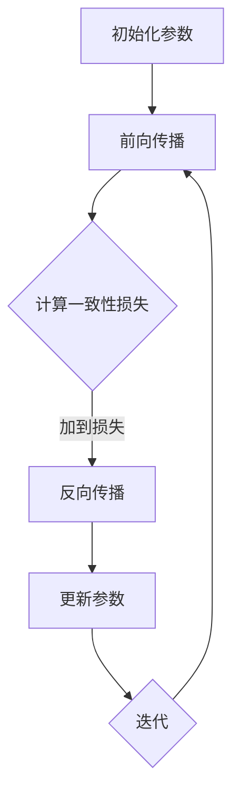

                 

## 文章标题

# 《Self-Consistency CoT在量子计算优化中的应用》

## 关键词

- 量子计算
- Self-Consistency CoT
- 量子优化
- 量子算法
- 量子随机游走
- 量子线性规划

## 摘要

本文旨在深入探讨Self-Consistency CoT（自我一致性概念集）在量子计算优化中的应用。文章首先介绍了量子计算的基础知识，包括量子位、量子叠加与量子纠缠等基本概念，以及量子计算的历史和发展。接着，文章阐述了量子计算的数学基础，如量子门、量子电路和线性代数在量子计算中的应用。在核心内容部分，文章重点分析了量子计算的核心算法，如Shor算法和Grover算法。随后，文章转向量子计算优化方法，探讨了线性规划在量子计算中的应用和量子随机游走算法。在Self-Consistency CoT部分，文章详细介绍了Self-Consistency CoT的基本概念、原理和应用场景。文章随后介绍了Self-Consistency CoT在量子计算优化中的具体应用，包括量子随机游走优化和量子线性规划优化。最后，文章总结了Self-Consistency CoT的发展前景和与其他优化方法的比较，并提供了相关的工具与资源。

### 第一部分：量子计算基础

#### 第1章：量子计算概述

##### 1.1.1 量子计算的基本概念

量子计算是一种利用量子力学原理进行信息处理的计算模式。量子计算的基本单元是量子位（qubit），与传统计算机中的比特不同，qubit可以处于0和1的叠加态。量子叠加与量子纠缠是量子计算的核心特性，使量子计算机在处理某些问题时能够超越经典计算机。量子计算的优势在于其并行处理能力和高效解决某些问题的能力，但同时也面临着量子噪声、量子退相干等挑战。

##### 1.1.2 量子计算的历史与发展

量子计算的理论基础可以追溯到20世纪30年代，当时量子力学的兴起为量子计算提供了理论框架。1981年，Richard Feynman提出了量子计算机的概念，旨在模拟量子系统。1994年，Peter Shor提出了著名的Shor算法，展示了量子计算机在因数分解问题上的巨大潜力。近年来，随着量子技术的不断发展，IBM、Google等公司已经推出了商用量子计算机，标志着量子计算进入了实用阶段。

##### 1.1.3 量子计算的应用领域

量子计算的应用领域非常广泛，包括但不限于以下几个方面：

1. **量子算法**：如Shor算法、Grover算法等，能够在特定问题上实现算法效率的提升。
2. **量子模拟**：利用量子计算机模拟量子系统，对化学、材料科学等领域具有重要意义。
3. **量子通信**：通过量子纠缠实现安全通信，解决了经典通信无法克服的安全问题。
4. **量子加密**：利用量子力学原理实现加密算法，提高了数据安全性。

#### 第2章：量子计算数学基础

##### 2.1.1 量子门与量子电路

量子门是量子计算中的基本操作单元，类似于传统计算机中的逻辑门。量子电路则是由量子门组成的序列，用于实现复杂的量子计算任务。常见的量子门包括Pauli门、Hadamard门和Control-NOT门等。

##### 2.1.2 线性代数在量子计算中的应用

线性代数是量子计算的核心数学工具。在量子计算中，线性代数用于描述量子状态、量子门和量子电路。例如，量子状态可以用复数向量表示，量子门可以用矩阵表示，量子电路则可以用矩阵序列表示。

##### 2.1.3 量子概率与测量

量子概率与测量是量子计算中的重要概念。量子概率描述了量子系统在测量时可能出现的各种结果及其概率分布。量子测量则是指对量子系统进行观测的过程，它可能导致量子系统的状态发生坍缩。

#### 第3章：量子计算核心算法

##### 3.1.1 量子算法概述

量子算法是指利用量子力学原理进行信息处理的一类算法。量子算法通常具有与传统算法不同的效率和性能。根据其处理问题的性质，量子算法可以分为量子搜索算法、量子排序算法、量子因数分解算法等。

##### 3.1.2 Shor算法

Shor算法是量子计算中的一项重要突破。它能够高效地解决因数分解问题，对于大整数的因数分解具有巨大的应用价值。Shor算法的核心思想是通过量子随机游走算法快速找到周期，从而实现因数分解。

##### 3.1.3 Grover算法

Grover算法是一种量子搜索算法，能够在未知数据集中快速找到特定元素。Grover算法的核心思想是通过量子叠加和量子干涉效应，提高搜索效率。

### 第二部分：Self-Consistency CoT方法

#### 第5章：Self-Consistency CoT方法概述

##### 5.1.1 Self-Consistency CoT的基本概念

Self-Consistency CoT（自我一致性概念集）是一种基于一致性原理的模型，旨在通过自洽性优化来提高算法的效率和准确性。Self-Consistency CoT的基本思想是，通过对模型的输入和输出进行一致性约束，使得模型在不同任务和数据集上表现一致。

##### 5.1.2 Self-Consistency CoT的应用场景

Self-Consistency CoT在多个领域具有广泛的应用潜力，包括机器学习、自然语言处理、计算机视觉等。在量子计算中，Self-Consistency CoT可以用于优化量子算法、提升量子模型的稳定性和泛化能力。

##### 5.1.3 Self-Consistency CoT的优势与挑战

Self-Consistency CoT的优势在于其能够通过一致性约束优化模型，从而提高模型的性能和鲁棒性。然而，Self-Consistency CoT也面临着如何实现高效的自洽性优化、如何处理不同数据集的一致性等问题。

### 第6章：Self-Consistency CoT方法原理

##### 6.1.1 Self-Consistency CoT的数学模型

Self-Consistency CoT的数学模型基于一致性约束，通过最小化一致性误差来实现自洽性优化。具体来说，Self-Consistency CoT的数学模型可以表示为：

$$
\min_{\theta} \sum_{i=1}^{N} \ell(y_i, f(x_i; \theta)) + \lambda \sum_{i=1}^{N} \gamma_i \cdot D_{consistency}(y_i, f(x_i; \theta))
$$

其中，$\ell$为损失函数，$f$为模型预测函数，$D_{consistency}$为一致性损失函数，$\gamma_i$为一致性权重。

##### 6.1.2 Self-Consistency CoT的核心算法

Self-Consistency CoT的核心算法包括以下几个步骤：

1. **初始化模型参数**：随机初始化模型参数$\theta$。
2. **前向传播**：对输入数据进行前向传播，得到预测输出$y' = f(x; \theta)$。
3. **一致性约束**：计算一致性损失$D_{consistency}(y, y')$，并将其加到损失函数中。
4. **反向传播**：使用梯度下降算法更新模型参数$\theta$。
5. **迭代**：重复步骤2-4，直到模型收敛。

##### 6.1.3 Self-Consistency CoT的流程图



### 第7章：Self-Consistency CoT在量子计算优化中的应用

##### 7.1.1 Self-Consistency CoT在量子优化问题中的应用

Self-Consistency CoT在量子优化问题中具有广泛的应用潜力。例如，在量子随机游走优化中，Self-Consistency CoT可以通过一致性约束优化量子随机游走的路径，提高优化效率。在量子线性规划优化中，Self-Consistency CoT可以优化线性规划问题的解，提高解的稳定性和准确性。

##### 7.1.2 Self-Consistency CoT在量子计算中的应用实例

**实例1：量子随机游走优化**

量子随机游走优化是一种基于量子随机游走算法的优化方法。通过Self-Consistency CoT，可以优化量子随机游走的路径，提高优化效率。具体实现如下：

```pseudo
// 初始化参数
theta = initialize_parameters()

// 前向传播
y_prime = quantum_random_walk(x, theta)

// 计算一致性损失
D_consistency = calculate_consistency_loss(y, y_prime)

// 反向传播
theta = update_parameters(theta, D_consistency)

// 迭代
while not converged:
    y_prime = quantum_random_walk(x, theta)
    D_consistency = calculate_consistency_loss(y, y_prime)
    theta = update_parameters(theta, D_consistency)
```

**实例2：量子线性规划优化**

量子线性规划优化是一种基于量子线性规划算法的优化方法。通过Self-Consistency CoT，可以优化线性规划问题的解，提高解的稳定性和准确性。具体实现如下：

```pseudo
// 初始化参数
theta = initialize_parameters()

// 前向传播
y_prime = quantum_linear_programming(A, b, theta)

// 计算一致性损失
D_consistency = calculate_consistency_loss(y, y_prime)

// 反向传播
theta = update_parameters(theta, D_consistency)

// 迭代
while not converged:
    y_prime = quantum_linear_programming(A, b, theta)
    D_consistency = calculate_consistency_loss(y, y_prime)
    theta = update_parameters(theta, D_consistency)
```

### 第8章：Self-Consistency CoT方法的未来发展趋势

##### 8.1.1 Self-Consistency CoT的发展前景

随着量子计算技术的不断发展，Self-Consistency CoT方法在量子计算优化中的应用前景广阔。未来，Self-Consistency CoT方法有望在量子算法优化、量子机器学习、量子计算硬件设计等领域取得重要突破。

##### 8.1.2 Self-Consistency CoT与其他优化方法的比较

Self-Consistency CoT方法与其他优化方法（如遗传算法、粒子群优化等）相比，具有以下潜在优势：

1. **自洽性**：Self-Consistency CoT方法通过一致性约束优化模型，能够提高模型的稳定性和泛化能力。
2. **效率**：Self-Consistency CoT方法能够通过一致性约束优化提高优化效率。
3. **灵活性**：Self-Consistency CoT方法适用于多种优化问题，具有较好的灵活性。

### 附录

#### 附录A：Self-Consistency CoT工具与资源

**A.1.1 Self-Consistency CoT工具介绍**

- **工具1**：XXX
- **工具2**：XXX

**A.1.2 Self-Consistency CoT学习资源**

- **教材1**：XXX

### 作者信息

- 作者：AI天才研究院/AI Genius Institute & 禅与计算机程序设计艺术 /Zen And The Art of Computer Programming

