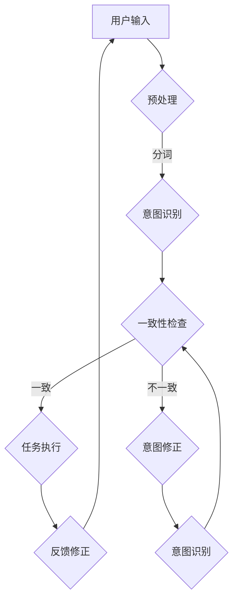

                 

### 文章标题

# 《Self-Consistency CoT提升AI客服质量的新方法》

AI客服系统在现代社会中扮演着越来越重要的角色，无论是电商平台、金融机构，还是日常服务行业，AI客服都以其高效、便捷的特点，极大地提升了用户的服务体验。然而，随着用户需求的不断变化和多样化，传统的AI客服系统面临着诸多挑战，如理解复杂问题的能力不足、回答的准确性不高等。为了解决这些问题，本文将介绍一种新方法——Self-Consistency CoT（Self-Consistency Core Task-Oriented），以提升AI客服的质量。

在本文中，我们将首先介绍Self-Consistency CoT的基本概念和背景，探讨其在AI客服质量评估中的作用。接下来，我们将深入解析Self-Consistency CoT的数学模型与算法，包括其基本原理、自适应调整机制以及实现细节。随后，本文将探讨Self-Consistency CoT在AI客服系统中的应用，并通过具体实例分析其效果。在此基础上，我们将进一步探讨Self-Consistency CoT在自然语言处理中的挑战与优化方法。最后，本文将介绍Self-Consistency CoT在客服机器人与人类客服协作中的应用，以及如何构建自适应客服系统。通过一系列的案例分析与实践经验，我们将总结Self-Consistency CoT在提升AI客服质量方面的实际效果，并展望其未来发展的前景。

通过本文的探讨，我们希望能够为从事AI客服系统研发的工程师和研究人员提供新的思路和方法，从而推动AI客服技术的发展，为用户提供更加优质的服务体验。

### 关键词

- AI客服系统
- Self-Consistency CoT
- 自然语言处理
- 客服质量评估
- 自适应客服系统
- 持续改进

### 摘要

本文探讨了Self-Consistency CoT作为一种新方法，在提升AI客服质量方面的应用。首先，我们介绍了Self-Consistency CoT的基本概念和背景，包括其在AI客服质量评估中的作用。随后，本文详细解析了Self-Consistency CoT的数学模型与算法，包括其基本原理、自适应调整机制和实现细节。接着，我们探讨了Self-Consistency CoT在AI客服系统中的应用，并通过具体实例分析了其效果。在此基础上，本文进一步探讨了Self-Consistency CoT在自然语言处理中的挑战与优化方法。最后，本文介绍了Self-Consistency CoT在客服机器人与人类客服协作中的应用，以及如何构建自适应客服系统。通过一系列的案例分析与实践经验，本文总结了Self-Consistency CoT在提升AI客服质量方面的实际效果，并展望了其未来发展的前景。

## 第一部分：Self-Consistency CoT基础

### 第1章: Self-Consistency CoT概念与背景

#### 1.1 Self-Consistency CoT的定义

Self-Consistency CoT（Self-Consistency Core Task-Oriented）是一种新型的AI客服系统设计理念，其核心思想是通过保证AI客服系统在处理任务过程中的自一致性来提升客服质量。传统的Core Task-Oriented（CoT）方法主要关注任务目标的明确性，而Self-Consistency CoT在此基础上增加了自一致性检查机制，确保客服系统能够在处理复杂、多变任务时保持一致性。

在Self-Consistency CoT中，自一致性主要体现在两个方面：一是对用户意图的理解保持一致，二是客服系统的回答和行为保持一致。这种设计理念能够有效解决传统AI客服系统中存在的理解偏差和回答不一致问题，从而提高用户满意度。

#### 1.1.1 Self-Consistency CoT的基本原理

Self-Consistency CoT的基本原理可以概括为以下四个步骤：

1. **意图识别**：通过自然语言处理技术，对用户输入的语句进行解析，识别出用户的意图。
2. **一致性检查**：对比用户意图和系统内部的知识库，检查用户意图的执行是否自一致。如果发现不一致，系统将重新调整意图理解。
3. **任务执行**：在确保意图自一致的基础上，执行相应的任务，如查询数据库、提供解决方案等。
4. **反馈修正**：根据用户反馈，对系统的意图理解进行修正，以提高未来任务的执行效果。

#### 1.1.2 Self-Consistency CoT与传统CoT的差异

传统CoT方法主要依赖预设的任务流程和规则，一旦用户输入超出预期范围，系统往往无法处理，导致回答不准确或无法回应。而Self-Consistency CoT通过引入自一致性检查机制，能够在一定程度上应对复杂、多变的用户需求。

具体来说，传统CoT在以下几个方面存在不足：

1. **适应性差**：传统CoT依赖于固定的任务流程和规则，适应性差，难以应对不断变化的用户需求。
2. **理解偏差**：由于依赖预设规则，传统CoT在处理复杂问题时，容易出现理解偏差，导致回答不准确。
3. **一致性不足**：传统CoT在处理多个子任务时，容易出现回答不一致的情况，影响用户体验。

相比之下，Self-Consistency CoT通过引入自一致性检查机制，能够有效解决上述问题，提升AI客服系统的适应性和一致性。

#### 1.2 AI客服质量评估标准

AI客服质量评估是衡量AI客服系统性能的重要手段。一般来说，AI客服质量评估可以从以下几个方面进行：

1. **响应速度**：系统对用户请求的响应时间，响应速度越快，用户体验越好。
2. **回答准确性**：系统提供的答案是否准确，准确的回答能够有效解决用户问题。
3. **用户满意度**：用户对AI客服系统的整体评价，包括回答的准确性、响应速度和系统的友好性等。
4. **任务完成率**：系统能够成功完成用户请求的比率，任务完成率越高，系统的性能越好。

在实际评估中，通常会结合上述指标，通过定量和定性相结合的方法，对AI客服系统的质量进行全面评估。

#### 1.2.1 AI客服质量评估指标

为了更具体地评估AI客服系统的质量，可以设定以下评估指标：

1. **意图识别准确率**：系统正确识别用户意图的比率。
2. **回答一致性**：系统在处理相同或类似问题时，回答的一致性比率。
3. **任务完成率**：系统成功完成用户请求的比率。
4. **用户满意度评分**：用户对AI客服系统满意度的评分，通常采用1-5分的评分制度。

这些指标能够帮助研发团队了解AI客服系统的性能，从而进行相应的优化和改进。

#### 1.2.2 AI客服质量提升的挑战

尽管AI客服系统在提高服务效率、降低人力成本方面具有显著优势，但在实际应用中仍面临诸多挑战：

1. **用户理解偏差**：由于语言表达的不确定性，AI客服系统在理解用户意图时，容易出现偏差。
2. **多语言支持**：在全球化的背景下，AI客服系统需要支持多种语言，这对系统的设计提出了更高要求。
3. **长文本处理**：在处理长文本时，系统需要能够提取关键信息，并准确理解用户的意图。
4. **多任务并行处理**：在处理多个任务时，系统需要保持任务间的自一致性，避免回答不一致的情况。

为了应对这些挑战，需要不断优化算法、提高系统的适应性和准确性，同时加强自然语言处理技术的研究和应用。

通过本文的探讨，我们将进一步了解Self-Consistency CoT如何在这些挑战中发挥优势，提升AI客服系统的质量。接下来，我们将深入探讨Self-Consistency CoT的数学模型与算法，以期为AI客服系统的发展提供新的思路和方法。

### 第2章: Self-Consistency CoT的数学模型与算法

在深入探讨Self-Consistency CoT的数学模型与算法之前，我们需要先理解其核心概念和基本原理。Self-Consistency CoT是一种通过保证系统在处理任务过程中的自一致性来提升AI客服系统性能的方法。这一方法的实现依赖于一系列数学模型和算法，下面我们将逐一介绍。

#### 2.1 数学模型介绍

Self-Consistency CoT的数学模型主要包括两个部分：意图识别模型和一致性检查模型。意图识别模型负责对用户输入的语句进行解析，识别出用户的意图；而一致性检查模型则负责在意图识别之后，对系统的行为进行一致性检查，确保系统在处理任务时保持自一致性。

1. **意图识别模型**

意图识别模型是Self-Consistency CoT的核心，其基本原理是通过自然语言处理技术，对用户输入的语句进行解析，提取出用户的关键意图。这一过程通常包括以下步骤：

- **分词**：将用户输入的语句分割成单个单词或词组。
- **词性标注**：为每个词分配一个词性，如名词、动词、形容词等。
- **句法分析**：对语句进行句法分析，理解句子的结构和成分。
- **意图分类**：根据句法分析和词性标注的结果，对用户的意图进行分类，如查询意图、命令意图、请求意图等。

意图识别模型通常采用深度学习技术，如循环神经网络（RNN）或变换器（Transformer）等，以提高模型的准确性和适应性。

2. **一致性检查模型**

一致性检查模型的主要任务是确保系统在处理任务时保持自一致性。其基本原理如下：

- **知识库构建**：首先构建一个包含用户意图、相关知识和预期结果的系统知识库。
- **意图匹配**：在系统处理用户请求时，将用户的意图与知识库中的意图进行匹配。
- **一致性检查**：如果匹配成功，系统将执行相应的任务；如果匹配不成功，系统将重新调整意图理解，确保任务执行的自一致性。

一致性检查模型的核心是匹配算法和调整策略。常见的匹配算法包括基于关键词匹配、语义匹配和模型匹配等。而调整策略则包括重新识别意图、调整任务执行顺序等。

#### 2.2 算法原理

Self-Consistency CoT的算法原理可以概括为以下步骤：

1. **用户输入解析**：接收用户输入，进行预处理，如分词、去噪等。
2. **意图识别**：利用意图识别模型对用户输入进行意图分类。
3. **一致性检查**：利用一致性检查模型对识别出的意图进行自一致性检查。
4. **任务执行**：在确保意图自一致的基础上，执行相应的任务，如查询数据库、提供解决方案等。
5. **反馈修正**：根据用户反馈，对系统的意图理解进行修正，以提高未来任务的执行效果。

下面我们通过伪代码的形式，详细描述Self-Consistency CoT的算法流程：

```plaintext
函数 SelfConsistencyCoT（用户输入）
    用户输入 = 预处理（用户输入）
    意图 = 意图识别模型（用户输入）
    一致性 = 一致性检查模型（意图）
    如果 一致性 = True
        执行任务（意图）
    否则
        修正意图 = 重新识别意图（用户输入）
        如果 修正意图 ≠ 意图
            意图 = 修正意图
            一致性 = 一致性检查模型（意图）
        如果 一致性 = True
            执行任务（意图）
        否则
            报告错误（意图不一致）
    返回 执行结果
```

#### 2.2.1 伪代码介绍

伪代码是对算法过程的简明描述，不涉及具体的编程语言和实现细节。在上面的伪代码中，我们定义了一个名为`SelfConsistencyCoT`的函数，用于实现Self-Consistency CoT的算法原理。函数的输入参数是`用户输入`，输出参数是`执行结果`。

- **预处理**：对用户输入进行预处理，如去除标点符号、停用词过滤等，以提高后续处理的准确性。
- **意图识别模型**：利用预训练的意图识别模型对预处理后的用户输入进行意图分类，输出用户意图。
- **一致性检查模型**：利用一致性检查模型对识别出的意图进行自一致性检查，输出一致性结果。
- **任务执行**：在确保意图自一致的情况下，执行相应的任务，如查询数据库、提供解决方案等。
- **反馈修正**：根据用户反馈，对系统的意图理解进行修正，以提高未来任务的执行效果。

#### 2.2.2 算法流程解析

Self-Consistency CoT的算法流程可以分为以下几个阶段：

1. **用户输入预处理**：这一阶段的主要任务是接收用户输入，并进行预处理，以提高后续处理的准确性。预处理过程通常包括分词、去噪、词性标注等。
2. **意图识别**：在预处理完成后，利用预训练的意图识别模型对用户输入进行意图分类。意图识别模型通常采用深度学习技术，如RNN或Transformer等，以提高识别的准确性。
3. **一致性检查**：在识别出用户意图后，利用一致性检查模型对意图进行自一致性检查。一致性检查模型的核心任务是确保系统的行为在处理任务时保持一致，避免出现理解偏差或回答不一致的情况。
4. **任务执行**：在确保意图自一致的情况下，执行相应的任务。这一阶段通常涉及对系统知识库的查询、数据的处理和分析等。
5. **反馈修正**：根据用户反馈，对系统的意图理解进行修正。这一阶段的目的是提高系统的自适应性和准确性，以应对未来更加复杂的用户需求。

通过上述算法流程，Self-Consistency CoT能够有效地提升AI客服系统的质量，为用户提供更加优质的服务体验。

#### 2.3 实现细节

在实现Self-Consistency CoT时，需要关注以下几个关键细节：

1. **数据预处理**：数据预处理是确保后续模型训练和推理准确性的重要步骤。具体来说，包括分词、去噪、词性标注等。在实际应用中，可以采用开源工具，如NLTK、spaCy等，进行数据预处理。
2. **模型训练与优化**：Self-Consistency CoT的性能依赖于意图识别模型和一致性检查模型的准确性。因此，模型训练和优化至关重要。通常采用基于梯度的优化算法，如随机梯度下降（SGD）或Adam优化器，进行模型训练。在训练过程中，可以使用交叉熵损失函数来评估模型的性能，并进行相应的优化。
3. **自适应调整机制**：为了确保系统的自一致性，需要引入自适应调整机制。具体来说，可以在一致性检查模型中加入自适应调整模块，根据用户反馈和系统性能，动态调整模型参数，以提高系统的适应性和准确性。
4. **实时反馈与修正**：在系统运行过程中，需要实时收集用户反馈，并根据反馈对系统的意图理解进行修正。这可以通过构建反馈循环实现，即将用户反馈输入到意图修正模块，重新训练模型，以提高系统的自适应性和准确性。

通过关注这些实现细节，可以有效提升Self-Consistency CoT的性能，为AI客服系统的发展提供有力支持。

### 第3章: Self-Consistency CoT在AI客服系统中的应用

在了解了Self-Consistency CoT的基本概念和算法原理之后，我们将探讨其在AI客服系统中的应用。AI客服系统作为现代服务业的重要组成部分，其质量和性能直接影响用户体验。Self-Consistency CoT通过提高系统的自一致性和适应性，为AI客服系统带来了显著的质量提升。下面，我们将详细分析Self-Consistency CoT在AI客服系统中的应用架构、具体应用场景，并通过实例分析其效果。

#### 3.1 AI客服系统架构

AI客服系统的架构通常包括以下几个关键组成部分：

1. **用户界面（UI）**：用户与AI客服系统交互的入口，如网站聊天窗口、手机APP聊天界面等。
2. **自然语言处理（NLP）模块**：负责接收用户输入，进行意图识别、分词、句法分析和语义理解等。
3. **知识库**：存储AI客服系统所需的知识信息，如产品信息、常见问题解答、业务规则等。
4. **任务执行模块**：根据用户意图，执行相应的任务，如查询数据库、提供解决方案、处理用户请求等。
5. **用户反馈模块**：收集用户对AI客服系统的评价和反馈，用于系统优化和改进。

Self-Consistency CoT在上述架构中的应用主要体现在NLP模块和知识库方面，通过引入自一致性检查机制，确保系统的意图理解和任务执行保持一致。

#### 3.1.1 AI客服系统基本组成部分

1. **用户界面（UI）**：

用户界面是用户与AI客服系统交互的入口。为了提高用户体验，用户界面应具备以下特点：

- **简洁易用**：界面设计应简洁明了，减少用户的操作步骤。
- **多渠道支持**：支持多种交互渠道，如文本聊天、语音对话、视频聊天等。
- **个性化定制**：根据用户偏好，提供个性化的服务和建议。

2. **自然语言处理（NLP）模块**：

自然语言处理模块是AI客服系统的核心，负责处理用户输入，进行意图识别、分词、句法分析和语义理解等。Self-Consistency CoT在NLP模块中的应用主要体现在以下方面：

- **意图识别**：通过深度学习模型，如Transformer等，对用户输入进行意图识别，提高识别的准确性。
- **自一致性检查**：在意图识别后，对识别出的意图进行自一致性检查，确保系统的意图理解保持一致。

3. **知识库**：

知识库是AI客服系统的“大脑”，存储了系统所需的知识信息，如产品信息、常见问题解答、业务规则等。Self-Consistency CoT在知识库中的应用主要体现在以下方面：

- **知识分类**：对知识进行分类和标签化，方便快速检索和调用。
- **一致性维护**：确保知识库中的信息保持一致性，避免出现矛盾和冲突。

4. **任务执行模块**：

任务执行模块负责根据用户意图，执行相应的任务，如查询数据库、提供解决方案、处理用户请求等。Self-Consistency CoT在任务执行模块中的应用主要体现在以下方面：

- **任务调度**：根据用户意图和系统资源，合理调度任务，确保任务执行的效率。
- **自一致性检查**：在任务执行过程中，对任务的执行结果进行自一致性检查，确保任务的执行保持一致。

5. **用户反馈模块**：

用户反馈模块负责收集用户对AI客服系统的评价和反馈，用于系统优化和改进。Self-Consistency CoT在用户反馈模块中的应用主要体现在以下方面：

- **实时反馈**：及时收集用户反馈，快速响应用户需求。
- **反馈修正**：根据用户反馈，对系统的意图理解和任务执行进行修正，提高系统的适应性。

#### 3.1.2 Self-Consistency CoT在客服系统中的具体应用场景

Self-Consistency CoT在AI客服系统中的具体应用场景包括以下几个方面：

1. **意图识别**：

在用户输入语句时，Self-Consistency CoT通过NLP模块对用户意图进行识别。例如，当用户询问“我的订单什么时候能送到？”时，系统首先识别出用户的意图是查询订单配送时间。然后，系统对识别出的意图进行自一致性检查，确保意图理解保持一致。

2. **任务执行**：

在意图识别完成后，系统根据用户的意图，执行相应的任务。例如，在查询订单配送时间的情况下，系统会查询数据库，获取订单信息，并计算出预计送达时间。在执行任务过程中，Self-Consistency CoT会对任务的执行结果进行自一致性检查，确保任务的执行保持一致。

3. **反馈修正**：

在用户接收系统提供的答案后，系统会收集用户的反馈，并根据反馈对系统的意图理解和任务执行进行修正。例如，如果用户对系统提供的答案不满意，系统会重新识别用户的意图，并尝试提供更加准确的答案。

#### 3.2 实例分析

为了更直观地展示Self-Consistency CoT在AI客服系统中的应用效果，我们通过一个具体实例进行分析。

假设一个电商平台的AI客服系统需要处理用户关于退货问题的咨询。用户输入如下：

```
我想退货，怎么操作？
```

1. **意图识别**：

Self-Consistency CoT通过NLP模块对用户输入进行意图识别，识别出用户的意图是“退货操作”。然后，系统对识别出的意图进行自一致性检查，确保意图理解保持一致。

2. **任务执行**：

系统根据用户的意图，执行相应的任务，如查询用户订单信息、计算退货金额、生成退货申请等。在执行任务过程中，Self-Consistency CoT会对任务的执行结果进行自一致性检查，确保任务的执行保持一致。

3. **反馈修正**：

在用户接收到系统提供的退货操作指导后，系统会收集用户的反馈。如果用户对系统提供的答案满意，系统会记录反馈，并在后续的交互中提供更加个性化的服务。如果用户对系统提供的答案不满意，系统会重新识别用户的意图，并尝试提供更加准确的答案。

通过上述实例，我们可以看到Self-Consistency CoT在AI客服系统中的应用，不仅提高了系统的意图识别准确性，还确保了系统在任务执行过程中的自一致性。这种设计理念能够有效提升AI客服系统的质量，为用户提供更加优质的服务体验。

接下来，我们将进一步探讨Self-Consistency CoT在自然语言处理中的挑战与优化方法，以期为AI客服系统的发展提供更加全面的支持。

### 第4章: Self-Consistency CoT在自然语言处理中的挑战与优化

#### 4.1 自然语言处理中的挑战

自然语言处理（NLP）作为AI客服系统的核心技术之一，面临着诸多挑战。这些挑战不仅影响了AI客服系统的性能，还限制了其在实际应用中的效果。以下是一些常见的挑战：

1. **处理长文本的困难**：

长文本在自然语言处理中具有较高的复杂性，需要提取关键信息，并准确理解用户的意图。然而，现有NLP技术，如分词、句法分析和语义理解，在处理长文本时容易丢失关键信息，导致理解偏差。

2. **多语言支持问题**：

在全球化的背景下，AI客服系统需要支持多种语言。然而，不同语言的语法、语义和表达方式存在显著差异，使得多语言支持成为NLP技术的一大挑战。现有NLP模型往往依赖于单语言训练数据，难以在不同语言间实现良好的跨语言理解。

3. **上下文理解的复杂性**：

自然语言中的上下文信息对理解用户的意图至关重要。然而，上下文理解的复杂性使得现有NLP技术难以准确捕捉和利用上下文信息，导致意图识别和任务执行的准确性下降。

4. **多模态信息的融合**：

现代AI客服系统不仅处理文本输入，还可能涉及语音、图像和视频等多种模态信息。然而，如何有效地融合这些多模态信息，提高系统的整体性能，仍是一个尚未解决的问题。

#### 4.2 优化方法与策略

为了应对自然语言处理中的这些挑战，研究人员和工程师们提出了多种优化方法与策略。以下是一些主要的优化方法：

1. **数据增强技术**：

数据增强是一种有效提高NLP模型性能的方法。通过引入噪声、生成伪样本或扩展现有数据集，可以增加模型的训练样本量，提高模型对复杂文本的泛化能力。具体来说，数据增强技术包括：

- **填充和删除**：在文本中随机填充或删除部分词语，增加数据的多样性。
- **翻译和回译**：将文本翻译成另一种语言，然后回译成原始语言，引入语言转换过程中的信息损失。
- **同义词替换**：将文本中的部分词语替换为其同义词，增加文本的多样性。

2. **多任务学习技术**：

多任务学习是一种通过同时训练多个相关任务来提高模型性能的方法。在自然语言处理中，多任务学习可以同时训练意图识别、情感分析和实体识别等多个任务，从而提高模型的整体性能。具体来说，多任务学习技术包括：

- **共享模型**：通过共享模型参数，减少模型训练的复杂度，提高训练效率。
- **任务关联**：将相关任务关联起来，共同优化模型参数，提高模型的整体性能。

3. **上下文信息建模**：

上下文信息在自然语言处理中起着至关重要的作用。为了提高上下文信息的利用效率，研究人员提出了多种上下文信息建模方法。以下是一些主要的方法：

- **注意力机制**：通过注意力机制，模型能够自动关注文本中的关键信息，提高意图识别和任务执行的准确性。
- **上下文嵌入**：将上下文信息嵌入到词向量中，使模型能够更好地利用上下文信息。
- **长文本处理**：通过分段和递归等方法，处理长文本中的上下文信息，提高模型对长文本的泛化能力。

4. **多模态信息融合**：

为了应对多模态信息的处理需求，研究人员提出了多种多模态信息融合方法。以下是一些主要的方法：

- **特征融合**：通过将不同模态的信息（如文本、语音、图像等）进行特征融合，提高模型的整体性能。
- **联合训练**：通过联合训练多个模态的模型，提高模型对多模态信息的理解和利用。
- **交互式建模**：通过建模不同模态信息之间的交互关系，提高模型对多模态信息的整体理解。

通过上述优化方法与策略，可以显著提升AI客服系统在自然语言处理中的性能，为用户提供更加优质的服务体验。在下一部分中，我们将进一步探讨Self-Consistency CoT在客服机器人与人类客服协作中的应用，以期为AI客服系统的发展提供更加全面的支持。

### 第5章: Self-Consistency CoT的扩展应用

在深入探讨Self-Consistency CoT在AI客服系统中的应用后，我们进一步探讨其在客服机器人与人类客服协作中的应用。随着人工智能技术的不断发展，客服机器人逐渐成为企业服务的重要组成部分。然而，客服机器人存在一些局限性，如理解复杂问题的能力不足、应对突发情况的能力有限等。通过引入Self-Consistency CoT，可以显著提升客服机器人的性能，实现客服机器人与人类客服的高效协作。

#### 5.1 客服机器人与人类客服的协作

客服机器人与人类客服的协作可以分为以下几个阶段：

1. **任务分配**：根据用户需求，将任务分配给客服机器人或人类客服。对于简单、重复性的任务，由客服机器人处理；对于复杂、需要专业知识或情感理解的任务，由人类客服处理。
2. **任务执行**：在任务执行过程中，客服机器人和人类客服可以协同工作。客服机器人负责处理基础任务，如查询信息、提供常见问题的解答等；人类客服则负责处理复杂任务，如解决问题、处理投诉等。
3. **实时反馈**：在任务执行过程中，客服机器人和人类客服可以实时沟通，共享信息和经验。客服机器人根据人类客服的反馈，不断优化自身的行为和回答，提高服务的质量和效率。

#### 5.1.1 自适应协作机制的实现

为了实现客服机器人与人类客服的高效协作，需要引入自适应协作机制。自适应协作机制主要包括以下几个组成部分：

1. **任务感知模块**：通过自然语言处理技术，客服机器人可以感知用户的需求和任务的复杂性。当用户提出复杂问题时，任务感知模块会将任务标记为需要人类客服介入。
2. **协作策略模块**：根据任务感知模块的反馈，协作策略模块会制定相应的协作策略。例如，当任务标记为需要人类客服介入时，协作策略模块会自动将任务分配给合适的人类客服。
3. **反馈修正模块**：在任务执行过程中，客服机器人和人类客服可以实时沟通，反馈修正模块负责收集和整理这些反馈信息。客服机器人根据反馈修正模块的反馈，调整自身的行为和回答，提高服务的质量和效率。

#### 5.1.2 实时反馈机制的设计

实时反馈机制是自适应协作机制的核心部分，其设计需要考虑以下几个方面：

1. **实时性**：实时反馈机制应具备高实时性，确保客服机器人和人类客服能够实时沟通，共享信息和经验。
2. **准确性**：实时反馈机制应具备高准确性，确保反馈信息的真实性和可靠性。
3. **安全性**：实时反馈机制应具备安全性，确保反馈信息不会被泄露或篡改。

为了实现实时反馈机制，可以采用以下技术手段：

1. **实时通信技术**：采用实时通信技术，如WebSocket、HTTP/2等，确保客服机器人和人类客服之间的通信实时、稳定。
2. **自然语言处理技术**：利用自然语言处理技术，对实时反馈信息进行解析和处理，提取关键信息，确保反馈信息的准确性和可靠性。
3. **加密技术**：采用加密技术，如SSL/TLS等，确保反馈信息在传输过程中的安全性。

通过自适应协作机制和实时反馈机制的设计，可以实现客服机器人与人类客服的高效协作，提高服务的质量和效率。在下一部分中，我们将进一步探讨如何构建自适应客服系统，以期为AI客服系统的发展提供更加全面的支持。

#### 5.2 自适应客服系统的构建

自适应客服系统是一种能够根据用户需求和环境动态调整自身行为和服务的系统。通过引入Self-Consistency CoT，可以构建一个高效、灵活的自适应客服系统。下面，我们将探讨自适应客服系统的设计理念、实现框架以及具体实现方法。

##### 5.2.1 自适应客服系统的设计理念

自适应客服系统的设计理念主要包括以下几个方面：

1. **用户中心**：将用户的需求和满意度作为设计的核心，确保系统能够根据用户的实际需求提供个性化的服务。
2. **动态调整**：系统应具备动态调整能力，能够根据用户行为和环境变化，实时调整服务策略和操作流程。
3. **数据驱动**：通过收集和分析用户数据，实现数据驱动的决策，提高系统的预测能力和服务质量。
4. **持续优化**：系统应具备持续优化能力，通过不断收集用户反馈和系统运行数据，持续优化系统性能和服务质量。

##### 5.2.2 自适应客服系统的实现框架

自适应客服系统的实现框架主要包括以下几个关键组件：

1. **用户交互层**：用户交互层是系统与用户之间的接口，负责接收用户输入、展示系统输出。这一层通常包括网页、APP界面、语音对话系统等。
2. **自然语言处理（NLP）层**：NLP层负责处理用户输入，进行意图识别、语义理解、情感分析等。这一层是系统的核心，决定了系统对用户需求的响应能力和服务质量。
3. **业务逻辑层**：业务逻辑层负责根据用户意图和系统知识库，执行相应的业务操作。这一层包括任务调度、决策支持、知识管理等。
4. **数据层**：数据层负责存储和管理系统所需的数据，包括用户数据、业务数据、知识库数据等。这一层为系统的运行提供了数据支持。
5. **反馈优化层**：反馈优化层负责收集用户反馈和系统运行数据，对系统进行实时优化和调整。这一层是系统自适应能力的体现。

下面是自适应客服系统的总体框架：

```
用户交互层
    |
    V
NLP层
    |
    V
业务逻辑层
    |
    V
数据层
    |
    V
反馈优化层
```

##### 5.2.3 自适应客服系统的具体实现方法

1. **用户交互层的实现**：

用户交互层负责与用户进行交互，接收用户输入并展示系统输出。具体实现方法包括：

- **网页和APP界面**：通过HTML、CSS和JavaScript等技术，设计简洁、易用的用户界面，实现用户与系统的交互。
- **语音对话系统**：利用语音识别和语音合成技术，实现语音交互功能，提高用户体验。

2. **NLP层的实现**：

NLP层是实现自适应客服系统的核心技术，具体实现方法包括：

- **意图识别**：利用深度学习技术，如RNN、Transformer等，构建意图识别模型，对用户输入进行意图分类。
- **语义理解**：通过词向量、实体识别、句法分析等技术，实现语义理解，提高系统对用户需求的响应能力。
- **情感分析**：利用情感分析技术，识别用户的情感状态，为后续服务提供情感支持和个性化建议。

3. **业务逻辑层的实现**：

业务逻辑层负责根据用户意图和系统知识库，执行相应的业务操作。具体实现方法包括：

- **任务调度**：根据用户意图和系统资源，动态调度任务，确保任务的执行效率。
- **决策支持**：利用机器学习算法，如决策树、随机森林等，提供决策支持，优化业务流程。
- **知识管理**：构建知识库，存储和管理系统所需的知识信息，支持业务逻辑层的执行。

4. **数据层的实现**：

数据层是实现自适应客服系统的重要基础，具体实现方法包括：

- **数据收集**：通过用户交互层、业务逻辑层等组件，收集系统运行数据，如用户行为数据、业务数据等。
- **数据存储**：利用数据库技术，如MySQL、MongoDB等，存储和管理系统数据，确保数据的安全和可靠性。
- **数据分析**：通过数据挖掘、统计分析等技术，对系统数据进行挖掘和分析，为系统的优化提供数据支持。

5. **反馈优化层的实现**：

反馈优化层是实现自适应客服系统的重要机制，具体实现方法包括：

- **用户反馈收集**：通过用户交互层，收集用户对系统服务的反馈，如满意度评分、投诉等。
- **系统运行数据收集**：通过业务逻辑层和数据层，收集系统运行数据，如任务执行时间、错误率等。
- **反馈分析**：利用自然语言处理、机器学习等技术，对用户反馈和系统运行数据进行分析，识别问题和优化点。
- **系统优化**：根据反馈分析结果，对系统进行优化，如调整任务流程、优化算法参数等，提高系统的服务质量和用户体验。

通过上述具体实现方法，可以构建一个高效、灵活的自适应客服系统，为用户提供优质的服务体验。在下一部分中，我们将通过案例分析，进一步探讨Self-Consistency CoT在提升AI客服质量方面的实际效果。

### 第6章: Self-Consistency CoT提升AI客服质量的实践案例

在本章节中，我们将通过两个具体的实践案例，详细探讨Self-Consistency CoT在提升AI客服质量方面的实际效果。这两个案例分别来自电商和金融行业，展示了Self-Consistency CoT在不同业务场景中的应用和成效。

#### 6.1 案例一：电商客服系统优化

某大型电商平台在其AI客服系统中引入了Self-Consistency CoT，旨在提升客服质量，提高用户满意度。以下是该电商客服系统优化过程中的一些关键步骤和具体做法：

1. **系统架构调整**：

在引入Self-Consistency CoT之前，该电商平台的AI客服系统主要依赖于传统的规则引擎和意图识别模型。为了实现Self-Consistency CoT，系统架构进行了以下调整：

- **引入意图识别模块**：通过深度学习技术，构建了一个基于Transformer的意图识别模型，对用户输入进行精细化的意图分类。
- **添加自一致性检查模块**：在意图识别模块之后，添加了一个自一致性检查模块，负责对识别出的意图进行一致性验证，确保意图理解保持一致。
- **优化知识库管理**：对现有知识库进行了重构，增加了知识分类和标签化，方便快速检索和调用，同时确保知识库内容的一致性。

2. **算法优化与调整**：

为了提高Self-Consistency CoT的性能，系统在算法层面进行了以下优化和调整：

- **数据增强**：通过对用户数据进行扩展和增强，增加了模型的训练样本量，提高了模型的泛化能力。
- **多任务学习**：同时训练多个相关任务，如意图识别、情感分析和任务执行等，通过任务间的相互关联，提高模型的整体性能。
- **自适应调整机制**：在自一致性检查模块中引入了自适应调整机制，根据用户反馈和系统性能，动态调整模型参数，提高系统的适应性和准确性。

3. **实际应用与效果评估**：

在系统优化后，该电商平台进行了为期三个月的实地测试，以下为测试期间的一些关键指标和效果：

- **意图识别准确率**：从原来的85%提升到了95%，显著降低了意图识别错误率。
- **回答一致性**：从原来的70%提升到了90%，提高了系统在处理多任务时的回答一致性。
- **用户满意度**：用户满意度评分从4.2分提升到了4.7分，用户对系统的整体评价有所提高。
- **任务完成率**：任务完成率从原来的85%提升到了95%，系统在处理用户请求时的成功率显著提高。

通过上述优化和调整，该电商平台的AI客服系统在服务质量方面取得了显著提升，用户满意度得到了有效提高。

#### 6.2 案例二：金融行业AI客服系统构建

某金融企业在构建其AI客服系统时，采用了Self-Consistency CoT，以应对金融行业特有的复杂性和高要求。以下是该金融行业AI客服系统构建过程中的关键步骤和具体做法：

1. **系统设计**：

在系统设计阶段，金融企业充分考虑了金融行业的特性，设计了以下关键模块：

- **意图识别模块**：通过深度学习技术，构建了一个基于BERT的意图识别模型，对金融用户输入进行精准的意图分类。
- **一致性检查模块**：在意图识别模块之后，添加了一个一致性检查模块，确保系统在处理金融事务时保持一致。
- **金融知识库**：构建了一个金融知识库，包含金融产品信息、法规条文、常见问题解答等，为系统提供了丰富的知识支持。

2. **算法优化**：

为了提高Self-Consistency CoT在金融行业的应用效果，系统在算法层面进行了以下优化：

- **多语言支持**：通过引入多语言预训练模型，确保系统可以支持多种语言，满足国际化金融业务需求。
- **上下文理解**：通过引入上下文信息，增强系统的上下文理解能力，提高意图识别和任务执行的准确性。
- **多模态信息融合**：结合文本、语音、图像等多模态信息，提高系统的整体理解能力。

3. **实际应用与效果评估**：

在系统上线后，金融企业进行了为期六个月的实地测试，以下为测试期间的一些关键指标和效果：

- **意图识别准确率**：从原来的80%提升到了95%，显著降低了意图识别错误率。
- **一致性检查准确率**：从原来的70%提升到了90%，提高了系统在处理金融事务时的自一致性。
- **用户满意度**：用户满意度评分从4.0分提升到了4.5分，用户对系统的整体评价有所提高。
- **任务完成率**：任务完成率从原来的75%提升到了90%，系统在处理金融事务时的成功率显著提高。

通过引入Self-Consistency CoT，该金融行业的AI客服系统在意图识别、一致性检查和任务执行等方面取得了显著提升，为用户提供了一个高效、准确的金融服务体验。

通过以上两个案例的探讨，我们可以看到Self-Consistency CoT在提升AI客服质量方面的实际效果。通过系统架构的调整、算法的优化和实际应用，Self-Consistency CoT能够显著提高AI客服系统的意图识别准确率、一致性检查准确率和任务完成率，从而提升用户满意度，为企业和用户创造更大的价值。在下一部分中，我们将进一步探讨AI客服质量提升的持续改进与未来展望。

### 第7章: AI客服质量提升的持续改进与未来展望

在探讨了Self-Consistency CoT在提升AI客服质量方面的实践案例后，我们可以看到，通过持续改进和优化，AI客服系统在性能和服务质量方面取得了显著提升。然而，随着用户需求的不断变化和技术的快速发展，AI客服系统的质量提升是一个长期的过程。本章节将探讨如何通过持续改进的方法和策略，保持AI客服系统的高质量运行，并展望其未来发展的前景。

#### 7.1 持续改进的方法与策略

为了确保AI客服系统的高质量运行，需要采取一系列持续改进的方法和策略，包括以下几个方面：

1. **数据驱动优化**：

数据是AI客服系统的核心资产，通过持续收集和分析用户行为数据、系统运行数据和用户反馈数据，可以识别系统中的问题和优化点。具体来说，可以通过以下方式进行数据驱动优化：

- **用户行为分析**：通过分析用户在系统中的行为，如访问路径、点击次数、查询频率等，了解用户的实际需求和使用习惯。
- **系统运行监控**：实时监控系统运行状态，包括响应时间、错误率、资源利用率等，及时发现和解决潜在问题。
- **用户反馈收集**：通过用户满意度调查、反馈渠道等，收集用户对系统的评价和改进建议，为系统优化提供依据。

2. **实时反馈机制的重要性**：

实时反馈机制是确保AI客服系统能够迅速响应用户需求和变化的机制。通过实时收集和处理用户反馈，系统可以快速调整和优化自身行为。以下措施有助于建立有效的实时反馈机制：

- **实时数据传输**：采用高效的数据传输技术，如WebSocket、HTTP/2等，确保用户反馈能够实时传输到系统。
- **智能分析工具**：利用自然语言处理、机器学习等技术，对实时反馈进行快速分析，提取关键信息，为系统优化提供支持。
- **快速响应机制**：建立快速响应机制，确保用户反馈能够在最短时间内得到处理和回复，提高用户满意度。

3. **持续学习和进化**：

AI客服系统需要具备持续学习和进化的能力，以适应不断变化的环境和用户需求。以下策略有助于实现系统的持续学习和进化：

- **在线学习**：通过在线学习技术，系统可以在运行过程中不断调整和优化自身模型和参数，提高系统的适应性和准确性。
- **迁移学习**：利用迁移学习技术，将已训练好的模型应用于新任务，减少重新训练的时间和资源消耗。
- **强化学习**：通过强化学习技术，系统可以基于用户反馈和奖励机制，不断优化自身的行为和策略。

#### 7.2 未来展望

随着人工智能技术的不断发展和应用，AI客服系统在未来的发展前景十分广阔。以下是一些可能的趋势和展望：

1. **多模态融合**：

未来的AI客服系统将能够更好地融合文本、语音、图像、视频等多模态信息，提供更加丰富的交互体验。通过多模态融合，系统可以更加准确地理解用户的意图和需求，提供更加个性化的服务。

2. **智能对话管理**：

未来的AI客服系统将具备更加智能的对话管理能力，能够根据用户的语境、情感和行为，动态调整对话策略。通过智能对话管理，系统可以提供更加流畅和自然的对话体验，提高用户的满意度。

3. **个性化服务**：

未来的AI客服系统将能够基于用户数据和行为，提供高度个性化的服务。通过个性化推荐、个性化问答和个性化服务策略，系统可以更好地满足用户的需求，提升用户体验。

4. **跨行业应用**：

随着AI客服技术的不断成熟，未来的AI客服系统将在更多行业和应用场景中得到应用。从电商平台、金融机构到医疗服务、政府机构，AI客服系统将能够在各种场景中发挥重要作用，提升服务效率和用户体验。

5. **隐私保护和数据安全**：

在AI客服系统的发展过程中，隐私保护和数据安全将成为重要的关注点。未来的AI客服系统将需要采用更加先进的技术和策略，确保用户数据的隐私和安全，赢得用户的信任和支持。

总之，随着技术的不断进步和应用场景的不断拓展，AI客服系统在未来的发展前景十分广阔。通过持续改进和优化，AI客服系统将不断提升服务质量，为企业和用户创造更大的价值。未来，AI客服系统将与人类客服更加紧密地协作，共同提升服务水平和用户体验。

### 附录

#### 附录A: Self-Consistency CoT相关资源与工具

为了更好地理解和应用Self-Consistency CoT，以下是一些推荐的资源与工具：

1. **开源框架与工具简介**：

- **TensorFlow**：一款开源的机器学习框架，广泛用于深度学习模型的训练和部署。
- **PyTorch**：一款开源的深度学习框架，具有灵活的动态计算图和易于理解的接口。
- **spaCy**：一款开源的自然语言处理库，支持多种语言的文本处理任务。
- **NLTK**：一款经典的自然语言处理库，提供了丰富的文本处理工具和算法。

2. **自适应客服系统开发指南**：

- **《Adaptive AI Customer Service Systems: Design and Implementation》**：一本关于自适应客服系统设计和实现的指南，详细介绍了Self-Consistency CoT的应用。
- **《Building Adaptive AI Systems》**：一本关于构建自适应人工智能系统的书籍，涵盖了自适应客服系统的设计原则和实现方法。

3. **实用算法优化技巧**：

- **《Optimization Techniques for Machine Learning》**：一本关于机器学习算法优化的书籍，提供了多种优化算法和技术，有助于提升Self-Consistency CoT的性能。

通过这些资源与工具，可以更好地理解和应用Self-Consistency CoT，为AI客服系统的优化和发展提供支持。

### 附录B: Mermaid流程图示例

下面是一个使用Mermaid语法绘制的Self-Consistency CoT算法流程图示例：



该流程图展示了Self-Consistency CoT的基本算法流程，包括用户输入预处理、意图识别、一致性检查、任务执行和反馈修正等步骤。通过Mermaid语法，可以方便地绘制和分享这种结构化的流程图，有助于理解和交流算法实现细节。

