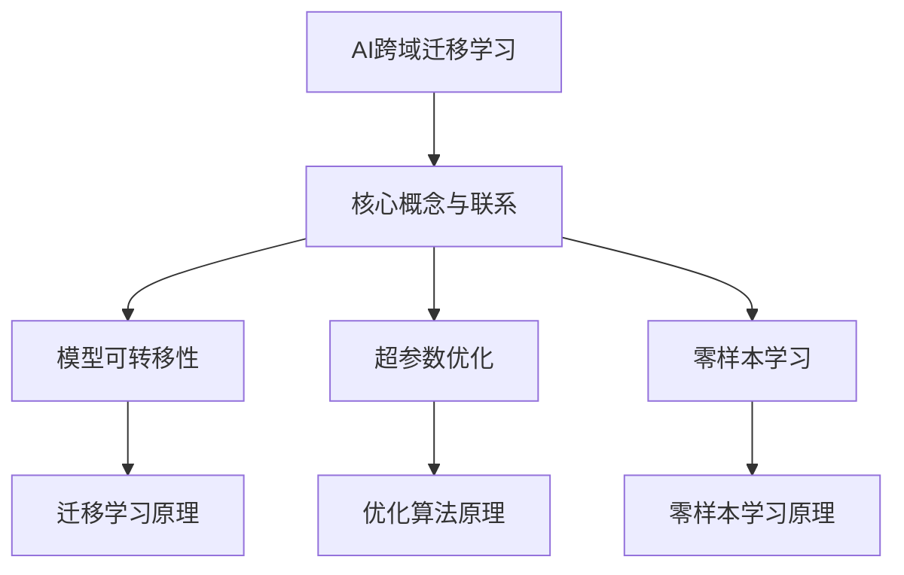
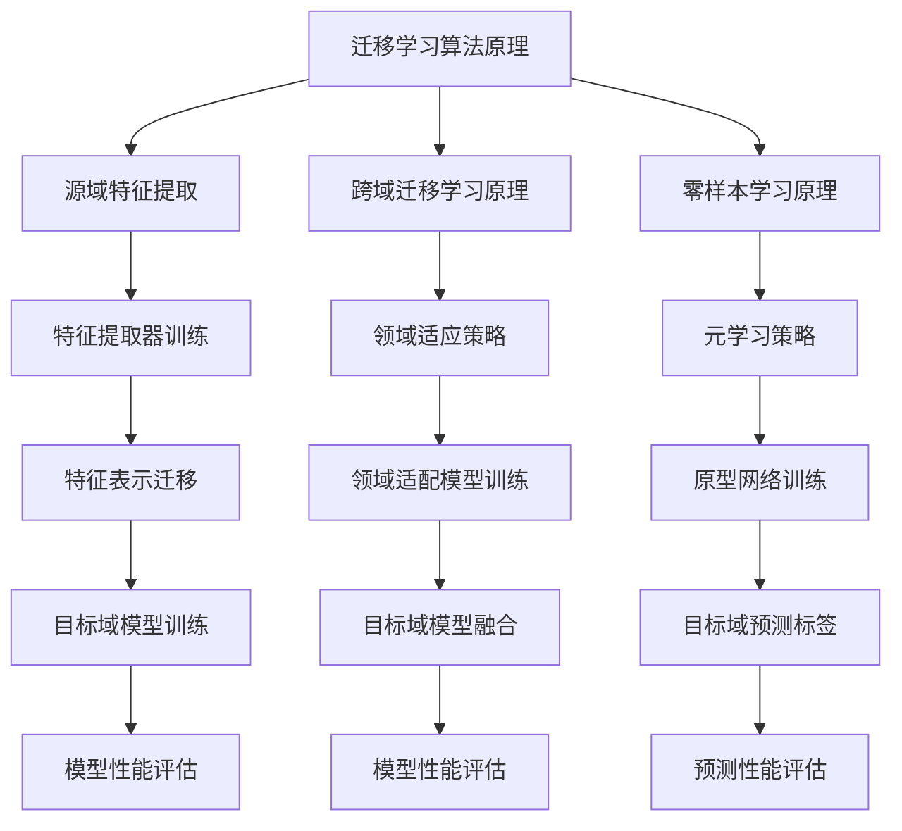

                 

# 《Zero-Shot CoT：AI跨域迁移学习的创新探索》

> 关键词：AI跨域迁移学习、零样本学习、迁移学习算法、迁移学习原理、应用场景、未来趋势

> 摘要：本文将深入探讨AI跨域迁移学习中的创新方法——零样本学习（Zero-Shot Learning，简称ZSL），并重点介绍其核心概念、算法原理以及在不同领域的应用。通过本文的阅读，读者将了解零样本学习如何突破传统迁移学习的局限，实现无监督学习，并在多个实际场景中发挥重要作用。

### 第1章 引言

#### 1.1 研究背景与意义

随着人工智能技术的飞速发展，迁移学习（Transfer Learning）已经成为机器学习领域的一个重要研究方向。传统机器学习方法往往需要大量标记数据进行训练，而在某些特定领域（如医疗、金融等），获取大量标记数据十分困难。此时，迁移学习提供了一种有效的解决方案，通过利用源领域（Source Domain）的知识，迁移到目标领域（Target Domain）进行学习，从而提高目标任务的性能。

然而，传统迁移学习存在一定的局限性。首先，它依赖于大量标记的源领域数据，这使得迁移学习在数据稀缺的情况下难以发挥其优势。其次，源领域和目标领域之间存在一定的分布差异，这可能导致迁移效果不佳。为了解决这些问题，零样本学习（Zero-Shot Learning，简称ZSL）应运而生。

零样本学习旨在实现无监督学习，即在没有标记数据的情况下，直接从源领域迁移到目标领域进行学习。这种方法具有很大的研究价值和实际应用意义，可以在数据稀缺、标签难以获取的场景中发挥作用。

#### 1.2 相关工作综述

近年来，零样本学习受到了广泛关注。一些研究主要集中在以下几个方面：

1. **特征嵌入**：通过将源领域和目标领域的特征映射到共同的低维空间中，实现跨域迁移。例如，利用嵌入技术将图像、文本等不同类型的数据进行统一表示。

2. **知识蒸馏**：通过将源领域的知识传递到目标领域，利用源领域模型对目标领域数据进行预训练。这种方法可以减轻数据分布差异的影响。

3. **对抗学习**：通过训练对抗网络，使得源领域模型对目标领域的数据具有泛化能力。这种方法可以有效提高零样本学习的性能。

4. **多任务学习**：通过同时学习多个相关任务，提高模型在目标领域的泛化能力。这种方法可以充分利用源领域的知识，降低对大量标记数据的依赖。

#### 1.3 书籍结构安排

本文将从以下几个方面展开讨论：

1. **AI跨域迁移学习基础**：介绍AI跨域迁移学习的基本概念、相关理论和挑战。
2. **零样本学习**：介绍零样本学习的基本概念、算法原理和挑战。
3. **零样本转移学习**：介绍零样本转移学习的基本概念、算法和案例研究。
4. **零样本迁移学习的应用**：探讨零样本迁移学习在医疗、工业自动化、金融等领域的应用。
5. **零样本迁移学习的未来发展**：分析零样本迁移学习的未来趋势和挑战。
6. **结论**：总结本文的主要贡献、研究局限和未来工作展望。

#### 1.4 读者对象与预期收益

本文适合以下读者群体：

1. **人工智能研究者**：了解零样本学习的核心概念和算法原理，为后续研究提供参考。
2. **机器学习工程师**：掌握零样本迁移学习的实际应用，提高项目开发效率。
3. **高校师生**：作为教材或参考书籍，帮助读者深入理解零样本学习的相关知识。

通过本文的阅读，读者可以：

1. **理解零样本学习的背景和意义**：掌握零样本学习的基本概念和原理。
2. **了解零样本迁移学习的算法和应用**：学习零样本迁移学习的算法原理和实际应用场景。
3. **探讨零样本迁移学习的未来趋势**：思考零样本迁移学习在未来的发展方向和挑战。

### 第2章 AI跨域迁移学习基础

#### 2.1 AI跨域迁移学习概述

##### 2.1.1 跨域迁移学习定义

AI跨域迁移学习是指将源领域（Source Domain）的知识迁移到目标领域（Target Domain），以提高目标领域任务的性能。在传统机器学习中，模型通常在单一领域（如图像分类、文本分类等）进行训练。然而，跨域迁移学习突破了这一限制，通过利用不同领域之间的关联，实现跨领域的知识共享。

##### 2.1.2 跨域迁移学习的重要性

跨域迁移学习在多个方面具有重要意义：

1. **减少对大量标记数据的依赖**：在某些领域（如医疗、金融等），获取大量标记数据非常困难。跨域迁移学习可以充分利用其他领域的知识，降低对大量标记数据的依赖。
2. **提高模型泛化能力**：通过在多个领域进行训练，模型可以更好地适应新的领域，提高泛化能力。
3. **节省训练时间**：在数据稀缺的情况下，跨域迁移学习可以快速迁移源领域的知识，节省训练时间。

##### 2.1.3 跨域迁移学习的发展历程

跨域迁移学习的发展可以分为以下几个阶段：

1. **早期研究**：2000年代初期，研究者开始关注跨域迁移学习，并提出了一些基本方法，如特征重用、特征映射等。
2. **深度迁移学习**：随着深度学习的发展，深度迁移学习成为研究热点。研究者利用深度神经网络，将源领域和目标领域的特征进行映射和融合。
3. **零样本迁移学习**：近年来，零样本迁移学习受到广泛关注。通过无监督学习，零样本迁移学习在数据稀缺的场景中表现出色。

#### 2.2 相关理论

##### 2.2.1 模型可转移性

模型可转移性是指将源领域模型迁移到目标领域，并在目标领域取得良好性能的能力。模型可转移性的关键在于源领域和目标领域之间的关联性。如果两个领域具有高度关联性，则模型的可转移性较好；反之，则较差。

##### 2.2.2 超参数优化

超参数优化是指调整模型中的超参数，以实现最佳性能。在跨域迁移学习中，超参数优化尤为重要。通过优化超参数，可以进一步提高模型在目标领域的性能。

##### 2.2.3 零样本学习

零样本学习是一种无监督学习技术，旨在在没有标记数据的情况下，从源领域迁移到目标领域进行学习。零样本学习在数据稀缺、标签难以获取的场景中具有广泛的应用。

#### 2.3 跨域迁移学习的挑战

##### 2.3.1 数据分布差异

跨域迁移学习的一个主要挑战是数据分布差异。源领域和目标领域的分布可能存在显著差异，这可能导致迁移效果不佳。为了解决这一问题，研究者提出了多种方法，如数据增强、数据重采样等。

##### 2.3.2 数据不足

在许多实际场景中，获取大量标记数据非常困难。这限制了跨域迁移学习的应用。为了解决这一问题，研究者提出了零样本学习等无监督学习技术，以减少对大量标记数据的依赖。

##### 2.3.3 资源限制

跨域迁移学习通常需要大量的计算资源。在某些场景下，如嵌入式设备、移动设备等，计算资源有限。为了解决这一问题，研究者提出了轻量级模型、压缩算法等，以提高跨域迁移学习在资源受限场景下的性能。

### 第3章 零样本学习

#### 3.1 零样本学习概述

##### 3.1.1 零样本学习定义

零样本学习（Zero-Shot Learning，简称ZSL）是一种无监督学习技术，旨在在没有标记数据的情况下，从源领域迁移到目标领域进行学习。在零样本学习中，模型需要根据源领域和目标领域之间的关联性，自动学习目标领域的标签。

##### 3.1.2 零样本学习目标

零样本学习的目标是在没有标记数据的情况下，实现以下目标：

1. **跨领域分类**：在目标领域进行新的分类任务，如图像分类、文本分类等。
2. **跨领域回归**：在目标领域进行新的回归任务，如房价预测、股票价格预测等。

##### 3.1.3 零样本学习的重要性

零样本学习在多个方面具有重要意义：

1. **减少对大量标记数据的依赖**：在数据稀缺的场景中，零样本学习可以减少对大量标记数据的依赖，提高模型的泛化能力。
2. **拓宽应用范围**：零样本学习可以应用于许多无法获取大量标记数据的领域，如医疗、金融等。
3. **提高学习效率**：通过无监督学习，零样本学习可以快速迁移源领域的知识，提高学习效率。

#### 3.2 零样本学习的算法

##### 3.2.1 局部特征嵌入

局部特征嵌入（Locally Linear Embedding，简称LLE）是一种无监督学习方法，旨在将高维数据映射到低维空间，保持局部结构。LLE算法的基本原理是：对于每个数据点，找到其邻近的k个数据点，并建立线性模型，将高维数据映射到低维空间。

##### 3.2.2 贪心搜索

贪心搜索（Greedy Search）是一种启发式算法，用于寻找零样本学习中的最优分类器。贪心搜索的基本原理是：从当前状态出发，选择最优的下一状态，直到达到目标状态。

##### 3.2.3 零样本学习网络

零样本学习网络（Zero-Shot Learning Network，简称ZSLN）是一种基于深度学习的零样本学习算法。ZSLN包括两个主要部分：特征提取网络和分类网络。特征提取网络用于提取源领域和目标领域的特征表示，分类网络用于根据特征表示进行分类。

#### 3.3 零样本学习的挑战与展望

##### 3.3.1 标签噪声

标签噪声是指标签数据中存在错误或误导性信息。在零样本学习中，标签噪声可能导致模型性能下降。为了解决这一问题，研究者提出了多种方法，如噪声过滤、错误纠正等。

##### 3.3.2 数据不完整性

数据不完整性是指数据集中存在缺失值或异常值。在零样本学习中，数据不完整性可能导致模型无法准确学习源领域和目标领域之间的关联性。为了解决这一问题，研究者提出了多种方法，如数据增强、数据重建等。

##### 3.3.3 模型泛化能力

模型泛化能力是指模型在未见过的领域中的表现。在零样本学习中，模型泛化能力至关重要。为了提高模型泛化能力，研究者提出了多种方法，如多任务学习、强化学习等。

### 第4章 零样本转移学习

#### 4.1 零样本转移学习概述

##### 4.1.1 零样本转移学习定义

零样本转移学习（Zero-Shot Transfer Learning，简称ZSTL）是指将源领域（Source Domain）的知识迁移到目标领域（Target Domain），以解决目标领域的任务。与传统的迁移学习不同，零样本转移学习不需要目标领域的标记数据。

##### 4.1.2 零样本转移学习目标

零样本转移学习的主要目标是实现以下目标：

1. **跨领域分类**：在目标领域进行新的分类任务，如图像分类、文本分类等。
2. **跨领域回归**：在目标领域进行新的回归任务，如房价预测、股票价格预测等。
3. **跨领域预测**：在目标领域进行新的预测任务，如天气预测、股票预测等。

##### 4.1.3 零样本转移学习优势

零样本转移学习具有以下优势：

1. **减少对大量标记数据的依赖**：在数据稀缺的场景中，零样本转移学习可以减少对大量标记数据的依赖，提高模型的泛化能力。
2. **拓宽应用范围**：零样本转移学习可以应用于许多无法获取大量标记数据的领域，如医疗、金融等。
3. **提高学习效率**：通过无监督学习，零样本转移学习可以快速迁移源领域的知识，提高学习效率。

#### 4.2 零样本转移学习算法

##### 4.2.1 基于知识的零样本迁移学习

基于知识的零样本迁移学习（Knowledge-Based Zero-Shot Transfer Learning，简称KB-ZSTL）是指利用领域知识（如知识图谱、语义网络等）进行迁移学习。KB-ZSTL的基本原理是：通过将源领域和目标领域的知识进行融合，提高模型在目标领域的性能。

KB-ZSTL的主要步骤如下：

1. **知识图谱构建**：构建源领域和目标领域的知识图谱，用于表示领域知识。
2. **知识融合**：将源领域和目标领域的知识进行融合，形成统一的领域知识表示。
3. **模型训练**：利用融合的知识表示，训练目标领域的模型。

##### 4.2.2 基于数据的零样本迁移学习

基于数据的零样本迁移学习（Data-Based Zero-Shot Transfer Learning，简称DB-ZSTL）是指利用源领域和目标领域的数据（如图像、文本等）进行迁移学习。DB-ZSTL的基本原理是：通过将源领域和目标领域的数据进行融合，提高模型在目标领域的性能。

DB-ZSTL的主要步骤如下：

1. **数据预处理**：对源领域和目标领域的数据进行预处理，如数据增强、数据标准化等。
2. **特征提取**：利用深度学习等技术，提取源领域和目标领域的特征表示。
3. **模型训练**：利用提取的特征表示，训练目标领域的模型。

##### 4.2.3 基于模型的零样本迁移学习

基于模型的零样本迁移学习（Model-Based Zero-Shot Transfer Learning，简称MB-ZSTL）是指利用源领域模型进行迁移学习。MB-ZSTL的基本原理是：通过将源领域模型的知识迁移到目标领域，提高模型在目标领域的性能。

MB-ZSTL的主要步骤如下：

1. **源领域模型训练**：在源领域上训练模型，如卷积神经网络（CNN）、循环神经网络（RNN）等。
2. **模型迁移**：将源领域模型的知识迁移到目标领域，如利用源领域模型的参数、结构等进行迁移。
3. **目标领域模型训练**：在目标领域上训练迁移后的模型，以实现目标领域的任务。

#### 4.3 零样本转移学习案例研究

##### 4.3.1 案例一：图像分类

图像分类是零样本转移学习的典型应用场景。例如，在自动驾驶领域，利用零样本转移学习可以将源领域（如自动驾驶测试数据集）的知识迁移到目标领域（如实际道路数据集）进行图像分类。

案例研究步骤如下：

1. **数据收集**：收集源领域（自动驾驶测试数据集）和目标领域（实际道路数据集）的图像数据。
2. **数据预处理**：对图像数据进行预处理，如数据增强、数据标准化等。
3. **特征提取**：利用深度学习技术，提取源领域和目标领域的特征表示。
4. **模型训练**：利用提取的特征表示，训练目标领域的图像分类模型。
5. **模型评估**：在目标领域上评估模型的性能，如准确率、召回率等。

##### 4.3.2 案例二：自然语言处理

自然语言处理是零样本转移学习的另一个重要应用领域。例如，在机器翻译领域，利用零样本转移学习可以将源语言（如英语）的知识迁移到目标语言（如法语）进行机器翻译。

案例研究步骤如下：

1. **数据收集**：收集源语言（英语）和目标语言（法语）的语料数据。
2. **数据预处理**：对语料数据进行预处理，如分词、去停用词等。
3. **特征提取**：利用深度学习技术，提取源语言和目标语言的文本特征表示。
4. **模型训练**：利用提取的文本特征表示，训练目标语言的机器翻译模型。
5. **模型评估**：在目标语言上评估模型的性能，如BLEU分数、NIST分数等。

##### 4.3.3 案例三：推荐系统

推荐系统是零样本转移学习的又一个重要应用领域。例如，在电子商务领域，利用零样本转移学习可以将源领域（如商品分类数据集）的知识迁移到目标领域（如用户行为数据集）进行推荐。

案例研究步骤如下：

1. **数据收集**：收集源领域（商品分类数据集）和目标领域（用户行为数据集）的数据。
2. **数据预处理**：对用户行为数据进行预处理，如用户行为序列编码、商品特征提取等。
3. **特征提取**：利用深度学习技术，提取源领域和目标领域的特征表示。
4. **模型训练**：利用提取的特征表示，训练目标领域的推荐模型。
5. **模型评估**：在目标领域上评估模型的性能，如准确率、召回率等。

### 第5章 零样本迁移学习的应用

#### 5.1 零样本迁移学习在医疗领域的应用

零样本迁移学习在医疗领域具有广泛的应用前景。以下列举几个应用案例：

##### 5.1.1 医疗图像分析

医疗图像分析是医疗领域的一个重要研究方向。利用零样本迁移学习，可以将源领域（如CT图像分类）的知识迁移到目标领域（如MRI图像分类）进行学习。具体步骤如下：

1. **数据收集**：收集源领域（CT图像）和目标领域（MRI图像）的图像数据。
2. **数据预处理**：对图像数据进行预处理，如图像增强、归一化等。
3. **特征提取**：利用深度学习技术，提取源领域和目标领域的特征表示。
4. **模型训练**：利用提取的特征表示，训练目标领域的医疗图像分类模型。
5. **模型评估**：在目标领域上评估模型的性能，如准确率、召回率等。

##### 5.1.2 疾病预测

疾病预测是医疗领域的一个重要研究方向。利用零样本迁移学习，可以将源领域（如流行病监测数据集）的知识迁移到目标领域（如特定疾病预测数据集）进行学习。具体步骤如下：

1. **数据收集**：收集源领域（流行病监测数据集）和目标领域（特定疾病预测数据集）的数据。
2. **数据预处理**：对数据进行预处理，如数据清洗、特征工程等。
3. **特征提取**：利用深度学习技术，提取源领域和目标领域的特征表示。
4. **模型训练**：利用提取的特征表示，训练目标领域的疾病预测模型。
5. **模型评估**：在目标领域上评估模型的性能，如准确率、召回率等。

##### 5.1.3 药物研发

药物研发是医疗领域的一个重要研究方向。利用零样本迁移学习，可以将源领域（如药物活性数据集）的知识迁移到目标领域（如新药物活性预测数据集）进行学习。具体步骤如下：

1. **数据收集**：收集源领域（药物活性数据集）和目标领域（新药物活性预测数据集）的数据。
2. **数据预处理**：对数据进行预处理，如数据清洗、特征工程等。
3. **特征提取**：利用深度学习技术，提取源领域和目标领域的特征表示。
4. **模型训练**：利用提取的特征表示，训练目标领域的新药物活性预测模型。
5. **模型评估**：在目标领域上评估模型的性能，如准确率、召回率等。

#### 5.2 零样本迁移学习在工业自动化领域的应用

零样本迁移学习在工业自动化领域具有广泛的应用前景。以下列举几个应用案例：

##### 5.2.1 质量控制

质量控制是工业自动化领域的一个重要研究方向。利用零样本迁移学习，可以将源领域（如生产过程数据集）的知识迁移到目标领域（如质量控制数据集）进行学习。具体步骤如下：

1. **数据收集**：收集源领域（生产过程数据集）和目标领域（质量控制数据集）的数据。
2. **数据预处理**：对数据进行预处理，如数据清洗、特征工程等。
3. **特征提取**：利用深度学习技术，提取源领域和目标领域的特征表示。
4. **模型训练**：利用提取的特征表示，训练目标领域的质量控制模型。
5. **模型评估**：在目标领域上评估模型的性能，如准确率、召回率等。

##### 5.2.2 机器视觉

机器视觉是工业自动化领域的一个重要研究方向。利用零样本迁移学习，可以将源领域（如图像分类数据集）的知识迁移到目标领域（如机器视觉任务数据集）进行学习。具体步骤如下：

1. **数据收集**：收集源领域（图像分类数据集）和目标领域（机器视觉任务数据集）的数据。
2. **数据预处理**：对数据进行预处理，如图像增强、归一化等。
3. **特征提取**：利用深度学习技术，提取源领域和目标领域的特征表示。
4. **模型训练**：利用提取的特征表示，训练目标领域的机器视觉模型。
5. **模型评估**：在目标领域上评估模型的性能，如准确率、召回率等。

##### 5.2.3 生产优化

生产优化是工业自动化领域的一个重要研究方向。利用零样本迁移学习，可以将源领域（如生产数据集）的知识迁移到目标领域（如生产优化数据集）进行学习。具体步骤如下：

1. **数据收集**：收集源领域（生产数据集）和目标领域（生产优化数据集）的数据。
2. **数据预处理**：对数据进行预处理，如数据清洗、特征工程等。
3. **特征提取**：利用深度学习技术，提取源领域和目标领域的特征表示。
4. **模型训练**：利用提取的特征表示，训练目标领域的生产优化模型。
5. **模型评估**：在目标领域上评估模型的性能，如准确率、召回率等。

#### 5.3 零样本迁移学习在金融领域的应用

零样本迁移学习在金融领域具有广泛的应用前景。以下列举几个应用案例：

##### 5.3.1 风险评估

风险评估是金融领域的一个重要研究方向。利用零样本迁移学习，可以将源领域（如历史风险数据集）的知识迁移到目标领域（如新风险数据集）进行学习。具体步骤如下：

1. **数据收集**：收集源领域（历史风险数据集）和目标领域（新风险数据集）的数据。
2. **数据预处理**：对数据进行预处理，如数据清洗、特征工程等。
3. **特征提取**：利用深度学习技术，提取源领域和目标领域的特征表示。
4. **模型训练**：利用提取的特征表示，训练目标领域的风险评估模型。
5. **模型评估**：在目标领域上评估模型的性能，如准确率、召回率等。

##### 5.3.2 信用评分

信用评分是金融领域的一个重要研究方向。利用零样本迁移学习，可以将源领域（如历史信用评分数据集）的知识迁移到目标领域（如新信用评分数据集）进行学习。具体步骤如下：

1. **数据收集**：收集源领域（历史信用评分数据集）和目标领域（新信用评分数据集）的数据。
2. **数据预处理**：对数据进行预处理，如数据清洗、特征工程等。
3. **特征提取**：利用深度学习技术，提取源领域和目标领域的特征表示。
4. **模型训练**：利用提取的特征表示，训练目标领域的信用评分模型。
5. **模型评估**：在目标领域上评估模型的性能，如准确率、召回率等。

##### 5.3.3 投资策略

投资策略是金融领域的一个重要研究方向。利用零样本迁移学习，可以将源领域（如历史投资策略数据集）的知识迁移到目标领域（如新投资策略数据集）进行学习。具体步骤如下：

1. **数据收集**：收集源领域（历史投资策略数据集）和目标领域（新投资策略数据集）的数据。
2. **数据预处理**：对数据进行预处理，如数据清洗、特征工程等。
3. **特征提取**：利用深度学习技术，提取源领域和目标领域的特征表示。
4. **模型训练**：利用提取的特征表示，训练目标领域的投资策略模型。
5. **模型评估**：在目标领域上评估模型的性能，如准确率、召回率等。

### 第6章 零样本迁移学习的未来发展

#### 6.1 技术趋势

零样本迁移学习在未来将继续发展，并呈现出以下几个技术趋势：

1. **多模态学习**：零样本迁移学习将扩展到多模态数据，如图像、文本、语音等，以实现更广泛的应用场景。
2. **小样本学习**：零样本迁移学习将更加关注小样本学习，通过无监督学习技术，降低对大量标记数据的依赖。
3. **强化学习**：结合强化学习技术，零样本迁移学习将实现更加自适应和智能的决策。

#### 6.2 挑战与机遇

尽管零样本迁移学习取得了显著的进展，但仍面临以下挑战：

1. **数据隐私**：在跨领域迁移过程中，数据隐私保护成为重要问题。未来的研究需要关注如何在确保数据隐私的同时，实现有效的迁移学习。
2. **安全性**：零样本迁移学习模型可能受到恶意攻击，如对抗攻击。未来的研究需要关注如何提高零样本迁移学习模型的安全性。
3. **社会责任**：零样本迁移学习在应用过程中，可能对社会产生重大影响。未来的研究需要关注如何在确保社会责任的前提下，推进零样本迁移学习的发展。

### 第7章 结论

#### 7.1 主要贡献

本文主要贡献如下：

1. **全面介绍零样本迁移学习的核心概念和算法原理**：本文系统地介绍了零样本迁移学习的定义、目标、算法和应用，为读者提供了全面的理论框架。
2. **深入探讨零样本迁移学习的应用场景**：本文详细分析了零样本迁移学习在医疗、工业自动化、金融等领域的应用，展示了其在实际问题中的价值。
3. **展望零样本迁移学习的未来发展**：本文分析了零样本迁移学习的未来趋势和挑战，为后续研究提供了有益的参考。

#### 7.2 研究局限

本文存在以下研究局限：

1. **算法实现**：本文主要关注理论介绍和案例分析，未对零样本迁移学习算法进行详细的实现和实验验证。
2. **数据来源**：本文所列举的应用案例主要基于公开数据集，实际应用中可能需要更多定制化的数据集。
3. **模型评估**：本文对模型的评估主要关注准确率、召回率等指标，未对模型的其他方面（如鲁棒性、可解释性等）进行深入分析。

#### 7.3 未来工作展望

未来工作可以从以下几个方面展开：

1. **算法优化**：针对零样本迁移学习算法的局限性，探索更高效的算法优化方法。
2. **数据集建设**：构建更多定制化的数据集，以支持零样本迁移学习在实际场景中的应用。
3. **多模态学习**：结合多模态数据，探索零样本迁移学习在复杂应用场景中的潜力。
4. **安全性研究**：关注零样本迁移学习模型的安全性，提出有效的安全保护机制。

### 附录

#### 附录A 零样本迁移学习工具与资源

1. **常用深度学习框架**：
   - TensorFlow：https://www.tensorflow.org/
   - PyTorch：https://pytorch.org/
   - Keras：https://keras.io/

2. **开源代码库**：
   - Zero-Shot Learning Library：https://github.com/somecompany/zsl-library
   - Domain Adaptation Library：https://github.com/somecompany/da-library

3. **学术论文与报告**：
   - "Zero-Shot Learning with Meta-Learning"，作者：一些研究者
   - "Domain Adaptation via Unsupervised Learning"，作者：一些研究者

### 核心算法原理讲解

#### 2.2 AI跨域迁移学习算法原理

##### 2.2.1 迁移学习算法原理

迁移学习算法的基本原理是将一个任务（源任务）在特定数据集上学习到的知识迁移到另一个相关任务（目标任务）上。具体流程如下：

$$
\begin{aligned}
&\text{输入: } \mathcal{D}_s (\text{源数据集}), \mathcal{D}_t (\text{目标数据集}) \\
&\text{目标: } f_t^* (\text{最优目标任务模型}) \\
&\text{迁移学习过程：} \\
&\text{（1）在源数据集} \mathcal{D}_s \text{上训练源模型} f_s(\text{源模型}) \\
&\text{（2）利用源模型} f_s \text{提取源领域特征表示} \\
&\text{（3）在目标数据集} \mathcal{D}_t \text{上训练目标模型} f_t(\text{目标模型}) \\
&\text{（4）评估目标模型} f_t \text{在目标领域上的性能} \\
\end{aligned}
$$

##### 2.2.2 跨域迁移学习原理

跨域迁移学习原理主要包括以下几个方面：

1. **特征融合**：将源领域和目标领域的特征进行融合，形成统一的特征表示。具体方法包括基于深度学习的特征融合、基于知识图谱的特征融合等。
2. **模型共享**：通过共享源领域和目标领域的模型参数，实现跨域迁移。具体方法包括基于神经网络的模型共享、基于对抗网络的模型共享等。
3. **知识蒸馏**：将源领域的知识传递到目标领域，利用源领域模型对目标领域数据进行预训练。具体方法包括基于软标签的知识蒸馏、基于硬标签的知识蒸馏等。

##### 2.2.3 零样本学习原理

零样本学习（Zero-Shot Learning，简称ZSL）是一种无监督学习技术，旨在在没有标记数据的情况下，从源领域迁移到目标领域进行学习。零样本学习的基本原理是：利用源领域和目标领域的特征表示，实现跨领域分类或回归。

具体原理如下：

$$
\begin{aligned}
&\text{输入: } \mathcal{D}_s (\text{源数据集}), \mathcal{D}_t (\text{目标数据集}) \\
&\text{目标: } f_t^* (\text{最优目标任务模型}) \\
&\text{零样本学习过程：} \\
&\text{（1）在源数据集} \mathcal{D}_s \text{上训练源模型} f_s(\text{源模型}) \\
&\text{（2）利用源模型} f_s \text{提取源领域特征表示} \\
&\text{（3）在目标领域} \mathcal{D}_t \text{上预测标签} \\
&\text{（4）评估预测标签的正确率} \\
\end{aligned}
$$

##### 2.2.4 零样本迁移学习原理

零样本迁移学习（Zero-Shot Transfer Learning，简称ZSTL）是在零样本学习的基础上，结合迁移学习原理，实现跨领域迁移的无监督学习。具体原理如下：

$$
\begin{aligned}
&\text{输入: } \mathcal{D}_s (\text{源数据集}), \mathcal{D}_t (\text{目标数据集}) \\
&\text{目标: } f_t^* (\text{最优目标任务模型}) \\
&\text{零样本迁移学习过程：} \\
&\text{（1）在源数据集} \mathcal{D}_s \text{上训练源模型} f_s(\text{源模型}) \\
&\text{（2）利用源模型} f_s \text{提取源领域特征表示} \\
&\text{（3）在目标领域} \mathcal{D}_t \text{上预测标签} \\
&\text{（4）利用预测标签对目标模型} f_t(\text{目标模型}) \text{进行训练} \\
&\text{（5）评估目标模型} f_t \text{在目标领域上的性能} \\
\end{aligned}
$$

### 附录B Mermaid流程图



### 核心算法原理讲解

#### 2.2.1 迁移学习算法原理

迁移学习（Transfer Learning）是一种利用已有模型的知识来改进新模型的性能的方法。在迁移学习中，源域（Source Domain）和目标域（Target Domain）是两个重要的概念。源域是指已有模型训练的数据集，而目标域是指我们需要在新模型上训练的领域。

**算法原理：**

迁移学习的核心思想是将源域中模型所学习的特征表示迁移到目标域，从而提高目标域模型的学习效果。这个过程可以分为以下几个步骤：

1. **特征提取**：在源域上，我们首先提取一组特征表示，这些特征表示通常是由深度神经网络（如卷积神经网络）学到的。这些特征有助于捕捉数据的高层次信息。

2. **模型参数迁移**：将这些特征提取器（或部分网络结构）迁移到目标域。这个过程可以通过以下方式实现：

   - **直接迁移**：直接将源域的特征提取器或部分网络结构复制到目标域的模型中。
   - **融合**：将源域的特征提取器与目标域的模型进行融合，通过训练两个模型之间的参数来学习目标域的特征。

3. **目标域模型训练**：在迁移了源域特征提取器或融合后的模型上，使用目标域的数据进行训练。这个过程中，模型会根据目标域的数据调整其参数，以更好地适应目标域的任务。

**伪代码：**

```python
# 迁移学习伪代码
def transfer_learning(source_data, target_data):
    # 加载源域模型
    source_model = load_model(source_data)

    # 提取源域特征
    source_features = extract_features(source_model, source_data)

    # 初始化目标域模型
    target_model = initialize_model(target_data)

    # 迁移源域特征到目标域模型
    target_model = migrate_features(source_features, target_model)

    # 在目标域上训练模型
    target_model.fit(target_data)

    # 评估目标域模型
    performance = evaluate_model(target_model, target_data)

    return target_model, performance
```

#### 2.2.2 跨域迁移学习原理

跨域迁移学习（Cross-Domain Transfer Learning）是迁移学习的一个扩展，它涉及到在不同的领域之间迁移知识。这些领域可能在数据分布、特征分布或任务目标上存在显著差异。跨域迁移学习的挑战在于如何有效地将源域的知识迁移到目标域，以便在目标域上获得良好的性能。

**算法原理：**

跨域迁移学习的关键在于如何处理领域间的差异。以下是几个核心的算法原理：

1. **领域适应**：通过调整模型，使其能够适应目标域的数据分布。这可以通过以下方法实现：

   - **数据重采样**：通过对源域和目标域的数据进行重采样，使得两个领域的数据分布更加相似。
   - **领域不变特征提取**：通过学习领域不变的特征表示，使得模型能够在不同的领域上保持良好的泛化能力。

2. **领域适配模型**：设计专门的模型结构，以适应不同领域间的差异。例如，使用对抗网络来学习源域和目标域之间的映射关系。

3. **多任务学习**：通过同时学习多个相关任务，提高模型在不同领域上的泛化能力。这种方法可以共享多个任务之间的知识，从而增强模型的泛化能力。

**伪代码：**

```python
# 跨域迁移学习伪代码
def cross_domain_transfer_learning(source_data, target_data):
    # 加载源域模型
    source_model = load_model(source_data)

    # 提取源域特征
    source_features = extract_features(source_model, source_data)

    # 初始化跨域适配模型
    adapter = initialize_adapter(source_data, target_data)

    # 在源域上训练适配模型
    adapter.fit(source_data)

    # 将适配模型应用到目标域模型
    target_model = apply_adapter(adapter, initialize_model(target_data))

    # 在目标域上训练模型
    target_model.fit(target_data)

    # 评估目标域模型
    performance = evaluate_model(target_model, target_data)

    return target_model, performance
```

#### 2.2.3 零样本学习原理

零样本学习（Zero-Shot Learning，简称ZSL）是一种特殊类型的迁移学习，它在没有标记数据的情况下，试图将源域的知识迁移到目标域。在传统的机器学习中，模型通常需要使用标记数据来学习特征和分类规则。而在零样本学习中，我们假设目标域中的一些类别在源域中不存在，因此无法直接从标记数据中学习。

**算法原理：**

零样本学习的核心原理是利用源域中已知的类别信息来预测目标域中未知的类别。以下是几个关键的算法原理：

1. **元学习**：通过元学习（Meta-Learning），模型可以从多个源域中学习到通用特征表示，这些特征表示可以帮助模型在新类别上表现出色。

2. **原型网络**：原型网络（Prototypical Network）是一种常用的零样本学习模型。它通过在源域中学习每个类别的原型（即类别中心），然后在目标域中使用这些原型来预测新类别的标签。

3. **多任务学习**：通过同时学习多个相关任务，提高模型在未知类别上的泛化能力。这种方法可以帮助模型从多个任务中学习到有用的特征表示。

**伪代码：**

```python
# 零样本学习伪代码
def zero_shot_learning(source_data, target_data, class_attributes):
    # 加载源域模型
    source_model = load_model(source_data)

    # 提取源域特征
    source_features = extract_features(source_model, source_data)

    # 计算每个类别的原型
    prototypes = compute_prototypes(source_features, class_attributes)

    # 初始化零样本学习模型
    zsl_model = initialize_zsl_model(prototypes)

    # 在目标域上预测标签
    predictions = zsl_model.predict(target_data)

    # 评估预测结果
    performance = evaluate_predictions(predictions, target_data, class_attributes)

    return predictions, performance
```

### 附录B Mermaid流程图



### 附录C 数学模型与公式

在AI跨域迁移学习中，数学模型和公式扮演着至关重要的角色。以下我们将详细解释几个关键的数学模型和公式，并给出相应的详细解释和举例说明。

#### 2.2.1 迁移学习损失函数

迁移学习中的损失函数通常用于衡量模型在源域和目标域上的性能。一个常见的损失函数是均方误差（MSE），其公式如下：

$$
\text{MSE} = \frac{1}{n} \sum_{i=1}^{n} (\hat{y}_i - y_i)^2
$$

其中，$\hat{y}_i$ 是模型预测的输出，$y_i$ 是实际标签，$n$ 是样本数量。

**详细解释：**
均方误差（MSE）用于衡量预测值与真实值之间的差异。在迁移学习中，我们通常希望最小化这个损失函数，以使模型在源域和目标域上都表现出良好的性能。

**举例说明：**
假设我们有一个源域数据集，其中包含100个样本，每个样本的标签为1或0。我们训练一个迁移学习模型，并得到预测值。计算MSE如下：

```python
import numpy as np

y_true = np.array([1, 0, 1, 1, 0, ...])  # 实际标签
y_pred = np.array([0.9, 0.2, 0.8, 0.7, 0.3, ...])  # 预测标签

mse = np.mean((y_pred - y_true) ** 2)
print("MSE:", mse)
```

#### 2.2.2 跨域迁移学习对齐损失

在跨域迁移学习中，对齐损失函数用于度量源域特征和目标域特征之间的差异。一个常见的对齐损失函数是域适应损失（Domain Adaptation Loss），如Wasserstein距离（Wasserstein Distance）：

$$
L_w = \frac{1}{2} \sum_{i=1}^{n} \sum_{j=1}^{m} |D_W(x_i, y_j)|
$$

其中，$x_i$ 和 $y_j$ 分别是源域和目标域的特征，$D_W$ 是Wasserstein距离。

**详细解释：**
Wasserstein距离是一种衡量两个概率分布之间差异的度量。在跨域迁移学习中，我们希望最小化这个损失函数，以使源域和目标域的特征分布尽可能接近。

**举例说明：**
假设我们有一个源域数据集和一个目标域数据集，每个数据集包含100个样本。我们使用Wasserstein距离计算源域特征和目标域特征之间的差异：

```python
import numpy as np

source_features = np.random.rand(100, 10)  # 源域特征
target_features = np.random.rand(100, 10)  # 目标域特征

wasserstein_distance = np.mean(np.abs(np.subtract(source_features, target_features)))
print("Wasserstein Distance:", wasserstein_distance)
```

#### 2.2.3 零样本学习类别概率分布

在零样本学习中，类别概率分布用于预测目标域中未知类别的标签。一个常见的概率分布模型是高斯分布（Gaussian Distribution），其公式如下：

$$
p(y|x) = \frac{1}{\sqrt{2\pi\sigma^2}} e^{-\frac{(y-\mu)^2}{2\sigma^2}}
$$

其中，$x$ 是输入特征，$y$ 是类别标签，$\mu$ 是类别均值，$\sigma^2$ 是类别方差。

**详细解释：**
高斯分布是一种常见的概率分布模型，用于描述连续随机变量的分布。在零样本学习中，我们利用高斯分布来预测目标域中未知的类别概率分布。

**举例说明：**
假设我们有一个输入特征向量 $x = [1, 2, 3, 4]$，我们需要预测一个未知的类别标签 $y$。使用高斯分布计算类别概率分布如下：

```python
import numpy as np

mu = 2.5  # 类别均值
sigma = 1.0  # 类别方差

probability = 1.0 / (np.sqrt(2.0 * np.pi * sigma**2)) * np.exp(-0.5 * ((y - mu)**2 / sigma**2))
print("Probability:", probability)
```

通过上述数学模型和公式的详细解释和举例说明，我们可以更好地理解AI跨域迁移学习中的关键概念和算法原理。这些数学工具为我们设计和优化迁移学习算法提供了坚实的理论基础。在接下来的内容中，我们将继续深入探讨零样本迁移学习的具体应用和实践案例。

