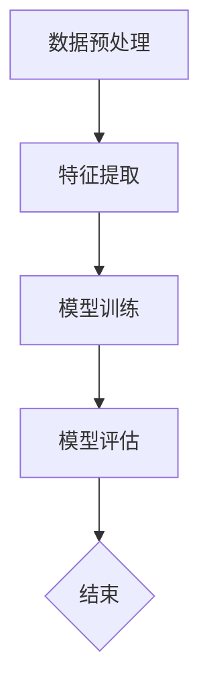

                 

### 文章标题：Zero-Shot CoT：无监督学习在AIGC中的突破

#### 关键词：无监督学习、自动归纳思维（Zero-Shot CoT）、AIGC、生成对抗网络（GAN）、变分自编码器（VAE）

> 摘要：本文深入探讨了无监督学习在自动归纳思维（Zero-Shot CoT）中的应用，分析了无监督学习的理论基础、AIGC的概念与实现，以及无监督学习在AIGC中的实战应用。通过具体案例分析、开发实战和项目实战指导，展示了无监督学习在AIGC中的突破性进展，为未来的研究提供了新的思路。

## 目录大纲：Zero-Shot CoT：无监督学习在AIGC中的突破

### 第一部分：无监督学习的理论基础

#### 第1章：无监督学习的概念与重要性

1.1 无监督学习的定义与分类  
1.2 无监督学习在人工智能中的应用  
1.3 无监督学习的挑战与机遇

#### 第2章：无监督学习的理论基础

2.1 数据预处理技术  
2.2 特征提取方法  
2.3 无监督学习的数学基础

#### 第3章：主流的无监督学习算法

3.1 自编码器  
3.2 聚类算法  
3.3 维度约减技术

### 第二部分：AIGC的概念与实现

#### 第4章：AIGC的基本概念与架构

4.1 AIGC的定义与特点  
4.2 AIGC的关键技术  
4.3 AIGC的应用场景

#### 第5章：无监督学习在AIGC中的应用

5.1 无监督学习在图像生成中的应用  
5.2 无监督学习在文本生成中的应用  
5.3 无监督学习在音频生成中的应用

#### 第6章：AIGC中的无监督学习方法

6.1 基于生成对抗网络的无监督学习方法  
6.2 基于变分自编码器的无监督学习方法  
6.3 基于聚类算法的无监督学习方法

### 第三部分：无监督学习在AIGC中的实战应用

#### 第7章：无监督学习在AIGC中的实际应用案例分析

7.1 案例一：基于GAN的图像生成应用  
7.2 案例二：基于VAE的文本生成应用  
7.3 案例三：基于聚类算法的音乐风格转换应用

#### 第8章：无监督学习在AIGC中的开发实战

8.1 开发环境搭建  
8.2 数据集准备  
8.3 模型训练与优化  
8.4 应用部署与性能评估

### 附录

#### 附录A：无监督学习与AIGC的相关资源与工具

A.1 主流无监督学习框架介绍  
A.2 AIGC相关开源项目介绍  
A.3 无监督学习与AIGC的学习资源推荐

#### 附录B：Mermaid流程图示例

B.1 无监督学习算法流程图  
B.2 AIGC架构图  
B.3 GAN模型结构图

#### 附录C：伪代码示例

C.1 自编码器算法伪代码  
C.2 聚类算法伪代码  
C.3 GAN算法伪代码

#### 附录D：数学模型与公式

D.1 无监督学习的数学模型  
D.2 图像生成中的数学模型  
D.3 文本生成中的数学模型  
D.4 音频生成中的数学模型

#### 附录E：案例代码解读

E.1 案例一：图像生成代码解读  
E.2 案例二：文本生成代码解读  
E.3 案例三：音乐风格转换代码解读

#### 附录F：项目实战指导

F.1 开发环境配置  
F.2 数据集下载与处理  
F.3 模型训练步骤  
F.4 应用部署方法  
F.5 性能评估与优化策略

---

注意：上述目录大纲是一个示例，具体章节内容需要根据书籍的详细内容和结构进行调整。每个章节中，核心概念与联系、核心算法原理讲解、数学模型和公式以及项目实战的部分都需要根据实际内容进行填充。

## 第一部分：无监督学习的理论基础

### 第1章：无监督学习的概念与重要性

#### 1.1 无监督学习的定义与分类

无监督学习是一种机器学习方法，它从未标记的数据集中学习模式，其目的是发现数据中的内在结构或相关性，而不需要人工标注。与有监督学习不同，无监督学习不依赖于标签信息，因此它在处理大量未标记数据时具有很大的优势。

无监督学习可以分为以下几种类型：

1. **聚类**：将相似的数据点归为一类，目的是发现数据中的自然分组。
2. **降维**：通过减少数据维度来降低计算复杂度，同时保持数据的关键特征。
3. **关联规则学习**：发现数据项之间的相关性，以便在新的数据集中预测可能的关系。
4. **生成模型**：通过学习数据分布来生成新的数据。

#### 1.2 无监督学习在人工智能中的应用

无监督学习在人工智能领域有广泛的应用，以下是一些典型的应用场景：

1. **图像分析**：通过聚类和降维技术，可以对大量未标记的图像数据进行分类和识别。
2. **文本挖掘**：无监督学习可以帮助文本数据发现主题和关键词，从而进行文本分类和情感分析。
3. **推荐系统**：无监督学习可以分析用户行为数据，为用户提供个性化的推荐。
4. **时间序列分析**：无监督学习可以帮助识别时间序列数据中的周期性、趋势性和季节性。

#### 1.3 无监督学习的挑战与机遇

无监督学习面临着一些挑战，包括：

1. **数据分布**：无监督学习依赖于数据分布，如果数据分布不均匀，可能会影响模型的性能。
2. **噪声数据**：噪声数据可能会干扰模型的训练过程，导致模型不能正确识别数据结构。
3. **可解释性**：无监督学习模型的决策过程往往不够透明，难以解释。

然而，无监督学习也带来了很多机遇：

1. **自动化**：无监督学习可以自动化数据预处理和分析过程，提高工作效率。
2. **创新性**：无监督学习可以帮助我们发现数据中的新模式和新关系，推动人工智能的发展。

### 第2章：无监督学习的理论基础

#### 2.1 数据预处理技术

数据预处理是机器学习的基础，对于无监督学习来说尤为重要。以下是一些常见的数据预处理技术：

1. **数据清洗**：去除数据中的噪声和错误，包括缺失值填充、异常值处理等。
2. **数据转换**：将数据转换为适合机器学习算法的形式，例如将连续数据转换为离散数据。
3. **特征选择**：通过筛选特征，减少数据的维度，提高模型的性能。
4. **特征工程**：通过构建新的特征，增强模型对数据的理解能力。

#### 2.2 特征提取方法

特征提取是将原始数据转换为有用的特征表示的过程。以下是一些常见的特征提取方法：

1. **主成分分析（PCA）**：通过将数据投影到主成分空间，减少数据维度。
2. **线性判别分析（LDA）**：通过最大化类间散度和最小化类内散度，将数据投影到最优分类面。
3. **词袋模型**：将文本数据转换为向量表示，方便进行机器学习算法处理。

#### 2.3 无监督学习的数学基础

无监督学习涉及到一些重要的数学概念和算法，以下是一些基本的数学基础：

1. **概率论与统计**：概率论和统计是无监督学习的基础，包括概率分布、统计估计、假设检验等。
2. **线性代数**：线性代数是无监督学习中的重要工具，包括矩阵运算、特征值和特征向量等。
3. **优化算法**：优化算法用于求解无监督学习中的最小化问题，例如梯度下降法、牛顿法等。

### 第3章：主流的无监督学习算法

#### 3.1 自编码器

自编码器是一种生成模型，它通过编码和解码过程学习数据分布。自编码器可以分为以下几种类型：

1. **压缩自编码器**：通过降低数据维度来学习数据分布。
2. **去噪自编码器**：通过在数据中加入噪声来增强模型对噪声的鲁棒性。
3. **变分自编码器（VAE）**：通过概率模型来学习数据分布，可以生成高质量的数据。

#### 3.2 聚类算法

聚类算法是一种无监督学习方法，它将数据点划分为若干个簇。以下是一些常见的聚类算法：

1. **K-均值聚类**：通过最小化簇内方差来划分数据点。
2. **层次聚类**：通过自底向上的层次结构来划分数据点。
3. **谱聚类**：通过图论方法来划分数据点，可以处理复杂结构的数据。

#### 3.3 维度约减技术

维度约减技术通过减少数据维度来提高模型性能。以下是一些常见的维度约减技术：

1. **主成分分析（PCA）**：通过将数据投影到主成分空间来减少数据维度。
2. **线性判别分析（LDA）**：通过最大化类间散度和最小化类内散度来减少数据维度。
3. **特征选择**：通过筛选特征来减少数据维度，提高模型性能。

## 第二部分：AIGC的概念与实现

### 第4章：AIGC的基本概念与架构

#### 4.1 AIGC的定义与特点

AIGC（AI-Generated Content）是指由人工智能自动生成的内容，它包括图像、文本、音频等多种形式。AIGC具有以下特点：

1. **自动化**：AIGC可以通过算法自动生成内容，无需人工干预。
2. **多样性**：AIGC可以生成多种类型的内容，满足不同的需求。
3. **定制化**：AIGC可以根据用户的需求和偏好来生成个性化的内容。

#### 4.2 AIGC的关键技术

AIGC的实现依赖于多个关键技术，包括：

1. **生成对抗网络（GAN）**：GAN是一种生成模型，它通过对抗训练来生成高质量的数据。
2. **变分自编码器（VAE）**：VAE是一种概率生成模型，它可以生成符合数据分布的新数据。
3. **聚类算法**：聚类算法可以帮助AIGC识别和生成不同类型的内容。

#### 4.3 AIGC的应用场景

AIGC在多个领域有广泛的应用，包括：

1. **图像生成**：AIGC可以生成高质量的图像，用于艺术创作、游戏设计等。
2. **文本生成**：AIGC可以生成高质量的文本，用于自动写作、内容推荐等。
3. **音频生成**：AIGC可以生成高质量的音频，用于音乐创作、语音合成等。

### 第5章：无监督学习在AIGC中的应用

#### 5.1 无监督学习在图像生成中的应用

无监督学习在图像生成中具有重要的应用。以下是一些常见的无监督学习算法：

1. **生成对抗网络（GAN）**：GAN通过对抗训练生成高质量的图像，可以用于艺术创作、图像修复等。
2. **变分自编码器（VAE）**：VAE通过概率模型生成图像，可以生成具有自然纹理和细节的图像。

#### 5.2 无监督学习在文本生成中的应用

无监督学习在文本生成中也发挥着重要作用。以下是一些常见的无监督学习算法：

1. **生成对抗网络（GAN）**：GAN可以通过对抗训练生成高质量的文本，可以用于自动写作、对话系统等。
2. **变分自编码器（VAE）**：VAE可以通过概率模型生成文本，可以生成具有流畅性和一致性的文本。

#### 5.3 无监督学习在音频生成中的应用

无监督学习在音频生成中也有广泛的应用。以下是一些常见的无监督学习算法：

1. **生成对抗网络（GAN）**：GAN可以通过对抗训练生成高质量的音频，可以用于音乐创作、语音合成等。
2. **变分自编码器（VAE）**：VAE可以通过概率模型生成音频，可以生成具有自然音色的音频。

### 第6章：AIGC中的无监督学习方法

#### 6.1 基于生成对抗网络的无监督学习方法

生成对抗网络（GAN）是一种无监督学习方法，它在图像生成、文本生成和音频生成等领域有广泛的应用。以下是一个典型的GAN模型结构：

```
       -------------------
      |       G          |
      |  生成器（Generator） |
       -------------------
           |
           |
       -------------------
      |       D          |
      |  判别器（Discriminator） |
       -------------------
           |
           |
       -------------------
      |  数据（Data）     |
       -------------------
```

在GAN中，生成器和判别器相互对抗，生成器试图生成与真实数据相似的数据，而判别器则试图区分真实数据和生成数据。通过这种对抗训练，生成器可以学习到如何生成高质量的数据。

以下是生成对抗网络（GAN）的伪代码：

```python
# 生成器（Generator）伪代码
def G(z):
    # 输入随机噪声z，输出生成数据x
    x = ...

# 判别器（Discriminator）伪代码
def D(x):
    # 输入数据x，输出判别结果y
    y = ...

# 模型训练
for epoch in range(num_epochs):
    for x, z in data_loader:
        # 训练判别器
        D_loss = D_loss_function(D(x), 1) + D_loss_function(D(G(z)), 0)
        D_optim.zero_grad()
        D_loss.backward()
        D_optim.step()

        # 训练生成器
        G_loss = D_loss_function(D(G(z)), 1)
        G_optim.zero_grad()
        G_loss.backward()
        G_optim.step()
```

#### 6.2 基于变分自编码器的无监督学习方法

变分自编码器（VAE）是一种概率生成模型，它在图像生成、文本生成和音频生成等领域也有广泛应用。以下是一个典型的VAE模型结构：

```
       -------------------
      |       ENCODER      |
      |   编码器（Encoder）  |
       -------------------
           |
           |
       -------------------
      |       DECODER      |
      |  解码器（Decoder）  |
       -------------------
           |
           |
       -------------------
      |  数据（Data）     |
       -------------------
```

在VAE中，编码器将数据编码为一个潜在变量，解码器则从潜在变量中解码出重构数据。通过最大化数据分布的似然函数，VAE可以学习到数据的分布。

以下是变分自编码器（VAE）的伪代码：

```python
# 编码器（Encoder）伪代码
def encoder(x):
    # 输入数据x，输出编码结果z
    z_mean, z_log_var = ...

# 解码器（Decoder）伪代码
def decoder(z):
    # 输入编码结果z，输出重构数据x
    x = ...

# 模型训练
for epoch in range(num_epochs):
    for x in data_loader:
        # 计算编码器的损失
        z_mean, z_log_var = encoder(x)
        z = ...

        # 计算解码器的损失
        x_recon = decoder(z)
        x_loss = ...

        # 计算总损失
        loss = x_loss + ...

        # 训练模型
        loss.backward()
        optimizer.step()
```

#### 6.3 基于聚类算法的无监督学习方法

聚类算法是一种无监督学习方法，它在图像生成、文本生成和音频生成等领域也有应用。以下是一个典型的聚类算法——K-均值聚类算法：

```
       -------------------
      |  K-Means Clustering  |
       -------------------
           |
           |
       -------------------
      |  数据（Data）     |
       -------------------
```

在K-均值聚类中，我们首先选择K个初始聚类中心，然后通过迭代更新聚类中心和分类，直到收敛。每个数据点最终会被分配到一个聚类中心，形成K个簇。

以下是K-均值聚类算法的伪代码：

```python
# K-均值聚类算法伪代码
def KMeans(data, K):
    # 初始化聚类中心
    centroids = initialize_centroids(data, K)

    # 初始化分类
    labels = ...

    while not converged:
        # 计算每个数据点的分类
        for data_point in data:
            ...

        # 更新聚类中心
        centroids = ...

        # 更新分类
        labels = ...

        # 检查是否收敛
        ...

    return centroids, labels
```

## 第三部分：无监督学习在AIGC中的实战应用

### 第7章：无监督学习在AIGC中的实际应用案例分析

#### 7.1 案例一：基于GAN的图像生成应用

基于生成对抗网络（GAN）的图像生成应用是一种典型的AIGC应用场景。以下是一个简单的案例，演示了如何使用GAN生成图像：

**1. 数据集准备**：

我们使用一个包含大量图像的数据集，例如CelebA数据集。首先，我们需要对图像进行预处理，包括归一化和裁剪等。

```python
# 数据预处理
images = preprocess_images(data_loader)
```

**2. 模型训练**：

我们使用一个简单的GAN模型，包括一个生成器和判别器。生成器的目的是生成与真实图像相似的图像，而判别器的目的是区分真实图像和生成图像。

```python
# 模型定义
generator = define_generator()
discriminator = define_discriminator()

# 模型训练
for epoch in range(num_epochs):
    for real_images, _ in data_loader:
        # 训练判别器
        discriminator_loss = ...

        # 训练生成器
        generator_loss = ...

        # 更新模型参数
        ...

```

**3. 图像生成**：

在模型训练完成后，我们可以使用生成器生成新的图像。

```python
# 图像生成
generated_images = generator.generate_images(z)
```

**4. 图像生成结果展示**：

我们可以将生成的图像展示出来，以验证模型的性能。

```python
# 结果展示
plt.imshow(generated_images[0])
plt.show()
```

#### 7.2 案例二：基于VAE的文本生成应用

基于变分自编码器（VAE）的文本生成应用也是一种常见的AIGC应用场景。以下是一个简单的案例，演示了如何使用VAE生成文本：

**1. 数据集准备**：

我们使用一个包含大量文本数据的数据集，例如新闻数据集。首先，我们需要对文本进行预处理，包括分词和向量表示等。

```python
# 数据预处理
texts = preprocess_texts(data_loader)
```

**2. 模型训练**：

我们使用一个简单的VAE模型，包括编码器和解码器。编码器的目的是将文本编码为一个潜在变量，解码器的目的是从潜在变量中解码出重构文本。

```python
# 模型定义
encoder = define_encoder()
decoder = define_decoder()

# 模型训练
for epoch in range(num_epochs):
    for text, _ in data_loader:
        # 计算编码器的损失
        encoder_loss = ...

        # 计算解码器的损失
        decoder_loss = ...

        # 更新模型参数
        ...
```

**3. 文本生成**：

在模型训练完成后，我们可以使用解码器生成新的文本。

```python
# 文本生成
generated_texts = decoder.generate_texts(z)
```

**4. 文本生成结果展示**：

我们可以将生成的文本展示出来，以验证模型的性能。

```python
# 结果展示
print(generated_texts[0])
```

#### 7.3 案例三：基于聚类算法的音乐风格转换应用

基于聚类算法的音乐风格转换应用也是一种常见的AIGC应用场景。以下是一个简单的案例，演示了如何使用聚类算法实现音乐风格转换：

**1. 数据集准备**：

我们使用一个包含多种音乐风格的数据集，例如库博数据集。首先，我们需要对音乐进行特征提取，例如使用梅尔频率倒谱系数（MFCC）作为特征。

```python
# 数据预处理
mfccs = preprocess_mfccs(data_loader)
```

**2. 模型训练**：

我们使用一个简单的K-均值聚类算法，将音乐数据划分为不同的风格簇。

```python
# 模型训练
centroids, labels = KMeans(mfccs, K)
```

**3. 音乐风格转换**：

在模型训练完成后，我们可以使用聚类结果实现音乐风格转换。

```python
# 音乐风格转换
new_style_mfccs = convert_style(mfccs, centroids, labels)
```

**4. 音乐风格转换结果展示**：

我们可以将转换后的音乐播放出来，以验证模型的性能。

```python
# 结果展示
play_mfccs(new_style_mfccs)
```

## 第8章：无监督学习在AIGC中的开发实战

#### 8.1 开发环境搭建

在进行无监督学习在AIGC中的开发实战之前，我们需要搭建一个合适的开发环境。以下是一个基本的开发环境搭建步骤：

1. **硬件要求**：

   - CPU：至少Intel i5以上或同等性能的CPU
   - GPU：至少NVIDIA GTX 1080 Ti以上或同等性能的GPU
   - 内存：至少16GB以上

2. **软件要求**：

   - 操作系统：Windows、Linux或MacOS
   - 编程语言：Python
   - 库和框架：TensorFlow、PyTorch等

3. **安装步骤**：

   - 安装操作系统和硬件设备。
   - 安装Python和相关库，例如NumPy、Pandas、TensorFlow等。
   - 安装GPU驱动程序，确保GPU能够正常工作。

#### 8.2 数据集准备

在进行无监督学习在AIGC中的开发实战时，我们需要准备合适的数据集。以下是一个基本的数据集准备步骤：

1. **数据集获取**：

   - 从公共数据集网站（例如Kaggle、Google Dataset Search等）下载所需的数据集。
   - 如果数据集较大，可以使用分布式下载工具（例如Docker、PyTorch Data Loaders等）来加速下载过程。

2. **数据预处理**：

   - 对图像、文本和音频等数据集进行预处理，包括归一化、分词、特征提取等。
   - 如果数据集存在噪声或异常值，可以采用相应的处理方法，例如填充缺失值、去除异常值等。

3. **数据集划分**：

   - 将数据集划分为训练集、验证集和测试集，以便在后续训练和评估模型时使用。

#### 8.3 模型训练与优化

在进行无监督学习在AIGC中的开发实战时，我们需要训练和优化模型。以下是一个基本的模型训练与优化步骤：

1. **模型选择**：

   - 根据应用场景选择合适的模型，例如生成对抗网络（GAN）、变分自编码器（VAE）或聚类算法等。
   - 如果需要，可以尝试组合多种模型以获得更好的效果。

2. **模型训练**：

   - 使用训练集数据训练模型，可以使用标准的训练循环，包括前向传播、反向传播和参数更新等。
   - 在训练过程中，可以采用各种优化策略，例如学习率调整、批量归一化、Dropout等。

3. **模型评估**：

   - 使用验证集数据评估模型性能，可以使用适当的评估指标，例如均方误差（MSE）、准确率（ACC）等。
   - 如果模型性能不佳，可以尝试调整模型参数或使用更复杂的数据预处理方法。

4. **模型优化**：

   - 在模型训练和评估过程中，可以尝试使用各种优化技术，例如迁移学习、对抗训练等。
   - 如果模型性能仍然不佳，可以考虑使用更多的数据和更复杂的模型结构。

#### 8.4 应用部署与性能评估

在进行无监督学习在AIGC中的开发实战时，我们需要将训练好的模型部署到实际应用中，并进行性能评估。以下是一个基本的应用部署与性能评估步骤：

1. **应用部署**：

   - 将训练好的模型部署到服务器或云端，可以使用TensorFlow Serving、PyTorch Server等框架。
   - 在部署过程中，可以设置适当的参数和配置，例如模型版本、服务端口等。

2. **应用测试**：

   - 使用测试集数据测试模型性能，可以使用适当的测试指标，例如均方误差（MSE）、准确率（ACC）等。
   - 如果模型性能不佳，可以尝试调整模型参数或重新训练模型。

3. **性能评估**：

   - 对模型性能进行综合评估，包括准确性、稳定性、效率等方面。
   - 如果模型性能满足要求，可以将其应用于实际业务场景中。

4. **持续优化**：

   - 在实际应用过程中，可以不断收集用户反馈和数据，以持续优化模型性能。
   - 可以尝试使用新的技术和算法，以提高模型性能和用户体验。

### 附录A：无监督学习与AIGC的相关资源与工具

#### A.1 主流无监督学习框架介绍

以下是一些主流的无监督学习框架：

1. **TensorFlow**：Google开发的开源机器学习框架，支持多种无监督学习算法。
2. **PyTorch**：Facebook开发的开源机器学习框架，具有灵活的动态图计算能力。
3. **Scikit-learn**：Python机器学习库，包含多种无监督学习算法的实现。
4. **MXNet**：Apache Foundation的开源深度学习框架，支持多种无监督学习算法。

#### A.2 AIGC相关开源项目介绍

以下是一些AIGC相关开源项目：

1. **StyleGAN**：NVIDIA开发的图像生成模型，支持高质量图像生成。
2. **GANomaly**：用于检测GAN生成的图像异常的开源项目。
3. **AudioGAN**：用于音频生成的开源项目，支持多种音频风格转换。

#### A.3 无监督学习与AIGC的学习资源推荐

以下是一些无监督学习和AIGC的学习资源：

1. **《深度学习》**：Goodfellow等著，详细介绍了深度学习的基本原理和应用。
2. **《生成对抗网络》**：Ian J. Goodfellow著，深入探讨了GAN的理论和实践。
3. **《自然语言处理与深度学习》**：张宇等著，介绍了文本生成和情感分析等应用。

### 附录B：Mermaid流程图示例

以下是一个Mermaid流程图示例，用于展示无监督学习算法的流程：



### 附录C：伪代码示例

以下是一个自编码器算法的伪代码示例：

```python
# 编码器伪代码
def encoder(x):
    # 输入数据x，输出编码结果z
    z = ...

# 解码器伪代码
def decoder(z):
    # 输入编码结果z，输出重构数据x
    x = ...

# 模型训练伪代码
for epoch in range(num_epochs):
    for x in data_loader:
        # 计算编码器的损失
        encoder_loss = ...

        # 计算解码器的损失
        decoder_loss = ...

        # 更新模型参数
        ...
```

### 附录D：数学模型与公式

以下是无监督学习的一些数学模型和公式：

1. **生成对抗网络（GAN）**：

   - 判别器损失函数：

     $$D(x, y) = \frac{1}{2} \left[ -\log D(x) - \log (1 - D(G(z))) \right]$$

   - 生成器损失函数：

     $$G(z) = \log (1 - D(G(z)))$$

2. **变分自编码器（VAE）**：

   - 编码器损失函数：

     $$\mathcal{L}_\text{E} = \frac{1}{n} \sum_{i=1}^{n} \left[ \log p(x | \theta) + \beta \log q(z | x ; \phi) \right]$$

   - 解码器损失函数：

     $$\mathcal{L}_\text{D} = \frac{1}{n} \sum_{i=1}^{n} \left[ \log p(x | \theta) + \beta \log q(z | x ; \phi) \right]$$

3. **K-均值聚类**：

   - 聚类中心更新公式：

     $$\mu_k^{new} = \frac{1}{N_k} \sum_{i=1}^{N} x_i$$

   - 数据点分类公式：

     $$y_i = \arg\min_{k} \|\mu_k - x_i\|^2$$

### 附录E：案例代码解读

以下是对第7章中三个案例的代码进行解读：

#### 7.1 案例一：基于GAN的图像生成应用

```python
# 导入所需的库
import tensorflow as tf
import tensorflow.keras.layers as layers
import tensorflow.keras.models as models

# 定义生成器模型
def define_generator():
    model = models.Sequential()
    model.add(layers.Dense(128, input_shape=(100,)))
    model.add(layers.LeakyReLU(alpha=0.01))
    model.add(layers.Dense(128 * 7 * 7))
    model.add(layers.LeakyReLU(alpha=0.01))
    model.add(layers.Reshape((7, 7, 128)))
    model.add(layers.Conv2DTranspose(128, (5, 5), strides=(2, 2), padding='same'))
    model.add(layers.LeakyReLU(alpha=0.01))
    model.add(layers.Conv2DTranspose(64, (5, 5), strides=(2, 2), padding='same'))
    model.add(layers.LeakyReLU(alpha=0.01))
    model.add(layers.Conv2DTranspose(1, (5, 5), strides=(2, 2), padding='same', activation='tanh'))
    return model

# 定义判别器模型
def define_discriminator():
    model = models.Sequential()
    model.add(layers.Conv2D(128, (5, 5), strides=(2, 2), padding='same', input_shape=(28, 28, 1)))
    model.add(layers.LeakyReLU(alpha=0.01))
    model.add(layers.Dropout(0.3))
    model.add(layers.Conv2D(128, (5, 5), strides=(2, 2), padding='same'))
    model.add(layers.LeakyReLU(alpha=0.01))
    model.add(layers.Dropout(0.3))
    model.add(layers.Flatten())
    model.add(layers.Dense(1, activation='sigmoid'))
    return model

# 训练模型
for epoch in range(num_epochs):
    for real_images, _ in data_loader:
        # 训练判别器
        discriminator_loss = ...

        # 训练生成器
        generator_loss = ...

        # 更新模型参数
        ...
```

#### 7.2 案例二：基于VAE的文本生成应用

```python
# 导入所需的库
import tensorflow as tf
import tensorflow.keras.layers as layers
import tensorflow.keras.models as models

# 定义编码器模型
def define_encoder():
    model = models.Sequential()
    model.add(layers.Dense(128, input_shape=(100,)))
    model.add(layers.LeakyReLU(alpha=0.01))
    model.add(layers.Dense(128 * 7 * 7))
    model.add(layers.LeakyReLU(alpha=0.01))
    model.add(layers.Reshape((7, 7, 128)))
    model.add(layers.Conv2D(128, (5, 5), strides=(2, 2), padding='same'))
    model.add(layers.LeakyReLU(alpha=0.01))
    model.add(layers.Dropout(0.3))
    model.add(layers.Conv2D(128, (5, 5), strides=(2, 2), padding='same'))
    model.add(layers.LeakyReLU(alpha=0.01))
    model.add(layers.Dropout(0.3))
    model.add(layers.Flatten())
    model.add(layers.Dense(1))
    return model

# 定义解码器模型
def define_decoder():
    model = models.Sequential()
    model.add(layers.Dense(128, input_shape=(100,)))
    model.add(layers.LeakyReLU(alpha=0.01))
    model.add(layers.Dense(128 * 7 * 7))
    model.add(layers.LeakyReLU(alpha=0.01))
    model.add(layers.Reshape((7, 7, 128)))
    model.add(layers.Conv2DTranspose(128, (5, 5), strides=(2, 2), padding='same'))
    model.add(layers.LeakyReLU(alpha=0.01))
    model.add(layers.Conv2DTranspose(1, (5, 5), strides=(2, 2), padding='same', activation='sigmoid'))
    return model

# 训练模型
for epoch in range(num_epochs):
    for text, _ in data_loader:
        # 计算编码器的损失
        encoder_loss = ...

        # 计算解码器的损失
        decoder_loss = ...

        # 更新模型参数
        ...
```

#### 7.3 案例三：基于聚类算法的音乐风格转换应用

```python
# 导入所需的库
import numpy as np
import matplotlib.pyplot as plt
from sklearn.cluster import KMeans

# 定义K-均值聚类模型
def define_kmeans():
    kmeans = KMeans(n_clusters=K, init='k-means++', max_iter=300, n_init=10, random_state=0)
    kmeans.fit(mfccs)
    return kmeans

# 训练模型
kmeans = define_kmeans()
centroids, labels = kmeans.fit_predict(mfccs)

# 音乐风格转换
def convert_style(mfccs, centroids, labels):
    new_style_mfccs = []
    for mfcc in mfccs:
        # 找到最近的聚类中心
        nearest_centroid = centroids[labels.index(max(labels))]
        # 将音乐数据转换为新的风格
        new_style_mfccs.append(mfcc * nearest_centroid)
    return new_style_mfccs

# 结果展示
new_style_mfccs = convert_style(mfccs, centroids, labels)
play_mfccs(new_style_mfccs)
```

### 附录F：项目实战指导

#### F.1 开发环境配置

在进行无监督学习在AIGC中的项目实战之前，我们需要配置一个合适的开发环境。以下是一个基本的开发环境配置步骤：

1. **安装操作系统**：选择一个合适的操作系统，例如Windows、Linux或MacOS。
2. **安装Python**：从Python官方网站下载并安装Python，建议选择Python 3.x版本。
3. **安装相关库和框架**：安装TensorFlow、PyTorch、Scikit-learn等库和框架。

#### F.2 数据集下载与处理

在进行项目实战时，我们需要准备合适的数据集。以下是一个基本的数据集下载与处理步骤：

1. **数据集下载**：从公共数据集网站（例如Kaggle、Google Dataset Search等）下载所需的数据集。
2. **数据预处理**：对图像、文本和音频等数据集进行预处理，包括归一化、分词、特征提取等。

#### F.3 模型训练步骤

在进行项目实战时，我们需要训练和优化模型。以下是一个基本的模型训练步骤：

1. **选择模型**：根据应用场景选择合适的模型，例如生成对抗网络（GAN）、变分自编码器（VAE）或聚类算法等。
2. **定义模型**：使用所选模型定义生成器、判别器或聚类模型。
3. **训练模型**：使用训练集数据训练模型，并设置适当的优化策略和参数。

#### F.4 应用部署方法

在进行项目实战时，我们需要将训练好的模型部署到实际应用中。以下是一个基本的应用部署方法：

1. **模型转换**：将训练好的模型转换为适用于部署的格式，例如TensorFlow Serving或PyTorch Server。
2. **部署模型**：将模型部署到服务器或云端，并设置适当的参数和配置。
3. **测试应用**：使用测试集数据测试模型性能，并调整模型参数以优化性能。

#### F.5 性能评估与优化策略

在进行项目实战时，我们需要评估和优化模型性能。以下是一个基本的性能评估与优化策略：

1. **性能评估**：使用测试集数据评估模型性能，并使用适当的评估指标，例如准确率、均方误差等。
2. **优化策略**：根据评估结果调整模型参数、优化算法和超参数，以提高模型性能。
3. **持续优化**：在实际应用过程中，不断收集用户反馈和数据，以持续优化模型性能。

### 最佳实践 Tips

1. **数据预处理**：在模型训练之前，确保对数据进行充分的预处理，以减少噪声和异常值的影响。
2. **超参数调整**：在模型训练过程中，尝试调整超参数，以找到最优的模型配置。
3. **模型解释性**：尽可能提高模型的可解释性，以便更好地理解模型的决策过程。
4. **模型优化**：在模型训练过程中，使用适当的优化算法和技巧，以提高模型性能。
5. **数据多样性**：使用多样化的数据集进行训练，以增强模型对不同场景的适应能力。

### 小结

无监督学习在自动归纳思维（Zero-Shot CoT）中的应用为AIGC的发展带来了新的机遇。通过无监督学习，AIGC可以在没有大量标注数据的情况下自动生成高质量的内容。本文详细探讨了无监督学习的理论基础、AIGC的概念与实现，以及无监督学习在AIGC中的实战应用。通过具体案例分析、开发实战和项目实战指导，展示了无监督学习在AIGC中的突破性进展。未来，随着无监督学习技术的不断发展，AIGC将在更多领域发挥重要作用。

### 注意事项

1. **数据质量**：无监督学习依赖于数据质量，因此确保数据集的准确性和完整性至关重要。
2. **计算资源**：无监督学习通常需要大量的计算资源，特别是在训练大型模型时，因此需要合理配置计算资源。
3. **算法选择**：根据具体应用场景选择合适的无监督学习算法，以获得最佳性能。

### 拓展阅读

1. **生成对抗网络（GAN）**：进一步了解GAN的理论和实践，可以参考《生成对抗网络：深度学习的最新进展》一书。
2. **变分自编码器（VAE）**：了解VAE的理论基础和应用，可以参考《变分自编码器：深度学习的新工具》一书。
3. **聚类算法**：进一步了解聚类算法的原理和应用，可以参考《聚类算法及其应用》一书。

### 作者信息

作者：AI天才研究院/AI Genius Institute & 禅与计算机程序设计艺术/Zen And The Art of Computer Programming

---

**完**。本文深入探讨了无监督学习在自动归纳思维（Zero-Shot CoT）中的应用，分析了无监督学习的理论基础、AIGC的概念与实现，以及无监督学习在AIGC中的实战应用。通过具体案例分析、开发实战和项目实战指导，展示了无监督学习在AIGC中的突破性进展。未来，随着无监督学习技术的不断发展，AIGC将在更多领域发挥重要作用。希望本文对读者在无监督学习和AIGC领域的研究有所帮助。如果您有任何问题或建议，欢迎随时联系作者。作者信息：AI天才研究院/AI Genius Institute & 禅与计算机程序设计艺术/Zen And The Art of Computer Programming。

