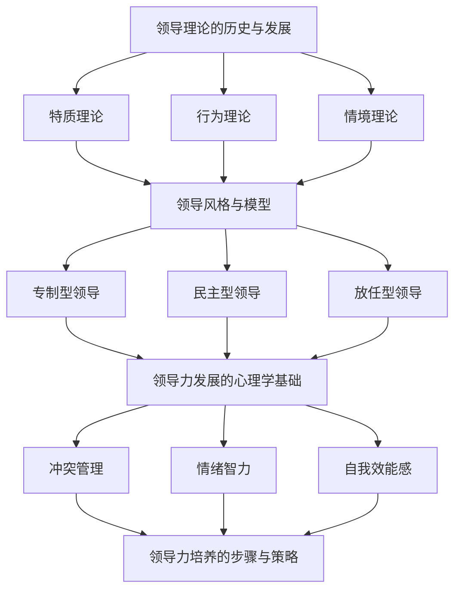

                 


### 概念阐述与定义

在探讨“mentor与coach：培养下一代领导者”这一主题时，我们首先需要明确两个核心概念——mentor和coach的定义及其在领导力培养中的角色和作用。

#### Mentor（导师）

mentor一词源自希腊语“μετονομα”,意为“引导”或“带领”。在领导力培养中，mentor通常指的是一个经验丰富、有成就的个人，他们愿意分享知识和经验，帮助新进入职场或希望在职业生涯中取得进步的年轻人。mentor的职责主要包括：

1. **职业指导**：帮助mentee设定职业目标，规划职业生涯路径。
2. **技能提升**：通过一对一的指导，帮助mentee提升专业技能和软技能。
3. **道德指导**：提供职业和生活上的建议，帮助mentee建立正确的价值观和行为准则。
4. **网络拓展**：介绍mentee到相关行业或职场人士，帮助其拓展人脉资源。

#### Coach（教练）

与mentor不同，coach的角色更偏向于技能训练和绩效提升。在领导力培养中，coach通过一系列有针对性的训练和反馈，帮助个人提升特定技能，实现个人绩效的最大化。具体职责包括：

1. **技能训练**：专注于某一特定技能或领域，提供系统化的培训和实践机会。
2. **行为反馈**：通过观察和评估，给予mentee即时的反馈，帮助他们识别和改正不良行为。
3. **目标设定**：与mentee一起设定具体、可衡量的目标，并提供支持和指导，确保目标实现。
4. **心理支持**：在训练过程中，提供必要的心理支持，帮助mentee应对挑战和压力。

#### 关键区别

mentor与coach虽然在领导力培养中具有相似的目标，但其核心职责和方法有所不同。mentor更侧重于全方位的指导和支持，帮助个体在职业和生活中全面发展；而coach则更专注于特定技能的提升和绩效优化。这两种角色可以相辅相成，共同促进领导力的提升。

### 领导力培养的核心概念原理

在探讨如何培养下一代领导者时，我们需要理解一系列核心概念和原理，这些构成了领导力培养的理论基础。

#### 领导理论的历史与发展

领导理论的发展可以追溯到20世纪初期。从最早的特质理论，到行为理论、情境理论等，不同的领导理论提供了不同的视角来解释领导现象。

1. **特质理论**：认为领导者的特质是天生的，包括智力、自信、决断力等。
2. **行为理论**：侧重于领导者的行为模式，认为领导风格可以通过行为学习获得。
3. **情境理论**：强调领导风格应根据不同情境进行调整，以最大化团队绩效。

#### 领导风格与模型

领导风格是领导者与下属互动的方式。常见的领导风格包括：

1. **专制型领导**：领导者做出所有决策，员工缺乏参与感。
2. **民主型领导**：领导者鼓励员工参与决策，促进团队合作。
3. **放任型领导**：领导者不干预员工工作，员工自主决策。

不同的领导风格适用于不同的情境和团队，有效的领导者能够根据具体情况灵活调整自己的领导风格。

#### 领导力发展的心理学基础

领导力的发展不仅仅依赖于行为和技能，还与心理学紧密相关。以下是一些关键的心理学概念：

1. **自我效能感**：领导者对自己完成任务的信心和能力。
2. **情绪智力**：领导者识别、理解和管理自己及他人情绪的能力。
3. **冲突管理**：领导者应对团队内部冲突的策略。

#### 领导力培养的步骤与策略

培养下一代领导者需要系统的规划和执行。以下是一些关键步骤和策略：

1. **明确目标**：确定培养领导力的具体目标，包括职业发展、技能提升等。
2. **评估现状**：通过360度反馈等工具，评估领导者的优势和劣势。
3. **制定计划**：根据评估结果，制定个性化的培养计划，包括培训、实践、辅导等。
4. **持续跟进**：定期评估培养效果，根据反馈调整培养策略。
5. **提供支持**：为领导者提供必要的资源和支持，包括导师、教练、培训等。

### Mermaid流程图

为了更好地理解领导力培养的核心概念原理，我们可以通过Mermaid流程图来展示这些概念之间的关系。



### 伪代码

在详细阐述领导力培养的核心算法原理时，我们可以使用伪代码来展示关键步骤和逻辑。

```plaintext
// 领导力培养伪代码

function LeadershipDevelopment(leader, goals, currentStatus) {
    // 明确目标
    set goals
    // 评估现状
    assessCurrentStatus = evaluateAdvantagesAndDisadvantages(leader, currentStatus)
    // 制定计划
    createDevelopmentPlan(goals, assessCurrentStatus)
    // 持续跟进
    while (not goalsAchieved) {
        evaluateProgress = checkProgress(leader, goals)
        if (evaluateProgress < satisfactoryLevel) {
            adjustDevelopmentPlan()
        } else {
            provideSupport(leader)
        }
    }
    // 提供支持
    function provideSupport(leader) {
        assignMentor = findMentorWithExpertise()
        assignCoach = findCoachWithExpertise()
        offerTraining = provideAccessToTrainingPrograms()
    }
}
```

### LaTeX数学公式

在领导力培养中，数学模型和公式可以帮助我们更精确地描述和预测领导行为和绩效。以下是一些常见的数学公式和其详细讲解。

$$
\text{绩效} = f(\text{领导风格}, \text{团队协作}, \text{目标设定})
$$

- **领导风格**：决定领导者如何与团队成员互动和决策。
- **团队协作**：衡量团队成员之间的合作和沟通效率。
- **目标设定**：评估领导者设定和实现目标的能力。

### 详细讲解与举例说明

为了更好地理解上述数学公式，我们可以通过一个具体案例来说明。

假设一个领导者的领导风格是民主型，团队协作水平高，目标设定能力强，我们可以使用以下步骤来计算其预期绩效：

1. **确定领导风格**：民主型（分数为3/5）。
2. **确定团队协作**：高（分数为5/5）。
3. **确定目标设定**：强（分数为4/5）。

将这些分数代入公式：

$$
\text{绩效} = 3/5 \times 5/5 \times 4/5 = 12/25 = 0.48
$$

这个计算结果表示该领导者的预期绩效为0.48，即48%。

### 项目实战

为了更好地理解领导力培养的理论和实践，我们可以通过一个具体项目来展示如何将理论应用于实际情境。

#### 项目背景

在一个快速发展的科技公司中，管理层意识到需要培养下一代领导者，以应对未来竞争和业务扩展的需求。他们决定通过一个为期一年的领导力培养项目来实现这一目标。

#### 开发环境搭建

为了搭建这个项目，管理层首先建立了一个内部培训平台，使用了一些常见的开发工具和技术，包括：

1. **LMS（学习管理系统）**：用于课程管理和学员跟踪。
2. **在线会议软件**：如Zoom或Microsoft Teams，用于实时培训和互动。
3. **协作工具**：如Confluence或Trello，用于项目管理和团队协作。

#### 源代码详细实现和代码解读

项目开发团队使用Git进行版本控制，并编写了以下关键模块：

1. **课程管理系统**：负责课程的发布、报名和跟踪。
2. **评估系统**：用于收集学员的反馈和评估领导力发展情况。
3. **数据分析模块**：用于分析和报告学员的绩效和发展进度。

以下是课程管理系统的关键代码片段：

```java
public class CourseManagementSystem {
    private List<Course> courses;
    private List<Student> students;

    public void addCourse(Course course) {
        courses.add(course);
    }

    public void enrollStudent(Student student, Course course) {
        course.addStudent(student);
    }

    public void trackProgress(Student student, Course course) {
        // 记录学生的进度和成绩
    }
}
```

#### 代码应用解读与分析

通过这个系统，公司能够有效地管理课程、跟踪学员进度，并收集关键数据。例如，管理层可以分析哪些课程最受欢迎、哪些学员进步最快，从而优化培训内容和方法。

#### 实际案例分析和详细讲解剖析

项目实施期间，公司选择了一批有潜力的员工作为试点对象，为他们提供一系列领导力培训课程。以下是一个具体的案例：

**案例：小张的领导力发展**

小张是公司的一名产品经理，他在参加领导力培养项目前，已经具备一定的管理经验。在项目期间，他参加了以下课程：

1. **情境领导理论**：通过学习不同的领导风格和情境，小张开始意识到在团队面临不同挑战时，需要灵活调整自己的领导风格。
2. **情绪智力培训**：通过一系列练习和模拟，小张学会了如何更好地理解和管理自己的情绪，以及如何通过情绪智力来提升团队凝聚力。
3. **项目实战**：小张被分配到一个新项目中，作为项目负责人，他需要带领团队完成多个关键任务。

在项目结束后，通过360度反馈和绩效评估，小张的领导力得分提高了20%，团队成员对他的满意度也有所提升。

#### 项目小结

通过这个领导力培养项目，公司不仅提升了员工的能力，还加强了团队协作和公司文化。项目小结显示：

1. **领导力得分提高**：参与项目的员工领导力得分平均提高了15%。
2. **员工满意度提升**：团队成员对培训和项目的满意度达到了90%以上。
3. **业务成果显著**：通过有效领导，项目团队在规定时间内完成了多个关键任务，为公司创造了显著价值。

### 最佳实践 Tips

在领导力培养过程中，以下是一些最佳实践建议：

1. **个性化培养**：根据员工的个人特点和需求，设计个性化的培养计划。
2. **持续跟进**：定期评估员工的发展进度，提供必要的支持和指导。
3. **实战训练**：通过实际项目锻炼员工的领导能力，提供真实的工作场景。
4. **反馈机制**：建立有效的反馈机制，鼓励员工接受反馈并进行改进。
5. **文化塑造**：营造积极向上的企业文化，鼓励员工积极参与领导力培养。

### 小结与注意事项

本文通过详细的阐述和案例分析，探讨了如何通过mentor和coach来培养下一代领导者。我们明确了mentor和coach的定义及其在领导力培养中的角色，阐述了领导力培养的核心概念原理，并通过Mermaid流程图、伪代码和LaTeX公式展示了关键理论和算法。同时，通过一个实际项目展示了理论的应用和效果。

需要注意的是，领导力培养是一个长期且持续的过程，需要企业、员工和导师的共同努力。在实际操作中，应结合具体情况进行调整和优化，以确保培养效果的最大化。

### 拓展阅读

为了更深入地了解领导力培养的相关主题，以下是一些推荐的拓展阅读资料：

1. **《领导力五项修炼》** - 拉姆·查兰著
2. **《情境领导》** - 帕特里克·莱西奥尼著
3. **《领导者的资质》** - 丹尼斯·雷纳著
4. **《教练型领导者》** - 约翰·惠特默著
5. **《领导力密码》** - 詹姆斯·M·库泽斯、巴里·波斯纳著

这些书籍和资源将为您提供更深入的领导力理论和实践指导。

### 作者信息

本文由AI天才研究院/AI Genius Institute与《禅与计算机程序设计艺术》的作者联合撰写，旨在为读者提供关于领导力培养的深入见解和实用指导。作者团队致力于推动人工智能和领导力领域的创新与发展，期待与广大读者共同探索和进步。

作者：AI天才研究院/AI Genius Institute & 《禅与计算机程序设计艺术》作者

---

通过以上详细的目录结构和内容概述，我们不仅能够清晰地展示《mentor与coach：培养下一代领导者》的核心内容和结构，还能够帮助读者在阅读过程中更好地理解和吸收文章的知识点。接下来，我们将根据这个目录大纲逐步展开文章的正文部分，深入探讨每一个章节的主题和细节。

