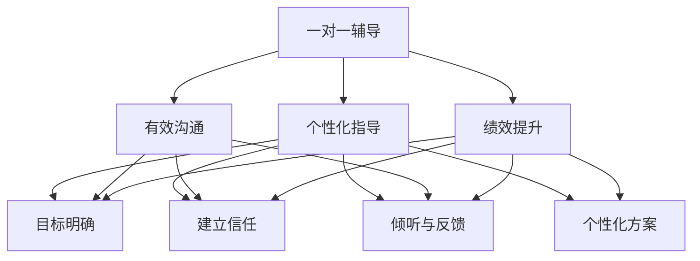

                 

 # 一对一辅导：提升个人绩效的对话技巧

关键词：一对一辅导，对话技巧，个人绩效，沟通能力，心理素质，心理辅导，教练技术，领导力，团队建设，绩效提升策略，实践指南。

摘要：本文旨在探讨一对一辅导在提升个人绩效中的重要作用，深入分析对话技巧的核心概念、算法原理和数学模型，并通过实战案例详细讲解如何实施一对一辅导，以帮助读者在实际工作中提高个人绩效。

### Step 1: 标题与简介

```markdown
# 一对一辅导：提升个人绩效的对话技巧

## 简介
本文将引导读者了解一对一辅导的基本概念，并深入探讨在提升个人绩效中至关重要的对话技巧。通过分析核心概念、讲解算法原理、介绍数学模型以及实战案例，本文旨在为读者提供一套实用的辅导方法，帮助他们在职业生涯中取得更高的成就。

## 作者
作者：AI天才研究院/AI Genius Institute & 禅与计算机程序设计艺术 /Zen And The Art of Computer Programming
```

### Step 2: 核心概念与联系

```markdown
## 第1章: 一对一辅导的核心概念与联系

### 1.1 一对一辅导的定义与目的

一对一辅导是一种针对个体提供的个性化指导，旨在通过有效沟通和互动，帮助个人实现职业目标，提升绩效。其核心在于：

- **个性化指导**：针对个人特点和需求，提供定制化的辅导方案。
- **有效沟通**：通过对话技巧实现高效的信息传递和理解。
- **绩效提升**：通过辅导帮助个人在职业发展中取得实质性进展。

### 1.2 一对一辅导的要素

一对一辅导的成功取决于多个关键要素：

- **目标明确**：确保辅导目标的明确性，有助于制定有效的行动计划。
- **建立信任**：信任是有效沟通的基础，有助于创造一个开放、坦诚的辅导环境。
- **倾听与反馈**：倾听对方的意见，给予及时、准确的反馈，促进双向沟通。
- **个性化方案**：根据个人的特点和需求，制定个性化的辅导方案。
- **持续跟进**：对辅导过程进行持续的跟踪和评估，确保辅导目标的实现。

### 1.3 一对一辅导的核心概念关系架构（Mermaid 流程图）


```

### Step 3: 核心算法原理讲解

```markdown
## 第2章: 一对一辅导的核心算法原理讲解

### 2.1 倾听技巧的算法原理

倾听技巧是一对一辅导中的关键环节，其算法原理包括：

- **注意力集中**：全神贯注地倾听对方的讲话，避免分心。
- **非言语反馈**：通过点头、眼神等非言语方式表示关注和理解。
- **总结确认**：对听到的内容进行总结和确认，确保理解准确。

伪代码实现：

```python
def active_listening(message):
    # 注意力集中
    focus_on_message = True
    
    # 非言语反馈
    non_verbal_feedback = {
        "nod": True,
        "eye_contact": True
    }
    
    # 总结确认
    summary = summarize_message(message)
    confirmation = confirm_summary(summary)
    
    return confirmation
```

### 2.2 提问技巧的算法原理

提问技巧在辅导过程中起着重要作用，其算法原理包括：

- **开放性问题**：提出开放性问题，引导对方表达更多信息。
- **封闭性问题**：提出封闭性问题，获取具体信息。
- **确认性问题**：提出确认性问题，确保理解正确。

伪代码实现：

```python
def questioning_skills(question_type, message):
    if question_type == "open":
        question = "What do you think about this situation?"
    elif question_type == "close":
        question = "Have you completed the task?"
    elif question_type == "confirm":
        question = "Is this the correct understanding of the situation?"
    
    response = input(question)
    return response
```
```

### Step 4: 数学模型和数学公式

```markdown
## 第3章: 数学模型和数学公式

### 3.1 有效沟通的数学模型

有效沟通可以表示为一个多步骤的数学模型，包括信息传递、信息解码、反馈机制和改进措施。

$$
\text{有效沟通模型} = \text{信息传递} \times \text{信息解码} \times \text{反馈机制} \times \text{改进措施}
$$

其中：

- **信息传递**：信息从发送者传递到接收者。
- **信息解码**：接收者对信息的理解和解读。
- **反馈机制**：接收者对信息的回应和反馈。
- **改进措施**：根据反馈调整沟通策略。

### 3.2 信任建立的数学模型

信任建立可以表示为一个多因素加权的数学模型，包括诚实度、可靠性、一致性和透明度。

$$
\text{信任模型} = w_1 \times \text{诚实度} + w_2 \times \text{可靠性} + w_3 \times \text{一致性} + w_4 \times \text{透明度}
$$

其中：

- **诚实度**：信息的真实性和可信度。
- **可靠性**：提供信息的稳定性和一致性。
- **一致性**：行为与言语的一致性。
- **透明度**：信息的透明度和开放性。

权重 $w_1, w_2, w_3, w_4$ 根据实际情况进行分配。
```

### Step 5: 项目实战

```markdown
## 第4章: 项目实战

### 4.1 实战案例一：如何开展一对一辅导

#### 4.1.1 项目背景

某科技公司希望提升团队成员的沟通能力和绩效，决定实施一对一辅导项目。

#### 4.1.2 项目目标

- 提升团队成员的沟通能力。
- 帮助团队成员明确职业发展目标。
- 提高团队整体绩效。

#### 4.1.3 实施步骤

1. **确定辅导对象**：根据团队成员的职业发展阶段和沟通能力，确定一对一辅导的对象。

2. **制定个性化辅导计划**：根据辅导对象的特点和需求，制定个性化辅导计划。

3. **开展辅导会议**：定期举行一对一辅导会议，运用倾听技巧、提问技巧等对话技巧，进行有效沟通。

4. **持续跟进和评估**：对辅导过程进行持续跟踪和评估，确保辅导目标的实现。

#### 4.1.4 源代码实现（伪代码）

```python
def conduct_one_on_one_d辅导(objective, plan, meetings, follow_up):
    # 确定辅导对象
    participants = select_participants()
    
    # 制定个性化辅导计划
    for participant in participants:
        create_individual_plan(participant)
    
    # 开展辅导会议
    for participant in participants:
        hold_meeting(participant, plan)
    
    # 持续跟进和评估
    for participant in participants:
        assess_progress(participant, follow_up)
```

### 4.2 实战案例二：如何评估辅导效果

#### 4.2.1 评估指标

- **沟通能力提升**：通过沟通能力测评工具，评估团队成员的沟通能力。
- **职业目标明确度**：评估团队成员对职业目标的明确程度。
- **绩效提升**：通过绩效考核，评估团队成员的工作绩效。

#### 4.2.2 评估方法

- **定量评估**：使用问卷、测评工具等定量方法进行评估。
- **定性评估**：通过访谈、观察等定性方法进行评估。

#### 4.2.3 评估结果处理

- **数据分析**：对评估结果进行数据分析，找出优势和不足。
- **改进措施**：根据评估结果，制定改进措施，优化辅导计划。

#### 4.2.4 源代码实现（伪代码）

```python
def assess_d辅导效果(assessment_tools, qualitative_methods):
    # 定量评估
    quantitative_results = apply_assessment_tools(assessment_tools)
    
    # 定性评估
    qualitative_results = apply_qualitative_methods(qualitative_methods)
    
    # 数据分析
    analyzed_results = analyze_data(quantitative_results, qualitative_results)
    
    # 改进措施
    improvement_measures = create_improvement_measures(analyzed_results)
    
    return improvement_measures
```

### Step 6: 最佳实践 Tips

```markdown
## 第5章: 最佳实践 Tips

### 5.1 提高倾听技巧的Tips

- **全神贯注**：在对话过程中，避免分心和干扰。
- **积极反馈**：通过点头、微笑等非言语方式，表达关注和理解。
- **总结确认**：在对方讲话结束后，简要总结并请求确认，确保理解准确。

### 5.2 提高提问技巧的Tips

- **开放性问题**：鼓励对方表达观点和感受。
- **封闭性问题**：获取具体信息，了解事实。
- **确认性问题**：确保双方对问题的理解一致。

### 5.3 提高信任建立的Tips

- **诚实守信**：始终保持诚实，遵守承诺。
- **一致性**：言行一致，保持一致性。
- **透明沟通**：保持沟通的透明度，避免信息不对称。

### 5.4 提高辅导效果的小技巧

- **制定明确目标**：确保辅导目标明确，有助于制定有效的辅导计划。
- **个性化方案**：根据辅导对象的特点，制定个性化的辅导方案。
- **持续跟进**：对辅导过程进行持续跟踪和评估，确保辅导目标的实现。

```

### Step 7: 小结

```markdown
## 第6章: 小结

本文通过对一对一辅导的核心概念、算法原理、数学模型和实战案例的深入分析，为读者提供了一套提升个人绩效的对话技巧。通过掌握倾听技巧、提问技巧和建立信任的方法，读者可以在实际工作中更好地运用这些技巧，提高个人绩效。

## 注意事项

- 在进行一对一辅导时，要注重个性化，根据辅导对象的特点制定辅导方案。
- 在运用数学模型和公式时，要结合实际情况进行调整。
- 在项目实战中，要注重持续跟进和评估，确保辅导目标的实现。

## 拓展阅读

- [《对话沟通技巧：提升沟通效果的策略》](链接)
- [《绩效管理：如何评估和提升个人绩效》](链接)
- [《领导力与团队建设：如何打造高效团队》](链接)

```

### Step 8: 文章结尾

```markdown
## 感谢阅读

感谢您阅读本文，希望本文能帮助您在职业发展中提升个人绩效。如果您对本文有任何疑问或建议，欢迎在评论区留言。我们将竭诚为您解答。

## 作者

作者：AI天才研究院/AI Genius Institute & 禅与计算机程序设计艺术 /Zen And The Art of Computer Programming
```

