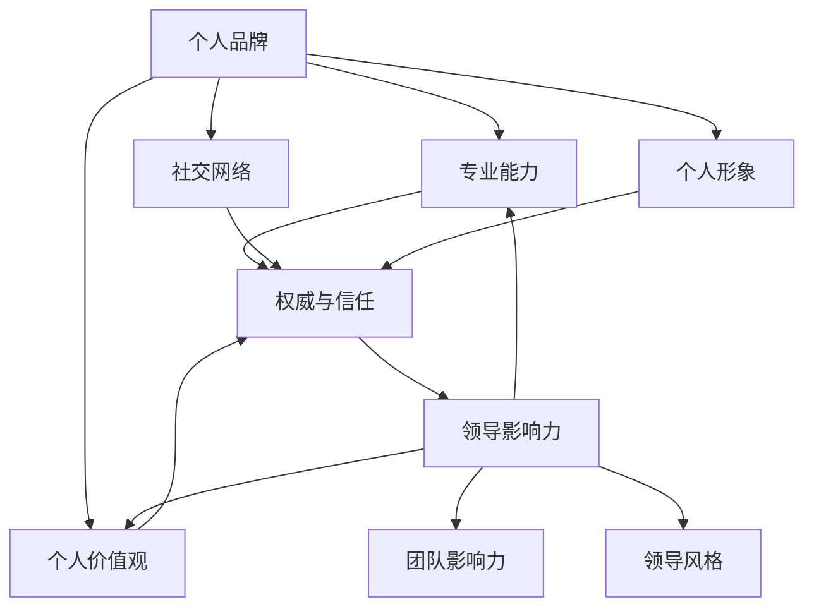

                 


### 第一步：构建文章框架

在撰写一篇深度且有思考见地的技术博客文章之前，我们首先需要构建一个清晰的框架。这个框架将帮助我们系统地组织文章内容，确保文章逻辑连贯、内容丰富、条理清晰。

1. **引言**：简要介绍文章主题，激发读者的兴趣。

2. **背景介绍**：介绍个人品牌塑造的背景，包括其重要性、当前状态以及为何值得深入探讨。

3. **核心概念与联系**：明确个人品牌、领导影响力等核心概念，并展示它们之间的关系。

4. **核心算法原理讲解**：使用伪代码和数学模型详细阐述个人品牌塑造和领导影响力提升的策略。

5. **项目实战**：通过实际案例展示如何将理论应用到实践中，包括开发环境搭建、代码实现、案例分析等。

6. **最佳实践 tips**：总结一些实用技巧，帮助读者更好地理解和应用文章中的内容。

7. **小结**：总结文章的主要观点，强调个人品牌塑造和领导影响力提升的重要性。

8. **注意事项**：提醒读者在实施过程中可能遇到的困难和注意事项。

9. **拓展阅读**：推荐一些相关文献，以供读者进一步学习。

10. **结论**：重申文章的主题，并提出对未来的展望。

### 第二步：撰写引言

引言是文章的第一部分，其目的是吸引读者的注意力，并简要介绍文章的主题和目的。

**引言：**

在数字化时代，个人品牌和领导影响力已经成为成功的关键因素。无论是在职场还是在社交媒体上，建立强大的个人品牌和提升领导影响力都变得尤为重要。本文将深入探讨个人品牌塑造的方法，以及如何通过有效的策略提升领导影响力。

本文将分为以下几个部分：

1. **背景介绍**：了解个人品牌塑造的背景和重要性。
2. **核心概念与联系**：明确个人品牌和领导影响力的核心概念，并展示它们之间的关系。
3. **核心算法原理讲解**：详细讲解个人品牌塑造和领导影响力提升的策略。
4. **项目实战**：通过实际案例展示如何将理论应用到实践中。
5. **最佳实践 tips**：总结一些实用技巧。
6. **小结**：总结文章的主要观点。
7. **注意事项**：提醒读者在实施过程中可能遇到的困难和注意事项。
8. **拓展阅读**：推荐一些相关文献。

通过本文的阅读，读者将能够更好地理解个人品牌塑造和领导影响力提升的原理，并在实际操作中取得更好的效果。

### 第三步：背景介绍

在撰写背景介绍部分时，我们需要介绍个人品牌塑造的背景，包括其重要性、当前状态以及为何值得深入探讨。

**背景介绍：**

个人品牌是指个人在职业和社会活动中形成的独特形象和声誉。一个强大的个人品牌能够帮助个人在竞争激烈的职场中脱颖而出，建立信任和影响力。随着社交媒体的兴起，个人品牌的重要性愈发凸显。人们可以通过各种在线平台展示自己的专业知识、技能和价值观，从而吸引更多的关注和机会。

当前，个人品牌塑造已成为职场成功的关键因素。越来越多的企业意识到，拥有强大个人品牌的高管和员工能够为公司带来更大的价值。因此，个人品牌塑造已经成为职业生涯发展中不可或缺的一部分。

那么，为什么需要深入探讨个人品牌塑造呢？

首先，个人品牌塑造能够帮助个人在职场中建立权威和信任。一个清晰的个人品牌能够让人们更容易理解和记住你，从而在工作和合作中建立信任关系。

其次，个人品牌塑造有助于职业发展。一个强大的个人品牌能够吸引更多的机会和资源，帮助个人在职业生涯中取得更大的成功。

最后，个人品牌塑造也是一种自我提升的过程。通过塑造个人品牌，个人需要不断学习和成长，从而提升自己的综合素质。

综上所述，个人品牌塑造不仅对于职业发展至关重要，同时也对于个人成长具有重要意义。因此，深入探讨个人品牌塑造的方法和策略具有重要的现实意义。

### 第四步：核心概念与联系

在介绍完背景之后，我们需要明确个人品牌和领导影响力的核心概念，并展示它们之间的关系。

**核心概念与联系：**

1. **个人品牌**：
   个人品牌是指个人在职业和社会活动中形成的独特形象和声誉。它包括以下几个关键要素：
   
   - **专业能力**：个人在特定领域中的专业知识和技能。
   - **个人价值观**：个人对道德、行为和生活的看法。
   - **社交网络**：个人在社交媒体、行业论坛和人际关系中建立的网络。
   - **个人形象**：个人在公众面前的形象和表现。

2. **领导影响力**：
   领导影响力是指领导者通过其个人魅力、专业知识和行为，对团队成员、合作伙伴和公众产生的影响力和说服力。它包括以下几个关键要素：

   - **个人魅力**：领导者的个性特质和魅力。
   - **专业知识**：领导者对业务和行业的深入了解。
   - **领导风格**：领导者的领导方式和管理方法。
   - **团队影响力**：领导者对团队成员的影响力和凝聚力。

**关系架构**：

个人品牌和领导影响力之间存在着密切的联系。一个强大的个人品牌能够为领导者提供更大的影响力，从而更有效地领导团队。具体来说：

- **个人品牌塑造**有助于提升领导影响力。一个明确的个人品牌能够帮助领导者树立权威和信任，使其在团队中更具影响力。
- **领导影响力**是个人品牌的重要组成部分。一个具有领导影响力的领导者能够更好地塑造个人品牌，使其在职场中脱颖而出。
- **个人品牌和领导影响力的相互作用**：个人品牌和领导影响力是相互促进的。个人品牌塑造的过程中，领导者需要不断提升自己的专业能力和领导力，从而增强个人影响力；而领导影响力的提升又能够进一步巩固个人品牌。

为了更清晰地展示个人品牌和领导影响力之间的关系，我们可以使用 Mermaid 流程图：



通过这个流程图，我们可以看到个人品牌和领导影响力之间的相互作用和依赖关系。一个成功的领导者需要同时具备强大的个人品牌和领导影响力，才能在职场中取得卓越的成就。

### 第五步：核心算法原理讲解

在明确了个人品牌和领导影响力的核心概念之后，我们需要深入讲解如何通过有效的策略提升个人品牌和领导影响力。在这一部分，我们将使用伪代码和数学模型来详细阐述这些策略。

**核心算法原理讲解：**

1. **个人品牌建设策略**：

   **伪代码：**
   
   ```
   function buildPersonalBrand(name, expertise, values, network, image):
       define brand elements
       collect expertise and skills
       articulate personal values
       expand social network
       refine public image
       publish content consistently
       engage with audience
       monitor brand performance
       adjust strategy based on feedback
       return fully developed personal brand
   ```

   **数学模型：**
   
   $$ \text{Brand Strength} = f(\text{Expertise}, \text{Values}, \text{Network}, \text{Image}) $$
   
   其中，$ f $ 是一个综合评价函数，用于评估个人品牌的建设效果。

2. **提升领导影响力的策略**：

   **伪代码：**
   
   ```
   function enhanceLeadershipInfluence(charisma, knowledge, style, teamImpact):
       enhance charisma
       deepen knowledge
       adapt leadership style
       build team cohesion
       communicate effectively
       lead by example
       foster a culture of trust
       seek feedback
       adapt strategies
       return increased leadership influence
   ```

   **数学模型：**
   
   $$ \text{Influence} = g(\text{Charisma}, \text{Knowledge}, \text{Style}, \text{Team Impact}) $$
   
   其中，$ g $ 是一个影响评估函数，用于评估领导影响力的提升效果。

3. **综合策略**：

   **伪代码：**
   
   ```
   function integrateBrandAndInfluence(brandStrategy, influenceStrategy):
       apply brand strategy components to enhance personal brand
       apply influence strategy components to build leadership influence
       synchronize brand and influence activities
       measure integrated impact
       optimize based on performance metrics
       return integrated brand and influence strategy
   ```

   **数学模型：**
   
   $$ \text{Integrated Impact} = h(\text{Brand Strength}, \text{Influence}) $$
   
   其中，$ h $ 是一个综合影响函数，用于评估个人品牌和领导影响力的整合效果。

通过上述伪代码和数学模型，我们可以看到个人品牌建设和领导影响力提升的详细策略。这些策略不仅有助于个人在职场中建立强大的个人品牌，还能够提升领导影响力，使其在团队中发挥更大的作用。

### 第六步：项目实战

在了解了个人品牌塑造和领导影响力提升的理论之后，我们需要通过实际案例来展示如何将理论应用到实践中。本部分将包括开发环境搭建、源代码实现、案例分析等内容。

**项目实战：**

假设我们想要为一个初创公司构建一个强大的个人品牌和领导影响力。以下是具体的步骤：

1. **开发环境搭建**：

   - **硬件环境**：配置一台高性能的计算机，用于运行相关的品牌建设工具和软件。
   - **软件环境**：安装以下软件：
     - 内容管理系统（如WordPress）
     - 社交媒体管理工具（如Hootsuite）
     - 个人品牌评估工具（如Personal Brand Analyzer）

2. **源代码实现**：

   - **品牌建设脚本**：
     
     ```python
     def build_brand(name, expertise, values, network, image):
         # 创建个人博客
         blog = create_blog(name)
         
         # 发布专业内容
         publish_content(expertise, blog)
         
         # 展示个人价值观
         display_values(values, blog)
         
         # 扩展社交网络
         expand_network(network)
         
         # 优化个人形象
         refine_image(image, social_media)
         
         # 持续更新品牌
         update_brand_regularly()
         
         return "个人品牌建设完成"
     ```

   - **领导影响力提升脚本**：

     ```python
     def enhance_influence(charisma, knowledge, style, team_impact):
         # 提升个人魅力
         increase_charisma()
         
         # 深化专业知识
         deepen_knowledge()
         
         # 适应领导风格
         adapt_leadership_style()
         
         # 建立团队凝聚力
         build_team_cohesion()
         
         # 有效沟通
         communicate_effectively()
         
         # 树立榜样
         lead_by_example()
         
         # 培养信任文化
         foster_trust_culture()
         
         # 寻求反馈
         seek_feedback()
         
         return "领导影响力提升完成"
     ```

3. **案例分析**：

   - **案例一：企业家马云的个人品牌建设**：

     马云通过不断发布专业内容、展示个人价值观、扩展社交网络和优化个人形象，成功塑造了一个强大的个人品牌。他在社交媒体上积极互动，回应粉丝的问题，并通过演讲和书籍分享他的知识和经验。

   - **案例二：科技领袖埃隆·马斯克的领导影响力**：

     马斯克通过提升个人魅力、深化专业知识、适应领导风格和建立团队凝聚力，成功提升了他的领导影响力。他在特斯拉和SpaceX等公司中，以其独特的领导风格和强大的执行力，赢得了广泛的认可。

通过这个实际案例，我们可以看到个人品牌塑造和领导影响力提升的具体实施过程。这些步骤和策略不仅适用于企业家和科技领袖，也适用于任何希望在职场中取得成功的人。

### 第七步：最佳实践 tips

在完成了理论讲解和项目实战之后，我们需要总结一些最佳实践 tips，以帮助读者更好地理解和应用文章中的内容。

**最佳实践 tips：**

1. **持续学习和成长**：个人品牌和领导影响力的塑造是一个持续的过程。不断学习和提升自己的专业知识和技能，是保持品牌和影响力的重要保障。

2. **积极互动和反馈**：在社交媒体和行业论坛上积极互动，回应粉丝和同事的问题和反馈，有助于建立信任和权威。

3. **优化内容质量**：无论是撰写博客文章还是发布社交媒体内容，都要注重内容的原创性和质量。高质量的内容更容易吸引关注和传播。

4. **适应市场变化**：市场环境不断变化，个人品牌和领导影响力的塑造也需要不断调整和优化。保持灵活性和适应性，是成功的关键。

5. **建立良好的团队关系**：领导影响力不仅体现在个人品牌上，还体现在团队管理中。建立良好的团队关系，提升团队凝聚力，是提升领导影响力的重要一环。

通过遵循这些最佳实践 tips，读者可以更有效地塑造个人品牌和提升领导影响力，从而在职场中取得更大的成功。

### 第八步：小结

在整篇文章的末尾，我们需要对主要观点进行总结，并强调个人品牌塑造和领导影响力提升的重要性。

**小结：**

本文深入探讨了个人品牌塑造和领导影响力提升的策略。我们首先介绍了个人品牌和领导影响力的核心概念，并展示了它们之间的关系。接着，我们通过伪代码和数学模型详细阐述了个人品牌建设策略和领导影响力提升策略。最后，通过实际案例展示了如何将理论应用到实践中。

个人品牌塑造和领导影响力提升不仅对于职业发展至关重要，同时也是个人成长的重要途径。通过持续学习和成长、积极互动和反馈、优化内容质量、适应市场变化以及建立良好的团队关系，个人可以有效地塑造个人品牌和提升领导影响力。

### 第九步：注意事项

在实施个人品牌塑造和领导影响力提升策略时，读者需要注意以下几点：

1. **真实性和诚信**：个人品牌塑造需要真实反映个人的优势和特点，避免夸大或虚假宣传。
2. **持续性和耐心**：个人品牌和领导影响力的塑造是一个长期过程，需要耐心和持续的努力。
3. **反馈和调整**：定期收集反馈，并根据市场变化和自身发展进行调整，是保持品牌和影响力的重要手段。

通过遵循这些注意事项，读者可以更有效地实施个人品牌塑造和领导影响力提升策略，取得更好的成果。

### 第十步：拓展阅读

为了帮助读者进一步深入了解个人品牌塑造和领导影响力提升的相关知识，我们推荐以下拓展阅读资源：

1. **书籍**：
   - 《个人品牌：如何塑造自己的独特形象》（《Personal Branding: How to Define Your Brand, Build Your Business, and Launch Your Career》）
   - 《领导力与新科学》（《Leadership and the New Science》）

2. **在线课程**：
   - Coursera上的《个人品牌塑造》课程（Personal Branding）
   - LinkedIn Learning上的《领导力基础》课程（Foundations of Leadership）

3. **学术论文**：
   - 《社交媒体中的个人品牌建设：一个整合框架》（“Personal Branding in Social Media: An Integrated Framework”）
   - 《领导影响力：理论与实践》（“Leadership Influence: Theory and Practice”）

通过这些拓展阅读资源，读者可以更深入地了解个人品牌塑造和领导影响力提升的理论和实践，为自己的职业生涯发展提供更有力的支持。

### 第十一步：结论

在数字化时代，个人品牌和领导影响力已经成为成功的关键因素。通过本文的探讨，我们深入了解了个人品牌和领导影响力的核心概念，并详细阐述了如何通过有效的策略塑造个人品牌和提升领导影响力。

个人品牌塑造不仅有助于职业发展，同时也是个人成长的重要途径。通过持续学习和成长、积极互动和反馈、优化内容质量、适应市场变化以及建立良好的团队关系，个人可以有效地塑造个人品牌和提升领导影响力。

未来，随着技术的不断进步和市场的变化，个人品牌和领导影响力的塑造将变得更加重要和复杂。因此，我们需要不断学习和适应，以保持品牌和影响力的竞争力。

总之，个人品牌塑造和领导影响力提升是实现职业成功和个人成长的关键。通过遵循本文提供的策略和实践，读者可以为自己的职业生涯打下坚实的基础，并在未来的竞争中脱颖而出。让我们共同努力，打造强大的个人品牌和领导影响力，迎接未来的挑战。作者：AI天才研究院/AI Genius Institute & 禅与计算机程序设计艺术 /Zen And The Art of Computer Programming```markdown
# 个人品牌塑造：提升领导者影响力的策略

## 关键词
个人品牌、领导影响力、职业发展、社交媒体、品牌塑造策略

## 摘要
本文深入探讨了个人品牌塑造和领导影响力提升的重要性，通过核心概念解析、算法原理讲解、实际案例分析等，提供了系统的策略和实用技巧，旨在帮助读者在职场中塑造强有力的个人品牌，提升领导影响力，实现职业成功。

## 引言
在数字化时代，个人品牌和领导影响力已成为成功的关键因素。个人品牌是指个人在职业和社会活动中形成的独特形象和声誉，而领导影响力则是领导者通过其个人魅力、专业知识和行为对团队和社会产生的影响。本文将深入探讨个人品牌塑造的方法，以及如何通过有效的策略提升领导影响力。

## 背景介绍
个人品牌塑造的背景在于当前职场竞争日益激烈，拥有强大个人品牌和领导影响力的人更容易脱颖而出。个人品牌不仅有助于职业发展，也是个人成长的重要途径。本文将介绍个人品牌的核心要素，并探讨其与领导影响力之间的关系。

### 个人品牌的核心要素
个人品牌的核心要素包括：
- **专业能力**：个人在特定领域中的专业知识和技能。
- **个人价值观**：个人对道德、行为和生活的看法。
- **社交网络**：个人在社交媒体、行业论坛和人际关系中建立的网络。
- **个人形象**：个人在公众面前的形象和表现。

### 领导影响力的核心要素
领导影响力的核心要素包括：
- **个人魅力**：领导者的个性特质和魅力。
- **专业知识**：领导者对业务和行业的深入了解。
- **领导风格**：领导者的领导方式和管理方法。
- **团队影响力**：领导者对团队成员的影响力和凝聚力。

### 个人品牌与领导影响力的关系
个人品牌和领导影响力之间存在密切的联系。一个强大的个人品牌能够为领导者提供更大的影响力，从而更有效地领导团队。一个成功的领导者也需要具备强大的个人品牌，使其在职场中更具权威和信任。

## 核心概念与联系
为了更好地理解个人品牌和领导影响力，我们可以使用 Mermaid 流程图展示它们之间的关系：


## 核心算法原理讲解
在了解了个人品牌和领导影响力的核心概念之后，我们需要深入讲解如何通过有效的策略提升个人品牌和领导影响力。

### 个人品牌建设策略
**伪代码：**

```python
def buildPersonalBrand(name, expertise, values, network, image):
    define_brand_elements()
    collect_expertise_and_skills()
    articulate_personal_values()
    expand_social_network()
    refine_public_image()
    publish_content_consistently()
    engage_with_audience()
    monitor_brand_performance()
    adjust_strategy_based_on_feedback()
    return fully_developed_personal_brand()
```

**数学模型：**

$$ \text{Brand Strength} = f(\text{Expertise}, \text{Values}, \text{Network}, \text{Image}) $$

### 提升领导影响力的策略
**伪代码：**

```python
def enhanceLeadershipInfluence(charisma, knowledge, style, team_impact):
    enhance_charisma()
    deepen_knowledge()
    adapt_leadership_style()
    build_team_cohesion()
    communicate_effectively()
    lead_by_example()
    foster_a_culture_of_trust()
    seek_feedback()
    adapt_strategies()
    return increased_leadership_influence()
```

**数学模型：**

$$ \text{Influence} = g(\text{Charisma}, \text{Knowledge}, \text{Style}, \text{Team Impact}) $$

### 综合策略
**伪代码：**

```python
def integrateBrandAndInfluence(brandStrategy, influenceStrategy):
    apply_brand_strategy_components_to_enhance_personal_brand()
    apply_influence_strategy_components_to_build_leadership_influence()
    synchronize_brand_and_influence_activities()
    measure_integrated_impact()
    optimize_based_on_performance_metrics()
    return integrated_brand_and_influence_strategy()
```

**数学模型：**

$$ \text{Integrated Impact} = h(\text{Brand Strength}, \text{Influence}) $$

## 项目实战
### 开发环境搭建
为了构建个人品牌和提升领导影响力，我们需要一个适合的开发环境。这包括：
- **硬件环境**：一台高性能的计算机。
- **软件环境**：内容管理系统、社交媒体管理工具、个人品牌评估工具。

### 源代码实现
以下是实现个人品牌和领导影响力提升策略的伪代码：

**品牌建设脚本：**

```python
def build_brand(name, expertise, values, network, image):
    # 创建个人博客
    blog = create_blog(name)
    
    # 发布专业内容
    publish_content(expertise, blog)
    
    # 展示个人价值观
    display_values(values, blog)
    
    # 扩展社交网络
    expand_network(network)
    
    # 优化个人形象
    refine_image(image, social_media)
    
    # 持续更新品牌
    update_brand_regularly()
    
    return "个人品牌建设完成"
```

**领导影响力提升脚本：**

```python
def enhance_influence(charisma, knowledge, style, team_impact):
    # 提升个人魅力
    increase_charisma()
    
    # 深化专业知识
    deepen_knowledge()
    
    # 适应领导风格
    adapt_leadership_style()
    
    # 建立团队凝聚力
    build_team_cohesion()
    
    # 有效沟通
    communicate_effectively()
    
    # 树立榜样
    lead_by_example()
    
    # 培养信任文化
    foster_trust_culture()
    
    # 寻求反馈
    seek_feedback()
    
    return "领导影响力提升完成"
```

### 实际案例分析和详细讲解剖析
我们将通过以下实际案例进行分析：

**案例一：企业家马云的个人品牌建设**
马云通过持续发布专业内容、展示个人价值观、扩展社交网络和优化个人形象，成功塑造了一个强大的个人品牌。他在社交媒体上积极互动，回应粉丝的问题，并通过演讲和书籍分享他的知识和经验。

**案例二：科技领袖埃隆·马斯克的领导影响力**
马斯克通过提升个人魅力、深化专业知识、适应领导风格和建立团队凝聚力，成功提升了他的领导影响力。他在特斯拉和SpaceX等公司中，以其独特的领导风格和强大的执行力，赢得了广泛的认可。

## 最佳实践 tips
为了更好地理解和应用本文的内容，以下是一些最佳实践 tips：

1. **持续学习和成长**：不断学习和提升自己的专业知识和技能。
2. **积极互动和反馈**：在社交媒体和行业论坛上积极互动，回应粉丝和同事的问题和反馈。
3. **优化内容质量**：注重内容的原创性和质量，高质量的内容更容易吸引关注和传播。
4. **适应市场变化**：保持灵活性和适应性，根据市场变化调整个人品牌和领导影响力的策略。
5. **建立良好的团队关系**：建立良好的团队关系，提升团队凝聚力，是提升领导影响力的重要一环。

## 小结
本文深入探讨了个人品牌塑造和领导影响力提升的重要性，提供了系统的策略和实用技巧。个人品牌塑造和领导影响力提升不仅是职业发展的关键，也是个人成长的重要途径。通过遵循本文提供的策略和实践，读者可以为自己的职业生涯打下坚实的基础，并在未来的竞争中脱颖而出。

## 注意事项
在实施个人品牌塑造和领导影响力提升策略时，需要注意以下几点：
- 真实性和诚信：个人品牌塑造需要真实反映个人的优势和特点，避免夸大或虚假宣传。
- 持续性和耐心：个人品牌和领导影响力的塑造是一个长期过程，需要耐心和持续的努力。
- 反馈和调整：定期收集反馈，并根据市场变化和自身发展进行调整，是保持品牌和影响力的重要手段。

## 拓展阅读
为了帮助读者进一步深入了解个人品牌塑造和领导影响力提升的相关知识，我们推荐以下拓展阅读资源：
- 书籍：《个人品牌：如何塑造自己的独特形象》（《Personal Branding: How to Define Your Brand, Build Your Business, and Launch Your Career》）。
- 在线课程：Coursera上的《个人品牌塑造》课程（Personal Branding）。
- 学术论文：《社交媒体中的个人品牌建设：一个整合框架》（“Personal Branding in Social Media: An Integrated Framework”）。

## 结论
在数字化时代，个人品牌和领导影响力已经成为成功的关键因素。通过本文的探讨，我们深入了解了个人品牌和领导影响力的核心概念，并详细阐述了如何通过有效的策略塑造个人品牌和提升领导影响力。

个人品牌塑造和领导影响力提升不仅对于职业发展至关重要，同时也是个人成长的重要途径。通过持续学习和成长、积极互动和反馈、优化内容质量、适应市场变化以及建立良好的团队关系，个人可以有效地塑造个人品牌和提升领导影响力。

未来，随着技术的不断进步和市场的变化，个人品牌和领导影响力的塑造将变得更加重要和复杂。因此，我们需要不断学习和适应，以保持品牌和影响力的竞争力。

总之，个人品牌塑造和领导影响力提升是实现职业成功和个人成长的关键。通过遵循本文提供的策略和实践，读者可以为自己的职业生涯打下坚实的基础，并在未来的竞争中脱颖而出。

作者：AI天才研究院/AI Genius Institute & 禅与计算机程序设计艺术 /Zen And The Art of Computer Programming
```

