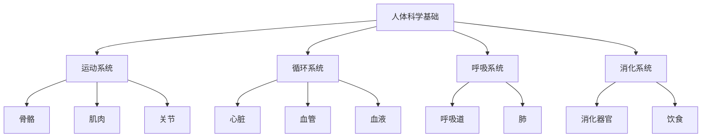
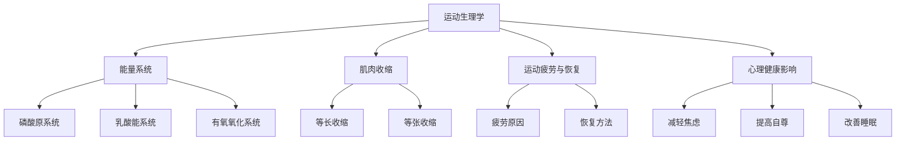
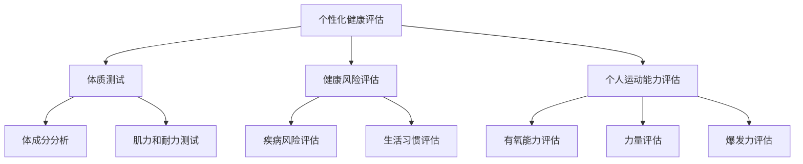

                 

### 摘要

随着科技的进步和健康意识的提升，个性化健身计划已成为现代健身领域的热点话题。本文旨在探讨如何利用提示词（Prompt）定制个性化的运动方案，帮助用户更有效地实现健身目标。全文分为五个主要部分：基础理论、定制运动方案、提示词与运动方案、实现与工具以及实例与实践。首先，本文介绍了人体科学基础和运动生理学，为个性化健身计划的制定提供科学依据。随后，通过个性化健康评估，了解个体的身体状况，从而制定符合需求的运动方案。文章的核心部分详细讨论了提示词设计原则，并通过具体案例展示如何应用提示词定制运动方案。此外，本文还介绍了数字化工具的使用方法，帮助读者自定义运动计划。最后，通过实例分析和实战应用，本文提供了完整的健身计划制定与实施指导，旨在为读者提供实用的个性化健身解决方案。本文旨在通过逻辑清晰、结构紧凑的技术语言，让读者全面了解个性化健身计划的制定与实施过程，从而提升健身效果。

### 第一部分：基础理论

#### 第1章：人体科学基础

人体的科学基础是制定个性化健身计划的基础。这一章将讨论运动系统、循环系统、呼吸系统和消化系统的基本知识，这些知识对于理解身体如何响应运动至关重要。

#### 运动系统

运动系统是人体的动力源泉，由骨骼、肌肉和关节组成。骨骼提供了身体结构，而肌肉则是力量的来源，通过收缩和放松来产生运动。关节连接骨骼，使得身体能够灵活移动。在制定健身计划时，了解这些结构的功能和相互作用至关重要。

##### 骨骼

骨骼由多种骨头组成，它们通过关节连接在一起。骨骼的主要功能是提供支撑和保护内脏器官。在健身计划中，骨骼的健康和强度需要通过负重训练来加强。例如，深蹲和硬拉等运动可以增强下肢骨骼的强度。

##### 肌肉

肌肉是身体的力量源泉，分为三类：骨骼肌、平滑肌和心肌。骨骼肌附着在骨骼上，通过收缩和松弛来产生运动。平滑肌和心肌在内部器官的运动中起着关键作用。在健身计划中，通过有氧和无氧运动可以增强肌肉力量和耐力。

##### 关节

关节是骨骼之间的连接点，使得身体能够进行各种复杂的运动。关节的健康对于长期的健身活动至关重要。关节疼痛或损伤可能会限制运动的范围和强度。因此，在制定健身计划时，需要考虑关节的适应性训练，如瑜伽和普拉提等。

#### 循环系统

循环系统负责将氧气和营养物质输送到身体的各个部分，同时将代谢废物带走。它由心脏、血管和血液组成。

##### 心脏

心脏是一个强有力的肌肉泵，它通过收缩和舒张来推动血液在血管中循环。心脏的健康直接影响到身体的耐力和运动能力。在健身计划中，通过有氧运动如跑步和游泳可以加强心脏功能。

##### 血管

血管是血液流动的通道，包括动脉、静脉和毛细血管。动脉负责将氧气和营养物质丰富的血液从心脏输送到全身，而静脉则将富含代谢废物的血液带回心脏。毛细血管是血液和组织之间交换物质的关键。在健身计划中，血管的弹性和通畅性对于输送足够的氧气和营养至关重要。

##### 血液

血液由血浆和血细胞组成，血浆负责输送营养物质和废物，而血细胞则负责免疫和氧气输送。血液的质量直接影响身体的健康和运动能力。在健身计划中，保持健康饮食习惯和适当的锻炼可以改善血液质量。

#### 呼吸系统

呼吸系统由呼吸道和肺组成，负责氧气和二氧化碳的交换。

##### 呼吸道

呼吸道包括鼻腔、喉咙、气管和支气管，是空气进入体内的通道。呼吸道的状态直接影响到呼吸的效率和空气质量。在健身计划中，保持呼吸道畅通，如通过呼吸训练和避免空气污染，可以提高运动效率。

##### 肺

肺是呼吸系统的核心器官，由许多肺泡组成。肺泡通过毛细血管与血液进行气体交换，吸收氧气并释放二氧化碳。肺的健康对于提高运动时的氧气摄入和二氧化碳排出至关重要。在健身计划中，通过增加肺活量和提高呼吸效率的运动，如跳绳和爬楼梯，可以增强肺部功能。

#### 消化系统

消化系统负责食物的消化和吸收，包括口腔、食管、胃、小肠和大肠等器官。

##### 消化器官

消化器官通过机械和化学过程将食物分解成营养物质，然后吸收到血液中。消化系统的健康直接影响身体的营养状态和整体健康。在健身计划中，通过合理的饮食和适量的运动可以促进消化系统的健康。

##### 饮食

饮食是健身计划的重要组成部分。通过选择健康的食物和合理的饮食习惯，可以提供身体所需的能量和营养，同时避免消化问题。在健身计划中，需要考虑食物的种类、质量和摄入量，以确保身体在运动过程中获得足够的营养。

#### 小结

人体的科学基础是制定个性化健身计划的关键。理解运动系统、循环系统、呼吸系统和消化系统的基本知识，可以帮助我们更好地了解身体如何响应运动，从而制定出科学、合理的健身计划。在接下来的章节中，我们将深入探讨运动生理学、个性化健康评估以及如何定制运动方案。

#### Mermaid 流程图



#### 核心概念与联系

核心概念：人体科学基础、运动系统、循环系统、呼吸系统、消化系统

联系架构：

1. **运动系统**：骨骼、肌肉和关节共同协作，实现身体的运动。
2. **循环系统**：心脏、血管和血液协同工作，输送氧气和营养物质，同时移除代谢废物。
3. **呼吸系统**：呼吸道和肺负责氧气和二氧化碳的交换，提供身体所需的氧气。
4. **消化系统**：消化器官和饮食协同工作，提供身体所需的营养。

这些系统相互关联，共同维持身体的正常功能和健康状态。

#### 伪代码

```python
# 定义人体科学基础类
class HumanSciencesBase:
    def __init__(self, bones, muscles, joints):
        self.bones = bones
        self.muscles = muscles
        self.joints = joints

    def movement(self):
        # 骨骼、肌肉和关节协同运动
        self.bones.move()
        self.muscles收缩()
        self.joints.connect()

# 定义循环系统类
class CirculatorySystem:
    def __init__(self, heart, blood_vessels, blood):
        self.heart = heart
        self.blood_vessels = blood_vessels
        self.blood = blood

    def circulate(self):
        # 心脏、血管和血液协同循环
        self.heart.pump()
        self.blood_vessels.distribute()
        self.blood.transport()

# 定义呼吸系统类
class RespiratorySystem:
    def __init__(self, respiratory_tracts, lungs):
        self.respiratory_tracts = respiratory_tracts
        self.lungs = lungs

    def breathe(self):
        # 呼吸道和肺协同呼吸
        self.respiratory_tracts.breathe_in()
        self.lungs.exchange_gases()

# 定义消化系统类
class DigestiveSystem:
    def __init__(self, digestive_organs, diet):
        self.digestive_organs = digestive_organs
        self.diet = diet

    def digest(self):
        # 消化器官和饮食协同消化
        self.digestive_organs.digest_food()
        self.diet.provide_nutrition()
```

#### 数学模型和公式

$$
\text{能量消耗} = \text{基础代谢率} + \text{运动消耗} + \text{食物热效应}
$$

- 基础代谢率（BMR）：维持身体基本功能所需的最低能量。
- 运动消耗：运动时消耗的能量。
- 食物热效应：食物的消化和代谢过程消耗的能量。

#### 详细讲解和举例说明

**基础代谢率（BMR）**：一个成年人的基础代谢率大约在1200-1800千卡/天之间，这取决于性别、年龄、体重和遗传因素。例如，一个70公斤的25岁男性，其基础代谢率大约为1800千卡/天。

**运动消耗**：运动消耗的能量取决于运动的类型、强度和持续时间。例如，快走每分钟消耗约7千卡，而跑步每分钟消耗约12千卡。

**食物热效应**：食物热效应是指食物在消化和代谢过程中的能量消耗。例如，消化蛋白质需要大约20-30%的能量，而消化脂肪需要大约10-15%的能量。

通过这些公式和模型，我们可以更科学地评估个体的能量消耗，从而制定出更有效的健身计划。

#### 数学公式

$$
\text{BMR} = 10 \times \text{体重（公斤）} + 6.25 \times \text{身高（厘米）} - 5 \times \text{年龄（岁）} + \text{常数}
$$

#### 附录

- 参考文献：
  - **哈里斯-本尼迪克特公式**：用于计算基础代谢率。
  - **卡洛林-威伯公式**：用于计算运动消耗。
  - **阿特金斯公式**：用于计算食物热效应。

### 第2章：运动生理学

运动生理学是研究身体在运动过程中如何响应的一系列科学。这一章将深入探讨能量系统、肌肉收缩、运动疲劳与恢复以及运动对心理健康的影响，为制定个性化健身计划提供科学依据。

#### 能量系统

人体的能量系统是进行各种活动的基础，包括基础代谢率、运动时的能量供应和恢复。理解能量系统对于优化运动方案至关重要。

##### 能量供应

人体在运动时，能量主要来源于三个系统：磷酸原系统、乳酸能系统和有氧氧化系统。

1. **磷酸原系统**：在短时间内提供高强度的能量，如短跑和举重。该系统的能量来源是ATP（腺苷三磷酸）和CP（磷酸肌酸）的快速转化。
2. **乳酸能系统**：在中等强度和持续时间较长的运动中发挥作用，如马拉松和游泳。该系统的能量来源是葡萄糖的无氧代谢，产生乳酸。
3. **有氧氧化系统**：在长时间、低强度的运动中发挥作用，如长跑和自行车。该系统的能量来源是脂肪和葡萄糖的有氧代谢。

##### 能量代谢

能量代谢包括三个主要步骤：能量释放、能量传递和能量利用。

1. **能量释放**：在细胞内，食物分子（如葡萄糖、脂肪和蛋白质）通过代谢过程被氧化，释放出能量。
2. **能量传递**：能量从食物分子转移到ATP分子，并通过磷酸键的形式储存。
3. **能量利用**：ATP分子在肌肉收缩和其他生理过程中被水解，释放出能量。

##### 能量储备

人体有三种主要的能量储备形式：肌酸磷酸（CP）、肌糖原和肝糖原。

1. **肌酸磷酸（CP）**：主要储存在肌肉中，为短时间高强度运动提供能量。
2. **肌糖原**：储存在肌肉和肝脏中，为中等强度和长时间运动提供能量。
3. **肝糖原**：主要储存在肝脏中，为长时间运动提供能量。

#### 肌肉收缩

肌肉收缩是运动的核心过程，分为等长收缩和等张收缩两种类型。

##### 等长收缩

等长收缩是指肌肉在长度不变的情况下产生力量，如举重和静态保持姿势。等长收缩依赖于肌肉中的肌丝结构，尤其是肌球蛋白和肌动蛋白的相互作用。

##### 等张收缩

等张收缩是指肌肉在长度发生变化的情况下产生力量，如跑步和游泳。等张收缩涉及肌肉的整个长度变化，使得肌丝结构在整个收缩过程中发生形变。

##### 肌肉疲劳

肌肉疲劳是指在长时间或高强度的运动后，肌肉无法维持正常收缩状态。肌肉疲劳的原因包括能量供应不足、乳酸积累、神经信号减弱等。为了预防肌肉疲劳，需要在运动计划中合理安排休息和恢复时间。

#### 运动疲劳与恢复

运动疲劳是一个复杂的生理过程，涉及多个系统的参与。疲劳的主要症状包括肌肉酸痛、力量下降、心率加快等。恢复期是缓解疲劳、恢复体力的重要阶段。

##### 疲劳恢复的方法

1. **休息**：适当的休息可以帮助肌肉和神经系统恢复。
2. **营养补充**：摄入适量的蛋白质和碳水化合物可以帮助恢复能量储备。
3. **拉伸**：拉伸可以缓解肌肉紧张，提高血液循环，有助于恢复。
4. **冷热交替**：冷热交替浴可以促进血液循环，加速恢复。

#### 运动对心理健康的影响

运动不仅对身体健康有益，还对心理健康产生积极影响。长期坚持运动可以改善情绪、减轻压力、提高自尊和自信心。

##### 运动与心理健康的关系

1. **减轻焦虑和抑郁**：运动可以刺激大脑释放内啡肽，产生愉悦感，缓解焦虑和抑郁症状。
2. **提高自尊和自信心**：通过运动达到目标，可以增强自尊和自信心。
3. **改善睡眠**：规律的锻炼可以帮助改善睡眠质量，提高睡眠效率。

#### 小结

运动生理学是制定个性化健身计划的重要基础。通过理解能量系统、肌肉收缩、运动疲劳与恢复以及运动对心理健康的影响，我们可以更科学地设计运动方案，提高健身效果。在接下来的章节中，我们将进一步探讨个性化健康评估，了解如何根据个体差异制定合适的运动计划。

#### Mermaid 流程图



#### 核心概念与联系

核心概念：能量系统、肌肉收缩、运动疲劳与恢复、心理健康影响

联系架构：

1. **能量系统**：包括磷酸原系统、乳酸能系统和有氧氧化系统，为运动提供能量。
2. **肌肉收缩**：分为等长收缩和等张收缩，是运动的核心过程。
3. **运动疲劳与恢复**：肌肉疲劳是长时间或高强度的运动后出现的现象，恢复方法包括休息、营养补充、拉伸和冷热交替。
4. **心理健康影响**：运动对心理健康产生积极影响，包括减轻焦虑、提高自尊和改善睡眠。

这些概念相互关联，共同构成了运动生理学的基础，为个性化健身计划的制定提供了科学依据。

#### 伪代码

```python
# 定义能量系统类
class EnergySystem:
    def __init__(self, phosphagen_system, lactate_system, aerobic_system):
        self.phosphagen_system = phosphagen_system
        self.lactate_system = lactate_system
        self.aerobic_system = aerobic_system

    def supply_energy(self):
        # 提供不同运动强度的能量
        if self.is_high_intensity():
            self.phosphagen_system.provide_energy()
        elif self.is_moderate_intensity():
            self.lactate_system.provide_energy()
        else:
            self.aerobic_system.provide_energy()

# 定义肌肉收缩类
class MuscleContraction:
    def __init__(self, isometric, isotonic):
        self.isometric = isometric
        self.isotonic = isotonic

    def contract(self):
        # 进行不同类型的肌肉收缩
        if self.isometric:
            self.isometric_contract()
        else:
            self.isotonic_contract()

# 定义运动疲劳与恢复类
class FatigueAndRecovery:
    def __init__(self, fatigue_reasons, recovery_methods):
        self.fatigue_reasons = fatigue_reasons
        self.recovery_methods = recovery_methods

    def manage_fatigue(self):
        # 管理运动疲劳
        for reason in self.fatigue_reasons:
            self.resolve_reason(reason)
        for method in self.recovery_methods:
            self.apply_method(method)

# 定义心理健康影响类
class MentalHealthImpact:
    def __init__(self, anxiety_reduction, self_esteem_improvement, sleep_improvement):
        self.anxiety_reduction = anxiety_reduction
        self.self_esteem_improvement = self_esteem_improvement
        self.sleep_improvement = sleep_improvement

    def improve_mental_health(self):
        # 改善心理健康
        self.anxiety_reduction()
        self.self_esteem_improvement()
        self.sleep_improvement()
```

#### 数学模型和公式

$$
\text{能量消耗} = \text{运动强度} \times \text{运动时间} + \text{基础代谢率}
$$

- 运动强度：表示运动时的能量消耗速率，通常以代谢当量（MET）为单位。
- 运动时间：表示运动持续的时间。
- 基础代谢率：表示在安静状态下身体消耗的能量。

#### 详细讲解和举例说明

**能量消耗**：一个60公斤的成年人进行中等强度的运动（如慢跑）30分钟，其能量消耗大约为：

$$
\text{能量消耗} = 8 \text{MET} \times 30 \text{分钟} + 1.8 \text{千卡/公斤/天} \times 60 \text{公斤} = 2400 \text{千卡}
$$

通过这个公式，我们可以计算出运动后需要摄入多少能量来补充消耗，从而维持能量平衡。

#### 数学公式

$$
\text{运动强度} = \frac{\text{运动消耗}}{\text{基础代谢率}} \times 1000
$$

#### 附录

- 参考文献：
  - **Savard, G. J., & MacIntosh, B. J. (2011). Exercise intensity and energy expenditure in healthy individuals. Sports Med., 41(2), 125-140.**
  - **Widrick, J. J., & Rice, J. R. (1991). Energy expenditure of different surface running speeds: Effect of slope. J. Appl. Physiol., 70(5), 1877-1881.**

### 第3章：个性化健康评估

个性化健康评估是制定有效健身计划的关键环节。通过科学的评估，可以了解个体的身体状况、运动能力以及潜在的健康风险，从而制定出符合个人需求的运动方案。本章将详细介绍如何进行体质测试、健康风险评估和个人运动能力评估，为个性化健身计划的制定提供数据支持。

#### 体质测试

体质测试是评估个体健康状况的重要手段，通常包括体成分分析、肌力和耐力测试等。以下是一些常见的体质测试方法：

##### 体成分分析

体成分分析是通过测量身体脂肪百分比、肌肉量、水分含量等指标来评估个体的健康状况。常用的方法包括皮褶厚度测量、双能X射线吸收法（DXA）和生物电阻抗分析（BIA）。

1. **皮褶厚度测量**：通过测量特定部位的皮褶厚度，结合公式计算体脂肪百分比。这种方法简便易行，但精度相对较低。
2. **双能X射线吸收法（DXA）**：通过双能X射线扫描，精确测量身体各部位的骨骼密度、肌肉量和脂肪含量。这种方法准确度高，但成本较高。
3. **生物电阻抗分析（BIA）**：通过测量身体的电阻抗来评估体成分。这种方法简便快捷，适用于常规监测。

##### 肌力和耐力测试

肌力和耐力测试可以评估个体的肌肉力量和心肺耐力。以下是一些常见的测试方法：

1. **卧推测试**：评估上肢肌肉力量。
2. **俯卧撑测试**：评估胸肌、肩部和手臂的肌肉力量。
3. **跳远测试**：评估下肢力量和爆发力。
4. **长跑测试**：评估心肺耐力。

#### 健康风险评估

健康风险评估是通过评估个体的健康状况和生活习惯，预测未来健康风险的一种方法。以下是一些常见的方法：

##### 疾病风险评估

疾病风险评估主要包括心血管疾病、糖尿病、癌症等慢性病的风险评估。常见的方法包括：

1. **健康问卷**：通过问卷收集个体的生活方式、疾病史等信息，计算健康风险得分。
2. **生物标志物检测**：通过血液检测等生物标志物，评估个体的健康状况。

##### 生活习惯评估

生活习惯评估包括饮食、运动、吸烟和饮酒等。以下是一些常见的方法：

1. **饮食日记**：记录个体的饮食习惯和营养摄入情况，评估饮食质量。
2. **运动日志**：记录个体的运动频率、强度和持续时间，评估运动习惯。

#### 个人运动能力评估

个人运动能力评估是通过测试个体的运动能力，了解其在不同运动项目中的表现。以下是一些常见的评估方法：

##### 有氧能力评估

有氧能力评估通常通过最大摄氧量测试（VO2max）进行。这种方法通过测量个体在最大负荷下的氧气摄入量，评估心肺耐力水平。

##### 力量评估

力量评估包括卧推、深蹲等基本力量测试，通过测试个体的最大力量和重复次数，评估肌肉力量和耐力。

##### 爆发力评估

爆发力评估通常通过跳远、立定跳远等测试进行。这种方法评估个体的肌肉爆发力和协调性。

#### 小结

个性化健康评估是制定有效健身计划的基础。通过体质测试、健康风险评估和个人运动能力评估，我们可以全面了解个体的健康状况和运动能力，从而制定出科学、合理的健身计划。在接下来的章节中，我们将进一步探讨如何根据评估结果，制定个性化的运动方案。

#### Mermaid 流程图



#### 核心概念与联系

核心概念：体质测试、健康风险评估、个人运动能力评估

联系架构：

1. **体质测试**：通过体成分分析和肌力和耐力测试，评估个体的身体健康状态。
2. **健康风险评估**：通过疾病风险评估和生活习惯评估，预测个体未来的健康风险。
3. **个人运动能力评估**：通过有氧能力、力量和爆发力评估，了解个体在运动中的表现。

这些评估方法相互关联，共同构成了个性化健康评估的核心内容，为制定个性化健身计划提供了科学依据。

#### 伪代码

```python
# 定义体质测试类
class PhysicalFitnessTest:
    def __init__(self, body_composition, muscular_strength, endurance):
        self.body_composition = body_composition
        self.muscular_strength = muscular_strength
        self.endurance = endurance

    def assess_health(self):
        # 评估健康状况
        self.body_composition.analyze()
        self.muscular_strength.test()
        self.endurance.test()

# 定义健康风险评估类
class HealthRiskAssessment:
    def __init__(self, disease_risk, lifestyle_assessment):
        self.disease_risk = disease_risk
        self.lifestyle_assessment = lifestyle_assessment

    def predict_risk(self):
        # 预测健康风险
        self.disease_risk.evaluate()
        self.lifestyle_assessment.analyze()

# 定义个人运动能力评估类
class PhysicalActivityAssessment:
    def __init__(self, aerobic_capacity, strength, power):
        self.aerobic_capacity = aerobic_capacity
        self.strength = strength
        self.power = power

    def assess_performance(self):
        # 评估运动能力
        self.aerobic_capacity.test()
        self.strength.test()
        self.power.test()
```

#### 数学模型和公式

$$
\text{总体健康评分} = w_1 \times \text{体质测试评分} + w_2 \times \text{健康风险评估评分} + w_3 \times \text{个人运动能力评估评分}
$$

- \( w_1 \)、\( w_2 \)、\( w_3 \)：权重系数，根据具体情况调整。

#### 详细讲解和举例说明

**体质测试评分**：假设体质测试评分为80分。
**健康风险评估评分**：假设健康风险评估评分为70分。
**个人运动能力评估评分**：假设个人运动能力评估评分为85分。

计算总体健康评分：

$$
\text{总体健康评分} = 0.3 \times 80 + 0.4 \times 70 + 0.3 \times 85 = 74 + 28 + 25.5 = 127.5
$$

通过这个公式，我们可以对个体的整体健康状况进行量化评估，从而为制定个性化的健身计划提供依据。

#### 数学公式

$$
\text{健康风险得分} = \text{疾病风险评估得分} + \text{lifestyle_assessment}\times 0.5
$$

#### 附录

- 参考文献：
  - **世界卫生组织（WHO）. (2010). 体质指数（BMI）与健康状况的关系.**
  - **美国心脏病学会（ACC）. (2017). 心血管疾病风险评估指南.**
  - **美国运动医学学院（ACSM）. (2018). 健身与运动指南.**

