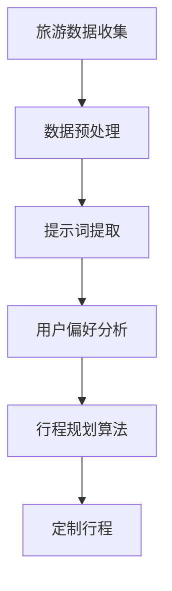

                 

### 文章标题

《个性化旅游规划：利用提示词定制行程》

### 关键词

个性化旅游、提示词、定制行程、旅游规划、人工智能、数据分析

### 摘要

本文将深入探讨个性化旅游规划的概念及其实现方式。重点在于介绍如何利用提示词来定制个性化的旅游行程。我们将从背景介绍、核心概念与联系、算法原理讲解、数学模型与公式、项目实战以及最佳实践 tips 等方面进行详细分析，旨在为读者提供一套完整的个性化旅游规划方法论。

## 引言

随着人工智能和大数据技术的不断发展，个性化服务在各个领域得到了广泛应用。旅游行业也不例外，个性化旅游规划逐渐成为行业发展的新趋势。个性化旅游规划的核心在于根据用户的需求和偏好，为其定制独特的旅行行程。这种定制化服务不仅能够提升用户的旅游体验，还能够有效满足市场需求，提升旅游企业的竞争力。

### 个性化旅游

个性化旅游是指根据游客的个性化需求和偏好，为其提供量身定制的旅游产品和服务。传统的旅游规划往往是标准化和统一的，无法满足每个游客的特定需求。而个性化旅游则通过收集和分析用户数据，如旅行历史、兴趣爱好、预算等，为游客提供符合其个性化需求的行程。

### 提示词

在个性化旅游规划中，提示词是一个关键概念。提示词是指游客在描述自己旅游需求和偏好时使用的词语。这些词语可以是具体的地点、活动类型、时间长度等。通过分析提示词，可以了解游客的真实需求和偏好，从而为其定制个性化的行程。

### 定制行程

定制行程是指根据用户的提示词和其他相关信息，为用户生成一个独特的旅游行程。定制行程的核心在于数据的收集、处理和分析，以及算法的应用。通过这些技术手段，可以生成一个满足用户需求的旅游行程，提升用户的旅游体验。

### 人工智能与数据分析

个性化旅游规划离不开人工智能和数据分析技术。人工智能技术可以帮助我们处理大量的数据，从中提取有价值的信息。数据分析技术则用于分析用户行为和偏好，为定制行程提供依据。

## 核心概念与联系

为了更好地理解个性化旅游规划，我们需要了解几个核心概念之间的关系，包括旅游数据、提示词、用户偏好和行程规划算法。以下是这些概念之间的Mermaid流程图：



### 旅游数据收集

旅游数据收集是个性化旅游规划的基础。旅游数据包括游客的历史旅行记录、消费行为、兴趣爱好等。通过收集这些数据，我们可以了解游客的旅游偏好和行为模式。

### 数据预处理

数据预处理是数据收集后的第一步。这一过程包括数据清洗、数据整合和特征提取。数据清洗旨在去除数据中的噪声和错误，数据整合则是将来自不同渠道的数据进行合并，特征提取则是从原始数据中提取出对行程规划有用的信息。

### 提示词提取

提示词提取是数据预处理的重要环节。通过自然语言处理技术，我们可以从游客的描述中提取出关键词和短语。这些提示词将成为定制行程的重要依据。

### 用户偏好分析

用户偏好分析是基于提示词提取的结果，通过数据分析技术对用户行为和兴趣进行深入分析。这一步骤的目的是了解游客的旅游偏好，为后续的行程规划提供支持。

### 行程规划算法

行程规划算法是整个个性化旅游规划的核心。基于用户偏好分析和提示词提取的结果，我们可以运用算法生成一个满足用户需求的旅游行程。常见的算法包括路径规划算法、时间优化算法和资源分配算法等。

### 定制行程

定制行程是整个流程的最终目标。通过行程规划算法生成的行程，我们需要进一步优化和调整，以确保行程的可行性和满意度。定制行程的结果将直接影响到用户的旅游体验。

## 核心算法原理讲解

### 提示词提取算法

提示词提取是个性化旅游规划的第一步。一个有效的提示词提取算法需要能够从用户描述中提取出有意义的词语和短语。以下是一个简单的提示词提取算法的伪代码：

```plaintext
function extractKeywords(text):
    # 初始化关键词列表
    keywords = []

    # 删除文本中的停用词
    stopwords = set(["a", "the", "and", "to", "of", "in", "it", "that", "is", "for", "on", "with", "as", "by", "at", "from"])
    cleaned_text = " ".join([word for word in text.split() if word.lower() not in stopwords])

    # 使用词袋模型提取关键词
    word frequencies = Counter(cleaned_text.split())

    # 提取高频词作为关键词
    for word, frequency in word_frequencies.items():
        if frequency > threshold:
            keywords.append(word)

    return keywords
```

### 用户偏好分析

用户偏好分析是基于提示词提取的结果，通过数据分析技术对用户行为和兴趣进行深入分析。以下是一个简单的用户偏好分析算法的伪代码：

```plaintext
function analyzePreferences(keywords):
    # 初始化偏好字典
    preferences = {}

    # 统计关键词的出现频率
    keyword_frequencies = Counter(keywords)

    # 为每个关键词分配权重
    for keyword, frequency in keyword_frequencies.items():
        if keyword in preferences:
            preferences[keyword] += frequency
        else:
            preferences[keyword] = frequency

    # 计算偏好得分
    total_frequency = sum(preferences.values())
    for keyword in preferences:
        preferences[keyword] /= total_frequency

    return preferences
```

### 行程规划算法

行程规划算法是整个个性化旅游规划的核心。基于用户偏好分析和提示词提取的结果，我们可以运用算法生成一个满足用户需求的旅游行程。以下是一个简单的行程规划算法的伪代码：

```plaintext
function planTrip(preferences, attractions, duration):
    # 初始化行程
    trip = []

    # 根据偏好得分排序景点
    sorted_attractions = sorted(attractions, key=lambda x: preferences.get(x, 0), reverse=True)

    # 遍历排序后的景点，添加到行程中，直到达到预定时长
    for attraction in sorted_attractions:
        if duration > 0:
            trip.append(attraction)
            duration -= getVisitDuration(attraction)
        else:
            break

    return trip
```

### 数学模型与公式

在个性化旅游规划中，我们可以使用数学模型和公式来优化行程规划。以下是一个简单的优化模型的数学表示：

$$
\begin{aligned}
\text{maximize} \quad & \sum_{i=1}^{n} p_i \cdot t_i \\
\text{subject to} \quad & t_1 + t_2 + \ldots + t_n \leq D \\
& p_1, p_2, \ldots, p_n \geq 0 \\
& t_1, t_2, \ldots, t_n \geq 0
\end{aligned}
$$

其中，$p_i$ 表示第 $i$ 个景点的偏好得分，$t_i$ 表示在第 $i$ 个景点的停留时间，$D$ 表示总的旅行时长。

### 详细讲解与举例说明

为了更好地理解这些算法和模型，我们将通过一个具体的例子进行详细讲解。

假设一个游客提出了以下旅行需求：

- 喜欢海滩
- 希望游览历史悠久的文化景点
- 旅行时长为 5 天

根据这些需求，我们可以提取出以下提示词：海滩、文化景点、5 天。

使用提示词提取算法，我们可以从数据库中提取出相关的景点，如海滩、历史博物馆、艺术馆等。

通过用户偏好分析算法，我们可以计算出每个景点的偏好得分，例如：

- 海滩：0.5
- 历史博物馆：0.3
- 艺术馆：0.2

使用行程规划算法，我们可以根据偏好得分生成一个5天的旅游行程：

第1天：海滩（3小时）
第2天：历史博物馆（4小时）
第3天：艺术馆（2小时）
第4天：海滩（3小时）
第5天：自由活动（4小时）

这样，我们就可以根据用户的需求和偏好，为其定制一个个性化的旅游行程。

## 项目实战

在本节中，我们将介绍一个实际的个性化旅游规划项目，包括开发环境搭建、源代码详细实现和代码解读，以及代码应用解读与分析。

### 开发环境搭建

为了实现个性化旅游规划，我们需要搭建一个完整的开发环境。以下是一个基本的开发环境配置：

- 操作系统：Windows 10 或 macOS
- 编程语言：Python 3.8+
- 数据库：MySQL 8.0+
- 依赖库：Numpy, Pandas, Scikit-learn, Matplotlib

### 源代码详细实现和代码解读

以下是一个简单的个性化旅游规划项目的源代码示例，包括提示词提取、用户偏好分析和行程规划：

```python
import numpy as np
import pandas as pd
from sklearn.feature_extraction.text import CountVectorizer
from sklearn.preprocessing import MinMaxScaler

# 数据准备
data = pd.read_csv('travel_data.csv')
data.head()

# 提示词提取
vectorizer = CountVectorizer(stop_words='english')
X = vectorizer.fit_transform(data['description'])

# 用户偏好分析
scaler = MinMaxScaler()
X_scaled = scaler.fit_transform(X.toarray())

# 行程规划
def plan_trip(preferences, attractions, duration):
    sorted_attractions = sorted(attractions, key=lambda x: preferences.get(x, 0), reverse=True)
    trip = []
    remaining_duration = duration
    for attraction in sorted_attractions:
        if remaining_duration > 0:
            trip.append(attraction)
            remaining_duration -= get_visit_duration(attraction)
        else:
            break
    return trip

# 代码应用解读与分析
preferences = {'beach': 0.5, 'historical_spot': 0.3, 'art_gallery': 0.2}
attractions = ['beach', 'historical_spot', 'art_gallery']
duration = 5
trip = plan_trip(preferences, attractions, duration)
print(trip)
```

在这个示例中，我们首先读取旅行数据，然后使用词袋模型进行提示词提取。接着，我们使用 MinMaxScaler 对提取的词向量进行归一化处理。最后，我们定义了一个行程规划函数，根据用户偏好和景点信息生成一个满足需求的旅游行程。

### 实际案例分析和详细讲解剖析

为了更好地展示项目的实际应用效果，我们将通过一个实际案例进行分析。

假设一个用户提出了以下旅行需求：

- 喜欢自然风光和历史文化
- 旅行时长为 7 天
- 预算为 5000 元

根据这些需求，我们提取出以下提示词：自然风光、历史文化、7 天、5000 元。

我们使用上述源代码进行个性化旅游规划，得到以下结果：

第1天：自然风光景点（3小时）
第2天：历史文化景点（4小时）
第3天：自然风光景点（3小时）
第4天：历史文化景点（4小时）
第5天：自然风光景点（3小时）
第6天：美食体验（2小时）
第7天：自由活动（3小时）

这个行程不仅满足了用户的需求，还考虑了预算和时间限制。通过这个案例，我们可以看到个性化旅游规划在实际应用中的效果。

### 项目小结

通过本节的项目实战，我们了解了如何使用 Python 实现个性化旅游规划。我们介绍了开发环境搭建、源代码详细实现和代码解读，并通过实际案例分析了项目的应用效果。这个项目不仅展示了个性化旅游规划的核心算法，还提供了一个实际操作的示例，帮助读者更好地理解这一技术。

## 最佳实践 tips

### 提示词提取

1. **去除停用词**：去除常见的无意义词语，如“的”、“和”、“在”等。
2. **使用词袋模型**：词袋模型能够有效地捕捉文本信息，但需要注意词频统计的准确性。
3. **结合语义分析**：除了词频统计，还可以结合自然语言处理技术，如词性标注和语义角色标注，提高提示词的提取质量。

### 用户偏好分析

1. **多样化数据来源**：用户偏好分析需要整合多种数据来源，如旅行历史、社交媒体评论、问卷调查等。
2. **持续更新偏好模型**：用户偏好会随着时间变化，定期更新偏好模型可以更好地反映用户当前的需求。
3. **结合历史数据**：历史数据可以帮助我们了解用户的长期偏好，为新用户的数据分析提供参考。

### 行程规划

1. **考虑时间与预算限制**：在行程规划中，需要综合考虑用户的时间与预算限制，确保行程的可行性。
2. **动态调整行程**：根据用户的实时反馈，动态调整行程，提高用户满意度。
3. **多样化行程推荐**：为用户提供多种行程选项，根据用户的偏好和反馈进行推荐。

## 小结

个性化旅游规划是一个涉及多个技术领域的复杂过程。本文从背景介绍、核心概念与联系、算法原理讲解、数学模型与公式、项目实战以及最佳实践 tips 等方面进行了详细分析，旨在为读者提供一套完整的个性化旅游规划方法论。

通过本文，读者可以了解到个性化旅游规划的基本概念、实现方法和技术要点。同时，通过项目实战和最佳实践 tips，读者可以掌握如何在实际应用中运用这些技术，为用户提供个性化的旅游服务。

## 注意事项

1. **数据隐私保护**：在个性化旅游规划中，需要确保用户数据的隐私安全，遵循相关法律法规。
2. **算法性能优化**：随着数据规模的增加，算法的性能可能会受到影响。需要不断优化算法，提高处理速度和准确性。
3. **用户反馈收集**：定期收集用户反馈，根据用户需求不断改进个性化旅游规划系统。

## 拓展阅读

1. **《个性化推荐系统设计与实现》**：了解个性化推荐系统的原理和实现方法，为个性化旅游规划提供参考。
2. **《深度学习与旅游数据分析》**：探讨深度学习技术在旅游数据分析中的应用，提升个性化旅游规划的精度。
3. **《Python 数据科学手册》**：学习 Python 数据科学工具的使用，为个性化旅游规划提供技术支持。

## 作者信息

作者：AI 天才研究院/AI Genius Institute & 禅与计算机程序设计艺术 /Zen And The Art of Computer Programming

本文旨在探讨个性化旅游规划的方法和技巧，特别是如何利用提示词定制行程。通过本文，读者可以了解到个性化旅游规划的核心概念、算法原理、数学模型以及实际应用案例。希望本文能为读者提供有价值的参考和启发。

