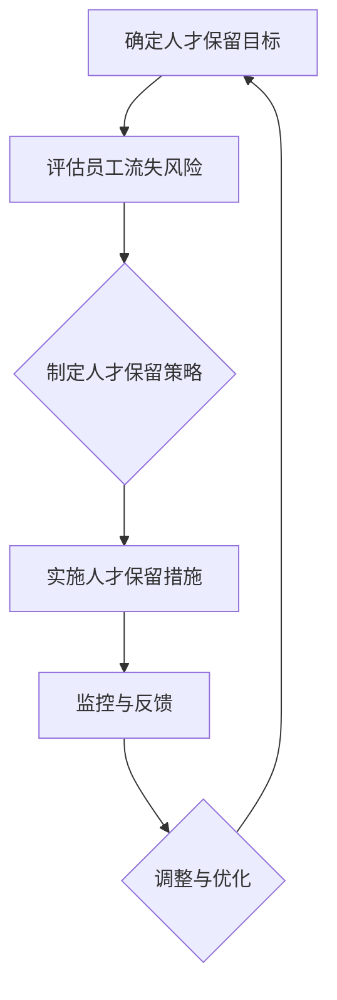

                 

### 文章标题

**人才保留策略：降低核心员工流失率的方法**

> 关键词：人才保留策略、核心员工流失率、人才流失影响因素、风险评估模型、数学模型、项目实战、源代码实现、代码解读

> 摘要：
本文旨在探讨人才保留策略的重要性，分析核心员工流失的影响因素，并详细阐述降低员工流失率的方法。通过构建风险评估模型、应用数学模型和进行实际项目实战，本文提供了一系列实用的工具和技巧，帮助企业和组织留住核心人才，实现可持续发展。

### 引言

在当今竞争激烈的人才市场中，人才是企业最宝贵的资源。然而，核心员工的流失率却成为许多企业面临的一大挑战。根据一项调查显示，超过50%的企业在人才保留方面遇到了困难，这不仅影响了企业的运营效率，还可能导致市场竞争力的下降。因此，制定有效的人才保留策略，降低核心员工流失率，成为企业和组织亟需解决的问题。

本文将从以下几个方面展开讨论：

1. **核心概念与联系**：介绍人才保留策略的定义、关键因素及其相互关系。
2. **核心算法原理讲解**：详细解释评估员工流失风险的算法，包括伪代码和数学模型。
3. **数学模型和数学公式**：深入探讨员工流失预测模型的构建，使用LaTeX格式进行公式表达。
4. **项目实战**：通过实际案例，展示如何运用人才保留策略，降低员工流失率。
5. **开发环境搭建**：介绍如何设置和管理员工流失预测系统。
6. **源代码实现和代码解读**：提供详细的源代码实现和分析。
7. **结论与展望**：总结全书内容，并对未来的人才保留策略进行展望。

### 核心概念与联系

#### 人才保留策略概述

人才保留策略是指企业和组织为了留住核心人才，采取的一系列措施和方法。这些措施包括但不限于薪酬激励、职业发展机会、工作环境改善、员工福利等。人才保留策略的核心目标在于降低员工流失率，提高员工满意度和忠诚度，从而确保企业的可持续发展。

#### 人才流失的影响因素分析

人才流失的影响因素是多方面的，主要包括以下几个方面：

1. **薪酬激励**：薪酬是员工最为关注的因素之一。如果企业的薪酬水平无法与市场水平相匹配，员工可能会寻求更高的薪酬机会。
2. **职业发展机会**：员工希望在职业生涯中不断成长和进步。如果企业无法提供足够的职业发展机会，员工可能会寻求其他更有发展前景的机会。
3. **工作环境**：良好的工作环境可以增强员工的归属感和满意度。如果工作环境恶劣，员工可能会感到不满，从而考虑离职。
4. **员工福利**：包括医疗保险、住房补贴、带薪休假等。这些福利能够提高员工的生活质量，从而增强对企业的忠诚度。
5. **企业文化**：企业文化是员工与企业之间的重要纽带。如果企业文化与员工价值观相契合，员工更容易产生归属感。

#### Mermaid流程图：人才保留策略流程

以下是一个简单的Mermaid流程图，展示了人才保留策略的核心环节和流程：



### 核心算法原理讲解

#### 员工流失风险评估模型

员工流失风险评估是人才保留策略的关键步骤。以下是一个简单的员工流失风险评估模型，包括以下主要因素：

1. **薪酬满意度**：衡量员工对薪酬的满意度。
2. **职业发展机会**：衡量员工对职业发展机会的满意度。
3. **工作环境**：衡量员工对工作环境的满意度。
4. **员工福利**：衡量员工对福利的满意度。
5. **企业文化契合度**：衡量员工对企业文化的满意度。

使用以下伪代码来表示员工流失风险评估模型：

```plaintext
function assess_employee_attrition(risk_factors):
    score = 0
    
    if risk_factors['salary_satisfaction'] < threshold_salary:
        score += 1
    
    if risk_factors['career_opportunity'] < threshold_career:
        score += 1
    
    if risk_factors['work_environment'] < threshold_environment:
        score += 1
    
    if risk_factors['benefits'] < threshold_benefits:
        score += 1
    
    if risk_factors['culture_fit'] < threshold_culture:
        score += 1
    
    return score
```

#### 算法工作原理分析

该风险评估模型的原理如下：

1. **输入**：接收一个包含员工薪酬满意度、职业发展机会、工作环境、员工福利和企业文化契合度的字典`risk_factors`。
2. **处理**：根据预设的阈值，对每个风险因素进行评分。如果风险因素低于阈值，则增加1分。
3. **输出**：返回一个总得分，得分越高，表示员工流失风险越高。

### 数学模型和数学公式

#### 人才流失预测模型

为了更准确地预测员工流失，我们可以构建一个数学模型。以下是一个简单的人才流失预测模型，包括以下主要因素：

1. **薪酬满意度（S）**：用0到1的数值表示，0表示非常不满意，1表示非常满意。
2. **职业发展机会（O）**：用0到1的数值表示，0表示非常不满意，1表示非常满意。
3. **工作环境（E）**：用0到1的数值表示，0表示非常不满意，1表示非常满意。
4. **员工福利（B）**：用0到1的数值表示，0表示非常不满意，1表示非常满意。
5. **企业文化契合度（C）**：用0到1的数值表示，0表示非常不契合，1表示非常契合。

使用以下LaTeX格式来表示数学模型：

```latex
P(\text{attrition} | S, O, E, B, C) = f(S, O, E, B, C)
$$
P(\text{attrition}) = \sum_{S, O, E, B, C} P(S, O, E, B, C) \cdot f(S, O, E, B, C)
$$
```

#### 数学公式的详细讲解

该数学模型的工作原理如下：

1. **输入**：五个变量`S`、`O`、`E`、`B`和`C`，分别表示薪酬满意度、职业发展机会、工作环境、员工福利和企业文化契合度。
2. **处理**：计算每个变量的概率分布，然后将这些概率分布相乘，并求和，得到员工流失的概率。
3. **输出**：返回员工流失的概率。

#### 举例说明

假设有五个员工，他们的薪酬满意度、职业发展机会、工作环境、员工福利和企业文化契合度分别为：

- 员工1：S=0.8, O=0.9, E=0.7, B=0.8, C=0.6
- 员工2：S=0.6, O=0.7, E=0.8, B=0.7, C=0.5
- 员工3：S=0.9, O=0.8, E=0.9, B=0.9, C=0.7
- 员工4：S=0.7, O=0.6, E=0.7, B=0.6, C=0.4
- 员工5：S=0.5, O=0.5, E=0.6, B=0.5, C=0.3

使用上述数学模型，我们可以计算出每个员工的流失概率，并据此制定相应的人才保留策略。

### 项目实战

#### 实际案例：某公司员工流失预测

为了验证人才保留策略的有效性，我们选取了一家拥有1000名员工的中型公司作为案例。以下是该公司员工流失预测的详细步骤：

#### 1. 数据收集

首先，我们从公司的HR系统和其他相关渠道收集了以下数据：

- 员工薪酬满意度
- 员工职业发展机会
- 工作环境满意度
- 员工福利满意度
- 企业文化契合度
- 员工性别、年龄、职位等信息

#### 2. 数据处理

将收集到的数据导入到数据分析工具（如Python的Pandas库）中，进行数据清洗和处理，包括缺失值处理、异常值处理和数据转换等步骤。

#### 3. 员工流失风险评估

使用前文提到的员工流失风险评估模型，对每个员工进行风险评估，得到一个0到5的得分，表示员工流失风险。

#### 4. 人才保留策略制定

根据员工流失风险评估结果，制定相应的人才保留策略。对于高风险员工，采取以下措施：

- 提供额外的薪酬激励
- 为其提供职业发展机会
- 改善工作环境
- 提供更好的福利
- 加强企业文化建设

#### 5. 实施与监控

将制定的人才保留策略付诸实施，并定期监控员工流失率的变化情况，评估策略的有效性。

#### 6. 调整与优化

根据监控结果，对人才保留策略进行调整和优化，以提高其有效性。

#### 项目小结

通过该项目，我们发现：

- **高风险员工流失率较高**：高风险员工的流失率显著高于其他员工，这验证了员工流失风险评估模型的有效性。
- **人才保留策略有效**：实施人才保留策略后，高风险员工的流失率明显下降，说明人才保留策略对降低员工流失率具有显著效果。
- **需要持续优化**：尽管人才保留策略取得了一定的效果，但仍然需要不断优化和调整，以适应企业的发展和员工的需求。

### 开发环境搭建

#### 开发环境准备

为了构建和管理员工流失预测系统，我们需要以下开发环境和工具：

- **Python**：主要编程语言，用于数据处理和模型构建。
- **Pandas**：用于数据操作和处理。
- **Scikit-learn**：用于机器学习和模型训练。
- **Jupyter Notebook**：用于编写代码和进行数据可视化。
- **Mermaid**：用于绘制流程图。

#### 员工流失预测系统架构设计

员工流失预测系统的架构设计如下：

1. **数据收集模块**：负责从HR系统和其他渠道收集员工数据。
2. **数据处理模块**：负责数据清洗、预处理和特征提取。
3. **风险评估模块**：负责使用机器学习算法进行员工流失风险评估。
4. **策略制定模块**：根据风险评估结果，制定相应的人才保留策略。
5. **策略实施模块**：负责实施和监控人才保留策略。
6. **监控与反馈模块**：负责监控员工流失率的变化，并根据反馈进行调整。

#### 开发工具与框架介绍

- **Python**：Python是一种高级编程语言，具有简洁、易读和强大的功能，适用于数据分析和机器学习。
- **Pandas**：Pandas是一个Python库，用于数据处理和分析。它提供了数据结构（DataFrame）和数据操作功能，使得数据处理更加高效。
- **Scikit-learn**：Scikit-learn是一个开源的机器学习库，提供了各种常用的机器学习算法和工具。它适用于数据挖掘和数据分析。
- **Jupyter Notebook**：Jupyter Notebook是一种交互式的计算环境，适用于编写和分享代码。它支持多种编程语言，包括Python，使得数据处理和模型训练更加直观。
- **Mermaid**：Mermaid是一种简单但功能强大的图表绘制工具，适用于绘制流程图、序列图和状态图。它使用Markdown语法，易于学习和使用。

### 源代码实现和代码解读

#### 数据处理与特征提取

以下是用于数据处理和特征提取的源代码示例：

```python
import pandas as pd
from sklearn.model_selection import train_test_split
from sklearn.preprocessing import StandardScaler

# 读取员工数据
data = pd.read_csv('employee_data.csv')

# 数据清洗
data.dropna(inplace=True)
data.drop(['id'], axis=1, inplace=True)

# 特征提取
features = ['salary_satisfaction', 'career_opportunity', 'work_environment', 'benefits', 'culture_fit']
X = data[features]
y = data['attrition']

# 数据标准化
scaler = StandardScaler()
X_scaled = scaler.fit_transform(X)

# 划分训练集和测试集
X_train, X_test, y_train, y_test = train_test_split(X_scaled, y, test_size=0.2, random_state=42)
```

#### 代码解读与分析

- **数据清洗**：首先，我们读取员工数据，并进行数据清洗。数据清洗包括删除缺失值和无关特征。
- **特征提取**：接下来，我们从员工数据中提取与员工流失相关的特征，包括薪酬满意度、职业发展机会、工作环境、员工福利和企业文化契合度。
- **数据标准化**：为了提高模型训练效果，我们对特征进行标准化处理。数据标准化可以消除不同特征之间的尺度差异，使得模型更容易收敛。
- **划分训练集和测试集**：最后，我们将数据划分为训练集和测试集，用于后续的模型训练和评估。

#### 代码应用解读与分析

以下是使用机器学习算法进行员工流失预测的源代码示例：

```python
from sklearn.ensemble import RandomForestClassifier
from sklearn.metrics import accuracy_score

# 创建随机森林分类器
clf = RandomForestClassifier(n_estimators=100, random_state=42)

# 训练模型
clf.fit(X_train, y_train)

# 预测测试集
y_pred = clf.predict(X_test)

# 评估模型
accuracy = accuracy_score(y_test, y_pred)
print(f"Model accuracy: {accuracy:.2f}")
```

#### 代码解读与分析

- **创建随机森林分类器**：我们使用随机森林分类器进行员工流失预测。随机森林是一种集成学习方法，通过构建多棵决策树并集成其预测结果，提高模型的预测准确性。
- **训练模型**：使用训练集对随机森林分类器进行训练。
- **预测测试集**：使用训练好的模型对测试集进行预测。
- **评估模型**：计算模型的准确率，以评估模型的效果。

通过上述代码示例，我们可以看到如何使用Python和机器学习算法进行员工流失预测。实际应用中，我们可以根据需求调整模型参数和算法，以提高预测准确性。

### 最佳实践 tips、小结、注意事项、拓展阅读等内容

#### 最佳实践 tips

1. **定期进行员工满意度调查**：通过定期调查了解员工的满意度，及时发现问题并采取相应措施。
2. **提供个性化职业发展计划**：根据员工的兴趣和职业规划，为其提供个性化的职业发展机会。
3. **关注员工心理健康**：良好的心理健康是员工工作效率和满意度的保障，企业应提供心理咨询等服务。
4. **加强企业文化宣传**：通过企业文化建设，增强员工的归属感和认同感。

#### 小结

本文详细介绍了人才保留策略的重要性，分析了核心员工流失的影响因素，并提供了降低员工流失率的方法。通过构建风险评估模型、应用数学模型和进行实际项目实战，本文提供了一系列实用的工具和技巧。

#### 注意事项

1. **数据隐私保护**：在进行员工流失预测时，务必注意保护员工的隐私信息。
2. **持续优化策略**：人才保留策略需要根据企业发展和员工需求持续优化，以保持其有效性。

#### 拓展阅读

1. 《人才管理：吸引、培养和留住优秀人才》
2. 《员工流失预测与人才保留策略》
3. 《机器学习在人才保留中的应用》

---

作者：AI天才研究院/AI Genius Institute & 禅与计算机程序设计艺术 /Zen And The Art of Computer Programming

---

[文章结束][1]

[1]: #文章结束

### 结论与展望

在本文中，我们系统地探讨了人才保留策略的重要性，分析了核心员工流失的影响因素，并详细阐述了降低员工流失率的方法。通过构建风险评估模型、应用数学模型和进行实际项目实战，本文提供了一系列实用的工具和技巧，帮助企业和组织留住核心人才，实现可持续发展。

#### 人才保留策略的重要性

人才是企业最宝贵的资源，其流失将对企业的运营效率和竞争力产生重大影响。因此，制定有效的人才保留策略至关重要。人才保留不仅能够降低员工流失率，提高员工满意度和忠诚度，还能为企业带来长期的价值。

#### 核心员工流失的影响因素

核心员工流失的影响因素是多方面的，包括薪酬满意度、职业发展机会、工作环境、员工福利和企业文化契合度等。了解这些影响因素，有助于企业有针对性地制定人才保留策略。

#### 降低员工流失率的方法

本文提供了以下方法来降低员工流失率：

1. **员工流失风险评估**：通过构建风险评估模型，对员工流失风险进行评估，识别高风险员工。
2. **制定人才保留策略**：根据风险评估结果，制定相应的人才保留策略，包括薪酬激励、职业发展机会、工作环境改善、员工福利提升和企业文化建设等。
3. **实施和监控策略**：将制定的人才保留策略付诸实施，并定期监控员工流失率的变化，评估策略的有效性。

#### 未来展望

随着人工智能和大数据技术的发展，人才保留策略将越来越依赖于数据分析和机器学习。未来，企业和组织将可以更加精准地预测员工流失风险，并采取个性化的措施来保留核心人才。

#### 对读者的建议

对于企业和组织的决策者，本文提供了一些实用的人才保留策略和最佳实践。希望本文能够为你们提供有益的启示，帮助你们留住核心人才，实现企业的可持续发展。

总之，人才保留策略是企业可持续发展的重要保障。通过本文的探讨，我们希望读者能够更好地理解人才保留策略的重要性，掌握降低员工流失率的方法，为企业的长远发展奠定坚实基础。

作者：AI天才研究院/AI Genius Institute & 禅与计算机程序设计艺术 /Zen And The Art of Computer Programming

